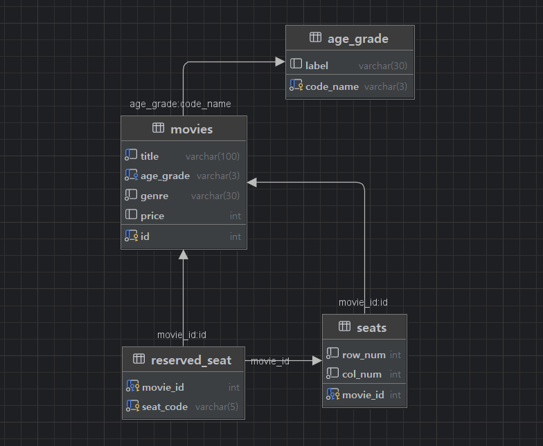

## 미니프로젝트 리펙토링

## 1. 프로젝트 개요

**프로젝트 명**: 콘솔 영화 관리자 시스템

**목표**
- DTO/DAO/Service/Controller 등 계층 분리로 유지보수성 강화
- DB 연동 구조로 확장성 확보
- 단일 책임 원칙 및 객체지향 설계 개선

**개발 환경**
- Java (JDK 21)
- IDE (IntelliJ)
- MySQL 8.0
- Docker

---

## 2. 주요 기능

1. **예매 등록**: 영화 선택 → 좌석 입력 → 유효성 체크 → 예매 등록
2. **예매 취소**: 예매된 영화 선택 → 좌석 입력 → 체크 → 예매 취소
3. **영화 추가**: 영화 정보 입력 후 등록
4. **영화 삭제**: 영화 목록에서 선택 후 삭제
5. **영화 목록**: 전체 영화 목록 및 좌석 정보 제공
6. **종료**: 프로그램 종료

---

## 3. 패키지 구조

```bash
mini_project/
│
├─ ConsoleUI.java                # 콘솔 입력 및 메뉴 흐름 제어
├─ MovieMain.java                # 메인 실행 클래스
├─ README.md
│
├─ common/
│   └─ DBUtil.java               # DB 연결 유틸리티
│
├─ controller/
│   └─ MoiveController.java      # 요청에 따른 서비스 기능 호출
│
├─ dto/
│   ├─ AgeGradeDTO.java          # 관람 등급 DTO
│   ├─ MovieDTO.java             # 영화 DTO
│   ├─ ReservedSeatDTO.java      # 예매 좌석 DTO
│   └─ SeatDTO.java              # 좌석 DTO
│
├─ repository/
│   ├─ AgeGradeDAO.java          # 관람 등급 DAO
│   ├─ MovieDAO.java             # 영화 DAO
│   ├─ ReservedSeatDAO.java      # 예매 좌석 DAO
│   └─ SeatDAO.java              # 좌석 DAO
│
├─ service/
│   ├─ MovieService.java         # 영화 관련 서비스
│   └─ SeatService.java          # 좌석 관련 서비스
│
└─ SQL/
    ├─ minimoviedb_create.sql    # DB 생성 스크립트
    └─ minimoviedb_query.sql     # DB 쿼리 예시
```

---

## 4. DB 설계

### 4.1 주요 테이블 구조

| 테이블명       | 설명             | 주요 컬럼                       |
|------------|------------------|---------------------------------|
| **movie**     | 영화 정보        | id, title, age_grade, ...    |
| **age_grade** | 관람 등급        | code_name, label           |
| **seat**      | 좌석 정보        | movie_id, row_num,  ...  |
| **reserved_seat** | 예매 코드        | movie_id, seat_code, ...   |


### 4.2 ERD



```bash
# ERD
[age_grade] ───< [movie ] >───< [seat ] >───< [reserved_seat]
```

### 4.3 DB 생성 및 확인

<details>
<summary><strong>SQL 쿼리문</strong></summary>
<div markdown="1">

```sql
/* 생성 */
CREATE DATABASE minimoviedb;
-- GRANT ALL PRIVILEGES on minimoviedb.* to 'star1431'@'%';
-- SHOW GRANTS FOR 'star1431'@'%';
USE minimoviedb;

SET FOREIGN_KEY_CHECKS = 0;
DROP TABLE IF EXISTS reserved_seat, seats, movies, age_grade;
SET FOREIGN_KEY_CHECKS = 1;


-- table : 관람등급
CREATE TABLE age_grade (
code_name	varchar(3) PRIMARY KEY,
label 		varchar(30)
);
INSERT into age_grade VALUE
('ALL', '전체 이용가'),
('R12', '12세 이용가'),
('R15', '15세 이용가'),
('R19', '청소년 관람불가');

-- table : 무비
CREATE TABLE movies (
id          int PRIMARY KEY AUTO_INCREMENT, -- 삭제 추가 반복되면 아이디는 계속 누적
title       varchar(100) UNIQUE NOT NULL,
age_grade   varchar(3) NOT NULL,
genre       varchar(30) NOT NULL,
price       int CHECK (price >= 0) DEFAULT 10000,
FOREIGN KEY (age_grade) REFERENCES age_grade(code_name) -- 외래키 제약
);
INSERT into movies VALUE
(null, '어벤져스-엔드게임', 'R15', '히어로', 12000),
(null, '범죄도시', 'R19', '액션', 13000),
(null, '겨울왕국', 'ALL', '애니메이션', 10000),
(null, '기생충', 'R15', '드라마', 11000),
(null, '인터스텔라', 'R12', 'SF', 11000);


-- table : 좌석
CREATE TABLE seats (
movie_id    int PRIMARY KEY NOT NULL,
row_num     int CHECK(10 > row_num > 0) NOT NULL DEFAULT 6,
col_num     int CHECK(10 > col_num > 0) NOT NULL DEFAULT 6,
FOREIGN KEY (movie_id) REFERENCES movies(id) ON DELETE CASCADE
);

INSERT into seats(movie_id,row_num,col_num) VALUE
(1, 5, 6),
(2, 6, 6),
(3, 5, 5),
(4, 4, 4),
(5, 6, 6);

-- table : 예약좌석 (영화id, 코드번호)
CREATE TABLE reserved_seat (
movie_id    INT NOT NULL,
seat_code   VARCHAR(5) NOT NULL,
PRIMARY KEY (movie_id, seat_code),  -- 중복예약 차단
FOREIGN KEY (movie_id) REFERENCES seats(movie_id) ON DELETE CASCADE -- 외래키 제약
);

INSERT INTO reserved_seat (movie_id, seat_code) VALUES
(1,'A1'),(1,'A2'),
(1,'B3');

INSERT INTO reserved_seat (movie_id, seat_code) VALUES
(3,'C1'),(3,'C2');

INSERT INTO reserved_seat (movie_id, seat_code) VALUES
(4,'A1'),(4,'C3'),
(4,'A2'),(4,'B4'),
(4,'D1'),(4,'C2');

INSERT INTO reserved_seat (movie_id, seat_code) VALUES
(5,'D1'),(5,'A1'),
(5,'B2'),(5,'C3'),
(5,'A2'),(5,'B3'),
(5,'C4'),
(5,'A3'),(5,'B4'),
(5,'A4'),(5,'B5'),
(5,'A5'),(5,'A6');

commit;
```

```sql
/* 확인 */
USE minimoviedb;
SELECT * FROM movies;
SELECT * FROM age_grade;
SELECT * FROM reserved_seat;

SELECT movie_id, group_concat(seat_code ORDER BY seat_code) FROM reserved_seat
GROUP BY movie_id;

-- 매핑확인
SELECT
    m.id, concat('M-', lpad(m.id, '4', 0)) as '영화 ID',
    m.title as '영화제목', ag.label as'관람등급',
    m.genre as '장르', m.price as '가격',
    rs.좌석합침 as '예매된 좌석'
FROM movies m
-- 관람등급
LEFT JOIN age_grade as ag
ON ag.code_name = m.age_grade
-- 예약좌석
LEFT JOIN (
    SELECT movie_id, group_concat(seat_code ORDER BY seat_code) as '좌석합침'
    FROM reserved_seat
    GROUP BY movie_id
) as rs
ON rs.movie_id = m.id;
```

</div>
</details>


---

## 5. 클래스 설계


### 5.1 클래스 계층

```bash
                    MovieMain   
                        ↑ 
                    consoleUI   
                        ↑ 
                  MoiveController 
                        ↑ 
            ┌───────────────────────┐
            │                       │
        MovieService            SeatService  
            ↑                       ↑ 
    ┌───────────────┐       ┌───────────────┐
AgeGradeDTO     MovieDTO SeatDTO   ReservedSeatDTO
AgeGradeDAO     MovieDAO SeatDAO   ReservedSeatDAO
    └───────────────┘       └───────────────┘
        └────────────────────────────┘
                        ↑
                      DBUtil
                        ↑  
                    minimovie DB                    
```

---

### MovieMain

* 프로그램 실행 진입점 (main 메서드)

<details>
<summary><strong>MovieMain.java</strong></summary>
<div markdown="1">

```java
package mini_project;

import java.util.Scanner;

public class MovieMain {
    static Scanner sc = new Scanner(System.in);
    static ConsoleUI consoleUI = new ConsoleUI();

    public static void main(String[] args) {
        boolean running = true;
        while (running) {
            consoleUI.consoleMenu();
            try {
                int choice = Integer.parseInt(sc.nextLine());
                switch (choice) {
                    case 1:
                        // 예매 등록
                        consoleUI.reserveFlow();
                        break;
                    case 2:
                        // 예매 취소
                        consoleUI.cancelFlow();
                        break;
                    case 3:
                        // 영화 추가
                        consoleUI.addFlow();
                        break;
                    case 4:
                        // 영화 삭제
                        consoleUI.removeFlow();
                        break;
                    case 5:
                        // 영화 목록
                        consoleUI.listFlow();
                        break;
                    case 6:
                        // 종료
                        consoleUI.endFlow();
                        running = false;
                        sc.close();
                        break;
                    default:
                        consoleUI.printError("입력");
                }
            } catch (NumberFormatException e) {
                System.out.println("❌ [" + e.getMessage() + "] 숫자가 아닙니다");
            }
        }
    }

}
```

</div>
</details>

---

### ConsoleUI

* input output 담당
* 콘솔 환경에서 사용자 입력 및 메뉴 흐름 제어

<details>
<summary><strong>ConsoleUI.java</strong></summary>
<div markdown="1">

```java
package mini_project;

import mini_project.controller.MoiveController;

import java.util.ArrayList;
import java.util.List;
import java.util.Map;
import java.util.Scanner;


/**
 * ConsoleUI (출력/입력 전담)
 * @author 정병천
 * @since 2025-09-17
 */
public class ConsoleUI {
    private final Scanner sc = new Scanner(System.in);
    private final MoiveController ctrl = new MoiveController();

    /* 공통출력 - 타이틀 */
    public void printTitle(String title) {
        System.out.println("\n" + "─".repeat(10) + "[ " + title + " ]" + "─".repeat(10));
    }

    /* 공통출력 - 에러메세지 */
    public void printError(String key) {
        switch (key) {
            case "입력" -> System.out.println("❌ 잘못된 입력입니다.");
            case "코드" -> System.out.println("❌ 코드 형식이 올바르지 않습니다.");
            case "예매" -> System.out.println("❌ 이미 예매된 자리 입니다.");
            case "없음" -> System.out.println("❌ 없는 좌석번호 입니다.");
            case "예매없음" -> System.out.println("❌ 예매된 영화가 없습니다.");
            case "정보없음" -> System.out.println("❌ 해당 정보가 없습니다.");
            default -> System.out.println("❌ 오류");
        }
    }

    /* 공통출력 - 성공 */
    public void printSuccess(String msg) {
        System.out.println("✅ " + msg + " 완료");
    }

    public void printSuccess(String msg, String code) {
        System.out.println("✅ " + msg + " 완료: " + code);
    }

    /* 공통유틸 - 이전이동 */
    public boolean askBack(String kind) {
        while (true) {
            switch (kind) {
                case "이전" -> System.out.print("이전으로? (y/n): ");
                case "처음" -> System.out.print("처음으로? (y/n): ");
                case "재입력" -> System.out.print("재입력? (y/n): ");
                case "삭제" -> System.out.print("삭제? (y/n): ");
                default -> System.out.print("(y/n): ");
            }
            String val = sc.nextLine().trim().toLowerCase();
            if (val.equals("y")) return true;
            if (val.equals("n")) return false;
            printError("입력");
        }
    }

    /* 좌석판 출력 (컨트롤러 seatGrid) */
    private void printSeatGrid(Map<String, String[]> grid) {
        System.out.println("┌───────────────────────────────────────┐");
        System.out.println("│                Screen                 │");
        System.out.println("└───────────────────────────────────────┘");
        System.out.println("━━━━━━━━━━━━━━━━━━━━━━━━━━━━━━━━━━━━━━━━━");
        for (Map.Entry<String, String[]> e : grid.entrySet()) {
            System.out.print(e.getKey() + "열 |  ");
            for (String cell : e.getValue()) System.out.print("[" + cell + "] ");
            System.out.println();
        }
    }

    /* 영화-좌석 보드 출력 */
    private void printMovieBoard() {
        List<Map<String, Object>> rows = ctrl.movieBoardData();
        System.out.println("영화 목록 |  (등록된 영화 수: " + rows.size() + ")");
        int i = 1;
        for (Map<String, Object> r : rows) {
            System.out.printf("[%02d] : 제목: %s | 장르: %s | 등급: %s | 가격: %,d원 | 전체좌석: %d | 남은좌석: %d%n",
                    i++,
                    r.get("title"),
                    r.get("genre"),
                    r.get("type"),
                    (int) r.get("price"),
                    (int) r.get("total"),
                    (int) r.get("left")
            );
        }
    }

    /* 영화-좌석 보드 출력 */
    private boolean printReservedBoard() {
        List<Map<String, Object>> rows = ctrl.reservedBoardData();
        if (rows.isEmpty()) {
            printError("예매없음");
            return false;
        }
        System.out.println("예매된 영화 목록");
        int i = 1;
        for (Map<String, Object> r : rows) {
            System.out.printf("[%02d] : 제목: %s | 장르: %s | 등급: %s | 가격: %,d원 | 전체좌석: %d | 남은좌석: %d%n",
                    i++,
                    r.get("title"),
                    r.get("genre"),
                    r.get("type"),
                    (int) r.get("price"),
                    (int) r.get("total"),
                    (int) r.get("left")
            );
        }
        return true;
    }

    /* 영화-좌석 단건 출력 */
    private void printMovieInfo(int id) {
        Map<String, Object> info = ctrl.movieInfoData(id);
        if (info == null || info.isEmpty()) {
            printError("정보없음");
            return;
        }
        System.out.printf("제목: %s | 장르: %s | 등급: %s | 가격: %,d원 | 전체좌석: %d | 남은좌석: %d%n",
                info.get("title"), info.get("genre"), info.get("type"),
                (int) info.get("price"), (int) info.get("total"), (int) info.get("left"));
    }

    /* 메뉴 */
    public void consoleMenu() {
        printTitle("영화 관리자 시스템");
        System.out.println("1. 예매 등록            2. 예매 취소");
        System.out.println("3. 영화 추가            4. 영화 삭제");
        System.out.println("5. 영화 목록            6. 종료");
        System.out.print("\n메뉴를 선택하세요: ");
    }

    /* 플로우 */
    // 1) 예매 등록
    public void reserveFlow() {
        printTitle("예매 등록 : 영화 선택");
        printMovieBoard();

        int id;
        while (true) {
            System.out.print("\n예매할 영화 번호 입력해주세요 (ex: 1 or 01)\n입력: ");
            String input = sc.nextLine().trim();
            try {
                id = ctrl.selectMovie("read", input);
            } catch (Exception e) {
                id = -1;
            }
            if (id == -1) printError("입력");
            else break;
        }
        printSuccess("선택");

        printTitle("예매 등록 : 좌석 예매");
        printMovieInfo(id);
        printSeatGrid(ctrl.seatGrid(id));

        while (true) {
            System.out.print("\n예매할 좌석 번호 입력해주세요 (예: A1, E6)\n입력: ");
            String code = sc.nextLine().trim().toUpperCase();
            if (!ctrl.codeCheck(id, code)) {
                printError("코드");
                continue;
            }
            boolean ok = ctrl.reserve(id, code);
            if (ok) {
                printSuccess("예매", code);
                break;
            } else {
                printError("예매");
            }
        }
    }

    // 2) 예매 취소
    public void cancelFlow() {
        printTitle("예매 취소 : 영화 선택");
        if (!printReservedBoard()) return;

        int id;
        while (true) {
            System.out.print("\n예매 취소할 영화 번호 입력해주세요 (ex: 1 or 01)\n입력: ");
            String input = sc.nextLine().trim().toUpperCase();
            try {
                id = ctrl.selectMovie("cancel", input);
            } catch (Exception e) {
                id = -1;
            }
            if (id == -1) printError("입력");
            else break;
        }
        printSuccess("선택");

        printTitle("예매 취소 : 좌석 취소");
        printMovieInfo(id);
        // printSeatGrid(ctrl.seatGrid(id));
        System.out.println(ctrl.reservedCodes(id));


        while (true) {
            System.out.print("\n예매 취소할 좌석 번호 입력해주세요 (예: A1, E6)\n입력: ");
            String code = sc.nextLine().trim().toUpperCase();
            if (!ctrl.codeCheck(id, code)) {
                printError("코드");
                continue;
            }
            boolean ok = ctrl.cancel(id, code);
            if (ok) {
                printSuccess("취소", code);
                break;
            } else {
                printError("없음");
            }
        }
    }

    // 3) 영화 추가
    public void addFlow() {
        printTitle("영화 등록 : 입력");
        String title, ageCode, genre;
        int price, rows, cols;

        while (true) {
            while (true) {
                System.out.print("제목입력: ");
                title = sc.nextLine().trim();
                if (title.isBlank()) printError("입력");
                else break;
            }
            while (true) {
                Map<String, String> opts = ctrl.ageOptions();
                int i = 1;
                for (Map.Entry<String, String> e : opts.entrySet()) {
                    String label = e.getValue();
                    System.out.printf("[%d] %s, ", i++, label);
                }
                List<String> codes = new ArrayList<>(opts.keySet());

                System.out.print("\n관람등급 번호 입력: ");
                String ageInput = sc.nextLine().trim().toUpperCase();
                int typeNum;
                try {
                    typeNum = Integer.parseInt(ageInput);
                    if (typeNum < 1 || typeNum > opts.size()) {
                        printError("입력");
                    } else {
                        ageCode = codes.get(typeNum - 1);
                        break;
                    }
                } catch (NumberFormatException e) {
                    printError("입력");
                }
            }
            while (true) {
                System.out.print("장르입력: ");
                genre = sc.nextLine().trim();
                if (genre.isBlank()) printError("입력");
                else break;
            }
            while (true) {
                System.out.print("가격입력: ");
                try {
                    price = Integer.parseInt(sc.nextLine().trim());
                    break;
                } catch (NumberFormatException e) {
                    printError("입력");
                }
            }
            while (true) {
                try {
                    System.out.print("좌석 행(rows, 1~9): ");
                    rows = Integer.parseInt(sc.nextLine().trim());
                    if (rows <= 0 || rows >= 10) {
                        throw new NumberFormatException();
                    }
                    System.out.print("좌석 열(cols, 1~9): ");
                    cols = Integer.parseInt(sc.nextLine().trim());
                    if (cols <= 0 || cols >= 10) {
                        throw new NumberFormatException();
                    }
                    break;
                } catch (NumberFormatException e) {
                    printError("입력");
                }
            }

            System.out.printf("입력된 값: [ 제목:%s, 등급:%s, 장르:%s, 가격: %,d원, 좌석: %dx%d ]%n",
                    title, ctrl.ageLabel(ageCode), genre, price, rows, cols
            );

            if (!askBack("재입력")) break;
        }

        boolean ok = ctrl.add(title, ageCode, genre, price, rows, cols);
        if (ok) printSuccess("등록");
        else printError("실패");
    }

    // 4) 영화 삭제
    public void removeFlow() {
        printTitle("영화 삭제 : 영화 선택");
        printMovieBoard();

        int id;
        while (true) {
            System.out.print("\n삭제할 영화 번호 입력해주세요 (ex: 1 or 01)\n입력: ");
            String input = sc.nextLine().trim();
            try {
                id = ctrl.selectMovie("read", input);
            } catch (Exception e) {
                id = -1;
            }
            if (id == -1) {
                printError("입력");
            } else {
                System.out.println("선택한 영화");
                printMovieInfo(id);
                if (askBack("삭제")) break;
            }
        }

        boolean ok = ctrl.remove(id);
        if (ok) printSuccess("삭제");
        else printError("실패");
    }

    // 5) 영화 목록
    public void listFlow() {
        while (true) {
            printTitle("영화 목록");
            printMovieBoard();

            int id;
            while (true) {
                System.out.print("\n좌석표를 확인할 영화 번호 입력해주세요 (ex: 1 or 01)\n입력: ");
                String input = sc.nextLine().trim();
                try {
                    id = ctrl.selectMovie("read", input); // ← MoiveController: "read"
                } catch (Exception e) {
                    id = -1;
                }
                if (id == -1) printError("입력");
                else break;
            }

            printTitle("영화 목록 - 좌석표");
            printMovieInfo(id);
            printSeatGrid(ctrl.seatGrid(id));

            if (!askBack("이전")) break;
        }
    }

    // 종료
    public void endFlow() {
        printTitle("시스템을 종료 합니다.");
    }
}

```

</div>
</details>

---

### MoiveController

* 영화,좌석 서비스 제어
* 요청에 따른 서비스 기능 호출

<details>
<summary><strong>MoiveController.java</strong></summary>
<div markdown="1">

```java
package mini_project.controller;

import mini_project.dto.MovieDTO;
import mini_project.service.MovieService;
import mini_project.service.SeatService;

import java.util.ArrayList;
import java.util.LinkedHashMap;
import java.util.List;
import java.util.Map;

/**
 * 영화,좌석 서비스 제어
 * @author 정병천
 * @since 2025-09-17
 */
public class MoiveController {
    private final MovieService ms = new MovieService();
    private final SeatService ss = new SeatService();

    public MoiveController() {
    }

    /** 영화 + 좌석 보드 데이터 */
    public List<Map<String, Object>> movieBoardData() {
        Map<Integer, MovieDTO> map = ms.movieAll();
        List<Map<String, Object>> rows = new ArrayList<>();

        for (Map.Entry<Integer, MovieDTO> e : map.entrySet()) {
            int id = e.getKey();
            MovieDTO mDTO = e.getValue();
            Map<String, Object> row = new LinkedHashMap<>();
            row.put("id", id);
            row.put("title", mDTO.getTitle());
            row.put("genre", mDTO.getGenre());
            row.put("type", ms.ageLabel(mDTO.getType()));
            row.put("price", mDTO.getPrice());
            row.put("total", ss.seatCounts(id, "total"));
            row.put("left", ss.seatCounts(id, "left"));
            rows.add(row);
        }
        return rows;
    }

    /** 예매된영화 + 좌석 보드 데이터 */
    public List<Map<String, Object>> reservedBoardData() {
        Map<Integer, MovieDTO> map = ms.movieAll();
        List<Map<String, Object>> rows = new ArrayList<>();

        for (Map.Entry<Integer, MovieDTO> e : map.entrySet()) {
            int id = e.getKey();
            // 예약안된 영화 거름
            if (ss.seatCounts(id, "reserve") < 1) continue;
            MovieDTO mDTO = e.getValue();
            Map<String, Object> row = new LinkedHashMap<>();
            row.put("id", id);
            row.put("title", mDTO.getTitle());
            row.put("genre", mDTO.getGenre());
            row.put("type", mDTO.getType());
            row.put("price", mDTO.getPrice());
            row.put("total", ss.seatCounts(id, "total"));
            row.put("left", ss.seatCounts(id, "left"));
            rows.add(row);
        }
        return rows;
    }

    /** 영화 + 좌석 단건 데이터 */
    public Map<String, Object> movieInfoData(int id) {
        MovieDTO mDTO = ms.movieInfo(id);
        Map<String, Object> info = new LinkedHashMap<>();
        info.put("id", id);
        info.put("title", mDTO.getTitle());
        info.put("genre", mDTO.getGenre());
        info.put("type", mDTO.getType());
        info.put("price", mDTO.getPrice());
        info.put("total", ss.seatCounts(id, "total"));
        info.put("left", ss.seatCounts(id, "left"));
        return info;
    }

    /** 해당영화 좌석 목록 */
    public Map<String, String[]> seatGrid(int id) {
        return ss.seatGrid(id);
    }

    /** 관람등급 옵션 목록 */
    public Map<String, String> ageOptions() {
        return ms.ageOptions();
    }

    /** 영화추가 */
    public boolean add(String title, String code, String genre, int price, int rows, int cols) {
        boolean check = false;
        int pk_id = ms.addMovie(title, code, genre, price);
        if (pk_id > 0) {
            check = ss.addSeat(pk_id, rows, cols);
        }
        return check;
    }

    /** 인덱스 선택 */
    public int selectMovie(String caseStr, String numStr) {
        int idx = Integer.parseInt(numStr) - 1;
        // var = map<k,y>
        var map = ms.movieAll();
        switch (caseStr) {
            case "read": {
                if (idx >= map.size()) return -1;
                int i = 0;
                for (Integer id : map.keySet()) {
                    if (i++ == idx) return id;
                }
                break;
            }
            case "cancel":
                // 예약된 영화만 id값 배열담음
                List<Integer> rervIdList = new ArrayList<>();
                for (Integer id : map.keySet()) {
                    if (ss.seatCounts(id, "reserve") > 0) rervIdList.add(id);
                }
                if (idx >= rervIdList.size()) return -1;
                return rervIdList.get(idx);
            default:
                return -1;
        }
        return -1;
    }

    /** 영화삭제 */
    public boolean remove(int id) {
        boolean check = false;
        check = ms.removeMovie(id);
        return check;
    }

    /** 좌석코드 확인 */
    public boolean codeCheck(int id, String code) {
        return ss.codeCheck(id, code);
    }

    /** 좌석 예매 */
    public boolean reserve(int id, String code) {
        return ss.reserve(id, code);
    }

    /** 예매 취소 */
    public boolean cancel(int id, String code) {
        return ss.cancel(id, code);
    }

    /** 예매코드 리스트 */
    public List<String> reservedCodes(int id) {
        return ss.reservedCodes(id);
    }

    /** age label 반환 */
    public String ageLabel(String code) {
        return ms.ageLabel(code);
    }

}

```

</div>
</details>

---

### MovieService

* 영화,관람등급 DTO,DAO 서비스 로직

<details>
<summary><strong>MovieService.java</strong></summary>
<div markdown="1">

```java
package mini_project.service;

import mini_project.dto.AgeGradeDTO;
import mini_project.dto.MovieDTO;
import mini_project.repository.MovieDAO;
import mini_project.repository.AgeGradeDAO;

import java.util.LinkedHashMap;
import java.util.List;
import java.util.Map;

/**
 * 영화,관람등급 DTO,DAO 서비스
 * @author 정병천
 * @since 2025-09-17
 */
public class MovieService {
    private final MovieDAO mDAO = new MovieDAO();
    private final AgeGradeDAO aDAO = new AgeGradeDAO();

    public MovieService() {
        // 기본생성자
    }

    /** 등급 label 반환 */
    public String ageLabel(String code) {
        AgeGradeDTO dto = aDAO.selectByCode(code);
        return (dto != null) ? dto.getLabel() : null;
    }

    /** 등급 list */
    public Map<String, String> ageOptions() {
        List<AgeGradeDTO> list = aDAO.selectAll();
        Map<String, String> map = new LinkedHashMap<>();
        if (list != null) {
            for (AgeGradeDTO item : list) {
                map.put(item.getCode(), item.getLabel());
            }
        }
        return map;
    }


    /** 영화정보 - id,전체 */
    public Map<Integer, MovieDTO> movieAll() {
        return mDAO.selectAllMap();
    }

    /** 영화정보 - 단건 */
    public MovieDTO movieInfo(int id) {
        return mDAO.selectById(id);
    }

    /** 영화추가 */
    public int addMovie(String title, String type, String genre, int price) {
        int returnId = -1;
        returnId = mDAO.insert(new MovieDTO(title, type, genre, price));
        return returnId;
    }

    /** 영화삭제 */
    public boolean removeMovie(int id) {
        return mDAO.delete(id);
    }
}
```

</div>
</details>

---

### SeatService

* 좌석,예매좌석 DTO,DAO 서비스 로직

<details>
<summary><strong>SeatService.java</strong></summary>
<div markdown="1">

```java
package mini_project.service;


import mini_project.dto.ReservedSeatDTO;
import mini_project.repository.ReservedSeatDAO;
import mini_project.dto.SeatDTO;
import mini_project.repository.SeatDAO;

import java.util.ArrayList;
import java.util.LinkedHashMap;
import java.util.List;
import java.util.Map;

/**
 * 좌석,예매좌석 DTO,DAO 서비스
 * @author 정병천
 * @since 2025-09-17
 */
public class SeatService {
    private final ReservedSeatDAO rDAO = new ReservedSeatDAO();
    private final SeatDAO sDAO = new SeatDAO();

    public SeatService() {

    }

    /** 영화 - 좌석 생성 */
    public boolean addSeat(int id, int rows, int cols) {
        return sDAO.insert(new SeatDTO(id, rows, cols));
    }

    /** 영화 - 좌석정보 */
    public Map<String, String[]> seatGrid(int id) {
        SeatDTO sDTO = sDAO.selectById(id);
        List<ReservedSeatDTO> rervList = rDAO.selectByMovieId(id);

        Map<String, String[]> grid = new LinkedHashMap<>();
        int rows = sDTO.getRows();
        int cols = sDTO.getCols();

        // 좌석 생성 A=[A1,..], B=[B1...]
        int changeNum = (int) 'A'; // 아스키 = 65
        for (int i = 0; i < rows; i++) {
            String label = String.valueOf((char) (changeNum + i));
            String[] arr = new String[cols];
            for (int j = 0; j < cols; j++) {
                arr[j] = label + (j + 1); // A1
            }
            grid.put(label, arr);
        }

        // 예약좌석 마스킹
        for (ReservedSeatDTO item : rervList) {
            String code = item.getSeatCode();
            if (code == null) continue; // null 건너뜀

            String key = code.substring(0, 1);
            int idx = Integer.parseInt(code.substring(1)) - 1;
            String[] row = grid.get(key);
            if (idx >= 0 && idx < row.length) row[idx] = "__";
        }

        return grid;
    }


    /** id - 좌석정보 */
    public int seatCounts(int id, String caseStr) {
        List<ReservedSeatDTO> rervList = rDAO.selectByMovieId(id);
        SeatDTO sDTO = sDAO.selectById(id);
        switch (caseStr) {
            case "total":
                return sDTO.getTotal();
            case "reserve":
                return rervList.size();
            case "left":
                return sDTO.getTotal() - rervList.size();

        }
        return -1;
    }


    /** 예약 정보 */
    public List<String> reservedCodes(int id) {
        List<String> codelist = new ArrayList<>();
        List<ReservedSeatDTO> rervList = rDAO.selectByMovieId(id);
        for (ReservedSeatDTO item : rervList) {
            codelist.add(item.getSeatCode());
        }
        return codelist;
    }

    /** 좌석 코드 유효성 */
    public boolean codeCheck(int id, String code) {
        SeatDTO s = sDAO.selectById(id);
        int rows = s.getRows();
        int cols = s.getCols();
        char fchar = code.charAt(0);
        int codeKey = (int) fchar;
        int codeVal = Integer.parseInt(code.substring(1));

        // DB저장된 row,col 값보다 크면 false
        if (codeKey < (int) 'A' && codeVal < 1) return false;
        else if (codeKey <= ((int) 'A' + rows) && codeVal > cols) return false;
        else return true;
    }


    /** 예매 등록 */
    public boolean reserve(int id, String code) {
        if (!codeCheck(id, code)) return false;

        List<ReservedSeatDTO> rervList = rDAO.selectByMovieId(id);
        if (rervList.isEmpty()) {
            return rDAO.insert(new ReservedSeatDTO(id, code));
        }
        int cnt = 0;
        for (ReservedSeatDTO item : rervList) {
            if (code.equals(item.getSeatCode())) cnt++;
        }
        if (cnt > 0) return false;
        else return rDAO.insert(new ReservedSeatDTO(id, code));
    }

    /** 예매 취소 */
    public boolean cancel(int id, String code) {
        if (!codeCheck(id, code)) return false;

        List<ReservedSeatDTO> rervList = rDAO.selectByMovieId(id);
        if (rervList.isEmpty()) return false;

        int cnt = 0;
        for (ReservedSeatDTO item : rervList) {
            if (code.equals(item.getSeatCode())) cnt++;
        }
        if (cnt == 0) return false;
        else return rDAO.delete(id, code);
    }

}
```

</div>
</details>

---

### DTO 패키지

* AgeGradeDTO : 관람등급 DTO
* MovieDTO : 영화정보 DTO
* ReservedSeatDTO : 예매좌석 코드 DTO
* SeatDTO : 좌석 DTO

> 데이터 생성 객체


<details>
<summary><strong>AgeGradeDTO.java</strong></summary>
<div markdown="1">

```java
package mini_project.dto;

/**
 * 관람등급 DTO
 * @author 정병천
 * @since 2025-09-17
 */
public class AgeGradeDTO {
    private String code;   // 'ALL', 'R12', 'R15', 'R19' (PK)
    private String label;  // '전체 이용가' 등

    public AgeGradeDTO() {
    }

    public AgeGradeDTO(String code, String label) {
        this.code = code;
        this.label = label;
    }

    public String getCode() {
        return code;
    }

    public void setCode(String code) {
        this.code = code;
    }

    public String getLabel() {
        return label;
    }

    public void setLabel(String label) {
        this.label = label;
    }

    @Override
    public String toString() {
        return "AgeGradeDTO{" +
                "code='" + code + '\'' +
                ", label='" + label + '\'' +
                '}';
    }
}
```

</div>
</details>

<details>
<summary><strong>MovieDTO.java</strong></summary>
<div markdown="1">

```java
package mini_project.dto;

import java.util.Objects;

/**
 * 영화 DTO
 * @author 정병천
 * @since 2025-09-17
 */
public class MovieDTO {
    private int movieId;        // 영화 고유 ID
    private String title;       // 영화명
    private String type;        // 관람등급
    private String genre;       // 장르
    private int price;          // 가격

    public MovieDTO() {
    }

    public MovieDTO(String title, String type, String genre, int price) {
        this.title = title;
        this.type = type;
        this.genre = genre;
        this.price = price;
    }

    public int getMovieId() {
        return movieId;
    }

    public void setMovieId(int movieId) {
        this.movieId = movieId;
    }

    public String getTitle() {
        return title;
    }

    public void setTitle(String title) {
        this.title = title;
    }

    public String getType() {
        return type;
    }

    public void setType(String type) {
        this.type = type;
    }

    public String getGenre() {
        return genre;
    }

    public void setGenre(String genre) {
        this.genre = genre;
    }

    public int getPrice() {
        return price;
    }

    public void setPrice(int price) {
        this.price = price;
    }

    @Override
    public String toString() {
        return "Movie{" +
                "id='" + movieId + '\'' +
                ", title='" + title + '\'' +
                ", type='" + type + '\'' +
                ", genre='" + genre + '\'' +
                ", price=" + price +
                '}';
    }

    @Override
    public boolean equals(Object o) {
        if (o == null || getClass() != o.getClass()) return false;
        MovieDTO movieDTO = (MovieDTO) o;
        return Objects.equals(movieId, movieDTO.movieId);
        // return Objects.equals(id, movie.id) && 
        //         Objects.equals(title, movie.title) && 
        //         Objects.equals(type, movie.type) && 
        //         Objects.equals(genre, movie.genre);
    }

    @Override
    public int hashCode() {
        return Objects.hash(movieId);
        // return Objects.hash(id, title, type, genre);
    }
}
```

</div>
</details>

<details>
<summary><strong>ReservedSeatDTO.java</strong></summary>
<div markdown="1">

```java
package mini_project.dto;

/**
 * 예매좌석 DTO
 * @author 정병천
 * @since 2025-09-17
 */
public class ReservedSeatDTO {
    private int movieId;
    private String seatCode;

    public ReservedSeatDTO() {
    }

    public ReservedSeatDTO(int movieId, String seatCode) {
        this.movieId = movieId;
        this.seatCode = seatCode;
    }

    public int getMovieId() {
        return movieId;
    }

    public void setMovieId(int movieId) {
        this.movieId = movieId;
    }

    public String getSeatCode() {
        return seatCode;
    }

    public void setSeatCode(String seatCode) {
        this.seatCode = seatCode;
    }

    @Override
    public String toString() {
        return "ReservedSeatDTO{" +
                "movieId=" + movieId +
                ", seatCode='" + seatCode + '\'' +
                '}';
    }
}
```

</div>
</details>

<details>
<summary><strong>SeatDTO.java</strong></summary>
<div markdown="1">

```java
package mini_project.dto;

/**
 * 좌석 DTO
 * @author 정병천
 * @since 2025-09-17
 */
public class SeatDTO {
    private int movieId;
    private int rows;
    private int cols;

    public SeatDTO() {
    }

    public SeatDTO(int movieId, int rows, int cols) {
        this.movieId = movieId;
        this.rows = rows;
        this.cols = cols;
    }

    public int getMovieId() {
        return movieId;
    }

    public void setMovieId(int movieId) {
        this.movieId = movieId;
    }

    public int getRows() {
        return rows;
    }

    public void setRows(int rows) {
        this.rows = rows;
    }

    public int getCols() {
        return cols;
    }

    public void setCols(int cols) {
        this.cols = cols;
    }

    public int getTotal() {
        return (rows * cols);
    }
}
```

</div>
</details>

---

### repository 패키지

* AgeGradeDAO : 관람등급 DAO
* MovieDAO : 영화정보 DAO
* ReservedSeatDAO : 예매좌석 코드 DAO
* SeatDAO : 좌석 DAO

> DB 데이터 접근 객체

<details>
<summary><strong>AgeGradeDAO.java</strong></summary>
<div markdown="1">

```java
package mini_project.repository;

import mini_project.common.DBUtil;
import mini_project.dto.AgeGradeDTO;

import java.sql.Connection;
import java.sql.PreparedStatement;
import java.sql.ResultSet;
import java.util.ArrayList;
import java.util.List;

/**
 * 관람등급 DAO
 * @author 정병천
 * @since 2025-09-17
 */
public class AgeGradeDAO {

    /** 관람등급 단건 선택 */
    public AgeGradeDTO selectByCode(String code) {
        String sql = "SELECT code_name, label FROM age_grade WHERE code_name = ?";
        AgeGradeDTO aDTO = null;
        try (
                Connection conn = DBUtil.getConnection();
                PreparedStatement ps = conn.prepareStatement(sql)
        ) {
            ps.setString(1, code);
            try (ResultSet rs = ps.executeQuery()) {
                if (rs.next()) {
                    aDTO = new AgeGradeDTO(
                            rs.getString("code_name"),
                            rs.getString("label")
                    );
                }
            }
        } catch (Exception e) {
            System.out.println("관람등급 선택 error :  " + e.getMessage());
        }
        return aDTO;
    }

    /** 관람등급 목록 */
    public List<AgeGradeDTO> selectAll() {
        String sql = "SELECT code_name, label FROM age_grade";
        List<AgeGradeDTO> list = new ArrayList<>();
        try (
                Connection conn = DBUtil.getConnection();
                PreparedStatement ps = conn.prepareStatement(sql);
                ResultSet rs = ps.executeQuery()
        ) {
            while (rs.next()) {
                list.add(
                        new AgeGradeDTO(
                                rs.getString("code_name"),
                                rs.getString("label")
                        )
                );
            }
        } catch (Exception e) {
            System.out.println("관람등급 전체선택 error : " + e.getMessage());
        }
        return list;
    }

    /** 추가(임시) */
    public boolean insert(AgeGradeDTO dto) {
        String sql = "INSERT INTO age_grade(code_name, label) VALUES (?,?)";
        int result = 0;
        try (
                Connection conn = DBUtil.getConnection();
                PreparedStatement ps = conn.prepareStatement(sql)
        ) {
            ps.setString(1, dto.getCode());
            ps.setString(2, dto.getLabel());
            result = ps.executeUpdate();
        } catch (Exception e) {
            System.out.println("관람등급 추가 error : " + e.getMessage());
        }
        return result > 0;
    }

    /** 변경(임시) */
    public boolean update(AgeGradeDTO dto) {
        String sql = "UPDATE age_grade SET label=? WHERE code_name=?";
        int result = 0;
        try (
                Connection conn = DBUtil.getConnection();
                PreparedStatement ps = conn.prepareStatement(sql)
        ) {
            ps.setString(1, dto.getLabel());
            ps.setString(2, dto.getCode());
            result = ps.executeUpdate();
        } catch (Exception e) {
            System.out.println("관람등급 변경 error : " + e.getMessage());
        }
        return result > 0;
    }

    /** 삭제(임시) */
    public boolean delete(String code) {
        String sql = "DELETE FROM age_grade WHERE code_name=?";
        int result = 0;
        try (Connection conn = DBUtil.getConnection();
             PreparedStatement ps = conn.prepareStatement(sql)) {
            ps.setString(1, code);
            result = ps.executeUpdate();
        } catch (Exception e) {
            System.out.println("관람등급 삭제 error : " + e.getMessage());
        }
        return result > 0;
    }
}
```

</div>
</details>

<details>
<summary><strong>MovieDAO.java</strong></summary>
<div markdown="1">

```java
package mini_project.repository;

import mini_project.common.DBUtil;
import mini_project.dto.MovieDTO;

import java.sql.Connection;
import java.sql.PreparedStatement;
import java.sql.ResultSet;
import java.sql.SQLException;
import java.util.ArrayList;
import java.util.HashMap;
import java.util.List;
import java.util.Map;

/**
 * 영화 DAO
 * @author 정병천
 * @since 2025-09-17
 */
public class MovieDAO {

    /** 삽입 */
    public int insert(MovieDTO movie) {
        String sql = "INSERT INTO movies(title, age_grade, genre, price) VALUES (?, ?, ?, ?)";
        int result = 0;
        try (
                Connection conn = DBUtil.getConnection();
                PreparedStatement ps = conn.prepareStatement(sql, PreparedStatement.RETURN_GENERATED_KEYS)
        ) {
            ps.setString(1, movie.getTitle());
            ps.setString(2, movie.getType());
            ps.setString(3, movie.getGenre());
            ps.setInt(4, movie.getPrice());
            result = ps.executeUpdate();
            if (result > 0) {
                try (ResultSet rs = ps.getGeneratedKeys()) {
                    if (rs.next()) movie.setMovieId(rs.getInt(1));
                }
            }
        } catch (Exception e) {
            System.out.println("영화 삽입 error : " + e.getMessage());
        }
        return movie.getMovieId();
    }

    /** 삭제 */
    public boolean delete(int id) {
        String sql = "DELETE FROM movies WHERE id = ?";
        int result = 0;
        try (
                Connection conn = DBUtil.getConnection();
                PreparedStatement ps = conn.prepareStatement(sql)
        ) {
            ps.setInt(1, id);
            result = ps.executeUpdate();
        } catch (Exception e) {
            System.out.println("영화 삭제 error : " + e.getMessage());
        }
        return result > 0;
    }

    /** 변경 */
    public boolean update(MovieDTO movie) {
        String sql = "UPDATE movies SET title=?, age_grade=?, genre=?, price=? WHERE id=?";
        int result = 0;
        try (
                Connection conn = DBUtil.getConnection();
                PreparedStatement ps = conn.prepareStatement(sql)
        ) {
            ps.setString(1, movie.getTitle());
            ps.setString(2, movie.getType());
            ps.setString(3, movie.getGenre());
            ps.setInt(4, movie.getPrice());
            ps.setInt(5, movie.getMovieId());
            ps.executeUpdate();
        } catch (Exception e) {
            System.out.println("영화 변경 error : " + e.getMessage());
        }
        return result > 0;
    }

    /** 단건조회(id) */
    public MovieDTO selectById(int id) {
        String sql = "SELECT * FROM movies WHERE id = ?";
        MovieDTO mDTO = null;
        try (
                Connection conn = DBUtil.getConnection();
                PreparedStatement ps = conn.prepareStatement(sql)
        ) {
            ps.setInt(1, id);
            try (ResultSet rs = ps.executeQuery()) {
                if (rs.next()) mDTO = resultSet(rs);
            }
        } catch (Exception e) {
            System.out.println("영화 단건조회(id) error : " + e.getMessage());
        }
        return mDTO;
    }

    /** 전체조회 list(DTO) */
    public List<MovieDTO> selectAll() {
        String sql = "SELECT * FROM movies";
        List<MovieDTO> list = new ArrayList<>();
        try (
                Connection conn = DBUtil.getConnection();
                PreparedStatement ps = conn.prepareStatement(sql);
                ResultSet rs = ps.executeQuery()
        ) {
            while (rs.next()) {
                list.add(resultSet(rs));
            }
        } catch (Exception e) {
            System.out.println("영화 전체조회 error : " + e.getMessage());
        }
        return list;
    }

    /** 전체조회 map(id,DTO) */
    public Map<Integer, MovieDTO> selectAllMap() {
        String sql = "SELECT * FROM movies";
        Map<Integer, MovieDTO> map = new HashMap<>();
        try (
                Connection conn = DBUtil.getConnection();
                PreparedStatement ps = conn.prepareStatement(sql);
                ResultSet rs = ps.executeQuery()
        ) {
            while (rs.next()) {
                map.put(rs.getInt("id"), resultSet(rs));
            }
        } catch (Exception e) {
            System.out.println("영화 전체조회 error : " + e.getMessage());
        }
        return map;
    }

    /** ResultSet -> DTO 변환 */
    private MovieDTO resultSet(ResultSet rs) throws SQLException {
        MovieDTO mDTO = new MovieDTO();
        mDTO.setMovieId(rs.getInt("id"));
        mDTO.setTitle(rs.getString("title"));
        mDTO.setType(rs.getString("age_grade"));
        mDTO.setGenre(rs.getString("genre"));
        mDTO.setPrice(rs.getInt("price"));

        return mDTO;
    }
}
```

</div>
</details>

<details>
<summary><strong>ReservedSeatDAO.java</strong></summary>
<div markdown="1">

```java
package mini_project.repository;

import mini_project.common.DBUtil;
import mini_project.dto.ReservedSeatDTO;

import java.sql.Connection;
import java.sql.PreparedStatement;
import java.sql.ResultSet;
import java.util.ArrayList;
import java.util.List;

/**
 * 예매좌석 DAO
 * @author 정병천
 * @since 2025-09-17
 */
public class ReservedSeatDAO {

    /** 무비id 기준으로 예약좌석 집합 */
    public List<ReservedSeatDTO> selectByMovieId(int movieId) {
        List<ReservedSeatDTO> list = new ArrayList<>();
        String sql = "SELECT * FROM reserved_seat WHERE movie_id = ?";
        try (
                Connection conn = DBUtil.getConnection();
                PreparedStatement ps = conn.prepareStatement(sql)
        ) {
            ps.setInt(1, movieId);
            try (ResultSet rs = ps.executeQuery()) {
                while (rs.next()) {
                    ReservedSeatDTO seat = new ReservedSeatDTO(
                            rs.getInt("movie_id"),
                            rs.getString("seat_code")
                    );
                    list.add(seat);
                }
            }
        } catch (Exception e) {
            System.out.println("예매 조회 error : " + e.getMessage());
        }
        return list;
    }

    /** 삽입 */
    public boolean insert(ReservedSeatDTO reservedSeat) {
        String sql = "INSERT INTO reserved_seat (movie_id, seat_code) VALUES (?, ?)";
        int result = 0;
        try (
                Connection conn = DBUtil.getConnection();
                PreparedStatement ps = conn.prepareStatement(sql)
        ) {
            ps.setInt(1, reservedSeat.getMovieId());
            ps.setString(2, reservedSeat.getSeatCode());
            result = ps.executeUpdate();
        } catch (Exception e) {
            System.out.println("예매 삽입 error : " + e.getMessage());
        }
        return result > 0;
    }

    /** 삭제 */
    public boolean delete(int movieId, String seatCode) {
        String sql = "DELETE FROM reserved_seat WHERE movie_id = ? AND seat_code = ?";
        int result = 0;
        try (
                Connection conn = DBUtil.getConnection();
                PreparedStatement ps = conn.prepareStatement(sql)
        ) {
            ps.setInt(1, movieId);
            ps.setString(2, seatCode);
            result = ps.executeUpdate();
        } catch (Exception e) {
            System.out.println("예매 삭제 error : " + e.getMessage());
        }
        return result > 0;
    }
}
```

</div>
</details>

<details>
<summary><strong>SeatDAO.java</strong></summary>
<div markdown="1">

```java
package mini_project.repository;

import mini_project.common.DBUtil;
import mini_project.dto.SeatDTO;

import java.sql.Connection;
import java.sql.PreparedStatement;
import java.sql.ResultSet;
import java.sql.SQLException;

/**
 * 좌석 DAO
 * @author 정병천
 * @since 2025-09-17
 */
public class SeatDAO {

    /** 삽입 */
    public boolean insert(SeatDTO sDTO) {
        String sql = "INSERT INTO seats (movie_id, row_num, col_num) VALUES (?, ?, ?)";
        int result = 0;
        try (
                Connection conn = DBUtil.getConnection();
                PreparedStatement ps = conn.prepareStatement(sql)
        ) {
            ps.setInt(1, sDTO.getMovieId());
            ps.setInt(2, sDTO.getRows());
            ps.setInt(3, sDTO.getCols());
            result = ps.executeUpdate();
        } catch (Exception e) {
            System.out.println("좌석 삽입 error : " + e.getMessage());
        }
        return result > 0;
    }

    /** 삭제 */
    public void delete(int movieId) {
        String sql = "DELETE FROM seats WHERE movie_id = ?";
        try (
                Connection conn = DBUtil.getConnection();
                PreparedStatement ps = conn.prepareStatement(sql)
        ) {
            ps.setInt(1, movieId);
            ps.executeUpdate();
        } catch (Exception e) {
            System.out.println("좌석 삭제 error : " + e.getMessage());
        }
    }

    /** 단건조회(id) */
    public SeatDTO selectById(int id) {
        String sql = "SELECT * FROM seats WHERE movie_id = ?";
        SeatDTO sDTO = null;
        try (
                Connection conn = DBUtil.getConnection();
                PreparedStatement ps = conn.prepareStatement(sql)
        ) {
            ps.setInt(1, id);
            try (ResultSet rs = ps.executeQuery()) {
                if (rs.next()) sDTO = resultSet(rs);
            }
        } catch (Exception e) {
            System.out.println("좌석 단건조회(id) error : " + e.getMessage());
        }
        return sDTO;
    }

    /** ResultSet -> DTO 변환 */
    private SeatDTO resultSet(ResultSet rs) throws SQLException {
        SeatDTO sDTO = new SeatDTO();
        sDTO.setMovieId(rs.getInt("movie_id"));
        sDTO.setRows(rs.getInt("row_num"));
        sDTO.setCols(rs.getInt("col_num"));

        return sDTO;
    }
}
```

</div>
</details>

---

### DBUtil

* DB 연결 및 자원 관리 유틸리티

<details>
<summary><strong>DBUtil.java</strong></summary>
<div markdown="1">

```java
package mini_project.common;

import java.sql.Connection;
import java.sql.DriverManager;
import java.sql.PreparedStatement;
import java.sql.ResultSet;
import java.sql.SQLException;

/**
 * DB 커넥션 유틸
 * @author 정병천
 * @since 2025-09-17
 */
public class DBUtil {
    static final String url = "jdbc:mysql://localhost:3306/minimoviedb";

    public static Connection getConnection() throws ClassNotFoundException, SQLException {
        String user = "star1431";
        String password = "star1431";
        return DriverManager.getConnection(url, user, password);
    }


    public static void close(Connection conn) {
        if (conn != null) {
            try {
                conn.close();
            } catch (SQLException e) {
                throw new RuntimeException(e);
            }
        }
    }

    public static void close(PreparedStatement ps) {
        if (ps != null) {
            try {
                ps.close();
            } catch (SQLException e) {
                throw new RuntimeException(e);
            }
        }
    }

    public static void close(ResultSet rs) {
        if (rs != null) {
            try {
                rs.close();
            } catch (SQLException e) {
                throw new RuntimeException(e);
            }
        }
    }
}

```

</div>
</details>

---

## 실행 방법

1. DB 생성 및 쿼리 실행
2. `MovieMain.java` 실행

---
