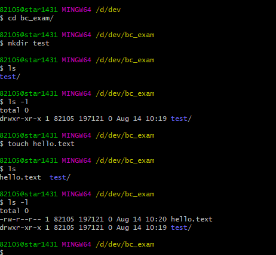

# [ 1주차 - 0814 ] 스터디 내용

```bash
    금일 커리큘럼
        ├ 09:00 ~ 12:00 Git 설치 & JDK 설치 및 환경설정
        └ 13:00 ~ 18:00 Git & GitHub 기본 개념,Git 기본 명령어 실습 (add, commit, push)
```


## 1. git

#### Git이란?
Git = 분산 버전 관리 시스템(Distributed Version Control System)
<br> 즉 형상관리 툴

**주요 특징**
- **버전 관리**: 파일의 변경 이력을 추적하고 관리
- **분산형**: 중앙 서버 없이도 로컬에서 완전한 버전 관리 가능
- **협업**: 여러 개발자가 동시에 작업할 수 있도록 지원
- **백업**: 코드의 안전한 보관과 복구 가능

#### Git의 주요 개념

**1. Repository (저장소)**
- **Local Repository**: 내 컴퓨터에 있는 Git 저장소
- **Remote Repository**: GitHub, GitLab 등 원격 서버의 저장소

**2. Working Directory, Staging Area, Repository**

```bash
Working Directory → Staging Area → Local Repository → Remote Repository
      (작업공간)        (준비영역)       (로컬저장소)     (원격저장소)
        ↓                ↓                 ↓               ↓
      파일 수정      →   git add    →   git commit  →  git push
```

**3. 주요 용어**
- **Commit**: 변경사항을 저장소에 기록하는 것
- **Branch**: 독립적인 개발 라인
- **Merge**: 다른 브랜치의 변경사항을 합치는 것
- **Clone**: 원격 저장소를 로컬로 복사
- **Pull**: 원격 저장소의 최신 변경사항을 가져오기
- **Push**: 로컬 변경사항을 원격 저장소에 업로드


#### 1.1 git bash

Git Bash 명령어 (리눅스와 동일한 명령어)

* ```pwd``` : 현재 디렉토리(폴더) 경로 출력
* ```cd``` : 디렉토리 이동
* ```ls``` : 현재 디렉토리의 파일/폴더 목록 보기
* ```ls -l``` : 파일/폴더 상세 정보 보기
* ```ls -a``` : 숨김 파일/폴더까지 모두 보기
* ```whoami``` : 현재 로그인한 사용자 확인
* ```date``` : 현재 날짜와 시간 출력
* ```cat <파일명>``` : 파일 내용 출력
* ```clear``` : 화면 내용 지우기
* ```mkdir <폴더명>``` : 새 폴더 만들기
* ```touch <파일명>``` : 새 파일 만들기
* ```rm <파일명>``` : 파일 삭제
* ```rm -r <폴더명>``` : 폴더와 그 안의 내용 삭제
* ```which <명령어>``` : 명령어의 실행 파일 경로 확인
* ```echo <내용>``` : 내용삽입 ```echo "내용입력삽입" > test.txt```



```bash
#상위루트
cd ..
#현재루트 기준 vscode열기
code .
```


## 2. git 설정하기

```bash
#깃 컨피그 확인
git config

#깃 전역 네임, 메일 설정 (커밋시 표시됨)
git config --global user.name "이름"
git config --global user.email "ㅁㅁㅁ@ㅁㅁㅁ"

#깃 설정한거 확인
git config --list

# Windows와 Mac은 줄바꿈 문자(CRLF, LF)가 다르므로, 이를 해결하기 위해 설정
git config --global core.autocrlf true
git config --global core.autocrlf input
```


## etc.

* OS : 하드웨어와 소프트웨어를 사용자가 편리하게 컴퓨터를 사용할 수 있도록 관리운영 해주는 운영시스템

* 리눅스 : 무료오픈소스 운영체제. 
    - 서버 운영, 개발 환경 구축, 그리고 특정 하드웨어에 대한 맞춤 설정 등 서버 돌리는데 적합한 OS