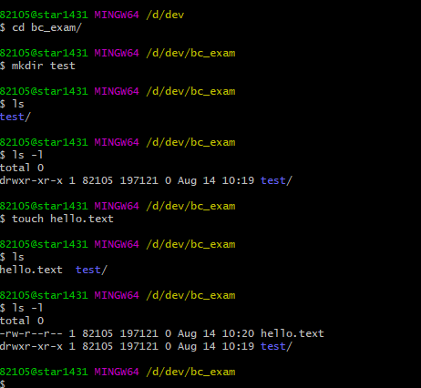

# [ 1주차 - 0814 ] 스터디 내용

```bash
    금일 커리큘럼
        ├ 09:00 ~ 12:00 Git 설치 & 환경설정
        └ 13:00 ~ 18:00 Git & GitHub 기본 개념,Git 기본 명령어 실습 (add, commit, push)
```


## 1. git

### Git이란?
Git = 분산 버전 관리 시스템(Distributed Version Control System)
<br> 즉 형상관리 툴

**주요 특징**
- **버전 관리**: 파일의 변경 이력을 추적하고 관리
- **분산형**: 중앙 서버 없이도 로컬에서 완전한 버전 관리 가능
- **협업**: 여러 개발자가 동시에 작업할 수 있도록 지원
- **백업**: 코드의 안전한 보관과 복구 가능

### Git의 주요 개념

**1. Repository (저장소)**
- **Local Repository**: 내 컴퓨터에 있는 Git 저장소
- **Remote Repository**: GitHub, GitLab 등 원격 서버의 저장소

**2. Working Directory, Staging Area, Repository**

```bash
Working Directory → Staging Area → Local Repository → Remote Repository
      (작업공간)        (준비영역)       (로컬저장소)     (원격저장소)
        ↓                ↓                 ↓               ↓
      파일 수정      →   git add    →   git commit  →  git push
```

**3. 주요 용어**
- **Commit**: 변경사항을 저장소에 기록하는 것
- **Branch**: 독립적인 개발 라인
- **Merge**: 다른 브랜치의 변경사항을 합치는 것
- **Clone**: 원격 저장소를 로컬로 복사
- **Pull**: 원격 저장소의 최신 변경사항을 가져오기
- **Push**: 로컬 변경사항을 원격 저장소에 업로드


### 1.1 git bash

Git Bash 명령어 (리눅스와 동일한 명령어)

* ```pwd``` : 현재 디렉토리(폴더) 경로 출력
* ```cd``` : 디렉토리 이동
* ```ls``` : 현재 디렉토리의 파일/폴더 목록 보기
* ```ls -l``` : 파일/폴더 상세 정보 보기
* ```ls -a``` : 숨김 파일/폴더까지 모두 보기
* ```whoami``` : 현재 로그인한 사용자 확인
* ```date``` : 현재 날짜와 시간 출력
* ```cat <파일명>``` : 파일 내용 출력
* ```clear``` : 화면 내용 지우기
* ```mkdir <폴더명>``` : 새 폴더 만들기
* ```touch <파일명>``` : 새 파일 만들기
* ```rm <파일명>``` : 파일 삭제
* ```rm -r <폴더명>``` : 폴더와 그 안의 내용 삭제
* ```which <명령어>``` : 명령어의 실행 파일 경로 확인
* ```echo <내용>``` : 내용삽입 ```echo "내용입력삽입" > test.txt```



```bash
#상위루트
cd ..
#현재루트 기준 vscode열기
code .
```

---

## 2. git 설정하기

### 2.1 깃 기본설정
```bash
#깃 컨피그 확인
git config

#깃 전역 네임, 메일 설정 (커밋시 표시됨)
git config --global user.name "이름"
git config --global user.email "ㅁㅁㅁ@ㅁㅁㅁ"

# 브런치 기본 메인으로
git config --global init.defaultBranch main


#깃 설정한거 확인
git config --list

# Windows와 Mac은 줄바꿈 문자(CRLF, LF)가 다르므로, 이를 해결하기 위해 설정
# window
git config --global core.autocrlf true
# mac
git config --global core.autocrlf input
```

### 2.2 깃 저장소 활용
```bash
# 해당 루트에 깃 생성
git init

# 임시 파일추가
echo "# Hello Git" > README.md

# 변경사항 스테이징
git add README.md
# or
git add .
# or
git add --all

# 깃 커밋
git commit -m "커밋내용"

# 커밋로그 확인
git log

# 깃상태 보기
git status
```


### 2.3 깃 원격저장소 연결
```bash
# 연동
git remote add origin https://github.com/<사용자명>/<저장소이름>.git

#연결된 원격 저장소 확인
git remote -v

# 원격저장소에 푸쉬
git push -u origin <브랜치명>

# 메인 ex
git branch -M main
git push -u origin main

# 그이후 커밋푸쉬
git add .
git commit -m "내용"
git push
```


### 2.4 깃 클론
```bash
# 클론
git clone https://github.com/<사용자명>/<저장소이름>.git

# 클론 후 해당폴더 경로 지정
cd <폴더명>

# 풀 (git pull = git fetch + git merge 즉, 원격 변경사항을 가져와 자동 병합)
# git fetch origin
git pull origin main
```

### 2.5 fork (저장소 복사)

* GitHub에서 오른쪽 상단 Fork 버튼 클릭
* 복제해서 쓰고싶을때 사용함


### 2.6 브랜치 생성 및 이동
```bash
# swicth 이동 / -c는 생성
git switch -c <뉴브랜치명>
#or
git branch <뉴브랜치명>

# 이동
git switch <브랜치명>

#목록 확인
gti branch

# 브랜치 삭제 (다른브랜치로이동후)
git branch -d <브랜치명>

# 해당 브랜치 커밋
git push origin <브랜치명>
```


### 2.7 풀리퀘스트 (포크 -> 원본저장소 반영요청)
* Fork한 저장소를 clone 후 새로운 브랜치 생성해서 파일추가 및 수정
* 그다음 변경사항 커밋 및 푸쉬 후 깃허브에서 컴페어 풀리퀘스트 요청


### 2.8 fork <-> PR 팀프로젝트 시 흐름도
```
Fork + PR 협업 흐름

원본저장소 ─ fork ─→ 내GitHub저장소 ─ clone ─→ 로컬저장소
    ↑                                            │
    │                                            │ 브랜치생성
    │                                            │ 코드수정
    │                                            │ commit & push
    │                                            ↓
    │                                       내GitHub저장소
    │                                       (생성브랜치)
    │                                            │
    │                                            │ PR 요청
    │                                            ↓
    └────────── merge ←────── Pull Request ←─────┘
              (코드리뷰)
```

1. 원본 저장소 → Fork → 내 GitHub 저장소
2. 내 저장소를 clone → 로컬 작업
3. 새 브랜치 생성 → 수정 후 commit & push
4. 내 GitHub 저장소에서 Pull Request 요청
5. 원본 저장소 관리자가 코드 리뷰 후 merge


### fork 원본 최신반영
```bash
# 1. 원본 저장소를 upstream으로 추가 (최초 1회만)
git remote add upstream [원본저장소URL]

# 2. 원본 저장소의 최신 변경사항 가져오기
git fetch upstream

# 3. main 브랜치로 이동
git checkout main

# 4. 원본의 main 브랜치를 현재 브랜치에 병합
git merge upstream/main

# 5. 변경사항을 자신의 fork에 푸시
git push origin main
```

---

## etc.

* OS : 하드웨어와 소프트웨어를 사용자가 편리하게 컴퓨터를 사용할 수 있도록 관리운영 해주는 운영시스템

* 리눅스 : 무료오픈소스 운영체제. 
    - 서버 운영, 개발 환경 구축, 그리고 특정 하드웨어에 대한 맞춤 설정 등 서버 돌리는데 적합한 OS