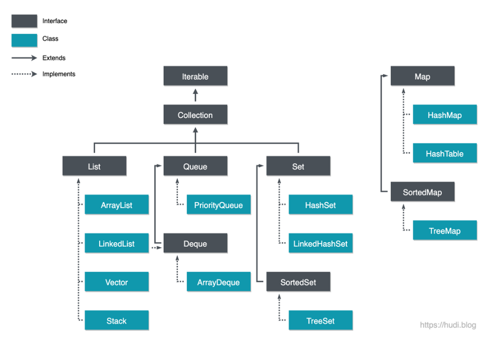

# [ 3주차 - 0828 ] 스터디 내용

```bash
    금일 커리큘럼
        ├ 09:00 ~ 12:00 자바 프로그래밍 기초 (System 클래스, Wrapper 클래스)
        └ 13:00 ~ 18:00 자바 프로그래밍 기초 (컬렉션 프레임워크 : list, set, map)
```


## 1. System 클래스


### 입출력 스트림

```java
import java.util.Scanner;

public class Exam {
    Scanner scanner = new Scanner(System.in);

    public static void main(String[] args) {
        // 표준 출력
        System.out.println("일반 출력");
        System.err.println("에러 출력"); // 빨간색으로 나옴

        // 표준 입력
        Scanner scanner = new Scanner(System.in);
        System.out.print("이름입력: ");
        String name = scanner.nextLine();
        System.out.println("반갑습니다. " + name + "님!");
        scanner.close();
    }
}
```

### 시스템 정보와 유틸

```java
import java.util.Arrays;

public class Exam {
    Scanner scanner = new Scanner(System.in);

    public static void main(String[] args) {
        // 현재 시간 (밀리초)
        long currentMillis = System.currentTimeMillis();
        System.out.println("현재 시간(밀리초): " + currentMillis);

        // 나노초 (더 정밀한 시간 측정)
        long nanoTime = System.nanoTime();
        System.out.println("나노시간: " + nanoTime);

        // 시간 측정 예제
        long start = System.currentTimeMillis();
        // 시간이 걸리는 작업
        for(int i = 0; i < 1000000; i++) {
            Math.sqrt(i);
        }
        long end = System.currentTimeMillis();
        System.out.println("실행 시간: " + (start - end) + "ms");

        // 시스템 프로퍼티
        System.out.println("Java 버전: " + System.getProperty("java.version"));
        System.out.println("OS: " + System.getProperty("os.name"));
        System.out.println("사용자 홈: " + System.getProperty("user.home"));
        System.out.println("현재 디렉토리: " + System.getProperty("user.dir"));

        // 환경 변수
        String path = System.getenv("PATH");
        System.out.println("PATH: " + path);

        // 배열 복사 (native 메소드로 빠름)
        int[] src = {1, 2, 3, 4, 5};
        int[] dest = new int[5];
        /*
         *  System.arraycopy(원본 배열, 원본시작idx, 대상 배열, 대상배열시작idx, 총갯수);
         *  다른방식 : .clone() , Arrays.copyOf() 있음.
         */
        System.arraycopy(src, 0, dest, 0, src.length);
        System.out.println("복사된 배열: " + Arrays.toString(dest));

        // int[] _copy1 = src.clone();
        // int[] _copy2 = Arrays.copyOf(src, src.length);

        // 가비지 컬렉션 제안 (강제 실행 아님)
        System.gc();

        // 프로그램 종료
        // System.exit(0); // 정상 종료
        // System.exit(1); // 비정상 종료
    }
}
```
```bash
# 실행 결과
현재 시간(밀리초): 1756343576345
나노시간: 64499055241400
실행 시간: 5ms
Java 버전: 21.0.8
OS: Windows 10
사용자 홈: C:\Users\{사용자명}
현재 디렉토리: D:\dev\backend\backend
```

---

## 2. Wrapper 클래스

> 래퍼 클래스는 기본형을 객체로 감싸서 컬렉션/제네릭 등 객체지향적인 구조를 담을 수 있게 해준다.

| 기본형 (Primitive) | 래퍼 클래스 (Wrapper Class) |
| --------------- | ---------------------- |
| `byte`          | `Byte`                 |
| `short`         | `Short`                |
| `int`           | `Integer`              |
| `long`          | `Long`                 |
| `float`         | `Float`                |
| `double`        | `Double`               |
| `char`          | `Character`            |
| `boolean`       | `Boolean`              |


* 박싱 : 기본타입을 객체타입으로 바꾸는 작업
* 언박싱 : 객체타입을 기본타입으로 바꾸는 작업

```java
public class Exam {
    public static void main(String[] args) {
        // 1. byte → Byte
        byte _b = 10;
        Byte byteObj = _b;  // 오토 박싱
        
        // 2. short → Short
        short _s = 20;
        Short shortObj = _s;

        // 3. int → Integer
        int _i = 100;
        Integer intObj = _i;

        // 4. long → Long
        long _l = 100_000;
        Long longObj = _l;

        // 5. float → Float
        float _f = 3.14f;
        Float floatObj = _f;

        // 6. double → Double
        double _d = 3.141592;
        Double doubleObj = _d;

        // 7. char → Character
        char _c = 'A';
        Character charObj = _c;
        
        // 8. boolean → Boolean
        boolean _bool = true;
        Boolean boolObj = _bool;
        
        // 9. 언박싱 예시
        int i2 = 10;
        Integer intObj2 = i2;
        int num = intObj2; //  Integer → int 언박싱
        
        // 10. 문자열 변환 예시
        String str1 = "123";
        String str2 = "true";
        int parseInt = Integer.parseInt(str1);
        String parseStr = Integer.toString(parseInt);

        boolean parseBol =  Boolean.parseBoolean(str2);

        // 11. 진법 변환
        System.out.println(Integer.toBinaryString(10));  // "1010"
        System.out.println(Integer.toOctalString(10));   // "12"
        System.out.println(Integer.toHexString(10));     // "a"

        // 12. 다른 진법 파싱
        int binary = Integer.parseInt("1010", 2);  // 10
        int octal = Integer.parseInt("12", 8);     // 10
        int hex = Integer.parseInt("A", 16);       // 10

        // 13. 유용한 상수
        System.out.println("int 최대값: " + Integer.MAX_VALUE); // int 최대값: 2147483647
        System.out.println("int 최소값: " + Integer.MIN_VALUE); // int 최소값: -2147483648
        System.out.println("int 크기: " + Integer.SIZE + "비트"); // int 크기: 32비트

        // 14. 비교
        Integer a = 127;
        Integer b = 127;
        Integer c = 128;
        Integer d = 128;

        System.out.println(a == b);     // true (-128~127은 캐싱)
        System.out.println(c == d);     // false (캐싱 범위 초과)
        System.out.println(c.equals(d)); // true (값 비교)
        
    }
}
```

> [!WARING]
> Integer : -128~127 범위 값은 캐싱, 그 외는 새 객체 생성 <br>
> 범위를 벗어나면 == 비교 시 false가 될 수 있음 <br>
> 항상 equals() 메소드로 값을 비교하는 것이 안전


---


## 3. 컬렉션 프레임워크

### 3.1 설명
* 컬렉션 프레임 워크 : 자바에서 데이터집합을 효율적으로 처리되게 설계된 표준화 방법
* 컬렉션 프레임워크 핵심 : 데이터를 저장, 검색, 조작, 통신할 때 일관된 접근 방식 제공


### 3.2 자료구조의 필요성

1. **효율적 데이터 관리** : 프로그래밍에서 데이터를 효율적으로 관리하여야 함
    - 컬렉션 프레임워크는 데이터를 체계적으로 관리할 수 있도록 도와준다.
2. **성능 최적화** : 다양항 자료구조 사용함으로써 특정 작업에 최적화된 성능을 얻음
3. **재사용 및 유지보수** : 일관된 인터페이스를 제공하여 재사용,유지보수 용이하게 함
4. **오류 방지** : 일관된 인터페이스,제너릭을 사용하여 타입오류 방지하고 안정성 확보

### 3.3 주요 인터페이스

1. 컬렉션 인터페이스
    - `List` : 순서가 있는 데이터의 집합. 중복 허용 O
        - `ArrayList`, `LinkedList`

    - `Set` : 순서를 유지하지 않음. 중복 허용 x
        - `HashSet`, `TreeSet`

    - `Queue` : FIFO (퍼스트인-퍼스트아웃) 구조 컬렉션
        - `LinkedList`, `PriorityQueue`

2. 맵 인터페이스
    - `Map` : 키와 값 쌍으로 데이터를 저장 (=json 동일한 개념)
        - `HashMap`, `TreeMap`, `LinkedHashMap`


### 3.4 이터레이터
* 컬렉션에 저장된 요소 읽거나 제거, 컬렉션 구조와 관계없이 동일한 방식으로 데이터 처리
* 순차적 접근 : 컬렉션 요소를 순서대로 접근
* 안정한 요소 제거 : iterator의 `remove()` 메서드 사용해서 요소 제거
* 단방향 이동 : 컬렉션 요소의 앞에서 뒤로만 이동하여 접근 (0 ~ length), 역방향 불가


### 3.5 이터레이터 지원 클래스

* List : `ArrayList`, `LinkedList`
* Set : `HashSet`, `TreeSet`
* Map : `HashMap`, `TreeMap`


### ArrayList 제네릭,이터레이터 확인 예제

```java
import java.util.ArrayList;
import java.util.Arrays;
import java.util.Iterator;

public class colExam() {
    public static void main(String[] args) {

        // 1. <> 제네릭 사용없이 하면 자료꺼낼때 형변환 강제로 해야되는 단점을 가짐.
        ArrayList list1 = new ArrayList();
        list1.add(1);
        list1.add(" 123 ");
        list1.add(new Exam());
        // list1.get(1).trim(); // 부모타입으로 자식 접근 안됨
        String _test = ((String)list1.get(1)).trim();
        System.out.println("제네릭없는 Array get(1)\n" + _test);

        System.out.println("-".repeat(8));

        // 2. <> 제네릭 사용
        ArrayList<String> list2 = new ArrayList<>();
        list2.add("123");
        // list2.add(11); // 스트링 선언으로 정수타입 삽입 불가능
        list2.add("안녕");
        list2.add("하세요!");
        list2.add("삭제해보기");

        System.out.println("list2 배열:" + Arrays.toString(list2.toArray()));
        System.out.println("list2 랭스:" + list2.size());

        list2.remove("삭제해보기"); // 또는 list2.remove(3);
        System.out.println("list2 삭제후 배열:" + list2); // toString 오버라이딩 되어있음.

        System.out.println("-".repeat(8));
        
        // 3. 이터레이터 써보기
        ArrayList<String> list3 = new ArrayList<>();
        list3.add("abc");
        list3.add("def");
        Iterator<String> iter3 = list3.iterator();

        System.out.println("hasNext()로 출력");
        while (iter3.hasNext()) {
            System.out.println(iter3.next());
        }

        System.out.println("향상된for문으로 출력");
        for (String item : list3) {
            System.out.println(item);
        }
        
        System.out.println("-".repeat(8));
    }
}

```
```bash
# 실행 결과
제네릭없는 Array get(1)
123
--------
list2 배열:[123, 안녕, 하세요!, 삭제해보기]
list2 랭스:4
list2 삭제후 배열:[123, 안녕, 하세요!]
--------
hasNext()로 출력
abc
def
향상된for문으로 출력
abc
def
--------
```

### List 심플 예제 - 중복허용 O

```java
import java.util.ArrayList;
import java.util.Arrays;
import java.util.List;

public class Exam {
    public static void main(String[] args) {

        List<String> list1 = new ArrayList<>();

        // 요소 추가
        String[] arr1 = {"수박", "바나나", "포도", "귤"};
        list1.add("사과");
        list1.addAll(Arrays.asList(arr1));

        System.out.println("추가 - list1 배열: " + list1); // [사과, 수박, 바나나, 포도, 귤]

        // 요소 변경
        list1.set(1, "사과");
        System.out.println("변경 - list1 배열: " + list1); // [사과, 사과, 바나나, 포도, 귤]


        // 요소 삭제
        list1.remove(2);
        list1.remove("포도");
        System.out.println("삭제 - list1 배열: " + list1); // [사과, 사과, 귤]

        // 인덱스 확인
        System.out.println("귤 인덱스: " + list1.indexOf("귤")); // 2
    }
}
```
```bash
# 실행 결과
추가 - list1 배열: [사과, 수박, 바나나, 포도, 귤]
변경 - list1 배열: [사과, 사과, 바나나, 포도, 귤]
삭제 - list1 배열: [사과, 사과, 귤]
귤 인덱스: 2
```

### Set 심플 예제 - 중복허용 X
```java
import java.util.Set;
import java.util.HashSet;
import java.util.Objects;

class Pen {
    String color;

    Pen(String color) {
        this.color = color;
    }

    @Override
    public String toString() {
        return color + " Pen";
    }

    @Override
    public boolean equals(Object o) {
        if (o == null || getClass() != o.getClass()) return false;
        Pen pen = (Pen) o;
        return Objects.equals(color, pen.color);
    }

    @Override
    public int hashCode() {
        return Objects.hashCode(color);
    }
}

public class Exam {
    public static void main(String[] args) {

        Set<String> set1 = new HashSet<>();
        set1.add("볼펜");
        set1.add("샤프");
        set1.add("연필");
        set1.add("볼펜");
        set1.add("샤프");
        set1.add("연필");
        
        // set은 중복 제거함
        System.out.println("set1 배열: " + set1); // [볼펜, 샤프, 연필]

        // set 객체 담기
        Set<Pen> set2 = new HashSet<>();
        set2.add(new Pen("red"));
        set2.add(new Pen("blue"));
        set2.add(new Pen("red"));
        set2.add(new Pen("RED"));

        System.out.println("set2 배열: " + set2); // [red Pen, RED Pen, blue Pen]
        System.out.println("RED Pen ? : " + set2.contains(new Pen("RED"))); // true
        
        /*
         * [TIP]
         * 1. equals, hashCode 오버라이딩 안하면 주소값 비교해서 중복제거 안됨
         * 2. Set은 index를 가지고 있지 않음 (indexOf 불가)
         */
    }
}
```
```bash
# 실행 결과 
set1 배열: [볼펜, 샤프, 연필]
set2 배열: [red Pen, RED Pen, blue Pen]
true
```

>[!TIP]
> 1. equals, hashCode 오버라이딩 안하면 주소값 비교해서 중복제거 안됨
> 2. Set은 index를 가지고 있지 않음 (indexOf 불가)


### Map 심플 예제 - key vaule

```java
import java.util.Map;
import java.util.HashMap;
import java.util.Set;
import java.util.Collection;
//import java.util.Map.Entry;

public class Exam {
    public static void main(String[] args) {

        Map<String, String> addrMap = new HashMap<>();

        addrMap.put("홍길동", "서울");
        addrMap.put("철수", "경기");
        addrMap.put("영희", "부산");

        // 특정 키값 검색
        System.out.println("홍길동 지역: " + addrMap.get("홍길동"));

        // 키값 뽑기
        Set<String> keys = addrMap.keySet();
        System.out.println("키값들: " + keys);

        // 벨류값 뽑기
        Collection<String> values = addrMap.values();
        System.out.println("벨류값들: " + values);

        // 전체 map 출력 toString
        System.out.println("전체 map 출력: " + addrMap);

        // 제거
        addrMap.remove("철수");
        System.out.println("철수 제거 후 전체 map 출력: " + addrMap);
    }
}
```
```bash
# 전체 출력 결과
홍길동 지역: 서울
키값들: [철수, 영희, 홍길동]
벨류값들: [경기, 부산, 서울]
전체 map 출력: {철수=경기, 영희=부산, 홍길동=서울}
철수 제거 후 전체 map 출력: {영희=부산, 홍길동=서울}
```

> [!TIP]
> 1. HashMap : 순서보장 없음. 임의 삽입
> 2. LinkedHashMap : 순서보장 있음.


### 객체 활용 예제

```java
// Person.java
import java.util.Objects;

public class Person {
    private String name;
    private String addr;
    private String id;
    private String tell;

    public Person(String name, String addr, String id, String tell) {
        this.name = name;
        this.addr = addr;
        this.id = id;
        this.tell = tell;
    }

    public String getName() {
        return name;
    }

    public String getAddr() {
        return addr;
    }

    public String getId() {
        return id;
    }

    public String getTell() {
        return tell;
    }

    @Override
    public String toString() {
        return "Person{" +
                "name=" + name +
                ", addr=" + addr +
                ", id='" + id + '\'' +
                ", tell=" + tell +
                '}';
    }

    @Override
    public boolean equals(Object o) {
        if (o == null || getClass() != o.getClass()) return false;
        Person person = (Person) o;
        return Objects.equals(name, person.name) && Objects.equals(addr, person.addr) && Objects.equals(id, person.id) && Objects.equals(tell, person.tell);
    }

    @Override
    public int hashCode() {
        return Objects.hash(name, addr, id, tell);
    }
}
```

```java
// TestExam.java
import java.util.ArrayList;
import java.util.List;
import java.util.Set;
import java.util.HashSet;
import java.util.Map;
//import java.util.HashMap;
import java.util.LinkedHashMap;


public class TestExam {
    public static void main(String[] args) {
        // Person 여러명 저장
        Person p1 = new Person("김ㅇㅇ", "서울", "A1001", "010-0001-0001");
        Person p2 = new Person("이ㅇㅇ", "경기", "A1002", "010-0002-0002");
        Person p3 = new Person("정ㅇㅇ", "부산", "A1003", "010-0003-0003");
        Person p4 = new Person("황ㅇㅇ", "제주", "A1004", "010-0004-0004");
        Person p5 = new Person("배ㅇㅇ", "대전", "A1005", "010-0005-0005");

        // 1. List 담기
        List<Person> list = new ArrayList<>();
        list.add(p1);
        list.add(p2);
        list.add(p3);
        list.add(p4);
        list.add(p5);
        System.out.println("List size: " + list.size());

        // 2. Set 담기
        // HashSet 에 Collection을 받는 생성자가 있기 때문에 list 넣을 수 있음.
        Set<Person> set = new HashSet<>(list);
        System.out.println("Set size: " + set.size());

        // 3. Map 담기 (LinkedHashMap : 순서보장)
        Map<String, Person> map = new LinkedHashMap<>();
        for (Person p : list) {
            map.put(p.getId(), p);
        }
        System.out.println("Map size: " + map.size());

        System.out.println("-".repeat(10));
        
        // 4. list 내 특정 id 가진 객체 뽑기
        for (Person p : list) {
            if (p.getId().equals("A1003")) {
                System.out.println(p);
                break;
            }
        }

        // 5. set 내 특정 id 가진 객체 뽑기
        for (Person p : set) {
            if (p.getId().equals("A1001")) {
                System.out.println(p);
                break;
            }
        }

        // 6. map 내 특정 id 가진 객체 뽑기
        Person p = map.get("A1005");
        System.out.println(p);
    }
}
```

```bash
# 실행 결과
List size: 5
Set size: 5
Map size: 5
----------
Person{name=정ㅇㅇ, addr=부산, id='A1003', tell=010-0003-0003}
Person{name=김ㅇㅇ, addr=서울, id='A1001', tell=010-0001-0001}
Person{name=배ㅇㅇ, addr=대전, id='A1005', tell=010-0005-0005}
```

---

## etc


### 컬렉션 프레임워크 계층 구조



이미지출처 : [hudi.blog 벨로그](https://hudi.blog/java-collection-framework-1/)

* 컬렉션은 `List`, `Queue` , `Set`의 상속 부모 관계.
* `map`은 별도로 구성되어있음.

#### 대입 규칙

1. 형제 클래스끼리(예: `ArrayList` ↔ `LinkedList`)는 서로 상속관계가 아니므로 형변환 불가

```java
ArrayList<String> a = new ArrayList<>();
// LinkedList<String> b = (LinkedList<String>) a; // 컴파일 에러: inconvertible types
```

2상위 인터페이스/클래스로 업캐스팅은 자유로움

```java
ArrayList<String> a = new ArrayList<>();
List<String> l = a;           // 업캐스팅 (ArrayList is-a List)
Collection<String> c = a;     // 업캐스팅 (ArrayList is-a Collection)
Iterable<String> it = a;      // 업캐스팅 (ArrayList is-a Iterable)
```
3. List 와 Set의 관계
```java
List<String> list = List.of("A", "B", "A");
// Set<String> s = list;                 // 컴파일 에러 (타입 불일치)
// Set<String> s = (Set<String>) list;   // 컴파일 에러 (inconvertible types)
Set<String> set = new HashSet<>(list); // 값 복사해서 Set 생성 가능 (A, B만 남음)
```