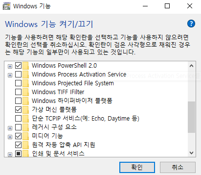
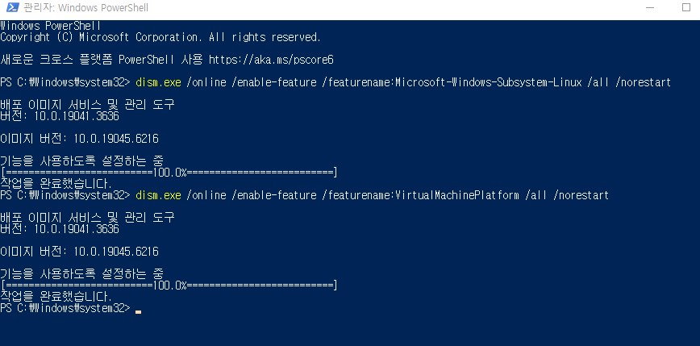
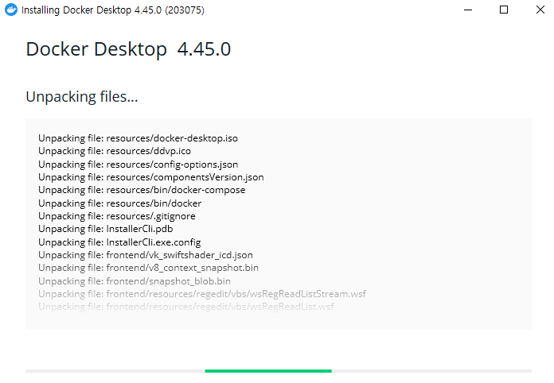
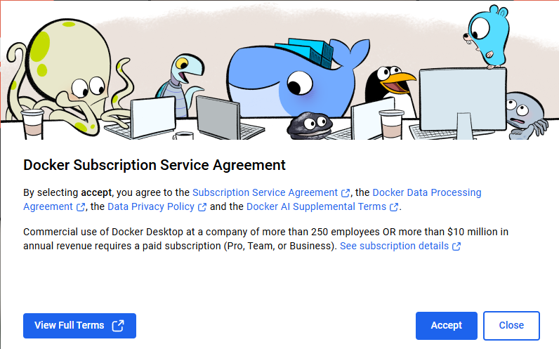
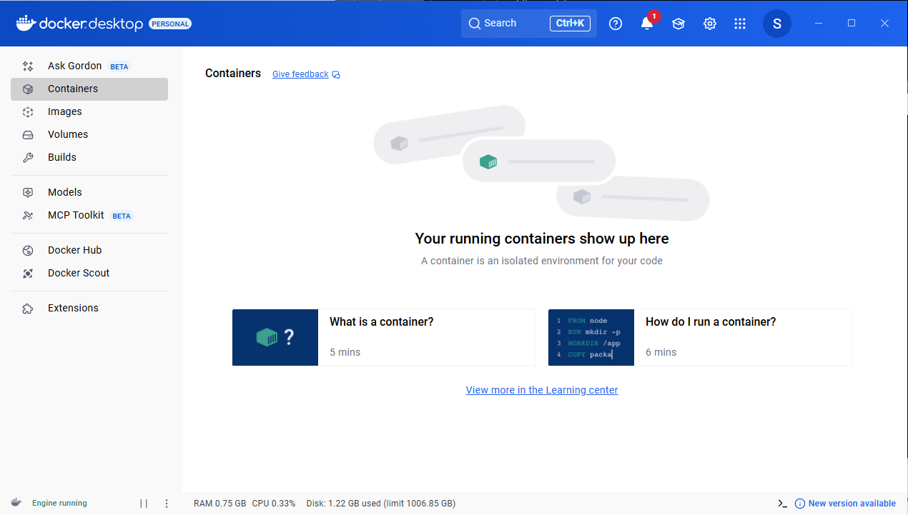
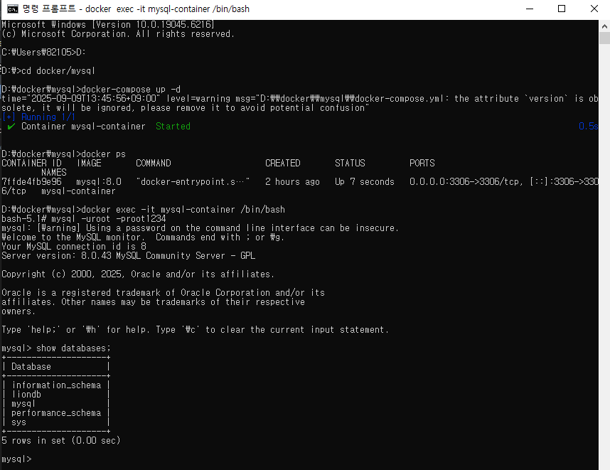
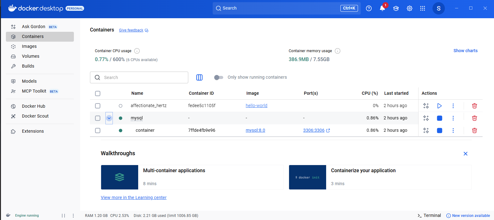
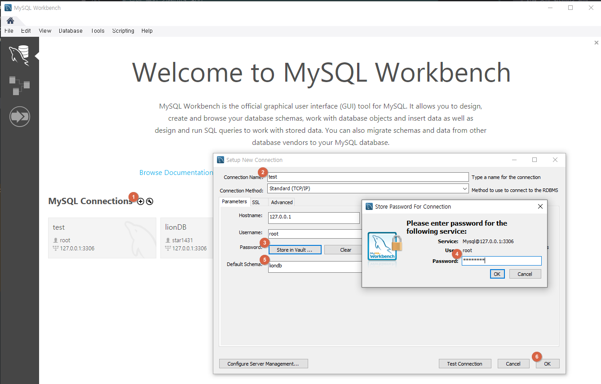

# [ 5주차 - 0909 ] 스터디 내용

```bash
    금일 커리큘럼
        ├ 09:00 ~ 12:00 관계형 데이터베이스 (DB 개념, MySQL, Docker)
        └ 13:00 ~ 18:00 관계형 데이터베이스 
```

## 1. 데이터베이스 개념

> 데이터베이스(Database)는 데이터의 집합(a Set of Data)


### DB 특징

**통합된 정보를 저장하고 운영할 수 있는 공용 데이터의 집합**

1. **실시간 접근성** 
   - 사용자의 요구를 즉시 처리
   - 예: 은행 ATM에서 계좌 잔액 조회 시 즉시 결과 제공
   
2. **계속적인 변화** 
   - 삽입(Insert), 삭제(Delete), 수정(Update) 연산을 통해 지속적으로 갱신
   - 예: 온라인 쇼핑몰 상품 재고 수량 변경
   
3. **동시 공유성**
   - 여러 사용자가 동시에 같은 데이터에 접근 가능
   - 예: 여러 사람이 동시에 영화 예매 시스템 사용
   
4. **내용 참조** 
   - 데이터의 위치가 아닌 내용(값)에 따라 참조
   - 예: "고객ID=1001" → 고객 이름, 주소 등 검색 가능


### DB 테이블 구조


```bash

 표 전체는 "릴레이션 인스턴스(현재 데이터 집합)"

+--------+----------+------------+--------+
| 학번    | 이름     | 학과명      | 학년   |  ← "애트리뷰트(=Col)"
+--------+----------+------------+--------+
| 100    | 김철수   | 화학공학     | 2      |  ← "튜플(=Row)"
| 200    | 홍길동   | 생물교육     | 1      |
| 300    | 일이삼   | 교육행정     | 3      |
| 400    | 일이사   | 정보통신     | 2      |
| 500    | 일이오   | 정치행정     | 4      |
+--------+----------+------------+--------+
   ↑                                           
   └─ 셀 하나(예: 홍길동)는 "필드(Field)"
```

| **정규 용어**             | **자주 쓰는 용어**           |
| --------------------- | ---------------------- |
| **릴레이션 (Relation)**   | 테이블 (Table)            |
| **튜플 (Tuple)**        | 행 / 레코드 (Row / Record) |
| **애트리뷰트 (Attribute)** | 열 / 컬럼 (Column)        |
| **필드 (Field, 값)**     | 셀 (Cell, Value)        |


### 1.3 DBMS
데이터베이스를 관리하는 소프트웨어로 다음과 같은 필수 기능을 제공함

* **정의 기능** :  데이터베이스의 논리적, 물리적 구조를 정의
* **조작 기능** : 데이터를 검색, 삭제, 갱신, 삽입하는 기능 
* **제어 기능** : 데이터베이스의 내용 정확성과 안전성을 유지 

**주요 DBMS 종류**
- Oracle, SQL Server, MySQL, PostgreSQL, MariaDB, MongoDB 등


---

## 2. 관계형 데이터베이스와 MySQL

### 관계형 데이터베이스 (RDB) 란?
* 데이터를 테이블(표, Table) 형태로 관리하는 데이터베이스
* 행(Row, 튜플)과 열(Column, 애트리뷰트)로 구성

### 관계형 데이터베이스의 특징
* 데이터를 테이블 형태로 저장
* 테이블 간의 관계(Relationship)를 통해 데이터 연결
* SQL(Structured Query Language)로 데이터 조작
* 데이터 무결성과 일관성 보장
* 키(Key)를 통한 식별
  - 기본키(Primary Key): 행을 고유하게 구분
  - 외래키(Foreign Key): 다른 테이블과 관계(Join) 맺음
* ACID 트랜잭션 보장 
  - 원자성(Atomicity): All or Nothing
  - 일관성(Consistency): 규칙 위반 불가
  - 격리성(Isolation): 동시에 실행되어도 간섭 없음 
  - 지속성(Durability): 결과는 영구 저장

    

### MySQL
> 세계에서 가장 인기 있는 오픈소스 데이터베이스

* 누구나 자유롭게 사용 가능 (Oracle이 관리하지만 커뮤니티 에디션 무료 제공)
* Windows, Linux, macOS 등 다양한 운영체제에서 실행 가능
* 웹 애플리케이션 개발에 널리 사용 (LAMP Stack)

---

## Docker
> Docker = 애플리케이션 실행에 필요한 환경까지 하나의 **컨테이너** 담아 실행할 수 있게 하는 기술


### Docker 의 장점

1. 간편한 실행
    - MySQL, Redis, MongoDB 같은 서버 프로그램도 `docker run` 한 줄이면 바로 실행

```Shell
docker run -d -p 3306:3306 -e MYSQL_ROOT_PASSWORD=0000 mysql:8.0
```

2. 복잡한 설치 과정 제거
    - OS마다 다른 설치 패키지, 의존성 문제 해결하고 개발 환경 세팅에 드는 시간을 대폭 절감

3. 손쉬운 삭제
    - 프로그램이 컨테이너에만 존재하므로, 삭제할 땐 컨테이너만 제거하면 됨

4. 이식성(Portability)
    - 개발 PC, 테스트 서버, 운영 서버 어디서든 동일한 환경으로 실행 가능


### Docker 핵심 용어

| 용어                       | 설명                                                                                       |
| ------------------------ | ---------------------------------------------------------------------------------------- |
| **이미지 (Image)**          | 애플리케이션 실행에 필요한 **설치 패키지 + 환경**을 묶어둔 설계도. <br>컨테이너를 만들기 위한 템플릿.                           |
| **컨테이너 (Container)**     | 이미지를 실행한 **실행 인스턴스**. <br>프로그램이 실제로 동작하는 독립된 공간(상자).                                     |
| **Docker Hub**           | 공식 이미지 저장소(레지스트리). <br>`docker pull mysql` 명령으로 MySQL 이미지를 받을 수 있음.                      |
| **레지스트리 (Registry)**     | Docker 이미지를 저장하고 배포하는 서버. <br>공식은 Docker Hub, 기업 내부용으로 Private Registry도 가능.             |
| **Dockerfile**           | 이미지 생성을 자동화하기 위한 **명령어 스크립트 파일**. <br>`FROM`, `RUN`, `COPY`, `CMD` 같은 명령어로 구성.           |
| **볼륨 (Volume)**          | 컨테이너가 지워져도 유지되는 **데이터 저장소**. <br>데이터베이스 같은 경우 반드시 사용.                                    |
| **네트워크 (Network)**       | 컨테이너들 간, 혹은 외부와 통신하기 위한 가상 네트워크.                                                         |
| **포트 매핑 (Port Mapping)** | 호스트(내 PC) 포트와 컨테이너 포트를 연결. <br>`-p 3306:3306` → 내 PC 3306 포트 ↔ 컨테이너 3306 포트.             |
| **docker-compose**       | 여러 개의 컨테이너(MySQL, Redis, 웹서버 등)를 한번에 관리할 수 있게 해주는 도구. <br>`docker-compose.yml` 파일 기반 실행. |


* Docker Hub (상점) → 이미지 다운로드 (설치파일) → 컨테이너 실행 (프로그램)

### Docker 흐름도
```bash
Dockerfile (레시피)
        │ docker build
        ▼
Image (이미지, 설계도)
        │ docker run
        ▼
Container (컨테이너, 실행되는 상자)
        │
        ├─ Volume (데이터 보존)
        └─ Port Mapping (외부 연결, ex: -p 3306:3306)

Registry (Docker Hub 등)
   ▲
   │ docker pull / push
   ▼
Image 저장소

```

---

## 3. Docker 설치하기 

### 설치 전 사전 준비

### step1. [윈도우 + R] 검색창에서 **window 기능** 검색 후 실행



* `hyper-v` 옵션이 있는 경우 활성화
* 없는 경우 `Linux용 windows 하위 시스템` 및 `가상 머신 플랫폼` 활성화

> 완료 후 컴퓨터 재시작


### step2. WSL 및 가상화 기능 활성화

* `PowerShell` **관리자 권한**으로 실행

* 다음 명령어 실행

```shell
dism.exe /online /enable-feature /featurename:Microsoft-Windows-Subsystem-Linux /all /norestart
```

* 위 명령어 `작업을 완료했습니다` 메세지 이후 다음 명령어 실행

```shell
dism.exe /online /enable-feature /featurename:VirtualMachinePlatform /all /norestart
```



> 완료 후 컴퓨터 재시작


### step3. WSL 설정

* `PowerShell` 관리자 권한으로 실행
* 다음 명령어 차례대로 실행

```shell
wsl --set-default-version 2
```
```shell
wsl --update
```

### step4. Docker Desktop 설치
> https://www.docker.com/products/docker-desktop/

* Download for Windows AMD64 (인텔,amd프로세서) 다운로드
* 실행 후 설치



> 완료 후  [logout] 버튼 클릭


>  컴퓨터 다시 로그인 후 [Accept] 확인


>  완료 후 Docker Desktop 화면

---

## 4. Docker 실행

### 사전 준비

1. 원하는 경로에 docker 폴더 및 mysql 하위 폴더 생성 
    - 예: `D:docker/mysql`

2. cmd로 mysql 폴더 접근 후 `code docker-compose.yml` 로 vscode 실행
3. 아래와 같이 삽입

> code docker-compose.yml 파일

```yaml
version: "3.8"                      # docker-compose 파일 버전

services:
  mysql-db:
    image: mysql:8.0                # mysql 버전
    container_name: mysql-container # 컨테이너 이름
    restart: always                 # 컨테이너 종료 시 항상 재시작
    environment:                    # 환경 변수 설정
      MYSQL_ROOT_PASSWORD: "root1234" # root 계정 PW
      MYSQL_DATABASE: "liondb"        # 초기 생성할 DB 이름
      MYSQL_USER: "star1431"          # 일반 사용자 name
      MYSQL_PASSWORD: "star1431"      # 일반 사용자 PW
      TZ: Asia/Seoul
    command:                          # mysql 실행 시 옵션 전달
      - --character-set-server=utf8mb4
      - --collation-server=utf8mb4_unicode_ci
    volumes:                          # 호스트 ↔ 컨테이너 디렉토리매핑
      - ./database/init/:/docker-entrypoint-initdb.d/ #SQL 스크립트들 디렉토리
      - ./database/datadir/:/var/lib/mysql  # mysql 실제 데이터 저장 위치
    platform: linux/x86_64
    ports:
      - 3306:3306 # 호스트의 3306 포트를 컨테이너 3306 포트와 연결
```

### cmd로 docker MySQL 접근

> MySQL 실행

```shell
# MySQL 서버 시작 (백그라운드 실행)
docker-compose up -d

# 실행 중인 컨테이너 확인
docker ps

# 로그 확인
docker-compose logs
```

> MySQL 접속

```shell
# 컨테이너 확인
docker ps

# 컨테이너 이름으로 직접 접속 (방법 1)
docker exec -it mysql-container mysql -uroot -p{루트PW}
docker exec -it mysql-container mysql -uroot -proot1234

# 또는 컨테이너 내부로 들어가서 접속 (방법 2)
docker exec -it mysql-container /bin/bash
mysql -uroot -proot1234

# 일반 사용자로 접속
docker exec -it mysql-container mysql -u{사용자이름} -p{사용자PW} liondb
docker exec -it mysql-container mysql -ustar1431 -pstar1431 liondb
```

> cmd 실행 화면


 
> 도커 상태



---

## 5. MySQL Workbench

> https://dev.mysql.com/downloads/workbench/

* 사이트 접속 후 os에 맞게 다운로드
* 설치 후 실행



**[1번] MySQL Connections**
- 기존에 만들어둔 연결 목록이 보이는 곳
- [+] 버튼 클릭시 커넥션 생성

**[2번] Connection Name**
- Workbench에서 보여질 연결 이름
- 실제 DB 이름과는 무관, 단순히 식별용 ( 예: `test` )

**[3,4번] Store in Vault**
- 접속 시 사용할 비밀번호 저장
- 저장하면 매번 입력할 필요 없이 자동 로그인 가능

**[5번] Default Schema**
- 접속 후 기본으로 선택할 데이터베이스
- 예: `liondb` → 접속하면 자동으로 `USE liondb;` 적용
- 지정하지 않으면 직접 `USE db명;` 입력 필요


---
