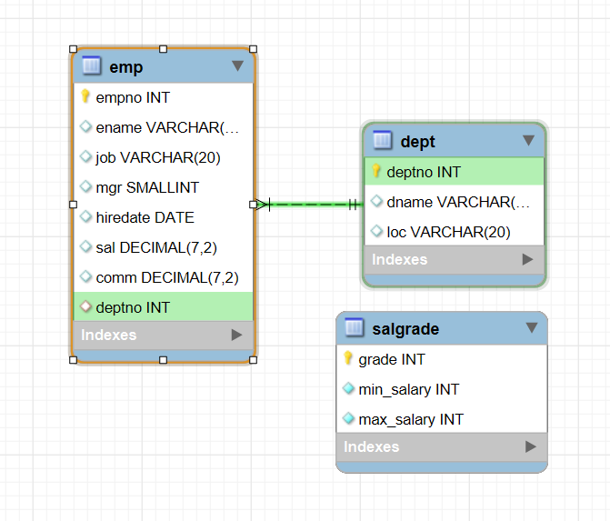

# [ 5주차 - 0911 ] 스터디 내용

```bash
    금일 커리큘럼
        ├ 09:00 ~ 12:00 관계형 데이터베이스 (JOIN 심화 : 범위 / 외부 / 자기자신, 서브쿼리)
        └ 13:00 ~ 18:00 관계형 데이터베이스 (상관 서브쿼리, 집합 연산, 윈도우 함수, DDL과 DB설계)
```

## 1. JOIN 심화 : 범위 / 외부 / 자기자신 

### 현재 lionDB ERD



### 범위 - non-equi join 

* 정의: 조인 조건에 `=` 대신 `BETWEEN`, `<, >` 같은 비교 연산자를 사용하는 방식
* 용도: 매칭이 필요한 경우 (예: 급여 등급 찾기, 성적학점 부여, 상품 가격-할인율 매칭)

```sql
/* non-equi join */
SELECT e.ename, e.sal, s.grade FROM emp e, salgrade s
    WHERE e.sal BETWEEN s.min_salary and s.max_salary;
    -- emp.sal 값이 salgrade 테이블의 min_salary ~ max_salary 범위에 속하면 매칭
    -- 조인을 통해 급여 등급 확인 가능
```

### 외부 - outer join

* 정의: 한쪽 테이블에는 데이터가 없더라도 다른 쪽 테이블의 데이터는 반드시 포함시키는 조인.
* 종류 : `LEFT OUTER JOIN`, `RIGHT OUTER JOIN`, `FULL OUTER JOIN // or UNION`
    - 오라클 = FULL OUTER JOIN 
    - mysql = UNION
* 용도
    - left : 부서 배정 안된 직원 찾기 (모든직원 <-> 매칭부서값)
    - right : 직원 없는 부서 찾기 (모든부서 <-> 매칭직원값)
    - left + right union : 모든 직원, 모든 부서 다 출력

```sql
/* outer join */

-- left (좌측 테이블 emp 정보 모두 포함)
SELECT e.ename, e.deptno, d.dname FROM emp e
    LEFT OUTER JOIN dept d USING(deptno);
    -- dept 에 해당부서없으면 dname(부서명) 은 null로 나타남

-- right (우측 테이블 dept 정보 모두 포함)
SELECT e.ename, e.deptno, d.dname FROM emp e
	RIGHT OUTER JOIN dept d USING(deptno);
    -- emp 에 해당 부서 직원이 없으면 ename(직원명) 은 null로 나타남

-- union (두 테이블 합집합)
SELECT e.ename, e.deptno, d.dname FROM emp e
	RIGHT OUTER JOIN dept d USING(deptno)
    UNION
	SELECT e.ename, e.deptno, d.dname FROM emp e
	LEFT OUTER JOIN dept d USING(deptno);
    -- emp 직원, dept 부서 없어도 둘다 합집합으로 null로 나옴
    -- 즉 모든 직원 + 모든 부서 정보 한번에 노출
```

### 자기자신 - self join

* 정의 : 자기 자신과 자기 자신을 조인하는 방식
* 하나의 테이블을 두 번 불러와서(별칭 사용) 마치 서로 다른 테이블처럼 연결
* 주로 계층 구조(상위/하위 관계) 표현할 때 사용

```sql
SELECT 
	e.empno as 사원번호,
    e.ename as 사원명,
    m.empno as '담당 매니저번호',
    m.ename as '담당 매니저명'
	FROM emp e, emp m
	WHERE e.mgr = m.empno;
    -- 사원 담당 mgr 값 기준으로 사원의 매니저를 같은 테이블에서 찾아 매칭
```

---

## 2. 서브쿼리 - SubQuery

> 하나의 SQL 구절 속에 다른 SQL 구절이 포함되어 있는 형태


### single row 서브쿼리

* 서브쿼리 결과값 하나

```sql

-- 스미스 사원이 속한 부서의 평균 급여
SELECT avg(sal) FROM emp 
	WHERE deptno = (
		SELECT deptno FROM emp
		WHERE ename = 'smith'
	);

-- 전체 평균 급여보다 적은 급여를 받는 사원
SELECT ename, sal FROM emp
	WHERE sal <= (
		SELECT avg(sal) FROM emp
    );

-- 가장 먼저 입사한 사원
SELECT ename, hiredate FROM emp
	WHERE hiredate = (
		SELECT min(hiredate) FROM emp
    );

-- 부서이름이 SALES 인 사원 정보
SELECT * FROM emp
	WHERE deptno = (
		SELECT deptno FROM dept
        WHERE dname = 'SALES'
    );
```

### multi row 서브쿼리

* 서브쿼리 결과값 여러개
* `in`, `any`, `all` 활용

```sql
/* in 연산자 : 무조건 '='이고, 내부 값 중 하나라도 만족 */
-- 부하직원이 있는(= 누군가의 mgr로 등록된) 사원만 조회
SELECT empno, ename FROM emp
    WHERE empno IN (
        SELECT mgr
        FROM emp
        WHERE mgr IS NOT NULL   
        -- 여러 행 반환 (매니저 사번들의 집합)
    );


/* any 연산자 */
-- 비교 연산시 any () 안의 값들 중 하나 만족할 경우 = 참
SELECT ename, deptno, sal FROM emp
    -- 30번 부서 사람들 급여보다 하나라도 작을 경우
    WHERE sal > any (
        SELECT sal FROM emp
        WHERE deptno = 30
    );


/* all 연산자 */
-- 비교 연산시 all () 안의 값들 중 전부 만족할 경우 = 참
SELECT ename, deptno, sal FROM emp
    -- 30번 부서 사람들 급여보다 모두 작을 경우
    WHERE sal > all (
        SELECT sal FROM emp
        WHERE deptno = 30
    );
```

* any , all 비교 연산 : =, <, >=, <, <=, <> (-하나라도다른경우 참)

---

## 3. 상관 서브쿼리 - Correlated SubQuery

> 외부쿼리와 () 안에 있는 내부쿼리가 서로 연관되어 실행하는 서브쿼리


### 기본형

```sql
-- 사원의 급여가 자기 부서의 평균 급여보다 큰 경우
SELECT ename, sal, deptno FROM emp e
    WHERE e.sal > (
        SELECT avg(i.sal) FROM emp i
        WHERE i.deptno = e.deptno
        -- 내부부서번호 = 외부부서번호 (대상직원) 일치한 부서의 평균 구하여
        -- 비교함 (외부쿼리 튜플마다)
    );
```

### exists 연산

```sql
-- 후임이 있는 직원들만 조회
SELECT e.empno, e.ename FROM emp e
	WHERE EXISTS (
		-- SELECT 1 : 행이 하나라도 존재하는 지
		SELECT 1 FROM emp i
        WHERE i.mgr = e.empno
        -- 내부쿼리 사원번호 = 외부 사원번호
        -- 나 자신이 후임이 있는 경우
    );
```

### 다중 컬럼

```sql
-- 부서마다 부서 내에서 최고급여 받는 사원
SELECT ename, deptno, sal FROM emp
    -- (부서, 급여) = ( 부서1의 최고급여, 부서2의 최고급여 ...)
    WHERE (deptno, sal) in (
        SELECT deptno, max(sal) FROM emp
        GROUP BY deptno
    );


-- 부서 내 최고 급여를 받고 있는 사원의 모든 정보와 최고급여 컬럼 추가
SELECT e.*, m.max_sal FROM emp e
    JOIN (
        SELECT deptno, max(sal) as max_sal FROM emp
        GROUP BY deptno
    ) m on e.deptno = m.deptno and e.sal = m.max_sal; 
```

---

## 4. 집합 연산자

```sql

/* 테스트용 테이블 */
CREATE TABLE A (name INT);
CREATE TABLE B (name INT);
INSERT INTO A VALUES (1), (2), (3);
INSERT INTO B VALUES (2), (3), (4);


/* UNION : 중복제거 합집합 */
SELECT name FROM A
UNION
SELECT name FROM B;
-- 결과: 1, 2, 3, 4


/* UNION ALL : 중복포함 합집합 */
SELECT name FROM A
UNION ALL
SELECT name FROM B;
-- 결과: 1, 2, 3, 2, 3, 4


/* INTERSECT : 교집합 */
/*
	SELECT name FROM A
	INTERSECT
	SELECT name FROM B;
*/
-- mysql은 지원안해서 조인 대체 
SELECT DISTINCT A.name 
FROM A 
INNER JOIN B ON A.name = B.name;
-- 결과: 2, 3


/* MINUS : 차집합 */
/*
	SELECT name FROM A
	MINUS
	SELECT name FROM B;
*/
-- mysql은 지원안해서 서브쿼리 대체 
SELECT name FROM A
WHERE name NOT IN (
    SELECT name FROM B
);
-- 결과: 1
```

---

## 5. 윈도우 함수

### rank () 순위매김 : 동일순위 건너뜀 (1,2,2,4)

```sql
-- 급여 순위 매기기
SELECT 
    sal,
    ename,
    rank() over(ORDER BY sal desc) as ranking
FROM emp;

-- 부서별 급여 순위
SELECT 
    deptno,
    ename,
    sal,
    rank() OVER(PARTITION BY deptno ORDER BY sal desc) as dept_rank
FROM emp;
```

### dense_rank() 순위매김 : 동일순위 무시 (1,2,2,3)

```sql
-- 동일 순위 다음 순위 건너뛰지 않음
SELECT
    sal,
    ename,
    dense_rank() over(ORDER BY sal desc) as dense_ranking
FROM emp;
```

### row_number () 목록번호 : 1부터

```sql
-- 행 번호 부여
SELECT
    row_number() OVER(ORDER BY sal desc) as row_num,
    ename,
    sal
FROM emp;
```

---

## 6. DDL과 데이터베이스 설계

### DDL, DML, DCL, TCL

| SQL 분류 | 정의         | 설명                      | 명령어                            |
| ------ | ---------- | ----------------------- | ------------------------------ |
| DDL    | 데이터 정의 언어  | 스키마(테이블/뷰/인덱스) 생성·변경·삭제 | CREATE, ALTER, DROP, TRUNCATE  |
| DML    | 데이터 조작 언어  | 행 데이터 삽입·수정·삭제·조회       | INSERT, UPDATE, DELETE, SELECT |
| DCL    | 데이터 제어 언어  | 사용자/역할 권한 부여·회수         | GRANT, REVOKE                  |
| TCL    | 트랜잭션 제어 언어 | 트랜잭션 확정·취소(필요 시 저장점)    | COMMIT, ROLLBACK               |

**DDL 명령어 요약**
* CREATE TABLE: 테이블 생성
* ALTER TABLE: 테이블 구조 변경
* DROP TABLE: 테이블 삭제
* RENAME: 이름 변경
* TRUNCATE: 테이블의 모든 데이터 삭제
* COMMENT: 테이블에 설명 추가


### MySQL 데이터타입

| 분류  | 타입                                                                                  |
| --- |-------------------------------------------------------------------------------------|
| 숫자형 | tinyint(1), int(small,medium,big), decimal(m,d), float, double, bit(m)              |
| 문자형 | varchar, char, text                                                |
| 날짜형 | date, time, datetime, timestamp, year                                               |
| 기타  | json, enum, set, blob, varbinary, binary(16) uuid, geometry/point |


```sql

-- 숫자형
tinyint(1)            -- 불리언(0/1), boolean 별칭
smallint              -- 작은 정수 (2byte)
mediumint             -- 중간 크기 정수 (3byte)
int                   -- 가장 흔한 정수 (4byte)
bigint                -- 매우 큰 정수 (8byte)
decimal(12,2)         -- 전체 12자리, 소수 2자리
float                 -- 근사 실수(센서값 등), 돈엔 사용 지양
double                -- 더 정밀한 근사 실수

-- 문자형
varchar(255)          -- 가변 길이 문자열(일반 텍스트)
char(2)               -- 고정 길이 코드(국가코드 등)
text                  -- 긴 텍스트

-- 날짜형
date                  -- 'yyyy-mm-dd'
time                  -- 'hh:mm:ss'
datetime              -- 'yyyy-mm-dd hh:mm:ss' (타임존 변환 없음, 범용)
timestamp             -- 타임존 변환/default/on update 편리(2038 이슈)
year                  -- 연도만 저장

-- 기타
json                  -- json 컬럼; 생성 컬럼+인덱스 조합 권장
enum('a','b',...)     -- 제한된 값 중 하나(스키마 변경 부담, 신중히)
set('a','b',...)      -- 제한된 값 중 다중 선택(역시 신중히)
blob                  -- 바이너리 데이터(큰 파일은 외부 스토리지 권장)
varbinary(16)         -- 바이너리 토큰/ip 등
binary(16)            -- uuid 압축 저장( uuid_to_bin()/bin_to_uuid() )
point / geometry      -- 위치 정보(gis); 공간 인덱스와 함께 사용
```

### 테이블 생성

#### 기본 문법

```sql
CREATE TABLE 테이블이름 (
    필드이름1 필드타입1 [제약조건],
    필드이름2 필드타입2 [제약조건],
    ...
    [테이블 제약조건]
);
```

#### 제악 조건

| 키워드              | 의미                                               |
| ---------------- | ------------------------------------------------ |
| `primary key`    | 행을 유일하게 식별하는 키(중복·NULL 불가)                       |
| `foreign key`    | 다른 테이블의 키를 참조하여 참조 무결성 보장                        |
| `unique`         | 값의 중복을 금지(MySQL에선 `NULL` 여러 개 허용)                |
| `not null`       | NULL 값 입력 금지                                     |
| `check (조건)`     | 값의 범위/패턴을 제한(MySQL 8.0.16+ 적용)                   |
| `default 값`      | 값 생략 시 기본값 자동 채움                                 |
| `auto_increment` | 정수 컬럼 값을 자동 증가                                   |
| `on delete …`    | 참조 행 삭제 시 동작 지정(`restrict`/`cascade`/`set null` 등) |
| `on update …`    | 참조 키 변경 시 동작 지정(`restrict`/`cascade`/`set null` 등) |


#### 생성 및 삽입 예제

```sql
-- 스키마 : 학생 / id, name, age, email, created_date
CREATE TABLE students (
    id 		int             PRIMARY KEY AUTO_INCREMENT, -- 기본키, 자동 증가 (반드시 존재)
    name 	varchar(20)     NOT NULL, -- null 허용 X
    age 	smallint        CHECK ( age > 0 and age <= 150 ), -- 범위 체크
    email	varchar(100)    UNIQUE,  -- 중복 허용 X
    created_date  datetime  DEFAULT CURRENT_TIMESTAMP
    -- 인설트할 때 빈값인 경우 기본값 현재날짜시간로 지정
);

INSERT into students(name,age,email) VALUE('짱구', 8, '짱구123@gmail.com');
INSERT into students VALUE(null, '철수', 12, '철수123@gmail.com', curdate());


SHOW TABLES;
desc students;

SELECT * FROM students;
DROP TABLE students;
```


