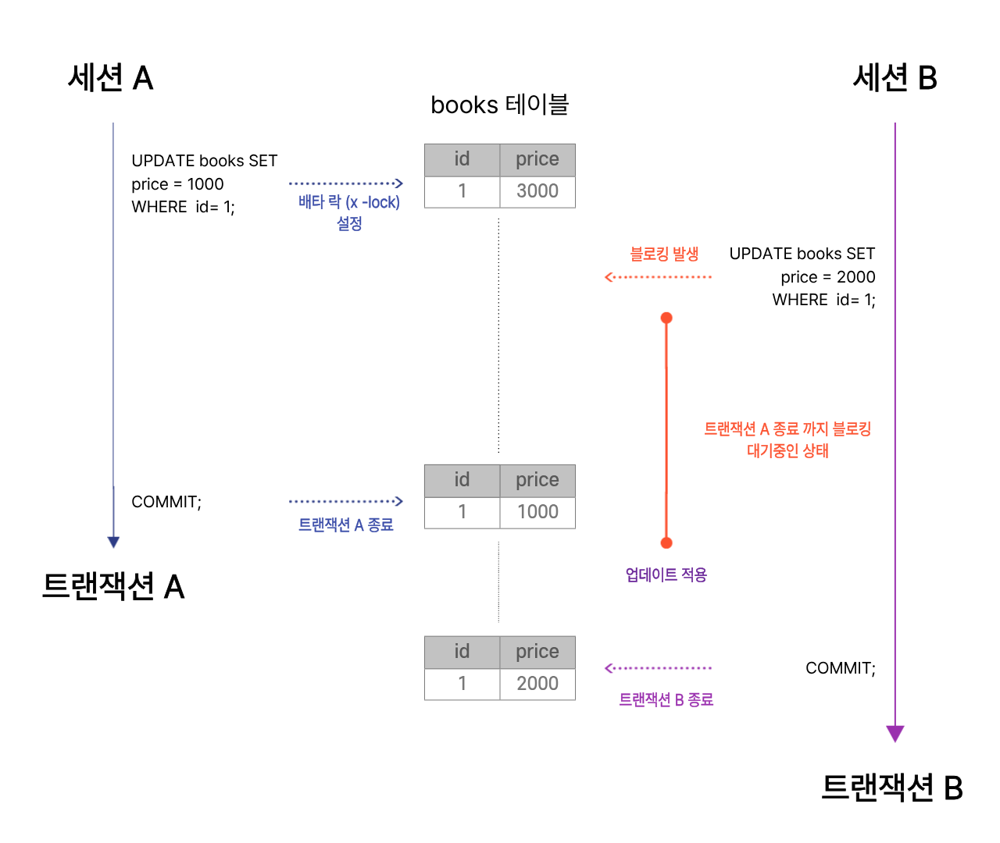

# [ 5주차 - 0912 ] 스터디 내용

```bash
    금일 커리큘럼
        ├ 09:00 ~ 12:00 관계형 데이터베이스 (TABLE DML, INDEX, DB 설계 방식)
        └ 13:00 ~ 18:00 관계형 데이터베이스 (트랜잭션, ALTER 사용, JDBC 개념)
```

## 1. TABLE DML

> TABLE에 대해 데이터 삽입, 수정, 삭제 관련 데이터 조작어


* **INSERT**
  - `INSERT INTO 테이블명 (컬럼..) VALUES (값..);`
  - 새로운 데이터를 테이블에 삽입

* **UPDATE**
  - `UPDATE 테이블명 SET 컬럼명 = '바꿀데이터 행값' WHERE 컬럼명 = '행값';`
  - 데이터를 테이블에서 다른 데이터로 변경
  - 예시:

```sql
-- pk_id가 2번인 책의 이름과 저자명을 동시에 수정
UPDATE books SET 
    bname = '나무2', author = '베르나르 베르베르 2세' 
    WHERE pk_id = 2;
```

* **DELETE**
  - DELETE FROM books WHERE isbn = '13-0001';
  - 데이터를 테이블에서 삭제

* **SELECT**
  - 조건에 맞게 테이블 조회

### DML 예시
```sql
-- DDL
CREATE TABLE books (
    pk_id   int PRIMARY KEY AUTO_INCREMENT,
    isbn    varchar(20) UNIQUE NOT NULL,
    bname   varchar(100) UNIQUE NOT NULL,
    author  varchar(30) NOT NULL,
    price   int CHECK ( price >= 0),
    cr_date DATE DEFAULT (curdate())
)ENGINE=InnoDB DEFAULT CHARSET=utf8mb4;
-- ENGINE=InnoDB → 트랜잭션, FK 제약조건 지원
-- DEFAULT CHARSET=utf8mb4 → 한글 + 이모지까지 안전하게 저장


-- DML
-- 추가
INSERT INTO books (isbn, bname, author, price, cr_date) VALUES
('11-0001', '개미', '베르나르 베르베르', 15000, '1993-01-01'),
('11-0002', '나무', '베르나르 베르베르', 15000, '1995-01-01'),
('11-0003', '파피용', '베르나르 베르베르', 15000, '2000-01-01'),
('12-0001', '용의자 X의 헌신', '히가시노 게이고', 14000, '2005-08-29'),
('12-0002', '백야행', '히가시노 게이고', 16000, '1999-01-01'),
('12-0003', '나미야 잡화점의 기적', '히가시노 게이고', 15000, '2012-03-28'),
('13-0001', '채식주의자', '한강', 12000, '2007-10-30'),
('13-0002', '소년이 온다', '한강', 13000, '2014-05-19'),
('13-0003', '흰', '한강', 14000, '2016-09-01');

-- 수정
UPDATE books SET bname = '흰2' WHERE isbn = '13-0003';
UPDATE books SET bname = '나무2', author = '베르나르 베르베르 2세' WHERE pk_id = 2;

-- 삭제
DELETE FROM books WHERE isbn = '13-0001';

SELECT * FROM  books;
```

---

## 2. 인덱스 INDEX

> 데이터 검색 속도를 향상시키기 위한 자료구조

**특정 컬럼에 대한 검색, 정렬, 조인 성능을 개선하기 위해 사용됨**

### 인덱스 대상

* **PRIMARY KEY**
  - 테이블의 기본 키
  - 자동으로 **클러스터형 인덱스(Clustered Index)** 가 생성됨
  - 한 테이블에 하나만 존재 가능
* **UNIQUE**
  - 컬럼 값의 중복을 허용하지 않음
  - 자동으로 **비클러스터형 인덱스(Non-clustered Index)** 가 생성됨
* **일반 INDEX**
  - 단순히 검색 성능을 높이기 위해 생성
  - 중복 허용
* **복합 INDEX**
  - 2개 이상의 컬럼을 묶어서 생성
  - 인덱스에 정의된 컬럼 순서에 따라 활용됨 (선행 컬럼 우선)


### 추가, 삭제, 확인 예시

```sql
-- 인덱스 추가
CREATE INDEX books_author_idx
    ON books(author);

-- 인덱스 확인
SHOW INDEX FROM books;

-- 인덱스 삭제
ALTER TABLE books
    DROP INDEX books_author_idx;

-- 복합 인덱스
CREATE INDEX books_muti_idx
    ON books(isbn, bname);
```

### 활용 예시

```sql
-- 인덱스 사용 전
EXPLAIN SELECT * FROM books 
    WHERE author = '히가시노 게이고';
-- type : all - 전체 행 탐색됨 
-- rows : 행 전체 갯수로 나옴 (탐색한 행 갯수 = 테이블 전체 행 갯수)

-- 인덱스 생성
CREATE INDEX books_author_idx 
    ON books(author);

-- 인덱스 사용 후
EXPLAIN SELECT * FROM books 
    WHERE author = '히가시노 게이고';
-- type : ref - 인덱스 대상만 행 탐색됨 (탐색한 행 갯수 = 찾는 데이터 행 갯수)
-- rows : 조건에 맞는 행 갯수로 나옴 (탐색한 행 갯수 = 찾는 데이터 행 갯수)
```

### 차이점 정리
* 인덱스 전 → Full Table Scan (모든 행 탐색)
* 인덱스 후 → Index Scan (해당 컬럼 인덱스로 바로 탐색)

---

## 3. DB 설계 방식

> 데이터베이스를 구축하기 전, 체계적으로 요구사항을 분석하고 구조를 정의하는 과정

일반적으로 **요구조건 분석 → 개념 설계 → 논리 설계 → 물리 설계 → 구현** 단계로 진행

### 설계 단계

1. **요구조건 분석**
    - 사용자와 시스템에서 필요로 하는 데이터와 기능을 수집/정리

2. **개념 설계**
    - 수집한 요구조건을 바탕으로 **개념적 데이터 모델** 작성
    - ER 다이어그램(Entity-Relationship Diagram)으로 표현

3. **논리 설계**
    - 개념 모델을 실제 사용할 DBMS에 맞게 논리적 구조로 변환
    - 정규화 과정을 통해 데이터 중복 제거 및 무결성 확보

4. **물리 설계**
    - 논리적 구조를 실제 저장 구조로 구현
    - DBMS 특성을 반영해 스키마 설계, 인덱스, 파티션, 저장소 구조 정의
    - 성능(조회 속도, 트랜잭션 처리량)을 고려

5. **구현**
    - 실제 DBMS에 스키마 생성 (CREATE TABLE, INDEX 등)
    - 초기 데이터 적재, 테스트, 애플리케이션 연동

### 정리
- **요구조건 분석**: 뭘 저장해야 하는지?
- **개념 설계**: 큰 그림(ERD)
- **논리 설계**: 테이블 구조/정규화 중심 (이상 제거, 데이터 무결성 확보)
- **물리 설계**: 반정규화 + DBMS 특화 설계 (성능 최적화)
- **구현**: 실제 DB로 제작

---

## 4. 트랜잭션

> 데이터베이스에서 하나의 작업 단위로 처리되는 논리적 연산 집합  

여러 SQL문이 하나의 묶음으로 실행되어 모두 성공하거나, 모두 실패해야 함

### 트랜잭션의 특성 (ACID)

1. **Atomicity (원자성)**
   - 트랜잭션의 모든 연산은 전부 수행되거나, 전부 수행되지 않아야 함 (All or Nothing)
   - 중간 단계에서 일부만 실행된 상태로 남으면 안 됨

2. **Consistency (일관성)**
   - 트랜잭션 수행 전과 수행 후의 데이터는 항상 **일관된 상태**를 유지해야 함
   - 모든 제약조건(무결성, 규칙)을 만족해야 함

3. **Isolation (독립성, 고립성)**
    - 동시에 여러 트랜잭션이 실행되더라도 서로 간섭하지 않아야 함
    - 한 트랜잭션이 완료되기 전까지는 다른 트랜잭션이 그 결과를 볼 수 없음

4. **Durability (지속성)**
    - 트랜잭션이 성공적으로 완료되면 그 결과는 영구적으로 DB에 반영되어야 함
    - 시스템 장애나 오류가 발생해도 결과는 보존됨


### 트랜잭션 제어

```sql
-- AutoCommit 확인
SELECT @@AUTOCOMMIT;

-- AutoCommit 해제
SET AUTOCOMMIT = 0;

-- 트랜잭션 시작
START TRANSACTION;

-- SQL 실행
INSERT INTO books (isbn, bname, author, price, cr_date) VALUES
('99-0001', 'backend', 'star1431', 100, '2025-09-01');

-- 커밋 또는 롤백
COMMIT;     -- 변경사항 확정
ROLLBACK;   -- 변경사항 취소

-- AutoCommit 설정
SET AUTOCOMMIT = 1;
```

### 트랜잭션 lock 흐름 보기

* 각각의 cmd 창을 띄워서 트랜잭션 A,B 수행할 경우



1. **세션 A 상태**
   - `UPDATE SET` 데이터 변경 실행
   - `id=1` 행에 배타락(X-lock) 걸림
   - 아직 commit 전이므로 세션 A만 해당 행 수정 가능 (트랜잭션A종료안됨)

2. **세션 B 상태**
   - `UPDATE SET`으로 세션 A와 같은 데이터 변경 실행 시도
   - 이미 세션 A가 락을 가지고 있어서 블로킹(대기)

3. **세션 A commit**
    - 변경 내용 반영 및 동시에 락 해제

4. **세션 B 실행 재개**
   - 대기하던 `UPDATE` 실행됨. 값이 2000으로 변경
   - 이후 세션 B commit 하여 최종 값은 2000


### lock 종류

* **공유 락 (S-lock)**
    - select로 읽기 전용 작업에 걸리는 락
    - 다른 트랜잭션에서 접근은 가능하지만 데이터추가,삭제 불가

* **배타 락 (X-lock)**
    - UPDATE/DELETE/INSERT 시 걸리는 락
    - 해당 데이터 독점적으로 점유하여 다른 트랜잭션에서 select도 불가

* **데드 락 (dead lock)**
    - 두 개 이상의 트랜잭션이 서로 상대방의 락을 기다리다가 영원히 대기하는 상태
    - A에서 `id=1` 배타락 / B에서 `id=2` 배타락 걸때 교착 상태되어 영원히 풀리지 않음
    - 보통은 MySQL(InnoDB) 자동으로 데드락 감지하여 둘중하나 롤백시킴

---

## 5. ALTER 사용법

> 용도 : 컬럼 변경, 제약 조건 변경, 인덱스 변경


```sql
SELECT * FROM A;
SELECT * FROM B;

-- 컬럼 추가
ALTER TABLE A ADD COLUMN age INT;

-- 컬럼 수정
ALTER TABLE A MODIFY COLUMN age VARCHAR(50);

-- 컬럼 이름 변경
ALTER TABLE A CHANGE COLUMN name user_name INT;

-- 컬럼 삭제
ALTER TABLE A DROP COLUMN age;

-- 외래키 추가
ALTER TABLE A ADD CONSTRAINT fk_a_b FOREIGN KEY (user_name) REFERENCES B(name);

-- 인덱스 추가
CREATE INDEX idx_a_name ON A(user_name);

-- 제약조건 삭제
ALTER TABLE A DROP FOREIGN KEY fk_a_b;
```

---

## 6. JDBC 프로그래밍 - 기초

> JDBC ? 자바에서 데이터베이스에 접속하고 SQL을 실행할 수 있게 해주는 표준 API

### java와 DB

* 자바는 DB와 직접 대화할 수 없음 → DB마다 접속 방식, 프로토콜이 다르기 때문
* 그래서 DBMS별로 제공되는 JDBC 드라이버가 필요함
* JDBC 표준 메서드 사용하여 DB에 접근 가능
    - `getConnection()` : DB 연결
    - `executeQuery()` : SQL 실행 (SELECT)
    - `executeUpdate()` : SQL 실행 (INSERT/UPDATE/DELETE)

### JDBC 주요 구성요소

1. **DriverManager**
    - JDBC 드라이버를 관리
    - `DriverManager.getConnection()` 통해 DB 접속

2. **Connection**
    - DB와 연결을 나타내는 객체
    - SQL을 실행할 `Statement`, `PreparedStatement` 객체 생성 가능

3. **Statement / PreparedStatement**
    - SQL문을 DB에 전달하고 실행하는 객체
    - **Statement** : 단순 쿼리 실행용
    - **PreparedStatement** : 파라미터 바인딩 지원 (보안 ↑, 성능 ↑)

4. **ResultSet**
    - SELECT 실행 결과를 담는 객체
    - 커서(cursor) 이동하며 행 단위로 데이터 조회


### 심플 예시

```java
import java.sql.Connection;
import java.sql.DriverManager;
import java.sql.SQLException;

public class connectionTest {
    public static void main(String[] args) throws Exception {
        // https://mvnrepository.com/repos
        // file - 프로젝트구조 - 라이브러리 - 메이븐
        // mysql:mysql-connector-java:8.0.33

        // 드라이버 클래스 로드 - DriverManager에 자동 등록 (옛날엔 필수 / 지금은 아님)
        Class.forName("com.mysql.cj.jdbc.Driver");
        
        // 1. db 접속시도. Connection -> 접속 추상화 객체
        Connection connection = null;
        String url = "jdbc:mysql://localhost:3306/liondb";
        String user = "star1431";
        String pw = "star1431";
        connection = DriverManager.getConnection(url, user, pw);

        if(connection != null) System.out.println("성공");
        else System.out.println("실패");
    }
}
```

> mysql-connector-java 는 MySQL 전용 JDBC 드라이버

* 인텔리제이 상단탭 [파일] → [프로젝트구조] → [라이브러리]  → [maven] 선택
* `mysql:mysql-connector-java:8.0.33` 검색
* 라이브러리를 해당 프로젝트에 적용