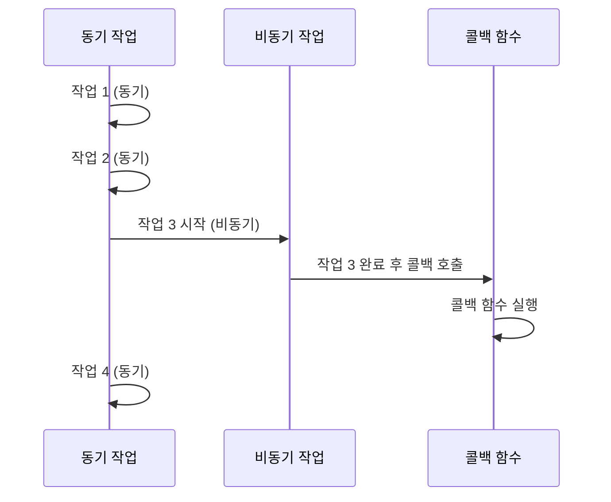

# [ 7주차 - 0924 ] 스터디 내용

```bash
    금일 커리큘럼
        ├ 09:00 ~ 12:00 FrontEnd (JS 배열 메서드, 객체 순회)
        └ 13:00 ~ 18:00 FrontEnd (클래스와 프로토타입)
```

## 1. JS 배열 메서드 - 처리/변환 계열

### forEach()

* **콜백만 실행하고 반환값 없음**
* 선언 형태 : `forEach((item, index, array) => {})`
* item : 배열의 각 요소
* index : 요소의 인덱스
* array : 배열 자체

```js
let arr0 = [1, 2, 3, 4, 5, 6, 7];
/**
 * 1. forEach() 배열의 각 요소에 대해 콜백함수를 실행함
 */ 
arr0.forEach((item, index, array) => {
    console.log(`item: ${item}, index: ${index}, array: ${array}`);
    // item: 1, index: 0, array: 1,2,3,4,5,6,7
    // ...
    // item: 7, index: 6, array: 1,2,3,4,5,6,7
});

let squ0 = [];
const square = (x) => x * x;
/**
 * 2. forEach()는 리턴값 X
 * - 콜백 함수 내부에서 별도의 배열에 푸시(push)해야 함
 */
arr0.forEach((item) => {
    squ0.push(square(item));
})
console.log(squ0); // [1, 4, 9, 16, 25, 36, 49]

squ0 = [];
const square2 = (x) => squ0.push(x * x);
/**
 * 3. forEach() 콜백 함수는 별도의 함수로도 정의 가능
 * - 인자를 내부에서 바로 사용
 */
arr0.forEach(square2);
console.log(squ0); // [1, 4, 9, 16, 25, 36, 49]
```

### map()

* **콜백의 결과값을 모아서 새 배열 반환**
* 선언 형태 : `map((item, index, array) => {})`
* item : 배열의 각 요소
* index : 요소의 인덱스
* array : 배열 자체
* 리턴값: 콜백 함수의 리턴값으로 구성된 새로운 배열
    - 기존 배열은 변경되지 않음

```js
// 각 요소를 제곱하여 새로운 배열 생성
let arr1 = [1, 2, 3, 4, 5, 6, 7];
let squ1 = arr1.map((item) => item * item);
console.log(squ1); // [1, 4, 9, 16, 25, 36, 49]
```

### filter()

* **콜백의 결과가 true인 요소만 모아서 새 배열 반환**
* 선언 형태 : `filter((item, index, array) => {})`
* item : 배열의 각 요소
* index : 요소의 인덱스
* array : 배열 자체
* 리턴값: 콜백 함수의 결과가 true인 요소로 구성된 새로운 배열
    - 기존 배열은 변경되지 않음

```js
// 짝수인 요소만 새로운 배열 생성
let arr2 = [1, 2, 3, 4, 5, 6, 7];
let even2 = arr2.filter((item) => item % 2 === 0);
console.log(even2); // [2, 4, 6]
```

> filter() + map() 조합 예시

```js
// 짝수인 요소만 추출 후 (= filter) 
// 각 요소를 제곱하여 새로운 배열 생성 (= map)
let arr3 = [1, 2, 3, 4, 5, 6, 7];
let even3 = arr3.filter((item) => item % 2 === 0).map((item) => item * item);
console.log(even3); // [4, 16, 36]
```


### reduce()

* **배열의 각 요소를 누적하여 하나의 값으로 반환**
* 선언 형태 : `reduce((accumulator, current, index, array) => {}, initialValue)`
* accumulator : 누적된 값
* current : 현재 처리 중인 요소
* index : 요소의 인덱스
* array : 배열 자체
* 리턴값: 누적된 최종 값
* initialValue : 누적의 초기값 (생략 가능, 생략 시 배열의 첫 번째 요소가 초기값)

```js
// 배열의 모든 요소를 더하여 하나의 값으로 축소
let arr4 = [1, 2, 3, 4, 5, 6, 7];
let sum4 = arr4.reduce((acc, cur) => {
    return acc + cur;
}, 0);
// acc=0 → (0+1)=1 → (1+2)=3 → (3+3)=6 → ... → (21+7)=28
console.log(sum4); // 28
```

---

## 2. JS 배열 메서드 - 탐색/검증 계열


### find와 findIndex

* **find()** : 조건에 맞는 첫 번째 요소 반환, 없으면 undefined 반환
* **indexOf()** : 특정 요소의 인덱스 반환, 없으면 -1 반환 (원시값 비교)
* **findIndex()** : 조건에 맞는 첫 번째 요소의 인덱스 반환, 없으면 -1 반환

```js
const items = [
    { id: 1, name: '아이템1' },
    { id: 2, name: '아이템2' },
    { id: 3, name: '아이템3' }
];
let itemVal = items.find(item => item.id === 2);
console.log(itemVal); // { id: 2, name: '아이템2' }

// indexOf는 find로 찾은 객체 참조 그대로 반환하여 인덱스 찾음
let indexOf = items.indexOf(itemVal); 
console.log(indexOf); // 1

let itemIndex = items.findIndex(item => item.id === itemVal.id);
console.log(itemIndex); // 1
```

### splice, slice, fill

* **splice()** : 배열에서 요소를 추가, 제거, 교체 (원본 배열 변경)
* **slice()** : 배열의 일부를 추출하여 새로운 배열 반환 (원본 배열 변경 안됨)
* **fill()** : 배열의 모든 요소를 지정한 값으로 채움 (원본 배열 변경)

```js
let arr1 = [1, 2, 3, 4, 5, 6, 7];
arr1.splice(2, 3, 8, 9); // 인덱스 2부터 3개 요소 제거 후 8, 9 추가 (값 3,4,5 제거)
console.log(arr1); // [1, 2, 8, 9, 6, 7]

let sliced = arr1.slice(2, 5); // 인덱스 2부터 5미만 까지 추출 (2,3,4의 인덱스)
console.log(sliced); // [8, 9, 6]

arr1.fill(0, 1, 4); // 인덱스 1부터 4미만 까지 0으로 채움 (1,2,3의 인덱스)
console.log(arr1); // [1, 0, 0, 0, 6, 7]
```

### some, every, includes

* **some()** : (or 연산) 배열의 요소 중 하나라도 조건에 맞으면 true 반환
* **every()** : (and 연산) 배열의 모든 요소가 조건에 맞아야 true 반환
* **includes()** : 배열에 특정 요소가 포함되어 있는지 확인

```js
let arr1 = [1, 2, 3, 4, 5, 6, 7];
let hasEven = arr1.some((item) => item % 2 === 0);
console.log(hasEven); // true

let allEven = arr1.every((item) => item % 2 === 0);
console.log(allEven); // false

let includesThree = arr1.includes(3);
console.log(includesThree); // true
```

---

## 3. JS 배열 메서드 - 정렬/변형 계열

### sort와 reverse

* **sort()** : 배열의 요소를 정렬 (오름차순)
    - 기본 정렬은 문자열 기준 (숫자는 문자로 변환되어 정렬됨)
    - 숫자 정렬 시 콜백 함수로 비교 로직 제공 필요
        + 오름차순 : (a, b) => a - b
        + 내림차순 : (a, b) => b - a
* **reverse()** : 배열의 요소 순서를 반전 (원본 배열 변경)

```js
let arr1 = [3, 1, 4, 1, 5, 9, 2, 6, 5];
arr1.sort((a, b) => a - b); // 오름차순 정렬
console.log(arr1); // [1, 1, 2, 3, 4, 5, 5, 6, 9]


arr1.sort((a, b) => b - a); // 내림차순 정렬
console.log(arr1); // [9, 6, 5, 5, 4, 3, 2, 1, 1]

arr1.reverse(); // 배열 순서 반전
console.log(arr1); // [1, 1, 2, 3, 4, 5, 5, 6, 9]
```

### concat와 join

* **concat()** : 두 개 이상의 배열을 합쳐서 새로운 배열 반환 (원본 배열 변경 안됨)
* **join()** : 배열의 모든 요소를 문자열로 결합하여 반환 (구분자 지정 가능)

```js
let arr1 = [1, 2, 3];
let arr2 = [4, 5, 6];
let combined = arr1.concat(arr2); // 배열 합치기
console.log(combined); // [1, 2, 3, 4, 5, 6]

let joined = combined.join('-'); // 배열 요소를 '-'로 결합
console.log(joined); // "1-2-3-4-5-6"
```


---

## 4. 정리


| 메서드 | 설명 | 리턴값 | 원본 변경 여부 |
|--------|------|--------|----------------|
| forEach() | 배열의 각 요소에 대해 콜백 실행<br>`forEach((el, i, arr) => {})` | 없음 | X |
| map() | 콜백 결과값으로 새 배열 생성<br>`map((el, i, arr) => {})` | 새 배열 | X |
| filter() | 조건에 맞는 요소로 새 배열 생성<br>`filter((el, i, arr) => {})` | 새 배열 | X |
| reduce() | 요소를 누적하여 하나의 값으로 축소<br>`reduce((acc, cur, i, arr) => {}, init)` | 누적된 값 (원시/객체/배열 등) | X |
| find() | 조건에 맞는 첫 번째 요소 반환<br>`find((el, i, arr) => {})` | 요소 또는 undefined | X |
| findIndex() | 조건에 맞는 첫 번째 요소 인덱스 반환<br>`findIndex((el, i, arr) => {})` | 인덱스 또는 -1 | X |
| indexOf() | 특정 값의 인덱스 반환 (원시=값, 객체=참조)<br>`indexOf(val, from?)` | 인덱스 또는 -1 | X |
| splice() | 요소 추가/제거/교체<br>`splice(start, delCnt, ...newEl)` | 제거된 요소 배열 | O |
| slice() | 배열 일부를 추출해 새 배열 생성<br>`slice(start?, end?)` | 새 배열 | X |
| some() | 요소 중 하나라도 조건 만족 → true<br>`some((el, i, arr) => {})` | boolean | X |
| every() | 모든 요소가 조건 만족해야 true<br>`every((el, i, arr) => {})` | boolean | X |
| includes() | 특정 값 포함 여부 확인<br>`includes(val, from?)` | boolean | X |
| sort() | 배열 요소를 정렬 (in-place)<br>`sort((a, b) => a - b)` | 정렬된 배열 (원본 참조) | O |
| reverse() | 배열 요소 순서를 반전 (in-place)<br>`reverse()` | 반전된 배열 (원본 참조) | O |
| concat() | 두 개 이상의 배열 합쳐 새 배열 생성<br>`concat(...arrs)` | 새 배열 | X |
| join() | 배열 요소를 문자열로 결합<br>`join(sep?)` | 문자열 | X |
| fill() | 배열 요소를 지정 값으로 채움 (in-place)<br>`fill(val, start?, end?)` | 채워진 배열 (원본 참조) | O |

---


## 5. 객체 순회 for문 (of, in)

### for...of

* 배열, 문자열, Map, Set 등 반복 가능한 객체(iterable)를 순회
* 각 요소의 값을 직접 접근

```js
let arr = ['a', 'b', 'c'];
for (let val of arr) {
    console.log(val); // 'a', 'b', 'c'
    console.log(arr.indexOf(val)); // 0, 1, 2
}
// or entries 사용 - ES2017 (ES8)
for (let [idx, val] of arr.entries()) {
  console.log(idx, val); // 0 'a' / 1 'b' / 2 'c'
}
```

### for...in

* 객체의 열거 가능한 속성(키)을 순회
* 객체의 키에 접근

```js
let obj = { key1: 'a', key2: 'b', key3: 'c' };
for (let key in obj) {
    console.log(key); // 'key1', 'key2', 'key3'
    console.log(obj[key]); // 'a', 'b', 'c'
}
// or entries 사용 - ES2017 (ES8)
for (let [key, val] of Object.entries(obj)) {
  console.log(key, val); // key1 'a' / key2 'b' / key3 'c'
}
```

---

## 6. 클래스와 프로토타입

* 클래스는 객체 생성 템플릿
* 프로토타입은 객체 간 속성/메서드 공유 메커니즘임
* ES6부터 클래스 문법 도입 (기존 프로토타입 기반과 유사)


### 객체 생성자 함수

* 객체 생성을 위한 템플릿 역할
* `new` 키워드로 인스턴스 생성

> 생성자 함수 예시

```js
// 생성자 함수 정의
function Person(name, age) {
    this.name = name;
    this.age = age;
    this.sayHi = function() {
        console.log(`안녕하세요. 저는 ${this.name}입니다.`);
    };
}

// 인스턴스 생성
const p1 = new Person('홍길동', 30);

// 메서드 호출 및 속성 접근
p1.sayHi();             // 안녕하세요. 저는 홍길동입니다.
console.log(p1.age);    // 30
``` 

### 프로토타입

* 프로토타입 기반 메서드 공유
* 모든 객체는 프로토타입 객체를 가리키는 내부 링크를 가짐

> 프로토타입 메서드 및 속성 예시

```js
function Animal(type, name, sound) {
    this.type = type;
    this.name = name;
    this.sound = sound;
};

// 프로토타입에 메서드 정의
Animal.prototype.speak = function() {
    console.log(`${this.name}, '${this.sound}' 소리칩니다.`);
};

// 프로토타입에 공유 값 추가
Animal.prototype.category = '동물';

// 인스턴스 생성
const dog = new Animal('개', '뽀삐', '멍멍');

// 메서드 호출 및 속성 접근
dog.speak();                // 뽀삐, '멍멍' 소리칩니다.
console.log(dog.type);      // 개
console.log(dog.category);  // 동물
```

### 프로토타입 기반 상속

* 생성자 함수 간 상속 구현
* 부모 생성자 함수의 속성/메서드 상속

> 상속 구현 예시

```js
// Parent 생성자 함수 정의
function Parent(name) {
    this.name = name;
};

// Parent의 프로토타입에 메서드 정의
Parent.prototype.greet = function() {
    console.log(`안녕하세요, ${this.name}입니다.`);
};

// Child 생성자 함수 정의
function Child(name, age) {
    Parent.call(this, name); // 부모 생성자 호출
    this.age = age;
};

// Child의 프로토타입을 Parent의 인스턴스로 설정
Child.prototype = Object.create(Parent.prototype);
Child.prototype.constructor = Child;

Child.prototype.introduce = function() {
    console.log(`저는 ${this.name}, ${this.age}살 입니다.`);
};

const child1 = new Child('철수', 10);
const child2 = new Child('영희', 8);

child1.greet();        // 안녕하세요, 철수입니다.
child2.introduce();    // 저는 영희, 8살 입니다.
```

### Class 문법 (ES6+)

* 클래스 선언 및 상속
* 생성자, 메서드, 정적 메서드 정의

> 클래스 정의 및 사용

```js
// 클래스 정의
class Product {
    _name; 
    _price;

    constructor(name, price) {
        this._name = name;
        this._price = price;
    }

    get name() {
        return this._name;
    }

    get price() {
        return this._price;
    }

    display() {
        console.log(`상품명: ${this._name}, 가격: ${this._price.toLocaleString()}원`);
    }

    static info() {
        console.log('Product 클래스입니다.');
    }
}

const prod1 = new Product('노트북', 1500000);
const prod2 = new Product('스마트폰', 800000);

prod1.display(); // 상품명: 노트북, 가격: 1,500,000원
prod2.display(); // 상품명: 스마트폰, 가격: 800,000원

// prod1.info(); // error 스태틱 접근 불가 
Product.info(); // Product 클래스입니다.
```


---


## 7. 동기와 비동기

* 동기 : 코드가 순차적으로 실행됨
* 비동기 : 코드가 순차적이지 않고, 특정 작업이 완료된 후 실행됨

