# [ 7주차 - 0924 ] 스터디 내용

```bash
    금일 커리큘럼
        ├ 09:00 ~ 12:00 FrontEnd (JS 배열 메서드, 객체 순회)
        └ 13:00 ~ 18:00 FrontEnd (클래스와 프로토타입, 동기와 비동기 처리)
```

## 1. JS 배열 메서드 - 처리/변환 계열

### forEach()

* **콜백만 실행하고 반환값 없음**
* 선언 형태 : `forEach((item, index, array) => {})`
* item : 배열의 각 요소
* index : 요소의 인덱스
* array : 배열 자체

```js
let arr0 = [1, 2, 3, 4, 5, 6, 7];
/**
 * 1. forEach() 배열의 각 요소에 대해 콜백함수를 실행함
 */ 
arr0.forEach((item, index, array) => {
    console.log(`item: ${item}, index: ${index}, array: ${array}`);
    // item: 1, index: 0, array: 1,2,3,4,5,6,7
    // ...
    // item: 7, index: 6, array: 1,2,3,4,5,6,7
});

let squ0 = [];
const square = (x) => x * x;
/**
 * 2. forEach()는 리턴값 X
 * - 콜백 함수 내부에서 별도의 배열에 푸시(push)해야 함
 */
arr0.forEach((item) => {
    squ0.push(square(item));
})
console.log(squ0); // [1, 4, 9, 16, 25, 36, 49]

squ0 = [];
const square2 = (x) => squ0.push(x * x);
/**
 * 3. forEach() 콜백 함수는 별도의 함수로도 정의 가능
 * - 인자를 내부에서 바로 사용
 */
arr0.forEach(square2);
console.log(squ0); // [1, 4, 9, 16, 25, 36, 49]
```

### map()

* **콜백의 결과값을 모아서 새 배열 반환**
* 선언 형태 : `map((item, index, array) => {})`
* item : 배열의 각 요소
* index : 요소의 인덱스
* array : 배열 자체
* 리턴값: 콜백 함수의 리턴값으로 구성된 새로운 배열
    - 기존 배열은 변경되지 않음

```js
// 각 요소를 제곱하여 새로운 배열 생성
let arr1 = [1, 2, 3, 4, 5, 6, 7];
let squ1 = arr1.map((item) => item * item);
console.log(squ1); // [1, 4, 9, 16, 25, 36, 49]
```

### filter()

* **콜백의 결과가 true인 요소만 모아서 새 배열 반환**
* 선언 형태 : `filter((item, index, array) => {})`
* item : 배열의 각 요소
* index : 요소의 인덱스
* array : 배열 자체
* 리턴값: 콜백 함수의 결과가 true인 요소로 구성된 새로운 배열
    - 기존 배열은 변경되지 않음

```js
// 짝수인 요소만 새로운 배열 생성
let arr2 = [1, 2, 3, 4, 5, 6, 7];
let even2 = arr2.filter((item) => item % 2 === 0);
console.log(even2); // [2, 4, 6]
```

> filter() + map() 조합 예시

```js
// 짝수인 요소만 추출 후 (= filter) 
// 각 요소를 제곱하여 새로운 배열 생성 (= map)
let arr3 = [1, 2, 3, 4, 5, 6, 7];
let even3 = arr3.filter((item) => item % 2 === 0).map((item) => item * item);
console.log(even3); // [4, 16, 36]
```


### reduce()

* **배열의 각 요소를 누적하여 하나의 값으로 반환**
* 선언 형태 : `reduce((accumulator, current, index, array) => {}, initialValue)`
* accumulator : 누적된 값
* current : 현재 처리 중인 요소
* index : 요소의 인덱스
* array : 배열 자체
* 리턴값: 누적된 최종 값
* initialValue : 누적의 초기값 (생략 가능, 생략 시 배열의 첫 번째 요소가 초기값)

```js
// 배열의 모든 요소를 더하여 하나의 값으로 축소
let arr4 = [1, 2, 3, 4, 5, 6, 7];
let sum4 = arr4.reduce((acc, cur) => {
    return acc + cur;
}, 0);
// acc=0 → (0+1)=1 → (1+2)=3 → (3+3)=6 → ... → (21+7)=28
console.log(sum4); // 28
```

---

## 2. JS 배열 메서드 - 탐색/검증 계열


### find와 findIndex

* **find()** : 조건에 맞는 첫 번째 요소 반환, 없으면 undefined 반환
* **indexOf()** : 특정 요소의 인덱스 반환, 없으면 -1 반환 (원시값 비교)
* **findIndex()** : 조건에 맞는 첫 번째 요소의 인덱스 반환, 없으면 -1 반환

```js
const items = [
    { id: 1, name: '아이템1' },
    { id: 2, name: '아이템2' },
    { id: 3, name: '아이템3' }
];
let itemVal = items.find(item => item.id === 2);
console.log(itemVal); // { id: 2, name: '아이템2' }

// indexOf는 find로 찾은 객체 참조 그대로 반환하여 인덱스 찾음
let indexOf = items.indexOf(itemVal); 
console.log(indexOf); // 1

let itemIndex = items.findIndex(item => item.id === itemVal.id);
console.log(itemIndex); // 1
```

### splice, slice, fill

* **splice()** : 배열에서 요소를 추가, 제거, 교체 (원본 배열 변경)
* **slice()** : 배열의 일부를 추출하여 새로운 배열 반환 (원본 배열 변경 안됨)
* **fill()** : 배열의 모든 요소를 지정한 값으로 채움 (원본 배열 변경)

```js
let arr1 = [1, 2, 3, 4, 5, 6, 7];
arr1.splice(2, 3, 8, 9); // 인덱스 2부터 3개 요소 제거 후 8, 9 추가 (값 3,4,5 제거)
console.log(arr1); // [1, 2, 8, 9, 6, 7]

let sliced = arr1.slice(2, 5); // 인덱스 2부터 5미만 까지 추출 (2,3,4의 인덱스)
console.log(sliced); // [8, 9, 6]

arr1.fill(0, 1, 4); // 인덱스 1부터 4미만 까지 0으로 채움 (1,2,3의 인덱스)
console.log(arr1); // [1, 0, 0, 0, 6, 7]
```

### some, every, includes

* **some()** : (or 연산) 배열의 요소 중 하나라도 조건에 맞으면 true 반환
* **every()** : (and 연산) 배열의 모든 요소가 조건에 맞아야 true 반환
* **includes()** : 배열에 특정 요소가 포함되어 있는지 확인

```js
let arr1 = [1, 2, 3, 4, 5, 6, 7];
let hasEven = arr1.some((item) => item % 2 === 0);
console.log(hasEven); // true

let allEven = arr1.every((item) => item % 2 === 0);
console.log(allEven); // false

let includesThree = arr1.includes(3);
console.log(includesThree); // true
```

---

## 3. JS 배열 메서드 - 정렬/변형 계열

### sort와 reverse

* **sort()** : 배열의 요소를 정렬 (오름차순)
    - 기본 정렬은 문자열 기준 (숫자는 문자로 변환되어 정렬됨)
    - 숫자 정렬 시 콜백 함수로 비교 로직 제공 필요
        + 오름차순 : (a, b) => a - b
        + 내림차순 : (a, b) => b - a
* **reverse()** : 배열의 요소 순서를 반전 (원본 배열 변경)

```js
let arr1 = [3, 1, 4, 1, 5, 9, 2, 6, 5];
arr1.sort((a, b) => a - b); // 오름차순 정렬
console.log(arr1); // [1, 1, 2, 3, 4, 5, 5, 6, 9]


arr1.sort((a, b) => b - a); // 내림차순 정렬
console.log(arr1); // [9, 6, 5, 5, 4, 3, 2, 1, 1]

arr1.reverse(); // 배열 순서 반전
console.log(arr1); // [1, 1, 2, 3, 4, 5, 5, 6, 9]
```

### concat와 join

* **concat()** : 두 개 이상의 배열을 합쳐서 새로운 배열 반환 (원본 배열 변경 안됨)
* **join()** : 배열의 모든 요소를 문자열로 결합하여 반환 (구분자 지정 가능)

```js
let arr1 = [1, 2, 3];
let arr2 = [4, 5, 6];
let combined = arr1.concat(arr2); // 배열 합치기
console.log(combined); // [1, 2, 3, 4, 5, 6]

let joined = combined.join('-'); // 배열 요소를 '-'로 결합
console.log(joined); // "1-2-3-4-5-6"
```


---

## 4. 배열 메서드 정리


| 메서드 | 설명 | 리턴값 | 원본 변경 여부 |
|--------|------|--------|----------------|
| forEach() | 배열의 각 요소에 대해 콜백 실행<br>`forEach((el, i, arr) => {})` | 없음 | X |
| map() | 콜백 결과값으로 새 배열 생성<br>`map((el, i, arr) => {})` | 새 배열 | X |
| filter() | 조건에 맞는 요소로 새 배열 생성<br>`filter((el, i, arr) => {})` | 새 배열 | X |
| reduce() | 요소를 누적하여 하나의 값으로 축소<br>`reduce((acc, cur, i, arr) => {}, init)` | 누적된 값 (원시/객체/배열 등) | X |
| find() | 조건에 맞는 첫 번째 요소 반환<br>`find((el, i, arr) => {})` | 요소 또는 undefined | X |
| findIndex() | 조건에 맞는 첫 번째 요소 인덱스 반환<br>`findIndex((el, i, arr) => {})` | 인덱스 또는 -1 | X |
| indexOf() | 특정 값의 인덱스 반환 (원시=값, 객체=참조)<br>`indexOf(val, from?)` | 인덱스 또는 -1 | X |
| splice() | 요소 추가/제거/교체<br>`splice(start, delCnt, ...newEl)` | 제거된 요소 배열 | O |
| slice() | 배열 일부를 추출해 새 배열 생성<br>`slice(start?, end?)` | 새 배열 | X |
| some() | 요소 중 하나라도 조건 만족 → true<br>`some((el, i, arr) => {})` | boolean | X |
| every() | 모든 요소가 조건 만족해야 true<br>`every((el, i, arr) => {})` | boolean | X |
| includes() | 특정 값 포함 여부 확인<br>`includes(val, from?)` | boolean | X |
| sort() | 배열 요소를 정렬 (in-place)<br>`sort((a, b) => a - b)` | 정렬된 배열 (원본 참조) | O |
| reverse() | 배열 요소 순서를 반전 (in-place)<br>`reverse()` | 반전된 배열 (원본 참조) | O |
| concat() | 두 개 이상의 배열 합쳐 새 배열 생성<br>`concat(...arrs)` | 새 배열 | X |
| join() | 배열 요소를 문자열로 결합<br>`join(sep?)` | 문자열 | X |
| fill() | 배열 요소를 지정 값으로 채움 (in-place)<br>`fill(val, start?, end?)` | 채워진 배열 (원본 참조) | O |

---


## 5. 객체 순회 for문 (of, in)

### for...of

* 배열, 문자열, Map, Set 등 반복 가능한 객체(iterable)를 순회
* 각 요소의 값을 직접 접근

```js
let arr = ['a', 'b', 'c'];
for (let val of arr) {
    console.log(val); // 'a', 'b', 'c'
    console.log(arr.indexOf(val)); // 0, 1, 2
}
// or entries 사용 - ES2017 (ES8)
for (let [idx, val] of arr.entries()) {
  console.log(idx, val); // 0 'a' / 1 'b' / 2 'c'
}
```

### for...in

* 객체의 열거 가능한 속성(키)을 순회
* 객체의 키에 접근

```js
let obj = { key1: 'a', key2: 'b', key3: 'c' };
for (let key in obj) {
    console.log(key); // 'key1', 'key2', 'key3'
    console.log(obj[key]); // 'a', 'b', 'c'
}
// or entries 사용 - ES2017 (ES8)
for (let [key, val] of Object.entries(obj)) {
  console.log(key, val); // key1 'a' / key2 'b' / key3 'c'
}
```

---

## 6. 클래스와 프로토타입

* 클래스는 객체 생성 템플릿
* 프로토타입은 객체 간 속성/메서드 공유 메커니즘임
* ES6부터 클래스 문법 도입 (기존 프로토타입 기반과 유사)


### 객체 생성자 함수

* 객체 생성을 위한 템플릿 역할
* `new` 키워드로 인스턴스 생성

> 생성자 함수 예시

```js
// 생성자 함수 정의
function Person(name, age) {
    this.name = name;
    this.age = age;
    this.sayHi = function() {
        console.log(`안녕하세요. 저는 ${this.name}입니다.`);
    };
}

// 인스턴스 생성
const p1 = new Person('홍길동', 30);

// 메서드 호출 및 속성 접근
p1.sayHi();             // 안녕하세요. 저는 홍길동입니다.
console.log(p1.age);    // 30
``` 

---

### 프로토타입

* 프로토타입 기반 메서드 공유
* 모든 객체는 프로토타입 객체를 가리키는 내부 링크를 가짐

> 프로토타입 메서드 및 속성 예시

```js
function Animal(type, name, sound) {
    this.type = type;
    this.name = name;
    this.sound = sound;
};

// 프로토타입에 메서드 정의
Animal.prototype.speak = function() {
    console.log(`${this.name}, '${this.sound}' 소리칩니다.`);
};

// 프로토타입에 공유 값 추가
Animal.prototype.category = '동물';

// 인스턴스 생성
const dog = new Animal('개', '뽀삐', '멍멍');

// 메서드 호출 및 속성 접근
dog.speak();                // 뽀삐, '멍멍' 소리칩니다.
console.log(dog.type);      // 개
console.log(dog.category);  // 동물
```

---

### 프로토타입 기반 상속

* 생성자 함수 간 상속 구현
* 부모 생성자 함수의 속성/메서드 상속

> 상속 구현 예시

```js
// Parent 생성자 함수 정의
function Parent(name) {
    this.name = name;
};

// Parent의 프로토타입에 메서드 정의
Parent.prototype.greet = function() {
    console.log(`안녕하세요, ${this.name}입니다.`);
};

// Child 생성자 함수 정의
function Child(name, age) {
    Parent.call(this, name); // 부모 생성자 호출
    this.age = age;
};

// Child의 프로토타입을 Parent의 인스턴스로 설정
Child.prototype = Object.create(Parent.prototype);
Child.prototype.constructor = Child;

Child.prototype.introduce = function() {
    console.log(`저는 ${this.name}, ${this.age}살 입니다.`);
};

const child1 = new Child('철수', 10);
const child2 = new Child('영희', 8);

child1.greet();        // 안녕하세요, 철수입니다.
child2.introduce();    // 저는 영희, 8살 입니다.
```

---

### Class 문법 (ES6+)

* 클래스 선언 및 상속
* 생성자, 메서드, 정적 메서드 정의

> 클래스 정의 및 사용

```js
// 클래스 정의
class Product {
    _name; 
    _price;

    constructor(name, price) {
        this._name = name;
        this._price = price;
    }

    get name() {
        return this._name;
    }

    get price() {
        return this._price;
    }

    display() {
        console.log(`상품명: ${this._name}, 가격: ${this._price.toLocaleString()}원`);
    }

    static info() {
        console.log('Product 클래스입니다.');
    }
}

const prod1 = new Product('노트북', 1500000);
const prod2 = new Product('스마트폰', 800000);

prod1.display(); // 상품명: 노트북, 가격: 1,500,000원
prod2.display(); // 상품명: 스마트폰, 가격: 800,000원

// prod1.info(); // error 스태틱 접근 불가 
Product.info(); // Product 클래스입니다.
```


---


## 7. 동기와 비동기 처리

> 보통 JS는 동기적으로 실행되며, 비동기는 특정 API나 메서드를 통해 구현됨.


* **동기** : 코드가 순차적으로 실행됨
* **비동기** : 코드가 병렬적으로 실행됨 (콜백, 프로미스, async/await 등 사용)

```mermaid
gantt
    title 동기 vs 비동기 작업 흐름
    dateFormat  HH:mm:ss
    axisFormat  %H:%M:%S

    section 동기
    작업1 :a1, 00:00:00, 3s
    작업2 :a2, after a1, 2s
    작업3 :a3, after a2, 4s
    작업4 :a4, after a3, 1s
    작업5 :a5, after a4, 3s

    section 비동기
    작업1 :b1, 00:00:00, 3s
    작업2 :b2, 00:00:00, 2s
    작업3 :b3, 00:00:00, 4s
    작업4 :b4, 00:00:00, 1s
    작업5 :b5, 00:00:00, 3s
```



### setTimeout (비동기)

* 지정한 시간 후에 콜백 함수 실행
* 타이머가 끝나도 콜백이 바로 실행되는 것은 아님
* 이벤트 루프와 태스크 큐를 통해 처리됨
* 콜백 지옥 문제 발생 가능

**1. 이벤트 루프(Event Loop) 란?**

* 콜 스택과 태스크 큐를 감시하며 비동기 작업을 처리하는 메커니즘
* 비동기 작업이 완료되면 태스크 큐에 콜백 함수 등록

**2. 테스크 큐(Task Queue) 란?**

* 비동기 작업이 완료된 후 실행 대기 중인 콜백 함수들이 대기하는 곳

**3. 콜백 지옥(Callback Hell) 이란?**

* 여러 개의 비동기 작업이 중첩되어 가독성이 떨어지는 현상
* 예: 중첩된 setTimeout, 중첩된 콜백 함수 등

#### setTimeout 콜백 예시

```js
/** 중첩 콜백함수 예시 ----- */
const section1 = function(callback) {
    console.log('시작');
    // 태스크 큐에 콜백 함수 등록
    setTimeout(() => {
        console.log('타이머(1초) 끝');
        callback();
    }, 1000);
    console.log('끝');
    // 출력 : 시작 -> 끝 -> 타이머(1초) 끝
};


const section2 = function() {
    /** 콜백형식 */
    const funcA = (callback) => {
        console.log('funcA 시작');
        setTimeout(() => {
            console.log('funcA 타이머(2초)');
            callback();
        }, 2000);
    };
    

    // funcA에 콜백 함수 전달
    funcA(() => {
        console.log('funcA 콜백 실행');
        console.log('-'.repeat(20));
    });
    // 출력 : funcA 시작 -> funcA 타이머(2초) -> funcA 콜백 실행
};

section1(section2);
/** 콜백 중첩 결과
 * section1의 콜백으로 section2 실행
 * 시작 -> 끝 -> 타이머(1초) 끝 -> 
 * funcA 시작 -> funcA 타이머(2초) -> funcA 콜백 실행
 */


/** 콜백지옥 예시 ----- */
setTimeout(() => {
    console.log('1초 후 실행');
    // +1s (t=1s)
    setTimeout(() => {
        console.log('추가 2초 후 실행');
        // +2s (t=3s)
        setTimeout(() => {
            console.log('추가 3초 후 실행');
            // +3s (t=6s)
            setTimeout(() => {
                console.log('추가 4초 후 실행');
                // +4s (t=10s)
            }, 4000);
        }, 3000);
    }, 2000);
}, 1000);
```

---

### Promise (비동기)

> ES6부터 도입된 비동기 처리 객체 (기존 콜백 지옥 문제 해결 목적)

* 비동기 작업의 완료/실패를 나타내는 객체
* 생성자: `new Promise((resolve, reject) => {})`
    - **resolve**: 작업 성공 시 호출
    - **reject**: 작업 실패 시 호출

* 호출 메서드: `then(), catch(), finally()`
    - **then()**: 작업 성공 시 호출
    - **catch()**: 작업 실패 시 호출
    - **finally()**: 성공/실패 상관없이 항상 호출

#### Promise 예시

```js
const promiseExam = () => {
    return new Promise((resolve, reject) => {
        setTimeout(() => {
            const success = true; // 성공 여부
            if (success) {
                resolve('작업 성공');
            } else {
                reject('작업 실패');
            }
        }, 1000);
    });
};

promiseExam()
    // then() : 작업 성공 시 호출
    .then((result) => {
        console.log(result);
    })
    // then() 체이닝으로 추가 작업 가능
    .then(() => console.log('추가 작업1'))
    .then(() => console.log('추가 작업2'))
    .then(() => console.log('추가 작업3'))
    // catch() : 작업 실패 시 호출
    .catch((error) => {
        console.error(error);
    })
    // finally() : 성공/실패 상관없이 항상 호출
    .finally(() => {
        console.log('작업 완료');
    });

/**결과
 * 1초 후 출력: 
 * 작업 성공 → 
 * 추가작업1 → 추가작업2 → 추가작업3 → 
 * 작업 완료
 */
```

#### Promise 딜레이 유틸

```js
// 딜레이 유틸 함수
const delay = (ms) => new Promise((resolve) => setTimeout(resolve, ms));

// 딜레이 사용 예시
delay(1000)
    .then(() => {
        console.log('1초 후 실행');
        return delay(2000);
    })
    .then(() => {
        console.log('추가 2초 후 실행');
        return delay(3000);
    })
    .then(() => {
        console.log('추가 3초 후 실행');
        return delay(4000);
    })
    .then(() => {
        console.log('추가 4초 후 실행');
    });
```

---

### async/await (비동기)

> ES8부터 도입된 비동기 처리 문법 (Promise 기반, 가독성 향상 목적)

* `async` 함수는 항상 Promise를 반환
* `await` 키워드는 Promise가 처리될 때까지 함수 실행을 일시 중지
* `try...catch`로 에러 처리 가능

#### async/await 예시

```js
const sleep = (ms) => new Promise((resolve) => setTimeout(resolve, ms));

async function asyncFunc1() {
    await sleep(1000);
    // .. 작업내역
    console.log('end');
}
asyncFunc1().then(() => {
    console.log('asyncFunc1 종료');
});
// 출력: end → asyncFunc1 종료

const asyncFunc2 = async () => {
    try {
        await sleep(1000);
        console.log('1초 후 실행');
        await sleep(2000);
        console.log('추가 2초 후 실행');
    } catch (error) {
        console.error('에러 발생:', error);
    }
};
asyncFunc2().then(() => {
    console.log('asyncFunc2 종료');
});
// 출력: 1초 후 실행 → 추가 2초 후 실행 → asyncFunc2 종료
```

---

### Promise.all과 Promise.race

* **Promise.all()** : 여러 Promise를 병렬로 실행, 모두 완료될 때까지 대기
    - 모든 Promise가 성공해야 결과 배열 반환, 하나라도 실패하면 즉시 실패

* **Promise.race()** : 여러 Promise 중에서 가장 먼저 완료된 Promise의 결과만 반환
    - 가장 먼저 성공하거나 실패한 Promise의 결과 반환

```js
const sleep = (ms) => new Promise((resolve) => setTimeout(resolve, ms));

// Promise.all 예시
async function promiseAllExam() {
    const result = await Promise.all([
        // 배열 안의 모든 Promise가 resolve(성공) 되어야 await가 풀림
        sleep(1000).then(() => '1초 완료'), 
        sleep(2000).then(() => '2초 완료'), 
        sleep(3000).then(() => '3초 완료')
    ]);
    console.log(result); 
}
promiseAllExam(); // 3초 후 -> ['1초 완료', '2초 완료', '3초 완료'] 

// Promise.race 예시
async function promiseRaceExam() {
    const result = await Promise.race([
        // 여러 Promise 중에서 가장 먼저 끝난 것 하나만 결과로 반환
        sleep(1000).then(() => '1초 완료'), 
        sleep(2000).then(() => '2초 완료'), 
        sleep(3000).then(() => '3초 완료')
    ]);
    console.log(result); 
}
promiseRaceExam(); // 1초후 -> '1초 완료'
```

---

### 비동기 문법 정리

**1. 콜백 함수**
* 비동기 API에서 가장 기본적인 처리 방식
* 장점: 단순함
* 단점: 콜백 지옥 문제 발생 가능

**2. Promise (ES6)**
* 비동기 작업의 성공(resolve) / 실패(reject)를 명시적으로 표현
* 장점: then/catch/finally로 체이닝 가능, 가독성 향상
* 단점: 체이닝이 깊어지면 여전히 읽기 불편할 수 있음

**3. async/await (ES8)**
* Promise 기반의 비동기 처리 문법
* await 키워드로 비동기 결과를 마치 동기 코드처럼 순차적으로 다룸
* 장점: 직관적이며, 가독성 매우 향상
* 단점: 모든 브라우저에서 지원하지 않을 수 있음 (폴리필 필요)

**4. 결론**
* 비동기 문법은 실행 자체는 비동기지만, 코드 작성 방식은 동기처럼 작성할 수 있도록 도와줌
* **즉, 비동기 문법을 활용하여 동기적인 코드 흐름처럼 표현한다.**

---


## etc.

### 단축 평가 - 논리 연산자 활용

> 단축평가 (Short-circuit evaluation) 

* 논리 연산자 `&&`, `||`를 활용한 조건부 실행 및 기본값 설정
    - `&&` : 좌측 피연산자가 true일 때 우측 피연산자 반환
    - `||` : 좌측 피연산자가 false일 때 우측 피연산자 반환

```js
/** 심플 예시 --------- */
console.log(true && '참');  // '참'
console.log(false && '참'); // false
console.log(true || '거짓');  // true
console.log(false || '거짓'); // '거짓'

// js가 false로 판단하는 값들
console.log('' || '<- false로 간주');
console.log(0 || '<- false로 간주');
console.log(null || '<- false로 간주');
console.log(false || '<- false로 간주');

/** 다른 예시 --------- */
const props = {
    name: '홍길동',
    age: 30,
};
function getName(props) {
    return props && props.name; 
};
console.log(getName(props)); // '홍길동'

// &&= 예시 -------
// 논리 AND 할당 연산자
let stud = { name: '짱구', score: 10 };
stud.score &&= 100; // stud.score가 true면 100 할당
console.log(stud); // { name: '홍길동', score: 100 }


// ||= 예시 -------
// 논리 OR 할당 연산자
let user = { name: '' };
user ||= { name: '익명' };
console.log(user); // { name: '익명' }


// ??= 예시 -------
// null 병합 할당 연산자
let games = [];
games ??= ['오버워치', '배틀그라운드'];
console.log(games); // ['오버워치', '배틀그라운드']
games ??= ['오버워치'];
console.log(games); // ['오버워치', '배틀그라운드']

// ?. 예시 -------
// 옵셔널 체이닝 연산자
let user1 = { name: '철수', address: { city: '서울' } };
console.log(user1?.address?.city); // '서울'
console.log(user1?.job?.title); // undefined (error 안뱉음)

```
