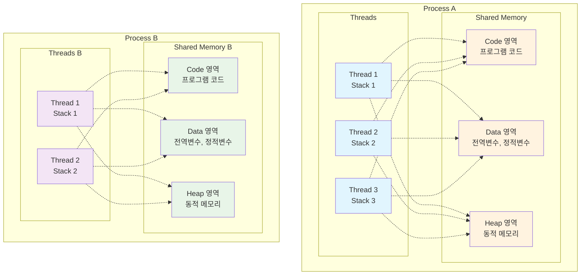

# [ 7주차 - 0925 ] 스터디 내용

```bash
    금일 커리큘럼
        ├ 09:00 ~ 14:00 FrontEnd (...other post)
        └ 14:00 ~ 18:00 자바 프로그래밍 (멀티스레드 기초)
```

## 1. java 멀티스레드 기초


### 프로세스와 스레드

* **프로세스(process)** : OS로부터 자원을 할당받아 실행 중인 프로그램의 인스턴스
    - 독립적인 메모리 공간 보유 (코드, 데이터, 힙, 스택)
    - 다른 프로세스와 메모리 공간 공유 불가
    - 프로세스 간 통신(IPC) 필요하고 복잡함
* **스레드(thread)** : 프로세스 내에서 실제 작업을 수행하는 실행 단위 
    - 프로세스 내에 여러 스레드 존재 가능


