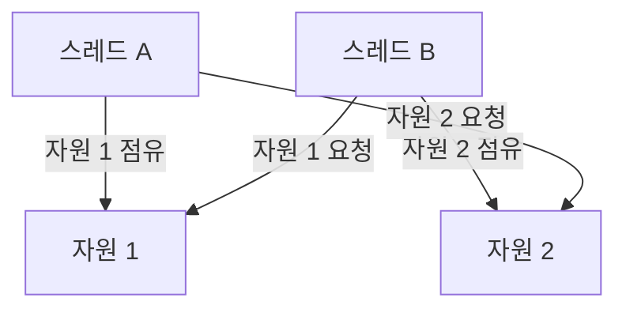

# [ 8주차 - 0929 ] 스터디 내용

```bash
    금일 커리큘럼
        ├ 09:00 ~ 14:00 백엔드 프로그래밍 (스레드 간 통신, 스레드 제어, 데드락 해결방식, 유틸 concurrent)
        └ 14:00 ~ 18:00 백엔드 프로그래밍 (함수형 프로그래밍, 함수형 인터페이스와 람다식)
```

## 1. 스레드 간 통신

> 스레드 간 협력을 위한 통신 방법


* **스레드 간 통신이란?**
  - 멀티스레드 환경에서 스레드들이 서로 데이터를 주고받거나 상태를 공유하는 것을 의미
  - 스레드 간 통신을 통해 동기화 문제를 해결하고, 효율적인 자원 관리를 할 수 있음


### 관련 메서드

* `wait()`: 현재 스레드를 **대기 상태로 전환**함 
    - 다른 스레드가 `notify()` 또는 `notifyAll()`을 호출할 때까지 기다림
* `notify()`: 대기 중인 스레드 중 **하나**를 깨움
* `notifyAll()`: 대기 중인 **모든 스레드**를 깨움


### 관련 예시

```java
class SharedResource {
    private int data;
    private boolean available = false;

    public synchronized int consume() throws InterruptedException {
        while (!available) {
            System.out.println("[consume] 대기중..");
            wait(); // 데이터가 없으면 대기
        }
        available = false;
        notify(); // 생산자에게 알림
        return data;
    }

    public synchronized void produce(int value) throws InterruptedException {
        while (available) {
            System.out.println("[produce] 대기중..");
            wait(); // 데이터가 있으면 대기
        }
        data = value;
        available = true;
        notify(); // 소비자에게 알림
    }
}
public class ProducerConsumerExam {
    public static void main(String[] args) {
        SharedResource resource = new SharedResource();

        Thread producer = new Thread(() -> {
            try {
                for (int i = 1; i <= 5; i++) {
                    System.out.println("Producing: " + i);
                    resource.produce(i);
                    Thread.sleep(500); // 생산 속도 조절
                }
            } catch (InterruptedException e) {
                Thread.currentThread().interrupt();
            }
        });

        Thread consumer = new Thread(() -> {
            try {
                for (int i = 1; i <= 5; i++) {
                    int value = resource.consume();
                    System.out.println("Consuming: " + value);
                    Thread.sleep(1000); // 소비 속도 조절
                }
            } catch (InterruptedException e) {
                Thread.currentThread().interrupt();
            }
        });

        producer.start();
        consumer.start();
    }
}
```

```bash
# 출력 결과
[consume] 대기중..
Producing: 1
Consuming: 1
Producing: 2
Consuming: 2
Producing: 3
Producing: 4
[produce] 대기중..
Consuming: 3
Producing: 5
[produce] 대기중..
Consuming: 4
Consuming: 5
...
```

---


## 2. 스레드제어 - 복습 (join, interrupt, setPriority)

> 스레드의 실행 흐름을 제어하는 방법

### join()

* `join()`: 특정 스레드가 종료될 때까지 현재 스레드를 대기 상태로 만듬

```java
public class JoinExam {
    public static void main(String[] args) {
        System.out.println("메인 시작");
        Thread thread1 = new Thread(() -> {
            System.out.println("스레드1 start");
            try {
                Thread.sleep(2000); // 2초 대기
            } catch (InterruptedException e) {
                e.printStackTrace();
            }
            System.out.println("스레드1 end");
        });

        thread1.start();
        try {
            thread1.join(); // thread1이 종료될 때까지 대기
        } catch (InterruptedException e) {
            Thread.currentThread().interrupt();
        }
        System.out.println("메인 종료");
    }
}
```

```bash
# 출력 결과
메인 시작
스레드1 start
스레드1 end
메인 종료
```

### interrupt()

* `interrupt()`: 스레드가 대기 상태에 있을 때 인터럽트를 발생시켜 대기 상태에서 벗어나게 함

```java
public class InterruptExam {
    public static void main(String[] args) throws InterruptedException {
        Thread thread1 = new Thread(() -> {
            try {
                for (int i = 1; i <= 10; i++) {
                    System.out.println("작업중 " + i + "/10");
                    Thread.sleep(1000);
                }
            } catch (InterruptedException e) {
                System.out.println("작업 중단!");
                return;
            }
            System.out.println("10번 작업 완료");
        });

        thread1.start();

        Thread.sleep(3500); // 3.5초 대기
        thread1.interrupt(); // 작업 중단 요청
    }
}
```

```bash
# 출력 결과
작업중 1/10
작업중 2/10
작업중 3/10
작업중 4/10
작업 중단!
```

### setPriority()

* `setPriority()`: 스레드의 우선순위를 설정함 (1~10 사이의 값, 기본값은 5)
  - 우선순위가 높은 스레드가 CPU 시간을 더 많이 할당받을 가능성이 높음
  - 하지만, 우선순위는 절대적인 것이 아니며, 운영체제의 스케줄링 정책에 따라 다르게 동작할 수 있음

```java

public class PriorityExam {
    public static void main(String[] args) {
        Thread thread1 = new Thread(() -> {
            for (int i = 1; i <= 3; i++) {
                System.out.println("[thread1] 작업중 " + i + "/3");
                try {
                    Thread.sleep(1000);
                } catch (InterruptedException e) {
                    System.out.println("[thread1] 작업 중단!");
                }
            }
        });

        Thread thread2 = new Thread(() -> {
            for (int i = 1; i <= 3; i++) {
                System.out.println("[thread2] 작업중 " + i + "/3");
                try {
                    Thread.sleep(1000);
                } catch (InterruptedException e) {
                    System.out.println("[thread2] 작업 중단!");
                }
            }
        });


        Thread thread3 = new Thread(() -> {
            for (int i = 1; i <= 3; i++) {
                System.out.println("[thread3] 작업중 " + i + "/3");
                try {
                    Thread.sleep(1000);
                } catch (InterruptedException e) {
                    System.out.println("[thread3] 작업 중단!");
                }
            }
        });
    
        // setPriority 우선순위 지정 (높은값 우선)
        thread1.setPriority(Thread.MIN_PRIORITY); // 우선순위 낮음 - 1
        thread2.setPriority(Thread.MAX_PRIORITY); // 우선순위 높음 - 10
        thread3.setPriority(5); // 정수로 지정가능

        thread1.start();
        thread2.start();
        thread3.start();
    }
}
```

```bash
# 출력 결과
[thread2] 작업중 1/3
[thread3] 작업중 1/3
[thread1] 작업중 1/3

...ing

```

---


## 3. 데드락 & 해결방식

> 데드락 ? 둘 이상의 스레드가 서로 상대방이 점유하고 있는 자원을 기다리느라 무한 대기 상태 빠지는 경우



### 데드락 발생 조건 ?

1. **상호 배제**: 자원은 한 번에 하나의 스레드만 사용할 수 있음
2. **점유와 대기**: 스레드가 최소한 하나의 자원을 점유하고 다른 자원을 기다림
3. **비선점**: 자원을 강제로 빼앗을 수 없음
4. **순환 대기**: 스레드들이 서로 순환적으로 자원을 기다림


### 데드락 강제 발생 예시

```java

public class DeadlockExam {
    public static void main(String[] args) {
        final Object resource1 = new Object();
        final Object resource2 = new Object();

        // 스레드 A
        Thread threadA = new Thread(() -> {
            synchronized (resource1) {
                System.out.println("스레드 A: 자원1 점유");
                try {
                    Thread.sleep(100);
                } catch (InterruptedException e) {
                    System.out.println(e.getMessage());
                }
                synchronized (resource2) {
                    System.out.println("스레드 A: 자원2 점유");
                }
            }
        });

        // 스레드 B
        Thread threadB = new Thread(() -> {
            synchronized (resource2) {
                System.out.println("스레드 B: 자원2 점유");
                try {
                    Thread.sleep(100);
                } catch (InterruptedException e) {
                    System.out.println(e.getMessage());
                }
                synchronized (resource1) {
                    System.out.println("스레드 B: 자원1 점유");
                }
            }
        });

        // 100ms 동안 실행임
        threadA.start();
        threadB.start();

        // 1000ms 뒤에도 A,B가 아직도 실행중이면 ? 데드락임!
        new Thread(() -> {
            try {
                Thread.sleep(1000);
            } catch (InterruptedException e) {
                System.out.println(e.getMessage());
            }
            // isAlive : 스레드가 아직 실행중인지?
            if (threadA.isAlive() && threadB.isAlive()) {
                System.out.println("!!!! 데드락 발생 감지 !!!!");
            }
        }).start();
    }
}
```

```bash
# 출력 결과 (데드락 발생)

# 100ms
스레드 A: 자원1 점유
스레드 B: 자원2 점유

# 1000ms 
!!!! 데드락 발생 감지 !!!!
```

### 데드락 해결방식

> 데드락 진입점 통일


* **진입점 lock 통일**: 모든 스레드가 동일한 순서로 자원을 요청하도록 설계
  - 예시에서 `method1`과 `method2` 모두 `lock1`을 먼저 획득하도록 변경
  - 이렇게 하면 순환 대기 조건이 발생하지 않음

```java
public class DeadlockExam1 {
    private final Object lock1 = new Object();
    private final Object lock2 = new Object();
    private final Object lock3 = new Object();

    // 진입점 락 통일 (lock1)
    public void method1() {
        synchronized(lock1) {
            synchronized(lock2) {
                // 작업 수행
                synchronized(lock3) {
                    // 작업 수행
                }
            }
        }
    }

    // 진입점 락 통일 (lock1)
    public void method2() {
        synchronized(lock1) {
            synchronized(lock3) {
                // 작업 수행
                synchronized(lock2) {
                    // 작업 수행
                }
            }
        }
    }
}
```


> 데드락 타임아웃 설정

* **타임아웃 설정**: `tryLock()` 메서드를 사용하여 일정 시간 동안만 자원을 요청
  - 일정 시간 내에 자원을 획득하지 못하면 요청을 포기하고 다시 시도
  - 이렇게 하면 데드락 상황에서 벗어날 수 있음

* **ReentrantLock**
    - 자바에서 제공하는 락 클래스중 하나
    - `synchronized` 키워드보다 더 세밀한 락 제어 가능
    - 옵션으로 공정성(fairness) 설정 가능
        - false가 기본값 (비공정)
        - **true로 설정** 시, 대기 시간이 오래된 스레드가 우선적으로 락을 획득


```java

import java.util.concurrent.TimeUnit;
import java.util.concurrent.locks.ReentrantLock;

public class TimeoutExam {
    // 공정성 옵션: true면 대기 시간 오래된 스레드에 우선권 (기아 방지 도움)
    private final ReentrantLock lock1 = new ReentrantLock(true);
    private final ReentrantLock lock2 = new ReentrantLock(true);

    public void timeoutRun() throws InterruptedException {
        final long TIMEOUT_MS = 1000; // tryLock 대기시간

        while (true) {
            // currentThread() : 현재 실행중인 스레드 반환
            // isInterrupted() : 외부에서 인터럽트 요청이 왔는지 확인
            if (Thread.currentThread().isInterrupted()) {
                // 외부에서 인터럽트 요청 시 깔끔히 종료
                throw new InterruptedException("작업이 인터럽트되었습니다.");
            }

            boolean isRun1 = false;
            boolean isRun2 = false;
            boolean needBackoff = false; // 백오프실행 여부

            try {
                // lock1 시도 (timeout)
                isRun1 = lock1.tryLock(TIMEOUT_MS, TimeUnit.MILLISECONDS);
                
                // isRun1 실패: 락 점유 X -> 바로 재시도해도 OK
                if (!isRun1) continue; // 실패 시 재시도 (while 로 돌아감)
                
                System.out.println(Thread.currentThread().getName() + " : lock1 획득");

                // lock2 시도 (timeout)
                isRun2 = lock2.tryLock(TIMEOUT_MS, TimeUnit.MILLISECONDS);
                
                // isRun2 실패: 이미 lock1 점유중 상태 -> 먼저 해제하고 백오프 필요
                if (!isRun2) {
                    needBackoff = true; // 백오프 on
                } else {
                    System.out.println(Thread.currentThread().getName() + " : lock2 획득");
                    // ...
                    System.out.println(Thread.currentThread().getName() + " : 작업 수행 완료");
                    return; // 성공적으로 종료
                }
            } finally {
                // 락 해제 역순
                if (isRun2) lock2.unlock();
                if (isRun1) lock1.unlock();
            }
            if (needBackoff) {
                // 모든 락 해제 후에 백오프 수행
                Thread.yield();
                Thread.sleep(10);
            }
        }
    }

    // 메인 메서드
    public static void main(String[] args) {
        TimeoutExam exam = new TimeoutExam();

        // 스레드 여러 개 실행
        Runnable task = () -> {
            try {
                exam.timeoutRun();
            } catch (InterruptedException e) {
                System.out.println(Thread.currentThread().getName() + " : 인터럽트 발생");
            }
        };

        Thread t1 = new Thread(task, "스레드 A");
        Thread t2 = new Thread(task, "스레드 B");
        Thread t3 = new Thread(task, "스레드 C");

        t1.start();
        t2.start();
        t3.start();
    }
}
```

```bash
# 출력 결과
스레드 A : lock1 획득
스레드 A : lock2 획득
스레드 A : 작업 수행 완료
스레드 B : lock1 획득
스레드 B : lock2 획득
스레드 B : 작업 수행 완료
스레드 C : lock1 획득
스레드 C : lock2 획득
스레드 C : 작업 수행 완료
```

---

## 4. java.util.concurrent 패키지

### 4-1 ExecutorService

* 스레드 풀을 관리하고 작업을 효율적으로 처리할 수 있는 인터페이스

```java
import java.util.concurrent.ExecutorService;
import java.util.concurrent.Executors;
import java.util.concurrent.TimeUnit;

// 스레드 풀 예시
public class ThreadPoolExam {
    public static void main(String[] args) throws InterruptedException {
        // 고정 크기 스레드 풀 생성 (3개의 스레드)
        ExecutorService executor = Executors.newFixedThreadPool(3);

        // 3개의 작업 제출
        for (int i = 1; i <= 3; i++) {
            final int taskId = i;
            executor.submit(() -> {
                System.out.println("작업 " + taskId + " 시작");
                try {
                    Thread.sleep(2000); 
                } catch (InterruptedException e) {
                    System.out.println("작업 " + taskId + " 중단");
                }
                System.out.println("작업 " + taskId + " 완료");
            });
        }

        // 스레드 풀 종료 (새 작업 제출 불가)
        executor.shutdown();
        try {
            // 모든 작업이 끝나길 3초 기다림 (작업 2초라면 넉넉)
            if (!executor.awaitTermination(3, TimeUnit.SECONDS)) {
                // 제한 시간 안에 안 끝나면 스레드 풀 강제 종료
                executor.shutdownNow();
            }
        } catch (InterruptedException e) {
            executor.shutdownNow();
        }
        System.out.println("-- end --");
    }
}
```

```bash
# 출력 결과
작업 3 시작
작업 2 시작
작업 1 시작
작업 2 완료
작업 3 완료
작업 1 완료
-- end --
```


### 4-2 Future와 Callable

* **Future**: 비동기 작업의 결과를 나타내는 인터페이스
* **Callable**: 작업을 수행하고 결과를 반환할 수 있는 인터페이스

```java
import java.util.concurrent.Callable;
import java.util.concurrent.ExecutionException;
import java.util.concurrent.ExecutorService;
import java.util.concurrent.Executors;
import java.util.concurrent.Future;
import java.util.concurrent.TimeUnit;

// Future와 Callable 예시
public class FutureCallableExam {
    public static void main(String[] args) {
        // 고정 크기 스레드 풀 생성 (2개의 스레드)
        ExecutorService executor = Executors.newFixedThreadPool(2);

        // Callable 작업 정의
        Callable<Integer> task = () -> {
            System.out.println("작업 시작");
            Thread.sleep(2000); // 2초 대기
            System.out.println("작업 완료");
            return 100; // 결과 반환
        };

        // 작업 제출 및 Future 객체 반환
        Future<Integer> future = executor.submit(task);

        try {
            // 작업 결과 가져오기 (완료될 때까지 대기)
            Integer result = future.get();
            System.out.println("작업 결과: " + result);
        } catch (InterruptedException e) {
            System.out.println("작업 중단");
        } catch (ExecutionException e) {
            System.out.println("작업 중 예외 발생: " + e.getCause());
        } finally {
            // 스레드 풀 종료
            executor.shutdown();
        }
    }
}
```

```bash
# 출력 결과
작업 시작
작업 완료
작업 결과: 100
```


### 4-3 CountDownLatch

* 여러 스레드가 **특정 작업을 완료할 때까지 대기**하는 데 사용되는 동기화 도구
* CountDownLatch(int count) 생성자에서 초기 카운트를 설정

```java
import java.util.concurrent.CountDownLatch;
import java.util.concurrent.ExecutorService;
import java.util.concurrent.Executors;
import java.util.concurrent.TimeUnit;

// CountDownLatch 예시
public class CountDownLatchExam {
    public static void main(String[] args) throws InterruptedException {
        final int NUM_TASKS = 3;
        CountDownLatch latch = new CountDownLatch(NUM_TASKS);
        // 고정 크기 스레드 풀 생성 (3개의 스레드)
        ExecutorService executor = Executors.newFixedThreadPool(NUM_TASKS);

        // 작업 정의
        Runnable task = () -> {
            try {
                System.out.println(Thread.currentThread().getName() + " 작업 시작");
                Thread.sleep((long) (Math.random() * 3000)); // 랜덤 대기
                System.out.println(Thread.currentThread().getName() + " 작업 완료");
            } catch (InterruptedException e) {
                System.out.println(Thread.currentThread().getName() + " 작업 중단");
            } finally {
                latch.countDown(); // 작업 완료 시 카운트 다운
            }
        };

        // 작업 제출
        for (int i = 0; i < NUM_TASKS; i++) {
            executor.submit(task);
        }

        // 모든 작업이 완료될 때까지 대기
        latch.await();
        System.out.println("모든 작업 완료!");

        // 스레드 풀 종료
        executor.shutdown();
    }
}
```

```bash
# 출력 결과
pool-1-thread-1 작업 시작
pool-1-thread-2 작업 시작
pool-1-thread-3 작업 시작
pool-1-thread-3 작업 완료
pool-1-thread-2 작업 완료
pool-1-thread-1 작업 완료
모든 작업 완료!

```


### 4-4 ConcurrentHashMap

* 멀티스레드 환경에서 안전하게 사용할 수 있는 해시맵 구현체
* 내부적으로 세그먼트 락을 사용하여 동시성을 향상시킴

```java
import java.util.Map;
import java.util.concurrent.ConcurrentHashMap;
import java.util.concurrent.ExecutorService;
import java.util.concurrent.Executors;
import java.util.concurrent.TimeUnit;

// ConcurrentHashMap 예시
public class ConcurrentHashMapExam {
    public static void main(String[] args) throws InterruptedException {
        Map<String, Integer> map = new ConcurrentHashMap<>();
        // 고정 크기 스레드 풀 생성 (5개의 스레드)
        ExecutorService executor = Executors.newFixedThreadPool(5);

        // 1000개의 작업 제출
        for (int i = 0; i < 1000; i++) {
            final int taskId = i;
            executor.submit(() -> {
                map.put("key" + taskId, taskId);
            });
        }

        // 스레드 풀 종료
        executor.shutdown();
        // 모든 작업이 끝나길 1초마다 확인
        while (!executor.awaitTermination(1, TimeUnit.SECONDS)) {
            System.out.println("아직 작업 중...");
        }

        // 맵 크기 출력 (1000이어야 함)
        System.out.println("작업완료\n맵 크기: " + map.size());
    }
}
```

```bash
# 출력 결과
아직 작업 중...
작업완료
맵 크기: 1000
```

---

## 5. 성능 최적화 팁

### 5.1 스레드 풀 크기 조정

* CPU 코어 수에 맞게 스레드 풀 크기 설정
* I/O 작업이 많은 경우 더 큰 스레드 풀 사용 고려
* CPU 작업이 많은 경우 코어 수와 동일하거나 약간 큰 크기 설정

```java
import java.util.concurrent.ExecutorService;
import java.util.concurrent.Executors;

// 최적 스레드 풀 크기 예시
public class OptimalThreadPool {
    public static void main(String[] args) {
        // CPU 집약적 작업
        // Runtime 객체를 통해 CPU 코어 수 확인
        // getRuntime() : 현재 실행중인 자바 프로그램의 런타임 객체 반환
        // availableProcessors() : 사용 가능한 프로세서 수 반환
        int coreCount = Runtime.getRuntime().availableProcessors();


        // I/O 집약적 작업
        // 작업비율에 따라 스레드 수 조정 0% ~ 100%
        double blockingPercent = 0.4; // I/O 작업 비율 40%

        // 최적 스레드 수 계산
        // CPU 코어 수 / (1 - 블로킹 계수)
        int optimalThreadCount = (int) (coreCount / (1 - blockingPercent));

        // CPU 코어 수에 맞게 스레드 풀 생성
        ExecutorService executor = Executors.newFixedThreadPool(optimalThreadCount);
        System.out.println("CPU 코어 수: " + coreCount);
        System.out.println("I/O 작업 비율: " + (blockingPercent * 100) + "%");
        System.out.println("최적 스레드 수: " + optimalThreadCount);
        
        // 스레드 풀 종료
        executor.shutdown();
    }
}
```

```bash
# 출력 결과
CPU 코어 수: 6
I/O 작업 비율: 40.0%
최적 스레드 수: 10
```

### 5.2 락 경합 최소화

* 동기화는 성능 저하의 원인이 될 수 있으므로, 꼭 필요한 부분에만 사용

```java
public class LockGoodExam {
    private final Object lock = new Object();
    private int count = 0;

    // 안좋은 예
    public void badMethod() {
        synchronized(lock) {
            longRun(); // 긴작업..
            commonData(); // 실제 동기화가 필요한 부분
        }
    }

    // 좋은 예
    public void goodMethod() {
        longRun(); // 락 밖에서 수행
        synchronized(lock) {
            commonData(); // 필요한 부분만 동기화
        }
    }

    private void longRun() {
        try {
            Thread.sleep(2000); // 2초 대기
        } catch (InterruptedException e) {
            System.out.println(e.getMessage());
            Thread.currentThread().interrupt();
        }
    }

    private void commonData() {
        count++;
        System.out.println("[" + Thread.currentThread().getName() + "] count: " + count);
    }

    public static void main(String[] args) {
        LockGoodExam exam = new LockGoodExam();

        Runnable badTask = () -> exam.badMethod();
        Runnable goodTask = () -> exam.goodMethod();

        // 스레드 풀 예시
        Thread t1 = new Thread(badTask, "스레드 A");
        Thread t2 = new Thread(badTask, "스레드 B");

        Thread t3 = new Thread(goodTask, "스레드 C");
        Thread t4 = new Thread(goodTask, "스레드 D");

        System.out.println("─── badMethod 실행 ───");
        t1.start();
        t2.start();

        try { Thread.sleep(4100); } catch (InterruptedException e) {}

        System.out.println("\n─── goodMethod 실행 ───");
        t3.start();
        t4.start();
    }
}
```

```bash
# 출력 결과
─── badMethod 실행 ───
[스레드 A] count: 1 # 2초뒤..
[스레드 B] count: 2 # 2초뒤..
# 약 4초 소요

─── goodMethod 실행 ───
[스레드 C] count: 3
[스레드 D] count: 4
# 약 2초 소요
```

### 5.3 ThreadLocal 사용

> ThreadLocal ? 스레드마다 독립적인 변수를 유지할 수 있도록 도와주는 클래스

* 스레드 간 변수 공유로 인한 동기화 문제를 방지

```java
import java.text.SimpleDateFormat;
import java.util.Date;

public class ThreadLocalExam {
    // 각 스레드마다 독립적인 SimpleDateFormat 객체를 생성
    private static final ThreadLocal<SimpleDateFormat> dateFormatter =
            ThreadLocal.withInitial(() -> new SimpleDateFormat("yyyy-MM-dd HH:mm:ss"));

    public String formatDate(Date date) {
        // 각 스레드가 자신만의 SimpleDateFormat 인스턴스 사용
        return dateFormatter.get().format(date);
    }

    public static void main(String[] args) {
        ThreadLocalExam exam = new ThreadLocalExam();

        // 여러 스레드에서 안전하게 사용
        for (int i = 0; i < 5; i++) {
            int cnt = i;
            new Thread(() -> {
                Date now = new Date(); // java.util.Date 객체
                String formatted = exam.formatDate(now); // ThreadLocal 포맷 사용
                System.out.println("[" + cnt + "] " + Thread.currentThread().getName() +
                        ": " + formatted);
            }).start();
        }
    }
}
```

```bash
# 출력 결과
[2] Thread-2: 2025-09-29 11:58:51
[3] Thread-3: 2025-09-29 11:58:51
[4] Thread-4: 2025-09-29 11:58:51
[0] Thread-0: 2025-09-29 11:58:51
[1] Thread-1: 2025-09-29 11:58:51
```

---


## 6. 자바에서의 함수형 프로그래밍

### 자바에서 함수 ?

* 자바는 함수형 프로그래밍 언어가 아니므로, 함수 자체를 독립적으로 다룰 수 없음
* 대신, **함수형 인터페이스**를 통해 함수처럼 동작하는 객체를 만들 수 있음
* **람다식**으로 별도 로직 간결하게 가능


### 프로그래밍 패러다임

* **명령형 프로그래밍** : 절차지향, 객체지향, 상태 변화 중심 (어떻게 할건지)
    - ex) 자바, C, C++, Python, JavaScript(일부)

* **선언형 프로그래밍** : 함수형, 논리형, 결과 중심 (무엇을 할건지)
    - ex) javaScript(일부), SQL


### 함수형 프로그래밍 특징

* **1급 시민**: 프로그래밍 언어에서 함수가 다른 데이터 타입과 동일하게 취급되는 것
    - 함수가 변수에 할당되거나, 매개변수로 전달되거나, 반환값으로 사용될 수 있음
* **순수 함수**: 동일한 입력에 대해 항상 동일한 출력을 반환하며, 부작용이 없음
    - 즉, **부수효과 제거된 것**
    - 부수효과 : 함수 외부 상태 변경, I/O 작업 등
* **불변성**: 데이터가 변경되지 않고, 새로운 데이터를 생성하여 사용


---

## 7. 함수형 인터페이스와 람다식

> 함수형 인터페이스와 람다식을 통해 함수형 프로그래밍 구현

* **함수형 인터페이스**: 단 하나의 추상 메서드만을 가지는 인터페이스
    - `@FunctionalInterface` 애노테이션으로 명시 가능 (선택사항)
    - 익명 클래스, 람다식 등으로 구현 가능

* **람다식**: 익명 함수 표현식으로, 간결하게 함수형 인터페이스 구현 가능
    - `(매개변수) -> { 실행문 }` 형태
    - 매개변수가 하나일 때는 괄호 생략 가능
    - **매개변수는 타입 추론 가능**
    - 실행문이 하나일 때는 중괄호와 return 생략 가능

```java
// 함수형 인터페이스 애노테이션
@FunctionalInterface
interface RunFunc {
    void run();
}

@FunctionalInterface
interface PlusFunc {
    int plus(int a, int b);
}

class FuncImpl implements RunFunc {
    @Override
    public void run() {
        System.out.println("임플리 run");
    }
}

public class FuncImplTest {
    public static void main(String[] args) {
        // 1. 익명 객체 사용
        RunFunc funcTest1 = new RunFunc() {
            @Override
            public void run() {
                System.out.println("재정의 run");
            }
        };

        // 2. 클래스 구현 사용
        RunFunc funcTest2 = new FuncImpl();

        // 3. 람다식 사용
        RunFunc funcTest3 = () -> System.out.println("람다 run");

        // 4. 매개변수, 반환값 있는 람다식
        PlusFunc funcTest4 = (a, b) -> {
            // 매개변수 int 생략 가능 - 타입 추론
            int result = 0;
            for (int i = a; i <= b; i++) {
                result += i;
            }
            return result;
        };

        funcTest1.run();
        funcTest2.run();
        funcTest3.run();
        int result = funcTest4.plus(1, 10);

        System.out.println("람다 run 2 결과: " + result);
    }
}
```

```bash
# 출력 결과
재정의 run
임플리 run
람다 run
람다 run 2 결과: 55
```

### 자바 표준 함수형 인터페이스

> java.util.function 패키지에 다양한 표준 함수형 인터페이스 제공

* **Runnable** : 매개변수 없고, 반환 X
    - `void run()`
* **Consumer\<T>** : 매개변수 하나, 반환 X
    - `void accept(T t)`
* **Function\<T, R>** : 매개변수 하나, R타입 반환 O
    - `R apply(T t)`
* **BiFunction\<T, U, R>** : 매개변수 두개, R타입 반환 O
    - `R apply(T t, U u)`
* **Predicate\<T>** :  매개변수 하나, boolean 반환
    - `boolean test(T t)`
* **Supplier\<R>** : 매개변수 없고, R타입 반환
    - `R get()`

**T: 입력 타입 / U: 두번째 입력 타입 / R: 반환 타입**

#### 유틸 펀션 예시

```java
import java.util.function.*;

public class StandardFuncExam {
    public static void main(String[] args) {
        // 매개변수 없고, 반환 X
        Runnable r = () -> System.out.println("Runnable 실행");
        r.run();

        // 매개변수 하나, R 반환 X
        Consumer<String> consumer = (s) -> System.out.println("Consumer: " + s);
        consumer.accept("Hello");

        // 매개변수 하나, R 반환 O
        Function<Integer, String> function = (i) -> "Function: " + (i * 2);
        String result = function.apply(5);
        System.out.println(result);

        // 매개변수 두개, R 반환 O
        BiFunction<Integer, Integer, Integer> biFunction = (a, b) -> a + b;
        int sum = biFunction.apply(3, 7);
        System.out.println("BiFunction: " + sum);

        // 매개변수 하나, boolean 반환
        Predicate<String> predicate = (s) -> s.length() > 5;
        boolean testResult = predicate.test("스트링 길이 넘었나요?");
        System.out.println("Predicate: " + testResult);

        // 매개변수 없고, R 반환 O
        Supplier<Integer> supplier = () -> (int)(Math.random()*10) + 1;
        int randomValue = supplier.get();
        System.out.println("Supplier: " + randomValue);
    }
}
```

```bash
# 출력 결과
Runnable 실행
Consumer: Hello
Function: 10
BiFunction: 10
Predicate: true
Supplier: 7 # (랜덤값)
```

---

## 8. 람다식과 컬렉션

> 람다식을 활용하여 컬렉션 데이터를 간결하게 처리

* **Stream API** 활용
    - Stream ? 컬렉션 요소를 함수형으로 처리할 수 있는 기능
    - forEach, map, filter, reduce 등 **다양한 메서드 사용**


### 리스트 처리 예시

```java
import java.util.Arrays;
import java.util.List;
import java.util.stream.Collectors;
import java.util.stream.IntStream;

public class LambdaCollectionExam {
    public static void main(String[] args) {
        List<String> names = Arrays.asList("신짱구", "김철수", "유리", "훈이", "맹구");

        // 1. forEach : 각 요소 출력
        System.out.println("─── forEach ───");
        names.forEach(item -> {
            System.out.print(item + " ");
        });
        System.out.println();

        // 1-1. forEach 내 idx 활용
        System.out.println("\n─── forEach + IntStream (index추가) ───");
        IntStream.range(0, names.size())
                .forEach(idx -> {
                    if(idx != names.size() - 1) System.out.printf("[%d] %s | ", idx, names.get(idx));
                    else System.out.printf("[%d] %s%n", idx, names.get(idx));
                });

        // 2. map : name + 님
        System.out.println("\n─── map (+ 님) ───");
        List<String> upperNames = names.stream()
                .map(item -> item + "님")
                .collect(Collectors.toList());

        upperNames.forEach(item -> System.out.print(item + " "));
        System.out.println();

        // 3. filter : 이름 길이가 3 이상인 요소만 필터링
        System.out.println("\n─── filter (길이 >= 3) ───");
        List<String> longNames = names.stream()
                .filter(name -> name.length() >= 3)
                .collect(Collectors.toList());

        longNames.forEach(name -> System.out.print(name + " "));
        System.out.println();

        // 4. reduce : 모든 이름을 하나의 문자열로 결합
        System.out.println("\n─── reduce (모든 이름 결합) ───");
        String allNames = names.stream()
                .reduce((item1, item2) -> item1 + ", " + item2)
                .orElse("없는데요?");
        System.out.println("모든 이름: " + allNames);

        // 5. sorted : 이름을 가나다순으로 정렬
        System.out.println("\n─── sorted (가나다순) ───");
        List<String> sortedNames = names.stream()
                .sorted()
                .collect(Collectors.toList());
        sortedNames.forEach(name -> System.out.print(name + " "));
        System.out.println();
        // sorted : 디폴트 오름차순
        // sorted(Comparator.reverseOrder()) : 내림차순
    }
}
```

```bash
# 출력 결과
─── forEach ───
신짱구 김철수 유리 훈이 맹구 

─── forEach + IntStream ───
[0] 신짱구 | [1] 김철수 | [2] 유리 | [3] 훈이 | [4] 맹구

─── map (+ 님) ───
신짱구님 김철수님 유리님 훈이님 맹구님 

─── filter (길이 >= 3) ───
신짱구 김철수

─── reduce (모든 이름 결합) ───
모든 이름: 신짱구, 김철수, 유리, 훈이, 맹구

─── sorted (가나다순) ───
김철수 맹구 신짱구 유리 훈이 
```

**예제 관련 sort() 와 sorted() 차이**

- sort() : 리스트 자체를 정렬 (원본 변경 o)
    - sort 스트림 메서드가 아님
- sorted() : 스트림 요소를 정렬 (새로운 스트림 반환, 원본 변경 x)
    - 디폴트 오름차순
    - () 내 Comparator 지정 가능
    - `sorted(Comparator.reverseOrder())` : 내림차순 정렬
    - `sorted(Comparator.comparing(String::length))` : 길이순 정렬
    - `sorted(Comparator.comparing(String::toUpperCase))` : 대문자순 정렬
    - `sorted(Comparator.comparing(<대상클래스>::<대상메서드>)` : 대상 메서드 지정 가능


### 메서드 참조 예시

> 메서드 참조 ? 람다식에서 특정 메서드를 직접 참조

```java
import java.util.Arrays;
import java.util.List;
import java.util.stream.Collectors;
import java.util.stream.IntStream;
import java.util.Comparator;

public class MethodRefExam {
    public static void main(String[] args) {
        List<String> names = Arrays.asList("신짱구", "김철수", "유리", "훈이", "맹구");

        // 1. 정적 메서드 참조
        System.out.println("─── 정적 메서드 참조 ───");
        List<String> upperNames = names.stream()
                .map(String::toUpperCase) // 람다식 (item -> item.toUpperCase()) 와 동일
                .collect(Collectors.toList());

        // 2. 인스턴스 메서드 참조
        System.out.println("\n─── 인스턴스 메서드 참조 ───");
        List<String> sortedNames = names.stream()
                .sorted(Comparator.comparing(String::length)) // 길이순 정렬
                .collect(Collectors.toList());

        sortedNames.forEach(System.out::println); 

        // 3. 생성자 참조
        System.out.println("\n─── 생성자 참조 ───");
        List<String> copiedNames = names.stream()
                .map(String::new) // 새로운 String 객체 생성
                .collect(Collectors.toList());

        copiedNames.forEach(System.out::println);
    }
}
```
        