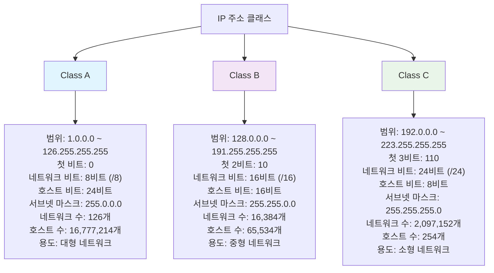

# [ 8주차 - 1001 ] 스터디 내용

```bash
    금일 커리큘럼
        ├ 09:00 ~ 14:00 Network 프로그래밍
        └ 14:00 ~ 18:00 Network 프로그래밍
```

## 1. Network 기본 개념

### IP Address

> IP : 인터넷에 연결된 장치(컴퓨터, 스마트폰 등)를 식별하는 고유한 주소 (IPv4, IPv6)


**IPv4 (Internet Protocol version 4)**
- **32비트 주소 체계 (4바이트)**
- 4개의 옥텟(8비트)로 구성, 각 옥텟은 0~255 범위의 값을 가짐
    - 예시: 192.168.0.1
- 주소 한계 : 약 42억 개 (2^32)
- 주소 고갈 발생 대비 IPv6 등장됨

**IPv6 (Internet Protocol version 6)**
- **128비트 주소 체계 (16바이트)**
- 8개 필드의 16비트로 구성, 각 필드는 콜론(:)으로 구분됨
- 예시: 2001:0db8:85a3:0000:0000:8a2e:0370:7334
- 주소 한계 : 약 340억 개 (2^128)

### IP 주소 체계 - 서브넷 마스크(Subnet Mask)

> IP 주소를 네트워크 부분과 호스트 부분으로 나누는 데 사용

- **서브넷 마스크**
    - 네트워크 부분과 호스트 부분을 구분하는 데 사용되는 32비트 숫자

- **CIDR (Classless Inter-Domain Routing) 표기법**
    - IP 주소 뒤에 슬래시(/)와 숫자를 붙여 네트워크 부분의 비트 수를 나타냄
    - 예시: 192.168.0.0/24

- **ip 주소 구성**
    - Network ID: 네트워크를 식별
    - Host ID: 네트워크 내의 개별 장치를 식별
    - 즉 IP address = Network ID + Host ID

### IP 주소 클래스

> IP 주소를 네트워크 크기에 따라 분류한 것

