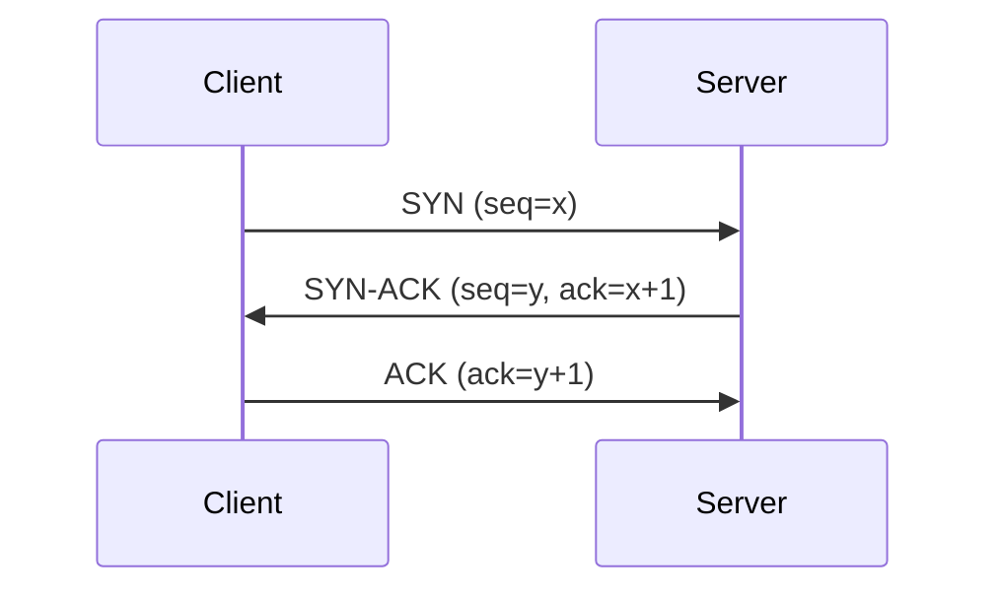

# [ 8주차 - 1001 ] 스터디 내용

```bash
    금일 커리큘럼
        ├ 09:00 ~ 14:00 Network 프로그래밍
        └ 14:00 ~ 18:00 Network 프로그래밍
```

## 1. Network 기본 개념

### IP Address

> IP : 인터넷에 연결된 장치(컴퓨터, 스마트폰 등)를 식별하는 고유한 주소 (IPv4, IPv6)


#### **IPv4 (Internet Protocol version 4)**
- **32비트 주소 체계 (4바이트)**
- 4개의 옥텟(8비트)로 구성, 각 옥텟은 0~255 범위의 값을 가짐
    - 예시: 192.168.0.1
- 주소 한계 : 약 42억 개 (2^32)
- 주소 고갈 발생 대비 IPv6 등장됨

#### **IPv6 (Internet Protocol version 6)**
- **128비트 주소 체계 (16바이트)**
- 8개 필드의 16비트로 구성, 각 필드는 콜론(:)으로 구분됨
- 예시: 2001:0db8:85a3:0000:0000:8a2e:0370:7334
- 주소 한계 : 약 340억 개 (2^128)

### IP 주소 체계 - 서브넷 마스크(Subnet Mask)

> IP 주소를 네트워크 부분과 호스트 부분으로 나누는 데 사용

####  **서브넷 마스크**
- 네트워크 부분과 호스트 부분을 구분하는 데 사용되는 32비트 숫자

#### **CIDR (Classless Inter-Domain Routing) 표기법**
- IP 주소 뒤에 슬래시(/)와 숫자를 붙여 네트워크 부분의 비트 수를 나타냄
- 예시: 192.168.0.0/24

####  **ip 주소 구성**
- Network ID: 네트워크를 식별
- Host ID: 네트워크 내의 개별 장치를 식별
- 즉 IP address = Network ID + Host ID

### IP 주소 클래스

> IP 주소를 네트워크 크기에 따라 분류한 것

#### **클래스 A**
- 첫 번째 옥텟: 1~126
- 기본 서브넷 마스크: 255.0.0.0
- 대규모 네트워크에 사용 (16,777,214개의 호스트 가능)

#### **클래스 B**
- 첫 번째 옥텟: 128~191
- 기본 서브넷 마스크: 255.255.0.0
- 중규모 네트워크에 사용 (65,534개의 호스트 가능)

#### **클래스 C**
- 첫 번째 옥텟: 192~223
- 기본 서브넷 마스크: 255.255.255.0
- 소규모 네트워크에 사용 (254개의 호스트 가능)

### 공인 IP 주소 vs 사설 IP 주소

#### **공인 IP 주소 (Public IP Address)**
- 인터넷 상에서 고유하게 할당되는 IP 주소
- 전 세계적으로 유일하며, 인터넷 서비스 공급자(ISP)로부터 할당받음
- 예시: 203.0.113.1

#### **사설 IP 주소 (Private IP Address)**
- 내부 네트워크에서 사용되는 IP 주소
- 인터넷 상에서는 고유하지 않으며, 여러 네트워크에서 동일한 IP 주소를 가질 수 있음
- 예시: 192.168.0.1

---

## 2. TCP 통신 이해

### TCP (Transmission Control Protocol)

> 신뢰성 있는 데이터 전송을 보장하는 프로토콜


#### **TCP 특징**
- **연결 지향적**: 데이터 전송 전에 연결을 설정하고, 전송 후 연결을 종료
- **신뢰성**: 데이터의 순서 보장, 손실된 데이터 재전송
- **흐름 제어**: 수신자의 처리 능력에 맞춰 데이터 전송 속도 조절
- **혼잡 제어**: 네트워크 혼잡 상황에서 데이터 전송 속도 조절

### TCP 3-Way Handshake

> TCP 연결을 설정하는 과정

1. **SYN**: 클라이언트가 서버에 연결 요청 (SYN 플래그 설정)
2. **SYN-ACK**: 서버가 클라이언트의 요청을 수락 (SYN-ACK 플래그 설정)
3. **ACK**: 클라이언트가 서버의 응답을 확인 (ACK 플래그 설정)



---

## 3. Java 네트워크 프로그래밍

### InetAddress Class

> IP 주소와 도메인 이름을 다루는 클래스

#### **조회 메서드**
- `getByName(String host)`: 도메인 이름이나 IP 주소 문자열을 받아 해당하는 `InetAddress` 객체를 반환
- `getAllByName(String host)`: 도메인 이름에 해당하는 모든 IP 주소를 배열로 반환
- `getLocalHost()`: 로컬 호스트의 IP 주소를 반환

#### **정보 검색 메서드**
- `getHostName()`: 호스트 이름을 반환
- `getHostAddress()`: IP 주소를 문자열로 반환
- `isReachable(int timeout)`: 지정된 시간 내에 호스트에 도달할 수 있는지 확인

####  **주의**
- 네트워크 관련 코드에서 예외 처리는 필수 (예: `UnknownHostException`)
- **isReachable** 메서드는 방화벽 설정이나 네트워크 구성에 따라 다르게 동작할 수 있음
    - 해당 메서드 예외처리 `IOException` 임

### 사용예시

```java
import java.net.InetAddress;
// import java.io.IOException;
// import java.net.UnknownHostException;

public class InetAddressExample {
    public static void main(String[] args) throws Exception {
        // 사이트 IP 및 이름(host)
        InetAddress address = InetAddress.getByName("bootcamp.likelion.net");
        System.out.println("ip:: "  + address.getHostAddress());
        System.out.println("host:: "  + address.getHostName());
        // 도달 가능 여부 (ping 같은 기능)
        boolean b1 = address.isReachable(3000); // 3s
        System.out.println("도달가능:: " + b1); 
        // cmd의 ping과 다르게 false 뜨는 경우 (방화벽, 권한, 서버측 설정 등..)
        System.out.println("─".repeat(10));
        // -----------------

        // getAllByName : 해당 도메인 모든 IP 주소 가져옴
        InetAddress[] alladdress = InetAddress.getAllByName("www.google.com");
        for(InetAddress addr : alladdress) {
            System.out.println("ip:: "  + addr.getHostAddress());
        }
        System.out.println("─".repeat(10));
        // -----------------

        // 로컬 호스트 IP 주소 및 이름(host)
        InetAddress local = InetAddress.getLocalHost();
        System.out.println("local-ip:: "  + local.getHostAddress());
        System.out.println("local-host:: "  + local.getHostName());

        boolean b2 = local.isReachable(3000); // 3s
        System.out.println("도달가능:: " + b2); // 로컬은 무조건 true
        System.out.println("─".repeat(10));
        // -----------------

        // 바이트 배열로 IP 확인
        byte[] ip = local.getAddress();
        System.out.print("byte format:: ");
        for(int i = 0; i < ip.length; i++) {
            System.out.print(ip[i] & 0xFF);
            if(i < ip.length - 1) {
                System.out.print(".");
            }
        }
        System.out.println();

        // 루프백 주소 확인
        System.out.println("루프백 주소?:: " + local.isLoopbackAddress());

        // 사설 IP 확인
        System.out.println("사설 IP?:: " + local.isSiteLocalAddress());
    }
}

```

```bash
# 실행 결과
ip:: 000.000.000.000
host:: bootcamp.likelion.net
도달가능:: false
──────────
ip:: 000.000.000.000
──────────
local-ip:: 000.000.000.000
local-host:: star1431
도달가능:: true
──────────
byte format:: 000.000.000.000
루프백 주소?:: false
사설 IP?:: false
```

