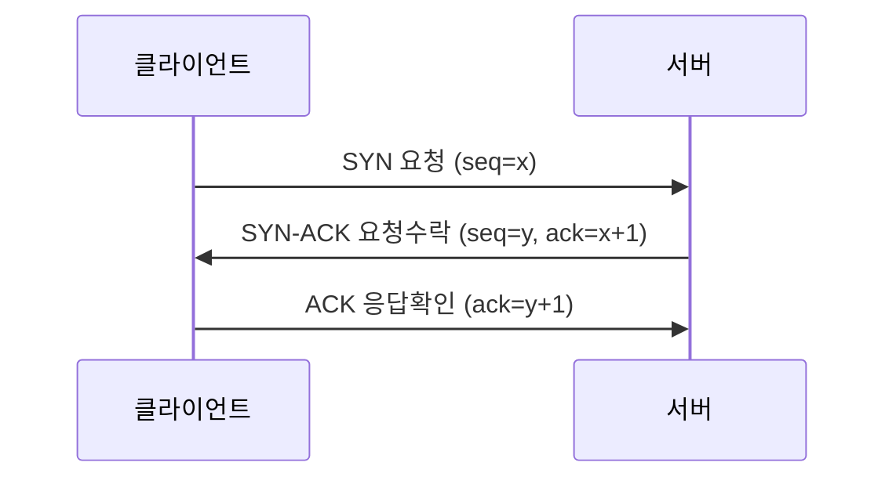
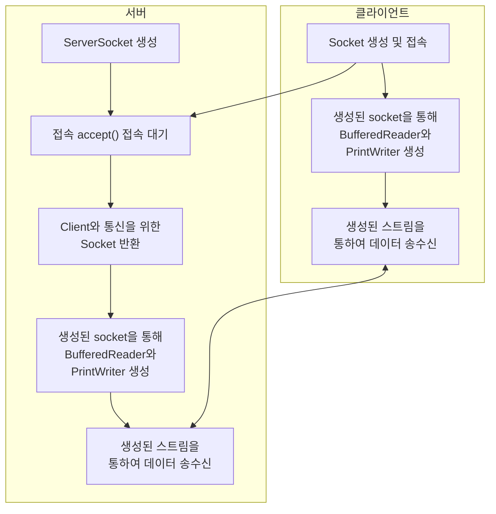
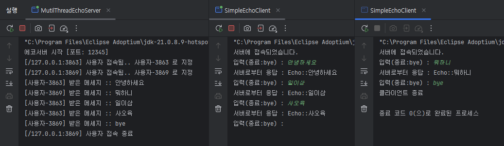

# [ 8주차 - 1001 ] 스터디 내용

```bash
    금일 커리큘럼
        ├ 09:00 ~ 14:00 Network 프로그래밍 (Network 기본 개념, TCP 통신 이해, Java 네트워크 프로그래밍)
        └ 14:00 ~ 18:00 Network 프로그래밍 (Java Socket, TCP 채팅 만들기)
```

## 1. Network 기본 개념

### IP Address

> IP : 인터넷에 연결된 장치(컴퓨터, 스마트폰 등)를 식별하는 고유한 주소 (IPv4, IPv6)


#### **IPv4 (Internet Protocol version 4)**
- **32비트 주소 체계 (4바이트)**
- 4개의 옥텟(8비트)로 구성, 각 옥텟은 0~255 범위의 값을 가짐
    - 예시: 192.168.0.1
- 주소 한계 : 약 42억 개 (2^32)
- 주소 고갈 발생 대비 IPv6 등장됨

#### **IPv6 (Internet Protocol version 6)**
- **128비트 주소 체계 (16바이트)**
- 8개 필드의 16비트로 구성, 각 필드는 콜론(:)으로 구분됨
- 예시: 2001:0db8:85a3:0000:0000:8a2e:0370:7334
- 주소 한계 : 약 340억 개 (2^128)

### IP 주소 체계 - 서브넷 마스크(Subnet Mask)

> IP 주소를 네트워크 부분과 호스트 부분으로 나누는 데 사용

####  **서브넷 마스크**
- 네트워크 부분과 호스트 부분을 구분하는 데 사용되는 32비트 숫자

#### **CIDR (Classless Inter-Domain Routing) 표기법**
- IP 주소 뒤에 슬래시(/)와 숫자를 붙여 네트워크 부분의 비트 수를 나타냄
- 예시: 192.168.0.0/24

####  **ip 주소 구성**
- Network ID: 네트워크를 식별
- Host ID: 네트워크 내의 개별 장치를 식별
- 즉 IP address = Network ID + Host ID

### IP 주소 클래스

> IP 주소를 네트워크 크기에 따라 분류한 것

#### **클래스 A**
- 첫 번째 옥텟: 1~126
- 기본 서브넷 마스크: 255.0.0.0
- 대규모 네트워크에 사용 (16,777,214개의 호스트 가능)

#### **클래스 B**
- 첫 번째 옥텟: 128~191
- 기본 서브넷 마스크: 255.255.0.0
- 중규모 네트워크에 사용 (65,534개의 호스트 가능)

#### **클래스 C**
- 첫 번째 옥텟: 192~223
- 기본 서브넷 마스크: 255.255.255.0
- 소규모 네트워크에 사용 (254개의 호스트 가능)

### 공인 IP 주소 vs 사설 IP 주소

#### **공인 IP 주소 (Public IP Address)**
- 인터넷 상에서 고유하게 할당되는 IP 주소
- 전 세계적으로 유일하며, 인터넷 서비스 공급자(ISP)로부터 할당받음
- 예시: 203.0.113.1

#### **사설 IP 주소 (Private IP Address)**
- 내부 네트워크에서 사용되는 IP 주소
- 인터넷 상에서는 고유하지 않으며, 여러 네트워크에서 동일한 IP 주소를 가질 수 있음
- 예시: 192.168.0.1

---

## 2. TCP 통신 이해

### TCP (Transmission Control Protocol)

> 신뢰성 있는 데이터 전송을 보장하는 프로토콜


#### **TCP 특징**
- **연결 지향적**: 데이터 전송 전에 연결을 설정하고, 전송 후 연결을 종료
- **신뢰성**: 데이터의 순서 보장, 손실된 데이터 재전송
- **흐름 제어**: 수신자의 처리 능력에 맞춰 데이터 전송 속도 조절
- **혼잡 제어**: 네트워크 혼잡 상황에서 데이터 전송 속도 조절

### TCP 3-Way Handshake

> TCP 연결을 설정하는 과정

1. **SYN**: 클라이언트가 서버에 연결 요청 (SYN 플래그 설정)
2. **SYN-ACK**: 서버가 클라이언트의 요청을 수락 (SYN-ACK 플래그 설정)
3. **ACK**: 클라이언트가 서버의 응답을 확인 (ACK 플래그 설정)

#### **TCP 3-Way Handshake 과정**



#### **java TCP통신 연결 과정**



---

## 3. Java 네트워크 프로그래밍

### InetAddress Class

> IP 주소와 도메인 이름을 다루는 클래스

#### **조회 메서드**
- `getByName(String host)`: 도메인 이름이나 IP 주소 문자열을 받아 해당하는 `InetAddress` 객체를 반환
- `getAllByName(String host)`: 도메인 이름에 해당하는 모든 IP 주소를 배열로 반환
- `getLocalHost()`: 로컬 호스트의 IP 주소를 반환

#### **정보 검색 메서드**
- `getHostName()`: 호스트 이름을 반환
- `getHostAddress()`: IP 주소를 문자열로 반환
- `isReachable(int timeout)`: 지정된 시간 내에 호스트에 도달할 수 있는지 확인

####  **주의**
- 네트워크 관련 코드에서 예외 처리는 필수 (예: `UnknownHostException`)
- **isReachable** 메서드는 방화벽 설정이나 네트워크 구성에 따라 다르게 동작할 수 있음
    - 해당 메서드 예외처리 `IOException` 임

### 사용예시

```java
import java.net.InetAddress;
// import java.io.IOException;
// import java.net.UnknownHostException;

public class InetAddressExample {
    public static void main(String[] args) throws Exception {
        // 사이트 IP 및 이름(host)
        InetAddress address = InetAddress.getByName("bootcamp.likelion.net");
        System.out.println("ip:: "  + address.getHostAddress());
        System.out.println("host:: "  + address.getHostName());
        // 도달 가능 여부 (ping 같은 기능)
        boolean b1 = address.isReachable(3000); // 3s
        System.out.println("도달가능:: " + b1); 
        // cmd의 ping과 다르게 false 뜨는 경우 (방화벽, 권한, 서버측 설정 등..)
        System.out.println("─".repeat(10));
        // -----------------

        // getAllByName : 해당 도메인 모든 IP 주소 가져옴
        InetAddress[] alladdress = InetAddress.getAllByName("www.google.com");
        for(InetAddress addr : alladdress) {
            System.out.println("ip:: "  + addr.getHostAddress());
        }
        System.out.println("─".repeat(10));
        // -----------------

        // 로컬 호스트 IP 주소 및 이름(host)
        InetAddress local = InetAddress.getLocalHost();
        System.out.println("local-ip:: "  + local.getHostAddress());
        System.out.println("local-host:: "  + local.getHostName());

        boolean b2 = local.isReachable(3000); // 3s
        System.out.println("도달가능:: " + b2); // 로컬은 무조건 true
        System.out.println("─".repeat(10));
        // -----------------

        // 바이트 배열로 IP 확인
        byte[] ip = local.getAddress();
        System.out.print("byte format:: ");
        for(int i = 0; i < ip.length; i++) {
            System.out.print(ip[i] & 0xFF);
            if(i < ip.length - 1) {
                System.out.print(".");
            }
        }
        System.out.println();

        // 루프백 주소 확인
        System.out.println("루프백 주소?:: " + local.isLoopbackAddress());

        // 사설 IP 확인
        System.out.println("사설 IP?:: " + local.isSiteLocalAddress());
    }
}

```

```bash
# 실행 결과
ip:: 000.000.000.000
host:: bootcamp.likelion.net
도달가능:: false
──────────
ip:: 000.000.000.000
──────────
local-ip:: 000.000.000.000
local-host:: star1431
도달가능:: true
──────────
byte format:: 000.000.000.000
루프백 주소?:: false
사설 IP?:: false
```

---

## 4. Java Socket 프로그래밍

### ServerSocket Class

> **서버 측**에서 클라이언트의 연결 요청을 수락하는 클래스

#### **주요 메서드**
- `ServerSocket(int port)`: 지정된 포트에서 서버 소켓을 생성하는 생성자
- `accept()`: 클라이언트의 연결 요청을 수락하고 새로운 소켓을 반환
- `close()`: 서버 소켓을 닫음


### Socket Class

> **클라이언트 측**에서 서버와의 연결을 나타내는 클래스

#### **주요 메서드**
- `Socket(String host, int port)`: 지정된 호스트와 포트에 연결하는 소켓 생성자
- `getInputStream()`: 소켓의 입력 스트림을 반환
- `getOutputStream()`: 소켓의 출력 스트림을 반환
- `close()`: 소켓을 닫음


### Echo 서버/클라이언트 단일연결 예제

#### **서버 구현**

* 클라이언트에게 받은 메시지를 그대로 다시 보내주는 서버

```java
import java.io.BufferedReader;
import java.io.InputStreamReader;
import java.io.PrintWriter;
import java.net.ServerSocket;
import java.net.Socket;

// Echo 단일연결 서버
public class SimpleEchoServer {
    public static void main(String[] args) {

        // ServerSocket ? - 클라이언트의 접속을 기다리는 소켓
        // 소켓 ? - 네트워크에서 양쪽의 통신을 담당하는 양 끝단
        // ---
        // 해당 소켓 포트번호에 클라이언트가 접속하면 클라이언트 소켓을 리턴
        try(ServerSocket serverSocket = new ServerSocket(12345);) {
            System.out.println("에코 서버가 12345 번 포트에서 시작되었습니다.");

            while (true) {
                // 서버가 클라이언트를 기다리다가 accept() 클라이언트가 해당 서버에 접속하면
                // Client의 소켓이 리턴됨.
                try(
                    // 클라이언트와의 연결을 위한 소켓
                    Socket socket = serverSocket.accept();
                    // socket.getInputStream() - 클라이언트로부터 데이터를 읽어올 수 있는 통로
                    // socket.getOutputStream() - 클라이언트로 데이터를 출력할 수 있는 통로
                    BufferedReader in = new BufferedReader(new InputStreamReader(socket.getInputStream()));
                    PrintWriter out = new PrintWriter(socket.getOutputStream(), true);
                ) {
                    // getRemoteSocketAddress() - 클라이언트의 IP주소와 포트번호를 알 수 있음
                    System.out.println("클라이언트 연결 :: " + socket.getRemoteSocketAddress());

                    String inputLine;
                    while ((inputLine = in.readLine()) != null) {
                        System.out.println("클라이언트로부터 받은 메시지 :: " + inputLine);
                        out.println("Echo::" + inputLine);
                        
                        // 클라이언트 bye 입력시
                        if("bye".equalsIgnoreCase(inputLine)) break;
                    }
                } catch (Exception e) {
                    System.out.println("클라이언트 통신오류:: " + e.getMessage());
                }
            }
        } catch (Exception e) {
            System.out.println("서버시작실패:: " + e.getMessage());
        }
    }
}
```

#### **클라이언트 구현**

* 서버에 메세지를 보내고 응답받는 클라이언트

```java
import java.io.BufferedReader;
import java.io.InputStreamReader;
import java.io.PrintWriter;
import java.net.Socket;
import java.util.Scanner;

// Echo 단일연결 클라이언트
public class SimpleEchoClient {
    public static void main(String[] args) {

        try(
            Socket socket = new Socket("localhost", 12345);
            BufferedReader in = new BufferedReader(new InputStreamReader(socket.getInputStream()));
            PrintWriter out = new PrintWriter(socket.getOutputStream(), true);
            // 표준입력
            Scanner sc = new Scanner(System.in);
        ) {
            System.out.println("서버에 접속되었습니다.");

            while (true) {
                System.out.print("입력(종료:bye) : ");

                // 사용자 입력 -> 서버로 전송
                String msg = sc.nextLine();
                out.println(msg);

                if ("bye".equalsIgnoreCase(msg)) break;
                
                // 서버로부터 응답받음
                String response = in.readLine();
                System.out.println("서버로부터 응답 : " + response);
            }
            System.out.println("클라이언트 종료");

        } catch(Exception e) {
            System.out.println("클라이언트 시작 실패:: " + e.getMessage());
        }
    }
}
```

### Echo 멀티스레드로 다중연결 처리

* 여러 클라이언트를 동시에 처리하기 위해 멀티스레드 사용 (스레드 풀 권장)


#### **멀티스레드 서버 구현**

* **Executor**를 이용하여 스레드 풀 생성 
    - **ExecutorService** : 비동기 처리 고수준 인터페이스
    - **Executors** : ExecutorService 구현체를 생성하는 클래스

* 클라이언트는 이전 예제 동일


```java
import java.io.IOException;
import java.net.ServerSocket;
import java.net.Socket;
import java.net.SocketAddress;
import java.util.concurrent.ExecutorService;
import java.util.concurrent.Executors;

public class MutilThreadEchoServer {
    private static final int PORT = 12345; // 서버 포트 번호
    private static final int THREAD_POOL_SIZE = 6; // 스레드 풀 크기

    // 클라이언트 연결을 처리
    static class ClientHandler implements Runnable {
        private final Socket socket;

        public ClientHandler(Socket socket) {
            this.socket = socket;
        }

        @Override
        public void run() {
            // 클라이언트와의 통신 로직 구현 (echo)
            String userName = null;
            try (
                    // socket.getInputStream() - 클라이언트로부터 데이터를 읽어올 수 있는 통로
                    // socket.getOutputStream() - 클라이언트로 데이터를 출력할 수 있는 통로
                    var in = new java.io.BufferedReader(new java.io.InputStreamReader(socket.getInputStream()));
                    var out = new java.io.PrintWriter(socket.getOutputStream(), true); // true - autoFlush
            ) {
                // getRemoteSocketAddress() - 클라이언트의 IP주소와 포트번호
                SocketAddress clientAddr = socket.getRemoteSocketAddress();
                userName = "사용자-" + socket.getPort();
                System.out.println("[" + clientAddr + "] 사용자 접속됨.. " + userName + " 로 지정");

                String inputLine;
                while ((inputLine = in.readLine()) != null) {
                    System.out.println("[" + userName + "] 받은 메세지 :: " + inputLine);
                    out.println("Echo::" + inputLine);

                    // 클라이언트 bye 입력시
                    if ("bye".equalsIgnoreCase(inputLine)) break;
                }

                System.out.println("[" + clientAddr + "] 사용자 접속 종료");

            } catch (IOException e) {
                System.out.println(userName + " 통신오류:: " + e.getMessage());
            } finally {
                try {
                    socket.close();
                } catch (IOException e) {
                    System.out.println(userName + "소켓 닫기 오류:: " + e.getMessage());
                }
            }
        }
    }

    public static void main(String[] args) {
        ExecutorService executor = Executors.newFixedThreadPool(THREAD_POOL_SIZE);

        // 서버 소켓 생성 및 클라이언트 연결 대기
        try (ServerSocket serverSocket = new ServerSocket(PORT)) {
            System.out.println("에코서버 시작 [포트: " + PORT + "]");

            while (true) {
                // 클라이언트 연결 수락
                Socket clientSocket = serverSocket.accept();
                // 클라이언트 연결 처리 작업을 스레드 풀에 전달
                executor.submit(new ClientHandler(clientSocket));

                // 스레드 풀 안쓸 때
                // Thread thread = new Thread(new ClientHandler(clientSocket));
                // thread.start();
            }
        } catch (IOException e) {
            System.err.println("서버 오류: " + e.getMessage());
        } finally {
            executor.shutdown();
        }
    }
}
```

#### **결과 이미지**



---


## 5. TCP 채팅 만들기

### 서버 구현

* 멀티스레드 서버 구현과 유사
* 클라이언트로부터 받은 메시지를 모든 클라이언트에게 브로드캐스트 (전체 전송)

```java
package week_08._1001;

import java.io.BufferedReader;
import java.io.InputStreamReader;
import java.io.PrintWriter;
import java.net.ServerSocket;
import java.net.Socket;
import java.util.HashSet;
import java.util.Set;

public class ChatTCPServer {
    private static final int PORT = 12345;
    private static final Set<ClientHandler> clients = new HashSet<ClientHandler>();

    static class ClientHandler implements Runnable {
        private final Socket socket;
        private PrintWriter out; // 바깥으로 설정해서 메서드도 공유
        private String nickname;

        public ClientHandler(Socket socket) {
            this.socket = socket;
        }
        
        // 외부 접근되게 별도 메서드 지정
        public void sendMsg(String msg) {
            if (out != null) out.println(msg);
        }

        @Override
        public void run() {
            try(BufferedReader in = new BufferedReader(new InputStreamReader(socket.getInputStream()))) {
                out = new PrintWriter(socket.getOutputStream(), true);

                // 닉네임 설정
                out.println("닉네임 입력 하세요.");
                nickname = in.readLine();
                if(nickname == null) return;
                // 자기자신만 보임
                System.out.println(nickname +"님 입장");
                
                // 채팅방에 있는 사용자에게 알림
                broadcast(nickname + "님 입장", this);

                String msg;
                while ((msg = in.readLine()) != null) {
                    if("bye".equalsIgnoreCase(msg)) {
                        this.sendMsg("종료했음");
                        break;
                    }
                    // 나도보임
                    this.sendMsg("나: " + msg);
                    // 상대도보임
                    broadcast(nickname + ": " + msg, this);
                }

            } catch (Exception e) {
                System.out.println("클라이언트처리오류: " + e.getMessage());
            } finally {
                // 퇴장 - 브로드캐스트 전에 clients에서 제거
                clients.remove(this);
                if(nickname != null) {
                    // 자기자신만 보임
                    System.out.println(nickname + "님 퇴장");
                    // 채팅방에 있는 사용자에게 알림
                    broadcast(nickname + "님 퇴장", this);
                }
                try {
                    if (out != null) out.close();
                    if (socket != null) socket.close();
                } catch (Exception e) {
                    System.out.println(e.getMessage());
                }
            }
        }
    }

    // 모두에게 (자기 포함)
    private static void broadcast(String msg) {
        for(ClientHandler client : clients) {
            client.sendMsg(msg);
        }
    }
    // 자기 자신 제외
    private static void broadcast(String msg, ClientHandler clientMe) {
        for(ClientHandler client : clients) {
            if(client != clientMe) {
                client.sendMsg(msg);
            }
        }
    }

    public static void main(String[] args) {
        try(
            ServerSocket serverSocket = new ServerSocket(PORT)
        ) {
            System.out.println("채팅서버 시작!");
            while (true) {
                Socket socket = serverSocket.accept();
                ClientHandler clientHandler = new ClientHandler(socket);
                clients.add(clientHandler);
                new Thread(clientHandler).start();
            }
        } catch (Exception e) {
            System.out.println(e.getMessage());
        }
    }
}

```


### 클라이언트 구현

* 이전 예제와 비슷

```java
package week_08._1001;

import java.io.BufferedReader;
import java.io.InputStreamReader;
import java.io.PrintWriter;
import java.net.Socket;
import java.util.Scanner;

public class ChatTCPClient {
    private static final String SERVER_HOST = "localhost";
    private static final int SERVER_PORT = 12345;

    public static void main(String[] args) {
        try (
            Socket socket = new Socket(SERVER_HOST, SERVER_PORT);
            BufferedReader in = new BufferedReader(new InputStreamReader(socket.getInputStream()));
            PrintWriter out = new PrintWriter(socket.getOutputStream(), true);
            Scanner sc = new Scanner(System.in);
        ) {
            // 서버로부터 메시지를 수신하는 스레드
            Thread readThread = new Thread(() -> {
                try {
                    String serverMsg;
                    while ((serverMsg = in.readLine()) != null) {
                        System.out.println(serverMsg);
                    }
                } catch (Exception e) {
                    System.out.println(e.getMessage());
                }
            });
            readThread.start();

            // 사용자 입력을 서버로 전송하는 메인 스레드
            String myMsg;
            while((myMsg = sc.nextLine()) != null && !"bye".equalsIgnoreCase(myMsg)) {
                out.println(myMsg);
            }
            out.println("bye"); // 서버에 종료 메시지 전송
        } catch (Exception e) {
            System.out.println("클라이언트 시작 실패:: " + e.getMessage());
        }
    }
}
```


---

## etc


### 소켓 타임아웃

* `Socket` 클래스의 `setSoTimeout(int timeout)` 메서드를 사용하여 설정
* 지정된 시간(밀리초) 동안 데이터가 수신되지 않으면 `SocketTimeoutException` 예외 발생
    - 타임아웃 설정하지 않으면 `read()` 관련 메서드는 무한 대기 상태가 됨
* 기본값은 0 (무한 대기)


### socket.connect() 방식

* socket.connect() 메서드에 타임아웃 설정
* 연결 시도 시 지정된 시간(밀리초) 내에 연결되지 않으면 `SocketTimeoutException` 예외 발생

```java

try(
    Socket socket = new Socket()
    BufferedReader in = new BufferedReader(new InputStreamReader(socket.getInputStream()));
    PrintWriter out = new PrintWriter(socket.getOutputStream(), true)
) {
    socket.connect(new InetSocketAddress("localhost", 12345), 2000); // 2초 타임아웃

    // 이후 스트림 생성 및 통신 로직..

} catch (SocketTimeoutException e) {
    System.out.println("서버 응답 없음: " + e.getMessage());
} catch (IOException e) {
    System.out.println("클라이언트 시작 실패: " + e.getMessage());
}
```

### socket.setSoTimeout() 방식

* socket.setSoTimeout() 메서드로 타임아웃 설정
* read() 관련 메서드가 지정된 시간(밀리초) 내에 데이터 수신되지 않으면 `SocketTimeoutException` 예외 발생

```java

try(
    Socket socket = new Socket("localhost", 12345)
    BufferedReader in = new BufferedReader(new InputStreamReader(socket.getInputStream()));
    PrintWriter out = new PrintWriter(socket.getOutputStream(), true)
) {
    socket.setSoTimeout(2000);

    try {
        out.println("서버응답요청");
        String response = in.readLine(); // 2초 내에 데이터 수신 안되면 예외 발생
        
    } catch (SocketTimeoutException e) {
        System.out.println("서버 응답 없음: " + e.getMessage());
    }
    
    // 이후 스트림 생성 및 통신 로직..

}  catch (IOException e) {
    System.out.println("클라이언트 시작 실패: " + e.getMessage());
}
```

---

### ThreadPoolExecutor 스레드풀 설정

* 여러 풀링된 스레드 중 하나를 사용하여 제출된 각 작업을 실행하는 객체
* 예제 중 newFixedThreadPool 같은 경우 내부적으로 ThreadPoolExecutor 사용됨
* ThreadPoolExecutor는 작업 큐, 스레드 수, 스레드 생명주기 등을 관리
    - 별도로 설정 가능


```java
// newFixedThreadPool 예시
ExecutorService executor = Executors.newFixedThreadPool(10); // 최대 10개의 스레드
executor.submit(new RunnableTask()); // 작업 제출 (러너블객체)
executor.shutdown(); // 스레드 풀 종료
```


```java
// ThreadPoolExecutor 직접 설정 예시
ExecutorService executor = new ThreadPoolExecutor(
    5,  // corePoolSize - 기본 스레드 수
    10, // maximumPoolSize - 최대 스레드 수
    60L, // keepAliveTime - 유휴 스레드 유지 시간 (초)
    TimeUnit.SECONDS, // unit - 시간 단위
    new LinkedBlockingQueue<>(100), // workQueue - 작업 큐 (최대 100개)
    Executors.defaultThreadFactory(), // threadFactory - 스레드 생성기
    new ThreadPoolExecutor.AbortPolicy() // handler - 작업 거부 정책
);
// 보통은 LinkedBlockingQueue까지만 설정하고 나머지는 기본값 사용
```