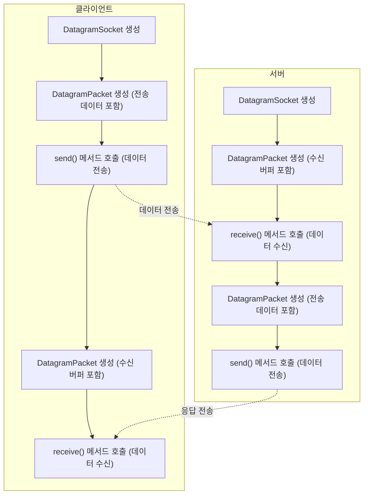

# [ 8주차 - 1002 ] 스터디 내용

```bash
    금일 커리큘럼
        ├ 09:00 ~ 14:00 Network 프로그래밍 (UDP 통신, UDP Echo 구현)
        └ 14:00 ~ 18:00 Network 프로그래밍
```

## 1. UDP 통신

> UDP (User Datagram Protocol) - 비연결형 프로토콜. 데이터그램 단위로 데이터를 전송


### UDP의 작동 방식

- **비연결형 통신**: TCP와 달리 연결 설정 과정이 없음. 데이터를 보내기 전에 수신자와 연결을 설정하지 않음
- **데이터그램 전송**: 데이터를 작은 단위인 데이터그램으로 나누어 전송. 각 데이터그램은 독립적으로 처리됨
- **비신뢰성**: 데이터그램이 손실되거나 순서가 바뀔 수 있음. 수신 확인이나 재전송 메커니즘이 없음
- **빠른 전송 속도**: 연결 설정과 유지에 필요한 오버헤드가 없기 때문에 TCP보다 빠름. 실시간 애플리케이션에 적합


### UDP 응용 사례

UDP의 특징인 **실시간**, **빠른 전송 속도**를 활용한 다양한 응용 사례가 있음

- 스트리밍 (예: 비디오, 오디오 스트리밍)
- 온라인 게임 (빠른 데이터 전송이 필요한 경우)
- DNS (도메인 네임 시스템) 조회
- VoIP (Voice over IP) 통신


---


## 2. UDP Echo 구현하기

### 자바에서 UDP 통신 을 위한 클래스

* **DatagramSocket**: UDP 소켓을 생성하고 관리하는 클래스. 데이터를 보내고 받는 데 사용
* **DatagramPacket**: UDP 데이터그램을 나타내는 클래스. 데이터를 담고 있는 패킷을 생성하고 전송하는 데 사용

### UDP 통신 흐름




### UDP Echo 서버 구현

* 

```java

