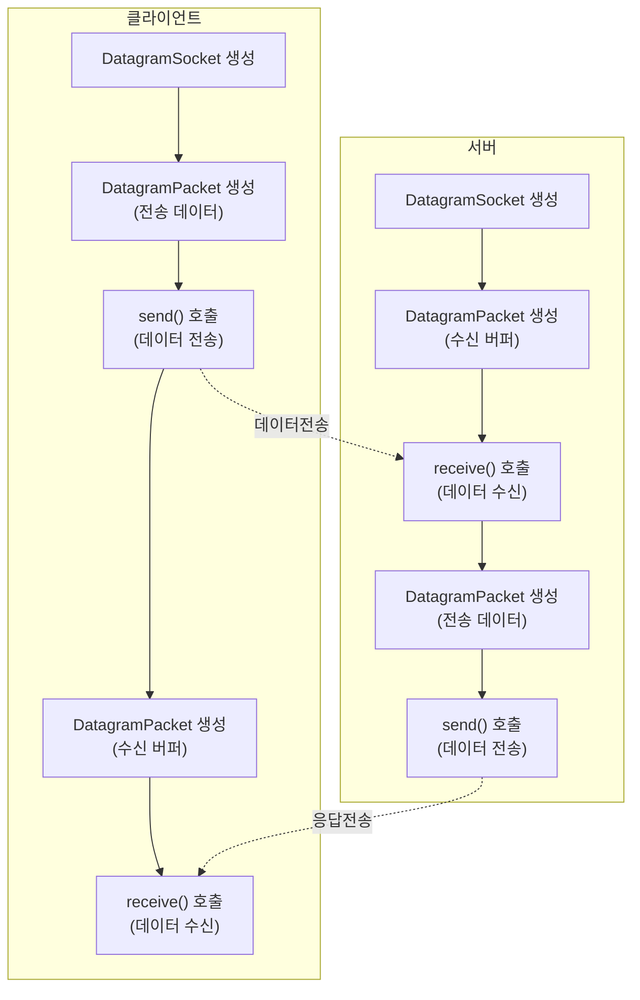
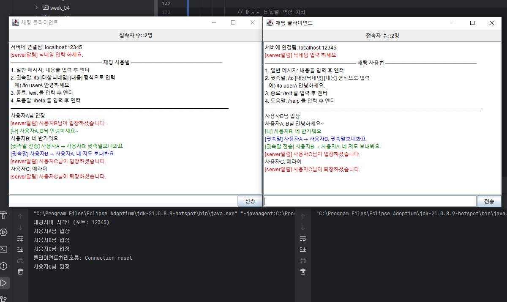

# [ 8주차 - 1002 ] 스터디 내용

```bash
    금일 커리큘럼
        ├ 09:00 ~ 14:00 Network 프로그래밍 (UDP 통신, UDP Echo 구현)
        └ 14:00 ~ 18:00 Network 프로그래밍 (고급 네트워크 프로그래밍, HTTP 클라이언트, JFrame 채팅 만들기)
```

## 1. UDP 통신

> UDP (User Datagram Protocol) - 비연결형 프로토콜. 데이터그램 단위로 데이터를 전송


### UDP의 작동 방식

- **비연결형 통신**: TCP와 달리 연결 설정 과정이 없음. 데이터를 보내기 전에 수신자와 연결을 설정하지 않음
- **데이터그램 전송**: 데이터를 작은 단위인 데이터그램으로 나누어 전송. 각 데이터그램은 독립적으로 처리됨
- **비신뢰성**: 데이터그램이 손실되거나 순서가 바뀔 수 있음. 수신 확인이나 재전송 메커니즘이 없음
- **빠른 전송 속도**: 연결 설정과 유지에 필요한 오버헤드가 없기 때문에 TCP보다 빠름. 실시간 애플리케이션에 적합


### UDP 응용 사례

UDP의 특징인 **실시간**, **빠른 전송 속도**를 활용한 다양한 응용 사례가 있음

- 스트리밍 (예: 비디오, 오디오 스트리밍)
- 온라인 게임 (빠른 데이터 전송이 필요한 경우)
- DNS (도메인 네임 시스템) 조회
- VoIP (Voice over IP) 통신


---


## 2. UDP Echo 구현하기

### 자바에서 UDP 통신 을 위한 클래스

* **DatagramSocket**: UDP 소켓을 생성하고 관리하는 클래스. 데이터를 보내고 받는 데 사용
* **DatagramPacket**: UDP 데이터그램을 나타내는 클래스. 데이터를 담고 있는 패킷을 생성하고 전송하는 데 사용

### UDP 통신 흐름




### UDP Echo 서버 구현

* **동작 흐름**: 
  1. `DatagramSocket` 생성 및 포트 바인딩  
  2. while 시작  
  3. 빈 `DatagramPacket` 생성 후 `receive()` 호출 (클라이언트 요청 대기)  
  4. 수신된 데이터를 문자열로 변환하여 처리  
  5. 응답 메시지를 담은 `DatagramPacket` 생성  
  6. `send()`로 클라이언트에게 전송

```java
import java.net.DatagramPacket;
import java.net.DatagramSocket;

public class UDPEchoServer {
    private static final int PORT = 9876; // 서버 포트 번호
    private static final int BUFFER_SIZE = 1024; // 버퍼 크기

    public static void main(String[] args) {
        // DatagramSocket - UDP 소켓 생성 (포트 바인딩)
        try (DatagramSocket socket = new DatagramSocket(PORT)) {
            System.out.println("UDP Echo 서버가 포트 " + PORT + "에서 시작되었습니다.");
            byte[] buf = new byte[BUFFER_SIZE]; // 수신 버퍼

            while (true) {
                // DatagramPacket - 수신 패킷 생성 (클라이언트 -> 서버)
                DatagramPacket packet = new DatagramPacket(buf, buf.length);
                
                // 클라이언트가 데이터를 보낼 때까지 대기(블로킹 호출)
                // -데이터 수신 시, 패킷 객체에 데이터와 클라이언트 주소/포트 정보가 채워짐
                socket.receive(packet);

                // 수신된 데이터 처리
                String message = new String(
                    packet.getData(), // byte 배열
                    0, // 시작 인덱스
                    packet.getLength() // 실제 데이터 길이
                );
                System.out.println("수신된 메시지:: " + message);

                // 수신된 데이터를 응답 데이터로 변환
                String responseMessage = "Echo:: "+ message;
                byte[] responseBuffer = responseMessage.getBytes();

                // DatagramPacket - 송신 패킷 생성 (서버 -> 클라이언트)
                DatagramPacket sendPacket = new DatagramPacket(
                        responseBuffer, // 응답 데이터
                        responseBuffer.length, // 응답 데이터 길이
                        packet.getAddress(), // 클라이언트 IP 주소
                        packet.getPort() // 클라이언트 포트 번호
                );
                
                // 클라이언트 데이터 송신
                socket.send(sendPacket);
                System.out.println("[전송] " + responseMessage);
            }

        } catch (Exception e) {
            System.out.println("Error: " + e.getMessage());
        }
    }
}
```

### UDP Echo 클라이언트 구현

* **동작 흐름**: 
    1. `DatagramSocket` 생성 (포트 미지정)  
    2. 서버 주소 객체 생성  
    3. 사용자 입력 대기  
    4. 입력된 메시지를 담은 `DatagramPacket` 생성 후 `send()` 호출 (서버로 전송)  
    5. 빈 `DatagramPacket` 생성 후 `receive()` 호출 (서버 응답 대기)  
    6. 수신된 데이터를 문자열로 변환하여 출력

```java
import java.net.DatagramPacket;
import java.net.DatagramSocket;
import java.net.InetAddress;
import java.util.Scanner;

public class UDPEchoClient {
    private static final String SERVER_HOST = "localhost";
    private static final int SERVER_PORT = 9876;
    private static final int BUFFER_SIZE = 1024;

    public static void main(String[] args) {
        try (
            // DatagramSocket - 클라이언트 UDP 소켓 생성 (포트 미지정)
            // 서버랑 달리 클라이언트는 포트번호 지정 안함 (운영체제가 빈 포트번호 자동 할당)
            DatagramSocket socket = new DatagramSocket();
            Scanner sc = new Scanner(System.in);
        ) {
            // 서버 주소 객체 생성
            InetAddress serverAddress = InetAddress.getByName(SERVER_HOST);
            byte[] buf = new byte[BUFFER_SIZE];
            System.out.println("UDP Echo 클라이언트가 시작되었습니다. (종료: quit)");

            while (true) {
                System.out.print("입력: ");
                String message = sc.nextLine();
                if ("quit".equalsIgnoreCase(message)) break;

                // 메시지 전송 패킷 생성 (클라이언트 -> 서버)
                byte[] sendData = message.getBytes();
                DatagramPacket sendPacket = new DatagramPacket(
                        sendData,          // 전송 데이터
                        sendData.length,   // 전송 데이터 길이
                        serverAddress,     // 서버 주소
                        SERVER_PORT        // 서버 포트
                );
                // 데이터 송신
                socket.send(sendPacket); 

                // 서버로부터 응답 수신 (서버 -> 클라이언트)
                DatagramPacket receivePacket = new DatagramPacket(buf, buf.length);
                socket.receive(receivePacket); // 응답 올 때까지 대기
                String response = new String(
                        receivePacket.getData(),    // byte 배열
                        0, // 시작 인덱스
                        receivePacket.getLength()   // 실제 데이터 길이
                );
                System.out.println("[서버 응답] " + response);
            }
        } catch (Exception e) {
            System.out.println("Error: " + e.getMessage());
        }
    }

}
```


### UDP 브로드 캐스트

* UDP는 브로드캐스트를 지원하는 프로토콜임
* **브로드캐스트** : 네트워크 내 모든 호스트에 데이터를 전송하는 방식
* **브로드캐스트 주소**: 네트워크 내 모든 호스트에 데이터를 전송하기 위한 특수한 IP 주소
    - 예: 255.255.255.255 (로컬 네트워크 브로드캐스트)
* `setBroadcast(true)` 설정 시, 브로드캐스트 주소로 데이터그램을 전송할 수 있음


```java
import java.net.DatagramPacket;
import java.net.DatagramSocket;
import java.net.InetAddress;

public class UDPBroadcastClient {
    private static final int SERVER_PORT = 9876; // 서버 포트 번호
    private static final String BROADCAST_IP = "255.255.255.255"; // 브로드캐스트 주소

    public static void main(String[] args) {
        // DatagramSocket - UDP 소켓 생성
        try (DatagramSocket socket = new DatagramSocket()) {
            socket.setBroadcast(true); // 브로드캐스트 허용
            String message = "Hello, UDP Broadcast!";
            byte[] buff = message.getBytes();

            // 브로드캐스트 주소로 패킷 생성
            InetAddress broadcastAddress = InetAddress.getByName(BROADCAST_IP);
            DatagramPacket packet = new DatagramPacket(
                buff,              // 데이터
                buff.length,       // 데이터 길이
                broadcastAddress,  // 브로드캐스트 주소
                SERVER_PORT        // 서버 포트 번호
            );

            // 브로드캐스트 전송
            socket.send(packet);
            System.out.println("브로드캐스트 메시지 전송: " + message);

        } catch (Exception e) {
            System.out.println("Error: " + e.getMessage());
        }
    }
}
```

* 서버, 클라이언트, 브로드캐스트
    - 서버 - 특정 포트에서 대기
    - 클라이언트 - 특정포트 서버에 메시지 전송
    - 브로드캐스트 - 네트워크 내 모든 호스트에 메시지 전송

### UDP vs TCP

| 특징 | UDP  | TCP |
|------|------|-----|
| 연결형태 | 비연결형 | 연결형 |
| 신뢰성 | 비신뢰성<br>(데이터 손실 가능) | 신뢰성<br>(데이터 손실 없음) |
| 속도 | 빠름<br>(오버헤드 적음) | 느림<br>(오버헤드 큼) |
| 데이터 전송 단위 | 데이터그램<br>(byte 단위) | 스트림<br>(연속된 바이트 흐름) |
| 용도 | 실시간 애플리케이션<br>(스트리밍, 게임) | 신뢰성 요구 애플리케이션<br>(웹, 이메일) |

---

## 3. 고급 네트워크 프로그래밍

### 웹 리소스에 접근하기

> URL과 URLConnection 사용하여 접근


**URL (Class)** 
- 웹 리소스의 주소를 나타내는 클래스
- URL 객체를 통해 프로토콜, 호스트, 포트, 경로 등의 정보를 추출할 수 있음
- 주요메서드 
    - `getProtocol()`: 프로토콜 (예: http, https)
    - `getHost()`: 호스트 이름 (예: www.example.com)
    - `getPort()`: 포트 번호 (예: 80, 443)
    - `getPath()`: 리소스 경로 (예: /index.html)


**URLConnection (Class)**
- 자바에서 URL을 통해 네트워크 자원에 접근하고 데이터를 주고받기 위한 추상 클래스
- URLConnection을 통해 HTTP 요청을 보내고 응답을 받을 수 있음
- 주요 메서드
    - `openConnection()`: URL에 대한 연결을 생성
    - `setRequestProperty(String key, String value)`: 요청 헤더 설정
    - `getInputStream()`: 서버로부터 응답 데이터를 읽기 위한 입력 스트림 반환
    - `connect()`: 실제 연결을 설정
    - `setConnectTimeout(int timeout)`: 연결 타임아웃 설정
    - `setReadTimeout(int timeout)`: 읽기 타임아웃 설정


### 웹리소스 접근 구현

```java

import java.io.BufferedReader;
import java.io.InputStreamReader;
import java.net.URL;
import java.net.URLConnection;

public class URLDetailsExam {
    public static void main(String[] args) {
        String urlString = "http://www.example.com"; // 접근할 웹 리소스 URL

        try {
            // URL 객체 생성
            URL url = new URL(urlString);

            // URL 정보 출력
            System.out.println("프로토콜: " + url.getProtocol());
            System.out.println("호스트: " + url.getHost());
            System.out.println("포트: " + url.getPort());
            System.out.println("경로: " + url.getPath());
            System.out.println("─".repeat(20));

            // URLConnection 객체 생성 및 연결
            URLConnection connection = url.openConnection();

            connection.setConnectTimeout(5000); // 연결 타임아웃
            connection.setReadTimeout(5000); // 읽기 타임아웃
            // connection.connect(); // 연결 설정 - 생략가능

            // 헤더 정보 읽기
            System.out.println("헤더정보");
            System.out.println("Content-Type: " + connection.getContentType());
            System.out.println("Content-Length: " + connection.getContentLength());

            System.out.println("─".repeat(20));

            // 응답 데이터 읽기
            try (BufferedReader in = new BufferedReader(new InputStreamReader(connection.getInputStream()))) {
                String inputLine;
                while ((inputLine = in.readLine()) != null) {
                    System.out.println(inputLine);
                }
            }

        } catch (Exception e) {
            System.out.println("Error: " + e.getMessage());
        }
    }
}
```

```bash
# 출력 결과
프로토콜: http
호스트: www.example.com
포트: -1
경로: 
────────────────────
헤더정보
Content-Type: text/html
Content-Length: 1256
────────────────────
# html 문서 내용...
```

### URLConnection을 이용한 POST 요청 (예시만)

* POST 요청은 URLConnection의 서브클래스인 **HttpURLConnection**을 사용하여 구현


```java
import java.io.BufferedReader;
import java.io.InputStreamReader;
import java.io.OutputStream;
import java.net.HttpURLConnection;
import java.net.URL;

public class URLConnectionPostExam {
    public static void main(String[] args) {
        // JSONPlaceholder - 무료 테스트 API 사용
        String urlString = "https://jsonplaceholder.typicode.com/posts";
        String jsonData = "{\"title\":\"테스트 제목\",\"body\":\"테스트 내용\",\"userId\":1}";

        try {
            URL url = new URL(urlString);
            // HttpURLConnection 객체 생성
            // url.openConnection()의 반환 타입이 URLConnection이므로
            // HttpURLConnection 캐스팅
            HttpURLConnection connection = (HttpURLConnection) url.openConnection();

            // POST 요청 설정
            connection.setRequestMethod("POST"); // 명시적으로 POST 설정
            connection.setDoOutput(true); // 출력 스트림 사용 설정
            connection.setDoInput(true); // 입력 스트림 사용 설정
            
            // 헤더 설정
            connection.setRequestProperty("Content-Type", "application/json");
            connection.setRequestProperty("Accept", "application/json");

            // JSON 데이터 전송
            try (OutputStream os = connection.getOutputStream()) {
                byte[] input = jsonData.getBytes("utf-8");
                os.write(input, 0, input.length);
            }

            // 응답 읽기
            int responseCode = connection.getResponseCode();
            System.out.println("응답 코드: " + responseCode);

            try (BufferedReader br = new BufferedReader(
                    new InputStreamReader(connection.getInputStream(), "utf-8"))) {
                StringBuilder response = new StringBuilder();
                String responseLine;
                while ((responseLine = br.readLine()) != null) {
                    response.append(responseLine.trim());
                }
                System.out.println("전송한 JSON: " + jsonData);
                System.out.println("응답 JSON: " + response.toString());
            }

        } catch (Exception e) {
            System.out.println("Error: " + e.getMessage());
        }
    }
}
```

```bash
# 출력 결과
응답 코드: 201
전송한 JSON: {"title":"테스트 제목","body":"테스트 내용","userId":1}
응답 JSON: {"title": "테스트 제목","body": "테스트 내용","userId": 1,"id": 101}
```

--- 

## 4. HTTP 클라이언트 구현

### HTTP 프로토콜 개요

> HTTP (HyperText Transfer Protocol)

* **정의**: 웹에서 클라이언트와 서버 간에 데이터를 주고받기 위한 프로토콜
* **특징**:
    - **무상태 프로토콜**: 각 요청이 독립적이며 이전 요청의 상태를 기억하지 않음
    - **텍스트 기반**: 요청과 응답 메시지가 텍스트 형식으로 구성되어 있어 사람이 읽기 쉬움
    - **확장성**: 다양한 메서드(GET, POST, PUT, DELETE 등)를 지원하여 다양한 작업 수행 가능


### 간단한 http 클라이언트 구현

```java
import java.io.BufferedReader;
import java.io.InputStreamReader;
import java.io.PrintWriter;
import java.net.Socket;
import java.util.Scanner;

public class SimpleHttpClient {
    public static void main(String[] args) {
        Scanner scanner = new Scanner(System.in);
        System.out.print("접속할 URL 입력 (예: www.example.com): ");
        String urlString = scanner.nextLine();
        int port = 80; // 기본 HTTP 포트

        try (
            Socket socket = new Socket(urlString, port);
             PrintWriter out = new PrintWriter(socket.getOutputStream(), true);
             BufferedReader in = new BufferedReader(new InputStreamReader(socket.getInputStream()))
        ) {
            // HTTP GET 요청 전송
            out.println("GET / HTTP/1.1");
            out.println("Host: " + urlString);
            out.println("Connection: close");
            out.println(); // 빈 줄로 헤더 종료

            // 응답 읽기
            String responseLine;
            while ((responseLine = in.readLine()) != null) {
                System.out.println(responseLine);
            }
            scanner.close();

        } catch (Exception e) {
            System.out.println("Error: " + e.getMessage());
        }
    }
}
```

```bash
# 출력 결과
# 접속할 URL 입력 (예: www.example.com): www.example.com
HTTP/1.1 200 OK
Content-Type: text/html
ETag: "84238dfc8092e5d9c0dac8ef93371a07:1736799080.121134"
Last-Modified: Mon, 13 Jan 2025 20:11:20 GMT
Cache-Control: max-age=86000
Date: Thu, 02 Oct 2025 04:52:14 GMT
Content-Length: 1256
Connection: close
X-N: S
# html 문서 내용...
```

---


## 5. JFrame 채팅 만들기

* **JFrame** : 자바에서 GUI 애플리케이션을 만들기 위한 프레임(창)을 제공하는 클래스
* **Swing** : 자바에서 GUI 애플리케이션을 만들기 위한 라이브러리



### jFrame 챗 클라이언트

* **주요**

- `JFrame`: 메인 창
- `JTextArea`: 채팅 메시지 표시 영역 (예시에선 미사용)
- `JTextPane`: 채팅 메시지 표시 영역 (대화색상 관련)
- `JTextField`: 메시지 입력 필드
- `JButton`: 전송 버튼
- `JScrollPane`: 스크롤 기능 제공

* **동작 흐름**

1. **GUI 초기화**: JFrame 창 생성, UI 컴포넌트 배치 및 이벤트 리스너 설정
2. **서버 연결**: 별도 스레드에서 지정된 호스트와 포트로 소켓 연결 시도
3. **연결 성공**: PrintWriter를 통해 서버로 메시지 전송 가능 상태가 됨
4. **메시지 수신**: 서버로부터 오는 메시지를 지속적으로 읽어서 채팅 화면에 표시
5. **메시지 전송**: 사용자가 입력 필드에 텍스트 입력 후 엔터키 또는 전송 버튼 클릭
6. **메시지 처리**: 입력된 메시지를 서버로 전송하고 입력 필드 초기화
7. **명령 처리**: `/exit` 명령 시 채팅 종료, 접속자 수 메시지는 별도로 라벨 업데이트
8. **연결 종료**: 서버 연결이 끊어지면 리소스 정리 및 종료 메시지 표시


```java

import javax.swing.*;
import java.awt.*;
import java.io.*;
import java.net.*;

public class ChatClientSwing extends JFrame {
    // private JTextArea textArea;
    private JTextPane textPane; // 대화색상 관련
    private JTextField inputField;
    private JButton sendButton;
    private PrintWriter out;
    private JLabel userCountLabel;

    public ChatClientSwing(String host, int port) {
        setTitle("채팅 클라이언트");        // 창 제목
        setSize(800, 600);          // 창 크기
        setDefaultCloseOperation(EXIT_ON_CLOSE); // 닫기 버튼 클릭 시 종료
        setLocationRelativeTo(null);           // 화면 중앙에 창 띄우기

        // UI 구성
        textPane = new JTextPane();     // 채팅 메시지 표시 영역
        textPane.setEditable(false);  // 편집 불가
        JScrollPane scrollPane = new JScrollPane(textPane); // 스크롤 가능
        
        // textArea 인 경우
        // textArea = new JTextArea();
        // textArea.setEditable(false);
        // JScrollPane scrollPane = new JScrollPane(textArea);

        // 접속자 수 라벨
        userCountLabel = new JLabel("접속자 수: 0명");
        userCountLabel.setHorizontalAlignment(JLabel.CENTER);
        userCountLabel.setBorder(BorderFactory.createEmptyBorder(5, 5, 5, 5));

        // 필드 및 버튼
        inputField = new JTextField(); // 메시지 입력 필드
        sendButton = new JButton("전송"); // 전송 버튼

        // 레이아웃 설정
        JPanel bottomPanel = new JPanel(new BorderLayout()); // 하단 패널
        bottomPanel.add(inputField, BorderLayout.CENTER); // 입력 필드 중앙
        bottomPanel.add(sendButton, BorderLayout.EAST); // 버튼 오른쪽

        add(userCountLabel, BorderLayout.NORTH); // 상단에 접속자 수 라벨
        add(scrollPane, BorderLayout.CENTER); // 중앙에 스크롤 패널
        add(bottomPanel, BorderLayout.SOUTH); // 하단에 입력 패널

        // 버튼/엔터키 이벤트
        sendButton.addActionListener(e -> sendMessage());
        inputField.addActionListener(e -> sendMessage());

        //입력 필드에 초기 포커스 설정
        SwingUtilities.invokeLater(() -> inputField.requestFocusInWindow());

        // 서버 연결 스레드
        new Thread(() -> connect(host, port)).start();
    }

    // 서버 연결 및 메시지 수신
    private void connect(String host, int port) {
        try (
            Socket socket = new Socket(host, port);
            BufferedReader in = new BufferedReader(new InputStreamReader(socket.getInputStream()));
        ) {
            this.out = new PrintWriter(socket.getOutputStream(), true);
            appendMessage("서버에 연결됨: " + host + ":" + port);
            // 서버 메시지 읽는 스레드
            new Thread(() -> {
                try {
                    String line;
                    while ((line = in.readLine()) != null) {
                        // <!-- 수정 --> 접속자 수 메시지 처리
                        if (line.startsWith("[접속자수:")) {
                            updateUserCount(line);
                        } else {
                            appendMessage(line);
                        }
                    }
                } catch (IOException e) {
                    appendMessage("서버 연결이 종료되었습니다.");
                }
            }).start();

            // 메인 스레드는 계속 대기 (연결 유지)
            while (socket.isConnected()) {
                Thread.sleep(100);
            }
        } catch (IOException e) {
            appendMessage("서버 연결 실패: " + e.getMessage());
        } catch (InterruptedException e) {
            Thread.currentThread().interrupt();
        } finally {
            if (out != null) {
                out.close();
                out = null;
            }
        }
    }

    // 접속자 수 업데이트
    private void updateUserCount(String msg) {
        SwingUtilities.invokeLater(() -> {
            userCountLabel.setText("접속자 수: " + msg.substring(5, msg.length() - 1));
        });
    }

    // 메시지 전송
    private void sendMessage() {
        String msg = inputField.getText().trim();
        if (!msg.isEmpty() && out != null) {
            if("/exit".equalsIgnoreCase(msg)) {
                appendMessage("채팅을 종료합니다.");
                System.exit(0);
            }
            out.println(msg);
            inputField.setText(""); // 입력 필드 초기화
        }
    }

    // 메시지 영역에 메시지
    private void appendMessage(String msg) {
        SwingUtilities.invokeLater(() -> {
            try {
                // 스타일 문서 및 속성 집합 생성
                javax.swing.text.StyledDocument doc = textPane.getStyledDocument();
                javax.swing.text.SimpleAttributeSet attr = new javax.swing.text.SimpleAttributeSet();

                Color color; // 기본 색상 (검은색)
                String displayMsg = msg;

                // 메시지 타입별 색상 처리
                if (msg.startsWith("[나]") || msg.startsWith("[귓속말 전송]")) {
                    color = new Color(0, 128, 0);
                } else if (msg.startsWith("[귓속말]")) {
                    color = Color.BLUE;
                } else if(msg.startsWith("[server")) {
                    color = Color.RED;
                } else {
                    color = Color.BLACK;
                }

                // 메시지에 따라 색상 적용
                javax.swing.text.StyleConstants.setForeground(attr, color);
                // 문서에 메시지 추가
                doc.insertString(doc.getLength(), displayMsg + "\n", attr);
                textPane.setCaretPosition(doc.getLength()); // 스크롤 최하단
            } catch (Exception e) {
                System.out.println(e.getMessage());
            }
        });
        
        // textArea인 경우
        // SwingUtilities.invokeLater(() -> {
        //     textArea.append(msg + "\n"); // 메시지
        //     textArea.setCaretPosition(textArea.getDocument().getLength()); // 스크롤 최하단
        // });
    }

    public static void main(String[] args) {
        // SwingUtilities.invokeLater - GUI 관련 작업은 이벤트 디스패치 스레드에서 실행
        SwingUtilities.invokeLater(() -> {
            // ChatClientSwing 인스턴스 생성 및 표시
            ChatClientSwing client = new ChatClientSwing("localhost", 12345);
            client.setVisible(true); // 창 표시
        });
    }
}
```

### 관련 서버 클래스

* **주요**

- `ServerSocket`: 서버 소켓 생성 및 클라이언트 연결 대기
- `Socket`: 클라이언트와의 개별 연결 관리
- `PrintWriter`: 클라이언트로 메시지 전송
- `BufferedReader`: 클라이언트로부터 메시지 수신
- `HashMap`: 접속한 클라이언트 목록 관리

* **동작 흐름**

1. **서버 소켓 생성**: 지정된 포트에서 클라이언트 연결 대기
2. **클라이언트 연결 수락**: 클라이언트가 연결 요청 시 새로운 소켓 생성
3. **클라이언트 핸들러 시작**: 각 클라이언트 연결에 대해 별도의 스레드에서 처리
4. **닉네임 설정**: 클라이언트로부터 닉네임을 받아 중복 체크 후 등록
5. **접속자 수 브로드캐스트**: 접속자 수 변경 시 모든 클라이언트에 알림
6. **메시지 수신 및 처리**: 클라이언트로부터 메시지를 받아 귓속말, 일반 메시지, 명령어 처리
7. **메시지 전송**: 클라이언트에게 메시지 전송 (자신 제외 브로드캐스트 포함)
    

```java

import java.io.*;
import java.net.*;
import java.util.HashMap;
import java.util.Map;

// (10.01) TCP 멀티스레드 참고
public class ChatSwingServer {
    private static final int PORT = 12345;
    private static final Map<String, ClientHandler> clients = new HashMap<>();

    static class ClientHandler implements Runnable {
        private final Socket socket;
        private PrintWriter out; // 바깥으로 설정해서 메서드도 공유
        private String nickname;

        public ClientHandler(Socket socket) {
            this.socket = socket;
        }
        
        // 외부 접근되게 별도 메서드 지정
        public void sendMsg(String msg) {
            if (out != null) out.println(msg);
        }

        @Override
        public void run() {
            try(BufferedReader in = new BufferedReader(new InputStreamReader(socket.getInputStream()))) {
                out = new PrintWriter(socket.getOutputStream(), true);

                // 닉네임 설정
                out.println("[server알림] 닉네임 입력 하세요.");
                while (true) {
                    nickname = in.readLine();
                    if(nickname == null) return;
                    // 닉네임 중복 체크
                    if(clients.containsKey(nickname)) {
                        out.println("[server알림] 이미 사용중인 닉네임입니다.");
                    } else {
                        break;
                    }
                }
                

                // 클라이언트 목록에 추가 (nickname : ClientHandler)
                clients.put(nickname, this);

                // 입장 시 접속자 수 업데이트
                broadcastUserCount();

                // 서버콘솔에 표시
                System.out.println(nickname +"님 입장");
                
                // 사용법 안내
                sendUsageInfo();

                // 클라이언트 자신만 노출
                this.sendMsg(nickname + "님 입장");
                // 채팅방에 있는 사용자에게 알림
                broadcast("[server알림] " + nickname + "님이 입장하셨습니다.", this);

                String msg;
                while ((msg = in.readLine()) != null) {
                    if("/exit".equalsIgnoreCase(msg)) {
                        this.sendMsg("[server알림] 채팅을 종료합니다.");
                        break;
                    } else if("/help".equalsIgnoreCase(msg)) {
                        sendUsageInfo();
                    } else if(msg.startsWith("/to ")) {
                        handleWhisper(msg);
                    } else {
                        // 내 메세지 - (나)
                        this.sendMsg("[나] " + nickname + ": " + msg);
                        // 내 메세지 - (상대)
                        broadcast(nickname + ": " + msg, this);
                    }
                }

            } catch (Exception e) {
                System.out.println("클라이언트처리오류: " + e.getMessage());
            } finally {
                // 퇴장 - 브로드캐스트 전에 clients에서 제거
                clients.remove(nickname);
                if(nickname != null) {
                    // 자기자신만 보임
                    System.out.println(nickname + "님 퇴장");
                    // 채팅방에 있는 사용자에게 알림
                    broadcast("[server알림] " + nickname + "님이 퇴장하셨습니다.", null);
                    // 퇴장 시 접속자 수 업데이트
                    broadcastUserCount();
                }
                try {
                    if (out != null) out.close();
                    if (socket != null) socket.close();
                } catch (Exception e) {
                    System.out.println(e.getMessage());
                }
            }
        }
        
        // 사용법 안내 메시지
        private void sendUsageInfo() {
            sendMsg("────────────────── 채팅 사용법 ──────────────────");
            sendMsg("1. 일반 메시지: 내용을 입력 후 엔터");
            sendMsg("2. 귓속말: /to [대상닉네임] [내용] 형식으로 입력");
            sendMsg("   예) /to userA 안녕하세요.");
            sendMsg("3. 종료: /exit 를 입력 후 엔터");
            sendMsg("4. 도움말: /help 를 입력 후 엔터");
            sendMsg("───────────────────────────────────────────");
        }
        
        // 귓속말 처리
        private void handleWhisper(String msg) {
            String[] parts = msg.split(" ", 3);
            if(parts.length < 3) {
                sendMsg("[server알림] 귓속말 형식이 올바르지 않습니다. /to [닉네임] [메시지] 형식으로 입력하세요.");
                return;
            }
            
            String targetNickname = parts[1];
            String whisperMsg = parts[2];
            
            ClientHandler targetClient = clients.get(targetNickname);
            if(targetClient == null) {
                sendMsg("[server알림] '" + targetNickname + "' 사용자를 찾을 수 없습니다.");
                return;
            }
            
            // 받는 사람에게 귓속말 전송
            targetClient.sendMsg("[귓속말] " + nickname + " → " + targetNickname + ": " + whisperMsg);
            // 보내는 사람에게 확인 메시지
            this.sendMsg("[귓속말 전송] " + nickname + " → " + targetNickname + ": " + whisperMsg);
        }
    }
    
    // 자기 자신 제외하고 브로드캐스트
    private static void broadcast(String msg, ClientHandler clientMe) {
        for(ClientHandler client : clients.values()) {
            if(client != clientMe) {
                client.sendMsg(msg);
            }
        }
        broadcastUserCount();
    }

    // 접속자 수 브로드캐스트 메서드 추가
    private static void broadcastUserCount() {
        String userCountMsg = "[접속자수:" + clients.size() + "명]";
        for(ClientHandler client : clients.values()) {
            client.sendMsg(userCountMsg);
        }
    }

    public static void main(String[] args) {
        try(
            ServerSocket serverSocket = new ServerSocket(PORT)
        ) {
            System.out.println("채팅서버 시작! (포트: " + PORT + ")");
            while (true) {
                Socket socket = serverSocket.accept();
                ClientHandler clientHandler = new ClientHandler(socket);
                new Thread(clientHandler).start();
            }
        } catch (Exception e) {
            System.out.println(e.getMessage());
        }
    }
}
```