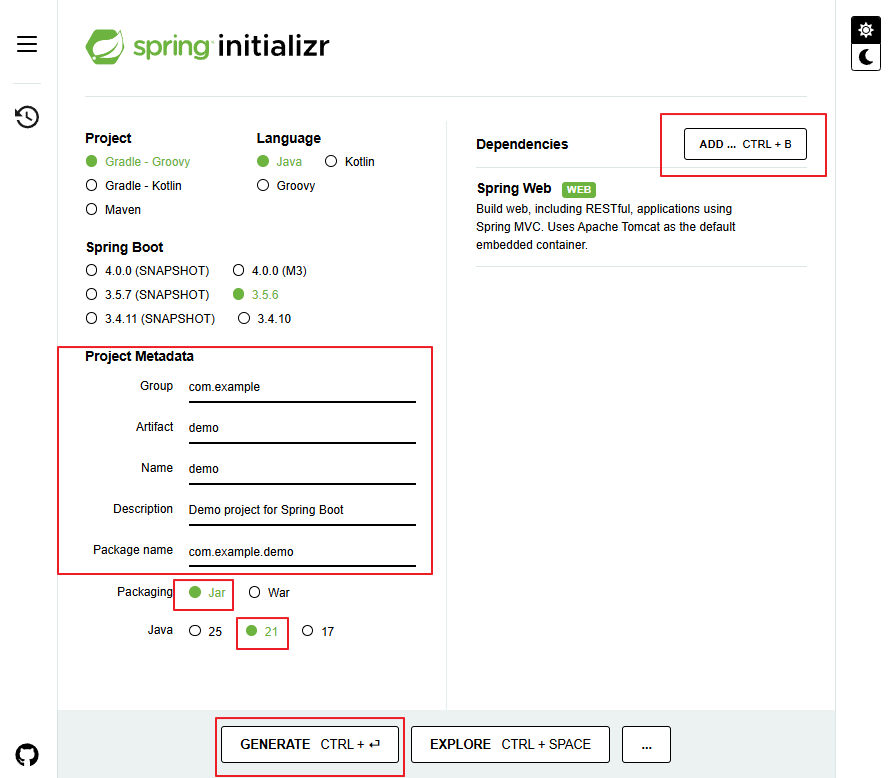
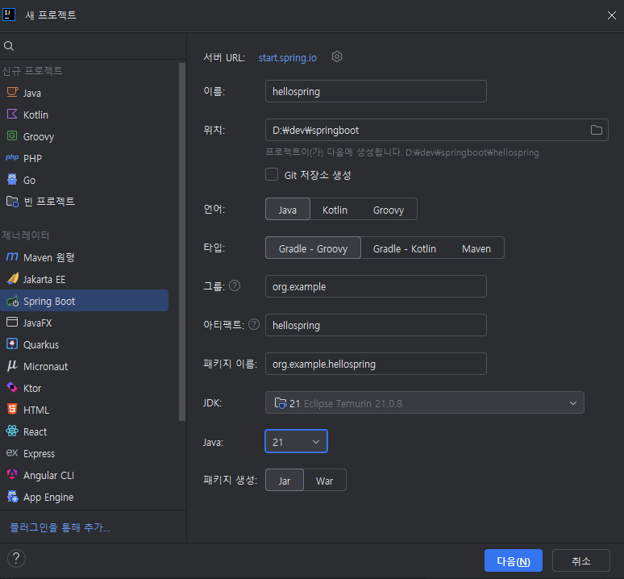
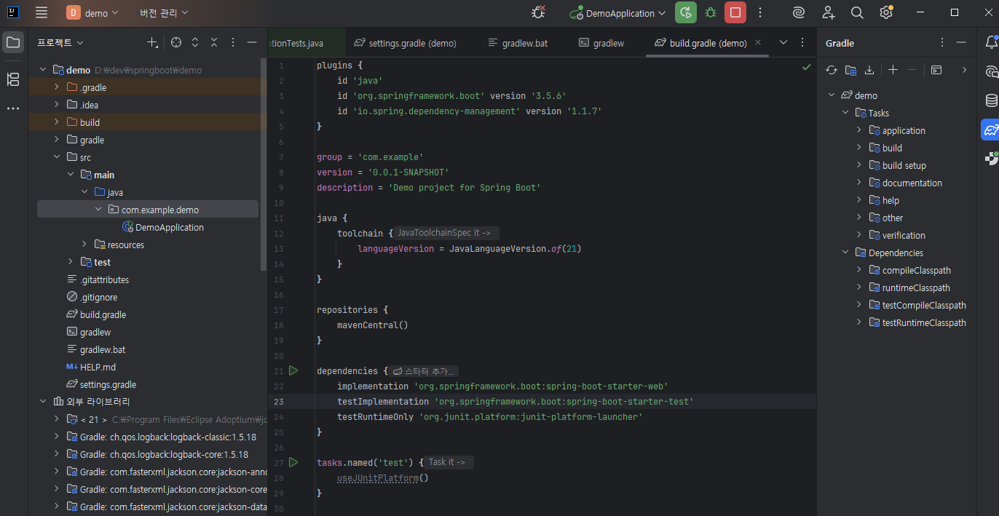

# [ 9주차 - 1013 ] 스터디 내용

```bash
    금일 커리큘럼
        ├ 09:00 ~ 14:00 backend 프로그래밍 (Spring Boot 개요, Spring Boot 생성, Spring Boot 실행)
        └ 14:00 ~ 18:00 backend 프로그래밍
```

## 1. Spring Boot 개요

### Spring과 Spring Boot란?

- **Spring** : 자바 플랫폼을 위한 오픈소스 애플리케이션 프레임워크
    - 주요 특징으로는 IoC(제어의 역전), AOP(관점 지향 프로그래밍), 트랜잭션 관리 등을 제공하여, 엔터프라이즈급 애플리케이션 개발을 용이하게 함.
- **Spring Boot** : 스프링기반으로 WAS개발 간소화하고 빠르게 시작할 수 있도록 도와주는 프레임워크
    - 복잡한 설정을 자동화하고, 내장 서버를 제공하여, 개발자가 빠르게 애플리케이션을 시작할 수 있도록 지원.

> 즉, 스프링은 핵심 모듈들 모아서 만든 것이고, 스프링 부트는 스프링을 더 쉽게 사용할 수 있도록 도와주는 도구

| 구분 | Spring | Spring Boot |
|------|--------|-------------|
| **설정 방식** | 개발자가 직접 설정 파일 작성 필요<br>(XML, Java Config) | 자동 설정 제공 |
| **의존성 관리** | 필요한 라이브러리와 버전을 개발자가 직접 관리 | Starter 의존성으로 관련 라이브러리 자동 관리 |
| **서버 배포** | 별도의 WAS 설치 및 설정 필요 | 내장 서버 제공으로 독립 실행 가능 |
| **실행 파일** | WAR 파일로 패키징하여 서버에 배포 | 실행 가능한 JAR 파일 생성 |
| **개발 속도** | 초기 설정에 많은 시간 소요 | 빠른 프로젝트 시작 가능 |
| **사용 목적** | 세밀한 제어가 필요한 복잡한 애플리케이션 | 빠르고 간단한 애플리케이션 개발 |

### Spring Boot의 핵심 가치

- **CoC(Convention over Configuration)** : 일반적인 설정을 미리 정의하여, 개발자가 최소한의 설정으로도 애플리케이션을 시작할 수 있도록 함.
- **자동 설정(Auto Configuration)** : 개발자가 직접 설정 파일을 작성하지 않아도, Spring Boot가 프로젝트의 의존성에 따라 자동으로 필요한 설정을 적용.
- **독립 실행형 애플리케이션** : 내장서버 (예: Tomcat, Jetty)를 포함하여, 별도의 서버 설치 없이도 애플리케이션을 실행할 수 있음.
- **운영 환경 최적화** : Spring Boot는 운영 환경에서의 성능과 안정성을 고려하여 설계되었으며, 다양한 모니터링 및 관리 기능을 제공.

---

## 2. Spring Boot 프로젝트 시작하기


### Spring Initializr를 이용한 프로젝트 생성

> Spring Initializr : Spring Boot 프로젝트를 쉽게 생성할 수 있는 웹 기반 도구

* 해당 URL 접속 : [https://start.spring.io/](https://start.spring.io/)
* 혹은 IntelliJ 울티메이트에서 New Project -> Spring Initializr 선택




#### 프로젝트 메타데이터 
- **Project** : gradle - Groovy
- **Language** : Java
- **Spring Boot** : 3.5.6
- **Project Metadata**
    - **Group** : com.example (회사 도메인 역순)
    - **Artifact** : demo (프로젝트 이름)
    - **Name** : demo (프로젝트 이름)
    - **Description** : Demo project for Spring Boot (프로젝트 설명)
    - **Package name** : com.example.demo (기본 패키지 이름)
    - **Packaging** : Jar (실행 가능한 JAR 파일 생성)
    - **Java** : 21 (사용할 Java 버전)

#### Dependencies (의존성)
- **Spring Web** : 웹 애플리케이션 개발을 위한 기본 의존성
- **Spring Boot DevTools** : 개발 편의를 위한 도구 (자동 재시작, 라이브 리로드 등)

<br>

> 설정 완료 후 제너레이트 클릭하여 해당 프로젝트 다운로드 (zip 파일)

---

### IntelliJ를 이용한 프로젝트 생성




* 메타데이터 입력 후 -> [다음] -> 필요한 Dependencies 선택 -> [완료] 클릭

---


### IntelliJ에서 Spring Boot 프로젝트 열기

- File -> Open -> 해당 폴더 선택
- 외부 라이브러리 다운로드 및 인덱싱 진행 (잠시 대기)
    - Gradle 프로젝트이므로, IntelliJ가 자동으로 `build.gradle` 파일을 인식하고 필요한 라이브러리를 다운로드하게 됨.
    - external Libraries에 그래들 `Spring Boot`, `Spring Web` 등이 추가된 것을 확인할 수 있음.





### 스프링 부트 구조

```bash
demo
 ├─ .idea
 ├─ src
 │   ├─ main
 │   │   ├─ java/com/example/demo       # 기본 패키지 경로
 │   │   │   └─ DemoApplication.java    # 메인 애플리케이션 클래스
 │   │   │
 │   │   └─ resources                   # 리소스 파일 경로
 │   │       ├─ static                   # 정적 자원 (CSS, JS, 이미지 등)
 │   │       ├─ templates                # 템플릿 파일 (Thymeleaf 등)
 │   │       ├─ application.properties   # 애플리케이션 설정 파일
 │   │       └─ ...
 │   │
 │   └─ test # 테스트 소스 경로
 │       └─ java/com/example/demo
 │           └─ DemoApplicationTests.java
 ├─ .gitignore
 ├─ build.gradle    # 그래들 빌드 설정 파일
 ├─ gradle          # 그래들 래퍼 파일
 ├─ gradlew         # 그래들 래퍼 실행 파일
 ├─ gradlew.bat     # 그래들 래퍼 배치 파일
 └─ settings.gradle # 그래들 설정 파일
```


---

## 3. Spring Boot 애플리케이션 실행하기

### DemoApplication.java

* 해당 자바 파일이 스프링 부트 애플리케이션의 진입점
* `@SpringBootApplication` 어노테이션이 붙어있으며, `main` 메서드에서 `SpringApplication.run()` 메서드를 호출하여 애플리케이션을 시작되도록 함
* `@GetMapping` 어노테이션을 사용하여 HTTP GET 요청을 처리하는 메서드를 정의할 수 있음

```java
// ...
import org.springframework.boot.SpringApplication;
import org.springframework.boot.autoconfigure.SpringBootApplication;
import org.springframework.web.bind.annotation.GetMapping;
import org.springframework.web.bind.annotation.RestController;

@SpringBootApplication  // 스프링 부트 애플리케이션임을 나타내는 어노테이션
@RestController         // RESTful 웹 서비스의 컨트롤러 역할을 하는 클래스임을 나타냄
public class HellospringApplication {

    // HTTP GET 요청을 처리하는 메서드 매핑
    @GetMapping("/star1431") // localhost:8080/star1431 접속하면 나타남
    public String star1431() {
        return "Hello Spring Boot!";
    }

    public static void main(String[] args) {
        SpringApplication.run(HellospringApplication.class, args);
    }
}
```

### 로컬포트 변경 방법

* 기본적으로 스프링 부트 애플리케이션은 8080 포트를 사용
* `src/main/resources/application.properties` 파일에 다음 설정 추가

```properties
# 서버 포트 설정 (기본값: 8080)
server.port=8088

# 개발 환경에서 자동 재시작 활성화
spring.devtools.restart.enabled=true
```

*  `application.yml` 파일로도 설정 가능

```yaml
server:
  port: 8088
```


---


## etc.

### 포트 강제 종료 방법 (cmd)

**Windows**

```bash
# 포트 사용 프로세스 찾기
netstat -ano | findstr :8080

# 실행결과
# TCP   0.0.0.0:8080  0.0.0.0:0   LISTENING   1160
# TCP   [::]:8080     [::]:0      LISTENING   1160

# 프로세스 종료 (LISTENING 옆에 있는 PID 번호 입력)
taskkill /PID [PID번호] /F
```

**Mac / Linux**

```bash
# 포트 사용 프로세스 찾기
lsof -i :8080

# 프로세스 종료
kill -9 [PID번호]
```