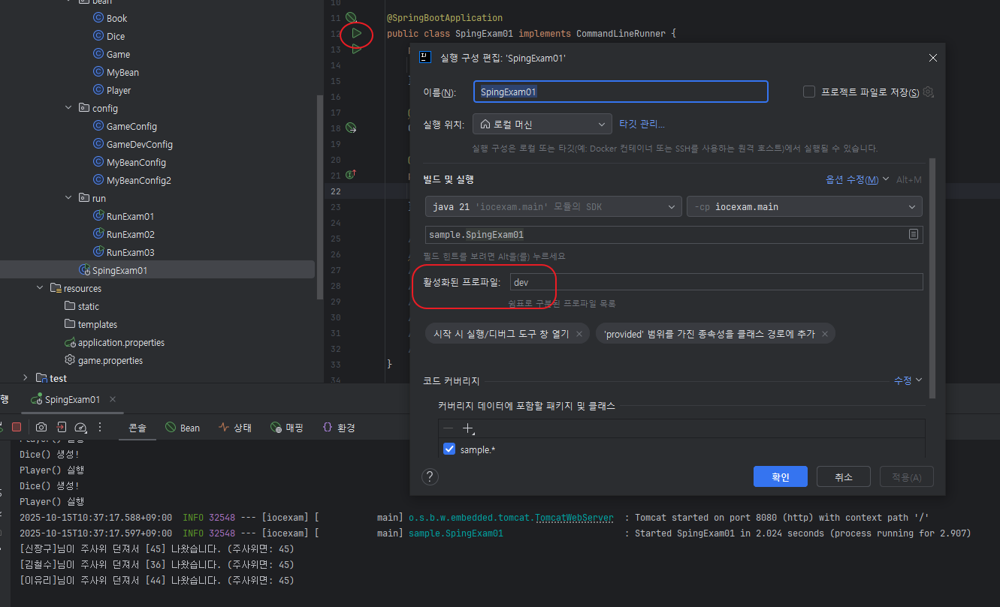
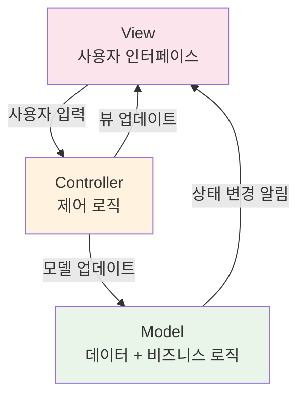
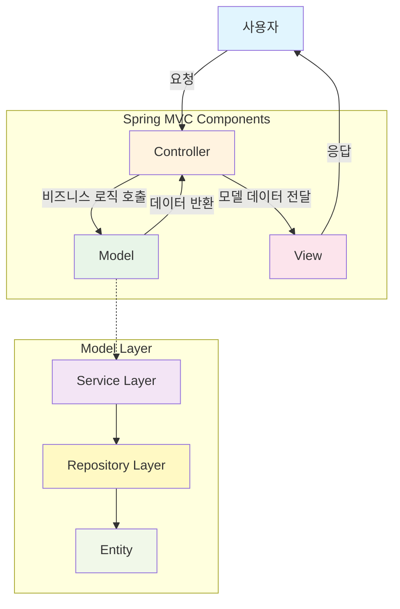
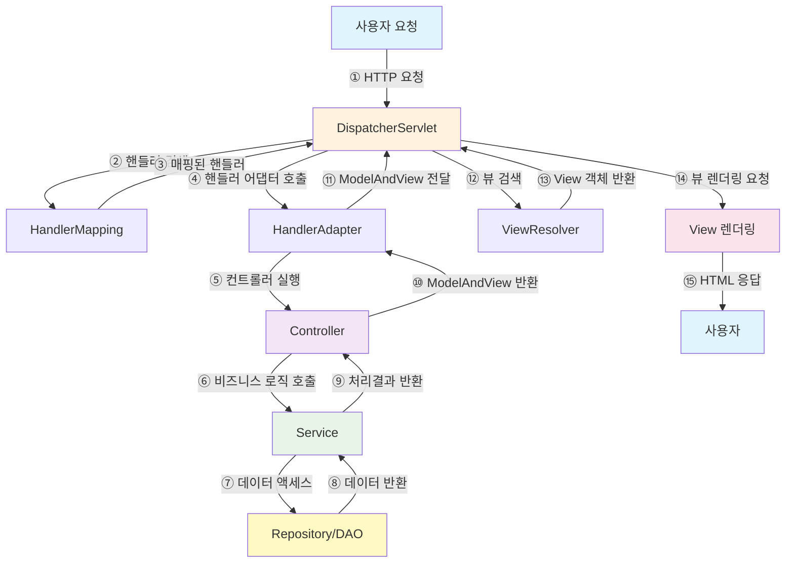

# [ 9주차 - 1015 ] 스터디 내용

```bash
    금일 커리큘럼
        ├ 09:00 ~ 12:00 backend 프로그래밍 (SpringBootApplication, PropertySource, Profile)
        └ 13:00 ~ 18:00 backend 프로그래밍 (@interface, Logging, MVC, Forward와 Redirect)
```

## 1. @SpringBootApplication 이해

> 스프링 부트 애플리케이션의 **시작점**을 나타내는 어노테이션

* `@SpringBootApplication`은 스프링 부트 애플리케이션의 **시작점**을 나타내는 어노테이션
* 이 어노테이션은 다음 세 가지 어노테이션을 포함되어 있음
  * @Configuration
  * @EnableAutoConfiguration
  * @ComponentScan


### CommandLineRunner

* `CommandLineRunner` 인터페이스를 구현하여 애플리케이션 시작 후 실행할 코드를 작성할 수 있음
* `run` 메서드를 오버라이드하여 원하는 로직을 작성하면, 애플리케이션이 시작된 후 자동으로 실행됨

### 코드 예시

```java
package org.example.iocexam;

// import ...

// = @Configuration + @EnableAutoConfiguration + @ComponentScan
@SpringBootApplication 
public class IocexamApplication implements CommandLineRunner {
    // CommandLineRunner 인터페이스를 구현하여 애플리케이션 시작 후 실행할 코드 작성 가능

    public static void main(String[] args) {
        SpringApplication.run(IocexamApplication.class, args);
        // SpringApplication.run() 메서드는 스프링 부트 애플리케이션을 시작하는 역할
    }

    @Autowired
    UserController userController; // 예시임 - 비권장

    // 애플리케이션 시작 후 실행될 코드
    @Override
    public void run(String... args) throws Exception {
        userController.joinUser();
    }

}
```

### 람다식 예시

```java
package org.example.iocexam;

// import ...

@SpringBootApplication
public class IocexamApplication {

    public static void main(String[] args) {
        SpringApplication.run(IocexamApplication.class, args);
    }

    // 애플리케이션 시작 후 실행될 코드
    @Bean // 스프링 IoC 컨테이너에 빈(Bean)으로 등록
    public CommandLineRunner commandLineRunner(UserController userController) {
        // run 람다
        return args -> {
            userController.joinUser();
        };
    }

}
```

### 어떻게 패키지 범위가 정해지나?


* 스캔 시작 기준: IocexamApplication 클래스가 속한 패키지를 기준으로 하기 때문
* 즉, `org.example.iocexam` 패키지를 기준으로 하위 패키지들(`controller`, `service`, `repository`)까지 스캔됨

<br>

**패키지 범위를 바꿀려면 ?**

```java
@SpringBootApplication(scanBasePackages = {
  "org.example.iocexam", 
  "org.example.common"
})
public class IocexamApplication { ... }

// 또는

@SpringBootApplication
@ComponentScan(basePackages = {"org.example.iocexam", "org.example.common"})
public class IocexamApplication { ... }
```

---

## 3. @PropertySource 이해

> 외부 프로퍼티 파일을 스프링 환경에 통합하는 데 사용

* `@PropertySource` 어노테이션을 사용하여 외부 프로퍼티 파일을 스프링 환경에 통합할 수 있음
* 예를 들어, `game.properties` 파일을 스프링 환경에 통합하고, 해당 파일의 프로퍼티 값을 빈(Bean) 설정에 주입할 수 있음

### 코드 예시

```java
package sample.config;

// import ...

@Configuration
@PropertySource("classpath:game.properties") // game.properties 파일을 스프링 환경에 통합
public class GameConfig {
    // ...
    @Value("${face}") // 프로퍼티 설정값 주입
    int face;
}
```

```bash
# game.properties 파일 예시
face=45
```

---

## 2. @Profile 이해

> 특정 환경에 따라 빈(Bean) 등록을 다르게 할 때 사용

* `@Profile` 어노테이션은 특정 환경에 따라 빈(Bean) 등록을 다르게 할 때 사용
* 예를 들어, 개발 환경과 운영 환경에서 서로 다른 빈을 등록하고 싶을 때 유용함

### @Profile("prod") 예시

```java
package sample.config;

// import ...

@Configuration
@Profile("prod")
@PropertySource({"classpath:game.properties"})
public class GameConfig {

    @Bean
    public Dice dice(@Value("${face}") int face) {
        return new Dice();
    }

    @Bean
    public Player player1(Dice dice) {
        Player player = new Player(dice);
        player.setName("player1");
        return player;
    }

    @Bean
    public Game game(List<Player> players) {
        return new Game(players);
    }
}
```

### @Profile("dev") 예시

```java
package sample.config;

// import ...

@Configuration
@Profile("dev")
@PropertySource({"classpath:game.properties"})
public class GameDevConfig {

    @Value("45")
    int face;

    @Bean
    public Dice dice(/*@Value("${face}") int face*/){
        return new Dice(face);
    }

    @Bean
    public Player player1(Dice dice){
        // Player player = new Player(dice);
        Player player = new Player();
        player.setDice(dice);
        player.setName("신짱구");
        return player;
    }

    @Bean
    public Game game(List<Player> players){
        return  new Game(players);
    }

}
```

### 실행시 Profile 적용 방법

#### 1. 리소스폴더에 있는 application.properties 파일에 설정

```bash
# 활성 프로파일 설정
spring.profiles.active=dev 
# or prod
```

**리소스 폴더에서 환경별 설정 필요한 경우**

* **application-{profile}.properties** 형식으로 파일 생성하면 자동으로 인식됨
    - 예 : dev, prod
    - application-dev.properties 파일생성
    - application-prod.properties 파일생성

* 환경파일 만들었다고 해서 바로 적용되는 건 아님!
    - **application.properties** 파일에서 어떤 환경을 활성화할지 지정 필요

```bash
src/main/resource
 ├ application.properties       # 공통 설정 (여기서 dev,prod 선택)
 ├ application-dev.properties   # dev 환경 별도 설정
 └ application-prod.properties  # prod 환경 별도 설정
```

```bash
# application-dev.properties 파일에서...
server.port=8080
logging.level.root=DEBUG

# application-prod.properties 파일에서...
server.port=80
logging.level.root=ERROR
```


#### 2. 터미널에서 설정

```bash
# 개발 환경으로 실행
java -jar app.jar --spring.profiles.active=dev

# 운영 환경으로 실행
java -jar app.jar --spring.profiles.active=prod
``` 

#### 3. 인텔리제이 실행 구성 편집

* Main 클래스 run 마우스 오른쪽 클릭 -> Edit Configurations... 선택
* profiles 항목에 `dev` 또는 `prod` 입력



---


## 3. @PostConstruct & @PreDestroy

> 빈(Bean) 초기화 후 실행할 메서드를 지정할 때 사용

**@PostConstruct**
* 이 어노테이션이 붙은 메서드는 빈이 생성되고 의존성 주입이 완료된 후 자동으로 호출됨
* 주로 초기화 이후 후속 작업에 사용한다.

**@PreDestroy**
* 이 어노테이션이 붙은 메서드는 빈이 소멸되기 전에 호출됨
* 주로 자원 해제, 마지막 정리 작업에 사용한다.

### 코드 예시

```java
package sample.controller;

// import ...

@Controller
public class UserController {
    // ...
    @PostConstruct // UserController 가 생성된 후 init() 호출
    public void init() {
        System.out.println("userController 생성 후 할일");
    }
    @PreDestroy // UserController 가 소멸되기 전에 destroy() 호출
    public void destroy(){
        System.out.println("UserController 소멸 전 할일");
    }
}
```

---


## 4. @interface 어노테이션 만들기

> 별도로 어노테이션 정의하여 사용할 수 있음

* `@interface` 키워드를 사용하여 커스텀 어노테이션을 정의
* `@Target` : 어노테이션을 적용할 수 있는 엘리먼트 대상 지정
    - `METHOD` : 메서드 
    - `FIELD` : 필드
    - `TYPE` : 클래스, 인터페이스, 이넘 등..

* `@Retention` : 어노테이션이 유지되는 기간 지정
    - `SOURCE` : 소스코드에만 존재, 컴파일 후 사라짐
    - `CLASS` : 컴파일 후 클래스 파일에 존재, 런타임 시점에는 사라짐
    - `RUNTIME` : 런타임 시점까지 유지되어 리플렉션으로 접근 가능

* `@interface` 내부에 메서드 형태로 속성 정의 가능
    - 속성에 기본값 지정 가능 (default 키워드 사용)
    - 속성에 기본값이 없으면, 어노테이션 사용할 때 반드시 값 지정해야 함


### 코드 예시

```java
@Target(ElementType.METHOD) // METHOD, FIELD, TYPE 
@Retention(RetentionPolicy.RUNTIME) // SOURCE, CLASS, RUNTIME
public @interface PrintAnnotation {
    String value() default "*";
    int number() default 5;
}

public class PrintService {
    @PrintAnnotation
    public void methodA() { System.out.println("methodA"); }
    @PrintAnnotation("&")
    public void methodB() { System.out.println("methodB"); }
    @PrintAnnotation(value = "☆", number = 10)
    public void methodC() { System.out.println("methodC"); }
}

public class PrintServiceRun {
    public static void main(String[] args) {
        PrintService printService = new PrintService();

        // 해당 객체 내 메서드들
        Method[] methods = printService.getClass().getDeclaredMethods(); 
        // 메서드 배열 순서는 아무 순서나 올 수 있음!
        for (Method m : methods) {
            // 특정 어노테이션이 있는 경우
            if (m.isAnnotationPresent(PrintAnnotation.class)) {
                System.out.println("=== 메서드: " +  m.getName() + " 에서 확인됨 ===");
                String str = m.getAnnotation(PrintAnnotation.class).value();
                int num = m.getAnnotation(PrintAnnotation.class).number();
                System.out.println(str.repeat(num));
            }
            // 메서드들 호출
            try {
                System.out.print("호출: ");
                m.invoke(printService);
            } catch (IllegalAccessException e) {
                throw new RuntimeException(e);
            } catch (InvocationTargetException e) {
                throw new RuntimeException(e);
            }
        }
    }
}
```

```bash
# 실행 결과
=== 메서드: methodA 에서 확인됨 ===
*****
호출: methodA
=== 메서드: methodC 에서 확인됨 ===
☆☆☆☆☆☆☆☆☆☆
호출: methodC
=== 메서드: methodB 에서 확인됨 ===
&&&&&
호출: methodB
```

---

## 5. 로깅

> Logging ? 애플리케이션 실행 중 발생하는 이벤트, 상태, 오류 등을 기록하는 것

* 스프링 부트는 기본적으로 SLF4J와 Logback을 사용하여 로깅 기능 제공

* **로깅 핵심 목적**
    - 디버깅 : 코드 실행 흐름 추적
    - 모니터링 : 시스템 상태 추적
    - 감사 : 시스템 활동 기록
    - 성능 분석 : 시스템 성능 문제 진단
    - 비즈니스 분석 : 사용자 행동 분석

## 코드 예시

```java
// import ...
@Controller
public class UserController {
    private UserService us;
    // Logger 객체 생성
    Logger log = LoggerFactory.getLogger(UserController.class);

    public UserController() {}

    @Autowired
    public UserController(UserService us) {
        this.us = us;
        System.out.println("user컨트롤러(us) 실행.");
        log.info("로거!! INFO");
        log.debug("로거!! DEBUG");
        log.trace("로거!! TRACE");
        log.warn("로거!! WARN");
        log.error("로거!! ERROR");
    }
    
    // code ...
}
```

```bash
# 실행 결과
user컨트롤러(us) 실행.
{시간표시}  INFO 32732 --- [iocexam] [main] o.e.iocexam.controller.UserController    : 로거!! INFO
{시간표시}  WARN 32732 --- [iocexam] [main] o.e.iocexam.controller.UserController    : 로거!! WARN
{시간표시} ERROR 32732 --- [iocexam] [main] o.e.iocexam.controller.UserController    : 로거!! ERROR

# ----
# DEBUG, TRACE 레벨은 표시 안됨.
# 설정에서 로깅 레벨을 DEBUG 또는 TRACE로 변경하면 표시됨.
```


### 시스템아웃프린트 vs 로깅 프레임워크 차이

| 구분 | sout | 로깅 |
|------|------|------|
| 성능측면 | 동기 처리로 느림 | 비동기 처리로 빠름 |
| 레벨제어 | 불가 | 레벨별 가능 |
| 출력대상 | 콘솔 | 콘솔, 파일, DB 등 다양 |
| 포맷팅 | 수동 | 자동 |
| 운영중 변경 | 불가(재배포해야됨) | 가능(설정파일) |


### 로그 레벨 계층

```bash
ERROR < WARN < INFO < DEBUG < TRACE
```

* **로그 레벨**
    - **TRACE** : 가장 상세한 정보, 디버깅에 유용
    - **DEBUG** : 디버깅 정보, 개발 중 문제 해결에 도움
    - **INFO** : 일반적인 정보, 애플리케이션 상태나 중요한 이벤트
    - **WARN** : 경고, 잠재적인 문제나 주의가 필요한 상황
    - **ERROR** : 심각한 오류, 애플리케이션 실행에 영향을 미치는 문제


* 로그 레벨은 위와 같은 계층 구조를 가짐
* 앞선 예제처럼 로그 레벨이 `INFO`로 설정된 경우, `INFO`, `WARN`, `ERROR` 레벨의 로그는 출력
* `DEBUG`와 `TRACE` 레벨의 로그는 출력되지 않음

###  레벨설정 방법

* 리소스폴더 내 `application.properties` 파일에서 설정 가능

```bash
# 로그 레벨 설정
logging.level.root=INFO
logging.level.org.springframework=WARN
logging.level.org.springframework.web=DEBUG
logging.level.com.example=DEBUG


# 로그 파일 설정
logging.file.name=logs/application.log
logging.file.path=/var/logs
logging.file.max-size=10MB
logging.file.max-history=30

# 로그 패턴 설정
logging.pattern.console=%d{yyyy-MM-dd HH:mm:ss} [%thread] %clr(%-5level){red} %clr(%logger{20}){cyan} - %clr(%msg){green}%n
logging.pattern.file=%d{yyyy-MM-dd HH:mm:ss} [%thread] %-5level %logger{36} - %msg%n

# 로그 그룹 설정
logging.group.db=org.hibernate,org.springframework.jdbc
logging.level.db=DEBUG
```

**로그 레벨 설정**
- **logging.level.root** : 전체 로그 레벨 설정 (기본값: INFO)
- **logging.level.{패키지명}** : 특정 패키지에 대한 로그 레벨 설정

<br>

**로그 파일 설정**
- **logging.file.name** : 로그 파일 이름 설정
- **logging.file.path** : 로그 파일 경로 설정
- **logging.file.max-size** : 로그 파일 최대 크기 설정
- **logging.file.max-history** : 로그 파일 보관 기간 설정 (일 단위)

**로그 패턴 설정**
- **logging.pattern.console** : 콘솔 로그 출력 형식 설정
- **logging.pattern.file** : 파일 로그 출력 형식 설정

**로그 그룹 설정**
- **logging.group.{그룹명}** : 여러 패키지를 하나의 그룹으로 묶어 로그 레벨 설정
- **logging.level.{그룹명}** : 그룹에 대한 로그 레벨 설정


```bash
# 로그설정값
logging.level.root=TRACE
logging.pattern.console=%d{YYYY-MM-DD HH:mm:ss.SSS} [%thread] %clr(%-5level){red} %clr(%logger{20}){cyan} - %clr(%msg){green}%n

# 로그결과
user컨트롤러(us) 실행.
2025-10-288 14:03:59.205 [main] INFO  o.e.i.c.UserController - 로거!! INFO
2025-10-288 14:03:59.205 [main] DEBUG o.e.i.c.UserController - 로거!! DEBUG
2025-10-288 14:03:59.205 [main] TRACE o.e.i.c.UserController - 로거!! TRACE
2025-10-288 14:03:59.205 [main] WARN  o.e.i.c.UserController - 로거!! WARN
2025-10-288 14:03:59.206 [main] ERROR o.e.i.c.UserController - 로거!! ERROR
```


### 로거 xml 설정 (logback-spring.xml)

```xml
<?xml version="1.0" encoding="UTF-8"?>
<configuration>

    <!-- 변수 정의 -->
    <property name="LOG_DIR" value="logs"/>
    <property name="LOG_FILE" value="application"/>

    <!-- 콘솔 Appender -->
    <appender name="CONSOLE" class="ch.qos.logback.core.ConsoleAppender">
        <encoder>
            <pattern>%d{HH:mm:ss.SSS} [%thread] %highlight(%-5level) %cyan(%logger{36}) - %msg%n</pattern>
            <charset>UTF-8</charset>
        </encoder>
    </appender>

    <!-- 파일 롤링 Appender -->
    <appender name="FILE" class="ch.qos.logback.core.rolling.RollingFileAppender">
        <file>${LOG_DIR}/${LOG_FILE}.log</file>

        <rollingPolicy class="ch.qos.logback.core.rolling.SizeAndTimeBasedRollingPolicy">
            <!-- 일별 롤링 및 크기 제한 -->
            <fileNamePattern>${LOG_DIR}/archived/${LOG_FILE}-%d{yyyy-MM-dd}.%i.log</fileNamePattern>
            <maxFileSize>10MB</maxFileSize>
            <maxHistory>30</maxHistory>
            <totalSizeCap>1GB</totalSizeCap>
        </rollingPolicy>

        <encoder>
            <pattern>%d{yyyy-MM-dd HH:mm:ss.SSS} [%thread] %-5level %logger{36} - %msg%n</pattern>
            <charset>UTF-8</charset>
        </encoder>
    </appender>

    <!-- 에러 전용 Appender -->
    <appender name="ERROR_FILE" class="ch.qos.logback.core.rolling.RollingFileAppender">
        <file>${LOG_DIR}/error.log</file>

        <filter class="ch.qos.logback.classic.filter.ThresholdFilter">
            <level>ERROR</level>
        </filter>

        <rollingPolicy class="ch.qos.logback.core.rolling.TimeBasedRollingPolicy">
            <fileNamePattern>${LOG_DIR}/archived/error-%d{yyyy-MM-dd}.log</fileNamePattern>
            <maxHistory>30</maxHistory>
        </rollingPolicy>

        <encoder>
            <pattern>%d{yyyy-MM-dd HH:mm:ss.SSS} [%thread] %-5level %logger - %msg%n</pattern>
        </encoder>
    </appender>

    <!-- 비동기 Appender (성능 향상) -->
    <appender name="ASYNC_FILE" class="ch.qos.logback.classic.AsyncAppender">
        <appender-ref ref="FILE"/>
        <queueSize>512</queueSize>
        <discardingThreshold>0</discardingThreshold>
        <includeCallerData>false</includeCallerData>
    </appender>

    <!-- Spring Profile별 설정 -->
    <springProfile name="dev">
        <logger name="com.example" level="DEBUG"/>
        <logger name="org.springframework.web" level="DEBUG"/>
    </springProfile>

    <springProfile name="prod">
        <logger name="com.example" level="INFO"/>
        <logger name="org.springframework" level="WARN"/>
    </springProfile>

    <!-- 패키지별 로거 설정 -->
    <logger name="org.hibernate.SQL" level="DEBUG" additivity="false">
        <appender-ref ref="FILE"/>
    </logger>

    <logger name="com.example.service" level="DEBUG" additivity="false">
        <appender-ref ref="FILE"/>
        <appender-ref ref="CONSOLE"/>
    </logger>

    <!-- Root 로거 -->
    <root level="INFO">
        <appender-ref ref="CONSOLE"/>
        <appender-ref ref="ASYNC_FILE"/>
        <appender-ref ref="ERROR_FILE"/>
    </root>

</configuration>
```

**해당 콘솔로그 형태**

```bash
# 형식
%d{HH:mm:ss.SSS} [%thread] %highlight(%-5level) %cyan(%logger{36}) - %msg%n
# 출력
14:25:30.123 [main] INFO  com.example.Application - 애플리케이션이 시작되었습니다.
14:25:30.456 [http-nio-8080-exec-1] DEBUG com.example.service.UserService - 사용자 목록 조회 시작
14:25:30.789 [http-nio-8080-exec-1] DEBUG org.springframework.web.servlet.DispatcherServlet - 요청 처리 완료
```

**파일 로그**

* 정상인 경우

```bash
# 저장위치
logs/application.log
# 롤링정책 (하루 10MB 넘으면 자동분할 .%i)
logs/archived/application-2025-10-15.0.log
logs/archived/application-2025-10-15.1.log
# 로그내용
2025-10-15 14:25:30.123 [main] INFO  com.example.Application - 애플리케이션이 시작되었습니다.
2025-10-15 14:25:30.456 [http-nio-8080-exec-1] DEBUG com.example.service.UserService - 사용자 목록 조회 시작
```

* 에러인 경우

```bash
# 저장위치
logs/error.log
# 롤링정책 (하루 10MB 넘으면 자동분할 .%i)
logs/archived/error-2025-10-15.log
# 로그내용
2025-10-15 14:25:31.001 [http-nio-8080-exec-2] ERROR com.example.controller.UserController - 사용자 정보 로드 실패
java.lang.NullPointerException: ...
```

| 구분     | 로그 파일                  | 레벨         | 비고            |
| ------ | ---------------------- | ---------- | ------------- |
| 콘솔     | (터미널)                  | INFO~ERROR | 색상 표시, 실시간 확인 |
| 일반 파일  | `logs/application.log` | INFO~ERROR | 10MB/일별 롤링    |
| 에러 전용  | `logs/error.log`       | ERROR 이상   | 30일 보관        |
| 비동기 로그 | `ASYNC_FILE`           | FILE 기반    | 성능 최적화        |


---


## 6. Spring MVC

> Model-View-Controller 패턴 기반으로 하는 웹 어플리케이션 프레임워크

### MVC 패턴 구조



* **Model** : 애플리케이션의 **데이터와 비즈니스 로직**을 담당
* **View** : **사용자 인터페이스(UI)**를 담당, 사용자에게 데이터를 표시
* **Controller** : 사용자 **요청을 처리**하고, 모델과 뷰를 연결하는 역할


### Spring MVC Components



### Spring MVC 동작 과정




|구성 요소 | 역할 | 제공자 |
| --- | --- | --- |
| DispatcherServlet | 모든 요청을 받는 프론트 컨트롤러 | Spring Framework |
| HandlerMapping | URL과 컨트롤러 메서드 매핑 | Spring Framework |
| HandlerAdapter | 컨트롤러 메서드 실행 | Spring Framework |
| Controller | 비즈니스 로직 처리 | 개발자 |
| ViewResolver | 뷰 이름을 실제 뷰로 변환 | Spring Framework |
| View | 응답 생성 | Spring Framework |

### 흐름 설명

```java
@Controller
public class WelcomeController {
    @GetMapping("/")
    public String index() {
        //뷰네임 (template/welcome.html) 
        return "welcome";
        }

    @ResponseBody // 응답본문 직접 작성
    @GetMapping("/rest")
    public String rest() {
        return "hello rest"; 
    }

    // 응답본문 ? 뷰네임 ?
    // 1. 뷰네임 : ViewResolver -> View -> HTML 렌더링
    // 2. 응답본문 : @ResponseBody -> ViewResolver, View 과정 생략 -> 바로 응답본문 작성 (JSON, XML, TEXT 등)
}
```

1. **클라이언트 요청**
    - 사용자가 브라우저에서 `/hi` URL로 HTTP GET 요청 전송

2. **DispatcherServlet이 요청 수신**
    - 모든 HTTP 요청의 진입점 역할
    - 요청을 분석하고 적절한 핸들러를 찾기 위해 HandlerMapping에 위임

3. **HandlerMapping이 핸들러 매핑**
    - `@GetMapping("/")` 어노테이션을 통해 URL과 메서드 매핑
    - WelcomeController의 `index()` 메서드를 핸들러로 식별

4. **HandlerAdapter가 컨트롤러 호출**
    - 다양한 타입의 핸들러를 통일된 방식으로 실행
    - `index()` 메서드 실행 → 문자열 `"welcome"` 반환

5. **ModelAndView 생성**
    - 반환된 문자열 `"welcome"`을 뷰 이름으로 하는 ModelAndView 객체 생성
    - 이 경우 모델 데이터는 없고 뷰 이름만 포함

6. **ViewResolver가 뷰 해석**
    - 뷰 이름 `"welcome"`을 실제 뷰 리소스로 변환
    - 예: `templates/welcome.html` 또는 `WEB-INF/views/welcome.jsp`

7. **View 렌더링 및 응답**
    - 해석된 뷰 템플릿을 HTML로 렌더링
    - 최종 HTML을 HTTP 응답으로 클라이언트에 전송

**@RestController의 경우**
- `@ResponseBody`가 내장되어 있어 ViewResolver와 View 렌더링 과정을 생략
- 메서드 반환값을 직접 JSON/XML 형태로 HTTP 응답 본문에 작성

---


## Forward와 Redirect

### 포워드 (Forward)

> 서버 내부에서 다른 리소스로 요청을 전달하는 것

* 클라이언트는 인지하지 못함
* URL 변경 없음
* 서버 내부에서 처리되므로 클라이언트-서버 간 추가적인 네트워크 왕복 없음

### 코드 예시

```java
@Controller
public class ForwardController {
    @GetMapping("/start")
    public String start() {
        // /start 요청이 들어오면 /end로 포워딩
        return "forward:/end";
    }

    @GetMapping("/end")
    public String end() {
        // /end 요청 처리
        return "endView"; // 뷰 이름 반환
    }
}
```

* `/start`로 요청이 들어오면, 서버 내부에서 `/end`로 포워딩
* 클라이언트에서 주소는 여전히 `/start` URL을 인지


### 리다이렉트 (Redirect)

> 클라이언트에게 다른 URL로 다시 요청하도록 지시하는 것

* 클라이언트가 새로운 요청을 보내므로 URL이 변경됨
* 클라이언트-서버 간 추가적인 네트워크 왕복 발생

### 코드 예시

```java
@Controller
public class RedirectController {
    @GetMapping("/begin")
    public String begin() {
        // /begin 요청이 들어오면 /finish로 리다이렉트
        return "redirect:/finish";
    }

    @GetMapping("/finish")
    public String finish() {
        // /finish 요청 처리
        return "finishView"; // 뷰 이름 반환
    }
}
```

* `/begin`로 요청이 들어오면, 클라이언트에게 `/finish`로 리다이렉트 지시
* 클라이언트에서 주소가 `/finish`로 변경됨


### 포워드 vs 리다이렉트 비교
| 구분  | 포워드 (Forward)   | 리다이렉트 (Redirect)  |
|-----|------------------|---------------------|
| 정의  | 서버 내부에서 요청 전달 | 클라이언트에게 새로운 요청 지시 |
| URL 변경 | 없음               | 있음                |
| 네트워크 왕복 | 없음               | 있음                |
| 사용 시점 | 서버 내부 처리 필요 시 | 클라이언트에게 새로운 요청 필요 시 |

---