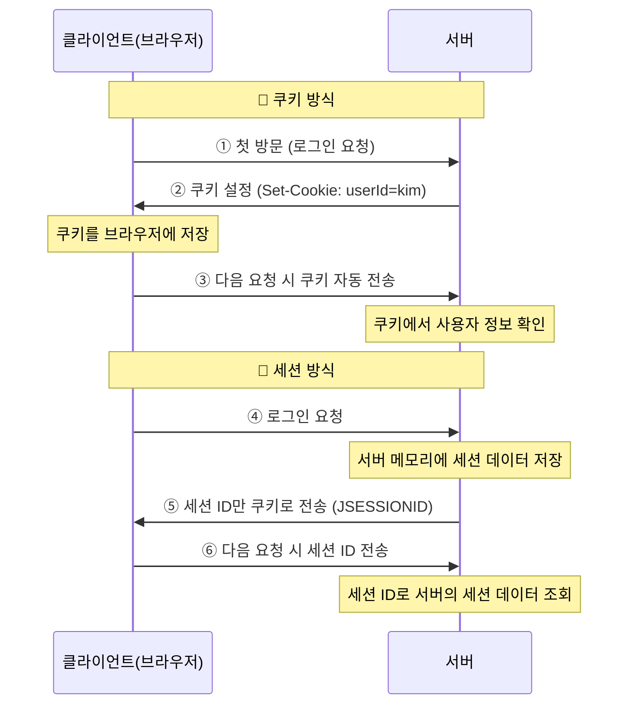

# [ 9주차 - 1016 ] 스터디 내용

```bash
    금일 커리큘럼
        ├ 09:00 ~ 14:00 backend 프로그래밍 (Spring MVC Request, Model과 ModelAndView)
        └ 14:00 ~ 18:00 backend 프로그래밍 (Thymeleaf 템플릿, @ModelAttribute, @PathVariable)
```

## 1. Spring MVC Request


### Request 요청 확인

* HttpServletRequest : 서블릿 API 방식 (비권장)
* @RequestParam : 스프링 MVC 방식 (권장)

```java
@Controller
@Slf4j // <- 로그 출력 어노테이션 (lombok)
public class HomeController {
    @GetMapping("/test1")
    public String test1(HttpServletRequest req) {
        // HttpServletRequest : 서블릿 API -> 스프링 MVC에서 사용 가능 (비권장)
        System.out.println(req.getRequestURL());
        System.out.println(req.getParameter("message")); // hi
        // http://localhost:8080/test1?message=hi
        return "index";
    }
    
    @GetMapping("/")
    public String index(@RequestParam("message") String msg) {
        // @RequestParam() : 스프링 MVC에서 제공하는 어노테이션
        log.info("로그출력"); // <- Slf4j
        System.out.println(msg);
        // http://localhost:8080/?message=hi
        return "index";
    }
}
```

**@RequestParam 옵션**

* name or value : 쿼리파라미터 이름 지정
* required : 값 필수 여부 (default : true)
* defaultValue : 기본값 설정 (default : 없음)

```java
// ?message 쿼리파라미터
@RequestParam("message") String msg // 값 필수 (없으면 400에러)
@RequestParam(value="message", required=false, defaultValue="") String msg // 값 선택
// or
@RequestParam("message") Optional<String> msg // 값 선택
// Optional[입력값] , Optional.empty 값으로 받아짐
```

---

## 2. Model과 ModelAndView

> 컨트롤러에서 뷰로 데이터를 전달하는 Spring MVC의 핵심 객체들

### 개념 정리

| 구분 | Model | ModelAndView |
|------|-------|--------------|
| **역할** | 데이터만 관리 | 데이터 + 뷰 이름 함께 관리 |
| **반환 타입** | String (뷰 이름) | ModelAndView 객체 |
| **사용법** | 매개변수로 주입받아 사용 | 직접 생성하여 반환 |
| **적합한 상황** | 간단한 데이터 전달 | 복잡한 로직에서 뷰와 데이터를 명시적 관리 |

### Model 객체 사용법

```java
@Controller
public class WelcomeController {
    
    @GetMapping("/")
    public String index(
            @RequestParam(value="name", required=false, defaultValue="") String name,
            @RequestParam(value="message", required=false, defaultValue="") String msg,
            Model model // Spring이 자동으로 주입
    ) {
        // 1. Model에 데이터 추가
        model.addAttribute("name", name);
        model.addAttribute("message", msg);
        
        // 2. 뷰 이름 반환 (문자열)
        return "index"; // 대상뷰 templates/index.html
    }
}
```

**Model 주요 메서드:**
- `addAttribute(String key, Object value)` : 키-값 쌍으로 데이터 추가
- `addAttribute(Object value)` : 객체 타입명을 키로 자동 설정
- `addAllAttributes(Map<String, ?> attributes)` : Map 데이터 일괄 추가

### ModelAndView 객체 사용법

```java
@Controller
public class WelcomeController {
    
    @GetMapping("/index2")
    public ModelAndView index2(
            @RequestParam(value="name", required=false, defaultValue="") String name,
            @RequestParam(value="message", required=false, defaultValue="") String msg
    ) {
        // 1. ModelAndView 객체 생성
        ModelAndView mv = new ModelAndView("index"); // 대상뷰 templates/index.html
        
        // 2. 데이터 추가
        mv.addObject("name", name);
        mv.addObject("message", msg);

        // 3. ModelAndView 객체 반환
        return mv;
    }
    
    // 다른 생성 방법
    @GetMapping("/index3")
    public ModelAndView index3() {
        // 빈 객체 생성 후 뷰 이름 설정
        ModelAndView mv = new ModelAndView();
        mv.setViewName("index");
        mv.addObject("title", "Welcome");
        
        return mv;
    }
}
```

**ModelAndView 주요 메서드:**
- `addObject(String key, Object value)` : 데이터 추가
- `setViewName(String viewName)` : 뷰 이름 설정
- `getModel()` : Model 객체 반환
- `getViewName()` : 뷰 이름 반환


### Model vs ModelAndView 선택 기준

#### Model 사용이 적합한 경우:
- 간단한 데이터 전달
- 뷰 이름이 고정적일 때
- 코드가 간결해야 할 때

#### ModelAndView 사용이 적합한 경우:
- 조건에 따라 다른 뷰를 반환해야 할 때
- 뷰와 데이터를 명시적으로 관리하고 싶을 때
- 레거시 코드와의 호환성이 필요할 때


---

## 3. Thymeleaf 템플릿 (중요도x)

> Java 기반의 서버 사이드 템플릿 엔진으로 HTML, XML, JavaScript, CSS 등 다양한 포맷 지원

### 기본 설정

```html
<!-- templates/index.html -->
<!DOCTYPE html>
<html xmlns:th="http://www.thymeleaf.org"> <!-- Thymeleaf 네임스페이스 선언 -->
<head>
    <meta charset="UTF-8">
    <title>메인 페이지</title>
</head>
<body>
    <h1>Spring Boot MVC 인덱스 페이지</h1>
    
    <div>
        <ul>
            <!-- ${변수명}으로 Model 데이터 참조 -->
            <li th:text="'name: ' + ${name}"></li>
            <li th:text="'message: ' + ${message} + '~!'"></li>
            
            <!-- 조건부 렌더링 -->
            <li th:if="${name != ''}" th:text="'Hello, ' + ${name} + '!'"></li>
            <li th:unless="${name != ''}" th:text="'이름을 입력해주세요.'"></li>
        </ul>
    </div>
</body>
</html>
```

### Thymeleaf 주요 문법

```html
<!-- 텍스트 출력  (th:text, th:utext)-->
<p th:text="${message}">기본 텍스트</p>
<p th:utext="${htmlContent}">HTML 태그 포함 텍스트</p>

<!-- 속성 설정 (th:value , th:href ...) -->
<input th:value="${name}" type="text">
<a th:href="@{/users/{id}(id=${user.id})}">사용자 상세</a>

<!-- 조건부 렌더링 (th:if , th:unless) -->
<div th:if="${user.age >= 18}">성인입니다.</div>
<div th:unless="${user.age >= 18}">미성년자입니다.</div>

<!-- 반복문 (th:each) -->
<ul>
    <li th:each="user : ${users}" th:text="${user.name}"></li>
</ul>

<!-- 표현식 -->
<p th:text="|Hello, ${name}!|">문자열 합침</p>
<p>[[${message}]]</p> <!-- 텍스트 인라인 바인딩 -->
<script th:inline="javascript">
    var message = /*[[${message}]]*/ 'default';
</script>
```

### 실제 사용 예시

* 데이터 조회

```java
@Getter // Setter 자동 (lombok)
@Setter // getter 자동 (lombok)
@NoArgsConstructor // 기본 생성자 자동 (lombok)
@AllArgsConstructor // 전체 생성자 자동 (lombok)
class User {
    private int id;
    private String name;
    private int age;
    private String email;
    private long point;
}

@Controller
public class UserController {
    // 가상데이터 리스트 (실제로는 DB를 사용하는 부분)
    private static List<User> users = new ArrayList<>();
    
    // 가상 데이터
    static {
        users.add(new User(1000, "신짱구", 25, "shin@example.com"));
        users.add(new User(1001, "김철수", 30, "kim@example.com"));
        users.add(new User(1002, "이유리", 24, "lee@example.com"));
    }
    

    // 유저목록 (localhost:8080/users)
    @GetMapping("/users")
    public String userList(Model model) {
        model.addAttribute("users", users);
        model.addAttribute("totalCount", users.size());
        model.addAttribute("currentTime", LocalDateTime.now());

        return "users/list"; // users/list.html
    }
}
```

```html
<!-- templates/users/list.html -->
<!DOCTYPE html>
<html xmlns:th="http://www.thymeleaf.org">
<head>
    <title>사용자 목록</title>
</head>
<body>
    <h1>사용자 목록 (총 [[${totalCount}]]명)</h1>
    <p th:text="'조회 시간: ' + ${#temporals.format(currentTime, 'yyyy-MM-dd HH:mm:ss')}"></p>

    <table border="1">
        <thead>
        <tr>
            <th>이름</th>
            <th>나이</th>
            <th>성인</th>
            <th>이메일</th>
            <th>보유포인트</th>
        </tr>
        </thead>
        <tbody>
        <tr th:each="user, status : ${users}">
            <td th:text="${user.name}"></td>
            <td th:text="${user.age}"></td>
            <td th:text="${user.age >= 18} ? '성인' : '미성년자'"></td>
            <td th:text="${user.email}"></td>
            <td>[[${#numbers.formatInteger(user.point, 3, 'COMMA')}]]P</td>
        </tr>
        <tr th:if="${#lists.isEmpty(users)}">
            <td colspan="4">등록된 사용자가 없습니다.</td>
        </tr>
        </tbody>
    </table>
</body>
</html>
```

---

## 4. @ModelAttribute 과 @PathVariable

### @ModelAttribute

> 폼 데이터(쿼리파라미터, 폼태그)를 자바 객체에 자동 바인딩


* `@ModelAttribute` 어노테이션을 사용하여 폼 데이터를 객체에 매핑

```java
@Controller
public class ItemController {
    // 아이템을 저장할 리스트 (실제로는 DB를 사용하는 부분)
    private static List<Item> itemList = new ArrayList<>();

    // 초기 데이터 설정
    static {
        itemList.add(new Item("사과", 2000));
        itemList.add(new Item("바나나", 2500));
        itemList.add(new Item("딸기", 3000));
        itemList.add(new Item("포도", 3500));
    }

    // 아이템 리스트 (itemList.html)
    @GetMapping("/item/list")
    public String itemList(Model model) {
        model.addAttribute("welcomeMessage", "안녕!");

        model.addAttribute("items", itemList); // 동적인 리스트 전달

        return "itemList";
    }

    // 아이템 폼 (itemForm.html)
    @GetMapping("/item/form")
    public String itemForm(Model model) {
        return "itemForm";
    }

    // 아이템 추가 (-> form태그 action="/item/add" method="post")
    @PostMapping("/item/add") // 폼데이터 수신
    public String addItem(
        @ModelAttribute Item item // 폼 데이터가 Item 객체에 자동 바인딩
    ) {
        System.out.println("추가된 상품: " + item.getName() + ", 가격: " + item.getPrice());
        itemList.add(item);
        return "redirect:/item/form"; // 아이템 폼으로 리다이렉트
    }
}
```

### @PathVariable

> URL 경로의 일부를 변수로 매핑하여 메서드 매개변수로 전달

* `@PathVariable` 어노테이션을 사용하여 URL 경로의 변수를 메서드 매개변수에 바인딩

```java
@Controller
public class UserController {
    // 가상데이터 리스트 (실제로는 DB를 사용하는 부분)
    private static List<User> users = new ArrayList<>();

    // ...

    // 유저 상세 (localhost:8080/users/1001)
    @GetMapping("/users/{id}")
    public String userDetail(
        @PathVariable("id") int userId, // userId 변수에 URL 경로의 {id} 값이 바인딩됨
        Model model
    ) {
        // 아이디값으로 조회 (임시)
        User user = users.stream()
                .filter(u -> u.getId() == userId)
                .findFirst()
                .orElse(null);
                
        model.addAttribute("user", user);
        return "users/detail"; // users/detail.html
    }
    
}
```

---

## 5. @Valid 유효성 검사

> 입력 데이터의 유효성을 검사할 때 사용

* `@Valid` 어노테이션을 사용하여 폼 데이터 유효성 검사 가능
* `BindingResult` 객체를 통해 검사 결과 확인

**유효성 검사 관련 어노테이션**

- `@NotEmpty` : 빈 문자열이나 null이 아닌지 검사
- `@Email` : 이메일 형식 검사
- `@Size(min=, max=)` : 문자열 길이 검사
    - ex: `@Size(min=2, max=10)`
- `@Min()`, `@Max()` : 숫자 범위 검사
    - ex: `@Min(0)`, `@Max(100)`
- `@Pattern(regexp=)` : 정규식 패턴 검사
    -ex: `@Pattern(regexp="\\d{3}-\\d{4}")` (전화번호 형식)
- `@NotNull` : null이 아닌지 검사


### 코드 예시

```java
@Getter
@Setter
@AllArgsConstructor
@NoArgsConstructor
public class User2 {
    @NotEmpty(message = "이름을 입력하세요.")
    private String name;
    @NotEmpty(message = "닉네임을 입력하세요.")
    private String username;
    @NotEmpty(message = "이메일을 입력하세요.")
    @Email(message = "이메일 형식에 맞게 작성하세요.")
    private String email;
    @NotEmpty(message = "성별을 선택해주세요.")
    private String gender;
}

@Controller
@RequestMapping("/user") // '/user'로 시작하는 요청 매핑
public class UserFormController {
    // user 정보 입력폼
    @GetMapping("/register") // GET '/user/register'
    public String registerForm(Model model) {
        model.addAttribute("user2", new User2());
        return "registerForm";
    }

    // 검사
    @PostMapping("/register")
    public String register(
            @Valid @ModelAttribute("user2") User2 user2, // @Valid: 유효성 검사
            BindingResult res // 유효성 검사 결과 객체
    ) {
        if(res.hasErrors()) { // 오류 있으면 입력폼 그대로
            return "registerForm";
        }
        return "welcome"; // 오류없으면 해당 뷰로 이동
    }
}
```

### 폼 태그 예시

* th:action, th:object, th:field, th:errors, th:if 등 사용
    - th:action : 폼 제출 URL
    - th:object : 폼 데이터 바인딩 객체
    - th:field : 폼 필드와 객체 속성 매핑
    - #fields.hasErrors('필드명') : 특정 폼 필드의 오류 여부 확인
    - th:errors : 폼 필드의 오류 메시지 출력

```html
<!-- templates/registerForm.html -->
 <!DOCTYPE html>
<html lang="en" xmlns:th="http://www.thymeleaf.org">
<head>
    <meta charset="UTF-8">
    <title>Title</title>
</head>
<body>
    <form th:action="@{/user/register}" th:object="${user2}" method="post">
        <div class="item">
            <div class="field">
                <label for="input-1">이름:</label>
                <input type="text" id="input-1" th:field="*{name}">
            </div>
            <p class="err-msg" th:if="${#fields.hasErrors('name')}" th:errors="*{name}"></p>
        </div>
        <div class="item">
            <div class="field">
                <label for="input-2">아이디:</label>
                <input type="text" id="input-2" th:field="*{username}">
            </div>
            <p class="err-msg" th:if="${#fields.hasErrors('username')}" th:errors="*{username}"></p>
        </div>
        <div class="item">
            <div class="field">
                <label for="input-3">이메일:</label>
                <input type="email" id="input-3" th:field="*{email}">
            </div>
            <p class="err-msg" th:if="${#fields.hasErrors('email')}" th:errors="*{email}"></p>
        </div>

        <div class="item">
            <div class="field">
                <label>성별:</label>
                <div class="radio-group">
                    <input type="radio" id="male" th:field="*{gender}" value="male" name="gender">
                    <label for="male">남성</label>

                    <input type="radio" id="female" th:field="*{gender}" value="female" name="gender">
                    <label for="female">여성</label>
                </div>
            </div>
            <p class="err-msg" th:if="${#fields.hasErrors('gender')}" th:errors="*{gender}"></p>
        </div>
        <input type="submit" value="회원가입">
    </form>
</body>
<style>
    form{display: flex; flex-direction: column; gap: 12px;}
    .item .field {display: flex; gap: 8px;}
    .item .field > label {min-width: 120px;}
    .item .radio-group {display: flex; gap: 10px; align-items: center;}
    .item .err-msg {color: red;font-size: 12px;margin: 5px 0;}
</style>
</html>
```

---

## etc


### Lombok

> Lombok ? 어노테이션 기반으로 코드를 자동완성 해주는 라이브러리

- **목적** : getter, setter, toString, 생성자 등의 반복적인 코드를 어노테이션으로 자동 생성
- **장점** : 코드 간소화, 가독성 향상
- **단점** : IDE 플러그인 필요, 컴파일 시점에서 코드 생성으로 디버깅 어려움

### 접근자, 생성자 어노테이션

```java
@Getter // Setter 관련 메서드 생성
@Setter // getter 관련 메서드 생성
@NoArgsConstructor // 기본 생성자 생성
@AllArgsConstructor // 전체 생성자 생성
@ToString // toString() 생성
@EqualsAndHashCode // equals()와 hashCode() 메서드 생성
class User {
    private int id;
    private String name;
    private int age;
    private String email;
    private long point;
}
```

```java
// 투스트링 관련 옵션
@ToString(exclude = "password") // password 필드 제외
@ToString(includeFieldNames = false) // 필드명 제외하고 값만 출력
@ToString(callSuper = true) // 부모 클래스의 toString도 포함

// 이퀄즈해시 관련 옵션
@EqualsAndHashCode(exclude = "age") // age 필드 제외
@EqualsAndHashCode(callSuper = true) // 부모 클래스도 포함
```

### 로그 어노테이션

```java
@Slf4j // 로그 생성
@Controller
public class UserController {
    // 자동 생성됨:
    // private static log = LoggerFactory.getLogger(UserController.class);
    
    @GetMapping("/users")
    public String getUsers() {
        log.info("사용자 목록 조회 요청");
        log.debug("디버그 메시지");
        log.error("에러 발생", new RuntimeException());
        return "users";
    }
}
```


---

### 스프링부트 쿠키와 세션

> 쿠키와 세션은 웹 애플리케이션에서 상태를 유지하기 위한 두 가지 주요 매커니즘

* **쿠키(Cookie)** : 클라이언트(브라우저)에 저장되는 작은 데이터 조각
    - 클라이언트 측에 저장
    - 만료시간 설정 가능
    - 도메인 단위로 관리
    - 보안에 취약 (중요정보 저장 금지)

* **세션(Session)** : 서버 측에 저장되는 사용자 상태 정보
    - 서버 측에 저장
    - 서버 메모리 사용 (서버 부하 고려)
    - 세션 ID를 쿠키로 관리
    - 보안에 상대적으로 안전 (중요정보 저장 가능)


### 쿠키와 세션 (클라이언트-서버 관계)



### 쿠키와 세션 비교

| 구분 | 쿠키 (Cookie) | 세션 (Session) |
|------|---------------|----------------|
| **저장 위치** | 클라이언트 (브라우저) | 서버 메모리 |
| **보안성** | 낮음 (클라이언트에서 조작 가능) | 높음 (서버에서 관리) |
| **저장 용량** | 제한적 (4KB) | 서버 메모리 한도 내 |
| **성능** | 빠름 (서버 부하 없음) | 상대적으로 느림 (서버 메모리 사용) |
| **생명주기** | 만료시간 설정 가능 | 브라우저 종료 시 또는 타임아웃 |
| **사용 예시** | 사용자 설정, 장바구니 | 로그인 상태, 중요 데이터 |

