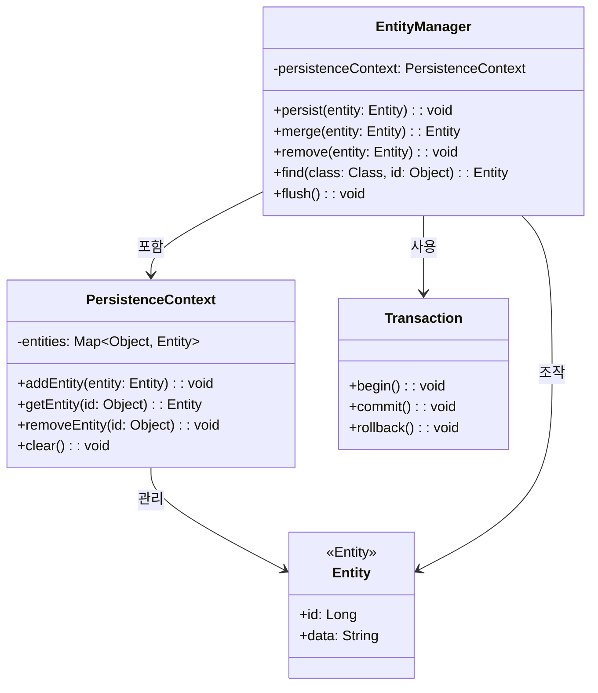
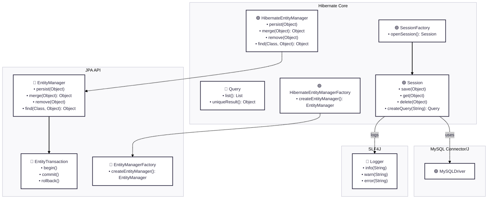
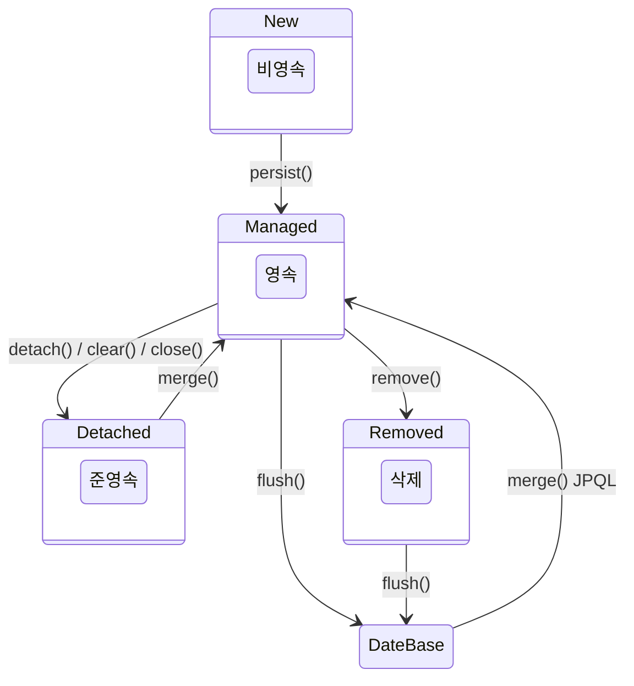
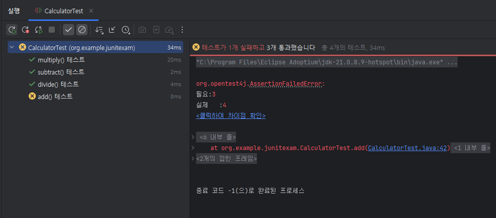

# [ 10주차 - 1022 ] 스터디 내용

```bash
    금일 커리큘럼
        ├ 09:00 ~ 12:00 backend 프로그래밍 (JPA 기초, JPA 핵심 구성 요소)
        └ 13:00 ~ 18:00 backend 프로그래밍 (JPA 프로젝트 생성, EntityManager, JUnit 테스트)
```

## 1. JPA 기초

> JPA(Java Persistence API)


### JPA(Java Persistence API)

- 자바 플랫폼의 **ORM 표준 API**
- 자바 객체와 관계형 데이터베이스의 매핑을 지원하는 인터페이스


### ORM(Object-Relational Mapping)

- **ORM**은 객체 지향 프로그래밍 언어의 객체와 관계형 데이터베이스의 데이터를 매핑하는 기술

### ORM의 핵심 개념

* **객체 모델** : 자바 클래스로 표현되는 비즈니스 로직
* **관계형 모델** : 테이블, 컬럼, 외래 키로 구성된 데이터베이스
* **매핑** : 객체와 테이블, 필드와 컬럼 간의 대응 관계
* **자동 변환** : SQL 생성과 결과 변환을 자동으로 처리


### JPA 코어

* **EntityManager** : JPA의 핵심 인터페이스로, 엔티티의 생명주기 관리, 쿼리 실행, 트랜잭션 관리 등을 담당
* **PersistenceContext** : 엔티티의 상태를 관리하는 컨텍스트
* **Transaction** : 데이터베이스 트랜잭션을 관리
* **Entity** : JPA에서 관리하는 데이터 객체

### JPA 코어 클래스 다이어그램



### JPA의 특징

* **객체 지향적** : 자바 객체를 중심으로 데이터베이스 작업을 수행
* **구현체 독립적** : 특정 데이터베이스 벤더에 종속되지 않음
    - Hibernate, EclipseLink 등 다양한 구현체 지원
* **DBMS 독립적** : 다양한 관계형 데이터베이스 지원 (특정 DB 종속 X)
* **간소화** : 복잡한 SQL 작성 필요 X, 반복 코드 감소
* **표준화** : 자바 EE 표준 사양으로, 다양한 구현체 존재 (예: Hibernate, EclipseLink)


### JPA과 JDBC 차이

| 구분 | JPA | JDBC |
|------|-----|------|
| **추상화** | 높은 추상화 제공 | 낮은 추상화 수준 |
| **객체 지향** | 객체 중심 | 관계형 데이터 중심 |
| **코드 작성** | SQL 자동 생성 | SQL 직접 작성 |
| **생산성** | 높음 (보일러플레이트 제거) | 낮음 (반복 코드 많음) |
| **데이터 변환** | 자동 매핑 | ResultSet 수동 매핑 |
| **트랜잭션 관리** | 내장 트랜잭션 관리 | 수동 트랜잭션 관리 |
| **DBMS 독립성** | 높음 (Dialect로 자동) | 낮음 (DB별 SQL) |
| **유지보수** | 엔티티 변경으로 자동 | SQL 수정 시 여러 곳 변경 |

---

## 2. JPA의 핵심 구성 요소


### JPA 아키텍처

* 🔵 = 인터페이스 , 🟢 = 클래스



### 주요 구성 요소

### EntityManagerFactory (class)

```java
EntityManagerFactory emf = 
    Persistence.createEntityManagerFactory("persistence의 네임값");
```

- **역할** : EntityManager 인스턴스를 생성하는 팩토리 역할
- **특징** : 
    - 애플리케이션 당 하나만 생성
    - 스레드 안전
    - 무거운 객체로, 애플리케이션 시작 시 생성하고 종료 시 닫아야 함


### EntityManager (interface)

```java
// emf - EntityManagerFactory 
EntityManager em = emf.createEntityManager();
// em.parsist(엔티티명); 
em.close();
```

- **역할** : 엔티티의 생명주기 관리, 쿼리 실행, 트랜잭션 관리
- **특징** :
    - 경량 객체로, 필요할 때마다 생성
    - 스레드 비안전
    - 사용 후 반드시 닫아야 함

### EntityTransaction (interface)

```java
// em - EntityManager
EntityTransaction tx = em.getTransaction(); 
tx.begin(); // 트랜잭션 start
tx.commit(); // commit 종료
// tx.rollback()
```

- **역할** : 데이터베이스 트랜잭션 관리
- **특징** :
    - EntityManager를 통해 획득
    - 트랜잭션 시작, 커밋, 롤백 기능 제공 
    - 예 : begin(), commit(), rollback()


### PersistenceContext (annotation)
```java
@PersistenceContext
private EntityManager entityManager;
```

- **역할** : 엔티티 상태를 관리하는 컨텍스트
    - 주로 엔티티매니저 스프링 빈으로 주입할 때 사용
- **특징** :
    - 영속성 컨텍스트라고도 불림
    - 엔티티의 생명주기 상태(비영속, 영속, 준영속, 삭제)를 관리
    - 1차 캐시 역할 수행


---


## 3. JPA 프로젝트 생성

### intelliJ에서 JPA 프로젝트 생성

1. 우측상단 -> file -> **New Project** 선택
2. **설정값**
    - 언어 : Java
    - 타입 : Gradle - Groovy
    - JDK : 21
    - Java : 21
    - 패키지 : Jar

3. **종속성**
    - Spring Data JPA
    - MySQL Driver
    - Spring Web
    - Lombok

### build.gradle 의존성 설정

```groovy
// prev code ...
dependencies {
    implementation 'org.hibernate.orm:hibernate-core:6.6.29.Final'
    implementation 'com.mysql:mysql-connector-j:8.3.0'
    implementation 'jakarta.persistence:jakarta.persistence-api:3.1.0'
    implementation 'org.slf4j:slf4j-api:2.0.17'
    implementation 'ch.qos.logback:logback-classic:1.5.18'
    implementation 'org.slf4j:jul-to-slf4j:2.0.17'

    compileOnly group: 'org.projectlombok', name: 'lombok', version: '1.18.32'
    annotationProcessor 'org.projectlombok:lombok'
    testImplementation 'org.springframework.boot:spring-boot-starter-test'
    testImplementation 'io.projectreactor:reactor-test'
    testRuntimeOnly 'org.junit.platform:junit-platform-launcher'
}
// next code ...
```

### persistence.xml 설정

* **경로** : src/main/resources/META-INF/persistence.xml 생성

```xml
<?xml version="1.0" encoding="UTF-8"?>
<!-- 스키마 및 jpa 2.0로 선언 -->
<persistence xmlns="http://java.sun.com/xml/ns/persistence"
             xmlns:xsi="http://www.w3.org/2001/XMLSchema-instance"
             xsi:schemaLocation="http://java.sun.com/xml/ns/persistence http://java.sun.com/xml/ns/persistence/persistence_2_0.xsd"
             version="2.0">

    <!-- JPA 설정 -->
    <!-- name -> ntityManagerFactory를 생성할 때 해당이름 사용 -->
    <persistence-unit name="lionPU" transaction-type="RESOURCE_LOCAL">
        <provider>org.hibernate.jpa.HibernatePersistenceProvider</provider> <!-- JPA 구현체로 Hibernate 사용 -->
        <class>org.example.jpa.User</class> <!-- JPA 관리 대상 엔티티 클래스 등록 -->

        <properties>
            <!-- DB 접근 -->
            <property name="jakarta.persistence.jdbc.driver" value="com.mysql.cj.jdbc.Driver"/>
            <property name="jakarta.persistence.jdbc.url" value="jdbc:mysql://localhost:3306/librarydb"/>
            <property name="jakarta.persistence.jdbc.user" value="spring"/>
            <property name="jakarta.persistence.jdbc.password" value="spring1234"/>


            <!--  Hibernate 설정 -->
            <property name="hibernate.dialect" value="org.hibernate.dialect.MySQLDialect"/> <!-- MySQL 문법 지정 -->
            <property name="hibernate.hbm2ddl.auto" value="update"/> <!-- 자동 스키마 반영  -->
            <!-- 
                # value 옵션 설명
                * create : 기존테이블 삭제 후 새로 생성
                * create-drop : create와 동일하지만, EntityManagerFactory 종료 시점에 테이블 삭제
                * update : 기존테이블 유지, 변경사항만 반영 (개발시)
                * validate : 엔티티와 테이블이 정상 매핑되었는지 확인만 함 (운영시)
                * none : 아무 작업도 하지 않음  (기본값, 운영시)
            -->

            <property name="hibernate.show_sql" value="true"/> <!-- SQL 출력 -->
            <property name="hibernate.format_sql" value="true"/> <!-- SQL 포맷팅 출력 -->
        </properties>
    </persistence-unit>
</persistence>
```

#### persistence.xml 주요 설정값

| 설정| 설명 | 값 |
|---|---|---|
| persistence-unit name | 설정 그룹 이름 | UserPU |
| transaction-type | 트랜잭션 관리 방식 | RESOURCE_LOCAL (직접 관리) |
| provider | JPA 구현체 | Hibernate |
| hibernate.dialect | 데이터베이스 방언 | MySQLDialect |
| hibernate.hbm2ddl.auto | DDL 자동 생성 정책 | update |
| hibernate.show_sql | SQL 로그 출력 | true |
| hibernate.format_sql | SQL 포맷팅 | true |

#### hibernate.hbm2ddl.auto 옵션 설명

| value | 설명 |
|---|---|
| create | 기존테이블 삭제 후 새로 생성 |
| create-drop | create와 동일하지만, EntityManagerFactory 종료 시점에 테이블 삭제 |
| update | 기존테이블 유지, 변경사항만 반영 (개발시) |
| validate | 엔티티와 테이블이 정상 매핑되었는지 확인만 함 (운영시) |
| none | 아무 작업도 하지 않음  (기본값, 운영시) |

---


## 4. JPA - EntityManager

> EntityManager ? 엔티티의 생명주기 관리, 쿼리 실행, 트랜잭션 관리 등을 담당하는 JPA의 핵심 인터페이스

### EntityManager 생성

```java
// EntityManagerFactory 생성
EntityManagerFactory emf = Persistence.createEntityManagerFactory("lionPU");
// EntityManager 생성
EntityManager em = emf.createEntityManager();
```

### EntityManager 주요 메서드

```java
EntityManager em = emf.createEntityManager();
em.getTransaction().begin(); // 트랜잭션 시작
em.persist(entity); 
em.find(Entity.class, id); 
em.remove(entity);
em.merge(entity); 
em.getTransaction().commit(); // 트랜잭션 커밋
em.close(); // EntityManager 종료
```

* **persist(Object entity)** : 엔티티를 영속성 컨텍스트에 저장 (INSERT)
* **find(Class<T> entityClass, Object primaryKey)** : 기본 키로 엔티티 조회 (SELECT)
* **remove(Object entity)** : 엔티티를 영속성 컨텍스트에서 제거 (DELETE)
* **merge(Object entity)** : 준영속 상태의 엔티티를 영속 상태로 병합
* **getTransaction()** : 트랜잭션 객체 획득
    - 메서드 제공 
    - .begin() : 트랜잭션 시작
    - .commit() : 트랜잭션 커밋
    - .rollback() : 트랜잭션 롤백


### 엔티티 라이플 사이클

* 엔티티 : JPA에서 관리하는 데이터 객체 (domain object)



* **비영속 (New)** : 엔티티 객체가 생성되었지만, 아직 영속성 컨텍스트에 저장되지 않은 상태
    - 즉, JPA와 전혀 관계없이 객체만 생성한 상태
* **영속 (Managed)** : 엔티티 객체가 영속성 컨텍스트에 저장되어 관리되는 상태
    - 생성한 객체를 `em.persist()`를 통해 영속성 컨텍스트에 저장하거나, `em.find()`로 조회한 경우
* **준영속 (Detached)** : 영속성 컨텍스트에서 분리되어 더 이상 관리되지 않는 상태
    - `em.detach()` 또는 `em.clear()`로 분리하거나, EntityManager가 종료된 경우
* **삭제 (Removed)** : 엔티티 객체가 영속성 컨텍스트에서 제거된 상태
    - `em.remove()` 메서드를 호출하여 삭제된 상태


---

## 5. User 엔티티 클래스

### User 엔티티 클래스 작성

```java
@Entity // JPA의 엔티티 클래스를 나타내는 어노테이션
@NoArgsConstructor
@Getter
@Setter
@ToString
@Table(name = "jpa_user") // 해당 'jpa_user' 테이블없으면 자동생성됨
public class User {
    @Id
    @GeneratedValue(strategy = GenerationType.IDENTITY) // pk 자동생성 전략 (1부터)
    private Long id;
    private String name;
    @Column(nullable = false) // email 컬럼 not null 제약조건 추가
    private String email;

    public User(String name, String email) {
        this.name = name;
        this.email = email;
    }
}
```

```sql
-- 생성된 jpa_user 형태는 ?
CREATE TABLE jpa_user (
  id BIGINT NOT NULL AUTO_INCREMENT,
  name VARCHAR(255),
  email VARCHAR(255) NOT NULL,
  PRIMARY KEY (id)
) engine=InnoDB;
```

### JPA 어노테이션 가이드

#### 엔티티 관련 어노테이션

| 어노테이션 | 설명 |
|-----------|------|
| `@Entity` | JPA 엔티티 클래스 선언, 데이터베이스 테이블과 매핑 |
| `@Table(name = "테이블명")` | 매핑될 테이블 이름 지정 (생략 시 클래스명 사용) |

#### 기본 키 관련 어노테이션

| 어노테이션 | 설명 |
|-----------|------|
| `@Id` | 엔티티의 기본 키(Primary Key) 필드 지정 |
| `@GeneratedValue` | 기본 키 자동 생성 전략 설정 |

#### @GeneratedValue 전략 옵션

* `(strategy = GenerationType.값)`

| 전략 | 설명 | 적용 DB |
|------|------|---------|
| `IDENTITY` | DB의 자동 증가 컬럼 사용 (AUTO_INCREMENT) | MySQL, SQL Server |
| `SEQUENCE` | DB 시퀀스 사용 | Oracle, PostgreSQL |
| `TABLE` | 별도 테이블로 키 생성 (비추천) | 모든 DB |
| `AUTO` | DB에 따라 자동 선택 (기본값) | 모든 DB |

#### @Column 어노테이션 옵션

| 옵션 | 설명 | 
|------|------|
| `nullable = false` | NOT NULL 제약조건 |
| `length = 숫자` | 문자열 길이 제한 |
| `unique = true` | 유니크 제약조건 |
| `name = "컬럼명"` | 실제 DB 컬럼명 지정 |
| `insertable = false` | INSERT 시 컬럼 제외 |
| `updatable = false` | UPDATE 시 컬럼 제외 |


### persistence.xml 에 수동 User 엔티티 추가

```xml
     <persistence-unit name="lionPU" transaction-type="RESOURCE_LOCAL">
        <provider>org.hibernate.jpa.HibernatePersistenceProvider</provider> 
        <class>org.example.jpa.User</class> <!-- 요기 -->
```


### JPA 테스트 코드 작성

```java 

import jakarta.persistence.EntityManager;
import jakarta.persistence.EntityManagerFactory;
import jakarta.persistence.Persistence;

public class JpaRun {
    public static void main(String[] args) {
        // EntityManagerFactory ? 설정정보를 바탕으로 EntityManager를 생성하는 팩토리
        EntityManagerFactory emf =
                Persistence.createEntityManagerFactory("lionPU");

        // EntityManager ? DB와의 연결 담당, 실제 데이터 처리는 EntityManager가 담당
        EntityManager em = emf.createEntityManager();
        
        // 트랜잭션 시작
        em.getTransaction().begin();

        // 입력 - User 엔티티 생성 (비영속 상태)
        User user = new User("jung5", "jung5@example.com");

        System.out.println("persist 전: " + user);

        // 영속 상태로 전환 - DB에 저장 (INSERT)
        em.persist(user); // new -> managed (영속)

        System.out.println("persist 후: " + user);

        // 트랜잭션 커밋 - 실제 DB에 반영
        em.getTransaction().commit();


        System.out.println("-".repeat(10));

        // 조회
        User findUser1 = em.find(User.class, 1L); // managed (영속)
        User findUser2 = em.find(User.class, 1L);
        User findUser3 = em.find(User.class, 1L);

        if(findUser1.equals(findUser2)) System.out.println("같음");
        else System.out.println("같지않음");
        if(findUser1.equals(findUser3)) System.out.println("같음");
        else System.out.println("같지않음");

    }
}

```

```bash
# 실행 결과 
persist 전: User(id=null, name=jung5, email=jung5@example.com)
Hibernate: 
    insert 
    into
        jpa_user
        (email, name) 
    values
        (?, ?)
persist 후: User(id=1, name=jung5, email=jung5@example.com)
----------
Hibernate: 
    select
        u1_0.id,
        u1_0.email,
        u1_0.name 
    from
        jpa_user u1_0 
    where
        u1_0.id=?
같음
같음
```

### 엔티티 시퀀스 사용

#### 시퀀스(Sequence) 란?

> 시퀀스는 DB에서 고유한 숫자를 순차적으로 생성하는 독립적인 객체

* 주로 기본 키(primary key) 값을 자동으로 생성하는 데 사용
* 시퀀스는 데이터베이스 내에서 독립적으로 관리되며, 여러 테이블에서 공유 가능

####  실행 해보자면 ?

```java 
// User 엔티티 클래스 ...
public class User {
    @Id
    // @GeneratedValue(strategy = GenerationType.IDENTITY)
    @GeneratedValue(strategy = GenerationType.SEQUENCE)
    private Long id;
}

// run 클래스 ...
public class JpaRunIns {
    public static void main(String[] args) {
        EntityManagerFactory emf =
                Persistence.createEntityManagerFactory("lionPU");

        EntityManager em = emf.createEntityManager();

        // 트랜잭션 시작
        em.getTransaction().begin();
        System.out.println("커밋전!!!!!");

        User user = new User("jung15", "jung15@example.com");
        System.out.println("persist 전: " + user);

        em.persist(user);

        System.out.println("persist 후: " + user);

        // 트랜잭션 커밋 - 실제 DB에 반영
        em.getTransaction().commit();
        System.out.println("커밋후!!!!!");
    }
}

```

```bash
# 실행 결과
# -- jpa_user가 아닌 jpa_user_SEQ 으로 생성 왜 ? 
# - MySQL은 시퀀스 자체 지원 안되서 별도 독립 테이블을 만듬.
Hibernate: 
    create table jpa_user_SEQ (
        next_val bigint
    ) engine=InnoDB
Hibernate: 
    insert into jpa_user_SEQ values ( 1 )
커밋전!!!!!
persist 전: User(id=null, name=jung15, email=jung15@example.com)
Hibernate: 
    select
        next_val as id_val 
    from
        jpa_user_SEQ for update
Hibernate: 
    update
        jpa_user_SEQ 
    set
        next_val= ? 
    where
        next_val=?
persist 후: User(id=1, name=jung15, email=jung15@example.com)
Hibernate: 
    insert 
    into
        jpa_user
        (email, name, id) 
    values
        (?, ?, ?)
커밋후!!!!!
```

#### 시퀀스랑 아이덴티티 차이점

1. **생성 시점**
    - IDENTITY : INSERT 시점에 값이 생성
    - SEQUENCE : INSERT 전에 미리 값이 생성

2. **성능**
    - IDENTITY : 매 INSERT마다 DB와 통신 필요 (성능 저하 가능)
    - SEQUENCE : 미리 값을 가져올 수 있어 성능 우수

3. **호환성**
    - IDENTITY : MySQL, SQL Server 등에서 지원
    - SEQUENCE : Oracle, PostgreSQL 등에서 주로 사용

4. **사용 용도**
    - IDENTITY : 간단한 기본 키 생성에 적합
    - SEQUENCE : 복잡한 키 생성 로직에 유리 (예: 여러 테이블에서 공유)

---

## 6. IDENTITY DML 및 merge 테스트


### 엔티티 - Product 클래스 생성

```java
@Entity
@Getter
@Setter
@ToString
@AllArgsConstructor
@NoArgsConstructor
@Table (name = "products")
public class Product {
    @Id
    @GeneratedValue(strategy = GenerationType.IDENTITY)
    private Long id;
    private String name;
    private int price;

    public Product(String name, int price) {
        this.name = name;
        this.price = price;
    }
}
```

### persistence.xml 에 수동 Product 엔티티 추가

```xml
<class>org.example.jpa.Product</class>
```


### DML , merge 테스트 코드 작성

```java

public class ProductRun {
    public static void main(String[] args) {
        EntityManagerFactory emf =
                Persistence.createEntityManagerFactory("lionPU");

        // 엔티티 매니저 1
        EntityManager em1 = emf.createEntityManager();
        em1.getTransaction().begin();

        Product p1 = new Product("사과", 9900); // new (비영속)
        Product p2 = new Product("바나나", 19800);
        Product p3 = new Product("딸기", 29800);

        // insert
        em1.persist(p1);  // 이 시점부터 p1은 managed (영속)
        em1.persist(p2);
        em1.persist(p3);

        // select
        Product getP1 = em1.find(Product.class, p1.getId()); // managed (영속)
        Product getP2 = em1.find(Product.class, p2.getId());
        Product getP3 = em1.find(Product.class, p3.getId());

        // update
        getP1.setPrice(100); // 꺼내서 가능
        getP2.setPrice(200);
        p3.setPrice(300); // p3 이미 영속 상태로 반영 가능

        // deleate
        em1.remove(getP1);

        System.out.println("getP2: " + getP2);
        System.out.println("getP3: " + getP3);

        em1.getTransaction().commit();
        em1.close(); // p1,p2,p3 준영속 변경됨

        // ----------------------------------------
        System.out.println("-".repeat(10));
        // 엔티티 매니저 2
        EntityManager em2 =  emf.createEntityManager();
        em2.getTransaction().begin();

        // 이전 준영속 엔티티 값 수정
        System.out.println("수정 전 p2: " + p2);
        p2.setName("샤인머스켓");
        p2.setPrice(1);

        Product mergeP2 = em2.merge(p2); // 수정값 반영 -> 영속전환
        System.out.println("merge 후 p2: " + mergeP2);

        em2.getTransaction().commit();
        em2.close();
    }
}
```

```bash
# 실행 결과
Hibernate: 
    create table products (
        id bigint not null auto_increment,
        name varchar(255),
        price integer not null,
        primary key (id)
    ) engine=InnoDB
Hibernate: # ... // insert [p1]
Hibernate: # ... // insert [p2]
Hibernate: # ... // insert [p3]
getP2: Product(id=2, name=바나나, price=200)
getP3: Product(id=3, name=딸기, price=300)
Hibernate: # ... // delete [p1]
Hibernate: # ... // commit
----------
수정 전 p2: Product(id=2, name=바나나, price=200)
Hibernate: # ... // select [p2]
merge 후 p2: Product(id=2, name=샤인머스켓, price=1)
Hibernate: # ... // commit
```

---


## 6. JUnit 테스트

> JUnit ? 자바 프로그래밍 언어용 단위 테스트 프레임워크

* JUnit은 자바 애플리케이션의 개별 단위(메서드 또는 클래스)를 테스트하는 데 사용되는 오픈 소스 프레임워크
* JUnit은 테스트 주도 개발(TDD)을 지원하며, 개발자가 코드를 작성하기 전에 테스트 케이스를 먼저 작성할 수 있도록 도와줌


### JUnit 테스트 해보기

#### 테스트 할 대상 Class

* main/java/org/example/junitexam/Calculator.java

```java
package org.example.junitexam;

public class Calculator {

    public int add(int a, int b) {
        return a + b + 1; // 일부러 틀리게
    }

    public int subtract(int a, int b) {
        return a - b;
    }

    public int multiply(int a, int b) {
        return a * b;
    }

    public int divide(int a, int b) {
        if (b == 0) {
            throw new IllegalArgumentException("0으로 나눌 수 없습니다!");
        }
        return a / b;
    }
}
```

#### 테스트 class 생성

* test/java/org/example/junitexam/CalculatorTest.java

```java
package org.example.junitexam;

import org.junit.jupiter.api.*;
import static org.junit.jupiter.api.Assertions.*; // 클래스빼고 스태틱 메서드만 사용

// 메서드 오더 적용 (순서 비보장, @Order 명시된 것 우선)
@TestMethodOrder(MethodOrderer.OrderAnnotation.class)
public class CalculatorTest {
    Calculator calc;

    @BeforeAll // 테스트 처음 시작될 때 1번
    static void beforeAll() { }
    
    @AfterAll // 모든 테스트 종료될 때 1번
    static void afterAll() { }

    @BeforeEach // 각 @Test 별 실행될 때 
    public void setUp() {
        calc = new Calculator();
    }

    @AfterEach // 각 @Test별 종료될 때
    public void tearDown() { }

    @Test // 테스트 선언
    @DisplayName("add() 테스트") // 테스트 명 변경
    public void add() {
        int result = calc.add(1,2);
        assertEquals(3, result); // 예측값, 결과값
    }

    @Test
    @DisplayName("subtract() 테스트")
    public void subtract() {
        int result = calc.subtract(5,2);
        assertEquals(3, result);
    }

    @Test
    @DisplayName("multiply() 테스트")
    @Order(1) // 테스트 실행 순서
    public void multiply() {
        assertEquals(10, calc.multiply(5,2));
        assertEquals(20, calc.multiply(10,2));
    }


    @Test
    @DisplayName("divide() 테스트")
    public void divide() {
        assertEquals(5, calc.divide(10,2));
        
        // 예외처리 확인시
        IllegalArgumentException e = assertThrows(
                IllegalArgumentException.class,
                () -> calc.divide(10, 0)
        );
    }
}
```

#### 실행 결과


