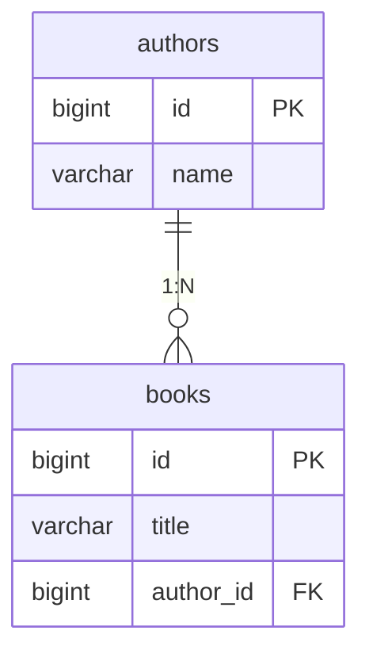
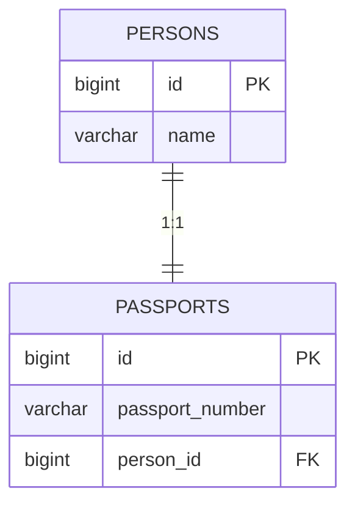
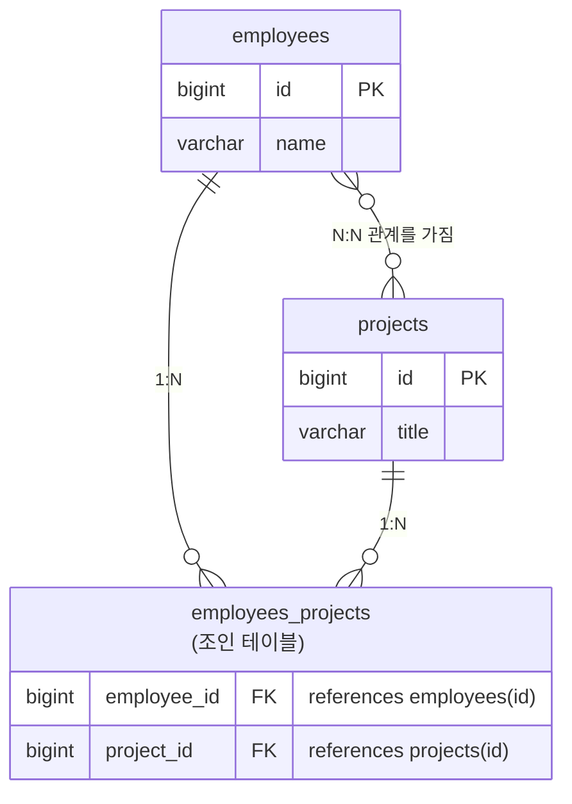

# [ 10주차 - 1024 ] 스터디 내용

```bash
    금일 커리큘럼
        ├ 09:00 ~ 14:00 backend 프로그래밍 (연관관계 매핑, @OneToMany, @OneToOne, @ManyToMany)
        └ 14:00 ~ 18:00 backend 프로그래밍 (Spring Data JPA 개념, assertJ)
```

## 1. 엔티티 매핑 - 연관 관계 

> OneToOne(1:1), ManyToOne(N:1), OneToMany(1:N), ManyToMany(N:N)

### Cascade와 orphanRemoval


- **Cascade** : 엔티티의 상태 변화에 따라 연관된 엔티티의 상태도 자동으로 변화시키는 기능
- **orphanRemoval** : 엔티티와의 연관 관계가 끊어진 다른 엔티티를 자동으로 삭제하는 기능
    - `true` : 활성화
    - `false` : 비활성화

```java
// Parent Entity
@OneToMany(
    cascade = CascadeType.ALL, 
    orphanRemoval = true
)
private List<ChildEntity> childEntities = new ArrayList<>();
```

### CascadeType 종류

| 종류  | 설명 | 사용예시 |
|-------|-------|-------|
| ALL   | 모든 상태 변화 적용 | 게시글 삭제 시 댓글도 모두 삭제 |
| PERSIST | insert시 연관 엔티티 저장 | 주문 생성 시 주문상품도 함께 저장 |
| MERGE | update or merge시 연관 엔티티 병합 | 회원 정보 수정 시 주소도 함께 업데이트 |
| REMOVE | remove시 연관 엔티티 삭제 | 카테고리 삭제 시 하위 상품들도 삭제 |
| REFRESH | refresh시 연관 엔티티 새로고침 | 팀 새로고침 시 팀원 정보도 갱신 |
| DETACH | detach시 연관 엔티티 분리 | 부서 분리 시 소속 직원들도 영속성 컨텍스트에서 분리 |

### 실무에서 권장하는 Cascade 정의

- **1:1**: 생명주기가 같은 경우만 CASCADE.ALL
- **1:N**: CASCADE.PERSIST + orphanRemoval = true
- **N:1**: CASCADE.PERSIST만 사용
- **N:N**: CASCADE.PERSIST만 사용 (REMOVE 절대 금지)

### 피해야 할 부분
- N:1에서 CASCADE.REMOVE 사용 ❌
- N:N에서 CASCADE.REMOVE 사용 ❌
- 비즈니스 로직 없이 무분별한 CASCADE.ALL 사용 ❌

---

## 2. @OneToMany (ManyToOne) Cascade 동작

### 1:N / N:1 관계의 특징 (부모-자식간)

- **부모-자식 관계가 명확** - 1쪽이 부모, N쪽이 자식
- **자식 엔티티가 외래키를 가짐** - N쪽에서 1쪽을 참조
- **일반적으로 부모에서 자식으로의 Cascade 사용**
- 예: 저자(authors) ←→ 책들(books, FK)

### ERD 예시 



**테이블 관계 설명:**
- `authors` → `books`: **1:N 관계**
- `books`가 `author_id` 외래키를 가짐 = 연관관계의 주인
- 부모(Author) 삭제 시 자식(Book) 처리 방안 필요


### 단방향 cascade로 할 경우 ( Author → Book )

```java
@Entity
@Table(name = "authors")
public class Author {
    @OneToMany(
        mappedBy = "author", // 외래키 내쪽이 아님을 명시
        cascade = CascadeType.ALL,
        orphanRemoval = true // 부모와 연관관계가 끊어진 자식 자동 삭제
    )
    private List<Book> books = new ArrayList<>();
}

// 책 cascade 없을 때 ...
@Entity
@Table(name = "books")
public class Book {
    @ManyToOne
    @JoinColumn(name = "author_id") // 외래키 attr 명
    private Author author;
}
```

#### 동작 결과

- Author 저장 → (all) 전파 → 소속 Book들도 자동 저장 ✅
- Author 삭제 → (all) 전파 → 소속 Book들도 자동 삭제 ✅
- Book 저장 → Author는 저장되지 않음 ❌
- Book 삭제 → Author는 삭제되지 않음 ❌

### 양방향 cascade로 할 경우 ( Author ↔ Book )

```java
// Author는 그대로 !

// Book - CascadeType 적용
@Entity
@Table(name = "books")
public class Book {
    @ManyToOne(cascade = CascadeType.PERSIST) // 저장만 전파
    @JoinColumn(name = "author_id")
    private Author author;
}
```

#### 동작 결과

- Author 저장 → (all) 전파 → Book들도 자동 저장 ✅
- Author 삭제 → (all) 전파 → Book들도 자동 삭제 ✅
- Book 저장 → (persist) 전파 → Author도 자동 저장 ✅
- Book 삭제 → Author는 삭제되지 않음 ❌ (REMOVE cascade 없음)

### 핵심 정리

- **Book**이 외래키(`author_id`)를 가지므로 연관관계의 주인
- **Author**는 `mappedBy`로 역방향 참조만 수행
- 실제 데이터베이스 외래키 관리는 Book이 담당

### orphanRemoval의 역할

- **1:N 관계에서만 사용 권장**
- 부모 엔티티의 컬렉션에서 자식을 제거하면 자식 엔티티도 DB에서 삭제
- `cascade = CascadeType.REMOVE`와 다른 개념

```java
// orphanRemoval 예시
Author author = authorRepository.findById(1L);
author.getBooks().remove(0); // 첫 번째 책을 리스트에서 제거
// → orphanRemoval = true면 해당 책이 DB에서도 삭제됨
```

#### 1:N, N:1 에서 권장 방식

- **1:N (부모 → 자식)**: CASCADE.ALL + orphanRemoval = true 일반적
- **N:1 (자식 → 부모)**: 없이 사용하거나, PERSIST 만 설정
- 자식에서 절대 REMOVE 설정하면 안됨!!

---

## 3. @OneToOne (1:1) Cascade 동작

### 1:1 관계의 특징

- OneToOne 양방향 관계에서는 해당 데이터를 누가 관리하는지가 중요
- 보통 외래키 없는 쪽에서 생명주기 관리를 위해 Cascade ALL 설정
- 예: 사람(Person, All설정) ←→ 여권(Passport, FK)

### ERD 예시



**테이블 관계 설명:**
- `PERSONS` ↔ `PASSPORTS`: **1:1 관계**
- `PASSPORTS`가 `person_id` 외래키를 가짐 = 연관관계의 주인
- 한 사람은 하나의 여권만 가질 수 있음


### 단방향 cascade로 할 경우 ( Person → Passport )

```java
@Entity
@Table(name = "persons")
public class Person {
    @OneToOne(
        mappedBy = "person", // FK 내쪽이 아님을 명시
        cascade = CascadeType.ALL
    )
    private Passport passport;
}

// 여권 cascade 없을 때 ...
@Entity
@Table(name = "passports")
public class Passport {
    @OneToOne
    @JoinColumn(name = "person_id")  // 외래키를 가짐
    private Person person;
}
```

#### 동작 결과

- Person 저장 → (all) 전파 → Passport도 자동 저장 ✅
- Person 삭제 → (all) 전파 → Passport도 자동 삭제 ✅
- Passport 저장 → Person은 저장되지 않음 ❌
- Passport 삭제 → Person은 삭제되지 않음 ❌

### 양방향 cascade로 할 경우 ( Person ↔ Passport )

```java
// Person은 그대로 !

// Passport - CascadeType 적용
@Entity
@Table(name = "passports")
public class Passport {

    @OneToOne(cascade = CascadeType.PERSIST) // 저장만 전파
    @JoinColumn(name = "person_id")
    private Person person;
}
```

#### 동작 결과

- Person 저장 → (all) 전파 → Passport도 자동 저장 ✅
- Person 삭제 → (all) 전파 → Passport도 자동 삭제 ✅
- Passport 저장 → (persist) 전파 → Person도 자동 저장 ✅
- Passport 삭제 → Person은 삭제되지 않음 ❌

### 핵심 정리 

- **Person**은 `mappedBy` 사용 (외래키 없음)
- **Passport**가 외래키(`person_id`)를 가지므로 연관관계의 주인
- Cascade는 선언된 쪽에서만 작동하므로, 양방향 전파가 필요하면 양쪽 모두 설정

---

## 4. @ManyToMany (N:N) Cascade 동작


### N:N 관계의 특징

- **서로 외래키를 가지지 않음** - 중간 테이블이 외래키를 관리
- 중간 테이블을 통해 연관관계를 맺어야 함
- **연관관계의 주인 결정**이 중요 - 누가 중간 테이블을 관리할지?
- 예: 직원(employees) ↔ 프로젝트(projects)

### ERD 예시



**테이블 관계 설명:**

- `employees` ↔ `projects`: **N:N 관계** (서로 외래키 없음)
- `employees_projects`: **중간 테이블**이 양쪽 외래키를 관리
- 연관관계의 주인(`@JoinTable`)이 중간 테이블을 생성하고 관리

### 연관관계의 주인 결정 기준

1. **비즈니스 로직상 더 중요한 엔티티**
2. **더 자주 조회/수정되는 엔티티** 
3. **일반적 관례**: 알파벳 순서가 빠른 엔티티
   - Employee vs Project → Employee가 주인


### 단방향 cascade로 할 경우 ( Employee → Project )

```java
@Entity
@Table(name = "employees")
public class Employee {
    @ManyToMany(cascade = CascadeType.PERSIST)
    // join 테이블 (중간 테이블) 설정
    @JoinTable( // 이 어노테이션이 있는 쪽이 연관관계의 주인
        name = "employees_projects",
        joinColumns = @JoinColumn(name = "employee_id"),
        inverseJoinColumns = @JoinColumn(name = "project_id")
    )
    private List<Project> projects = new ArrayList<>();
}

// 프로젝트 cascade 없을 때 ...
@Entity
@Table(name = "projects")
public class Project {
    // Employee의 projects 필드를 참조
    @ManyToMany(mappedBy = "projects")
    private List<Employee> employees = new ArrayList<>();
}
```

#### 동작 결과

- Employee 저장 → (persist) 전파 → 연관된 Project도 자동 저장 ✅
- Employee 삭제 → Project는 삭제되지 않음 ❌
- Project 저장 → Employee는 저장되지 않음 ❌
- Project 삭제 → Employee는 삭제되지 않음 ❌

### 양방향 cascade로 할 경우 ( Employee ↔ Project )

```java
// Employee는 그대로 !

// Project - CascadeType 적용
@Entity
@Table(name = "projects")
public class Project {
    @ManyToMany(
        mappedBy = "projects", // 조인테이블 담당 아니라서 설정해야함.
        cascade = CascadeType.PERSIST // 저장만 전파
    )
    private List<Employee> employees = new ArrayList<>();
}
```

#### 동작 결과

- Employee 저장 → (persist) 전파 → Project도 자동 저장 ✅
- Project 저장 → (persist) 전파 → Employee도 자동 저장 ✅
- Employee/Project 삭제 → 상대방은 삭제되지 않음 ❌

### 핵심 정리

- **Employee**가 `@JoinTable`을 사용하여 연관관계의 주인 결정됨
- **Project**는 `mappedBy`로 역방향 참조만 수행
- 중간 테이블(`employees_projects`) 관리는 한쪽만 담당 (Employee)

### 여기서 mappedBy의 역할

- 조인테이블 없는 쪽에 설정하여 중복으로 조인테이블 생성 방지
- 양방향 참조를 위한 역방향 매핑
- "Employee의 projects 필드를 통해 매핑된다"는 의미

### Cascade 사용 시 주의사항

- **N:N에서 CascadeType.REMOVE는 매우 위험**
  - 예: 직원 1명 삭제 시 → 관련된 모든 프로젝트 삭제 가능
  - 예: 프로젝트 1개 삭제 시 → 참여한 모든 직원 삭제 가능
- **일반적으로 PERSIST만 사용**하여 저장 시에만 전파
- 삭제는 비즈니스 로직에서 별도 처리 권장


---


## 5. Spring Data JPA - 기초개념

### Spring Data JPA란?

- Spring Framework에서 JPA를 쉽게 사용할 수 있도록 도와주는 모듈
- JPA 기반의 데이터 접근 계층을 간편하게 구현할 수 있도록 지원
- 복잡한 DAO 코드를 줄이고, 선언적인 방식으로 데이터베이스 작업 가능

### 주요 기능

- **리포지토리 인터페이스 제공**: JpaRepository, CrudRepository 등
- **메서드 이름으로 쿼리 생성**: 메서드 이름만으로도 다양한 쿼리 작성 가능
- **페이징 및 정렬 지원**: Pageable, Sort 객체 활용
- **JPQL 및 네이티브 쿼리 지원**: 복잡한 쿼리도 직접 작성 가능
- **트랜잭션 관리 통합**: Spring의 트랜잭션 관리와 연동

### Data JDBC와 Data JPA의 차이점

| 항목 | Spring Data JDBC | Spring Data JPA |
| --- | ----------------- | --------------- |
| **ORM 여부** | ❌ 단순 JDBC 기반 (ORM 아님) | ✅ Hibernate 등 ORM 기반  |
| **매핑 방식** | 테이블 ↔ 객체 (단순 매핑) | 엔티티 ↔ 객체 (복잡 매핑) |
| **영속성 컨텍스트** | 없음 (각 쿼리마다 독립) | 있음 (1차 캐시, Dirty Checking 등 지원) |
| **SQL 제어권** | 개발자가 직접 제어 가능 | 대부분 Hibernate가 생성 및 관리 |
| **성능** | 단순하고 빠름 (SQL 명확) | ORM 오버헤드 존재 |
| **관계 매핑** | Aggregate Root 중심 (간단 관계만) | 1:1, 1:N, N:M 등 복잡 관계 지원 |
| **학습 곡선** | 낮음 (명시적 쿼리 중심) | 높음 (ORM 이해 필요) |
| **트랜잭션 관리** | Spring @Transactional 사용 | 동일하게 사용 가능 |
| **대표 사용처** | 단순 CRUD, MSA, 마이크로서비스 | 복잡한 도메인 모델, 엔터프라이즈 시스템 |


### 내부 동작에서 차이점

#### Spring Data JPA

* Hibernate 같은 ORM 구현체를 사용.
* 영속성 컨텍스트(Persistence Context) 안에서 엔티티 상태를 추적함.
* 변경 감지를 통해 `em.persist()` 후 `setName()`만 해도 자동으로 UPDATE 수행됨.
* 복잡한 연관관계 매핑(`@OneToMany`, `@ManyToMany`) 지원.
* 하지만 SQL이 추상화되어 쿼리 제어가 어렵고 디버깅 복잡함.

```java
// JPA 예시
@Entity
public class User {
    @Id @GeneratedValue
    private Long id;
    private String name;
}
User user = entityManager.find(User.class, 1L); // 영속성 컨텍스트에서 관리
user.setName("홍길동"); // 변경 감지로 자동 update
```

#### Spring Data JDBC

* ORM 기능 없이 단순히 SQL ↔ 객체 매핑을 해주는 레벨
* Hibernate 같은 무거운 엔진 없이, 직접 쿼리 실행 (INSERT, UPDATE, DELETE)
* 변경 감지 없음 → 수정 시 `save()` 명시적으로 호출해야 함
* DB 구조와 객체 구조가 1:1 매핑되어야 함 (복잡 관계 거의 불가)
* 대신 SQL 제어권 100% 개발자에게 있음

```java
// Data JDBC 예시
@Table("users")
public class User {
    @Id
    private Long id;
    private String name;
}

// Repository 호출 시 직접 SQL 실행
userRepository.save(new User("홍길동")); // 실제 INSERT
```

### 차이점 핵심 요약

* JPA는 ORM 기반의 핵심 기술 - 객체 모델링과 관계매핑이 필요하면 적합
* JDBC는 단순 SQL 매핑 - 관계매핑이 필요 없고, SQL 제어가 중요하면 적합


---

## 6. 테스트 - assertJ API

### 테스트에서 DB 반영없이 롤백 처리 방법    

- 클래스 단에서 `@Transactional` 어노테이션 사용

### assertJ API ?

- 단언(Assertion) 라이브러리로, 테스트 코드에서 기대값과 실제값을 비교하는 데 사용
- 가독성이 뛰어나고 다양한 단언 메서드를 제공하여 테스트 코드를 더 읽기 쉽게 만듬


### assertJ 주요 메서드 예시

- **null 관련**
    `assertThat(actual).isNotNull()` : 실제 값이 null이 아닌지 확인
- **동일성 관련**
    `assertThat(actual).isEqualTo(expected)` : 실제 값이 기대 값과 같은지 확인
- **타입 관련**
    `assertThat(actual).isInstanceOf(expectedType)` : 실제 값이 기대하는 타입인지 확인
- **크기 관련**
    - `assertThat(a).isGreaterThan(n)` : a > n ?
    - `assertThat(a).isLessThan(n)` : a < n ?
    - `assertThat(a).isGreaterThanOrEqualTo(n)` : a >= n ?
    - `assertThat(a).isLessThanOrEqualTo(n)` : a <= n ?
    - `assertThat(a).isBetween(n1, n2)` : n1 <= a && a <= n2 ?

```java
import static org.assertj.core.api.Assertions.*;
import org.junit.jupiter.api.BeforeAll;
import org.junit.jupiter.api.BeforeEach;
import org.junit.jupiter.api.Test;
import org.springframework.beans.factory.annotation.Autowired;
import org.springframework.boot.test.context.SpringBootTest;
import org.springframework.transaction.annotation.Transactional;
import java.util.List;


@SpringBootTest
@Transactional // 테스트 끝난 후 롤백 시켜주는 어노테이션
public class UserRepositoryTest {
    @Autowired
    private UserRepository userRepo;
    private List<User> testUsers;

    @BeforeEach
    void setUp() throws Exception {
        userRepo.deleteAll();
        testUsers = List.of(
                userRepo.save(new User("test01","test01@Amail.com")),
                userRepo.save(new User("test02","test02@Amail.com")),
                userRepo.save(new User("test03","test03@Bmail.com")),
                userRepo.save(new User("test04","test04@Cmail.com")),
                userRepo.save(new User("test05","test05@Cmail.com"))
        );
    }

    @Test
    void 사용자_추가() {
        User user = new User("test2", "test2@example.com");
        User saveUser = userRepo.save(user);
        // assertThat(saveUser.getId()).isNotNull();
        System.out.println("사용자추가() - 세이브성공: " + saveUser.getId());
    }

    @Test
    void 사용자_수정() {
        User findUser = testUsers.get(0); // test01
        System.out.println("사용자수정() - 수정전: " + findUser.getName());
        findUser.setName("test-01");
        userRepo.save(findUser);
        System.out.println("사용자수정() - 수정후: " + findUser.getName());
        assertThat(findUser.getName()).isEqualTo("test-01");
    }
    
    @Test
    void 사용자_삭제() {
        User findUser = testUsers.get(2); // test03
        System.out.println("사용자삭제() - 삭제전: " + findUser.getId());
        userRepo.delete(findUser);
        System.out.println("사용자삭제() - 삭제후: " + findUser.getId());
        assertThat(userRepo.findById(findUser.getId()).orElse(null)).isNull();
    }

    @Test
    void 이름으로_찾기() {
        List<User> findUsers = userRepo.findByNameContaining("test");
        for(User user : findUsers) {
            System.out.println(user);
        }
        assertThat(findUsers.size()).isGreaterThan(0); // 보다큼
        // (a).isEqualTo(n) - 같음 (a == n)
        // (a).isGreaterThan(n) - 초과 (a > n)
        // (a).isGreaterThanOrEqualTo(n) - 이상 (a >= n)
        // (a).isLessThanOrEqualTo(n) - 이하 (a <= n)
        // (a).isBetween(n, m) - 범위 ( n <= a && a <= m)
    }
    @Test
    void 이메일로_찾기() {
        List<User> findUsers = userRepo.findByEmailContaining("Cmail.com");
        for(User user : findUsers) {
            System.out.println(user);
        }
        assertThat(findUsers.size()).isGreaterThan(0);
    }

}
```