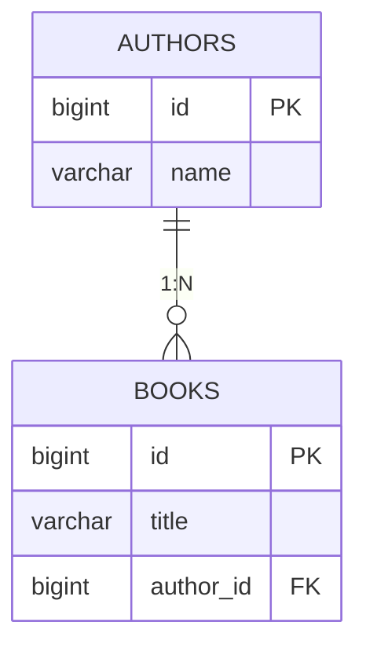
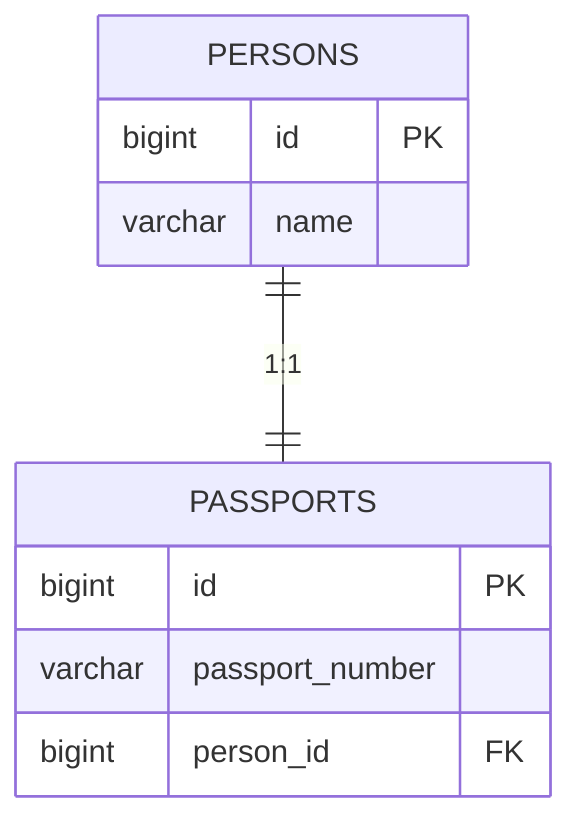
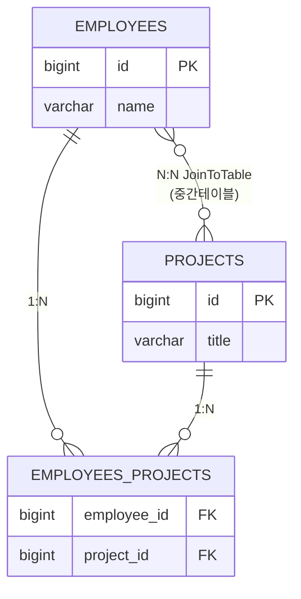

# [ 10주차 - 1024 ] 스터디 내용

```bash
    금일 커리큘럼
        ├ 09:00 ~ 14:00 backend 프로그래밍 (엔티티 매핑 - 연관 관계, @OneToMany, @OneToOne, @ManyToMany)
        └ 14:00 ~ 18:00 backend 프로그래밍 ()
```

## 1. 엔티티 매핑 - 연관 관계 

> OneToOne(1:1), ManyToOne(N:1), OneToMany(1:N), ManyToMany(N:N)

### Cascade와 orphanRemoval

> 부모엔티티에서 선언

- **Cascade** : 부모 엔티티의 상태 변화에 따라 자식 엔티티의 상태도 자동으로 변화시키는 기능
- **orphanRemoval** : 부모 엔티티와의 연관 관계가 끊어진 자식 엔티티를 자동으로 삭제하는 기능
    - `true` : 활성화
    - `false` : 비활성화

```java
// Parent Entity
@OneToMany(
    cascade = CascadeType.ALL, 
    orphanRemoval = true
)
private List<ChildEntity> childEntities = new ArrayList<>();
```

### CascadeType 종류

| 종류  | 설명 | 사용예시 |
|-------|-------|-------|
| ALL   | 모든 상태 변화 적용 | 게시글 삭제 시 댓글도 모두 삭제 |
| PERSIST | insert시 연관 엔티티 저장 | 주문 생성 시 주문상품도 함께 저장 |
| MERGE | update or merge시 연관 엔티티 병합 | 회원 정보 수정 시 주소도 함께 업데이트 |
| REMOVE | remove시 연관 엔티티 삭제 | 카테고리 삭제 시 하위 상품들도 삭제 |
| REFRESH | refresh시 연관 엔티티 새로고침 | 팀 새로고침 시 팀원 정보도 갱신 |
| DETACH | detach시 연관 엔티티 분리 | 부서 분리 시 소속 직원들도 영속성 컨텍스트에서 분리 |

### 실무에서 권장하는 Cascade 정의

- **1:1**: 생명주기가 같은 경우만 CASCADE.ALL
- **1:N**: CASCADE.PERSIST + orphanRemoval = true
- **N:1**: CASCADE.PERSIST만 사용
- **N:N**: CASCADE.PERSIST만 사용 (REMOVE 절대 금지)

### 피해야 할 부분
- N:1에서 CASCADE.REMOVE 사용 ❌
- N:N에서 CASCADE.REMOVE 사용 ❌
- 비즈니스 로직 없이 무분별한 CASCADE.ALL 사용 ❌

---

## 2. @OneToMany (ManyToOne) Cascade 동작

### 1:N / N:1 관계의 특징 (부모-자식간)

- **부모-자식 관계가 명확** - 1쪽이 부모, N쪽이 자식
- **자식 엔티티가 외래키를 가짐** - N쪽에서 1쪽을 참조
- **일반적으로 부모에서 자식으로의 Cascade 사용**
    - 예: 저자(Author) ←→ 책들(Book, FK)



**테이블 관계 설명:**
- `AUTHORS` → `BOOKS`: **1:N 관계**
- `BOOKS`가 `author_id` 외래키를 가짐 = 연관관계의 주인
- 부모(Author) 삭제 시 자식(Book) 처리 방안 필요


### 예시 1: Author → Book (1:N 단방향 Cascade)

```java
@Entity
@Table(name = "authors")
public class Author {
    @OneToMany(
        mappedBy = "author", // Book의 author 필드를 참조
        cascade = CascadeType.ALL,
        orphanRemoval = true // 부모와 연관관계가 끊어진 자식 자동 삭제
    )
    private List<Book> books = new ArrayList<>();
}

// 책 cascade 없을 때 ...
@Entity
@Table(name = "books")
public class Book {
    @ManyToOne
    @JoinColumn(name = "author_id") // 외래키를 가짐
    private Author author;
}
```

#### 동작 결과

- Author 저장 → 소속 Book들도 자동 저장 ✅
- Author 삭제 → 소속 Book들도 자동 삭제 ✅
- Book 저장 → Author는 저장되지 않음 ❌
- Book 삭제 → Author는 삭제되지 않음 ❌

### 예시 2: Book → Author (N:1 역방향 Cascade 추가)

```java
// Author는 그대로 !

// Book - CascadeType 적용
@Entity
@Table(name = "books")
public class Book {
    @ManyToOne(cascade = CascadeType.PERSIST) // 저장만 전파
    @JoinColumn(name = "author_id")
    private Author author;
}
```

#### 동작 결과

- Author 저장 → Book들도 자동 저장 ✅
- Book 저장 → Author도 자동 저장 ✅
- Author 삭제 → Book들도 자동 삭제 ✅
- Book 삭제 → Author는 삭제되지 않음 ❌ (REMOVE cascade 없음)

### 핵심 정리

- **Book**이 외래키(`author_id`)를 가지므로 연관관계의 주인
- **Author**는 `mappedBy`로 역방향 참조만 수행
- 실제 데이터베이스 외래키 관리는 Book이 담당

### orphanRemoval의 역할

- **1:N 관계에서만 사용 권장**
- 부모 엔티티의 컬렉션에서 자식을 제거하면 자식 엔티티도 DB에서 삭제
- `cascade = CascadeType.REMOVE`와 다른 개념

```java
// orphanRemoval 예시
Author author = authorRepository.findById(1L);
author.getBooks().remove(0); // 첫 번째 책을 리스트에서 제거
// → orphanRemoval = true면 해당 책이 DB에서도 삭제됨
```

#### 1:N, N:1 에서 권장 방식

- **1:N (부모 → 자식)**: CASCADE.ALL + orphanRemoval = true 일반적
- **N:1 (자식 → 부모)**: 없이 사용하거나, PERSIST 만 설정
- 자식에서 절대 REMOVE 설정하면 안됨!!

---

## 3. @OneToOne (1:1) Cascade 동작

### 1:1 관계의 특징

- OneToOne 양방향 관계에서는 해당 데이터를 누가 관리하는지가 중요
- 보통 외래키 없는 쪽에서 생명주기 관리를 위해 Cascade ALL 설정
    - 예: 사람(Person, All설정) ←→ 여권(Passport, FK)



**테이블 관계 설명:**
- `PERSONS` ↔ `PASSPORTS`: **1:1 관계**
- `PASSPORTS`가 `person_id` 외래키를 가짐 = 연관관계의 주인
- 한 사람은 하나의 여권만 가질 수 있음


### 예시 1: Person → Passport (단방향 cascade)

```java
@Entity
@Table(name = "persons")
public class Person {
    @OneToOne(
        mappedBy = "person", // 나는 FK 없다고 명시
        cascade = CascadeType.ALL
    )
    private Passport passport;
}

// 여권 cascade 없을 때 ...
@Entity
@Table(name = "passports")
public class Passport {
    @OneToOne
    @JoinColumn(name = "person_id")  // 외래키를 가짐
    private Person person;
}
```

#### 동작 결과

- Person 저장 → Passport도 자동 저장 ✅
- Person 삭제 → Passport도 자동 삭제 ✅
- Passport 저장 → Person은 저장되지 않음 ❌
- Passport 삭제 → Person은 삭제되지 않음 ❌

### 예시 2: Passport → Person (양방향 cascade)

```java
// Person은 그대로 !

// Passport - CascadeType 적용
@Entity
@Table(name = "passports")
public class Passport {

    @OneToOne(cascade = CascadeType.PERSIST) // 저장만 전파
    @JoinColumn(name = "person_id")
    private Person person;
}
```

#### 동작 결과

- Person 저장 → Passport도 자동 저장 ✅
- Passport 저장 → Person도 자동 저장 ✅
- Person 삭제 → Passport도 자동 삭제 ✅
- Passport 삭제 → Person은 삭제되지 않음 ❌ (REMOVE cascade 없음)

### 핵심 정리 

- **Person**은 `mappedBy` 사용 (외래키 없음)
- **Passport**가 외래키(`person_id`)를 가지므로 연관관계의 주인
- Cascade는 선언된 쪽에서만 작동하므로, 양방향 전파가 필요하면 양쪽 모두 설정

---

## 4. @ManyToMany (N:N) Cascade 동작


### N:N 관계의 특징

- **서로 외래키를 가지지 않음** - 중간 테이블이 외래키를 관리
- 중간 테이블을 통해 연관관계를 맺어야 함
- **연관관계의 주인 결정**이 중요 - 누가 중간 테이블을 관리할지?



**테이블 관계 설명:**

- `EMPLOYEES` ↔ `PROJECTS`: **N:N 관계** (서로 외래키 없음)
- `EMPLOYEES_PROJECTS`: **중간 테이블**이 양쪽 외래키를 관리
- 연관관계의 주인(`@JoinTable`)이 중간 테이블을 생성하고 관리

### 연관관계의 주인 결정 기준

1. **비즈니스 로직상 더 중요한 엔티티**
2. **더 자주 조회/수정되는 엔티티** 
3. **일반적 관례**: 알파벳 순서가 빠른 엔티티
   - Employee vs Project → Employee가 주인


### 예시 1: Employee → Project (단방향 cascade)

```java
@Entity
@Table(name = "employees")
public class Employee {
    @ManyToMany(cascade = CascadeType.PERSIST)
    // join 테이블 (중간 테이블) 설정
    @JoinTable( // 이 어노테이션이 있는 쪽이 연관관계의 주인
        name = "employees_projects",
        joinColumns = @JoinColumn(name = "employee_id"),
        inverseJoinColumns = @JoinColumn(name = "project_id")
    )
    private List<Project> projects = new ArrayList<>();
}

// 프로젝트 cascade 없을 때 ...
@Entity
@Table(name = "projects")
public class Project {
    // Employee의 projects 필드를 참조
    @ManyToMany(mappedBy = "projects")
    private List<Employee> employees = new ArrayList<>();
}
```

#### 동작 결과

- Employee 저장 → 연관된 Project도 자동 저장 ✅
- Employee 삭제 → Project는 삭제되지 않음 ❌ (REMOVE cascade 없음)
- Project 저장 → Employee는 저장되지 않음 ❌
- Project 삭제 → Employee는 삭제되지 않음 ❌

### 예시 2: Project → Employee (양방향 cascade)

```java
// Employee는 그대로 !

// Project - CascadeType 적용
@Entity
@Table(name = "projects")
public class Project {
    @ManyToMany(
        mappedBy = "projects", 
        cascade = CascadeType.PERSIST // 저장만 전파
    )
    private List<Employee> employees = new ArrayList<>();
}
```

#### 동작 결과

- Employee 저장 → Project도 자동 저장 ✅
- Project 저장 → Employee도 자동 저장 ✅
- Employee/Project 삭제 → 상대방은 삭제되지 않음 ❌

### 핵심 정리

- **Employee**가 `@JoinTable`을 사용하여 연관관계의 주인 결정됨
- **Project**는 `mappedBy`로 역방향 참조만 수행
- 중간 테이블(`employees_projects`) 관리는 한쪽만 담당 (Employee)

### Cascade 사용 시 주의사항

- **N:N에서 CASCADE.REMOVE는 매우 위험**
  - 예: 직원 1명 삭제 시 → 관련된 모든 프로젝트 삭제 가능
  - 예: 프로젝트 1개 삭제 시 → 참여한 모든 직원 삭제 가능
- **일반적으로 PERSIST만 사용**하여 저장 시에만 전파
- 삭제는 비즈니스 로직에서 별도 처리 권장

### 여기서  mappedBy의 역할

- 조인테이블 없는 쪽에 설정하여 중복으로 조인테이블 생성 방지
- 양방향 참조를 위한 역방향 매핑
- "Employee의 projects 필드를 통해 매핑된다"는 의미

---
