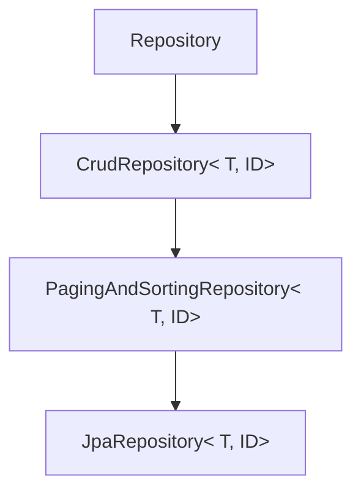

# [ 11주차 - 1027 ] 스터디 내용

```bash
    금일 커리큘럼
        ├ 09:00 ~ 12:00 backend 프로그래밍 (Spring Data JPA, JpaRepository)
        └ 13:00 ~ 18:00 backend 프로그래밍 (@Modifying, @Transactional, 페이징과 정렬)
```

## 1. Spring Data JPA

### Spring Data JPA의 핵심 개념

* **JPA** : 자바 객체와 관계형 데이터베이스 간의 매핑을 관리하는 표준 API
* **Spring Data JPA** : JPA를 더 쉽게 사용할 수 있도록 도와주는 스프링 프레임워크의 확장 라이브러리
* **Repository** : 데이터 접근 계층을 추상화한 인터페이스로, CRUD 작업을 쉽게 수행할 수 있도록 지원
* **Entity** : 데이터베이스 테이블과 매핑되는 자바 클래스
* **Query Methods** : 메서드 이름을 기반으로 자동으로 쿼리를 생성하는 기능
* **type-safe** : 컴파일 시점에 쿼리의 유효성을 검사하여 오류를 줄임

#### 기존 JPA와 Data JPA의 코드 차이

```java
// 기존 JPA - 엔티티 매니저를 직접 사용
public class examDAO {
    public User findUserById(Long id) {
        EntityManager em = JPAUtil.getEntityManagerFactory().createEntityManager();
        EntityTransaction tx = em.getTransaction();
        try {
            tx.begin();
            User user = em.find(User.class, id);
            tx.commit();
            return user;
        } catch (RuntimeException e) {
            if(tx.isActive()) tx.rollback();
            throw e;
        } finally {
            em.close();
        } 
    }
}
// Spring Data JPA - Repository 인터페이스 사용
public interface UserRepository extends JpaRepository<User, Long> {
    // 기본 CRUD 메서드가 자동으로 제공됨
    // pageable, sorting 등도 지원됨
    // 추가적인 쿼리 메서드도 정의 가능
}
```


---

## 2. JpaRepository 인터페이스
> Spring Data JPA에서 제공하는 기본적인 CRUD 기능을 갖춘 인터페이스

* **JpaRepository** : 가장 일반적인 리포지토리 인터페이스로, CRUD 및 페이징, 정렬 기능을 제공
    - CrudRepository 와 PagingAndSortingRepository를 상속받은 상태


### Repository 계층 구조



| 인터페이스 | 설명 | 용도 |
|------------|------|------|
| Repository | 최상위 인터페이스 | 공통 기능 정의 |
| CrudRepository | CRUD 기능 제공 | 기본적인 데이터 조작 |
| PagingAndSortingRepository | 페이징 및 정렬 기능 제공 | 대용량 데이터 처리 |
| JpaRepository | 더 나아간 JPA 특화 기능 제공<br>(flush, saveAndFlush, deleteInBatch) | JPA와의 통합 |


### 주요 메서드

* repo = JpaRepository<User, Long> 상속받은 인터페이스 객체일 때

| 메서드 | 설명 | 예시 |
|--------|------|------|
| save(S entity) | 엔티티 저장 또는 업데이트 | `repo.save(user);` |
| findById(ID id) | ID로 엔티티 조회 | `repo.findById(1L);` |
| findAll() | 모든 엔티티 조회 | `repo.findAll();` |
| count() | 엔티티 개수 조회 | `repo.count();` |
| existsById(ID id) | ID로 엔티티 존재 여부 확인 | `repo.existsById(1L);` |
| findAll(Pageable pageable) | 페이징된 엔티티 조회 | `repo.findAll(PageRequest.of(0, 10));` |
| findAll(Sort sort) | 정렬된 엔티티 조회 | `repo.findAll(Sort.by("name").ascending());` |
| deleteById(ID id) | ID로 엔티티 삭제 | `repo.deleteById(1L);` |
| delete(S entity) | 엔티티 삭제 | `repo.delete(user);` |
| deleteAll() | 전체 삭제 | `repo.deleteAll();` |


### 쿼리 메서드

* 메서드 이름을 기반으로 쿼리를 자동 생성
    - 예 : `findByNameAndAge(String name, int age)` -> name과 age로 조회


| 키워드 | 예시 | 구절문 |
|--------|------|--------|
| And (그리고) | findByNameAndAge | where name = ? and age = ? |
| Or (또는) | findByNameOrAge | where name = ? or age = ? |
| Between (사이) | findByAgeBetween | where age between ? and ? |
| LessThan (미만) | findByAgeLessThan | where age < ? |
| GreaterThan (초과) | findByAgeGreaterThan | where age > ? |
| Like (유사) | findByNameLike | where name like ? |
| OrderBy (정렬) | findByAgeOrderByNameAsc | order by name asc |
| Not (부정) | findByNameNot | where name <> ? |
| In (값 포함) | findByAgeIn | where age in (?,?,?) |
| Containing (키워드포함) | findByNameContaining | where name like %?% |
| true (참) | findByActiveTrue | where active = true |

```java
public interface UserRepository extends JpaRepository<User, Long> {
    // name과 age 모두 일치하는 사용자 조회
    List<User> findByNameAndAge(String name, int age);

    // name 또는 age가 일치하는 사용자 조회
    List<User> findByNameOrAge(String name, int age);

     // age가 start와 end 사이인 사용자 조회
    List<User> findByAgeBetween(int start, int end);
    
    // age가 지정 값보다 작은 사용자 조회
    List<User> findByAgeLessThan(int age);

    // age가 지정 값보다 큰 사용자 조회
    List<User> findByAgeGreaterThan(int age);

    // name이 keyword와 유사한 사용자 조회
    List<User> findByNameLike(String keyword);

    // age가 일치하는 사용자 중 name 오름차순 정렬
    List<User> findByAgeOrderByNameAsc(int age);

    // name이 지정 값과 다른 사용자 조회
    List<User> findByNameNot(String name);

    // age가 지정된 목록에 포함된 사용자 조회
    List<User> findByAgeIn(List<Integer> ages);

    // name에 keyword가 포함된 사용자 조회
    List<User> findByNameContaining(String keyword);

    // active가 true인 사용자 조회
    List<User> findByActiveTrue();
}
```

### @Query 커스텀 쿼리 

* `@Query` 어노테이션을 사용하여 직접 쿼리 작성 가능
* 안에 `FROM` 절에는 실제 테이블명이 아닌 엔티티 클래스명 사용
    - 컬럼명도 엔티티 필드명 사용
* 네이티브 SQL 사용 시 `nativeQuery=true` 옵션 추가 
    - mySQL 등 특정 DBMS 문법 사용 가능


```java
public interface UserRepository extends JpaRepository<User, Long> {
    // JPQL 사용
    @Query("SELECT u FROM User u WHERE u.name = :name")
    List<User> findUsersByName(@Param("name") String name);

    // 범위 집계
    @Query("SELECT COUNT(u) FROM User u WHERE u.age > :minAge AND u.age < :maxAge")
    long countUsersInAgeRange(@Param("minAge") int minAge, @Param("maxAge") int maxAge);

    // 네이티브 SQL 사용
    @Query(value = "SELECT * FROM users WHERE age > :age", nativeQuery = true)
    List<User> findUsersOlderThan(@Param("age") int age);

}
```

---

## 4. @Modifying, @Transactional

* `@Modifying` : `@Query`와 함께 사용하여 데이터 변경 작업(INSERT, UPDATE, DELETE)을 수행할 때 필요
    - 사용시 반환형은 `int` 또는 `void`로 설정
    - 반환형이 `int`인 경우, 영향받은 행(row) 수를 반환
    - 기본적으로 `@Modifying` 메서드는 트랜잭션 내에서 실행되어야 하므로, `@Transactional`과 함께 사용
* `@Transactional` : 메서드가 트랜잭션 내에서 실행되도록 보장
    - () 기본값은 `readOnly=false`로 설정되어 있어 데이터 변경 작업에 적합
    - 읽기 전용 트랜잭션이 필요한 경우 `@Transactional(readOnly=true)`로 설정 가능

```java
public interface UserRepository extends JpaRepository<User, Long> {
    // 이름으로 사용자 삭제
    @Modifying
    @Transactional
    @Query("DELETE FROM User u WHERE u.name = :name")
    int deleteUsersByName(@Param("name") String name);

    // 나이 증가
    @Modifying
    @Transactional
    @Query("UPDATE User u SET u.age = u.age + 1 WHERE u.age < :age")
    int incrementAgeForUsersYoungerThan(@Param("age") int age);
}
```

---

## 5. 페이징과 정렬

* `Pageable` 인터페이스 : 페이지 번호, 페이지 크기, 정렬 정보를 캡슐화
* `Page` 인터페이스 : 페이징된 결과를 나타내며, 총 페이지 수, 총 요소 수 등의 메타데이터 포함
* `Sort` 클래스 : 정렬 기준을 정의

```java

public interface UserRepository extends JpaRepository<User, Long> {
    // 나이로 페이징된 사용자 조회
    Page<User> findByAge(int age, Pageable pageable);

    // 이름으로 페이징된 및 검색된 사용자 조회 (페이징 + @Query)
    @Query("SELECT u FROM User u WHERE u.name LIKE %:keyword%")
    Page<User> searchUsersByName(@Param("keyword") String keyword, Pageable pageable);

    // 이름으로 정렬된 사용자 조회
    List<User> findAll(Sort sort);
}
```

```java
// 서비스 레이어에서의 사용 예시
public class UserService {
    @Autowired
    private UserRepository userRepository;

    public Page<User> getUsersByAgeWithPaging(int age, int page, int size) {
        // 페이지 번호는 0부터 시작 함에 유의
        // page : 페이지 번호, size : 한 페이지당 데이터 개수
        Pageable pageable = PageRequest.of(page, size, Sort.by("name").ascending());
        return userRepository.findByAge(age, pageable);
    }

    public Page<User> searchUsersByNameWithPaging(String keyword, int page, int size) {
        Pageable pageable = PageRequest.of(page, size, Sort.by("age").descending());
        return userRepository.searchUsersByName(keyword, pageable);
    }

    public List<User> getAllUsersSortedByName() {
        return userRepository.findAll(Sort.by("name").ascending());
    }
}
```
