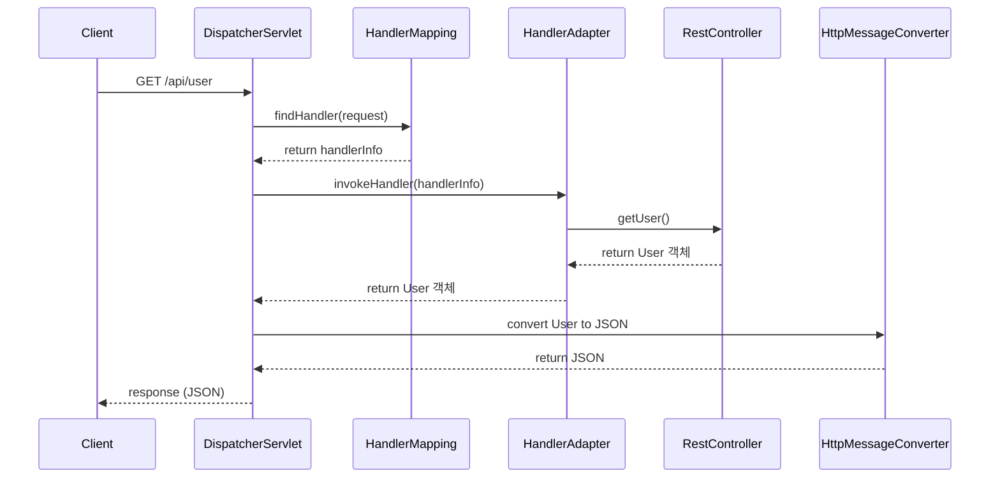
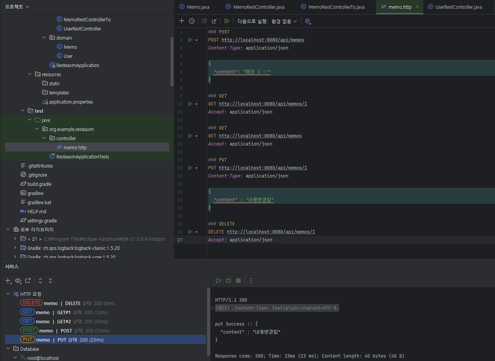
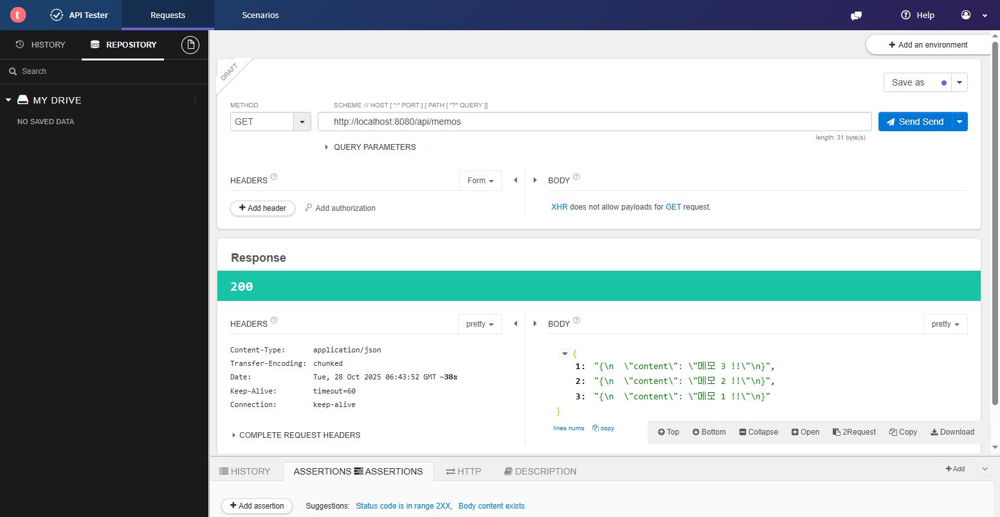

# [ 11주차 - 1028 ] 스터디 내용

```bash
    금일 커리큘럼
        ├ 09:00 ~ 14:00 backend 프로그래밍 (data JPA - repository 구현체, JPA Criteria API)
        └ 14:00 ~ 18:00 backend 프로그래밍 (Rest API - @RestController, RESTful 서비스, RESTful crud 간단 구현)
```

## 1. data JPA - repository 구현체

- JPA의 기본 제공 기능 외에, 커스터마이징한 구현체를 적용할 수 있음
- JpaRepository를 상속한 인터페이스에 사용자 정의 인터페이스와 구현체를 추가하여 확장 가능


### repository 구현체 적용 방법

```java
// 1. 커스텀 인터페이스 정의
public interface UserCustomRepository {
    List<User> usersFindByName(String name);
}

// 2. 커스텀 인터페이스 구현체 작성
@RequiredArgsConstructor
public class UserCustomRepositoryImpl implements UserCustomRepository {
    private final EntityManager em;

    @Override
    @Transactional(readOnly = true)
    public List<User> usersFindByName(String name) {
        // jpql 문
        String jpql = "SELECT u FROM User u WHERE u.name = :name";
        List<User> results = em.createQuery(jpql, User.class)
                        .setParameter("name", name)
                        .getResultList();
        return results;
    }
}

// 3. 커스텀 인터페이스와 구현체를 UserRepository에 통합
@Repository
public interface UserRepository extends JpaRepository<User, Long>, UserCustomRepository {
    // JpaRepository의 기본 CRUD 메서드와 
    // UserCustomRepository 상속 받은 구현체의 메서드 사용가능   
}
```
1. 커스텀 인터페이스 정의
    - 커스텀 구현을 위한 메서드 선언만 담당

2. 구현체 작성
    - 엔티티매니저를 주입하여 오버라이드한 메서드 내에서 로직 구현

3. 기존 Repository에 통합
    - 기본 CRUD + 커스텀 메서드 모두 사용 가능


#### 왜 구현체가 적용될까 ?

- 스프링 데이터 JPA는 빈으로 등록된 인터페이스가 다른 인터페이스 추가 상속하면
- 같은 패키지에 있는 구현체 자동으로 찾아서 연결해줌

#### 구현체 적용 설명

1. `UserRepository` 인터페이스가 빈으로 등록된 상태이고,
2. 커스텀 인터페이스(`UserCustomRepository`) 추가 상속되어 있음
3. 스프링이 추가상속한 인터페이스를 기준 구현체를 찾아서 자동으로 연결함

따라서, 기본 CRUD 기능과 커스텀 메서드 모두 동일한 Repository에서 사용할 수 있음

### 주의사항

- 구현체 클래스는 같은 패키지여야 하고 반드시 public 클래스여야 함
- 구현체 클래스명은 반드시 `인터페이스명 + Impl` 로 정의
- 생성자에 `EntityManager` 등 필요한 의존성 주입을 받아야 함

---

## 2. JPA Criteria API 

> 동적 쿼리를 타입 안전하게 생성할 수 있는 API

- JPQL과 달리, 컴파일 시점에 쿼리의 유효성을 검사할 수 있어 런타임 오류를 줄일 수 있음
- 쿼리를 자바 코드로 작성하므로, 복잡한 동적 쿼리 생성에 유리

### 관련 클래스

- `CriteriaBuilder` : 쿼리 생성의 시작점
- `CriteriaQuery` : 쿼리의 틀 (SELECT ... FROM ... WHERE ...)
- `Root` : FROM 절에 해당하는 엔티티 정의

### 기본 사용법

- Criteria API를 사용하여 쿼리 작성 후 EntityManager의 `createQuery` 메서드로 실행

```java
@RequiredArgsConstructor
public class UserCustomRepositoryImpl implements UserCustomRepository {
    private final EntityManager em;

    @Override
    public List<User> findUsersByName(String name) {
        // CriteriaBuilder : 쿼리 생성의 시작점
        CriteriaBuilder cb = em.getCriteriaBuilder();
        // CriteriaQuery : 쿼리의 틀 (SELECT ... FROM ... WHERE ...)
        CriteriaQuery<User> cq = cb.createQuery(User.class);
        // Root : FROM 절에 해당하는 엔티티 정의
        Root<User> user = cq.from(User.class);

        // SELECT u FROM user u WHERE u.name = name;
        cq.select(user).where(cb.like(user.get("name"), "%"+name+"%"));

        return em.createQuery(cq).getResultList();
    }
}
```

### 동적 쿼리 생성 방법

- 조건에 따라 WHERE 절의 조건을 동적으로 추가 가능
- `Predicate` 객체를 활용하여 조건을 구성하여 값에 따라 동적 쿼리가 생성됨

```java
@RequiredArgsConstructor
public class UserCustomRepositoryImpl implements UserCustomRepository {
    private final EntityManager em;

    @Override
    public List<User> findUsersCally(String name, String email) {
        CriteriaBuilder cb = em.getCriteriaBuilder();
        CriteriaQuery<User> cq = cb.createQuery(User.class);
        Root<User> user = cq.from(User.class);

        // Predicate : where 절에 들어가는 조건 객체
        List<Predicate> predicates = new ArrayList<>();
        // cb -> equal (=), like (LIKE %...%) ...
        if(name != null) predicates.add(cb.like(user.get("name"), "%" + name + "%"));
        if(email != null) predicates.add(cb.equal(user.get("email"), email));

        // 동적 쿼리 생성
        cq.select(user).where(
            cb.and( // or
                predicates.toArray(new Predicate[0])
            )
        );
        // name(x), email(x) 
        // -> SELECT u FROM user u;
        // name(O), email(x) 
        // -> SELECT u FROM user u WHERE u.name LIKE %name%;
        // name(X), email(O) 
        // -> SELECT u FROM user u WHERE u.email = email;
        // name(O), email(O) 
        // -> SELECT u FROM user u WHERE u.name LIKE %name% AND u.email = email;

        return em.createQuery(cq).getResultList();
    }
}
```

### CriteriaBuilder 메서드

| 연산자      | 메서드                           | 설명                       |
|------------|----------------------------------|----------------------------|
| =          | `cb.equal(x, y)`                 | 두 값이 같은지 비교        |
| <>, !=     | `cb.notEqual(x, y)`              | 두 값이 다른지 비교        |
| >          | `cb.greaterThan(x, y)`           | x > y (숫자, 날짜 가능)    |
| <          | `cb.lessThan(x, y)`              | x < y                      |
| >=         | `cb.greaterThanOrEqualTo(x, y)`  | x ≥ y                      |
| <=         | `cb.lessThanOrEqualTo(x, y)`     | x ≤ y                      |
| LIKE       | `cb.like(x, pattern)`            | 부분 문자열 검색           |
| NOT LIKE   | `cb.notLike(x, pattern)`         | 특정 문자열 제외           |
| IS NULL    | `cb.isNull(x)`                   | null 여부 확인             |
| IS NOT NULL| `cb.isNotNull(x)`                | null이 아닌 값             |
| IN         | `x.in(컬렉션)`                   | 여러 값 중 포함 여부       |
| NOT IN     | `cb.not(x.in(...))`              | 여러 값 중 제외            |
| BETWEEN    | `cb.between(x, y1, y2)`          | 구간 비교 (숫자/날짜)      |
| OR         | `cb.or(...)`                     | OR 조건 결합               |
| AND        | `cb.and(...)`                    | AND 조건 결합              |
| NOT        | `cb.not(predicate)`              | 조건의 부정                |


### 어떨때 Criteria API를 사용할까?

- 동적 쿼리가 많이 필요한 경우 (예: 검색 조건이 다양할 때)
- 타입 안전성이 중요한 경우 (컴파일 시점에 쿼리 오류를 방지하고자 할 때)

---

## 3. Rest API - @RestController

### @Controller vs @RestController

#### @Controller

- 전통적인 웹 애플리케이션의 컨트롤러 (**MVC 패턴**)
- **뷰(View)**를 반환하는 컨트롤러임
- 주로 HTML 페이지 렌더링에 사용
- 메서드에서 반환하는 값은 뷰 이름으로 해석됨

| 특징 | 설명 |
|------|------|
| 목적 | 뷰(View) 반환 |
| 사용처 | HTML 페이지 렌더링 |
| 데이터 전달 | 데이터를 Model 등 담아 뷰로 전달 |
| ModelAndView | Model 데이터와 View 이름 함께 반환 |


#### @RestController

- **RESTful** 웹 서비스를 위한 컨트롤러
- `@Controller`와 `@ResponseBody`가 결합된 어노테이션
- 메서드에서 반환하는 값은 HTTP 응답 본문에 직접 쓰여짐

| 특징 | 설명 |
|------|------|
| 목적 | 데이터 반환 (주로 JSON) |
| 사용처 | RESTful API |
| ResponseBody 적용 | 모든 메서드에 자동 적용 |
| HttpMessageConverter | 반환 값이 HTTP 응답 본문에 직접 쓰여짐 |
| 뷰 렌더링 | 없음 (순수 데이터) |

```java
// @Controller 사용시 return 값은 뷰 이름으로 해석됨
@Controller
public class MyController {
    @GetMapping("/hello")
    public String hello(Model model) {
        model.addAttribute("message", "Hello, World!");
        return "hello"; // 뷰 이름 반환 (hello.html)
    }
}

// @RestController 사용시 return 값은 HTTP 응답 본문에 직접 쓰여짐
@RestController
@RequestMapping("/api")
public class MyRestController {
    @GetMapping("/hello") // -> /api/hello
    public String hello() {
        // 응답 본문에 "Hello, World!" 문자열 반환
        return "Hello, World!";
    }
    @GetMapping("/user")
    public User getUser() {
        // 응답 본문에 User 객체 반환 (JSON 형식으로 변환됨)
        // 예: {"id":1,"name":"kim","email":"kim@example.com"}
        return new User(1L, "kim", "kim@example.com");
    }
}
```

### @RestController 동작 원리

* **클라이언트 요청 -> ... -> 응답 HTTP 메시지 변환**
    - `DispatcherServlet` : 모든 요청을 처리하는 중앙 서블릿
    - `HandlerMapping` : 요청 URL에 맞는 컨트롤러 메서드 찾기
    - `HandlerAdapter` : 컨트롤러 메서드 호출
    - `RestController` : 요청 처리 로직 수행
    - `HttpMessageConverter` : 반환된 객체를 HTTP 응답 본문으로 변환 (예: JSON)



---

## 4. RESTful 서비스

- **REST(Representational State Transfer)** 아키텍처 스타일을 따르는 웹 서비스
    - **REST** : 자원(Resource)을 URI로 표현하고, HTTP 메서드를 통해 자원에 대한 행위를 정의
- RESTful 서비스는 클라이언트와 서버 간의 통신에서 자원을 중심으로 설계됨


### REST 핵심 원칙

1. **자원(Resource) 식별기반**
    - 모든 콘텐츠는 **자원으로 표현**
    - 자원은 고유한 **URI**(Uniform Resource Identifier)로 식별
    - 예: `/users`, `/orders/123`

2. **무상태성(Statelessness)**
    - 각 **요청은 독립적**이어야 하며, 서버는 **클라이언트의 상태를 저장하지 않음**
    - 모든 필요한 정보는 요청에 포함되어야 함
    - 이를 통해 서버 설계를 단순화하고, 서비스의 확장성을 높여줌

3. **표준 HTTP 메서드 사용**
    - HTTP 메서드를 사용하여 자원에 대한 행위를 정의
    - HTTP 메서드 : GET, POST, PUT, DELETE, PATCH 등
    - API가 직관적이고 이해하기 쉬워짐

4. **표현(Representation)**
    - 자원은 다양한 형식으로 표현될 수 있음 (예: JSON, XML, HTML 등)
    - 클라이언트는 원하는 표현 형식을 요청할 수 있음 (Content Negotiation)

5. **연결성(Connectivity)**
    - 자원 간의 관계를 URI로 표현
    - 하이퍼미디어(HATEOAS) 원칙에 따라 자원은 관련 자원의 링크를 포함할 수 있음

### RESTful URL 설계 가이드라인

| http 메서드 | 요청처리 | 설명 | URL 예시 |
|--------------|------|------| ------|
| GET          | `@GetMapping` | 전체 자원 조회 | `/users` |
| GET          | `@GetMapping` | 특정 자원 조회 | `/users/{id}` |
| POST         | `@PostMapping` | 자원 생성 | `/users` |
| PUT          | `@PutMapping` | 자원 전체 수정 | `/users/{id}` |
| PATCH        | `@PatchMapping` | 자원 부분 수정 | `/users/{id}` |
| DELETE       | `@DeleteMapping` | 자원 삭제 | `/users/{id}` |


* **명사 사용** : 자원은 명사로 표현 (복수형) 
    - 예: `/users`, `/orders`
* **소문자와 하이픈 사용** : URL은 소문자와 하이픈(-)으로 구분
    - 예: `/user-profiles`
* **계층적 구조** : 자원의 관계를 계층적으로 표현 
    -예1: `/users/{id}/orders` (특정 사용자의 주문 목록)
    -예2: `/departments/{id}/employees` (특정 부서의 사원 목록)

### Spring MVC와 RESTful 서비스

- Spring MVC는 RESTful 웹 서비스를 쉽게 구현할 수 있는 프레임워크 제공함
- `@RestController` 어노테이션을 사용하여 RESTful API 엔드포인트를 정의
- `@GetMapping`, `@PostMapping` 등 HTTP 메서드에 매핑하는 어노테이션 활용

---


## 5. RESTful - crud 간단 구현

```java
import org.springframework.web.bind.annotation.*;

import java.util.HashMap;
import java.util.Map;
import java.util.concurrent.atomic.AtomicLong;

@RestController
@RequestMapping("/api/memos")
public class MemoRestController {
    private final Map<Long, String> memos = new HashMap<>();
    private final AtomicLong counter = new AtomicLong(); // 임시 memo id

    @PostMapping // 생성
    public Long CreateMemo(@RequestBody String content) {
        Long id = counter.incrementAndGet();
        memos.put(id, content);
        return id;
    }

    @GetMapping // 전체 조회
    public Map<Long, String> GetMemos() {
        return memos;
    }

    @GetMapping("/{id}") // 단건 조회
    public String GetMemo(@PathVariable("id") Long id) {
        return memos.get(id);
    }

    @PutMapping("/{id}") // 수정
    public String UpdateMemo(@PathVariable("id") Long id, @RequestBody String content) {
        if(memos.containsKey(id)) {
            memos.put(id, content);
            return "put Success :: " + memos.get(id);
        } else {
            return "put Error :: id={" + id + "}";
        }
    }

    @DeleteMapping("/{id}") // 삭제
    public String DeleteMemo(@PathVariable("id") Long id) {
        if(memos.containsKey(id)) {
            memos.remove(id);
            return "delete Success :: id={" + id +"}";
        } else {
            return "delete Error :: id={" + id + "}";
        }
    }
}
```

### http API 테스트

#### 인텔리제이에서 HTTP Client

- `.http` 파일을 만들어 다양한 HTTP 요청을 직접 작성
- RESTful API 테스트에 매우 편리


#### 요청 응답 처리 절차

```
### POST
POST http://localhost:8080/api/memos
Content-Type: application/json

{
  "content": "메모 1 !!"
}

### GET
GET http://localhost:8080/api/memos/1
Accept: application/json

### GET
GET http://localhost:8080/api/memos
Accept: application/json

### PUT
PUT http://localhost:8080/api/memos/1
Content-Type: application/json

{
  "content" : "내용변경함"
}

### DELETE
DELETE http://localhost:8080/api/memos/1
Accept: application/json
```

1. HTTP 메서드와 URL을 작성한다.
    - `POST http://localhost:8080/api/memos`
2. 필요한 요청 헤더를 추가한다.
    - `Content-Type`: 요청 본문 데이터 형식 지정 (POST, PUT)
    - `Accept`: 응답 데이터 형식 지정 (GET, DELETE)
3. 요청 본문(body)을 작성한다. (POST, PUT)
4. 실행 결과로 응답(JSON 등)을 확인한다.


#### 실행 결과
- 각 요청에 대해 서버가 JSON 등으로 응답하며, CRUD 동작을 직접 확인할 수 있음.
- 실제 결과는 아래와 같이 인텔리제이에서 바로 확인 가능  




### 그 외 API 테스트 도구

#### CURL 방식 (cmd)

* CURL(Client URL)은 명령줄에서 URL을 통해 데이터를 전송하는 도구

```bash
# 메모 생성 (POST)
curl -X POST http://localhost:8080/api/memos \
     -H "Content-Type: application/json" \
     -d '{"content": "메모 1 !!"}'

# 메모 단건 조회 (GET)
curl -X GET http://localhost:8080/api/memos/1 \
     -H "Accept: application/json"

# 전체 메모 목록 조회 (GET)
curl -X GET http://localhost:8080/api/memos \
     -H "Accept: application/json"

# 메모 수정 (PUT)
curl -X PUT http://localhost:8080/api/memos/1 \
     -H "Content-Type: application/json" \
     -d '{"content": "내용변경함"}'

# 메모 삭제 (DELETE)
curl -X DELETE http://localhost:8080/api/memos/1 \
     -H "Accept: application/json"

```

* 참고 : [인파 티스토리 - CURL 사용법](https://inpa.tistory.com/entry/LINUX-%F0%9F%93%9A-CURL-%EB%AA%85%EB%A0%B9%EC%96%B4-%EC%82%AC%EC%9A%A9%EB%B2%95-%EB%8B%A4%EC%96%91%ED%95%9C-%EC%98%88%EC%A0%9C%EB%A1%9C-%EC%A0%95%EB%A6%AC)


#### 포스트맨 (Postman)

* GUI 기반의 API 테스트 도구


(출처: 공식사이트)

* 공식 사이트 : [Postman](https://www.postman.com/)
* 참고 : [인파 티스토리 - POSTMAN 사용법](https://inpa.tistory.com/entry/POSTMAN-%F0%9F%92%BD-%ED%8F%AC%EC%8A%A4%ED%8A%B8%EB%A7%A8-%EC%82%AC%EC%9A%A9%EB%B2%95-API-%ED%85%8C%EC%8A%A4%ED%8A%B8-%EC%9E%90%EB%8F%99%ED%99%94-%EA%B3%A0%EA%B8%89-%ED%99%9C%EC%9A%A9%EA%B9%8C%EC%A7%80#)


### 크롬 확장프로그램 - Talend API Tester

* 크롬 브라우저에서 동작하는 API 테스트 도구



* 크롬 웹스토어 :[talend-api-tester](https://chrome.google.com/webstore/detail/talend-api-tester-free-ed/aejoelaoggembcahagimdiliamlcdmfm)
* 참고 : [벨로그 - Talend API Tester 사용법](https://velog.io/@hyunbeen0216/Talend-API-Tester-%EC%82%AC%EC%9A%A9%EA%B8%B0-REST-API-%ED%85%8C%EC%8A%A4%ED%8A%B8-%EC%9B%B9%ED%88%B4)