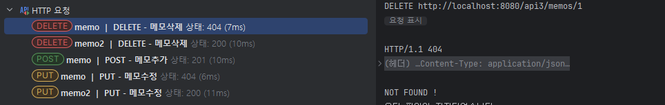
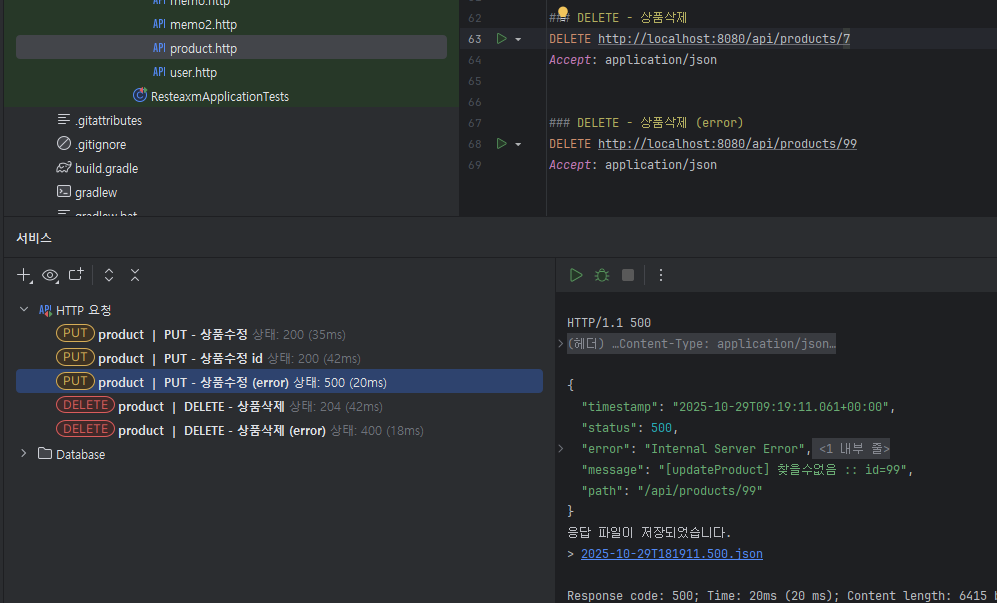

# [ 11주차 - 1029 ] 스터디 내용

```bash
    금일 커리큘럼
        ├ 09:00 ~ 14:00 backend 프로그래밍 (이전 내용 복습, ResponseEntity)
        └ 14:00 ~ 18:00 backend 프로그래밍 (http 상태 코드, 예외처리 등 실습)
```

## 1. ResponseEntity

> HTTP 응답 본문(body), 헤더(headers), 상태 코드(status code)를 포함하는 클래스

* HTTP 요청을 받고서 응답 본문 보낼 때 값이 없다고 보내도 200 OK 상태 코드를 보내는 경우가 있다.
* 이럴 때 ResponseEntity를 사용하면 상태 코드를 명시적으로 지정할 수 있다.

### 예시 코드

```java
// 단순히 응답본문만 비어서 보내는 경우
@RestController
@RequestMapping("/api2/memos")
public class MemoController2 {
    // prev code ...
    @DeleteMapping("/{id}")
    public String deleteMemo(@PathVariable("id") Long id) {
        if(memos.containsKey(id)) {
            memos.remove(id);
            return "삭제성공";
        } else {
            return null; // null로 보내도 200 상태코드임!
        }
    }
}
// ResponseEntity를 사용하여 상태 코드 명시

@RestController
@RequestMapping("/api3/memos")
public class MemoController3 {
    // prev code ...
    @DeleteMapping("/{id}")
    public ResponseEntity<String> deleteMemo(@PathVariable("id") Long id) {
        if(memos.containsKey(id)) {
            memos.remove(id);
            return ResponseEntity.status(HttpStatus.CREATED).body("삭제성공");
        } else {
            // status 로 404 지정해서 보냄
            return ResponseEntity.status(404).body("NOT FOUND !");
            
        }
    }
}
```




### responseEntity 빌더 메서드

- `ok()`: 200 OK 상태 코드를 설정
- `created(URI location)`: 201 Created 상태 코드를 설정하고, 리소스의 위치를 나타내는 URI를 지정
- `noContent()`: 204 No Content 상태 코드를 설정
- `badRequest()`: 400 Bad Request 상태 코드를 설정
- `notFound()`: 404 Not Found 상태 코드를 설정
- `status(HttpStatus status)`: 지정된 HTTP 상태 코드를 설정
- `body(T body)`: 응답 본문을 설정
- `header(String name, String value)`: 특정 헤더를 설정
- `build()`: 앞에 설정된 상태 코드와 헤더를 기반으로 생성 (응답 본문 없음)


### http 상태 코드 주요 의미

| 상태 코드 | 의미 |
|-----------|------|
| 200       | 요청이 성공적으로 처리됨 |
| 201       | 리소스가 성공적으로 생성됨 |
| 204       | 요청이 성공적으로 처리되었으나, 응답 본문이 없음 |
| 400       | 잘못된 요청 (클라이언트 오류) |
| 401       | 인증 필요 (클라이언트 오류) |
| 404       | 요청한 리소스를 찾을 수 없음 (클라이언트 오류) |
| 500       | 서버 내부 오류 (서버 오류) |


```java
// 컨트롤 내 메서드 responseEntity 사용 예시
@DeleteMapping(value = "/{id}")
public ResponseEntity<?> delete(@PathVariable("id") Long id) {
    try {
        prodService.deleteProductById(id);
        return  ResponseEntity.noContent().build(); // 204
    } catch (EntityNotFoundException e) { // 서비스에서 삭제실패시 예외 던짐
        return ResponseEntity.status(HttpStatus.BAD_REQUEST).body(e.getMessage()); // 400
    }
}

// 기본 사용법
ResponseEntity<타입> // 타입: 객체, String, ? 등

// 서비스에서 예외 처리 시
ResponseEntity.ok(서비스.메서드()) // 성공 200, 실패 : 400, 404, 500 등 

// 서비스에서 예외처리 안한 경우 - 빌더 메서드 직접 사용
ResponseEntity.ok(데이터)                // 200 OK
ResponseEntity.created(URI).body(데이터) // 201 Created
ResponseEntity.noContent().build()      // 204 No Content | 응답본문 x
ResponseEntity.badRequest().body(메시지) // 400 Bad Request
ResponseEntity.notFound().build()       // 404 Not Found | 응답본문 x
ResponseEntity.status(500).body(메시지) // 500 Internal Server Error

// status httpStatus 사용법 (http네임값을 대문자로 작성)
status(HttpStatus.OK) // 200 OK
status(HttpStatus.CREATED) // 201 Created
status(HttpStatus.BAD_REQUEST) // 400 Bad Request
status(HttpStatus.NOT_FOUND)   // 404 Not Found ....
```


---


## 2. 정리 및 실습


### 학습 정리

- ResponseEntity를 사용하여 HTTP 응답의 상태 코드, 헤더, 본문을 명시적으로 설정 가능함
- 주요 빌더 메서드를 활용하여 다양한 상태 코드를 설정하고, 응답 본문과 헤더를 구성할 수 있음

### 실습 product Enttity로 CRUD API 구현

```bash
src/main/java/
└── org/example/restexam2/
    ├── controller/
    │   └── ProductController.java
    │ 
    ├── domain/
    │   └── Product.java
    │ 
    ├── repository/
    │   └── ProductRepository.java
    │ 
    ├── service/
    │   └── ProductService.java
    │
    └── Application.java
```

#### domain package

<details>
<summary><strong>Product.java</strong></summary>

```java
package org.example.resteaxm2.domain;

import jakarta.persistence.Column;
import jakarta.persistence.Entity;
import jakarta.persistence.GeneratedValue;
import jakarta.persistence.GenerationType;
import jakarta.persistence.Id;
import jakarta.persistence.Table;
import lombok.AllArgsConstructor;
import lombok.Getter;
import lombok.NoArgsConstructor;
import lombok.Setter;
import lombok.ToString;

@Entity
@Getter
@Setter
@ToString
@NoArgsConstructor
@AllArgsConstructor
@Table(name = "rest_products")
public class Product {
    @Id
    @GeneratedValue(strategy = GenerationType.IDENTITY)
    private Long id;
    @Column(unique = true, nullable = false)
    private String name;
    @Column(nullable = false)
    private Integer price; // int -> 인티저로 변경 null 예외처리

    public Product(String name, Integer price) {
        this.name = name;
        this.price = price;
    }
}
```

</details>


#### repository package

<details>
<summary><strong>ProductService.java</strong></summary>

```java
package org.example.resteaxm2.repository;

import org.example.resteaxm2.domain.Product;
import org.springframework.data.jpa.repository.JpaRepository;
import org.springframework.stereotype.Repository;

import java.util.Optional;

@Repository
public interface ProductRepository extends JpaRepository<Product,Long> {
    Optional<Product> findByName(String name);

}
```

</details>


#### service package

<details>
<summary><strong>ProductService.java</strong></summary>

```java
package org.example.resteaxm2.service;

import jakarta.persistence.EntityNotFoundException;
import lombok.RequiredArgsConstructor;
import org.example.resteaxm2.domain.Product;
import org.example.resteaxm2.domain.User;
import org.example.resteaxm2.repository.ProductRepository;
import org.springframework.stereotype.Service;
import org.springframework.transaction.annotation.Transactional;
import org.springframework.web.bind.annotation.DeleteMapping;
import org.springframework.web.bind.annotation.GetMapping;
import org.springframework.web.bind.annotation.PostMapping;
import org.springframework.web.bind.annotation.PutMapping;
import org.springframework.web.bind.annotation.RequestBody;

import java.util.List;

@Service
@RequiredArgsConstructor
@Transactional
public class ProductService {
    private final ProductRepository prodRepo;

    /** 유니크값(name) 예외처리 별도 */
    public void nameEqualsThrow(String name) {
        String caller = Thread.currentThread().getStackTrace()[2].getMethodName();
        if (prodRepo.findByName(name).isPresent()) {
            throw new IllegalArgumentException("[" + caller + "] 존재하는 상품 :: " + name);
        }
    }

    @GetMapping
    @Transactional(readOnly = true)
    public List<Product> getProducts() {
        return prodRepo.findAll();
    }

    @GetMapping
    public Product getProductById(Long id) {
        return prodRepo.findById(id).orElseThrow(
                () -> new IllegalArgumentException("[getProductById] 찾을수없음 :: id=" + id)
        );
    }
    
    @PostMapping
    public Product saveProduct(@RequestBody Product product) {
        nameEqualsThrow(product.getName()); // 상품명 중복 확인 예외처리
        try {
            return prodRepo.save(product);
        } catch (Exception e) {
            throw new IllegalArgumentException("[saveProduct] 값 오류 :: " + product + "\n" + e.getMessage());
        }
    }

    @PutMapping
    public Product updateProduct(@RequestBody Product product) {
        if (product.getId() == null) {
            throw new NullPointerException("수정할 상품 id 입력값 필수 입니다.");
        }
        Long id = product.getId();
        Product productData = prodRepo.findById(id).orElseThrow(
                () -> new IllegalArgumentException("[updateProduct] 찾을수없음 :: id=" + id)
        );
        if (product.getName() != null) {
            nameEqualsThrow(product.getName()); // 상품명 중복 확인 예외처리
            productData.setName(product.getName());
        }
        productData.setPrice(product.getPrice());

        return productData;
    }

    @DeleteMapping
    public void deleteProductById(Long id) {
        Product product = prodRepo.findById(id)
                .orElseThrow(() -> new EntityNotFoundException("[deleteProductById] 존재하지 않는 ID: " + id));
        prodRepo.delete(product);
    }
}

```

</details>


#### controller package

<details>
<summary><strong>ProductController.java</strong></summary>

```java
package org.example.resteaxm2.controller;

import jakarta.persistence.EntityNotFoundException;
import lombok.RequiredArgsConstructor;
import org.example.resteaxm2.domain.Product;
import org.example.resteaxm2.repository.ProductRepository;
import org.example.resteaxm2.service.ProductService;
import org.springframework.http.HttpStatus;
import org.springframework.http.ResponseEntity;
import org.springframework.web.bind.annotation.DeleteMapping;
import org.springframework.web.bind.annotation.GetMapping;
import org.springframework.web.bind.annotation.PathVariable;
import org.springframework.web.bind.annotation.PostMapping;
import org.springframework.web.bind.annotation.PutMapping;
import org.springframework.web.bind.annotation.RequestBody;
import org.springframework.web.bind.annotation.RequestMapping;
import org.springframework.web.bind.annotation.RestController;

import java.util.List;

@RestController
@RequiredArgsConstructor
@RequestMapping("/api/products")
public class ProductController {
    private final ProductService prodService;

    @GetMapping(produces = "application/json")
    public ResponseEntity<List<Product>> findAll() {
        return ResponseEntity.ok(prodService.getProducts());
    }

    @GetMapping(value = "/{id}", produces = "application/json")
    public ResponseEntity<Product> findById(@PathVariable("id") Long id) {
        return ResponseEntity.ok(prodService.getProductById(id));
    }

    @PostMapping(produces = "application/json")
    public ResponseEntity<Product> create(@RequestBody Product product) {
        return ResponseEntity.ok(prodService.saveProduct(product));
    }

    @PutMapping(produces = "application/json")
    public ResponseEntity<Product> update(@RequestBody Product product) {
        return ResponseEntity.ok(prodService.updateProduct(product));
    }

    @PutMapping(value = "/{id}", produces = "application/json")
    public ResponseEntity<Product> updateById(@PathVariable("id") Long id, @RequestBody Product product) {
        product.setId(id);
        return ResponseEntity.ok(prodService.updateProduct(product));
    }

    @DeleteMapping(value = "/{id}")
    public ResponseEntity<?> delete(@PathVariable("id") Long id) {
        try {
            prodService.deleteProductById(id);
            return  ResponseEntity.noContent().build(); // 204
        } catch (EntityNotFoundException e) {
            return ResponseEntity.status(HttpStatus.BAD_REQUEST).body(e.getMessage()); // 400
        }
    }
}
```

</details>


#### Application

```java
package org.example.resteaxm2;

import org.springframework.boot.SpringApplication;
import org.springframework.boot.autoconfigure.SpringBootApplication;

@SpringBootApplication
public class Application {
    public static void main(String[] args) {
        SpringApplication.run(Application.class, args);
    }
}
```


#### test http 요청 테스트 및 결과

```http
### GET - 전체조회
GET http://localhost:8080/api/products
Accept: application/json


### POST - 상품추가
POST http://localhost:8080/api/products
Content-Type: application/json

{
  "name": "화장품",
  "price": 50000
}


### POST - 상품추가 (error)
POST http://localhost:8080/api/products
Content-Type: application/json

{
  "name": "화장품",
  "price": 1
}


### GET - 단건조회
GET http://localhost:8080/api/products/7
Accept: application/json


### GET - 단건조회 (error)
GET http://localhost:8080/api/products/99
Accept: application/json


### PUT - 상품수정
PUT http://localhost:8080/api/products
Content-Type: application/json

{
  "id": 7,
  "name" : "화장품99",
  "price" : 5000
}

### PUT - 상품수정 id
PUT http://localhost:8080/api/products/7
Content-Type: application/json

{
  "name" : "화장품7",
  "price" : 15000
}


### PUT - 상품수정 (error)
PUT http://localhost:8080/api/products/99
Content-Type: application/json

{
  "name" : "변경테스트id",
  "price" : 5000
}


### DELETE - 상품삭제
DELETE http://localhost:8080/api/products/7
Accept: application/json


### DELETE - 상품삭제 (error)
DELETE http://localhost:8080/api/products/99
Accept: application/json
```

