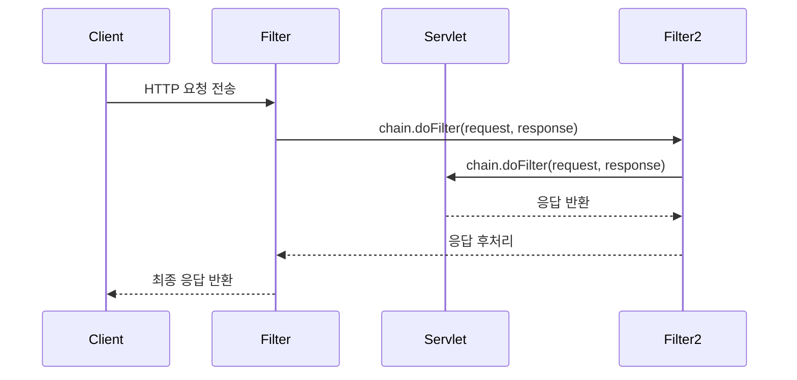

# [ 12주차 - 1103 ] 스터디 내용

```bash
    금일 커리큘럼
        ├ 09:00 ~ 14:00 backend 프로그래밍 (Spring AOP, Spring AOP 주요 어노테이션)
        └ 14:00 ~ 18:00 backend 프로그래밍 (Spring AOP Aspect 활용)
```

## AAAAAAAAAA1. Spring AOP

### AOP 란?

- **AOP**(Aspect Oriented Programming) : 관점 지향 프로그래밍
- OOP를 보완하기 위한 프로그래밍 패러다임이다.


### AOP 핵심 가치

1. **관심사의 분리** (Separation of Concerns)
   - 핵심 비즈니스 로직과 부가적인 기능(로깅, 보안 등)을 분리하여 코드의 가독성과 유지보수성을 향상시킨다.

2. **횡단 관심사** (Cross-Cutting Concerns)
    - 여러 모듈에 걸쳐 공통적으로 적용되는 기능들을 의미한다.

3. **모듈화** (Modularity)
    - 흩어진 관심사를 하나의 모듈로 관리하여 코드의 재사용성을 높인다.


### AOP 핵심관심과 횡단관심

- **핵심 관심** : 애플리케이션의 주요 기능과 비즈니스 로직을 담당하는 부분
- **횡단 관심** : 로깅, 보안, 트랜잭션 관리 등 여러 모듈에 걸쳐 공통적으로 적용되는 기능


#### 예시

- 핵심 관심 : 계좌이체, 입출금, 이자계산
- 횡단 관심 :
    - 로깅 -> 계좌이체, 입출금, 이자계산
    - 보안 -> 계좌이체, 입출금, 이자계산
    - 트랜잭션 -> 계좌이체, 입출금, 이자계산


```bash
               핵심관심↓
            ┌───────────┬───────────┬───────────┐
횡단관심↓    │ 계좌이체   │  입출금    │ 이자계산  │
┌───────────┼───────────┼───────────┼───────────┤
│ 로깅      │           │           │           │
├───────────┼───────────┼───────────┼───────────┤
│ 보안      │           │           │           │
├───────────┼───────────┼───────────┼───────────┤
│ 트랜잭션   │           │           │           │
└───────────┴───────────┴───────────┴───────────┘
```

### AOP 핵심 용어


| 용어      | 설명                                         | 예시              |
|-----------|---------------------------------------------|-------------------|
| **Aspect**    | Advice와 Pointcut을 합친 횡단 관심사 모듈   | **@Aspect** 클래스    |
| **Advice**    | 횡단 관심사 실제 구현 코드                   | 로깅, 트랜잭션    |
| **JoinPoint** | Advice가 적용될 수 있는 지점                 | 메서드 실행 시점  |
| **Pointcut**  | Advice 적용 지점 규칙                        | execution 표현식  |
| **Target**    | Advice가 적용되는 대상 객체                  | Service 클래스    |
| **Weaving**   | Aspect를 대상에 연결해 Proxy 생성하는 과정   | 컴파일/런타임     |


#### AOP 핵심 용어 이해

* **Aspect** : 보안 시스템
* **Advice*** : 보안 검사 절차 (로직)
* **JoinPoint** : 건물 출입구
* **Pointcut** : 보안검사가 필요한 출입구
* **Target** : 보호해야 할 자산 (서버, 데이터베이스)
* **Weaving** : 보안 시스템 설치 과정


###  AOP 용어 연관관계 흐름

**advice + pointcut = aspect**

* → 실제 실행할 코드(advice)와 어디에 적용할지(pointcut)를 합치면<br>하나의 Aspect(횡단 관심사 모듈)가 됨
* 예: 보안 검사 로직 + 검사할 출입구 = 보안 시스템


**aspect + target = proxy (Spring AOP)**

* → Aspect를 실제 적용할 대상(target)에 연결하면<br>Proxy(대리 객체)가 만들어짐
* 예: 보안 시스템을 건물에 설치하면, 건물의 출입구마다<br>보안 검사가 동작하는 대리 시스템이 생김

**weaving**

* → Aspect와 Target을 연결해 Proxy를 만드는 과정
* 예: 보안 시스템을 건물에 설치하는 작업

**joinpoint → pointcut → advice**

* → Advice는 Pointcut이 지정한 JoinPoint(적용 가능한 모든 지점)에만 실행됨
* 예: 건물의 모든 출입구(JoinPoint) 중, 보안 검사가 필요한 출입구(Pointcut)에서만<br>실제 검사 로직(Advice)이 실행됨

---


## 2. Spring AOP 주요 어노테이션

### Advice 유형

| 유형 | 실행시점 | 적용케이스 | 특징 |
|------|----------|------------|------|
| **@Before** | 메서드 실행 전 | 사전 검증, 로깅 | 메서드 실행 전에 실행 |
| **@After** | 메서드 실행 후 | 정리 작업, 로깅 | 메서드 실행 후에 실행 (성공/실패 상관없음) |
| **@AfterReturning** | 메서드 정상 종료 후 | 결과 처리, 캐싱 | 메서드가 정상적으로 종료된 후에 실행 |
| **@AfterThrowing** | 메서드 예외 발생 시 | 예외 처리, 알림 | 메서드 실행 중 예외가 발생했을 때 실행 |
| **@Around** | 메서드 실행 전후 | 트랜잭션 관리, 성능 측정 | 메서드 실행 전후에 모두 실행 가능 |


### @Before, @After 예제 코드

- `@Before` : 메서드 실행 전 호출 (사전 검증)
- `@After`: 메서드 실행 후 호출 (사후 작업)
- JoinPoint : 포인트컷으로 지정된 정보 제공 받음

```java
// AOP 설정 ------------------
@Aspect // advice + pointcut 결합표현 (횡단 관심)
@Component
public class LoggerAspect {

    //SimpleService의 모든 메서드가 실행되기 전에 logging()이 실행되도록 지정
    @Before("execution(* org.example.aopexam.exam.SimpleService.*(..))") // pointcut
    public void logging() {
        System.out.println("[logging] log를 남깁니다.."); // advice
    }

    // Service가 포함된 모든 클래스의 모든 메서드를 Pointcut으로 지정
    @Pointcut("execution(* org.example.aopexam.exam.*Service.*(..))")
    public void joinTest() {}

    @Before("joinTest()")
    public void joinBefore(JoinPoint jp) {
        // JoinPoint ? Advice가 적용되는 실제 지점의 정보(메서드명, 인자 등)를 제공받음
        System.out.println("[JoinPoint] before 메서드명: " + jp.getSignature().getName());
    }

    @After("joinTest()")
    public void joinAfter(JoinPoint jp) {
        System.out.println("[JoinPoint] after 메서드명: " + jp.getSignature().getName());
    }
}

// 서비스 클래스 ------------------
@Service
public class SimpleService {
    public void doSomething() {
        System.out.println("비즈니스 로직 실행!");
    }
}


// 앱 실행 ------------------
@SpringBootApplication
public class AopApplication {
    public static void main(String[] args) {
        SpringApplication.run(AopApplication.class, args);
    }
    @Bean
    CommandLineRunner commandLineRunner(
            SimpleService service,
    ) {
        return args -> {
            service.doSomething();
        };
    }
}
```

```bash
# 실행 결과
[logging] log를 남깁니다..   # <- 서비스 내 메서드 실행전 @Before
[JoinPoint] before 메서드명: doSomething # <- joinPoint로 지정된부분 실행전 @Before
비즈니스 로직 실행!
[JoinPoint] after 메서드명: doSomething # <- joinPoint로 지정된부분 실행후 @After
```


### @AfterReturning, @AfterThrowing, @Around 예제 코드

- `@AfterReturning` : 메서드 실행 후 결과 처리
- `@AfterThrowing` : 메서드 실행 후 예외 발생시 처리
- `@Around` : 메서드 실행 전후 처리 (트랜잭션 관리 및 성능측정 용)

```java
// AOP 설정 ------------------
@Aspect
@Component
public class LoggerAspect {
    @Pointcut("execution(* org.example.aopexam.exam.*Service.*(..))")
    public void joinTest() {}

    @AfterReturning(pointcut = "joinTest()", returning = "result") // 반환값을 result로 받음
    public void logAfterReturning(JoinPoint jp, Object result) {
        System.out.println("[AfterReturning] 메서드명: " + jp.getSignature().getName()
            + ", 반환값: " + result);
    }

    @AfterThrowing(pointcut = "joinTest()", throwing = "ex") // 예외를 ex로 받음
    public void logAfterThrowing(JoinPoint jp, Exception ex) {
        System.out.println(
            "[AfterThrowing] 메서드명: " + jp.getSignature().getName()
            + "\n[AfterThrowing] 예외 메세지: " + ex.getMessage()
        );
    }

    @Around("joinTest()")
    public Object logAround(ProceedingJoinPoint pjp) throws Throwable {
        System.out.println("[Around] 메서드명: " + pjp.getSignature().getName() + " - 시작");
        Object result = pjp.proceed(); // 실제 메서드 호출
        String str = (String) result;
        System.out.println("[Around] 메서드명: " + pjp.getSignature().getName() + " - 종료");
        return "Around 처리된 반환 - " + str;
    }
}

// 서비스 클래스 ------------------
@Service
public class SimpleService {
    public String doSomething() {
        System.out.println("비즈니스 로직 실행!");
        return "결과값";
    }

    public void doSomethingError() {
        System.out.println("비즈니스 로직 실행 중 에러 발생!");
        throw new RuntimeException("예외 발생!");
    }
}

// 앱 실행 ------------------
@SpringBootApplication
public class AopApplication {
    public static void main(String[] args) {
        SpringApplication.run(AopApplication.class, args);
    }
    @Bean
    CommandLineRunner commandLineRunner(
            SimpleService service,
    ) {
        return args -> {
            String str = service.doSomething();
            System.out.println(str);
            try {
                service.doSomethingError();
            } catch (Exception e) {
                System.out.println(e.getMessage());
            }
        };
    }
}
```

```bash
# 실행 결과
[Around] 메서드명: doSomething - 시작
비즈니스 로직 실행!
[Around] 메서드명: doSomething - 종료
[AfterReturning] 메서드명: doSomething, 반환값: 결과값
[Around] 처리된 반환 - 결과값
# Around(before) → 서비스실행(target) → Around(after)
# → AfterReturning → Around return 순으로 됨

[Around] 메서드명: doSomethingError - 시작
비즈니스 로직 실행 중 에러 발생!
[Around] 메서드명: doSomethingError - 종료
[AfterThrowing] 메서드명: doSomethingError
[AfterThrowing] 예외 메세지: 예외 발생!
예외 발생! # catch의 e.getMessage() 출력
# Around(before) → 서비스실행(target) → Around(after)
# → AfterThrowing → catch block
```

#### 실행결과 요약

- `@Around`가 항상 메서드 실행 전/후 로그를 남김
- 정상 반환 시 `@AfterReturning`이 실행되어 반환값 로그 출력
- 예외 발생 시 `@AfterThrowing`이 실행되어 예외 로그 출력
- 마지막 줄은 try-catch에서 예외 메시지 출력


#### joinPoint와 ProceedingJoinPoint 차이

| 항목         | JoinPoint                                              | ProceedingJoinPoint                                 |
|--------------|-------------------------------------------------------|-----------------------------------------------------|
| 설명         | AOP가 적용된 지점 정보(메서드, 파라미터 등)            | JoinPoint + 원본 메서드를 직접 실행할 수 있음 (`proceed()`) |
| 사용 위치    | `@Before`, `@After`, `@AfterReturning`, `@AfterThrowing` | 오직 `@Around` 에서만 사용                          |
| 주 기능      | 대상 메서드 정보 조회                                  | 대상 메서드 실행 제어                                |
| 메서드 호출  | 불가능                                                | `proceed()`로 메서드 실행 가능                       |

---

## 3. Spring AOP - Aspect 활용

### 커스텀 어노테이션 기반 Aspect

* 특정 기능을 수행하는 커스텀 어노테이션을 정의하고, 해당 어노테이션이 붙은 메서드에 AOP를 적용하는 방식
* AOP 필요한 부분에 직접 어노테이션을 붙여서 관리 가능하다.

```java
// 어노테이션 AOP 설정 ------------------
@Target(ElementType.METHOD) // 메서드에 적용 가능
@Retention(RetentionPolicy.RUNTIME) // 런타임 시점까지 유지
@interface TrackTime { }

// AOP 설정 ------------------
@Aspect
@Component
public class PerformanceAspect {

    // 해당 패키지 내 @TrackTime 어노테이션이 붙은 메서드 대상 지정
    @Around("@annotation(org.example.aopexam.exam.TrackTime)")
    public Object around(ProceedingJoinPoint pjp) throws Throwable {
        long startTime =  System.currentTimeMillis();
        try {
            Object result = pjp.proceed();
            return result;
        } finally {
            long endTime =  System.currentTimeMillis();
            System.out.println("[around] 대상클래스명: " + pjp.getTarget().getClass().getSimpleName());
            System.out.println("[around] 대상메서드명: " + pjp.getSignature().getName());
            System.out.println("[around] - 걸린시간: " + (endTime - startTime) + " ms");
        }
    }
}

// 서비스 클래스 ------------------
@Service
public class CustomService {
    @TrackTime
    public void customTrack() {
        System.out.println("customTrack - start");
        try {
            System.out.println("슬립시간 1000ms 실행");
            Thread.sleep(1000);
        } catch (InterruptedException e) {
            System.out.println(e.getMessage());
        }
        System.out.println("customTrack - end");
    }
}

// 앱 실행 ------------------
@SpringBootApplication
public class AopApplication {
    public static void main(String[] args) {
        SpringApplication.run(AopApplication.class, args);
    }
    @Bean
    CommandLineRunner commandLineRunner(
            CustomService service,
    ) {
        return args -> {
            service.customTrack();
        };
    }
}
```

```bash
# 실행 결과
customTrack - start
슬립시간 1000ms 실행
customTrack - end
[around] 대상클래스명: CustomService
[around] 대상메서드명: customTrack
[around] - 걸린시간: 1009 ms
```


### 로깅 Aspect

* Logger Aspect를 만들어서 특정 패키지 내 모든 서비스 메서드 실행 전후에 로그를 남기는 방식

```java
// AOP 설정 ------------------
@Aspect
@Component
@Order(1)  // 실행 순서 지정
public class LoggingAspect {

    private static final Logger logger =
            LoggerFactory.getLogger(LoggingAspect.class);

    @Pointcut("execution(* org.example.aopexam.exam.test.*.*(..))")
    public void pointCutTest() {}

    @Before("pointCutTest()")
    public void logBefore(JoinPoint jp) {
        logger.info("[logBefore] :: executing: {} with arguments: {}",
                jp.getSignature().toShortString(),
                Arrays.toString(jp.getArgs())
        );
    }

    @AfterReturning(
            pointcut = "pointCutTest()",
            returning = "result"
    )
    public void logAfterReturning(JoinPoint jp, Object result) {
        logger.info("[logAfterReturning] :: Method {} returned: {}",
                jp.getSignature().toShortString(),
                result
        );
    }

    @AfterThrowing(
            pointcut = "pointCutTest()",
            throwing = "exception"
    )
    public void logAfterThrowing(JoinPoint jp, Exception ex) {
        logger.error("[logAfterThrowing] :: Exception in {}: {}",
                jp.getSignature().toShortString(),
                ex.getMessage()
        );
    }
}
// 서비스 클래스 ------------------
@Service
public class TestService {
    public String doSomething(String name, int age) {
        System.out.println("doSomething - start");
        System.out.println("서비스 실행중! : " + name + ", " + age);
        System.out.println("doSomething - end");
        return "이름: " + name + ", 나이: " + age;
    }

    public void doSomethingError() {
        System.out.println("doSomethingError - start");
        System.out.println("서비스 실행중!");
        throw new RuntimeException("doSomethingError - 예외 발생!");
    }
}
// 앱 실행 ------------------
@SpringBootApplication
public class AopApplication {
    public static void main(String[] args) {
        SpringApplication.run(AopApplication.class, args);
    }
    @Bean
    CommandLineRunner commandLineRunner(
            TestService service,
    ) {
        return args -> {
            service.doSomething("엘리스", 30);
            try {
                service.doSomethingError();
            } catch (Exception e) {
                // 예외 처리
            }
        };
    }
}
```

```bash
# 실행 결과 (로그 예시)
00:00:00 [main] INFO packageSrc - [logBefore] :: executing: TestService.doSomething(String, int) with arguments: [엘리스, 30]
doSomething - start
서비스 실행중! : 엘리스, 30
doSomething - end
00:00:00 [main] INFO packageSrc - [logAfterReturning] :: Method TestService.doSomething(String, int) returned: 이름: 엘리스, 나이: 30
00:00:00 [main] INFO packageSrc - [logBefore] :: executing: TestService.doSomethingError() with arguments: []
doSomethingError - start
서비스 실행중!
00:00:00 [main] ERROR packageSrc - [logAfterThrowing] :: Exception in TestService.doSomethingError(): doSomethingError - 예외 발생!
00:00:00 [main] ERROR o.s.boot.SpringApplication - Application run failed
```


### 트랜잭션 Aspect

* 스프링에서 `@Transactional` 어노테이션이 붙은 메서드에 대해 트랜잭션을 관리하는 AOP 구현 방식

```java
// AOP 설정 ------------------
@Aspect
@Component
public class TransactionAspect {

    @Around("@annotation(Transactional)") // spring의 @Transactional 어노테이션 대상
    public Object manageTransaction(ProceedingJoinPoint joinPoint)
            throws Throwable {
        System.out.println("=== Transaction Started ===");

        try {
            Object result = joinPoint.proceed();
            System.out.println("=== Transaction Committed ===");
            return result;
        } catch (Exception e) {
            System.out.println("=== Transaction Rolled Back ===");
            throw e;
        }
    }
}

// 서비스 클래스 ------------------
@Service
public class AccountService {

    @Transactional
    public void transfer(Long fromId, Long toId, BigDecimal amount) {
        // 계좌 이체 로직
        withdraw(fromId, amount);
        deposit(toId, amount);
    }
    // 출금 메서드 예시
    public void withdraw(Long accountId, BigDecimal amount) {
        System.out.println("계좌 [" + accountId + "]에서 " + amount + "원 출금");
        // 실제 출금 로직 구현 필요
    }

    // 입금 메서드 예시
    public void deposit(Long accountId, BigDecimal amount) {
        System.out.println("계좌 [" + accountId + "]에 " + amount + "원 입금");
        // 실제 입금 로직 구현 필요
    }
}

// 앱 실행 ------------------
@SpringBootApplication
public class AopApplication {
    public static void main(String[] args) {
        SpringApplication.run(AopApplication.class, args);
    }

    @Bean
    CommandLineRunner commandLineRunner(
            AccountService accountService
    ) {
        return args -> {
            accountService.transfer(1L, 2L, BigDecimal.valueOf(100));
        };
    }
}
```

```bash
# 실행 결과
=== Transaction Started ===
계좌 [1]에서 100원 출금
계좌 [2]에 100원 입금
=== Transaction Committed ===

# 예외시
=== Transaction Started ===
계좌 [1]에서 100원 출금
=== Transaction Rolled Back ===
Exception 메시지 출력
```


### 학습 정리

1. **Spring AOP**는 **스프링 시큐리티, 트랜잭션 관리, 로깅** 등 다양한 횡단 관심사에 핵심적으로 사용된다.
2. **핵심 비즈니스 로직과 부가 기능**(로깅, 보안, 트랜잭션 등)을 **분리**하여 코드의 유지보수성과 확장성을 높일 수 있다.
3. 다양한 **Advice(@Before, @After, @Around 등)**와 **Pointcut**을 조합해 원하는 지점에 공통 기능을 손쉽게 적용할 수 있다.
4. 커스텀 **어노테이션**을 활용하면 특정 기능을 원하는 메서드에만 선택적으로 적용할 수 있다.
5. 실제 트랜잭션 관리 등은 Spring의 @Transactional 처리하며, **AOP는 동작 감지 및 부가 로직 삽입에 활용된다.**


---

## 4. Jakarta Filter

> 웹 애플리케이션에서 서블릿 요청과 응답을 가로채어 처리하는 방식

* **역할** : 요청/응답 로깅, 인증/인가, 인코딩 처리, 캐싱 등
* **동작 시점** : 서블릿 컨테이너가 요청을 서블릿에 전달하기 전과 응답을 클라이언트에 보내기 전에 필터가 동작
* **구현 방법** : `jakarta.servlet.Filter` 인터페이스를 구현하여 필터 클래스를 작성 **(중요)**


### 필터 동작 과정

1. 클라이언트가 HTTP 요청을 보낸다.
2. 서블릿 컨테이너가 요청을 필터 체인의 첫 번째 필터로 전달한다.
3. 각 필터는 `doFilter` 메서드에서 요청을 처리하고, 다음 필터로 요청을 전달한다.
4. 마지막 필터가 요청을 서블릿에 전달한다.



### 필터 심플 예제

```java

import jakarta.servlet.Filter;
import jakarta.servlet.FilterChain;
import jakarta.servlet.FilterConfig;
import jakarta.servlet.ServletException;
import jakarta.servlet.ServletRequest;
import jakarta.servlet.ServletResponse;
import org.springframework.stereotype.Component;
import java.io.IOException;

// webFilter 없는경우 컴포넌트로 등록
// @Component
@WebFilter(urlPatterns = "api/users/*") //  api/users/로 시작하는 모든 요청에 필터 적용
public class UserFilter implements Filter {
    @Override
    // doFilter 메서드 : 요청과 응답을 처리하는 핵심 메서드
    public void doFilter(
            ServletRequest request,      // 요청 객체
            ServletResponse response,    // 응답 객체
            FilterChain chain           // 필터 체인 객체
    ) throws IOException, ServletException {
        System.out.println("[UserFilter] doFilter - start");
        chain.doFilter(request, response);
        System.out.println("[UserFilter] doFilter - end");

    }

    @Override
    // init 메서드 : 필터 초기화 작업 수행
    public void init(
            FilterConfig filterConfig
    ) throws ServletException {
        Filter.super.init(filterConfig);
        System.out.println("[UserFilter] init");
    }

    @Override
    // destroy 메서드 : 필터 종료 작업 수행
    public void destroy() {
        Filter.super.destroy();
        System.out.println("[UserFilter] destroy");
    }
}
```

```bash
# 실행 결과 (log)
00:00:00 [restartedMain] INFO  o.s.b.w.s.c.ServletWebServerApplicationContext - Root WebApplicationContext: initialization completed in 1121 ms
[UserFilter] init
00:00:00 [restartedMain] INFO  o.s.b.d.a.OptionalLiveReloadServer - LiveReload server is running on port %%%%%%%
00:00:00 [restartedMain] INFO  o.s.b.w.e.tomcat.TomcatWebServer - Tomcat started on port 8080 (http) with context path '/'
00:00:00 [restartedMain] INFO  o.example.basicsecurity.Application - Started Application in 2.0 seconds (process running for 2.713)
00:00:00 [http-nio-8080-exec-3] INFO  o.a.c.c.C.[Tomcat].[localhost].[/] - Initializing Spring DispatcherServlet 'dispatcherServlet'
00:00:00 [http-nio-8080-exec-3] INFO  o.s.web.servlet.DispatcherServlet - Initializing Servlet 'dispatcherServlet'
00:00:00 [http-nio-8080-exec-3] INFO  o.s.web.servlet.DispatcherServlet - Completed initialization in 1 ms
[UserFilter] doFilter - start
00:00:00 [http-nio-8080-exec-3] INFO  o.e.basicsecurity.UserController - [UserController] hello() 실행 !
[UserFilter] doFilter - end

# 재실행시
[UserFilter] destroy
```