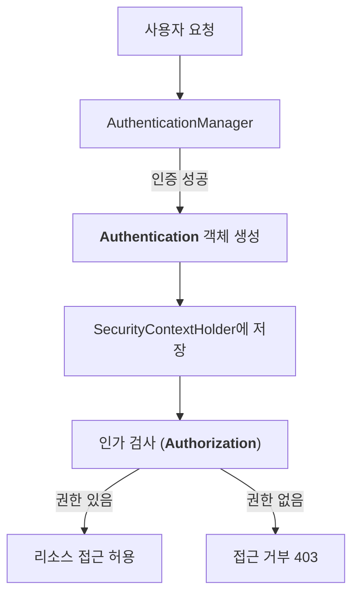

# [ 12주차 - 1106 ] 스터디 내용

```bash
    금일 커리큘럼
        ├ 09:00 ~ 12:00 backend 프로그래밍 (spring security 인증과 인가, Authentication)
        └ 13:00 ~ 18:00 backend 프로그래밍 (Authorization, 실습)
```

## 1.spring security 인증과 인가

- Spring Security는 Spring 기반 애플리케이션의 보안(인증·인가) 을 담당하는 핵심 프레임워크이다.
- 즉, “누가 로그인했는가? (인증)”와 “이 사용자가 무엇을 할 수 있는가? (인가)”를 자동으로 관리한다.

### authentication 와 authorization 개념

- **(인증)authentication** : 사용자의 신원을 확인하는 절차 (로그인 과정)
- **(인가)authorization** : 인증된 사용자가 접근 가능한 리소스(페이지·API)를 제한하는 절차


### spring security에서 인증 흐름

- Spring Security는 기본적으로 인증 → 인가 순서로 동작한다.
- 로그인시 `AuthenticationManager`가 아이디/비밀번호를 검증하고,
- 인증이 성공하면 `Authentication` 객체를 생성하여 `SecurityContextHolder`에 저장한다.
- 이후 사용자가 페이지나 api에 접근하려 할 때, 해당 요청URL 혹은 메서드에 대한 권한을 검사하여 인가를 수행한다.




### 인증 vs 인가 비교


| 구분 | 인증(authentication) | 인가(authorization) |
|------|----------------------|---------------------|
| 정의 | 사용자의 신원을 확인하는 과정 | 사용자가 특정 자원에 접근할 수 있는 권한을 부여하는 과정 |
| 목적 | 사용자가 누구인지 확인 | 사용자가 무엇을 할 수 있는지 결정 |
| 적용 시점 | 로그인 시 | 리소스 접근 시 |
| 데이터 | 사용자 자격 증명 (예: 아이디, 비밀번호) | 사용자 권한 정보 (예: 역할, 권한) |


---

## 2. Authentication - 인증

- 사용자가 누구인지 확인하는 과정으로 아이디와 비밀번호를 통해 신원을 검증한다.
- 시큐리티에서 인증은 `AuthenticationManager`가 담당하며, `UserDetailsService`를 통해 사용자 정보를 로드한다.
- 인증이 성공하면 `Authentication` 객체가 생성되어 보안 컨텍스트에 저장된다.

#### 주요 구성 요소

- `UserDetailsService` : 사용자 정보를 로드하는 인터페이스
- `UserDetails` : 사용자 정보를 담는 인터페이스
- `AuthenticationManager` : 인증을 처리하는 인터페이스
- `PasswordEncoder` : 비밀번호를 암호화하는 인터페이스
- 인증 방식 : 폼 로그인, HTTP 기본 인증, JWT 등

#### 시큐리티에서 entity 객체를 UserDetails로 변환하는 방법

* UserDetailsService 인터페이스를 구현하여 사용자 정보를 로드하는 클래스를 작성
* config 설정에서 UserDetailsService를 등록

```java
// UserDetailsService 구현  ------------
@Service
public class CustomUserDetailsService implements UserDetailsService {
    @Autowired
    private UserRepository userRepository;

    @Override
    public UserDetails loadUserByUsername(String username) throws UsernameNotFoundException {
        User user = userRepository.findByUsername(username)
                .orElseThrow(() -> new UsernameNotFoundException("찾을 수 없음"));

        // UserBuilder를 사용하여 UserDetails 객체 생성
        UserBuilder userBuilder =
            org.springframework.security.core.userdetails.User.withUsername(username);
        // withUsername으로 userBuilder 반환됨

        userBuilder
            .password(user.getPassword()) // 암호화 되어있는 상태여야함
            .roles(
                user.getRoles().stream()
                    .map(Role::getName) // "ADMIN", "USER"
                    .toList()
                    .toArray(new String[0])
            );
            // DB에서 "ROLE_" 접두사 내용이 있는 경우 .roles() 대신 .authorities() 사용 가능
            // 예시 :
            // .authorities(
            //     user.getRoles().stream()
            //     .map(role -> "ROLE_" + role.getName())
            //     .toList()
            //     .toArray(new String[0])
            // );

        return userBuilder.build();
    }
}

// SecurityConfig 에서 설정 ------------
@Configuration
@EnableWebSecurity
@RequiredArgsConstructor
public class SecurityConfig {
    // UserDetailsService 주입
    private final CustomUserDetailsService userDetailsService;

   @Bean
    public SecurityFilterChain securityFilterChain(HttpSecurity http) throws Exception {
        http
            .authorizeHttpRequests(auth -> auth
                .anyRequest().authenticated()
            )
            .csrf(csrf -> csrf.disable()) // CSRF 비활성화
            .userDetailsService(userDetailsService) // UserDetailsService 설정
            .formLogin(withDefaults());
        return http.build();
    }

    @Bean
    public PasswordEncoder passwordEncoder() {
        return new BCryptPasswordEncoder();
    }
}
```

* **csrf 비활성화 하는 이유 ?**
  - RESTful API 서버에서는 주로 세션을 사용하지 않고, 토큰 기반 인증 방식을 사용하기 때문에 CSRF 공격에 대한 위험이 적다.
  - 따라서 CSRF 보호 기능을 비활성화하여 불필요한 복잡성을 줄일 수 있다.


---

## 3. Authorization - 인가

- 사용자가 특정 자원에 접근할 수 있는 권한을 부여하는 과정이다.
- 시큐리티에서 인가는 `AccessDecisionManager`가 담당하며, 사용자의 권한 정보를 기반으로 접근을 제어한다.
- 인가 규칙은 `HttpSecurity` 설정을 통해 정의할 수 있다.

#### 주요 구성 요소

- `Role` : 권한의 집합을 나타내는 개념 (예: ROLE_USER, ROLE_ADMIN)
- 인가 방식 : URL 기반 인가, 메서드 기반 인가 (예: `@PreAuthorize`,` @Secured`)

#### 시큐리티에서 권한 설정하는 방법

1. config 설정에서 권한에 따른 접근 제어 설정 방식

- `hasRole` : 특정 역할이 있는지 검사
- `hasAnyRole` : 여러 역할 중 하나라도 있는지 검사

```java
@Configuration
@EnableWebSecurity
@RequiredArgsConstructor
public class SecurityConfig {
    @Bean
    public SecurityFilterChain securityFilterChain(HttpSecurity http) throws Exception {
        http
            .authorizeHttpRequests(auth -> auth
                .antMatchers("/admin/**").hasRole("ADMIN") // ADMIN 권한 필요
                .antMatchers("/user/**").hasAnyRole("USER", "ADMIN") // USER 또는 ADMIN 권한 필요
                .anyRequest().authenticated() // 나머지 요청은 인증 필요
            )
            .csrf(csrf -> csrf.disable())
            .formLogin(withDefaults());
        return http.build();
    }
}
```

2. 메서드 단위로 권한 설정 방식
    - `@PreAuthorize` : 메서드 실행 전에 권한을 검사
    - `@Secured` : 메서드에 접근할 수 있는 권한을 지정

```java
@RestController
@RequestMapping("/api")
public class ApiController {

    @PreAuthorize("hasRole('ADMIN')")
    @GetMapping("/admin/data")
    public String getAdminData() {
        return "Admin Data";
    }

    @Secured({"ROLE_USER", "ROLE_ADMIN"})
    @GetMapping("/user/data")
    public String getUserData() {
        return "User Data";
    }
}
```

---

