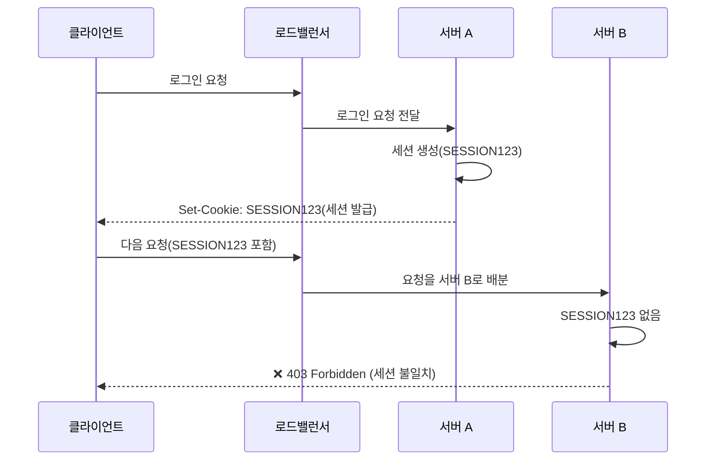
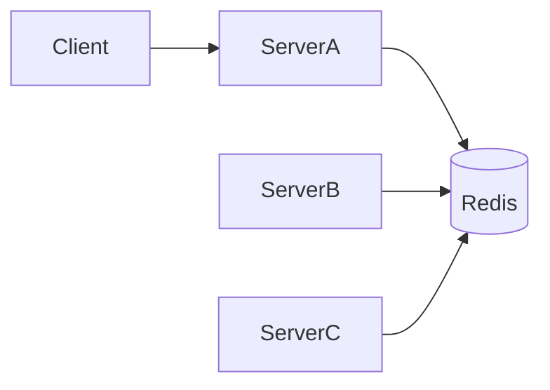
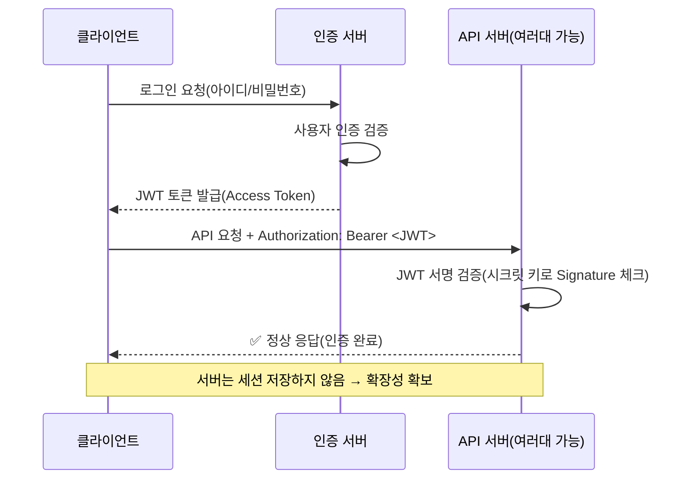
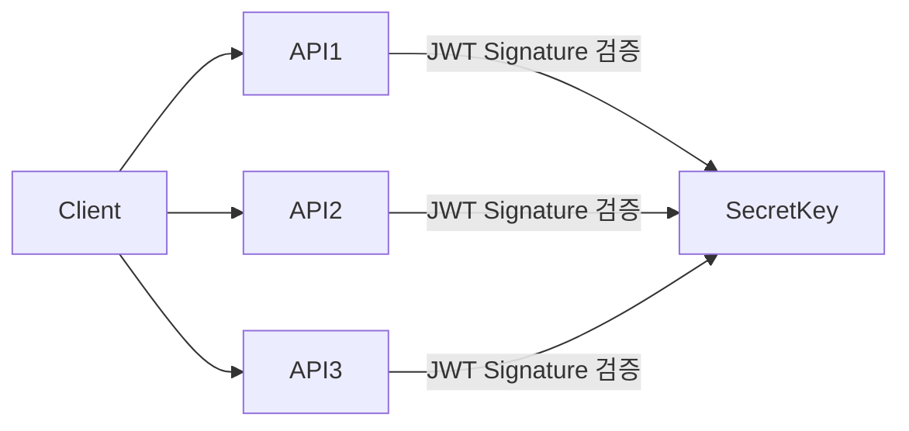

# [ 13주차 - 1110 ] 스터디 내용

```bash
    금일 커리큘럼
        ├ 09:00 ~ 14:00 backend 프로그래밍 (JWT 인증, 세션 관리의 한계와 JWT의 필요성)
        └ 14:00 ~ 18:00 backend 프로그래밍 
```

## 1. JWT 인증
> JWT (JSON Web Token) : 사용자를 인증하고 식별하기 위한 토큰 기반 인증 방식

### 1.1 JWT 인증 개념

**JWT란?**

- JSON Web Token
- 사용자 인증/식별을 위해 사용하는 토큰 기반 인증 방식
- RFC 7519(표준 규격)
- JSON 형식 데이터를 안전하게 전송하기 위한 개방형 표준

**JWT 구조**
- **Header(헤더)** : 토큰 타입과 해싱 알고리즘 정보 포함
- **Payload(페이로드)** : 사용자 정보 및 클레임(Claims) 포함
- **Signature(서명)** : 헤더와 페이로드를 인코딩한 후 비밀키로 서명한 값

```json
// JWT 토큰 구조 (.) 으로 구분하고, 각각 Base64 URL-Safe 방식 인코딩됨
Header.Payload.Signature
```

---

## 2. 세션 관리의 한계와 JWT의 필요성


### 2.1 세션 기반 인증 문제점

- 서버의 메모리나 디스크에 세션 정보를 저장해야 하므로 **서버 메모리 사용량 증가**
- **여러대의 서버를 운영**할 경우 세션 동기화 문제 발생
- **다중 서버 환경에서의 세션 문제**
    * `서버 A`에서 로그인한 사용자가 `서버 B`로 요청을 보내면 세션 정보가 없어 인증 실패
    * 로드 밸런서가 요청을 분산하면서 **세션 불일치 문제 발생**
    * **세션 복제(replication)** 성능 저하와 네트워크 부하 유발




1. `클라이언트`가 로그인 요청을 보냄
2. `로드 밸런서`가 요청을 `서버 A`로 전달
3. `서버 A`가 세션을 생성하고 `클라이언트`에 **세션 쿠키를 발급**
4. `클라이언트`가 다음 요청을 보낼 때 **세션 쿠키**를 포함
5. `로드 밸런서`가 요청을 `서버 B`로 배분
6. `서버 B`는 세션 정보를 알 수 없어 인증 **403 실패** 응답 반환

**SESSION123 포함해서 요청했는데 서버B 에서 왜 인식 못할까?**
- 세션은 서버 메모리에 저장되기 때문에 `서버 A`와 `서버 B`가 서로 다른 메모리를 사용
- `서버 B`는 `서버 A`에서 생성된 세션 정보를 알 수 없음


#### 세션기반 Redis를 통한 세션 클러스터링

세션 기반 인증의 "분산 환경 문제"를 해결하기 위해 **Redis**를 이용한 세션 클러스터링 방식을 사용됨

* 여러 서버(A, B, C)에서 세션을 공유하기 위해 중앙 세션 저장소를 사용
* Redis(인메모리 DB)에 세션을 저장하여 모든 서버가 같은 세션 데이터를 읽을 수 있음
* 확장성 문제는 어느 정도 해결되지만, 여전히 Stateful 구조임


**동작 방식**



1. 클라이언트가 로그인
2. 서버에서 세션 생성 후 Redis에 저장
3. 클라이언트는 세션쿠키 전달
4. 모든 API 서버는 Redis에서 세션을 조회하여 인증 처리

**✅ 장점**

- 세션 동기화 문제 해결 (모든 서버가 Redis에서 세션 조회)
- 기존 세션 기반 인증 방식 유지 가능

**❌ 단점**

- Redis 장애 → 전체 인증 망가짐 (단일 장애점, Single Point of Failure)
- Redis 운영 비용 및 인프라 구성이 필요
- 여전히 Stateful 인증 (서버가 세션 상태를 관리)


### 2.2 JWT 필요성

- 기존 세션 쿠키 방식은 보안 취약하고, 확장성에 한계가 있음
- JWT는 서버에 세션 정보를 저장하지 않아도 되어 확장성 높음
- 클라이언트가 JWT를 저장하고 요청 시마다 전송하여 인증 처리



1. 클라이언트가 로그인 요청을 보냄 (ID/PW)
2. 서버가 사용자 인증 검증
3. 인증 성공 시 서버는 `JWT Access Token` 발급
4. 클라이언트는 토큰을 저장(브라우저/앱/스토리지 등)
5. 이후 모든 요청에서 `Authorization` 헤더에 JWT 포함
6. API 서버는 시그니처 검증만 수행하고 사용자 인증 완료
7. 서버는 세션 정보를 저장하지 않아도 됨


#### JWT를 통한 Stateless 인증

JWT의 핵심은 서버가 세션을 저장하지 않는 것으로, 이를 **Stateless 인증**이라고 함


**동작 방식**



1. 사용자 인증 성공 → 서버가 JWT 발급
2. 클라이언트가 JWT를 저장 후 모든 요청에서 헤더로 전송
3. API 서버는 JWT Signature만 검증하면 인증 가능
4. 세션 저장 필요 없음

**✅ 장점**

- 서버 부하 감소 (세션 저장 없음)
- 서버 개수가 늘어나도 인증 문제 없음(확장성 최강)
- 중앙 세션 저장소 불필요
- 분산/마이크로서비스 환경에 최적화


**❌ 단점**

- 토큰 탈취 시 위험 (만료 전까지 공격자가 악용 가능)
- 토큰 무효화(revoke)가 복잡
- Refresh Token 전략 필요

---


## 3.