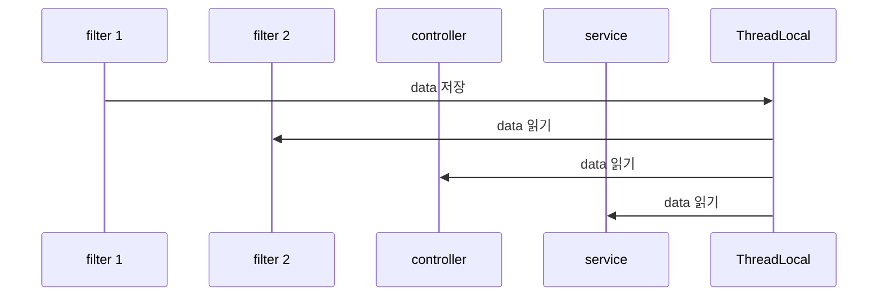

# [ 12주차 - 1104 ] 스터디 내용

```bash
    금일 커리큘럼
        ├ 09:00 ~ 14:00 backend 프로그래밍 (Spring Boot의 스레드 모델, filter와 ThreadLocal)
        └ 14:00 ~ 18:00 backend 프로그래밍 (Spring Security, Spring Security 설정 방법)
```

## 1. Spring Boot의 스레드 모델

> Spring Boot 스레드 모델은 주로 서블릿 컨테이너의 스레드 모델을 따름

- 기본적으로 내장된 서블릿 컨테이너(Tomcat, Jetty, Undertow)를 사용하여 요청을 처리
- 하나의 요청을 하나의 스레드가 처리하는 구조

### Spring Boot 스레드 모델 특징

- 요청이 들어오면 서블릿 컨테이너가 스레드풀에서 스레드를 할당함
- 비동기 요청 처리를 지원하며, 별도의 비동기 작업 스레드 풀을 사용
- 각 요청은 독립적인 스레드에서 처리되어 동시성 문제를 최소화


### 스레드 설정 (tomcat 기준)

> tomcat은 기본적으로 최대 200개의 스레드, 최소 10개의 여유 스레드를 가짐

* **스레드 수 관련 옵션**
    - maxThreads: 최대 스레드 수
    - minSpareThreads: 최소 여유 스레드 수
    - acceptCount: 최대 대기 요청 수

#### 설정 예시

* **application.properties**

```properties
server.tomcat.max-threads=200
server.tomcat.min-spare-threads=10
server.tomcat.accept-count=100
```

* **application.yml**

```yaml
server:
  tomcat:
    max-threads: 200
    min-spare-threads: 10
    accept-count: 100
```

---

## 2. filter와 ThreadLocal 이해

### Filter란?

- 서블릿 요청과 응답을 가로채서 처리하는 컴포넌트
- 주로 인증, 로깅, 인코딩 처리 등에 사용
- 서블릿 컨테이너에서 제공하는 필터 체인에 등록되어 동작

```java
public class SimpleFilter implements Filter {
    @Override
    public void doFilter(
        ServletRequest request,
        ServletResponse response,
        FilterChain chain
    ) throws IOException, ServletException {
        chain.doFilter(request, response); // 다음 필터 또는 서블릿으로 요청 전달
    }
    // 기타 init, destroy 메서드 오버라이드 등..
}
```

### ThreadLocal이란?

- 각 스레드마다 독립적인 변수를 저장할 수 있는 공간을 제공하는 클래스
- 스레드 간에 데이터를 공유하지 않고, 스레드 로컬 변수를 통해 데이터 격리를 구현
- 주로 요청 처리 중에 사용자 정보나 트랜잭션 정보를 저장하는 데 사용


```java
public class ThreadLocalExample {
    // 각 스레드마다 독립적으로 값을 저장
    private static final ThreadLocal<String> threadLocal = new ThreadLocal<>();

    public static void main(String[] args) {
        threadLocal.set("스레드별 값");
        System.out.println(threadLocal.get()); // 현재 스레드의 값 출력
        threadLocal.remove(); // 값 삭제
    }
}
```


### Filter와 ThreadLocal의 관계

- `Filter`에서 `ThreadLocal`을 사용하여 요청 처리 중에 **스레드 로컬 데이터를 저장**하고 관리할 수 있음
- 인증 정보를 `ThreadLocal`에 **저장**하여 요청 처리 중에 쉽게 접근 가능하며,<br>**다른 계층에서도 해당 스레드로컬 값에 접근 가능**



- `filter1`에서 요청처리된 data 값을  `ThreadLocal` 에 저장
- 그다음 `filter2`  또는 `controller`, `service`  계층에서도 해당 `ThreadLocal` 의 데이터값 사용가능


### Filter에서 ThreadLocal 사용 예제

```java
// ThreadLocal 컨텍스트 설정 ------------------------
public class UserContext {
    private static final ThreadLocal<User> userThreadLocal = new ThreadLocal<>();

    public static void setUser(User user) {
        userThreadLocal.set(user);
    }

    public static User getUser() {
        return userThreadLocal.get();
    }

    public static void clear() {
        // 요청이 끝난 후 해당 스레드풀 남아있는 상태에서 재사용되기 때문에 삭제필요
        userThreadLocal.remove();
    }
}

// user 정보 필터 ------------------------
@WebFilter(urlPatterns = "/hello") // 특정 URL 패턴에 필터 적용
public class UserFilter implements Filter {
    @Override
    public void doFilter(
            ServletRequest request,
            ServletResponse response,
            FilterChain chain
    ) throws IOException, ServletException {
        System.out.println("[UserFilter] doFilter - start");
        // try-finally 로 마지막 요청이 끝난 후 정리 보장
        try {
            String name = request.getParameter("name"); // 요청 파라미터에서 name 추출 (임시확인)
            UserContext.setUser(new User(name, 11));

            chain.doFilter(request, response);
            System.out.println("[UserFilter] doFilter - end");
            System.out.println(Thread.currentThread().getName());
        } finally {
            UserContext.clear(); // 필수!
        }
    }
    // 기타 init, destroy 메서드 오버라이드 등..
}
// 컨트롤러 ------------------------
@RestController
@Slf4j
public class UserController {
    private final UserService userService = new UserService();
    @GetMapping(value = {"/hello"})
    public String hello(){
        log.info("hello() 실행 !");
        userService.helloService();
        return "hello World";
    }
}
// 서비스 ------------------------
@Service
public class UserService {
    public void helloService() {
        System.out.println("[UserService] helloService() 실행");
        System.out.println(Thread.currentThread().getName());
        System.out.println(UserContext.getUser().getName());
    }
}
```

```bash
# 실행결과 "http://localhost:8080/hello?name=hong"
[UserFilter] init
[UserFilter] doFilter - start
00:00:00 [http-nio-8080-exec-2] INFO  packageSrc.UserController - hello() 실행 !
[UserService] helloService() 실행
http-nio-8080-exec-2    # 스레드 이름
hong                    # ThreadLocal에 저장된 name 값
[UserFilter] doFilter - end
http-nio-8080-exec-2    # 스레드 이름
```

### 주의사항

- `ThreadLocal`에 저장된 데이터는 요청이 끝난 후 반드시 삭제해야 함
- 스레드풀 환경에서 스레드가 재사용될 때 이전 요청의 데이터가 남아 있을 수 있음
- 메모리 누수 문제를 방지하기 위해 `clear()` 메서드를 호출하여 `ThreadLocal` 데이터를 제거해야 함
- 필터 끼리 데이터 사용시에도 `try-finally`문을 사용한 경우 정리 보장됨


---


## 3. Spring Security

> Spring Security는 스프링 기반 애플리케이션에 보안 기능을 제공하는 프레임워크

- 인증(Authentication)과 권한 부여(Authorization)를 처리
- 다양한 보안 요구사항을 충족시키기 위한 기능 제공
- 주로 모듈화, 확장성, 그리고 선언적 보안 설정에 기반을 둠

### Spring Security의 주요 기능

1. **인증(Authentication)**
    - 사용자 신원 확인하는 과정
    - 다양한 인증 메커니즘 지원 (폼 로그인, HTTP Basic, OAuth2, JWT 등)

2. **권한 부여(Authorization)**
    - 인증된 사용자가 특정 자원에 접근할 수 있는지 결정
    - 역할 기반 접근제어 (RBAC)를 포함한 다양한 접근 제어방 식 지원

3. **세션관리**
    - 사용자의 세션의 생성, 유지, 만료 등을 관리하여 보안성 높임

4. **보안 이벤트 로깅**
    - 로그인 시도, 실패 등 보안 관련 이벤트를 로깅하여 감사 추적 가능


---

## 4. Spring Security 설정 방법

### build.gradle 의존성 추가

```java
dependencies {
    implementation 'org.springframework.boot:spring-boot-starter-security'
    implementation 'org.springframework.boot:spring-boot-starter-web'
}
```

### 시큐리티 계정 설정

* 기본값은 user / 랜덤 비밀번호 (server run 시 log에 출력됨)

1. **application.properties 설정 방법**

```bash
spring.security.user.name=admin123     # 시큐리티 사용자명 설정
spring.security.user.password=admin123 # 시큐리티 비밀번호 설정
spring.security.user.roles=ADMIN       # 시큐리티 권한 설정
```

2. **application.yml 설정 방법**

```yml
spring:
  security:
    user:
      name: admin123      # 시큐리티 사용자명 설정
      password: admin123  # 시큐리티 비밀번호 설정
      roles: ADMIN        # 시큐리티 권한 설정
```

### security config 사용 예시

1. **시큐리티 기본 설정 방법**

```java
@Configuration
@EnableWebSecurity
public class SecurityConfig {
    @Bean
    public SecurityFilterChain securityFilterChain(HttpSecurity http) throws Exception {

        // 1. 기본 Spring Security 설정
        return http
                //  HTTP 요청에 대한 접근 권한을 설정
                .authorizeHttpRequests(auth -> auth
                    .anyRequest() // 모든요청
                    .authenticated() // 인증요구
                )
                .formLogin(Customizer.withDefaults()) // 기본 로그인 폼 사용
                .httpBasic(Customizer.withDefaults()) // HTTP Basic 인증 지원
                .csrf(Customizer.withDefaults()) // CSRF 보호 활성화
                .build();

    }
}
```

2. **커스텀 URL 접근 권한 설정 방법**

```java
@Configuration
@EnableWebSecurity
public class SecurityConfig {
    @Bean
    public SecurityFilterChain securityFilterChain(HttpSecurity http) throws Exception {
        // 2. 특정 경로는 인증 없이 허용하는 설정
        return http
                .authorizeHttpRequests(auth -> auth
                        .requestMatchers("/", "/home", "/public/**").permitAll() // 인증 없이 허용
                        .requestMatchers("/admin/**").hasRole("ADMIN") // ADMIN 권한 필요
                        .anyRequest().authenticated() // 나머지는 인증 필요
                )
                .formLogin(Customizer.withDefaults())
                .build();
    }
}
```

3. **커스텀 로그인 폼 설정 방법**

```java
@Configuration
@EnableWebSecurity
public class SecurityConfig {
    @Bean
    public SecurityFilterChain securityFilterChain(HttpSecurity http) throws Exception {
        // 3. 커스텀 로그인 폼 설정
        return http
                .authorizeHttpRequests(auth -> auth
                        .requestMatchers("/loginForm", "/").permitAll()
                        .anyRequest().authenticated()
                )
                .formLogin(form -> form
                        // 개발자가 작업한 로그인폼 화면 사용 (없으면 시큐리티 폼로그인 사용됨)
                        // .loginPage("/loginForm")
                        .loginProcessingUrl("/login_proc") // form의 action 경로 설정
                        .usernameParameter("email") // 사용자명 input name 지정 (기본 값: username)
                        .passwordParameter("password") // 비밀번호 input name 지정 (기본 값: password)
                        // 로그인 성공시 이동할 페이지 (true: 무조건 이동, false: 이전 페이지로 이동)
                        .defaultSuccessUrl("/dashboard", true)
                        .failureUrl("/fail") // 로그인 실패시 이동할 페이지
                )
                .build();
    }
}
```

4. **로그인/로그아웃 핸들러 추가 방법**

```java
@Configuration
@EnableWebSecurity
public class SecurityConfig {
    @Bean
    public SecurityFilterChain securityFilterChain(HttpSecurity http) throws Exception {
        // 4. 로그인/로그아웃 처리 핸들러 추가
        return http
                .authorizeHttpRequests(auth -> auth
                        .requestMatchers("/loginForm", "/").permitAll()
                        .anyRequest().authenticated()
                )
                .formLogin(form -> form
                        .loginPage("/loginForm")
                        // 로그인 성공 핸들러
                        .successHandler((request, response, authentication) -> {
                            System.out.println("로그인 성공: " + authentication.getName());
                            response.sendRedirect("/dashboard");
                        })
                        // 로그인 실패 핸들러
                        .failureHandler((request, response, exception) -> {
                            System.out.println("로그인 실패: " + exception.getMessage());
                            response.sendRedirect("/fail");
                        })
                )
                .logout(logout -> logout
                        // 로그아웃 처리 URL (없으면 시큐리티 기본 /logout 사용)
                        // .logoutUrl("/logout_process") // POST 전용 - GET방식은 보안 취약
                        .logoutSuccessUrl("/") // 로그아웃 성공 후 이동할 페이지
                        .addLogoutHandler((request, response, authentication) -> {
                            System.out.println("로그아웃 처리: 세션 및 쿠키 삭제");
                        })
                        .deleteCookies("JSESSIONID") // 쿠키 삭제
                )
                .build();
    }
}
```


### 시큐리티 설정 옵션 정리

* `authorizeHttpRequests()`
    - requestMatchers(): 특정 URL 패턴에 대한 접근 권한 설정
    - permitAll(): 모든 사용자에게 접근 허용
    - anyRequest(): 모든 요청에 대해 접근 권한 설정
    - authenticated(): 인증된 사용자만 접근 허용
    - hasRole(): 특정 역할을 가진 사용자만 접근 허용

* `formLogin()`
    - loginPage(): 커스텀 로그인 페이지 URL 설정
    - loginProcessingUrl(): 로그인 처리 URL 설정
    - usernameParameter(): 사용자명 input name 설정
    - passwordParameter(): 비밀번호 input name 설정
    - defaultSuccessUrl(): 로그인 성공 후 이동할 URL 설정
    - failureUrl(): 로그인 실패 후 이동할 URL 설정
    - successHandler(): 로그인 성공 시 커스텀 핸들러 설정
    - failureHandler(): 로그인 실패 시 커스텀 핸들러 설정

* `csrf()`
    - 특정 URL 패턴에 대해 CSRF 보호 비활성화

* `httpBasic()`
    - HTTP Basic 인증 활성화
    - HTTP Basic ? : 클라이언트가 요청 시 사용자명과 비밀번호를 HTTP 헤더에 포함시켜 인증하는 방식


* `logout()`
    - logoutUrl(): 로그아웃 처리 URL 설정
    - logoutSuccessUrl(): 로그아웃 성공 후 이동할 URL 설정
    - addLogoutHandler(): 로그아웃 처리 시 커스텀 핸들러 설정
    - deleteCookies(): 로그아웃 시 삭제할 쿠키 설정


### 사용 예시 코드 브라우저 확인

```java
@Configuration
@EnableWebSecurity
public class SecurityConfig {
    @Bean
    public SecurityFilterChain securityFilterChain(HttpSecurity http) throws Exception {

        return http
                .authorizeHttpRequests(auth -> auth
                        .requestMatchers("/hello").permitAll() // hello만 인증없이 허용
                        .anyRequest().authenticated()
                )
                .formLogin(form -> form
                        .loginProcessingUrl("/login_proc") // form의 action 지정
                        .usernameParameter("email") // id 인풋 name 지정
                        .passwordParameter("passpw") // pw 인풋 name 지정
                        .successHandler((request, response, authentication) -> {
                            System.out.println("로그인 성공 !!" + authentication.getName());
                            response.sendRedirect("/info");
                        })
                        .failureHandler((request, response, exception) -> {
                            System.out.println("로그인 실패 !!" + exception.getMessage());
                            // 로그인 페이지로 다시 보내면서 error=true 전달
                            response.sendRedirect("/login?error=true");
                        })
                )
                .logout(logout -> logout
                        .logoutSuccessUrl("/hello") // 로그아웃시 해당 url로 이동
                        // 로그아웃 처리 핸들러 추가
                        .addLogoutHandler((request, response, authentication) -> {
                            System.out.println("로그아웃!!  세션, 쿠키도 삭제");
                            request.getSession(false).invalidate(); //세션 삭제
                        })
                        .deleteCookies("JSESSIONID") // JSESSIONID 쿠키 삭제
                )
                .build();
    }
}
```

#### 로그아웃 전 쿠키 상태


#### 로그아웃 후 쿠키 상태


---
