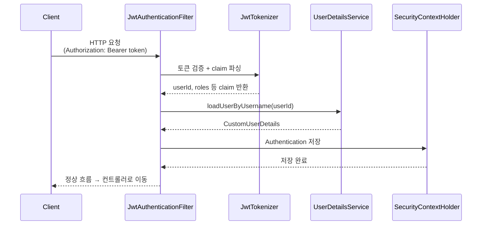
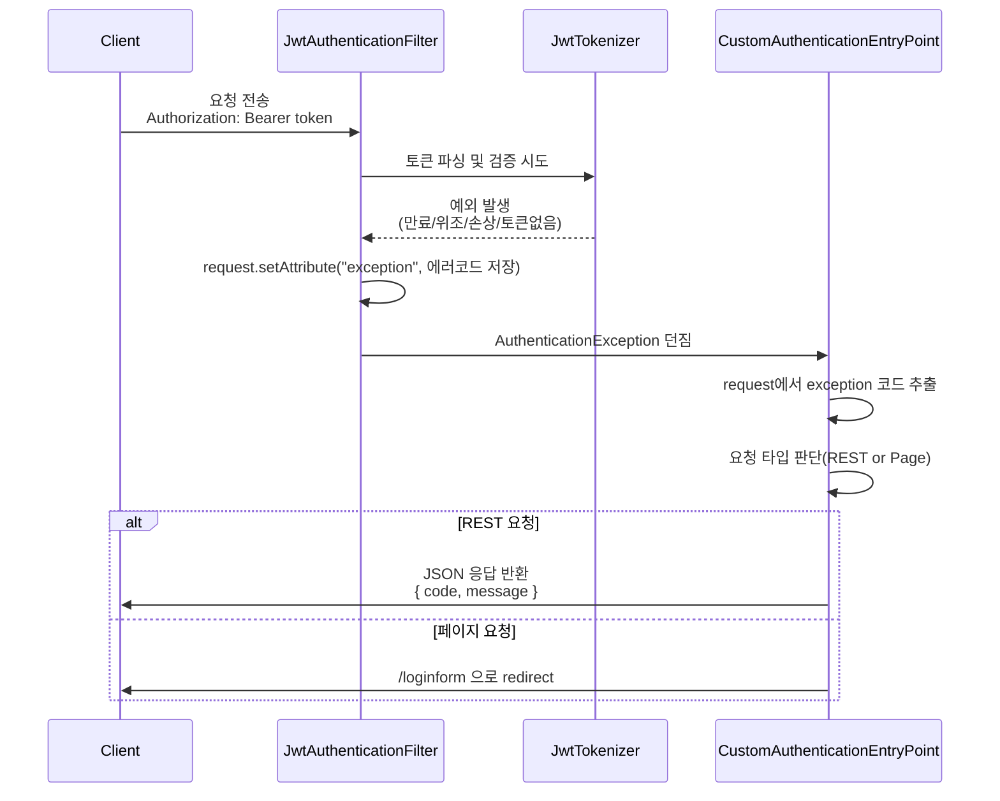

# [ 13주차 - 1111 ] 스터디 내용

```bash
    금일 커리큘럼
        ├ 09:00 ~ 12:00 backend 프로그래밍 (UserDetails 구현, UserDetailsService 구현)
        └ 13:00 ~ 18:00 backend 프로그래밍 (JWT 인증을 위한 패키지 구성, RefreshToken 구현, JWT Exception 처리 구현)
```

## 1. UserDetails 구현체

- `UserDetails`는 스프링 시큐리티에서 "로그인한 사용자 정보"를 담기 위한 표준 인터페이스
- 스프링 시큐리티는 로그인 성공 이후 `SecurityContextHolder`에 `UserDetails` 객체를 저장
- 이후 모든 요청에서 해당 객체를 기반으로 인증/인가를 처리

### 구현체 만드는 이유 ?

**실제서비스에서 기본 제공 User 클래스로 충분하지 않기 때문**

- 기본 User는 `username`, `password`, `roles` 정도만 제공
- 실제 서비스에서는 다음과 같은 추가 정보가 필요함:
  - 이름(name)
  - 이메일(email)
  - 프로필(profile)
  - 추가 도메인 정보 등
- 따라서, 이런 정보들을 확장해 사용하려면 `UserDetails`를 직접 구현 필요

### UserDetails 구현체 작성

```java
public class CustomUserDetails implements UserDetails {
    private final String username;
    private final String password;
    private final String name;
    private final List<GrantedAuthority> authorities;

    public CustomUserDetails(String username, String password, String name, List<String> roles) {
        this.username = username;
        this.password = password;
        this.name = name;
        this.authorities = roles.stream()
                .map(role -> new SimpleGrantedAuthority("ROLE_" + role))
                .collect(Collectors.toList());
    }

    public String getName() { return name; }

    // 현재 로그인한 사용자가 어떤 권한을 가지고 있는지 스프링에 알려주는 메서드
    @Override
    public Collection<? extends GrantedAuthority> getAuthorities() {
        return authorities;
    }

    @Override
    public String getPassword() {return password; }
    }

    @Override
    public String getUsername() { return username; }

    // 계정 상태(필요 시 커스터마이징 가능)
    @Override
    public boolean isAccountNonExpired() { return true; }

    @Override
    public boolean isAccountNonLocked() { return true; }

    @Override
    public boolean isCredentialsNonExpired() { return true; }

    @Override
    public boolean isEnabled() { return true; }
}
```

### 주요 핵심 포인트

1. **생성자에서 roles 리스트 처리 (role → authorities 변환)**
    - 스프링 시큐리티는 권한을 **"ROLE_"** 접두사가 붙은 형태로 관리됨
    - 그래서 DB에서 **"USER"**, **"ADMIN"** 같은 문자열을 가져와도
    -`SimpleGrantedAuthority` 객체로 변환할 때 **"ROLE_"** 접두사를 붙여줘야 함 !

2. **인터페이스 메서드 @Override**
    - `getAuthorities()`: 사용자의 권한 목록을 반환
    - `getPassword()`: 사용자의 비밀번호 반환
    - `getUsername()`: 사용자의 아이디 반환

3. **기타 계정 상태 관련 메서드 @Override**
    - 기본적으로 true를 반환하도록 구현 (필요에 따라 커스터마이징 가능)
    - `isAccountNonExpired()` : 계정이 만료되지 않았는지 여부
    - `isAccountNonLocked()` : 계정이 잠기지 않았는지 여부
    - `isCredentialsNonExpired()` : 자격 증명이 만료되지 않았는지 여부
    - `isEnabled()`: 계정이 활성화되어 있는지 여부


### 스프링 빈 등록 필요 없는 이유

- `UserDetails` 구현체는 스프링 빈으로 등록할 필요가 없음
- 이 객체는 인증 이후 사용자 정보를 담는 일회성 데이터 객체 → DTO 역할 느낌
- **UserDetailsService**가 요청 시 생성해서 반환만 하면 됨


---

## 2. UserDetailsService 구현체

- `UserDetailsService`는 스프링 시큐리티에서 사용자 인증을 처리하기 위한 핵심 인터페이스
- username(아이디)을 기반으로 DB에서 사용자 정보를 조회하고, 해당 정보를 UserDetails 객체에 담아 반환하는 역할
- 스프링 시큐리티 인증 프로세스는 반드시 `loadUserByUsername()`을 호출함

### 인증 과정 흐름 이해

#### 주요 컴포넌트 역할

| 컴포넌트 | 역할 |
|---------|------|
| **AuthenticationManager** | 인증 요청을 처리하는 핵심 인터페이스.<br>인증 전 Authentication 객체를 받아 인증 처리 흐름을 조정함 |
| **AuthenticationProvider** | 실제 인증 로직을 수행하는 구현체.<br>UserDetailsService와 PasswordEncoder 등을 사용해 인증 검증 |
| **UserDetailsService** | username 기반으로 DB에서 사용자 정보를 조회하는 인터페이스 |
| **UserDetails** | 조회된 사용자 정보(아이디, 비밀번호, 권한 등)를 담는 객체 |
| **Authentication** | principal(사용자 정보), credentials(자격증명), authorities(권한)을 담는 인증 객체.<br>인증 전/후 상태가 달라짐 |
| **SecurityContextHolder** | 인증 완료된 Authentication 객체를 저장하는 컨테이너(스레드 로컬 기반) |

#### 인증 과정

```bash
로그인 시도
→ AuthenticationManager가 Authentication(인증 전) 전달받음
→ AuthenticationProvider가 UserDetailsService.loadUserByUsername() 호출
→ UserDetails 반환
→ AuthenticationProvider가 Authentication(인증 후) 생성
    principal = UserDetails
    credentials = null
    authorities = ROLE_...
    authenticated = true
→ SecurityContextHolder에 Authentication 저장
```

1. 사용자가 로그인 폼에 아이디/비밀번호 입력 후 로그인 요청
2. `AuthenticationManager`가 인증 요청을 처리하기 위해 인증 전 상태의 `Authentication` 객체를 전달받음
3. `AuthenticationManager`는 내부 Provider를 통해 `UserDetailsService`의 **loadUserByUsername()** 호출
4. `UserDetailsService`가 **DB에서 사용자 정보**를 조회해 `UserDetails`로 반환
5. `AuthenticationProvider`는 반환된 `UserDetails`와 비밀번호 검증을 통해 인증 완료된 `Authentication` 객체를 생성
6. 이를 `SecurityContextHolder`에 저장 → 로그인 성공 상태 유지

### UserDetailsService 구현체 작성

```java

@Service
@RequiredArgsConstructor
@Slf4j
public class CustomUserDetailsSerivce implements UserDetailsService {
    private final UserRepository userRepository;

    @Override
    public UserDetails loadUserByUsername(String username) throws UsernameNotFoundException {
        log.debug("사용자 인증 시도 :: {}", username);
        User user = userRepository.findByUsername(username)
                .orElseThrow(() -> {
                        log.warn("사용자 찾을 수 없음 :: {}", username);
                        return new UsernameNotFoundException("사용자 찾을 수 없음 ::" + username);
                    }
                );

        log.debug("사용자 정보 로드 완료 : {}, 역할 {}", user.getUsername(), user.getRoles());

        // DB에서 가져온 역할(Role) 리스트를 문자열 리스트로 변환
        List<String> roles =
                user.getRoles().stream()
                    .map(Role::getName)
                    .toList();

        // 만들어준 CustomUserDetails 객체 반환
        return new CustomUserDetails(
                user.getUsername(),
                user.getPassword(),
                user.getName(),
                roles
        );
    }
}
```

### 주요 핵심 포인트

1. **loadUserByUsername() 메서드 구현**
    - username(아이디)을 매개변수로 받아 DB에서 사용자 정보를 조회
    - `UserRepository`를 사용해 사용자 조회
    - 사용자가 존재하지 않으면 `UsernameNotFoundException` 예외 발생

2. **UserDetails 객체 생성 및 반환**
    - 조회된 사용자 정보를 기반으로 `CustomUserDetails` 객체 생성
    - DB에서 가져온 역할(Role) 리스트를 문자열 리스트로 변환 후 전달
    - 최종적으로 `CustomUserDetails` 객체 반환


---

## 3.JWT 인증을 위한 패키지 구성 및 역할

- 스프링 시큐리티와 결합하여 JWT 인증을 구현하기 위해서는 여러 역할이 필요
- 이를 명확히 분리하기 위해 패키지를 구조화

### JWT 인증 흐름을 구성하는 핵심 기능

1. 토큰 생성/검증
2. 토큰 기반 인증 객체 생성
3. 토큰 인증 실패/예외 처리
4. 필터에서 JWT 검증 및 SecurityContext에 저장


### 패키지 구성 예시

```bash
src/main/java/org/example/jwtexam
├── domain
│      ├── User.java
│      ├── Role.java
│      └── RefreshToken.java
│
├── repository
│      ├── UserRepository.java
│      ├── RoleRepository.java
│      └── RefreshTokenRepository.java
│
├── security
│      ├── CustomUserDetails.java
│      └── CustomUserDetailsService.java
│
├── service
│      ├── UserService.java
│      └── RefreshTokenService.java
│
└── jwt  # JWT 관련 기능 패키지 <-- 여기
       ├── exception
       │       ├── CustomAuthenticationEntryPoint.java
       │       └── JwtExceptionCode.java
       │
       ├── token
       │       └── JwtAuthenticationToken.java
       │
       ├── util
       │       └── JwtTokenizer.java
       │
       └── filter
               └── JwtAuthenticationFilter.java
```

#### jwt 패키지 내부 역할 상세

| 패키지             | 역할                                       |
| --------------- | ---------------------------------------- |
| `jwt/exception` | JWT 인증 실패 시 에러 응답 처리(페이지/REST 구분)        |
| `jwt/token`     | JWT 기반 스프링 인증 객체(AuthenticationToken) 구현 |
| `jwt/util`      | 토큰 생성/파싱/검증 기능을 모아놓은 유틸 클래스              |
| `jwt/filter`    | 매 요청마다 JWT 검증 및 SecurityContextHolder 설정 |


### JWT 인증 흐름




1. 클라이언트가 **JWT 토큰을 포함**하여 HTTP 요청 전송
2. `JwtAuthenticationFilter`가 요청을 가로채 JWT 형식 및 존재 여부 확인
3. `JwtTokenizer`가 토큰 서명/만료/클레임을 검증 후 **userId** 등 **claim** 반환
4. `JwtAuthenticationFilter`가 `UserDetailsService`의 **loadUserByUsername()** 호출
5. DB에서 사용자 정보를 로드하여 `CustomUserDetails` 반환
6. `JwtAuthenticationFilter`가 JWT 기반 `Authentication` 객체 생성
7. 인증 정보를 `SecurityContextHolder`에 저장하여 인증 완료 처리
8. 이후 컨트롤러로 요청 전달 (인증 성공된 사용자로 동작)


### 작업 흐름 순서

1. 도메인 모델 작성 (User, Role, RefreshToken 등)
2. 리포지토리 작성 (UserRepository, RoleRepository 등)
3. UserDetails 및 UserDetailsService 구현
4. JWT 패키지 내 기능 구현


---

## 4. RefreshToken DB에 저장 & 역할

### RefreshToken의 필요성

1. `AccessToken`는 "사용자 소유", `RefreshToken`는 "서버 소유" (세션 통제 권한)

- `AccessToken`은 클라이언트(브라우저·모바일 앱)가 직접 들고 다니는 토큰
- 한 번 발급하면 서버가 회수하거나 강제로 파기할 수 없다.
- 반면에 `RefreshToken`은 서버(DB)에 저장
- 서버는 언제든지 해당 RefreshToken을 지우거나 교체함으로써 세션을 강제로 종료할 수 있음
- 서버가 "사용자 세션을 통제할 수 있는 권한"을 갖게 해줌

2. `AccessToken`은 짧게, `RefreshToken`은 길게 설정

- `AccessToken`은 탈취되면 매우 위험
- 그래서 만료 시간을 짧게 설정 (예: 10 ~ 30분)
- 하지만 너무 짧으면 사용자가 자주 로그아웃 상태가 되어 불편
- 이를 보완하기 위해 `RefreshToken`은 상대적으로 긴 만료 시간 설정 (예: 며칠 ~ 몇 주)


3. `AccessToken` 만료 시 `RefreshToken` 사용

- AccessToken이 만료되면 클라이언트는 401 Unauthorized 응답을 받음
- 이때 클라이언트는 저장된 `RefreshToken`을 사용해 새로운 `AccessToken` 발급 요청
- 서버는 `RefreshToken`의 유효성을 검증 후 새로운 `AccessToken`을 발급한다

4. 서버는 DB에 저장된 `RefreshToken`을 검증 후 새로운 `AccessToken` 발급

**서버는 다음 과정을 거친다:**

- 클라이언트가 보낸 `RefreshToken`을 DB에서 찾음
- DB에 실제 존재하는지 검증
- 토큰의 만료 여부 확인
- 유효하면 새로운 `AccessToken` 발급

#### 핵심 요약

- ✅ RefreshToken만 DB에 저장해서 관리하면 **보안성이 높아짐**
- ✅ AccessToken의 짧은 만료 시간으로 인한 **사용자 불편을 해결**할 수 있음


### RefreshToken 도메인 작성

```java
@Entity
@Table(name = "refresh_tokens")
@Getter
@Setter
public class RefreshToken {
    @Id
    @GeneratedValue(strategy = GenerationType.IDENTITY)
    private Long id;
    @Column(name = "user_id")
    private Long userId;  //user
    private String token;
}
```

### RefreshToken Repository 작성

```java
@Repository
public interface RefreshTokenRepository extends JpaRepository<RefreshToken, Long> {
    // 리프레시토큰 조회
    Optional<RefreshToken> findByToken(String refreshToken);
}
```

### RefreshToken Service 작성

```java
@Service
@RequiredArgsConstructor
public class RefreshTokenService {
    private final RefreshTokenRepository refreshTokenRepository;

    //리프레시토큰 저장
    @Transactional
    public RefreshToken addRefreshToken(RefreshToken refreshToken) {
        return refreshTokenRepository.save(refreshToken);
    }

    //리프레시토큰 조회
    @Transactional(readOnly = true)
    public Optional<RefreshToken> findRefreshToken(String refreshToken) {
        return refreshTokenRepository.findByToken(refreshToken);
    }

    //리프레시토큰 삭제
    @Transactional
    public void deleteRefreshToken(String refreshToken) {
        refreshTokenRepository.findByToken(refreshToken)
                .ifPresent(refreshTokenRepository::delete);
    }

}
```

#### 주요 핵심 포인트

1. **RefreshToken 도메인**
    - `id`: 고유 식별자
    - `userId`: 토큰 소유자(사용자) 식별자
    - `token`: 실제 리프레시 토큰 문자열

2. **RefreshTokenRepository**
    - `findByToken(String refreshToken)`: 토큰 문자열로 리프레시 토큰 조회

3. **RefreshTokenService**
    - `addRefreshToken(RefreshToken refreshToken)`: 리프레시 토큰 저장
    - `findRefreshToken(String refreshToken)`: 토큰 문자열로 리프레시 토큰 조회
    - `deleteRefreshToken(String refreshToken)`: 토큰 문자열로 리프레시 토큰 삭제

이렇게 RefreshToken을 DB에 저장하고 관리함으로써, 보안성을 높이고 개선됨

---


## 5. JWT Exception 처리 구현

- JWT 기반 인증에서는 세션/로그인폼 기반의 redirect 방식이 아닌<br>**"API 응답 기반의 오류 전달"**이 필요함

- 따라서 JWT 검증 과정에서 발생하는 다양한 오류를 하나의 흐름으로 수집하고<br>스프링 시큐리티의 `AuthenticationEntryPoint`를 통해 일관된 방식으로 응답해야 함

### JWT Exception 커스텀 구현 처리 흐름

* **CustomAuthenticationEntryPoint** : JWT 인증 실패 시 동작 구현한 클래스



1. 클라이언트가 JWT 토큰을 포함하여 요청 전송
    - 만료된 토큰 (ExpiredJwtException)
    - 위조된 토큰 (SignatureException)
    - 형식 오류 (MalformedJwtException)
    - 토큰 없음 (IllegalArgumentException)

2. **JWT 필터**가 `request`에 "exception 코드"를 저장

3. **스프링 시큐리티**가 `AuthenticationEntryPoint` 호출

4. `exception` 유형에 따라 응답
    - REST 요청 → JSON 에러 응답
    - 페이지 요청 → 로그인 폼으로 리다이렉트


### JWT Exception 따로 구현해야 하는 이유

- JWT 인증은 필터 단계에서 실행되므로 기존 예외 처리(@ControllerAdvice)로 처리할 수 없음
- 다양한 토큰 오류를 Enum으로 분류해 예측 가능한 응답을 제공해야 함
- **REST 요청과 페이지 요청을 구분해야 하기 때문**
- 프론트단에서 오류코드 기반으로 자동 처리(재발급/로그아웃)를 해야 함
- 필터 단계의 예외를 일관되게 처리하기 위해 AuthenticationEntryPoint가 필요함


### JwtExceptionCode - Enum 작성

* 토큰에 대한 각 예외 코드를 정의
    - 알 수 없는 오류
    - 토큰 찾을 수 없음
    - 유효하지 않은 토큰
    - 만료된 토큰
    - 지원하지 않는 토큰 등

```java
public enum JwtExceptionCode {
    UNKNOWN_ERROR("UNKNOWN_ERROR", "[error] 알 수 없음"),
    NOT_FOUND_TOKEN("NOT_FOUND_TOKEN", "[token_error] 토큰 찾을 수 없음"),
    INVALID_TOKEN("INVALID_TOKEN", "[token_error] 유효하지 않음"), 
    EXPRIED_TOKEN("EXPRIED_TOKEN", "[token_error] 만료된 토큰"),
    UNSUPPORTED_TOKEN("UNSUPPORTED_TOKEN","[token_error] 지원하지 않는 토큰");

    JwtExceptionCode(String code, String message) {
        this.code = code;
        this.message = message;
    }

    @Getter
    private String code;
    @Getter
    private String message;

    // 코드를 기반으로 Enum 상수를 찾는 정적 메서드
    public static JwtExceptionCode findByCode(String code) {
        return Arrays.stream(JwtExceptionCode.values()) //  Enum 상수를 스트림으로 변환
                .filter(c ->c.getCode().equals(code))
                .findFirst()
                .orElse(UNKNOWN_ERROR);
    }
}
```

### CustomAuthenticationEntryPoint 작성

* `AuthenticationEntryPoint`를 구현하여 **JWT 인증 실패 시 동작 정의**
* `commence()` 메서드에서 요청이 REST인지 페이지 요청인지 판단 후 각각 다르게 처리
* REST 요청인 경우 JSON 응답 반환
* 페이지 요청인 경우 로그인 폼으로 리다이렉트

**중요! :** `AuthenticationEntryPoint`**는 "인증 실패 상황에서만" 호출**


```java
// 인증 실패 시 처리하는 커스텀 진입점
@Component
@Slf4j
@RequiredArgsConstructor
public class CustomAuthenticationEntryPoint implements AuthenticationEntryPoint {
    private final ObjectMapper objectMapper; // json 변환용

    @Override
    public void commence(
            HttpServletRequest request,
            HttpServletResponse response,
            AuthenticationException authException
    ) throws IOException, ServletException {

        // 필터에서 저장한 오류코드 가져오기
        String exception = (String) request.getAttribute("exception");

        // 필터에서 exception을 주지 않은 경우
        if(exception == null) {
            log.error("Commence Occurred ::  "+ authException.getMessage());
        }

        // 요청이 REST인지 아닌지 판단 후 각 방식으로 응답 처리
        if(isRestRequest(request)) {
            // REST 요청이 들어왔을 때 처리
            handleRestResponse(exception, request, response, authException);
        }else{
            // 페이지로 요청이 들어왔을 때 처리
            handlePageResponse(exception, request ,response, authException);
        }
    }


    // REST 요청 -> json 응답 처리
    private void handleRestResponse(
            String exception,
            HttpServletRequest request,
            HttpServletResponse response,
            AuthenticationException authException
    ) throws IOException, ServletException {

        // 전달받은 exception 코드를 기반으로 enum 상수 찾기
        JwtExceptionCode code = JwtExceptionCode.findByCode(exception);

        // 알 수 없는 오류인 경우 로그 남기기 (토큰 못읽거나, 세팅안된 경우)
        if (code == JwtExceptionCode.UNKNOWN_ERROR && exception == null) {
            log.error("Rest Requsert - unknown error ::  " + exception);
        }

        // setContentType 및 상태코드 설정
        response.setContentType("application/json;charset=UTF-8"); // 응답을 json으로 설정
        response.setStatus(HttpServletResponse.SC_UNAUTHORIZED); // 401 : 인증 실패

        // 에러코드와 에러 메세지
        HashMap<String, Object> errorInfo =  new HashMap<>();
        errorInfo.put("message", code.getMessage());
        errorInfo.put("code", code.getCode());

        // 보낼 json
        String responseJson = objectMapper.writeValueAsString(errorInfo);
        response.getWriter().println(responseJson);
    }

    // 페이지 요청 -> 리다이렉트 처리
    private void handlePageResponse(
            String exception,
            HttpServletRequest request,
            HttpServletResponse response,
            AuthenticationException authException
    ) throws IOException, ServletException {
        // 페이지 요청인 경우 로그 남기기
        log.error("Page Request - Commence : {}", exception);

        if (exception == null) {
            // 추가적으로 할일이 있다면 이쪽에 구현 할 수 있음 (예외처리 로직등..)
            log.error("Page Request - Commence : {}", exception);
        } else {
            log.error("Page Request - Commence : {}", authException.getMessage());
        }
        response.sendRedirect("/loginform");
    }

    // rest 요청인지 페이지 요청인지 판단하는 메서드
    private boolean isRestRequest(HttpServletRequest request) {
        String requestWithHeader = request.getHeader("X-Requested-With");
        String uri = request.getRequestURI();

        boolean isApi = uri.startsWith("/api/") || uri.equals("/error");
        return "XMLHttpRequest".equals(requestWithHeader) || isApi;
    }
}
```

#### handleRestResponse 에서 JSON 응답

**예시 예외 처리 상황 :** 
- 토큰이 위조됨 (SignatureException)
- 토큰이 잘못된 포맷 (MalformedJwtException)

검증 오류 → 필터에서 "INVALID_TOKEN" 세팅 → EntryPoint → JSON 응답

```json
{
    "code": "INVALID_TOKEN",
    "message": "[token_error] 유효하지 않음"
}
```