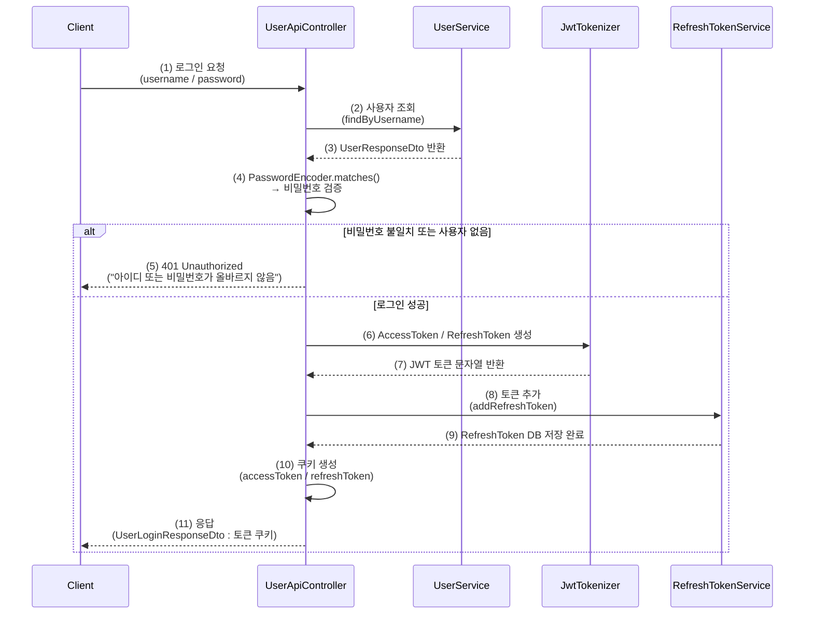
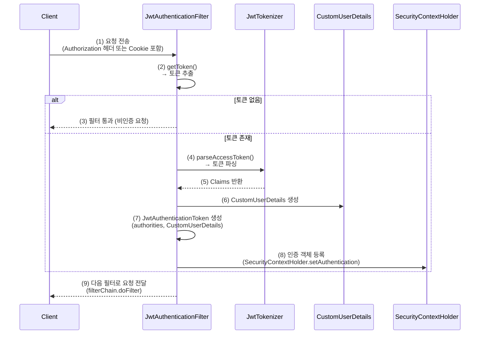
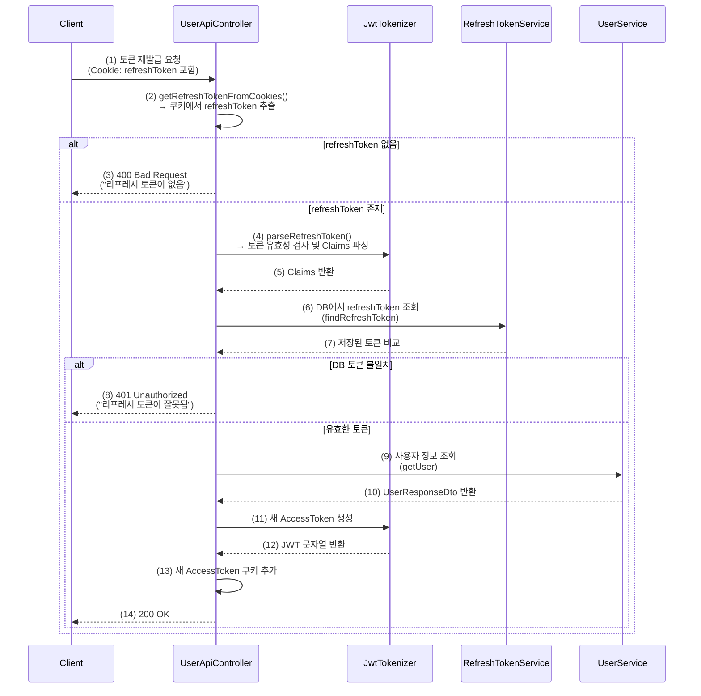
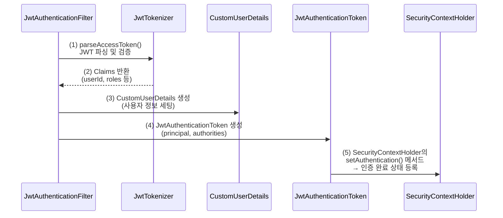
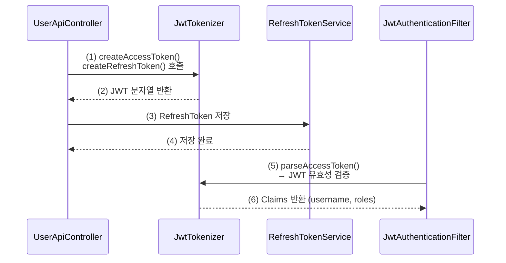

# [ 13주차 - 1112 ] 스터디 내용

```bash
    금일 커리큘럼
        ├ 09:00 ~ 12:00 backend 프로그래밍 (JWT 인증 흐름 심화 학습, JwtAuthenticationToken 구현)
        └ 13:00 ~ 18:00 backend 프로그래밍 (JwtTokenizer, JwtAuthenticationFilter, SecurityConfig, UserApiController)
```

## JWT 인증 흐름 심화 학습

* 전일에 다룬 RefreshToken 저장 기능에서 확장
* 실제 JWT 기반 인증 절차의 전 과정(토큰 생성 → 검증 → 인증객체 등록 → 필터체인)을 구현하고 검증 학습


### 디렉토리 구조

```bash
src/main/java/org/example/jwtexam
├── domain
│      ├── User.java
│      ├── Role.java
│      └── RefreshToken.java
│
├── dto
│      ├── UserLoginDto.java
│      ├── UserLoginResponseDto.java
│      └── UserResponseDto.java
│
├── repository
│      ├── UserRepository.java
│      ├── RoleRepository.java
│      └── RefreshTokenRepository.java
│
├── security
│      ├── CustomUserDetails.java
│      └── CustomUserDetailsService.java
│
├── service
│      ├── UserService.java
│      └── RefreshTokenService.java
│
├── config  # 이번 학습 작업
│      └── SecurityConfig.java
│
├── controller # 이번 학습 작업
│      └── UserApiController.java
│
└── jwt
       ├── exception
       │       ├── CustomAuthenticationEntryPoint.java
       │       └── JwtExceptionCode.java
       │
       ├── token # 이번 학습 작업
       │       └── JwtAuthenticationToken.java
       │
       ├── util # 이번 학습 작업
       │       └── JwtTokenizer.java
       │
       └── filter # 이번 학습 작업
               └── JwtAuthenticationFilter.java
```

### 주요 작업 내용

| 구분                          | 학습 내용                               |
| --------------------------- | ----------------------------------- |
| **JwtAuthenticationToken**  | Spring Security의 인증 객체를 JWT 기반으로 구현 |
| **JwtTokenizer**            | 토큰 생성, 파싱, 만료 검증 처리                 |
| **JwtAuthenticationFilter** | 요청마다 토큰 검증 및 인증객체 등록                |
| **SecurityConfig**          | JWT 필터를 시큐리티 체인에 통합, 세션 제거          |
| **UserApiController**       | 로그인 및 토큰 재발급 API 구현                 |


### 해당 JWT 인증 흐름

#### 1) 로그인 요청 및 토큰 발급 흐름

* `UserApiController` - /login API 호출 시
* 클라이언트는 username, password를 포함하여 요청



#### 2) 인증 필터 흐름

* `JwtAuthenticationFilter` - jwt 인증 관련 모든 요청에 대해 동작
* `SecurityConfig`의 시큐리티 필터 체인에 `JwtAuthenticationFilter` 인스턴스 등록상태



### 3) 토큰 재발급 흐름 (/api/refreshToken)

* `UserApiController` - /refreshToken API 호출 시
* 클라이언트는 쿠키에 저장된 refreshToken을 포함하여 요청



---

## 1. JwtAuthenticationToken 구현

> JWT 인증 객체 모델 (Authentication 구현체)

* AbstractAuthenticationToken : 스프링 시큐리티에서 제공하는 추상 클래스
    - 인증 토큰의 기본 기능을 제공

```java

public class JwtAuthenticationToken extends AbstractAuthenticationToken {
    private Object principal;     // 사용자 정보 (UserDetails)
    private Object credentials;   // 자격 증명 (보통 - 비밀번호, JWT 기반에서는 null)

    // 인증 완료 후 호출되는 생성자
    public JwtAuthenticationToken(Collection<? extends GrantedAuthority> authorities, Object principal, Object credentials) {
        super(authorities);
        this.principal = principal;
        this.credentials = credentials;
        setAuthenticated(true); //인증 완료상태
    }

    // 인증 전 호출되는 생성자 (JWT만 존재하는 상태)
    public JwtAuthenticationToken(String token) {
        super(null); //권한없음
        this.principal = null; //아직 사용자 정보 없음
        this.credentials = token;
        setAuthenticated(false);  //인증 전 상태
    }

    @Override
    public Object getCredentials() {
        return this.credentials;
    }

    @Override
    public Object getPrincipal() {
        return this.principal;
    }

```

### 핵심 포인트

* Spring Security의 AbstractAuthenticationToken을 상속받아 JWT 기반 인증 모델로 커스터마이징
* 증 전/후의 두 가지 상태를 생성자 분리로 관리
* 번호 기반 인증이 아니라, JWT를 검증하여 신뢰하기 때문에 `credentials`는 주로 `null` 처리

### 짚고 넘어가기

* `credentials` : 인증에 사용되는 자격 증명 정보
    - 일반적으로 비밀번호를 의미하지만, JWT 기반 인증에서는 토큰 자체가 자격 증명이므로 `null`로 처리

* `principal` : 인증된 사용자의 정보
    - UserDetails 객체가 주로 사용되며, 인증 후에 사용자 정보를 담음

* `authorities` : 사용자의 권한 정보
    - 인증 후에 사용자에게 부여된 권한 목록을 담음

* `SecurityContextHolder` : 스프링 시큐리티의 컨텍스트 저장소
    - 현재 인증된 사용자 정보를 보관하는 역할
    - `setAuthentication()` 메서드를 통해 `JwtAuthenticationToken` 객체를 저장

### 해당 로직의 역할

* `JwtAuthenticationToken`은 스프링 시큐리티에서 인증 정보를 담는 객체
* 즉, JWT 기반 로그인 이후 `SecurityContextHolder`에 저장되는 인증 객체의 형태를 정의
* 이 객체는 시큐리티 필터(**JwtAuthenticationFilter**)에서 생성되어,
* 사용자의 권한(**authorities**)과 정보(**principal**) 를 담고 인증 컨텍스트에 등록됨

#### 인증 전 / 후 상태 구분

* **인증전** : `JwtAuthenticationToken(String token)`
    - 로그인 요청 후, 아직 검증되지 않은 JWT를 가질 때
    - 자격 증명(**credentials**)만 존재, 사용자 정보(**principal**) 없음

* **인증후** : `wtAuthenticationToken(Collection<? extends GrantedAuthority> ...)`
    - JWT 유효성 검증 후, 사용자 정보 확인 완료 시
    - `CustomUserDetails` 등 사용자 정보 + 권한 정보 포함




---


## 2. JwtTokenizer 구현

> AccessToken과 RefreshToken을 각각 생성하고, 검증 및 파싱 기능을 제공

```java
@Component
@Slf4j
public class JwtTokenizer {
    private final byte[] accessSecret;
    private final byte[] refreshSecret;
    private final Long accessTokenExpiration;
    private final Long refreshTokenExpiration;

    public JwtTokenizer(
            @Value("${jwt.secretKey}") String accessSecret,
            @Value("${jwt.refreshKey}") String refreshSecret,
            @Value("${jwt.access-expiration-ss}") long accessExpSeconds,
            @Value("${jwt.refresh-expiration-ss}") long refreshExpSeconds
    ) {
        this.accessSecret = accessSecret.getBytes(StandardCharsets.UTF_8);
        this.refreshSecret = refreshSecret.getBytes(StandardCharsets.UTF_8);
        this.accessTokenExpiration = accessExpSeconds * 1000L;
        this.refreshTokenExpiration = refreshExpSeconds * 1000L;
    }


    // 시크릿 키
    private SecretKey getSignatureKey(byte[] secretKey) {
        return Keys.hmacShaKeyFor(secretKey);
        // return new SecretKeySpec(secretKey, "HmacSHA256");
    }

    // 토큰 파싱
    private Claims parseToken(String token, byte[] secret) {
        return Jwts.parser()
                .verifyWith(getSignatureKey(secret))
                .build()
                .parseSignedClaims(token)
                .getPayload();
    }

    // 액세스 토큰
    public String createAccessToken(
            Long id,
            String email,
            String name,
            String username,
            List<String> roles
    ) {
        return createToken(id,email,name,username,roles,accessTokenExpiration,accessSecret);
    }

    // 리플래시 토큰
    public String createRefreshToken(
            Long id,
            String email,
            String name,
            String username,
            List<String> roles
    ) {
        return createToken(id,email,name,username,roles,refreshTokenExpiration,refreshSecret);
    }

    // 토큰 생성
    public String  createToken(
            Long id,
            String email,
            String name,
            String username,
            List<String> roles,
            Long expire,
            byte[] secret
    ) {
        Date now = new Date();
        Date exp = new Date(now.getTime() + expire);
        return Jwts.builder()
                .subject(username)
                .claim("id", id)
                .claim("email", email)
                .claim("name", name)
                .claim("username", username)
                .claim("roles", roles)
                .issuedAt(now)
                .expiration(exp)
                .signWith(getSignatureKey(secret))
                .compact();
    }

    // 액세스 파싱
    public Claims parseAccessToken(String token) {
        return parseToken(token, this.accessSecret);
    }

    // 리플래시 파싱
    public Claims parseRefreshToken(String token) {
        return parseToken(token, this.refreshSecret);
    }

    // username 파싱
    public String getUserNameFromToken(String token) {
        if(token == null || !token.startsWith("Bearer ")) {
            throw new IllegalArgumentException("[getUserNameFromToken] 잘못된 형식임");
        }
        try {
            String jwt = token.substring(7);
            Claims claims = parseToken(jwt, accessSecret);
            return claims.get("username", String.class);
        } catch (ExpiredJwtException e) {
            log.warn("[getUserNameFromToken] 만료된 access 토큰 :: {}", e.getMessage());
            throw new RuntimeException(JwtExceptionCode.EXPRIED_TOKEN.getMessage());
        } catch (SignatureException | MalformedJwtException e) {
            log.warn("[getUserNameFromToken] 유효하지 않은 토큰 :: {}", e.getMessage());
            throw new RuntimeException(JwtExceptionCode.INVALID_TOKEN.getMessage());
        } catch (Exception e) {
            log.warn("[getUserNameFromToken] JWT 파싱중 그외 error :: {}", e.getMessage());
            throw new RuntimeException(JwtExceptionCode.UNKNOWN_ERROR.getMessage());
        }
    }

    public Long getAccessTokenExpiration() {
        return accessTokenExpiration;
    }

    public Long getRefreshTokenExpiration() {
        return refreshTokenExpiration;
    }
}
```

### 핵심 포인트

* JWT 생성과 검증(파싱)을 담당하는 유틸리티 클래스
* **AccessToken** / **RefreshToken**을 분리 관리
* Claim에 사용자 정보를 담고 **HMAC-SHA256**으로 서명
* subject는 username으로 설정해 인증 주체를 명확히 함
* `ExpiredJwtException`, `MalformedJwtException` 등 예외에 따른 로그 및 커스텀 처리 구현

### 짚고 넘어가기

* `createAccessToken()` : 단기 인증용 토큰 생성
* `createRefreshToken()` : 재발급용 장기 토큰 생성 (DB 저장)
* `parseToken()` : 서명 검증 및 Payload(Claims) 추출
* `getUserNameFromToken()` : JWT 헤더에서 username 추출 (Bearer 제거 후 처리)
* `getSignatureKey()` : SecretKey를 바이트 배열로 변환하여 키 생성

### 해당 로직의 역할

* JWT 기반 인증에서 핵심적인 역할을 하는 토큰 발급기 (Token Provider)
* 컨트롤러나 서비스 단에서 인증 요청 시 **AccessToken** / **RefreshToken**을 발급
* 필터(`JwtAuthenticationFilter`)에서 토큰 유효성 검증 시 이 유틸리티를 사용
* **Stateless** 환경(세션 미사용)에서 사용자 식별과 권한 부여의 근거로 활용됨



---

## 3. JwtAuthenticationFilter 구현

> 모든 요청에 대해 JWT의 유효성을 검증하고, 인증 정보를 SecurityContextHolder에 등록하는 필터

* `OncePerRequestFilter` : 스프링 시큐리티에서 제공하는 추상 필터 클래스
    - 요청당 한 번만 실행되도록 보장

```java

@RequiredArgsConstructor
@Slf4j
public class JwtAuthenticationFilter extends OncePerRequestFilter { // OncePerRequestFilter : 전체요청 중 한번만
    private final JwtTokenizer jwtTokenizer;

    @Override
    protected void doFilterInternal(
            HttpServletRequest request,
            HttpServletResponse response,
            FilterChain filterChain
    ) throws ServletException, IOException {
        log.info("[JwtAuthenticationFilter] ======= start : url = {}", request.getRequestURI());
        
        // 토큰 얻어서 파싱 후 필요한정보 찾아서 authentication 객체를 시큐리티컨텍스트홀더에 담아야함
        String token = getToken(request);

        if(StringUtils.hasText(token)) {
            try {
                getAuthentication(token);
            } catch (ExpiredJwtException e) {
                request.setAttribute("exception", JwtExceptionCode.EXPRIED_TOKEN.getCode());
                log.error("[Exception] expired Token :: {}", e.getMessage());
                throw new BadCredentialsException(JwtExceptionCode.EXPRIED_TOKEN.getMessage(), e);
            } catch (UnsupportedJwtException e) {
                request.setAttribute("exception", JwtExceptionCode.UNSUPPORTED_TOKEN.getCode());
                log.error("[Exception] unsupported Token :: {}", e.getMessage());
                throw new BadCredentialsException(JwtExceptionCode.UNSUPPORTED_TOKEN.getMessage(), e);
            } catch (MalformedJwtException e) {
                request.setAttribute("exception", JwtExceptionCode.INVALID_TOKEN.getCode());
                log.error("[Exception] invalid Token :: {}", e.getMessage());
                throw new BadCredentialsException(JwtExceptionCode.INVALID_TOKEN.getMessage(), e);
            } catch (IllegalArgumentException e) {
                request.setAttribute("exception", JwtExceptionCode.NOT_FOUND_TOKEN.getCode());
                log.error("[Exception] not found Token :: {}", e.getMessage());
                throw new BadCredentialsException(JwtExceptionCode.NOT_FOUND_TOKEN.getMessage(), e);
            }  catch (Exception e) {
                log.error("[Exception] jwt filter error :: {} ", e.getMessage());
                throw new BadCredentialsException("jwt filter Exception", e);
            }
        }
        
        filterChain.doFilter(request,response);
        log.info("[JwtAuthenticationFilter] ======= end");
    }

    // 토큰 Get
    private String getToken(HttpServletRequest request) {

        // header에서 액세스 토큰 찾아봄
        String authorization = request.getHeader("Authorization");
        if (StringUtils.hasText(authorization) && authorization.startsWith("Bearer ")) {
            return authorization.substring(7);
        }

        // 액세스 토큰이 쿠키를 통해서 요청했을 때
        Cookie[] cookies = request.getCookies();
        if(cookies != null) {
            for (Cookie cookie : cookies) {
                if("accessToken".equals(cookie.getName())) {
                    return cookie.getValue();
                }
            }
        }

        return null;
    }

    // 어센티케이션 객체
    private void getAuthentication(String token) {
        // Cookie[] cookies = request.getCookies();
        Claims claims = jwtTokenizer.parseAccessToken(token);
        String subject = claims.getSubject();
        String username = claims.get("username", String.class);
        String name = claims.get("name", String.class);
        String email = claims.get("email", String.class);
        List<GrantedAuthority> authorities = getAuthorities(claims);

        // 정보를 유저디테일 & 어센티케이션 생성
        CustomUserDetails customUserDetails = new CustomUserDetails(
                username, name, email,
                authorities.stream()
                        .map(GrantedAuthority::getAuthority)
                        .map(auth-> auth.replace("ROLE_", ""))
                        // .toList()
                        .collect(Collectors.toList())
        );
        Authentication authentication =
                new JwtAuthenticationToken(authorities, customUserDetails, null);

        // 시큐리티컨텍스트홀더에 담기
        SecurityContextHolder.getContext().setAuthentication(authentication);
    }

    // 권한정보 변환 (string -> 시큐리티형태)
    private List<GrantedAuthority> getAuthorities(Claims claims) {
        List<String> roles = (List<String>) claims.get("roles");
        List<GrantedAuthority> authorities = new ArrayList<>();
        for (String role : roles) {
            authorities.add(new SimpleGrantedAuthority(role));
        }
        return authorities;
    }
}
```

### 핵심 포인트

* OncePerRequestFilter를 상속받아 요청마다 단 한 번 실행
* 토큰을 Header(Authorization) 또는 Cookie(accessToken) 에서 추출
* JWT 유효성 검증 → Claims 파싱 → 사용자 정보(CustomUserDetails) 구성
* `SecurityContextHolder`에 `JwtAuthenticationToken`을 등록하여 인증 상태로 전환
* 예외 상황(만료, 위조, 포맷 오류)에 따른 세부 로그 출력 및 예외 코드 전달

### 짚고 넘어가기

* `getToken()` : 헤더 또는 쿠키에서 AccessToken 추출
* `getAuthentication()` : JWT 파싱 → 사용자 정보 변환 → 인증 객체 등록
* `getAuthorities()` : JWT 내부 roles → GrantedAuthority 변환
* `SecurityContextHolder` : 인증 정보를 전역 Context에 저장

### 해당 로직의 역할

* 스프링 시큐리티의 필터 체인 중 UsernamePasswordAuthenticationFilter 앞단에 삽입
* 클라이언트 요청이 들어올 때마다 토큰을 확인하고 인증 여부를 결정
* 인증 완료 시, 이후 컨트롤러에서 `@AuthenticationPrincipal` 등으로 사용자 정보 접근 가능

---


### 4. SecurityConfig 설정

```java
@Configuration
@EnableWebSecurity
@RequiredArgsConstructor
public class SecurityConfig {
    private final JwtTokenizer jwtTokenizer;
    private final CustomAuthenticationEntryPoint authenticationEntryPoint;

    @Bean
    public SecurityFilterChain securityFilterChain(HttpSecurity http) throws Exception {
        http
                .authorizeHttpRequests(auth -> auth
                        .requestMatchers("/api/login", "/api/refreshToken").permitAll()
                        .anyRequest().authenticated()
                )
                // JwtAuthenticationFilter는 new로 주입하는 이유?
                // 이미 필터체인이 @Bean으로 주입되고 있기에 인스턴스로 주입하여 작동
                .addFilterBefore(new JwtAuthenticationFilter(jwtTokenizer), UsernamePasswordAuthenticationFilter.class)
                .formLogin(form -> form.disable())
                .sessionManagement(session -> session
                        .sessionCreationPolicy(SessionCreationPolicy.STATELESS) // 세션 사용 안함
                )
                .csrf(csrf -> csrf.disable())
                // CORS 설정 활성화
                .cors(cors -> cors.configurationSource(corsConfigurationSource()))
                // 예외 처리 설정
                .exceptionHandling(exception -> exception
                        .authenticationEntryPoint(authenticationEntryPoint)
                );
        return http.build();
    }

    @Bean
    public CorsConfigurationSource corsConfigurationSource() {
        // CORS 설정
        CorsConfiguration configuration = new CorsConfiguration();
        configuration.setAllowCredentials(true); // 쿠키 허용
        // 허용할 출처 설정
        configuration.setAllowedOriginPatterns(List.of("http://localhost:8080", "http://localhost:3000"));
        configuration.setAllowedHeaders(List.of("*")); // 모든 헤더 허용
        configuration.setAllowedMethods(List.of("GET", "POST", "PUT", "DELETE", "OPTIONS")); // 모든 메서드 허용
        configuration.setMaxAge(3600L); // 캐싱 시간 설정

        // CORS 설정 소스
        UrlBasedCorsConfigurationSource source = new UrlBasedCorsConfigurationSource();
        source.registerCorsConfiguration("/**", configuration);
        return source;
    }

    @Bean
    public PasswordEncoder passwordEncoder() {
        return new BCryptPasswordEncoder();
    }
}
```

### 핵심 포인트

* JwtAuthenticationFilter를 시큐리티 필터체인에 등록
* SessionCreationPolicy.STATELESS → 세션 저장 X
* formLogin() / csrf() 비활성화 (REST 환경에 맞게)
* CustomAuthenticationEntryPoint를 통해 인증 예외 처리
* CORS 설정으로 프론트엔드(3000번 포트) 허용

### 짚고 넘어가기

* JWT 기반 인증은 세션을 사용하지 않는 구조이므로 STATELESS로 설정
* `.addFilterBefore()`로 등록된 JwtAuthenticationFilter는 모든 요청 전 실행
* `.exceptionHandling()`으로 인증 예외 발생 시 CustomAuthenticationEntryPoint에서 처리

---

### 5. UserApiController 설정

> 로그인 요청 및 토큰 재발급 처리 설정

```java
@RestController
@RequiredArgsConstructor
@RequestMapping("/api")
@Slf4j
public class UserApiController {
    private final UserService userService;
    private final RefreshTokenService refreshTokenService;
    private final JwtTokenizer jwtTokenizer;
    private final PasswordEncoder passwordEncoder;

    // 로그인 API
    @PostMapping("/login")
    public ResponseEntity<?> login(
            @RequestBody @Valid UserLoginDto userLoginDto,
            BindingResult result,
            HttpServletResponse response
    ) {
        if (result.hasErrors()) {
            return ResponseEntity.badRequest().body(result.getAllErrors());
        }
        // 사용자 조회
        UserResponseDto user = userService.findByUsername(userLoginDto.getUsername()).orElse(null);
        // 아이디 또는 비밀번호 검증
        if (user == null || !passwordEncoder.matches(userLoginDto.getPassword(), user.getPassword())) {
            return ResponseEntity.status(HttpStatus.UNAUTHORIZED).body("아이디 또는 비밀번호가 올바르지 않음");
        }
        // 토큰 생성
        String accessToken = jwtTokenizer.createAccessToken(
                user.getId(), user.getEmail(), user.getName(), user.getUsername(), user.getRoles());
        String refreshToken = jwtTokenizer.createRefreshToken(
                user.getId(), user.getEmail(), user.getName(), user.getUsername(), user.getRoles());

        // 리프레시 엔티티 생성 후 토큰 저장
        RefreshToken refreshTokenEntity = new RefreshToken();
        refreshTokenEntity.setToken(refreshToken);
        refreshTokenEntity.setUserId(user.getId());
        refreshTokenService.addRefreshToken(refreshTokenEntity);

        // 쿠키에 토큰 저장 방식
        addTokenCookie(response, "accessToken", accessToken, jwtTokenizer.getAccessTokenExpiration());
        addTokenCookie(response, "refreshToken", refreshToken, jwtTokenizer.getAccessTokenExpiration());

        // 토큰 응답 DTO 생성
        UserLoginResponseDto userLoginResponseDto = UserLoginResponseDto.builder()
                .accessToken(accessToken)
                .refreshToken(refreshToken)
                .userId(user.getId())
                .name(user.getName())
                .build();

        return ResponseEntity.ok(userLoginResponseDto);
    }

    // 토큰 재발급 API
    @PostMapping("/refreshToken")
    public ResponseEntity<?> refreshToken(HttpServletRequest request, HttpServletResponse response) {
        String token = getRefreshTokenFromCookies(request);
        if (token == null) {
            return ResponseEntity.badRequest().body("리프레시 토큰이 없음");
        }

        try {
            // 토큰 파싱
            Claims claims = jwtTokenizer.parseRefreshToken(token);
            // DB 토큰과 비교
            RefreshToken dbToken = refreshTokenService.findRefreshToken(token)
                    .orElseThrow(() -> new IllegalArgumentException("토큰이 없음"));
            if (!token.equals(dbToken.getToken())) {
                return ResponseEntity.status(HttpStatus.UNAUTHORIZED).body("리프레시 토큰이 잘못됨");
            }
            // 사용자 정보 조회
            Long userId = claims.get("id", Long.class);
            UserResponseDto user = userService.getUser(userId)
                    .orElseThrow(() -> new IllegalArgumentException("사용자를 찾지 못함"));

            List<String> roles = claims.get("roles", List.class);
            // 새 액세스 토큰 생성
            String accessToken = jwtTokenizer.createAccessToken(
                    userId, user.getEmail(), user.getName(), user.getUsername(), roles);
            
            // 새 액세스 토큰 쿠키에 추가
            addTokenCookie(response, "accessToken", accessToken, jwtTokenizer.getAccessTokenExpiration());
            
            // 응답 DTO 생성
            UserLoginResponseDto responseDto = UserLoginResponseDto.builder()
                    .accessToken(accessToken)
                    .refreshToken(token)
                    .name(user.getName())
                    .userId(user.getId())
                    .build();

            return ResponseEntity.ok(responseDto);
        } catch (Exception e) { // 토큰 파싱 오류 등
            log.error("Refresh token error: {}", e.getMessage());
            return ResponseEntity.status(HttpStatus.UNAUTHORIZED).body("Refresh token invalid or expired");
        }
    }

    // 쿠키에 토큰 추가 메서드
    private void addTokenCookie(HttpServletResponse response, String name, String value, Long expireCount) {
        Cookie cookie = new Cookie(name, value);
        cookie.setHttpOnly(true);
        cookie.setPath("/");
        cookie.setMaxAge(Math.toIntExact(expireCount / 1000));
        response.addCookie(cookie);
    }

    // 쿠키에서 리프레시 토큰 추출 메서드
    private String getRefreshTokenFromCookies(HttpServletRequest request) {
        Cookie[] cookies = request.getCookies();
        if (cookies != null) {
            for (Cookie cookie : cookies) {
                if ("refreshToken".equals(cookie.getName())) {
                    return cookie.getValue();
                }
            }
        }
        return null;
    }
}
```

### 핵심 포인트

* **/api/login** : 사용자 검증 후 AccessToken + RefreshToken 동시 발급
* **/api/refreshToken** : RefreshToken 검증 후 새 AccessToken 재발급
* RefreshToken은 DB에 저장하여 위조·탈취 대비
* JWT는 쿠키(HttpOnly)로 응답 → XSS 방지 강화
* 응답 시 AccessToken은 짧게, RefreshToken은 장기로 설정

### 짚고 넘어가기

* AccessToken은 빠르게 만료되므로 주기적 재발급 구조 필요
* RefreshToken은 DB와 쿠키에 동시에 존재해야 정상 인증
* PasswordEncoder.matches()는 평문 비밀번호와 암호화 비밀번호 비교
* JWT 재발급 시 기존 RefreshToken은 재사용하거나 갱신 정책에 따라 변경 가능

### 최종 정리

```bash
UserApiController (로그인 및 발급)
→ JwtAuthenticationFilter (요청 검증)
→ JwtAuthenticationToken (인증 저장)
→ SecurityContextHolder (인증 유지)
→ SecurityConfig (환경 구성)
```

---


## 6. JWT 인증 플로우의 검증용 HTTP 테스트

```http
### 로그인 성공 (토큰 발급) 
# - 예상결과: 200 OK
POST http://localhost:8080/api/login
Content-Type: application/json

{
  "username": "star1431",
  "password": "star1431"
}

> 

### 로그인 실패 (비밀번호 오류) 
# - 예상결과: 401 Unauthorized
POST http://localhost:8080/api/login
Content-Type: application/json

{
  "username": "star1431",
  "password": "wrong"
}

### 쿠키로 인증 요청
# - 예상결과 : 200 OK
GET http://localhost:8080/api/welcome
Cookie: accessToken={{accessToken}}

### 헤더로 인증 요청
# - 예상결과 : 200 OK
GET http://localhost:8080/api/welcome
Authorization: Bearer {{accessToken}}

### 인증 없이 접근
# - 예상결과 : 401 Unauthorized
GET http://localhost:8080/api/welcome

### RefreshToken으로 재발급 요청
# - 예상결과 : 200 OK
POST http://localhost:8080/api/refreshToken
Cookie: refreshToken={{refreshToken}}

### ---------------------------------------

### AccessToken 만료 후 요청
# 필수! => access-expiration-ms를 10초(10000L)로 설정 후 테스트
# - 예상결과 : 401 Unauthorized
GET http://localhost:8080/api/welcome
Cookie: accessToken={{accessToken}}

### RefreshToken으로 재발급 요청
# - AccessToken 만료상태에서 진행
# - 예상결과 : 200 OK
# - 새로운 accessToken 쿠키가 갱신됨
POST http://localhost:8080/api/refreshToken
Cookie: refreshToken={{refreshToken}}

> 

### 재발급 받은 AccessToken으로 API 요청
# - 예상결과 : 200 OK
# - 정상적으로 "Hello World" 응답
GET http://localhost:8080/api/welcome
Cookie: accessToken={{accessToken}}
```


