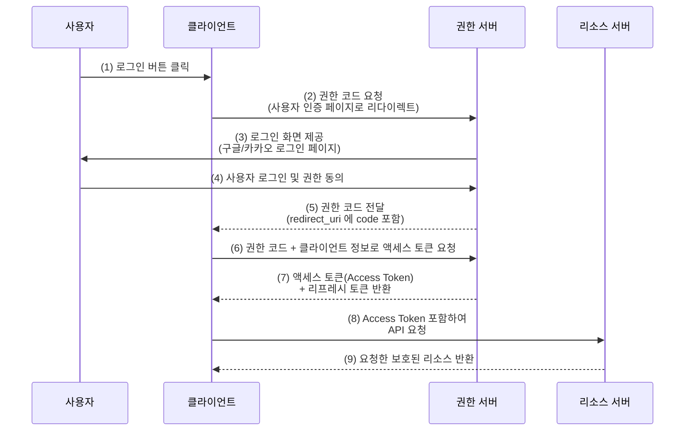
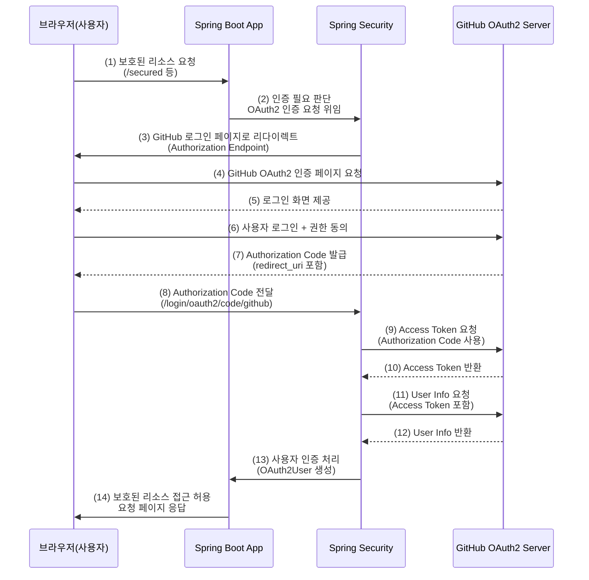
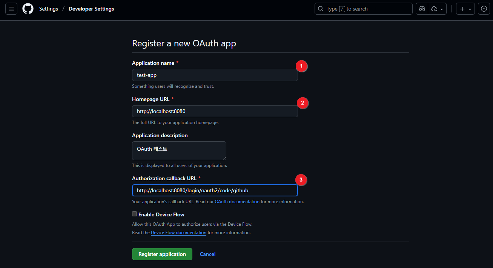
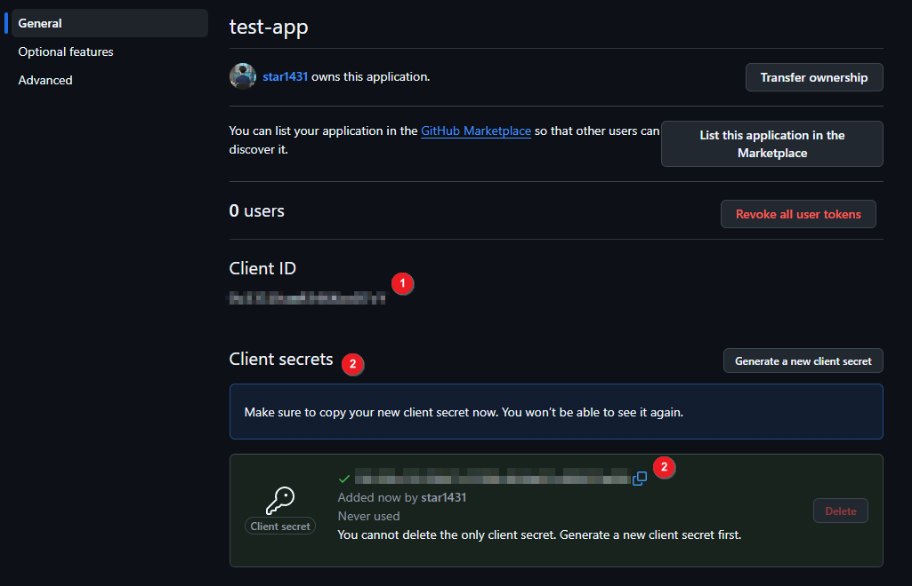
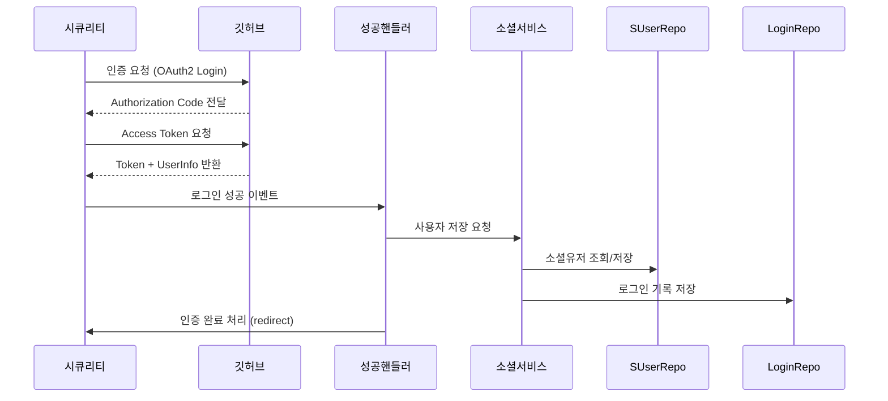
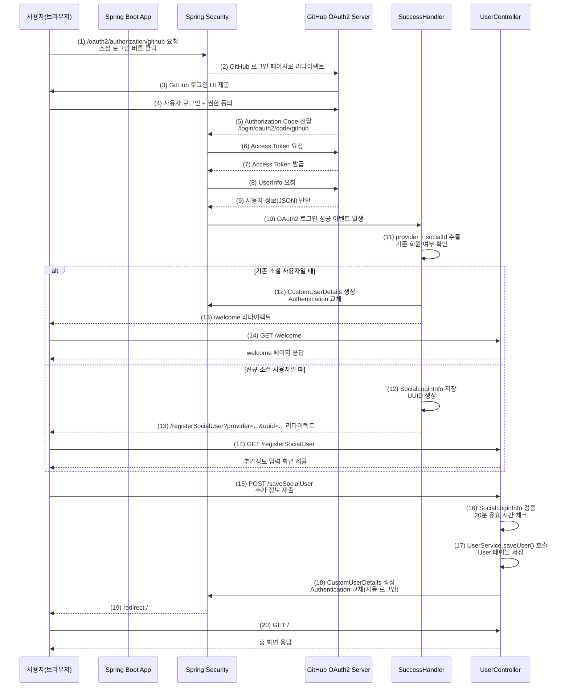

# [ 13주차 - 1113 ] 스터디 내용

```bash
    금일 커리큘럼
        ├ 09:00 ~ 12:00 backend 프로그래밍 (OAuth2.0 개념, Github OAuth2.0 등록, Spring Boot 에서 적용 확인)
        └ 13:00 ~ 18:00 backend 프로그래밍 (OAuth2.0 로그인 적용 구현)
```

## 1. OAuth2.0 개념

> OAuth2.0 : 인증 및 권한 부여를 위한 개방형 표준 프로토콜

- OAuth2.0은 제 3자 애플리케이션이 사용자 리소스에 접근할 수 있도록 허용하는 인증 및 권한 부여 프레임워크
- OAuth2.0은 다양한 인증 방식을 제공하며, 주로 액세스 토큰을 사용하여 리소스에 대한 접근 권한을 부여
- OAuth2.0은 클라이언트, 리소스 소유자, 권한 서버, 리소스 서버의 네 가지 주요 역할로 구성됨


### OAuth2.0 주요 구성 요소

1. **클라이언트(Client)**
   - 리소스 소유자를 대신하여 리소스 서버에 접근하려는 애플리케이션
   - 예: 웹 애플리케이션, 모바일 앱 등

2. **리소스 소유자(Resource Owner)**
   - 보호된 리소스에 대한 접근 권한을 가진 사용자
    - 예: 사용자 계정

3. **권한 서버(Authorization Server)**
   - 클라이언트의 인증을 처리하고 액세스 토큰을 발급하는 서버
   - 예: 구글, 페이스북 등의 OAuth2.0 제공자

4. **리소스 서버(Resource Server)**
   - 보호된 리소스를 호스팅하는 서버로, 액세스 토큰을 검증하고 리소스에 대한 접근을 허용
   - 예: API 서버 등

5. **액세스 토큰(Access Token)**
   - 클라이언트가 리소스 서버에 접근할 때 자신을 증명하기 위해 사용

6. **리프레시 토큰(Refresh Token)**
   - 액세스 토큰 만료 시 새로운 토큰 발급 요청에 사용

7. **권한 부여(Authorization Grant)**
    - 클라이언트가 권한 서버로부터 액세스 토큰을 얻기 위해 사용하는 방식

- **주요 권한 부여 유형**
    - 권한코드 : 클라이언트가 권한 서버로부터 권한 코드를 받아 액세스 토큰을 요청
    - 암시적 : 클라이언트가 직접 액세스 토큰을 받음
    - 클라이언트 자격 증명 : 클라이언트가 자신의 자격 증명을 사용하여 액세스 토큰을 요청
    - 리소스 소유자 비밀번호 자격 증명 : 클라이언트가 사용자 이름과 비밀번호를 사용하여 액세스 토큰을 요청

### OAuth2.0 인증 흐름

- 권한 코드 방식



#### 인증 흐름 핵심 포인트

- 권한 코드 방식은 가장 안전한 OAuth2.0 방식이며, 서버 간 통신을 통해 토큰을 주고 받음
- 사용자는 직접 클라이언트에게 비밀번호를 넘기지 않고 권한 서버에서만 인증 수행
- 클라이언트(Client)는 먼저 Authorization Code를 받고, 이후 이 코드로 Access Token을 요청
- 액세스 토큰은 보호된 API(리소스 서버)에 접근할 때 인증 수단으로 사용됨
- 리프레시 토큰을 사용하여 만료된 액세스 토큰을 재발급 받을 수 있음
- 이 과정으로 클라이언트는 사용자의 민감한 정보를 직접 다루지 않고도 인증된 데이터 사용 가능


### Security와 GitHub OAuth2.0의 인증 흐름

- Spring Security와 GitHub OAuth2.0 활용 시




#### 인증 흐름 핵심 포인트

- **Security**는 보호 리소스 요청 시 OAuth2 로그인 플로우를 자동 처리
- GitHub OAuth2 서버가 발급한 Authorization Code → Access Token → User Info 순으로 정보를 획득함
- **Security**는 User Info를 기반으로 OAuth2User, OAuth2AuthenticationToken 등을 생성하고 SecurityContext에 저장
- 인증이 끝나면 Spring Boot는 최초 요청했던 URL로 리다이렉트하여 정상적으로 리소스를 반환
- 개발자는 별도의 로그인 로직을 작성할 필요 없이 **설정 파일(yaml/properties)**과 **OAuth2UserService** 커스텀 정도만 작업됨
- 실제 인증은 GitHub에서 처리되고, **Security**는 토큰을 받아 내부 인증 처리만 담당


---

## 2. Github OAuth2.0 등록

### 2.1 깃허브 OAuth2.0 애플리케이션 등록

* Settings -> Developer settings -> OAuth Apps -> New OAuth App




* **1번** : 해당 프로젝트 명
* **2번** : 해당 프로젝트 URL 메인
* **3번** : 콜백 URL


### 2.2 깃허브 OAuth2.0 발급된 정보 확인

* Client secret 에서 [Generate new client secret] 클릭
* 발급된 Client ID, Client Secret 정보 확인




* **Client ID** : OAuth2.0 애플리케이션 등록 시 발급된 고유 ID
* **Client Secret** : OAuth2.0 애플리케이션 등록 시 발급된 비밀 키


### 2.3 해당 정보 시스템 환경변수 등록

#### Windows 환경변수 등록

1. [ctrl+r]에서 sysdm.cpl 입력 후 [확인] 클릭
2. [고급] 탭 -> [환경 변수(N)...] 클릭 
3. 시스템 변수(S) 영역에서 [새로 만들기(N)...] 클릭
4. 변수 이름 : GITHUB_CLIENT_ID / 변수값 : 발급된 Client ID 입력
5. 변수 이름 : GITHUB_CLIENT_SECRET / 변수값 : 발급된 Client Secret 입력
6. [확인] 클릭하여 환경변수 등록 완료


#### Mac / Linux 환경변수 등록

1. 터미널에서 아래 명령어 입력

```bash
export GITHUB_CLIENT_ID=발급된_Client_ID
export GITHUB_CLIENT_SECRET=발급된_Client_Secret
```

2. 터미널 재실행 또는 source 명령어로 환경변수 적용

```bash
source ~/.bashrc
```

3. 터미널에서 아래 명령어로 환경변수 등록 확인

```bash
echo $GITHUB_CLIENT_ID
echo $GITHUB_CLIENT_SECRET
```


### 2.4 Spring Boot 설정 파일에 OAuth2.0 정보 등록

* application.yml 또는 application.properties 파일에 아래와 같이 등록

```yaml
# application.yml
spring:
  security:
    oauth2:
      client:
        registration:
          github:
            client-id: ${GITHUB_CLIENT_ID}
            client-secret: ${GITHUB_CLIENT_SECRET}
            scope:
              - read:user
              - user:email
```

```bash
# application.properties
spring.security.oauth2.client.registration.github.client-id=${GITHUB_CLIENT_ID}
spring.security.oauth2.client.registration.github.client-secret=${GITHUB_CLIENT_SECRET}
spring.security.oauth2.client.registration.github.scope=read:user,user:email
```

### 2.5 gradle 의존성 추가

* build.gradle 파일에 Spring Security 및 OAuth2 클라이언트 의존성 추가

```groovy
dependencies {
    implementation 'org.springframework.boot:spring-boot-starter-security'
    implementation 'org.springframework.boot:spring-boot-starter-oauth2-client'
}
```

---

## 3. Spring Boot 에서 적용 확인

* src/main/java/... 에서 메인 클래스 작성

```java
// 실행할 메인 클래스
@SpringBootApplication
public class Oauth2LoginApplication {
    public static void main(String[] args) {
        SpringApplication.run(Oauth2LoginApplication.class, args);
    }
}
```

* src/test/java/... 에서 테스트 코드 작성 후 환경변수 주입 확인

```java
@SpringBootTest
public class EnvPrintTest {

    @Value("${GITHUB_CLIENT_ID}")
    private String GITHUB_CLIENT_ID;

    @Value("${GITHUB_CLIENT_SECRET}")
    private String GITHUB_CLIENT_SECRET;


    @Test
    void contextLoads() {
        System.out.println("GITHUB_CLIENT_ID:" + GITHUB_CLIENT_ID);
        System.out.println("GITHUB_CLIENT_SECRET:" + GITHUB_CLIENT_SECRET);
    }
}
```

실행해서 환경변수 값이 정상 출력되는지 확인 필요


---

## 4. OAuth2.0 로그인 적용 구현

### 4.1 디렉토리 구조 및 흐름

```bash
src/main/java/org/example/oauthexam
    │
    ├── OAuthApp.java                        # Spring Boot 메인
    │
    ├── config
    │   ├── AppConfig.java                   # PasswordEncoder, ModelMapper 등 Bean 등록
    │   └── SecurityConfig.java              # OAuth2 Login 설정 핵심
    │
    ├── controller
    │   └── UserController.java              # 로그인 후 이동, welcome 페이지
    │
    ├── domain
    │   ├── User.java                        # 일반 사용자 엔티티
    │   ├── Role.java                        # 권한 엔티티
    │   ├── SocialUser.java                  # 소셜 사용자 계정 (GitHub 사용자)
    │   └── SocialLoginInfo.java             # 소셜 로그인 기록
    │
    ├── dto
    │   └── SocialUserRequestDto.java        # GitHub 유저정보 DTO
    │
    ├── repository
    │   ├── UserRepository.java              # User 조회
    │   ├── RoleRepository.java              # Role 조회
    │   ├── SocialUserRepository.java        # SocialUser 조회
    │   └── SocialLoginInfoRepository.java   # 소셜 로그인 기록 저장
    │
    ├── security
    │   ├── CustomUserDetails.java           # UserDetails 구현체(일반 로그인용)
    │   └── CustomOAuth2AuthenticationSuccessHandler.java
    │                                        # OAuth 로그인 성공 후 핵심 처리
    │
    └── service
        ├── UserService.java                 # 일반 회원 관련 로직
        ├── SocialUserService.java           # 소셜 사용자 저장/업데이트 핵심
        └── SocialLoginInfoService.java      # 로그인 기록 저장 SERVICE
```

```bash
사용자 요청 → Spring Security(OAuth2Login) → GitHub 로그인 → Callback
      → CustomOAuth2AuthenticationSuccessHandler
            → SocialUserService
                  → SocialUserRepository
                  → SocialLoginInfoRepository
      → 인증 완료 후 리다이렉트
```

#### 핵심 구현 파일

* SocialUser : GitHub 사용자 엔티티
* socialLoginInfo : 소셜 로그인 기록 엔티티
* CustomUserDetails : UserDetails 구현체 (일반 로그인용)
* CustomOAuth2AuthenticationSuccessHandler : OAuth2 로그인 성공 후 처리

#### 인증 흐름



#### 주요 클래스 매핑

| 다이어그램 이름              | 실제 클래스명                                    |
| --------------------- | ------------------------------------------ |
| **시큐리티**              | `SecurityConfig`                           |
| **깃허브**               | GitHub OAuth Server                        |
| **성공핸들러**             | `CustomOAuth2AuthenticationSuccessHandler` |
| **소셜서비스**             | `SocialUserService`                        |
| **소셜저장소 (SUserRepo)** | `SocialUserRepository`                     |
| **기록저장소 (LoginRepo)** | `SocialLoginInfoRepository`                |

#### 작업 흐름 순서

1. **엔티티 설계**
    - 소셜로그인 관련 엔티티 필요
    - **SocialUser** : GitHub 계정 자체를 저장하는 엔티티
    - **SocialLoginInfo** : 로그인 기록 저장하는 엔티티

2. **Repository 작성**
    - 엔티티 저장/조회용 Repository 생성
    - **SocialUserRepository**
    - **SocialLoginInfoRepository**

3. **서비스(Service) 작성**
    - 소셜 로그인 처리 핵심 비즈니스 로직 작성
    - **SocialUserService** : 소셜유저 조회/저장/업데이트
    - **SocialLoginInfoService** : 로그인 기록 저장

4. **성공 핸들러 구현**
    - OAuth2 로그인 성공 시 실행되는 후처리 로직 작성
    - **CustomOAuth2AuthenticationSuccessHandler**
    - GitHub 사용자 정보 파싱 → DTO 변환 → 서비스 호출 → redirect

5. **Spring Security 설정**
    - OAuth2 Login 기능 활성화 + 성공 핸들러 연결
    - **SecurityConfig**
    - `.oauth2Login().successHandler(...)` 등록

6. **DTO 작성**
    - GitHub UserInfo(JSON) → 내부 구조로 변환할 DTO 준비
    - **SocialUserRequestDto**

7. **Controller 작성**
    - 인증 완료 후 이동할 페이지 처리
    - **UserController** (ex. /welcome)

---

### 4.2 소셜 로그인 관련 엔티티

* OAuth2.0 GitHub 로그인을 처리하기 위해 소셜 사용자 및 로그인 기록 엔티티 필요함

#### SocialUser 엔티티

* 소셜 사용자 계정 정보 (github)
* 소셜 고유 id 등 기준으로 식별

<details>
<summary><strong>SocialUser.java</strong></summary>

```java
@Entity
@Getter
@Setter
public class SocialUser {

    @Id
    @GeneratedValue(strategy = GenerationType.IDENTITY)
    private Long id;

    private String socialId;      // GitHub 고유 ID
    private String username;      // GitHub 계정 이름(login)
    private String provider;      // github, google 등 OAuth Provider
    private String email;         // GitHub 이메일
    private String avatarUrl;     // GitHub 프로필 이미지 URL
}
```

</details>

#### SocialLoginInfo 엔티티

* 소셜 로그인 기록을 저장하는 엔티티
* 로그인 시마다 한 줄씩 기록됨
* UUID는 추가 정보 입력 페이지 접근을 위한 임시 키 역할
* createdAt 은 소셜 로그인 시각 기록

<details><summary><strong>SocialLoginInfo.java</strong></summary>

```java
@Entity
@Table(name = "social_login_info")
@Getter
@Setter
public class SocialLoginInfo {

    @Id
    @GeneratedValue(strategy = GenerationType.IDENTITY)
    private Long id;

    private String provider;      // github 등 Provider 정보
    private String socialId;      // GitHub 고유 사용자 ID
    private LocalDateTime createdAt; // 소셜 로그인 시각
    private String uuid;             // 추가 정보 페이지 접근용 임시 UUID

    public SocialLoginInfo() {
        this.createdAt = LocalDateTime.now();          // 로그인 시간 기록
        this.uuid = UUID.randomUUID().toString();      // 임시 인증용 UUID 생성
    }
}
```

</details>

---

### 4.3 Repository 작성

* 소셜 로그인 엔티티 관련 레포지 계층 작성

#### SocialUserRepository

* `SocialUser` 엔티티를 조회·저장하는 Repository
* socialId 기준으로 GitHub 소셜 계정을 조회하기 위해 `findBySocialId()` 메서드를 정의

<details>
<summary><strong>SocialUserRepository.java</strong></summary>

```java
@Repository
public interface SocialUserRepository extends JpaRepository<SocialUser, Long> {
    // socialId + provider 기준으로 SocialUser 조회
    Optional<SocialUser> findBySocialIdAndProvider(String socialId, String provider);
}
```

</details>


#### SocialLoginInfoRepository

* 소셜 로그인 기록을 저장하는 Repository
* 로그인 기록을 읽거나 저장하는 데 사용됨

<details> <summary><strong>SocialLoginInfoRepository.java</strong></summary>

```java
@Repository
public interface SocialLoginInfoRepository extends JpaRepository<SocialLoginInfo, Long> {
}
```
</details>


### 4.4 Service 작성

* SocialUserService 
    - GitHub에서 내려온 사용자 정보를 저장하거나 업데이트
* SocialLoginInfoService
    - 소셜 사용자 최초 로그인 시 로그인 기록 저장
* UserService
    - 최종적으로 우리 서비스(User 테이블)에 가입 처리


#### SocialLoginInfoService

* 소셜 사용자 정보 저장/수정 서비스

<details>
<summary><strong>SocialUserService.java</strong></summary>


```java
@Service
@RequiredArgsConstructor
public class SocialUserService {

    private final SocialUserRepository socialUserRepository;

    /**
     * 소셜 사용자 정보 저장/수정
     *
     * - GitHub에서 내려온 정보를 SocialUser 테이블에 저장
     * - 기존 사용자면 update (프로필 변경에 대응)
     * - 처음이면 신규 저장 (insert)
     */
    @Transactional
    public SocialUser saveOrUpdateUser(String socialId,
                                       String provider,
                                       String username,
                                       String email,
                                       String avatarUrl) {

        // 기존 소셜 사용자 존재 여부 확인
        Optional<SocialUser> existingUser =
                socialUserRepository.findBySocialIdAndProvider(socialId, provider);

        SocialUser socialUser;

        if (existingUser.isPresent()) {
            // 기존 사용자 → 정보를 최신값으로 업데이트
            socialUser = existingUser.get();
            socialUser.setUsername(username);
            socialUser.setEmail(email);
            socialUser.setAvatarUrl(avatarUrl);

        } else {
            // 처음 방문한 사용자 → 신규 엔티티 생성
            socialUser = new SocialUser();
            socialUser.setSocialId(socialId);
            socialUser.setProvider(provider);
            socialUser.setUsername(username);
            socialUser.setEmail(email);
            socialUser.setAvatarUrl(avatarUrl);
        }

        // 저장(신규 or 수정) 후 반환
        return socialUserRepository.save(socialUser);
    }
}
```

</details>

#### SocialLoginInfoService

* 소셜 로그인 기록 저장 서비스


<details>
<summary><strong>SocialLoginInfoService.java</strong></summary>

```java
@Service
@RequiredArgsConstructor
public class SocialLoginInfoService {

    private final SocialLoginInfoRepository socialLoginInfoRepository;

    /**
     * 소셜 로그인 정보 저장
     * - provider (github 등)
     * - socialId (소셜 고유 ID)
     *
     * 사용자가 처음 소셜 로그인하면 SocialLoginInfo에
     * 최소 정보 + createdAt + uuid 가 자동 저장됨.
     */
    @Transactional
    public SocialLoginInfo saveSocialLoginInfo(String provider, String socialId) {

        // SocialLoginInfo 엔티티 생성 (생성자에서 시간/UUID 자동 생성)
        SocialLoginInfo socialLoginInfo = new SocialLoginInfo();

        // 어떤 소셜로 로그인했는지, 소셜 사용자 ID 지정
        socialLoginInfo.setProvider(provider);
        socialLoginInfo.setSocialId(socialId);

        // DB 저장 후 결과 반환
        return socialLoginInfoRepository.save(socialLoginInfo);
    }


    /**
     * provider + uuid + socialId 기준으로 SocialLoginInfo 조회
     * - 추가 정보 입력 페이지 접근 검증 (시간 초과 여부 체크)
     * - uuid == 임시 인증 수단
     */
    @Transactional(readOnly = true)
    public Optional<SocialLoginInfo> findByProviderAndUuidAndSocialId(String provider,
                                                                      String uuid,
                                                                      String socialId) {
        return socialLoginInfoRepository.findByProviderAndUuidAndSocialId(provider, uuid, socialId);
    }
}
```

</details>

#### UserService

* 최종적으로 우리 서비스(User 테이블)에 가입 처리

<details>
<summary><strong>UserService.java</strong></summary>

```java
@Service
@RequiredArgsConstructor
public class UserService {

    private final UserRepository userRepository;
    private final RoleRepository roleRepository;
    private final PasswordEncoder passwordEncoder;

    /**
     * provider + socialId 조합으로 User 조회
     * - 이미 가입한 소셜 사용자인지 판별
     */
    @Transactional
    public Optional<User> findByProviderAndSocialId(String provider, String socialId) {
        return userRepository.findByProviderAndSocialId(provider, socialId);
    }

    /**
     * username 기준으로 User 조회 (일반 로그인 등)
     */
    @Transactional
    public Optional<User> findByUsername(String username) {
        return userRepository.findByUsername(username);
    }

    /**
     * 소셜 사용자가 추가 정보 입력 화면에서 제출한 정보를 바탕으로
     * 우리 서비스의 User 엔티티 생성 및 저장
     *
     * - 권한 기본값: USER
     * - 비밀번호는 DTO에서 passwordEncoder로 암호화
     */
    @Transactional
    public User saveUser(SocialUserRequestDto requestDto) {

        // 기본 권한 USER 조회 (없으면 오류)
        Role userRole = roleRepository.findByName("USER")
                .orElseThrow(() -> new IllegalArgumentException("USER 권한이 없습니다."));

        Set<Role> defaultRoles = Set.of(userRole);

        // DTO → User 엔티티로 변환 (비밀번호 암호화 포함)
        User socialEntity = requestDto.toSocialEntity(passwordEncoder, defaultRoles);

        // 저장 후 반환
        return userRepository.save(socialEntity);
    }
}
```
</details>


### 4.5 security 패키지

* OAuth2 소셜 로그인을 사용하기 위해 필요한 보안 관련 클래스들을 모아둔 패키지
* 주요 구성 요소
  - **CustomUserDetails** : 일반 로그인 및 기존 소셜 로그인 회원 인증 객체
  - **CustomOAuth2AuthenticationSuccessHandler** : 소셜 로그인 성공 후 처리 로직


#### CustomUserDetails

* 일반 로그인(UserDetails 기반)에서 사용되는 사용자 정보 객체
* OAuth2 로그인 시 기존 회원이면 이 객체로 교체하여 인증 처리
* roles를 `GrantedAuthority` 형태로 변환하여 SecurityContext에 저장

<details>
<summary><strong>CustomUserDetails.java</strong></summary>

```java
public class CustomUserDetails implements UserDetails {

    private final String username;
    private final String password;
    private final String name;
    private final List<GrantedAuthority> authorities;

    public CustomUserDetails(String username, String password, String name, List<String> roles) {
        this.username = username;
        this.password = password;
        this.name = name;
        this.authorities = roles.stream()
                                .map(SimpleGrantedAuthority::new)
                                .collect(Collectors.toList());
    }

    @Override
    public Collection<? extends GrantedAuthority> getAuthorities() {
        return authorities;
    }

    @Override
    public String getPassword() {
        return password;
    }

    @Override
    public String getUsername() {
        return username;
    }

    public String getName() {
        return name;
    }

    @Override public boolean isAccountNonExpired() { return true; }
    @Override public boolean isAccountNonLocked() { return true; }
    @Override public boolean isCredentialsNonExpired() { return true; }
    @Override public boolean isEnabled() { return true; }
}
```
</details>

#### CustomOAuth2AuthenticationSuccessHandler

* OAuth2 로그인 성공 후 실행되는 핵심 처리 클래스
* provider / socialId / name 등 GitHub 사용자 정보를 추출
* 기존 회원인지 신규 회원인지에 따라 다음 동작 결정
    - 기존 회원 → CustomUserDetails 생성 후 바로 로그인 완료
    - 신규 회원 → SocialLoginInfo 생성 후 추가정보 입력 페이지로 이동

<details>
<summary><strong>CustomOAuth2AuthenticationSuccessHandler.java</strong></summary>

```java

@Service
@RequiredArgsConstructor
public class CustomOAuth2AuthenticationSuccessHandler implements AuthenticationSuccessHandler {
    private final UserService userService;
    private final SocialLoginInfoService socialLoginInfoService;

    /**
     * 요청 URI에서 OAuth2 제공자(provider) 이름을 추출하는 메서드
     * 예) /login/oauth2/code/github  -> github
     */
    private String extractProviderFromUri(String uri){
        // uri가 없거나 공백이면 처리 불가
        if(uri == null || uri.isBlank()){
            return null;
        }

        // Security에서 사용하는 기본 redirect-uri 패턴: /login/oauth2/code/{registrationId}
        int idx = uri.indexOf("/login/oauth2/code/");
        if (idx == -1) return null;

        // "/login/oauth2/code/" 이후의 문자열이 provider
        String provider = uri.substring(idx + "/login/oauth2/code/".length());

        // 혹시 마지막에 / 가 붙어있다면 제거
        if (provider.endsWith("/")) {
            provider = provider.substring(0, provider.length() - 1);
        }
        return provider;
    }

    @Override
    public void onAuthenticationSuccess(HttpServletRequest request,
                                        HttpServletResponse response,
                                        Authentication authentication)
            throws IOException, ServletException {

        // 1) 요청 URI에서 어떤 소셜(provider)로 로그인했는지 추출
        //    예) "/login/oauth2/code/github" -> github
        String requestURI = request.getRequestURI();
        String provider = extractProviderFromUri(requestURI);

        // provider 정보를 추출하지 못하면 올바른 OAuth2 요청이 아니라고 보고 메인으로 돌려보냄
        if(provider == null){
            response.sendRedirect("/");
            return;
        }

        // 2) Authentication 객체에서 실제 OAuth2 사용자 정보(OAuth2User)를 꺼낸다.
        OAuth2AuthenticationToken token = (OAuth2AuthenticationToken) authentication;
        DefaultOAuth2User oauthUser = (DefaultOAuth2User) token.getPrincipal();

        // 3) GitHub에서 내려주는 사용자 정보 중 "id"를 소셜 고유 ID로 사용
        String socialId = String.valueOf(oauthUser.getAttributes().get("id"));

        // 4) 소셜에서 개인정보 비공개 설정 시 name이 없을 수 있으므로,
        //    - "name" 속성이 있으면 name 사용
        //    - 없으면 "login" (깃허브 계정명) 사용
        //    - 그것도 없으면 "user" 라는 기본값 사용
        String name = String.valueOf(
                oauthUser.getAttributes()
                        .getOrDefault("name",
                                oauthUser.getAttributes()
                                        .getOrDefault("login", "user"))
        );

        // 5) 우리 서비스 기준으로 기존 회원인지 확인
        //    provider + socialId 조합으로 User 테이블에서 찾는다.
        Optional<User> foundUser = userService.findByProviderAndSocialId(provider, socialId);

        // 6) 이미 가입된 사용자라면 → 즉시 우리 서비스의 사용자로 로그인 처리
        if(foundUser.isPresent()){
            User user = foundUser.get();

            // 우리 서비스 도메인(User)을 스프링 시큐리티에서 사용하는 UserDetails 형태로 변환
            CustomUserDetails customUserDetails = new CustomUserDetails(
                    user.getUsername(),
                    user.getPassword(),
                    user.getName(),
                    user.getRoles()
                            .stream()
                            .map(role -> "ROLE_" + role.getName())
                            .collect(Collectors.toList())
            );

            // 새로운 인증 객체 생성 (기존 OAuth2Authentication 대신 우리 CustomUserDetails 사용)
            Authentication newAuth =
                    new UsernamePasswordAuthenticationToken(
                            customUserDetails,
                            null,
                            customUserDetails.getAuthorities()
                    );

            // SecurityContext에 인증 정보 교체 → 이후부터는 일반 로그인과 동일하게 동작
            SecurityContextHolder.getContext().setAuthentication(newAuth);

            // 로그인 완료 후 메인 페이지(또는 환영 페이지)로 이동
            response.sendRedirect("/welcome");
            return;
        }

        // 7) 여기까지 왔다면 : 처음 로그인하는 소셜 사용자
        //    - 최소 정보(provider, socialId)를 SocialLoginInfo 테이블에 기록
        //    - 이후 추가 정보 입력 페이지(/registerSocialUser)에서 나머지 정보(닉네임, 전화번호 등)를 받음
        SocialLoginInfo socialLoginInfo = socialLoginInfoService.saveSocialLoginInfo(provider, socialId);

        // 8) 추가 정보 입력 페이지로 넘겨줄 파라미터들을 쿼리스트링에 담는다.
        //    - provider : 어떤 소셜인지
        //    - socialId : 소셜 고유 ID
        //    - name     : 소셜에서 가져온 이름(또는 login, user)
        //    - uuid     : SocialLoginInfo에 저장해둔 임시 식별값 (시간 제한/유효성 체크용)
        String redirect = "/registerSocialUser?provider=" + provider
                + "&socialId=" + url(socialId)
                + "&name=" + url(name)
                + "&uuid=" + url(socialLoginInfo.getUuid());

        // 9) 추가 정보 입력 화면으로 리다이렉트
        response.sendRedirect(redirect);
    }

    /**
     * 쿼리스트링에 안전하게 넣기 위해 URL 인코딩을 도와주는 유틸 메서드
     * - null 이 넘어오면 빈 문자열로 처리
     * - UTF-8 로 인코딩
     */
    private String url(String s){
        return URLEncoder.encode(s == null ? "" : s, StandardCharsets.UTF_8);
    }
}
```

</details>


### 4.6 SecurityConfig 설정


* OAuth2.0 소셜 로그인을 Spring Security에 실제로 적용하는 핵심 설정 파일
* oauth2Login(), .successHandler(), userInfoEndpoint() 등을 통해
* GitHub OAuth2 인증 흐름을 자동 처리하도록 구성
* 폼 로그인 + OAuth2 로그인을 함께 지원


<details>
<summary><strong>SecurityConfig.java</strong></summary>

```java

@Configuration
@EnableWebSecurity
@RequiredArgsConstructor
public class SecurityConfig {

    // 소셜 사용자 저장/업데이트 로직 처리 서비스
    private final SocialUserService socialUserService;

    // OAuth2 로그인 성공 후 동작을 처리하는 커스텀 핸들러
    private final CustomOAuth2AuthenticationSuccessHandler customOAuth2AuthenticationSuccessHandler;

    /**
     * Spring Security의 핵심 보안 설정을 담당하는 필터 체인
     * - URL 접근 권한
     * - 로그인 / 로그아웃
     * - OAuth2 Login
     * - CORS
     * - CSRF
     */
    @Bean
    public SecurityFilterChain SecurityFilterChain(HttpSecurity http,
                                                   CorsConfigurationSource configurationSource)
            throws Exception {

        return http
                // (1) 요청 URL 접근 허용 범위 설정
                .authorizeHttpRequests(auth -> auth
                        .requestMatchers("/", "/userregform").permitAll() // 누구나 접근 가능
                        .requestMatchers("/oauth2/**",
                                         "/login/oauth2/code/github",
                                         "/registerSocialUser",
                                         "/saveSocialUser").permitAll() // OAuth2 관련 구간 허용
                        .anyRequest().authenticated() // 나머지는 인증 필요
                )

                // (2) CSRF는 개발 편의상 비활성화
                .csrf(csrf -> csrf.disable())

                // (3) 일반 로그인 설정 (Form Login)
                .formLogin(form -> form
                        .loginPage("/loginform")       // 커스텀 로그인 페이지
                        .loginProcessingUrl("/login")  // 로그인 POST URL
                        .defaultSuccessUrl("/", true)  // 로그인 성공 시 메인 이동
                        .permitAll()
                )

                // (4) CORS 설정 적용
                .cors(cors -> cors.configurationSource(configurationSource))

                // (5) HTTP Basic 인증 비활성화 (OAuth2 + 폼 로그인 사용)
                .httpBasic(httpbasic -> httpbasic.disable())

                // (6) OAuth2 로그인 설정
                .oauth2Login(oauth2 -> oauth2
                        .loginPage("/loginform")     // OAuth 로그인 시 보여줄 페이지
                        .failureUrl("/loginFailure") // 로그인 실패 시 이동
                        // OAuth2UserService 확장하여 사용자 정보 처리
                        .userInfoEndpoint(userInfo -> userInfo
                                .userService(this.oAuth2UserService())
                        )
                        // OAuth2 로그인 성공 후 처리할 Custom Handler 연결
                        .successHandler(customOAuth2AuthenticationSuccessHandler)
                )

                // (7) 로그아웃 설정
                .logout(logout -> logout
                        .logoutSuccessUrl("/")        // 로그아웃 성공 시 이동
                        .invalidateHttpSession(true)  // 세션 정리
                        .deleteCookies("JSESSIONID")  // 쿠키 삭제
                )

                .build();
    }

    /**
     * OAuth2 로그인 시 GitHub로부터 사용자 정보를 가져오고
     * DB에 저장/업데이트하는 로직을 포함한 서비스
     */
    @Bean
    public OAuth2UserService<OAuth2UserRequest, OAuth2User> oAuth2UserService() {

        // 기본 OAuth2UserService (GitHub UserInfo 호출 담당)
        DefaultOAuth2UserService delegate = new DefaultOAuth2UserService();

        return oauth2UserRequest -> {

            // GitHub 사용자 정보 불러오기
            OAuth2User oAuth2User = delegate.loadUser(oauth2UserRequest);

            // 어떤 소셜인지 (github, google 등)
            String provider = oauth2UserRequest.getClientRegistration().getRegistrationId();

            // GitHub에서 내려주는 사용자 정보 파싱
            String socialId = String.valueOf(oAuth2User.getAttributes().get("id"));
            String username = String.valueOf(oAuth2User.getAttributes().get("login"));
            String email = String.valueOf(oAuth2User.getAttributes().get("email"));
            String avatarUrl = String.valueOf(oAuth2User.getAttributes().get("avatarUrl"));

            // 소셜 사용자 정보 저장 또는 업데이트
            socialUserService.saveOrUpdateUser(socialId, provider, username, email, avatarUrl);

            return oAuth2User;
        };
    }

    /**
     * CORS 설정 - 프론트엔드와 연동 시 필요한 설정
     */
    @Bean
    public CorsConfigurationSource configurationSource() {
        UrlBasedCorsConfigurationSource source = new UrlBasedCorsConfigurationSource();
        CorsConfiguration config = new CorsConfiguration();

        config.addAllowedOrigin("*");
        config.addAllowedHeader("*");
        config.setAllowedMethods(List.of("GET", "POST", "DELETE", "OPTIONS"));

        source.registerCorsConfiguration("/**", config);
        return source;
    }
```

</details>


### 4.6 UserController 작성

* 로그인 후 이동할 페이지 처리
* registerSocialUser : 소셜 로그인 후 추가 정보 입력 페이지
* saveSocialUser : 추가 정보 입력 완료 후 최종 회원 가입 처리

<details>
<summary><strong>UserController.java</strong></summary>

```java
@Controller
@RequiredArgsConstructor
@Slf4j
public class UserController {

    // User 엔티티 저장/조회 등 핵심 로직
    private final UserService userService;

    // SocialLoginInfo(소셜 로그인 기록) 저장/검증 서비스
    private final SocialLoginInfoService socialLoginInfoService;


    /**
     * 메인 페이지
     */
    @GetMapping("/")
    public String home(){
        return "home";
    }


    /**
     * 로그인 성공 후 보여줄 페이지
     * - 기존 회원 로그인 / 소셜 회원 로그인 모두 여기로 이동
     */
    @GetMapping("/welcome")
    public String welcome(){
        return "oauth/welcome";
    }


    /**
     * 일반 로그인 페이지(GET)
     */
    @GetMapping("/loginform")
    public String loginForm(){
        return "oauth/users/loginform";
    }


    /**
     * 로그인한 사용자의 정보 출력 페이지
     * @AuthenticationPrincipal → SecurityContext에 저장된 인증 객체
     */
    @GetMapping("/myinfo")
    public String info(@AuthenticationPrincipal Object customUserDetails, Model model){
        model.addAttribute("user", customUserDetails);
        return "oauth/info";
    }


    /**
     * 소셜 로그인 후 최초 방문자에게 추가 정보 입력 페이지 제공
     * - SuccessHandler가 전달한 파라미터(provider, socialId, name, uuid)를 그대로 받음
     * - Model 에 담아서 화면에서 사용
     */
    @GetMapping("/registerSocialUser")
    public String registerSocialUser(@ModelAttribute SocialUserRequestDto requestDto, Model model){

        // SuccessHandler에서 넘겨준 소셜 사용자 정보들
        model.addAttribute("provider", requestDto.getProvider());
        model.addAttribute("socialId", requestDto.getSocialId());
        model.addAttribute("name", requestDto.getName());
        model.addAttribute("uuid", requestDto.getUuid());

        // 추가 정보 입력 화면 이동
        return "oauth/users/registerSocialUser";
    }


    /**
     * 추가 정보 입력 완료 후 최종 회원 가입 처리
     * - 1) UUID + provider + socialId로 로그인 기록 검증
     * - 2) 시간 초과(20분) 검증
     * - 3) User 테이블에 저장 (UserService 사용)
     * - 4) SecurityContext에 직접 인증 객체 넣어서 자동 로그인 처리
     */
    @PostMapping("/saveSocialUser")
    public String saveSocialUser(@ModelAttribute SocialUserRequestDto requestDto){

        // 1) SocialLoginInfo 테이블에서 provider + uuid + socialId 로 조회
        Optional<SocialLoginInfo> socialLoginInfoOptional =
                socialLoginInfoService.findByProviderAndUuidAndSocialId(
                        requestDto.getProvider(),
                        requestDto.getUuid(),
                        requestDto.getSocialId()
                );

        // 조회 성공 → 정상적인 추가 정보 입력 요청인지 검증
        if (socialLoginInfoOptional.isPresent()) {

            SocialLoginInfo socialLoginInfo = socialLoginInfoOptional.get();

            // 2) 소셜 로그인한 후 20분이 지났는지 체크
            LocalDateTime now = LocalDateTime.now();
            Duration duration = Duration.between(socialLoginInfo.getCreatedAt(), now);

            // 20분이 지나면 추가 정보 입력 불가 → 에러 페이지 이동
            if (duration.toMinutes() > 20) {
                return "redirect:/error";
            }

            // 3) 유효한 요청이므로, User 엔티티 저장 처리
            User saveUser = userService.saveUser(requestDto);


            /**
             * 4) 회원가입 완료 후 → 자동 로그인 처리
             *    SecurityContextHolder 에 인증 객체를 직접 채워 넣는다.
             *    (왜? 소셜 첫 로그인 과정에서는 User 테이블에 사용자가 없었기 때문)
             */
            try {

                // User → 권한 문자열 목록으로 변환
                List<String> roles = saveUser.getRoles().stream()
                        .map(Role::getName)
                        .collect(Collectors.toList());

                // 스프링 시큐리티에서 사용 가능한 UserDetails 객체 생성
                CustomUserDetails customUserDetails = new CustomUserDetails(
                        saveUser.getUsername(),
                        saveUser.getPassword(),
                        saveUser.getName(),
                        roles
                );

                // UsernamePasswordAuthenticationToken 을 이용해 인증 객체 생성
                Authentication newAuth = new UsernamePasswordAuthenticationToken(
                        customUserDetails,
                        null,
                        customUserDetails.getAuthorities()
                );

                // SecurityContext 교체 → 로그인 완료 처리
                SecurityContextHolder.getContext().setAuthentication(newAuth);

            } catch (Exception e) {
                log.error("SecurityContext 갱신 중 오류 발생!!! " + e.getMessage());
            }

            // 자동 로그인 후 홈으로 이동
            return "redirect:/";

        } else {
            // 유효하지 않은 접근 (provider, uuid, socialId 불일치)
            return "redirect:/error";
        }
    }
}

```

</details>


