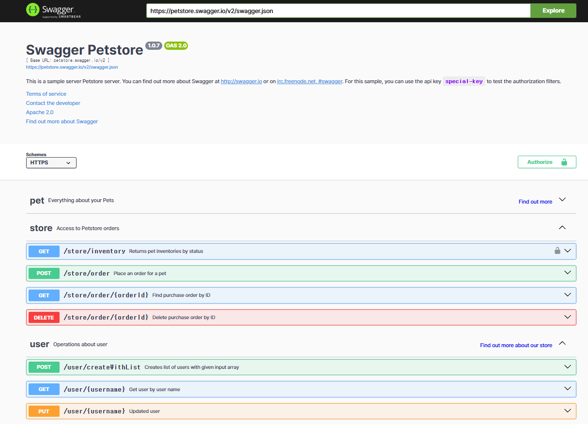
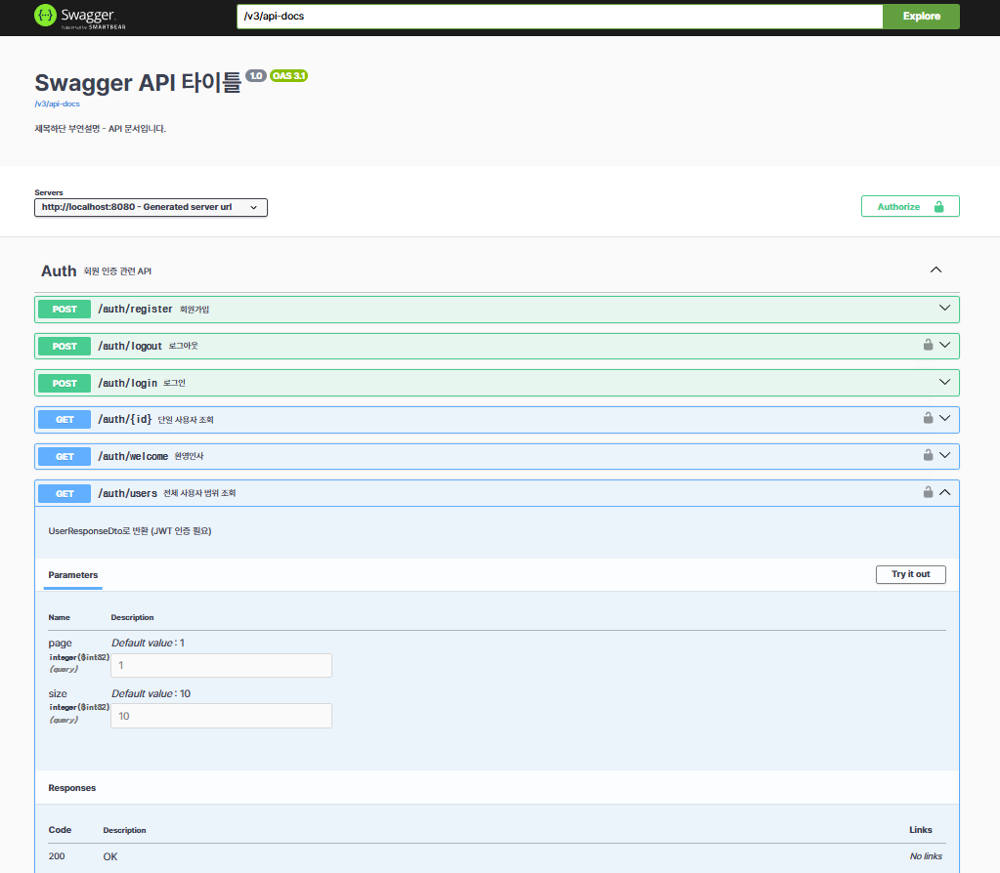
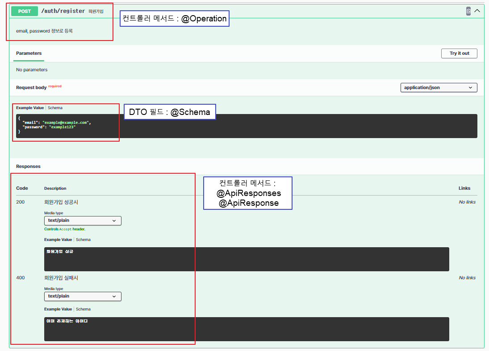

# [ 13주차 - 1114 ] 스터디 내용

```bash
    금일 커리큘럼
        ├ 09:00 ~ 12:00 backend 프로그래밍 (Swagger API 문서화, Swagger 적용 방법)
        └ 13:00 ~ 18:00 backend 프로그래밍 (Swagger Code-First 방식 구현)
```

## 1. Swagger API 문서화

> Swagger : RESTful API 문서를 자동으로 생성해주는 오픈소스 프레임워크

### API 문서화 필요성

- 백엔드 ↔ 프론트엔드 개발자 간의 원활한 소통
- API 명세서를 수동으로 작성하면 오류 발생 가능 (사람에 의한 실수)
- Swagger를 사용하면 API 문서를 자동 생성 + 유지보수 용이
- 버전 관리, 팀 개발에 매우 중요한 요소임

### API 문서화의 필수 요소

- **엔드포인트(Endpoint)** : API의 URL 경로 (예: /api/users)
- **HTTP 메서드(HTTP Method)** : GET, POST, PUT, DELETE 등
- **요청 파라미터(Request Parameters)** : 쿼리 파라미터, 경로 변수, 요청 본문 등
- **응답(Response)** : 응답 본문, 상태 코드 등
- **보안(Security)** : 인증 및 권한 부여 정보


### Swagger의 주요 기능

- **자동 문서 생성** : 코드 주석을 기반으로 API 문서를 자동으로 생성
- **인터랙티브 UI** : Swagger UI를 통해 API를 테스트하고 상호작할 수 있는 웹 인터페이스 제공
- **다양한 언어 및 프레임워크 지원** : 다양한 프로그래밍 언어와 프레임워크에서 사용 가능
- **확장성** : 플러그인 및 확장 기능을 통해 기능 추가 가능

### Swagger 데모로 확인



* [Swagger 공식 사이트](https://swagger.io/tools/swagger-ui/)
* [라이브 데모 확인하기](https://petstore.swagger.io/?_gl=1*5om42k*_gcl_au*MTcxNzMxODI0MC4xNzYzMTA2NDc0#/)

---

## 2. Swagger 적용 방식

> Swagger 적용하기 앞서 code-first 방식과 design-first 방식이 존재함

- **Code-First 방식** : 기존에 작성된 코드를 기반으로 Swagger 문서를 생성
- **Design-First 방식** : Swagger 를 따로 명세파일로 작성 (YAML/JSON)

### Code-First 방식

* 이미 작성된 Spring 코드(Controller, DTO) 에 애노테이션을 붙여 Swagger 문서를 자동 생성하는 방식.
* 코드와 문서가 항상 동일하게 유지됨

```java
@Operation(summary = "회원가입")
@PostMapping("/register")
public ResponseEntity<?> register(@RequestBody RegisterRequestDto dto) { ... }
```

### Design-First 방식 (openapi.yaml 기반)


* Swagger 문서를 YAML/JSON 파일(OpenAPI 스펙) 로 먼저 설계하고, 그 문서를 기준으로 개발을 진행하는 방식.
* API를 문서 중심으로 먼저 설계
* 개발팀, 프론트엔드 팀이 문서만으로 API 계약을 미리 공유
* 단, 문서와 코드가 따로 관리되므로 유지보수가 어려울 수 있음

* 해당 에디터 참고 URL : [https://swagger.io/tools/swagger-editor/](https://swagger.io/tools/swagger-editor/)

```yaml
openapi: 3.0.4
info:
  title: Swagger Petstore - OpenAPI 3.0
  description: This is a sample Pet Store Server
  version: 1.0.12
paths:
  /pets:
    get:
      summary: List all pets
      responses:
        200:
          description: OK
```

### 정리 비교

| 구분          | Code-First       | Design-First        |
| ----------- | ---------------- | ------------------- |
| 문서 작성 시점    | 코드 작성 후          | 문서 먼저               |
| 문서 관리 위치    | Controller 애노테이션 | openapi.yaml        |
| 난이도         | 쉬움               | 중간~높음               |
| 기업 실무 사용    | 소규모 중소기업         | 대규모 서비스(카카오, 네이버 등) |
| Swagger UI  | O                | O                   |
| Mock Server | 약함               | 매우 강력               |
| 자동 SDK 생성   | X                | O                   |

---


## 3. Swagger 적용하기 (code-first 방식)


### 3.1 프로젝트 의존성 추가 (gradle)

```groovy
dependencies {
    implementation 'org.springdoc:springdoc-openapi-starter-webmvc-ui:2.8.5' // Swagger UI
    implementation 'com.auth0:java-jwt:4.4.0' // JWT 라이브러리

    
    implementation 'org.springframework.boot:spring-boot-starter-data-jpa'
    implementation 'org.springframework.boot:spring-boot-starter-web'
    compileOnly 'org.projectlombok:lombok'
    developmentOnly 'org.springframework.boot:spring-boot-devtools'
    runtimeOnly 'com.mysql:mysql-connector-j'
    annotationProcessor 'org.projectlombok:lombok'
    testImplementation 'org.springframework.boot:spring-boot-starter-test'
    testRuntimeOnly 'org.junit.platform:junit-platform-launcher'
}
```


### 3.2 Swagger 설정 파일 작성

* 추천경로 : config/SwaggerConfig.java

```java
@Configuration
@OpenAPIDefinition(
    info = @Info(
        title = "Swagger API 타이틀",
        version = "1.0",
        description = "API 문서입니다."
    )
)
@SecurityScheme(
    name = "bearerAuth",
    type = SecuritySchemeType.HTTP,
    scheme = "bearer",
    bearerFormat = "JWT"
)
public class SwaggerConfig { }
```

#### 기능 설명

* `@OpenAPIDefinition` : 화면의 전체 문서 정보 설정

* `@SecurityScheme` : JWT 인증 스키마 설정
    - Swagger UI에 “Authorize” 버튼 자동 생성된다


### 3.3 Swagger UI 접속 하기

* 프로젝트 실행 후 브라우저에서 아래 URL 접속

```bash
http://localhost:8080/swagger-ui/index.html
```


### 3.4 Swagger 애노테이션으로 문서화


#### 1) API 그룹섹션 만들기 (@Tag)

* `@Tag` : API 그룹 이름과 설명을 정의
* 위치 : Controller 클래스

```java
@Tag(name = "Auth", description = "회원 인증 관련 API")
@RestController
@RequestMapping("/auth")
public class AuthController { /** ... */ }
```

#### 2) 엔드포인트 문서화 (@Operation)

* `@Operation` : 해당 API의 요약(summary) , 설명(description) 을 설정
* 위치 : Controller 내 메서드

```java
// ... 생략
public class AuthController {
    @Operation(
        summary = "회원가입",
        description = "email, password 정보로 등록"
    )
    @PostMapping("/register")
    public ResponseEntity<?> register(@RequestBody RegisterRequestDto dto) { /** ... */ }
}
```

#### 3) 응답 상태코드 문서화 (@ApiResponses)

* 각 API가 어떤 결과를 반환하는지 문서로 남길 때 사용
* `@ApiResponses` : 여러 응답
    - value 속성에 **@ApiResponse** 여러 응답 정의가능

* `@ApiResponse` : 단일 응답
    - responseCode : HTTP 상태 코드
    - description : 응답 설명
    - content : 응답 본문 스키마 및 예시 정의

```java
// ... 생략
public class AuthController {

    @Operation(
        summary = "회원가입",
        description = "email, password 정보로 등록"
    )
    @ApiResponses(value = {
        @ApiResponse(
            responseCode = "200",
            description = "회원가입 성공시",
            content = @Content(
                mediaType = "text/plain",
                schema = @Schema(type = "String", example = "회원가입 성공")
            )
        ),
        @ApiResponse(
            responseCode = "400",
            description = "회원가입 실패시",
            content = @Content(
                mediaType = "text/plain",
                schema = @Schema(type = "string", example = "이미 존재하는 아이디")
            )
        )
    })
    @PostMapping("/register")
    public ResponseEntity<?> register(@RequestBody RegisterRequestDto dto) { /** ... */ }

}
```

#### 4) 요청/응답 DTO 문서화 (@Schema)

* `@Schema` : DTO 클래스 또는 필드에 적용하여 스키마 정보 설정
* 위치 : DTO 클래스, 필드

```java
@Getter
@Schema(description = "회원가입 요청 DTO (email, password)") // DTO 클래스 설명
public class RegisterRequestDto {

    @Schema(description = "유저 이메일", example = "user@test.com") // 필드 설명 및 예시
    private String email;

    @Schema(description = "유저 비밀번호", example = "1234")
    private String password;
}
```

#### 5) 쿼리 파라미터 문서화 (@Parameter)

* `@Parameter` : 쿼리 파라미터, 경로 변수, 요청 헤더 등을 문서화할 때 사용
* 위치 : Controller 내 메서드의 파라미터 부분

```java
// ... 생략
public class AuthController {
    
    @GetMapping("/users")
    @Operation(summary = "범위 조회" , description = "번호,크기로 조회 (/auth/users?page=1&size=10)")
    public ResponseEntity<?> getUsers(
            @Parameter(description = "페이지 번호", example = "1")
            @RequestParam int page,

            @Parameter(description = "페이지 크기", example = "10")
            @RequestParam int size
    ) {
        return ResponseEntity.ok(null);
    }

}
```


#### 6) 보안 적용 문서화 (@SecurityRequirement)

* `@SecurityRequirement` : 특정 API에 보안 요구사항을 명시
    - **SwaggerConfig.java** 에서 정의한 **security scheme 이름과 동일**해야 함
    - 설정시 Swagger UI에 "Authorize" 버튼이 활성화되고, 해당 API 호출 시 인증 정보 입력 가능
    - 해당 API 아코디언에도 자물쇠 아이콘이 표시됨

```java
// ... 생략
public class AuthController {

    @Operation(summary = "단일 사용자 조회", description = "ID로 사용자 조회 (인증 필요)")
    @SecurityRequirement(name = "bearerAuth")
    @GetMapping("/{id}")
    public ResponseEntity<?> findById(@PathVariable Long id) {
        return ResponseEntity.ok(userService.findById(id));
    }

}
```

---


## 4. Swagger 적용 심플 구현

### 4.1 프로젝트 구조

```bash
src/main/java/org/example/swaggerexam
├── config
│   └── SwaggerConfig.java            # Swagger OPEN API 설정
│
├── controller
│   ├── AuthController.java           # 인증/회원 기능 REST API 컨트롤러
│   └── ShopController.java           # 임시 섹션 늘리기용
│
├── domain
│   └── User.java                     # User 엔티티 (JPA 매핑)
│
├── dto
│   ├── LoginRequestDto.java          # 로그인 요청 DTO (email/password)
│   ├── LoginResponseDto.java         # 로그인 응답 DTO (accessToken)
│   ├── RegisterRequestDto.java       # 회원가입 요청 DTO
│   └── UserResponseDto.java          # 유저 정보 응답 DTO
│
├── repsoitory
│   └── UserRepository.java           # User JPA Repository
│
├── service
│   └── UserService.java              # User 비즈니스 로직 (회원가입/로그인/조회)
│
└── util
    └── JwtUtil.java                  # JWT 생성/검증/로그아웃(무효화) 유틸
```

### 4.2 Config Package

* **SwaggerConfig** : Swagger OPEN API 설정

<details>
<summary><strong>SwaggerConfig.java</strong></summary>

```java
@Configuration
@OpenAPIDefinition(
        info = @Info(
                title = "Swagger API 타이틀",
                version = "1.0",
                description = "제목하단 부연설명 - API 문서입니다."
        )
        // ,security = @SecurityRequirement(name = "bearerAuth")
)
@SecurityScheme(
        name = "bearerAuth",
        type = SecuritySchemeType.HTTP,
        scheme = "bearer",
        bearerFormat = "JWT"
)
public class SwaggerConfig {
}
```

</details>

### 4.3 controller Package

* **AuthController** : 인증/회원 기능 REST API 컨트롤러
* **ShopController** : 임시 섹션 늘리기용

<details>
<summary><strong>AuthController.java</strong></summary>

```java
// 섹션의 제목 + 부연설명 (기본은 클래스명으로 노출됨)
@Tag(name = "Auth", description = "회원 인증 관련 API")
@RestController
@RequiredArgsConstructor
@RequestMapping("/auth")
public class AuthController {
    public final UserService userService;

    /** 홈화면 */
    // 해당 api 아코디언 제목과 설명
    @Operation(
            summary="환영인사",
            description="인증하면 환영인사를 해줍니다."
    )
    @SecurityRequirement(name = "bearerAuth")
    @GetMapping("/welcome")
    public String wecome() {
        return "welcome";
    }


    /** 회원가입 */
    @Operation(
            summary = "회원가입",
            description = "email, password 정보로 등록"
    )
    @ApiResponses(value = {
            @ApiResponse(
                    responseCode = "200",
                    description = "회원가입 성공시",
                    content = @Content(
                            mediaType = "text/plain",
                            schema = @Schema(type = "String", example = "회원가입 성공")
                    )
            ),
            @ApiResponse(
                    responseCode = "400", 
                    description = "회원가입 실패시",
                    content = @Content(
                            mediaType = "text/plain",
                            schema = @Schema(type = "string", example = "이미 존재하는 아이디")
                    )
            )
    })
    @PostMapping("/register")
    public ResponseEntity<?> register(@RequestBody RegisterRequestDto requestDto) {
        try {
            String msg = userService.register(requestDto);
            return ResponseEntity.ok(msg);

        } catch (IllegalArgumentException e) {
            return ResponseEntity.badRequest().body(e.getMessage());
        }
    }

    /** 로그인 */
    @Operation(summary = "로그인", description = "email, password로 로그인하고 JWT 발급")
    @PostMapping("/login")
    public ResponseEntity<?> login(@RequestBody LoginRequestDto requestDto) {
        try {
            String token = userService.login(requestDto);
            return ResponseEntity.ok(
                        LoginResponseDto.builder()
                        .accessToken(token)
                        .build()
            );
        } catch (IllegalArgumentException e) {
            return ResponseEntity.badRequest().body(e.getMessage());
        }
    }

    /** 로그아웃 */
    @Operation(summary = "로그아웃", description = "JWT 무효화 처리 (JWT 인증 필요)")
    @SecurityRequirement(name = "bearerAuth")
    @PostMapping("/logout")
    public ResponseEntity<?> logout(@RequestHeader("Authorization") String token) {
        // "Bearer xxxx" → 토큰만 추출
        if (token.startsWith("Bearer ")) {
            token = token.substring(7);
        }
        userService.logout(token);
        return ResponseEntity.ok("로그아웃 성공");
    }

    /** 전체 조회 */
    @Operation(summary = "전체 사용자 조회", description = "UserResponseDto로 반환 (JWT 인증 필요)")
    @SecurityRequirement(name = "bearerAuth")
    @GetMapping("/users/all")
    public ResponseEntity<?> findAll() {
        return ResponseEntity.ok(userService.findAll());
    }
    /** 범위 조회 */
    @Operation(summary = "전체 사용자 범위 조회", description = "UserResponseDto로 반환 (JWT 인증 필요)")
    @SecurityRequirement(name = "bearerAuth")
    @GetMapping("/users")
    public ResponseEntity<?> getUsers(
            @RequestParam(value = "page", required = false, defaultValue = "1") int page,
            @RequestParam(value = "size", required = false, defaultValue = "10") int size
    ) {
        return ResponseEntity.ok(userService.getUsers(page, size));
    }

    /** 단건 조회 */
    @Operation(summary = "단일 사용자 조회", description = "ID로 사용자 조회 (JWT 인증 필요)")
    @SecurityRequirement(name = "bearerAuth")
    @GetMapping("/{id}")
    public ResponseEntity<?> findById(@PathVariable Long id) {
        return ResponseEntity.ok(userService.findById(id));
    }

    /** 로그인한 회원 정보 */
    @Operation(summary = "내 정보", description = "토큰으로 자기자신 조회 (JWT 인증 필요)")
    @SecurityRequirement(name = "bearerAuth")
    @GetMapping("/myinfo")
    public ResponseEntity<?> getMyInfo(@RequestHeader("Authorization") String token) {
        if (token.startsWith("Bearer ")) {
            token = token.substring(7);
        }

        Long userId = userService.getUserIdFromToken(token);

        return ResponseEntity.ok(userService.findById(userId));
    }
}

```

</details>

<details>
<summary><strong>ShopController.java</strong></summary>

```java
@Tag(name = "Shop", description = "쇼핑 관련 API")
@RestController
@RequestMapping("/shop")
public class ShopController {
    @GetMapping
    public ResponseEntity<?> getShop() {
        return ResponseEntity.ok().build();
    }
}
```

</details>


### 4.4 domain Package

* **User** : User 엔티티 (JPA 매핑)

<details>
<summary><strong>User.java</strong></summary>

```java
@Entity
@Getter
@Setter
@Table(name="swagger_users")
public class User {

    @Id
    @GeneratedValue(strategy = GenerationType.IDENTITY)
    private Long id;                // 사용자 ID (PK)

    @Column(unique = true, nullable = false)
    private String email;           // 사용자 이메일 (UNIQUE)

    @Column(nullable = false)
    private String password;        // 비밀번호
}
```

</details>


### 4.5 dto Package

* **LoginRequestDto** : 로그인 요청 DTO (email/password)
* **LoginResponseDto** : 로그인 응답 DTO (accessToken)
* **RegisterRequestDto** : 회원가입 요청 DTO
* **UserResponseDto** : 유저 정보 응답 DTO

<details>
<summary><strong>LoginRequestDto.java</strong></summary>

```java
@Getter
@Builder
@AllArgsConstructor
@NoArgsConstructor
@Schema(description = "로그인 요청 DTO (email, password)")
public class LoginRequestDto {
    private String email;
    private String password;
}
```

</details>

<details>
<summary><strong>LoginResponseDto.java</strong></summary>

```java
@Getter
@Builder
@AllArgsConstructor
@NoArgsConstructor
@Schema(description = "로그인 응답 DTO (accessToken)")
public class LoginResponseDto {
    @Schema(description = "액세스 토큰")
    private String accessToken;
}
```

</details>


<details>
<summary><strong>RegisterRequestDto.java</strong></summary>

```java
@Getter
@Builder
@NoArgsConstructor
@AllArgsConstructor
@Schema(description = "회원가입 요청 DTO (email, password)")
public class RegisterRequestDto {
    @Schema(description = "유저이메일", required = true, example = "example@example.com")
    private String email;
    @Schema(description = "유저비밀번호", example = "example123")
    private String password;
}

```

</details>


<details>
<summary><strong>RegisterRequestDto.java</strong></summary>

```java
@Getter
@Builder
@NoArgsConstructor
@AllArgsConstructor
@Schema(description = "유저 정보 응답 DTO (id, email)")
public class UserResponseDto {
    private Long id;
    private String email;

    public static UserResponseDto from(User user) {
        return UserResponseDto.builder()
                .id(user.getId())
                .email(user.getEmail())
                .build();
    }
}
```

</details>


### 4.6 repository Package

* **UserRepository** : User JPA Repository

<details>
<summary><strong>UserRepository.java</strong></summary>

```java
public interface UserRepository extends JpaRepository<User, Long> {
    Optional<User> findByEmail(String email);
}
```

</details>


### 4.7 service Package

* **UserService** : User 비즈니스 로직 (회원가입/로그인/조회)

<details>
<summary><strong>UserService.java</strong></summary>

```java
@Service
@RequiredArgsConstructor
@Transactional
public class UserService {
    private final UserRepository userRepository;
    private final JwtUtil jwtUtil;

    /** 회원가입 */
    public String register(RegisterRequestDto dto) {
        //매개변수로 들어온 이메일이 이미 존재 하는지 체크
        if(userRepository.findByEmail(dto.getEmail()).isPresent()) {
            throw new IllegalArgumentException("이미 존재하는 아이디");
        } else {
            User user = new User();
            user.setEmail(dto.getEmail());
            user.setPassword(dto.getPassword());

            userRepository.save(user);
            return "회원가입 성공";
        }
    }
    /** 로그인 */
    @Transactional(readOnly = true)
    public String login(LoginRequestDto dto) {
        User user = userRepository.findByEmail(dto.getEmail())
                .orElseThrow(() -> new IllegalArgumentException("존재하지 않는 회원입니다."));

        if (!user.getPassword().equals(dto.getPassword())) {
            throw new IllegalArgumentException("비밀번호가 일치하지 않습니다.");
        }

        // userId로 JWT 생성
        return jwtUtil.generateToken(user.getId());
    }

    /** 토큰으로 사용자 id 조회 */
    @Transactional(readOnly = true)
    public Long getUserIdFromToken(String token) {
        return jwtUtil.validateToken(token); // 유효하면 userId 반환 / 실패 시 null
    }

    /** 로그아웃: 토큰 무효화 */
    public void logout(String token) {
        jwtUtil.invalidateToken(token);
    }

    /** 전체 유저 조회 (DTO 반환) */
    @Transactional(readOnly = true)
    public List<UserResponseDto> findAll() {
        List<User> users = userRepository.findAll();
        return users.stream()
                .map(UserResponseDto::from)
                .toList();
    }

    /** 특정 목록 조회 (DTO 반환) */
    @Transactional(readOnly = true)
    public List<UserResponseDto> getUsers(int page, int size) {
        Pageable pageable = PageRequest.of(page - 1, size); // page-1 = 0부터 시작
        Page<User> userPage = userRepository.findAll(pageable);

        return userPage.getContent()
                .stream()
                .map(UserResponseDto::from)
                .toList();
    }

    /** 개별 유저 조회 (DTO 반환) */
    @Transactional(readOnly = true)
    public UserResponseDto findById(Long id) {
        User user = userRepository.findById(id)
                .orElseThrow(() -> new IllegalArgumentException("해당 ID의 유저를 찾을 수 없습니다."));

        return UserResponseDto.from(user);
    }

}
```

</details>


### 4.8 util Package

* **JwtUtil** : JWT 생성/검증/로그아웃(무효화) 유틸 (테스트용)

<details>
<summary><strong>JwtUtil.java</strong></summary>

```java
// 임시 테스트용
@Component
public class JwtUtil {
    private static final String SECRET = "my-secret-key";
    private static final long EXPIRATION_TIME = 1000 * 60 * 60; // 1시간
    private final ConcurrentHashMap<String, Boolean> invalidTokens = new ConcurrentHashMap<>();

    // JWT 생성
    public String generateToken(Long userId) {
        return JWT.create()
                .withSubject(String.valueOf(userId))
                .withExpiresAt(new Date(System.currentTimeMillis() + EXPIRATION_TIME))
                .sign(Algorithm.HMAC256(SECRET));
    }

    // JWT 검증 및 사용자 ID 반환
    public Long validateToken(String token) {
        try {
            if (invalidTokens.containsKey(token)) {  // 로그아웃된 토큰인지 확인
                return null;
            }
            DecodedJWT decodedJWT = JWT.require(Algorithm.HMAC256(SECRET)).build().verify(token);
            return Long.parseLong(decodedJWT.getSubject()); // userId 반환
        } catch (JWTVerificationException | NumberFormatException e) {
            return null;
        }
    }

    // JWT 무효화 (로그아웃)
    public void invalidateToken(String token) {
        invalidTokens.put(token, true);
    }
}
```

</details>


### 4.9 Swagger UI 화면 확인

```bash
http://localhost:8080/swagger-ui/index.html
```

#### Swagger UI 화면




#### Swagger UI - API 확장 화면




#### swagger 관련 사용 방법

1. **각 API 내 테스트**
    * "Try it out" 버튼 클릭 → 요청 파라미터 입력 → "Execute" 버튼 클릭
    * 응답 상태코드, 응답 본문 확인 가능


2. **JWT 인증**
    * 우측 상단 "Authorize" 버튼 클릭
    * "bearerAuth" 항목에 JWT 토큰 입력
    * (예: Bearer eyJ0eXAiOiJKV1QiLCJhbGciOiJIUzI1NiJ9...)


---

