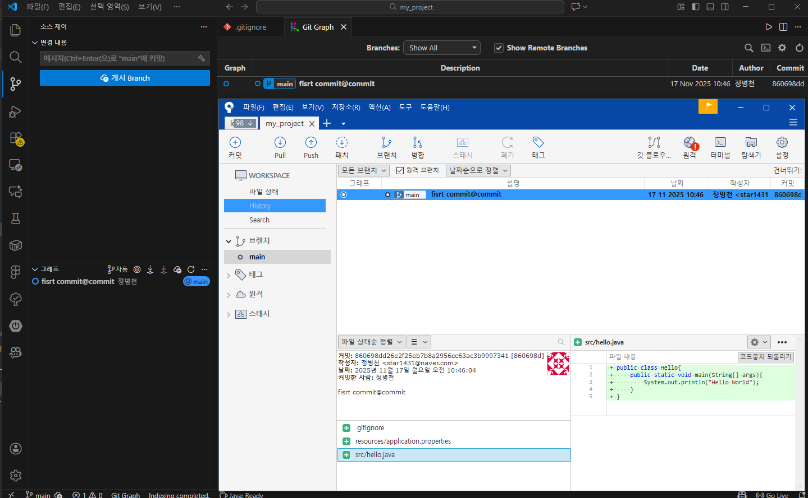
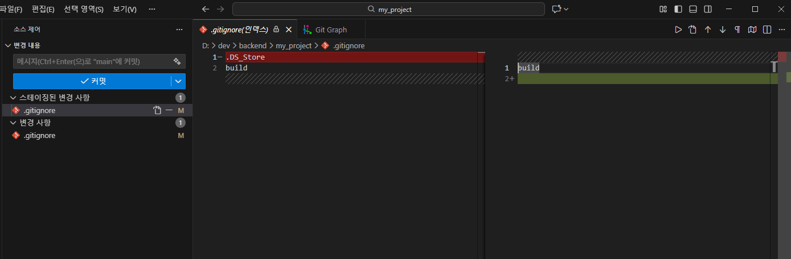

# [ 14주차 - 1117 ] 

```bash
    금일 커리큘럼
        ├ 09:00 ~ 12:00 Git (git 심화, 객체, 해시)
        └ 13:00 ~ 18:00 Git (git 스테이징 이해, reset, diff)
```

## 1. git 심화

### git 폴더 구조 이해

git bash 로 git init 후 .git 폴더를 확인해보면 다음과 같은 폴더들이 존재함

```bash
$ tree -a
.
|-- .git
|   |-- COMMIT_EDITMSG
|   |-- HEAD
|   |-- ORIG_HEAD
|   |-- config
|   |-- description
|   |-- hooks
|   |   |-- applypatch-msg.sample
|   |   |-- commit-msg.sample
|   |   |-- fsmonitor-watchman.sample
|   |   |-- post-update.sample
|   |   |-- pre-applypatch.sample
|   |   |-- pre-commit.sample
|   |   |-- pre-merge-commit.sample
|   |   |-- pre-push.sample
|   |   |-- pre-rebase.sample
|   |   |-- pre-receive.sample
|   |   |-- prepare-commit-msg.sample
|   |   |-- push-to-checkout.sample
|   |   `-- update.sample
|   |-- index
|   |-- info
|   |   `-- exclude
|   |-- logs
|   |   |-- HEAD
|   |   `-- refs
|   |       `-- heads
|   |           `-- main
|   |-- objects
|   |   |-- info
|   |   `-- pack
|   |-- refs
|   |   |-- heads
|   |   |   `-- main
|   |   `-- tags

9 directories, 17 files
```


- **HEAD** : 현재 체크아웃된 브랜치를 가리키는 포인터
- **config** : 저장소의 설정 정보를 담고 있는 파일 (원격 저장소 정보, 사용자 정보 등
- **hooks** : Git 이벤트에 대한 후크 스크립트를 저장하는 디렉토리
- **index** : 스테이징 영역의 상태를 저장하는 파일
- **logs** : 커밋 히스토리와 관련된 로그 정보를 저장하는 디렉토리
- **objects** : Git의 핵심 데이터 저장소로, 커밋, 트리, 블롭 등의 객체를 저장
- **refs** : 브랜치와 태그 등의 참조 정보를 저장하는 디렉토리

### git bash로 간단한 파일 추가 예시

* cd 명령어로 작업할 디렉토리로 이동 후 다음 명령어 실행
* 복사 : ctrl + insert
* 붙여넣기 : shift + insert

```bash
# 깃 저장소 설정
$ git init

# 디렉토리 및 파일 생성
$ mkdir src && mkdir resources

# 파일 생성
$ touch .gitignore

$ echo "name:star1431" > resources/application.properties

$ echo echo 'public class Hello{
    public static void main(String[] args){
        System.out.println("Hello World");
    }
}' > src/Hello.java

# git 상태 확인
$ git status

# 스테이징 영역에 파일 추가
$ git add .

# 커밋
$ git commit -m "first commit"
```





---

## 2. git 스테이징 이해

### git 스테이징 영역이란?

- 커밋하기 전에 변경된 파일들을 임시로 저장하는 공간
- git add 명령어를 사용하여 파일을 스테이징 영역에 추가
- 스테이징 영역에 추가된 파일들은 git commit 명령어를 사용하여 커밋할 수 있음
- `.gitignore` 파일을 사용하여 특정 파일이나 디렉토리를 스테이징 영역에서 제외할 수 있음
- 또는 필요한 파일만 선택적으로 스테이징 영역에 추가할 수도 있음

### git 스테이징 역할

- **변경 분리** : 작업 중인 파일의 변경 사항을 커밋하기 전에 분리하여 관리
- **커밋 준비** : 커밋할 파일들을 미리 선택하여 준비
- **변경사항 검토** : `git diff --staged` 명령어를 사용하여 스테이징 영역에 추가된 파일들의 변경 사항을 검토


### git 스테이징 예시

```bash
# 파일 수정
$ echo "build" > .gitignore

# git 스테이징 추가
$ git add .

# 파일 수정 2
$ echo -e "build\n.DS_Store" > .gitignore

# git 스테이징 확인
$ git status
# 결과
On branch main
Changes to be committed:
  (use "git restore --staged <file>..." to unstage)
        modified:   .gitignore

Changes not staged for commit:
  (use "git add <file>..." to update what will be committed)
  (use "git restore <file>..." to discard changes in working directory)
        modified:   .gitignore
```

* 같은 파일을 수정했지만 git add 명령어를 사용하여 스테이징 영역에 추가한 시점 이후에 수정된 내용은 스테이징 영역에 반영되지 않음
* git status 명령어를 사용하여 스테이징 영역에 추가된 파일과 그렇지 않은 파일을 구분할 수 있음




---

## 3. Git 객체와 해시

### Objects (객체) 폴더와 파일

```bash
82105@star1431 MINGW64 /d/dev/backend/my_project/.git (GIT_DIR!)
$ cd objects

82105@star1431 MINGW64 /d/dev/backend/my_project/.git/objects (GIT_DIR!)
$ ls
00/  09/  37/  48/  5f/  67/  7b/  86/  89/  8a/  90/  9d/  aa/  c2/  ef/  info/  pack/

82105@star1431 MINGW64 /d/dev/backend/my_project/.git/objects (GIT_DIR!)
$ cd 00

82105@star1431 MINGW64 /d/dev/backend/my_project/.git/objects/00 (GIT_DIR!)
$ ls
7a0759bef6934adedbb1d49a38c034f9c4c698
```

- Git은 objects(객체) 폴더 내 서브폴더 (00, 09, 37, ...)에 다양한 객체들을 저장
- 각 서브폴더 내 파일은 고유한 **SHA-1** 해시 값을 가짐
- 객체 파일은 다음과 같이 저장됨
    - **Blob** : 파일의 내용
    - **Tree** : 디렉토리 구조와 파일들의 메타데이터
    - **Commit** : 커밋 정보 (작성자, 날짜, 부모 커밋 등)


### Git 커밋 해시 확인

* `git log` : 명령어로 커밋 해시 확인 가능
* `git cat-file -p <해시값>` : 명령어로 해당 객체의 내용을 확인 가능
    - **해시값**은 앞자리 몇 글자만 입력해도 조회 가능

```bash
# git log 명령어로 커밋 해시 확인
82105@star1431 MINGW64 /d/dev/backend/my_project (main)
$ git log
commit 860698dd26e2f25eb7b8a2956cc63ac3b9997341 (HEAD -> main)
Author: 익명 <star1431@naver.com>
Date:   Mon Nov 17 10:46:04 2025 +0900

    fisrt commit@commit

# git cat-file 명령어로 커밋 객체 내용 확인 (앞자리 기준으로 조회)
82105@star1431 MINGW64 /d/dev/backend/my_project (main)
$ git cat-file -p 860698dd
tree 89b67aafc2f2910c2e54a0509f27e19d0c021be8
author 익명 <star1431@naver.com> 1763343964 +0900
committer 익명 <star1431@naver.com> 1763343964 +0900

fisrt commit@commit

# 위의 tree 해시값 토대로 확인
82105@star1431 MINGW64 /d/dev/backend/my_project (main)
$ git cat-file -p 89b67aa
100644 blob aaf010f396466ec0f4ef6661fbcd4d6106b676e4    .gitignore
040000 tree 67e711a64d0ffd0916ed0a93766d928a223de594    resources
040000 tree 5fae55bd75e530a82d9b7ca2ddb0603cc8c85f92    src
```


### 같은 파일 내용인 경우 해시값

* 같은 내용의 파일은 동일한 해시값을 가짐

```bash
# 파일 복사
82105@star1431 MINGW64 /d/dev/backend/my_project (main)
$ cp src/Hello.java src/HelloCopy.java

# git 커밋 후 해당폴더 해시값 확인 시...

82105@star1431 MINGW64 /d/dev/backend/my_project (main)
$ git cat-file -p b4223e
100644 blob eff6a9573e06632f700317ef90af3bbbde01aad4    HelloCopy.java
100644 blob eff6a9573e06632f700317ef90af3bbbde01aad4    hello.java
```

* Hello.java 와 HelloCopy.java 파일의 해시값이 동일함
* Git은 파일 내용 기반으로 해시값을 생성하기 때문에 같은 내용의 파일은 동일한 해시값을 가짐

---

## 4. Git reset 명령어

* 커밋을 되돌리거나 변경 사항을 관리하는 데 사용
* 해당 모든 명령어는 **지정된 커밋 해시값 기준으로 head 포인터**를 이동시킴

### git reset 옵션 종류

#### 1) --soft 옵션

```bash
$ git reset --soft {커밋해시값}
```

* HEAD 포인터를 지정된 커밋으로 이동
* 스테이징 영역과 작업 디렉토리는 변경하지 않음
* 즉, 커밋만 되돌리고 변경 사항을 다시 스테이징 상태로 되돌림

#### 2) --mixed 옵션 (기본 옵션)

```bash
$ git reset --mixed {커밋해시값}
```

* HEAD 포인터를 지정된 커밋으로 이동
* 스테이징 영역은 리셋, 작업 디렉토리는 변경하지 않음
* 즉, 커밋과 스테이징 영역을 되돌리고 변경 사항은 작업 디렉토리에 남김

#### 3) --hard 옵션

```bash
$ git reset --hard {커밋해시값}
```

* HEAD 포인터를 지정된 커밋으로 이동
* 스테이징 영역과 작업 디렉토리를 모두 지정된 커밋 상태로 되돌림
* 즉, 해당 커밋 시점으로 프로젝트 전체 상태를 완전히 되돌림 → **위험, 주의 필요**

#### 4) --keep 옵션

```bash
$ git reset --keep {커밋해시값}
```

* HEAD 포인터를 지정된 커밋으로 이동
* 작업 디렉토리에 **충돌 없는 변경 사항은 유지**
* 단, 되돌릴 커밋 이후의 변경과 충돌이 발생하는 파일이 있을 경우 리셋이 중단됨
* 즉, 안전하게 되돌리고 싶을 때 사용

#### 5) --merge 옵션

```bash
$ git reset --merge {커밋해시값}
```
* HEAD 포인터를 지정된 커밋으로 이동
* 병합(merge) 중이던 상태를 되돌릴 때 주로 사용
* 현재 워킹 디렉토리 내용은 가능한 유지하되, 충돌 상태만 초기화함
* 병합 중 꼬였을 때 “무난한 시점으로 돌아가고 싶다” 할 때 사용

---

## 5. Git diff

* Git에서 파일의 변경 사항을 비교하고 확인하는 명령어
* `git diff` 명령어를 사용하면 작업 디렉토리, 스테이징 영역, 커밋 간 차이 등을 확인할 수 있음
* 출력 결과는 변경된 라인 앞에 `+, -` 표시로 구분됨


### 커밋 전 비교방식

1. `$ git diff` : 작업 디렉토리와 스테이징 영역 간의 차이 비교
2. `$ git diff --cached` : 스테이징 영역과 마지막 커밋 간의 차이 비교
3. `$ git diff HEAD` : 작업 디렉토리와 마지막 커밋 간의 차이 비교

```bash
# 현재 수정했지만 add 안 한 변경 확인
$ git diff

# staging 된 내용과 마지막 커밋 비교
$ git add HelloWorld.java
$ git diff --cached

# 전체 변경사항을 HEAD와 비교
$ git diff HEAD
```

```bash
# 출력결과 :  + 추가된 라인, - 삭제된 라인
diff --git a/HelloWorld.java b/HelloWorld.java
index 0a1b2c3..1b2c3d4 100644
--- a/HelloWorld.java
+++ b/HelloWorld.java
@@ -2,5 +2,5 @@ public class HelloWorld {
     public static void main(String[] args) {
-        System.out.println("Hello World!");
+        System.out.println("Hello Git World!"); // 변경됨
     }
 }
```

### 커밋 간 비교방식

* 특정 두 커밋 간의 변경 사항을 비교할 때 사용

```bash
$ git diff {해시1} {해시2}
# --------
diff --git a/HelloWorld.java b/HelloWorld.java
index 0a1b2c3..9f8e7d6 100644
--- a/HelloWorld.java
+++ b/HelloWorld.java
@@ -2,5 +2,6 @@ public class HelloWorld {
     public static void main(String[] args) {
-        System.out.println("Hello World!");
+        System.out.println("Hello Git World!");
+        System.out.println("This is new line!"); // 새로 추가된 라인
     }
 }

```

---


## etc. 최종 정리

### Git 하이레벨 명령어

* `git init` : 새로운 Git 저장소 초기화
* `git clone {원격저장소URL}` : 원격 저장소 복제
* `git add {파일명}` : 파일을 스테이징 영역에 추가
* `git commit -m "{커밋메시지}"` : 스테이징 영역의 변경 사항을 커밋
* `git status` : 현재 저장소 상태 확인
* `git log` : 커밋 히스토리 확인
* `git branch` : 브랜치 목록 확인 및 생성
* `git checkout {브랜치명}` : 브랜치 전환
* `git merge {브랜치명}` : 다른 브랜치를 현재 브랜치

### Git 로우레벨 명령어

* `git cat-file -p {해시값}` : 객체의 내용을 확인
* `git hash-object {파일명}` : 파일의 해시값 생성
* `git update-index --add {파일명}` : 파일을 스테이징 영역에 추가
* `git write-tree` : 현재 스테이징 영역의 트리 객체 생성
* `git commit-tree {트리해시값} -m "{커밋메시지}"` : 새로운 커밋 객체 생성

### Git reset 옵션 명령어

* `git reset --soft {커밋해시값}` : 커밋만 되돌리고 스테이징 영역과 작업 디렉토리는 유지
* `git reset --mixed {커밋해시값}` : 커밋과 스테이징 영역을 되돌리고 작업 디렉토리는 유지
* `git reset --hard {커밋해시값}` : 커밋, 스테이징 영역, 작업 디렉토리를 모두 지정된 커밋 상태로 되돌림
* `git reset --keep {커밋해시값}` : 충돌 없는 변경 사항은 유지하며 커밋을 되돌림
* `git reset --merge {커밋해시값}` : 병합 중이던 상태를 되돌림

