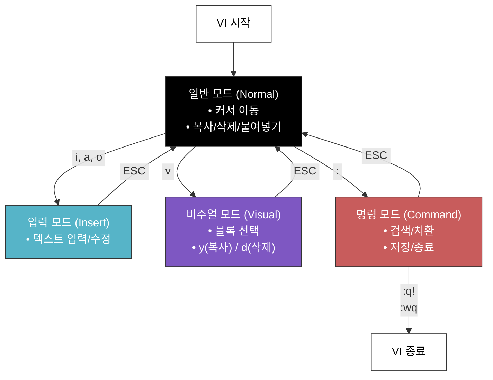

# [ 14주차 - 1118 ]

```bash
    금일 커리큘럼
        ├ 09:00 ~ 12:00 Devops (Docker와 Amazon Linux, 단독/Compose/SSH 컨테이너 생성)
        └ 13:00 ~ 18:00 Devops (Amazon Linux 환경 내 명령어, Vim, 유저/그룹/권한/심볼릭링크)
```

## 1. Docker와 Amazon Linux

### Docker란?

- 컨테이너화 기술을 활용하여 애플리케이션과 그 종속성을 격리된 환경에서 실행할 수 있도록 하는 플랫폼
- 일관된 환경에서 애플리케이션을 개발, 테스트 및 배포 가능


#### Docker의 주요 특징

- **가벼운 가상화** : 기존 가상 머신보다 빠르고 효율적
- **이식성** : 한 번 만든 이미지를 어디서나 실행 가능
- **격리성** : 각 컨테이너는 독립된 환경에서 실행
- **빠른 시작** : 수 초 내로 컨테이너 실행 및 종료 가능

#### 이미지, 컨테이너, 레이어의 개념

- **이미지** : 컨테이너 실행에 필요한 파일과 설정을 포함한 읽기 전용 템플릿
- **컨테이너** : 이미지를 기반으로 생성된 실행 중인 인스턴스
- **레이어** : 이미지와 컨테이너는 여러 레이어로 구성되며, 각 레이어는 파일 시스템의 변경 사항을 나타냄

이전 포스팅 : [(09.09) DataBase 내 Docker MySQL](https://starweb.tistory.com/26)


### Amazon Linux란?

- 아마존 웹 서비스(AWS)에서 제공하는 리눅스 배포판
- AWS 환경에 최적화되어 있으며, 안정성과 보안성이 뛰어남
- AWS 서비스와의 통합이 용이하며, 장기 지원(LTS)을 제공

#### Amazon Linux의 주요 특징

- **최적화** : AWS 환경에서 안정적으로 동작하도록 설계
- **보안** : 정기적인 보안 업데이트 제공
- **호환성** : RHEL/CentOS 계열 명령어와 유사하여 학습하기 좋음
- **무료** : AWS에서 EC2 인스턴스를 사용할 때 무료로 제공


---

## 2. Amazon Linux 단독 컨테이너 방식

### Amazon Linux  이미지 다운로드

- Docker Hub 통해 Amazon Linux 이미지 다운로드

```bash
docker pull amazonlinux:2023
# - amazonlinux:latest = 최신버전
# - amazonlinux:2023 = 2023년 최신
# - amazonlinux:2023.6.20250218.2 = 특정 릴리스

# 설치 후 확인
docker images
```

### Amazon Linux 컨테이너 생성 (볼륨 미사용)

- name 옵션 이후 컨테이너 이름 지정 가능

```bash
docker run -it --name {컨테이너이름} amazonlinux:2023 /bin/bash

# 컨테이너 생성 후 접속
docker exec -it {컨테이너이름} /bin/bash

# 삭제하고 싶은 경우 (-f : force / 실행중이여도 강제삭제)
docker rm -f {컨테이너 ID 또는 이름}
```

#### [TIP] Docker 명령어 정리

- `docker ps` : 실행 중인 컨테이너 목록 확인
- `docker ps -a` : 모든 컨테이너 목록 확인 (중지된 컨테이너 포함)
- `docker images` : 로컬에 저장된 이미지 목록 확인
- `docker stop {컨테이너명}` : 실행 중인 컨테이너 중지
- `docker start {컨테이너명}` : 중지된 컨테이너 시작
- `docker logs {컨테이너명}` : 컨테이너 로그 확인
- `docker rm {컨테이너명}` : 중지된 컨테이너 삭제
- `docker exec -it {컨테이너명} /bin/bash` : 실행 중인 컨테이너에 접속
   * **exit** 명령어로 bash 쉘 종료 가능


### 컨테이너 구조와 레이어 관계

1. **Base Layer** : 기본 OS 레이어 (예: Amazon Linux)
2. **Additional Layers** : 추가된 소프트웨어, 라이브러리 등 설정 레이어 (읽기 전용)
3. **Container Layer** : 실행 중인 컨테이너의 변경 사항 레이어 (읽기-쓰기 가능)

---


## 3. Compose 통한 Amazon Linux 컨테이너 방식

### docker-compose.yml 파일 작성

- 원하는 디렉토리로 이동 후 `docker-compose.yml` 파일 생성
- 아래와 같은 내용 작성

```yaml
services:
  amazonlinux: # 서비스이름
    image: amazonlinux:2023
    container_name: amazonlinux-compose # 컨테이너 이름 지정
    # 컨테이너 실행 시 bash 쉘 사용
    command: /bin/bash
    # 아래 두 설정을 통해 대화형 세션(-it) 효과를 냄
    tty: true
    stdin_open: true
```

- 해당 경로 상태에서 환경 실행

```bash
docker-compose up -d
# -d : detached 모드 (백그라운드 실행)
```

### 컨테이너 접속

#### 1) docker-compose exec

```bash
# 서비스 이름으로 접속
docker-compose exec amazonlinux /bin/bash
```

* 서비스명(service name) 기준
* Compose가 관리하는 컨테이너에 접근
* 해당 폴더의 docker-compose.yml 기준으로 동작
* compose 프로젝트 전용 네트워크에서도 작동


#### 2) docker exec

```bash
# 컨테이너 이름으로 접속
docker exec -it amazonlinux-compose /bin/bash
```

* 컨테이너 이름으로 직접 접속
* Compose와 무관하게 Docker 전체 컨테이너를 대상으로 실행됨


#### 두 명령어 차이점

| 기능              | docker exec | docker-compose exec        |
| --------------- | ----------- | -------------------------- |
| 기준              | 컨테이너 이름     | 서비스 이름                     |
| Compose 의존 여부   | 없음        | 있음                       |
| 실행 위치 필요        | X 어디서나 가능   | O compose 파일 있는 디렉토리에서 실행  |
| Compose 프로젝트 관리 | X           | O (네트워크, 볼륨 등 자동 관리)       |
| 대화형 세션 지원       | O (`-it`)   | O (tty + stdin_open 자동 적용) |

### docker-compose 명령어 정리

**주의** : 해당 `docker-compose.yml` 파일이 있는 디렉토리에서 실행해야함

- `docker-compose up -d` : 백그라운드에서 서비스 시작
- `docker-compose down` : 서비스 중지 및 컨테이너 삭제
    - 네트워크 리소스 정리되고, 볼륨은 유지됨
- `docker-compose ps` : 현재 실행 중인 서비스 상태 확인
- `docker-compose logs` : 서비스 로그 확인
- `docker-compose exec {서비스명} /bin/bash` : 실행 중인 서비스 컨테이너에 접속

---


## 4. SSH를 통한 외부 접속 환경 구성하기

> Amazon Linux 2023 + SSH 서버

### Dockerfile 작성

- 원하는 디렉토리로 이동 후 `Dockerfile` 파일 생성
- 아래와 같은 내용 작성
- `{비밀번호}` 부분은 원하는 root 비밀번호로 변경

```Dockerfile
FROM amazonlinux:2023

# 1) 패키지 업데이트 & SSH 서버 설치 (passwd도 같이 설치)
RUN yum update -y && \
    yum install -y openssh-server passwd

# 2) root 암호 설정 (테스트용)
RUN echo 'root:{비밀번호}' | chpasswd

# 3) SSH 관련 디렉토리 생성 (이미 존재할 수도 있지만, 혹시 몰라서 생성)
RUN mkdir -p /var/run/sshd

# 4) SSH 호스트키 생성 (필수! 이게 없으면 "no hostkeys available" 오류 발생)
RUN ssh-keygen -A

# 5) 비밀번호 로그인을 허용하려면 sshd_config 수정 (필요 시)
RUN sed -i 's/^#PasswordAuthentication.*/PasswordAuthentication yes/' /etc/ssh/sshd_config && \
    sed -i 's/^PasswordAuthentication no/PasswordAuthentication yes/' /etc/ssh/sshd_config && \
    sed -i 's/^#PermitRootLogin.*/PermitRootLogin yes/' /etc/ssh/sshd_config && \
    sed -i 's/^PermitRootLogin prohibit-password/PermitRootLogin yes/' /etc/ssh/sshd_config

# 6) 필요 패키지 설치 (예: git, which 등)
RUN yum install -y git which

# 7) SSH 데몬 포그라운드 실행
CMD ["/usr/sbin/sshd", "-D", "-e"]
```

* 1\) passwd 명령어를 사용하기 위해 `passwd` 패키지도 함께 설치
* 2\) chpasswd 명령어로 root 계정 비밀번호 설정
* 3\) /var/run/sshd 디렉토리 생성 (sshd가 필요로 함)
* 4\) SSH 호스트키 생성은 `ssh-keygen -A` 명령어로 간단히 처리
* 5\) sshd_config 파일을 sed 명령어로 수정하여 root 로그인과 비밀번호 인증 허용
* 6\) git, which 등 자주 사용하는 패키지도 설치
* 7\) 마지막 CMD 명령어로 SSH 데몬을 포그라운드 모드로 실행


#### 주의사항

- 실제 운영 환경에서는 root 계정으로 직접 접속하는 것은 보안상 위험함
- 반드시 강력한 비밀번호 설정 및 방화벽 설정 필요
- 가능하면 SSH 키 기반 인증 사용 권장


### docker-compose.yml 파일 작성

* 해당 같은 디렉토리에 `docker-compose.yml` 파일 생성

```yml
services:
  amazonlinux-ssh:
    build: .
    container_name: amazonlinux-ssh
    ports:
      - "2222:22"
    volumes:
      - "./data:/workspace"
    restart: always
```

* 서비스명 : amazonlinux-ssh
* 호스트 포트 2222번을 컨테이너의 22번(SSH 기본 포트)로 매핑
* 호스트의 `./data` 디렉토리를 컨테이너의 `/workspace` 디렉토리로 마운트
* **restart** : always 옵션으로 컨테이너가 중지되더라도 자동 재시작

### 컨테이너 빌드 및 실행

* 해당 디렉토리에서 아래 명령어 실행

```bash
docker-compose up -d --build --force-recreate

# 설치완료 후 ....
# SSHD가 정상적으로 실행되었는지 로그 확인
docker logs amazonlinux-ssh
```

* `--build` : Dockerfile 변경 사항이 있을 때 이미지를 다시 빌드
* `--force-recreate` : 기존 컨테이너가 있더라도 강제로 재생성

### SSH 클라이언트로 접속

```bash
# 호스트에서 SSH 클라이언트로 접속
ssh root@127.0.0.1 -p 2222

# - 이후 처음 접속 시 아래와 같은 메시지 출력됨
# - yes 입력 후 엔터 후 root 비밀번호 입력하여 접속
D:\docker\linuxssh>ssh root@127.0.0.1 -p 2222
The authenticity of host '[127.0.0.1]:2222 ([127.0.0.1]:2222)' can't be established.
ED25519 key fingerprint is SHA256:arKOy4YwwXDJK/j0wtnnUFLVkekQ3THvg73YrMESPCA.
This key is not known by any other names.
Are you sure you want to continue connecting (yes/no/[fingerprint])?
```

* 만약 접속이 안될 경우, 방화벽 설정 및 Docker 포트 매핑 설정 확인 필요함
* 호스트 키 에러 발생 시 `~/.ssh/known_hosts` 파일에서 해당 호스트 정보 삭제 후 재접속 시도
* 또는 `ssh-keygen -R [127.0.0.1]:2222` 명령어로 특정 포트의 호스트 키만 삭제

---

## 6. Amazon Linux 환경 내 명령어

> linux 환경에서 시스템 관리에 대한 필요한 명령어 모음

### 6.1 패키지 매니저 (yum/dnf)

- 기본적으로 `yum` 패키지가 설치되어 있음
- Amazon Linux 2023부터는 `dnf` 패키지 매니저도 사용 가능
- yum :
- dnf :

```bash
# yum 버전 확인
yum --version
# dnf 버전 확인
dnf --version
```

---

### 6.2 패키지 업데이트

- 초기 설치된 직후 가장 먼저 수행해야 할 작업
- 기존 레포지토리 정보가 오래된 경우 최신 상태로 갱신 필요하기 때문

```bash
yum update -y
# 또는
dnf update -y
```

---

### 6.3 패키지 매니저 명령어 (yum/dnf 동일)

`yum` = `dnf` 로 동일하게 사용 가능

* `yum install -y {패키지명}` : 패키지 설치 (-y : 자동 확인)
* `yum remove -y {패키지명}` : 패키지 삭제
* `yum search {키워드}` : 패키지 검색
* `yum info {패키지명}` : 패키지 상세 정보 확인
* `yum clean all` : 캐시된 패키지 데이터 정리

---


### 6.4 환경변수 확인 명령어

```bash
echo $PATH
echo $HOME
echo $USER
echo $SHELL
```

* **PATH** : 실행 파일 경로
* **HOME** : 사용자 홈 디렉토리
* **USER** : 현재 사용자 이름
* **SHELL** : 현재 사용 중인 쉘 종류 (예: /bin/bash)

---


### 6.5 쉘 초기화 스크립트 

bash 쉘에서는 로그인시 특정 초기화 스트립트가 실행됨

#### 로그인 쉘

SSH 접속, 콘솔 로그인처럼 로그인시 실행순서

1. `/etc/profile` : 시스템 전체 공통 설정 파일, 모든 사용자에게 적용
2. 다음 파일 중 가장 먼저 존재하는 파일 하나만 실행
    - `~/.bash_profile`
    - `~/.bash_login`
    - `~/.profile`
3. 그 다음 내부 스크립트에 따라 `~/.bashrc` 호출하는 경우 실행됨

```bash
# ~/.bash_profile
# .bashrc 파일이 존재하면 실행하기
if [ -f ~/.bashrc ]; then
    . ~/.bashrc
fi
```

#### 비로그인 쉘

로그인상태에서 bash만 실행하거나 Docker 컨테이너에서 /bin/bash 실행할 때 등

1. `~/.bashrc` 파일이 실행됨

---

### 6.6  에디터(Vi/Vim) 사용하기 위한 패키지 추가

- **Vi(Vim)** : 리눅스 환경에서 가장 널리 쓰이는 터미널 기반 텍스트 편집기
- Amazon Linux 기본 이미지에는 vim이 설치되어 있지 않은 경우가 많기 때문에 사용 전 설치가 필요함.

#### vim 패키지 설치

```bash
yum install -y vim
```

#### vim 기본 명령어

```bash
vim {파일명}   # 파일 열기
i              # 입력 모드 (insert)
Esc            # 명령 모드로 돌아가기
:w             # 저장
:q             # 종료
:wq            # 저장 후 종료
:q!            # 저장하지 않고 강제 종료
```

#### vim 모드 구조 이해




---

### 6.7 vim으로 bashrc 등 편집

#### bashrc 파일 편집

1. vim으로 `~/.bashrc` 파일 열기

```bash
vim ~/.bashrc
```

2. 편집 모드로 전환 (`i` 키 입력)
3. 아래와 같은 설정 추가 (자기 입맛에 맞게 수정)

```bash
# 시스템의 기본 설정에 있는 /etc/bashrc 가 있다면 불러오기
if [ -f /etc/bashrc ]; then
    . /etc/bashrc
fi

# 사용자 정의 프롬프트 설정
# - 1. 기본 프롬프트 포맷
# - 2. 컬러풀 프롬프트
PS1='[\u@\h \W]\$ '
PS1='\033[01;31m[\u\[\033[01;32m\]@\h \[\033[01;34m\w]\[\033[00m\]\$ '

# 자주 사용하는 alias 설정
# - 1. ll : 상세 리스트 출력
# - 2. ls : 컬러 출력
alias ll='ls -alF'
alias ls='ls --color=auto'
```

4. 명령 모드로 돌아가기 (`Esc` 키 입력)
5. 저장 후 종료 (`:wq` 입력 후 엔터)


#### bash_profile 파일 편집

1. vim으로 `~/.bash_profile` 파일 열기

```bash
vim ~/.bash_profile
```

2. 편집 모드로 전환 (`i` 키 입력)
3. 아래와 같은 설정 추가 (자기 입맛에 맞게 수정)

```bash
# .bashrc 파일이 존재하면 실행하기
if [ -f ~/.bashrc ]; then
    . ~/.bashrc
fi
```

4. 명령 모드로 돌아가기 (`Esc` 키 입력)
5. 저장 후 종료 (`:wq` 입력 후 엔터)

#### 목록확인

```bash
# root 내 목록 보기
ls -la

# 출력결과 
dr-xr-x--- 1 root root  4096 Nov 18 07:19 .
drwxr-xr-x 1 root root  4096 Nov 18 02:25 ..
-rw------- 1 root root  1162 Nov 18 06:14 .bash_history
-rw-r--r-- 1 root root    84 Nov 18 06:13 .bash_profile
-rw-r--r-- 1 root root   279 Nov 18 07:00 .bashrc
drwx------ 2 root root  4096 Nov 18 02:25 .ssh
-rw------- 1 root root  7112 Nov 18 07:00 .viminfo
-rw-r--r-- 1 root root   410 Nov 18 05:10 .vimrc
drwxr-xr-x 2 root root  4096 Nov 18 07:19 testdir
```

---

## 7. 유저, 그룹 관련 명령어

- Linux 시스템에서 유저와 그룹을 관리하는 명령어

### 유저 관련 명령어

```bash
# useradd {유저명} : 유저 추가
useradd testuser

# 유저 비밀번호 설정
passwd testuser
passwd: {입력칸}

# 유저 정보 확인
id testuser

# 전체 유저 목록 확인
cat /etc/passwd

# useradd -G {그룹명} {유저명} : 유저 및 그룹 생성
useradd -G devgroup devops

# 유저 삭제 (-r : 홈디렉토리 및 메일 스풀도 함께 삭제)
userdel -r testuser
```

```bash
# 유저확인 예시
# {유저명}:x:{UID}:{GID}::{홈디렉토리}:{쉘}
# UID : 유저 고유 번호
# GID : 그룹 고유 번호 (그룹이 없으면 기본값 자기자신 UID와 동일)
testuser:x:1000:1000::/home/testuser:/bin/bash
testuser2:x:1001:1001::/home/testuser2:/bin/bash
testuser3:x:1002:1001::/home/testuser3:/bin/bash
```

### 그룹 관련 명령어

```bash
# 그룹 추가
groupadd devgroup

# 기존 유저를 그룹에 추가
usermod -aG devgroup devops

# 유저가 속한 그룹 확인
groups devops

# 전체 그룹 목록 확인
cat /etc/group

# 그룹 삭제
groupdel devgroup
```

---

## 8. 권한 관련 명령어

### Linux 파일 권한 구조

- Linux 권한은 다음 세 개 영역으로 구성
    - **owner** : 파일 소유자
    - **group** : 파일 소유자가 속한 그룹
    - **others** : 그 외 모든 사용자
- 각 영역에 대해 권한 설정
    - **읽기** (read, r = 4) : 파일 내용 읽기 / 디렉토리 목록 보기
    - **쓰기** (write, w = 2) : 파일 내용 수정 / 디렉토리 내 파일 생성 및 삭제
    - **실행** (execute, x = 1) : 파일 실행 / 디렉토리 접근


#### 권한에 대한 이해

```bash
# ls -l {파일명} : 파일 권한 확인
ls -l ~/.bashrc

# 예시 출력
-rw-r--r-- 1 root root 279 Nov 18 07:00 /root/.bashrc
```

1. 권한은 `- | --- | --- | ---` 형태로 각 칸으로 나뉨
2. 각 칸의 구성은 다음과 같은
    - **첫 번째 칸** : 파일유형
    - **두 번째 칸** : 소유자 권한 표시
    - **세 번째 칸** : 그룹 권한 표시
    - **네 번째 칸** : 기타 사용자 권한 표시

3. 2 ~ 4 칸의 각 문자 위치는 다음과 같은 의미함.
    - `rwx` : 읽기(r), 쓰기(w), 실행(x)
    - `-` : 해당 권한 없음

```bash
# 예시
-rw-r--r-- # -> - | rw- | r-- | r--

# 1 칸 : - (일반 파일)
# 2 칸 : rw- (소유자: 읽기, 쓰기 권한)
# 3 칸 : r-- (그룹: 읽기 권한)
# 4 칸 : r-- (기타 사용자: 읽기 권한)

# 즉
# rwx : 읽기o, 쓰기o, 실행o
# rw- : 읽기o, 쓰기o, 실행x
# r-x : 읽기o, 쓰기x, 실행o
# r-- : 읽기o, 쓰기x, 실행x
```


### 권한 변경 명령어

권한은 숫자 또는 기호 방식으로 변경 가능 (숫자권장)


#### 숫자 형태

읽기, 쓰기, 실행 권한을 각각 4, 2, 1로 계산하여 합산한 값을 사용

- 7 = rwx (4+2+1) : 읽기o, 쓰기o, 실행o
- 6 = rw- (4+2+0) : 읽기o, 쓰기o, 실행x
- 5 = r-x (4+0+1) : 읽기o, 쓰기x, 실행o
- 4 = r-- (4+0+0) : 읽기o, 쓰기x, 실행x
- 0 = --- (0+0+0) : 읽기x, 쓰기x, 실행x

```bash
# chmod {권한설정} {파일명} : 파일 권한 변경
chmod 755 ~/.bashrc
# 755 소유자(rwx), 그룹(r-x), 기타사용자(r-x) 권한임
```


#### 기호 형태

- **구분자** : 각 영역 u (소유자), g (그룹), o (기타 사용자), a (전체 사용자) 구분

- **연산자** : + (권한 추가), - (권한 제거), = (정확히 설정)

```bash
# chmod {대상}{연산자}{권한} {파일명} : 파일
chmod u+rwx,g+rx,o+rx ~/.bashrc
# u+rwx : 소유자는 rwd
# g+rx  : 그룹은 r-x
# o+rx  : 기타사용자는 r-x

# ----------------------------
# 활용예시 (추가, 제거, 설정)

# g+w : 그룹에 쓰기 권한 추가
chmod g+w ~/.bashrc

# o-r : 기타 사용자에 읽기 권한 제거
chmod o-r ~/.bashrc

# a=x : 모든 사용자에 대해 실행 권한만 설정
chmod a=x ~/.bashrc
```

### 디렉토리 권한

- 디렉토리 권한은 파일과 유사하지만, 실행(x) 권한의 의미가 다름
    - **읽기(r)** : 디렉토리 내 파일 목록을 볼 수 있음
    - **쓰기(w)** : 디렉토리 내 파일 생성, 삭제 가능
    - **실행(x)** : 디렉토리 접근 및 내부 파일 실행 가능

```bash
# 디렉토리 권한 변경 예시
chmod 755 /path/to/directory
# 소유자(rwx), 그룹(r-x), 기타사용자(r-x) 권한
```

### 핵심 요약

#### 1. Linux 권한은 항상 4칸으로 나뉜다

```bash
- | rw- | r-- | r--
↓   ↓     ↓     ↓
타입  소유자  그룹  기타 사용자

타입 : 파일유형 (- : 일반파일, d : 디렉토리, l : 심볼릭링크 ...)
```


#### 2. 파일과 디렉토리는 같은 r/w/x라도 의미가 다르다

| 권한    | 파일       | 디렉토리                  |
| ----- | -------- | --------------------- |
| **r** | 파일 내용 읽기 | 디렉토리 목록 보기(ls)        |
| **w** | 파일 수정    | 디렉토리 내부 파일 생성/삭제      |
| **x** | 파일 실행    | 디렉토리 진입(cd), 내부 파일 접근 |

- 참고: 디렉토리는 거의 항상 755 또는 700을 사용

#### 3. 숫자 권한은 4(r) + 2(w) + 1(x) 계산

```bash
chmod 754 {파일명}
```

| 문자  | 숫자 | 의미       |
| --- | -- | -------- |
| rwx | 7  | 읽기/쓰기/실행 |
| rw- | 6  | 읽기/쓰기    |
| r-x | 5  | 읽기/실행    |
| r-- | 4  | 읽기       |

#### 4. 디렉토리는 대부분 755 또는 700 권장

- 755 : 읽기 가능, 접근 가능, 실행 가능 (웹서버 기본)
- 700 : 본인만 접근 가능 (개인 홈 디렉토리)

#### 5. 가장 자주쓰는 chmod 명령어

```bash
# 실행 가능하게 만들기
chmod +x {파일명}

# 모든 유저 읽기 가능
chmod 644 {파일명}

# 디렉토리 전체 실행 가능하게
chmod 755 {디렉토리명}

# 기타사용자 제한
chmod o-rwx {파일명}
```

---

## 9. 심볼릭 링크(Symbolic Link)

- 리눅스에서 심볼릭 링크는 윈도우의 바로가기(shortcut) 같은 개념
- 실제 파일을 복사하지 않고, 다른 파일/디렉토리를 가리키는 링크(참조) 를 생성


### 심볼릭 링크 생성

```bash
# ln -s {원본경로} {링크경로} : 심볼릭 링크 생성
ln -s /var/www/html /home/user/webroot
```

* `/home/user/webroot`를 접근하면` /var/www/html`을 보는 것과 동일함


### 심볼릭 링크 확인 및 삭제

```bash
# ls -l {링크경로} : 심볼릭 링크 확인
ls -l /home/user/webroot

# 예시출력
lrwxrwxrwx 1 user user 16 Nov 18 07:00 webroot -> /var/www/html

# rm {링크경로} : 심볼릭 링크 삭제
rm /home/user/webroot
```

### 심볼릭 링크 활용 예시

#### 1. 설정파일 공유

- 홈 디렉토리에서 nginx 설정을 바로 열 수 있음

```bash
ln -s /etc/nginx/nginx.conf ~/nginx.conf
```


#### 2. 명령어 짧게 만들기(alias 없이)

- python3를 python처럼 실행 가능

```bash
ln -s /usr/bin/python3 /usr/local/bin/python
```

#### 3. 버전 관리되는 디렉토리 연결

- 배포 시 `current` 변경만 하면 `live`는 자동으로 최신 상태

```bash
ln -s /project/app/current /project/app/live
```