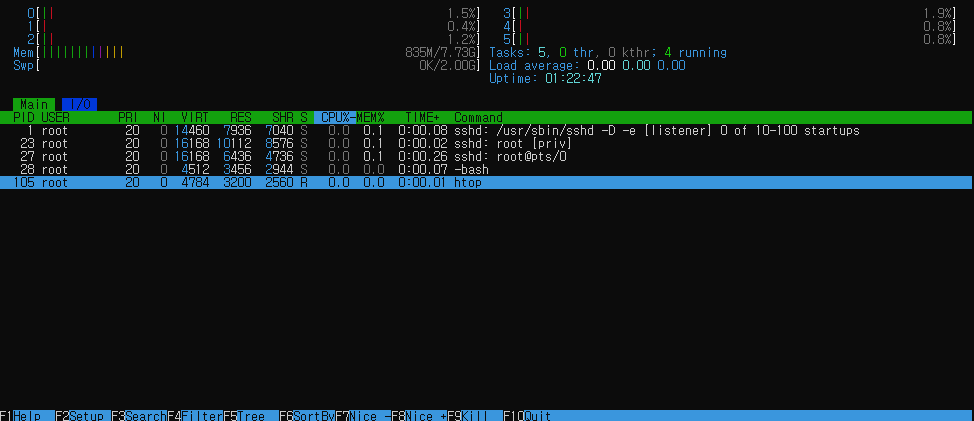

# [ 14주차 - 1119 ]

```bash
    금일 커리큘럼
        ├ 09:00 ~ 12:00 Devops (Linux 시스템 및 네트워크 명령어, bash 스크립트)
        └ 13:00 ~ 18:00 Devops (bash 변수, 제어문, 에러처리, 디버깅)
```

## 1. Linux 시스템 관련 명령어

### 1.1 프로세스 상태 확인

- `top` : 실시간으로 CPU·메모리 사용량이 높은 프로세스를 모니터링

```bash
# 실행
top

# 출력예시
top - 01:36:06 up  1:19,  0 users,  load average: 0.01, 0.02, 0.00
Tasks:   5 total,   1 running,   4 sleeping,   0 stopped,   0 zombie
%Cpu(s):  0.9 us,  1.1 sy,  0.0 ni, 97.7 id,  0.0 wa,  0.0 hi,  0.3 si,  0.0 st
MiB Mem :   7916.7 total,   6761.9 free,    835.6 used,    319.1 buff/cache
MiB Swap:   2048.0 total,   2048.0 free,      0.0 used.   6928.9 avail Mem

  PID USER      PR  NI    VIRT    RES    SHR S  %CPU  %MEM     TIME+ COMMAND
    1 root      20   0   14460   7936   7040 S   0.0   0.1   0:00.08 sshd
   23 root      20   0   16168  10112   8576 S   0.0   0.1   0:00.02 sshd
   27 root      20   0   16168   6436   4736 S   0.0   0.1   0:00.26 sshd
   28 root      20   0    4512   3456   2944 S   0.0   0.0   0:00.06 bash
  102 root      20   0    5064   2816   2304 R   0.0   0.0   0:00.00 top


# 나갈 때는 q 또는 Ctrl + C
```

- `ps` : 현재 실행 중인 프로세스를 일시적으로 스냅숏(snapshot) 형태로 표시

```bash
# 실행
ps aux

# 출력예시
USER       PID %CPU %MEM    VSZ   RSS TTY      STAT START   TIME COMMAND
root         1  0.0  0.0  14460  7936 ?        Ss   00:16   0:00 sshd: /usr/sbin/sshd -D -e [listener] 0 of 10-100 startups
root        23  0.0  0.1  16168 10112 ?        Ss   00:37   0:00 sshd: root [priv]
root        27  0.0  0.0  16168  6436 ?        R    00:37   0:00 sshd: root@pts/0
root        28  0.0  0.0   4512  3456 pts/0    Ss   00:37   0:00 -bash
root       104  0.0  0.0   4820  2560 pts/0    R+   01:38   0:00 ps aux
```

- `htop` : top보다 인터페이스가 좀 더 직관적인 실시간 모니터링 툴

```bash
# htop 설치 및 실행
yum install -y htop
htop
```




### 1.2 디스크 용량 확인

- `df` : 파일 시스템의 디스크 사용량과 남은 용량을 확인

```bash
# 실행 ( -h : 사람이 읽기 쉬운 GB, MB 단위로 표시 )
df -h  

# 출력예시
Filesystem      Size  Used Avail Use% Mounted on
overlay        1007G  5.8G  950G   1% /
tmpfs            64M     0   64M   0% /dev
shm              64M     0   64M   0% /dev/shm
D:\             196G  144G   53G  74% /workspace
/dev/sde       1007G  5.8G  950G   1% /etc/hosts
tmpfs           3.9G     0  3.9G   0% /proc/acpi
tmpfs           3.9G     0  3.9G   0% /proc/scsi
tmpfs           3.9G     0  3.9G   0% /sys/firmware
```

- `du` : 특정 디렉토리 및 파일의 디스크 사용량을 확인

```bash
# 실행 ( -sh : 용량 단위 요약 )
du -sh /var/log

# 출력예시
276K    /var/log
```

### 1.3 메모리 사용량 확인

- `free` : 시스템의 전체 메모리와 스왑 메모리의 사용량 및 남은 용량을 확인

```bash
# 실행 ( -m : MB 단위로 표시 )
free -m

# 출력예시
               total        used        free      shared  buff/cache   available
Mem:            7916         836        6758           4         321        6928
Swap:           2048           0        2048
```

- **/proc/meminfo** : 시스템 메모리 상태에 대한 상세 정보를 제공하는 가상 파일

```bash
# 실행
cat /proc/meminfo

# 출력예시
MemTotal:        8106720 kB
MemFree:         6920828 kB
MemAvailable:    7094524 kB
Buffers:            1912 kB
Cached:           305244 kB
# ... (생략)
```

---

## 2. linux 네트워크 관련 명령어

### 2.1 네트워크 연결 테스트

- `ping` : 특정 호스트와의 네트워크 연결 상태를 확인

```bash
# 실행
# ping <도메인 or IP>
# -c 4 : 4번만 ping 테스트 수행
ping -c 4 www.google.com

# 출력예시
[root@bbabffa7daf4 /workspace]# ping -c 4 www.google.com
PING www.google.com (172.217.161.228) 56(84) bytes of data.
64 bytes from 172.217.161.228 (172.217.161.228): icmp_seq=1 ttl=63 time=44.5 ms
64 bytes from 172.217.161.228 (172.217.161.228): icmp_seq=2 ttl=63 time=45.5 ms
64 bytes from 172.217.161.228 (172.217.161.228): icmp_seq=3 ttl=63 time=44.8 ms
64 bytes from 172.217.161.228 (172.217.161.228): icmp_seq=4 ttl=63 time=46.1 ms

# 출력되는 ip는 구글의 서버 ip임
```

### 2.2 HTTP(S) 요청 및 데이터 전송

- `curl` : URL을 통해 데이터 전송 및 수신
-  URL에 GET 요청을 보내고 응답(HTML 소스 코드 등)을 출력됨

```bash
# 실행
# curl <URL>
curl https://example.com

# 출력예시 : HTML 소스 코드 출력됨
```

- `curl -O` : URL에서 파일을 다운로드하여 현재 디렉토리에 저장

```bash
# 실행
# curl -O <파일URL>
curl -O https://example.com/file.zip

# 출력예시 : 파일 다운로드 진행 상황 출력됨
```

- `curl -X POST` : URL에 POST 요청을 보내고 데이터를 전송
- **-X POST** : POST 요청 방식 지정
- **-d 'key=value'** : 전송할 데이터 지정

```bash
# 실행
# curl -X POST -d {키값} <URL>
curl -X POST -d 'key=value' https://api.example.com/endpoint

# 출력예시 : 서버 응답 출력됨
```

### 2.3 DNS 조회

- `nslookup` : 도메인 이름에 대한 DNS 정보를 조회

```bash
# 실행
# nslookup <도메인>
nslookup www.google.com

# 출력예시
Server:         127.0.0.11
Address:        127.0.0.11#53

Non-authoritative answer:
Name:   www.google.com
Address: 172.217.161.228
```

---

## 3. bash 스크립트

> bash 스크립트는 일련의 명령어들을 순차적으로 실행하는 스크립트 파일

* Bash 스크립트는 리눅스에서 자동화 작업이나 반복 작업을 간단히 처리하기 위한 핵심 도구
* 확장자는 일반적으로 `.sh`를 사용됨
* 스크립트 파일의 첫 줄에는 해시뱅(`#!/bin/bash`)을 포함하여 해당 스크립트를 어떤 셸로 실행할지 지정함


### Shebang (`#!/bin/bash`)

* Shebang(또는 hashbang)은 스크립트의 첫 번째 줄에 들어가는 특별한 표기법
* `#!`로 시작하며, 뒤에 오는 경로는 스크립트를 실행할 **인터프리터의 위치**를 나타냄

```bash
#!/bin/bash
```

* 이 스크립트를 실행할 때, /bin/bash 프로그램을 사용해 명령어를 해석하라는 의미
* 다른 언어의 경우에도 해당 언어의 인터프리터 경로를 지정할 수 있음
  - `#!/usr/bin/python3` (Python 스크립트용)
  - `#!/usr/bin/perl` (Perl 스크립트용)


### 간단한 bash 스크립트 만들기

#### 1. 원하는 경로 (예: `/workspace`)에 이동 후 작성

```bash
vim my_script.sh
```

#### 2. 아래 내용 입력 후 저장 및 종료

```bash
#!/bin/bash

echo "[my_script.sh] Hello World!"
```

#### 3. 스크립트에 실행 권한 부여

* 실행 권한이 없으면 `Permission denied` 오류 발생 (권한 부여 필요)

```bash
chmod +x my_script.sh
```

#### 4. 스크립트 실행

```bash
./my_script.sh

# 출력예시
[my_script.sh] Hello World!
```

### 실행 방식 관련 정리

#### 1. 직접 실행 방식 (`./my_script.sh`)

* 스크립트가 있는 디렉토리에서, `./`를 붙여서 파일을 직접 실행
* 스크립트 파일에 실행 권한이 있어야 동작 가능 (권한 ✅)
* **동작 원리** : 맨 첫 줄에 지정된 Shebang을 해석해, bash 환경으로 실행


#### 2. bash 명령어로 실행 방식 (`bash my_script.sh`)

* `bash` 명령어 뒤에 스크립트 파일명을 붙여 실행
* 스크립트 파일에 실행 권한이 없어도 동작 가능함 (권한 ❌)
* **동작 원리** : 현재 쉘 환경에서 bash 인터프리터를 호출해 스크립트를 실행


### 실무에서 작성 모범

#### 1. 파일명 규칙

* 파일명은 소문자와 하이픈(-) 또는 언더스코어(_)로 구분하여 작성
* 예: `backup-database.sh`, `deploy_app.sh`

#### 2. 헤더라인 주석 작성

* 스크립트 파일 상단에 헤더라인 주석을 작성하여 스크립트의 목적, 작성자, 작성일, 사용법 등을 명시

```bash
#!/bin/bash
#
# ========================================
# Script Name: backup-database.sh
# Description: 데이터베이스 백업 스크립트
# Author: Your Name
# Date: 2024-11-19
# use: ./backup-database.sh [database_name]
# ========================================
#
set -euo pipefail  # 안전한 스크립트 실행
```

#### 3. 디버깅 모드 추가

* 스크립트 실행 시 디버깅 모드를 활성화할 수 있도록 옵션 추가

```bash
# 환경 변수로 디버그 모드 제어
if [ "${DEBUG:-0}" = "1" ]; then
    set -x  # 디버그 모드 활성화
fi

# 실행방법: DEBUG=1 ./script.sh
```

---


## 4. bash 변수

* bash 스크립트에서 변수는 값을 저장하고 재사용하는 데 사용됨
* 변수는 `$` 기호를 사용하여 참조하며, 값을 할당할 때는 `=` 기호를 사용함

```bash
#!/bin/bash

# 변수 선언 및 할당
name="John Doe"
age=30

# 변수 참조 ( $변수명 or ${변수명} )
echo "Name: $name"
echo "Age: ${age}"
```

### 지역변수 및 환경변수

* **지역변수** : 특정 스크립트나 함수 내에서만 유효한 변수
* **환경변수** : 시스템 전체에서 접근 가능한 변수, `export` 명령어로 설정
    - 변수명은 **대문자로 작성**하는 것이 관례

```bash
#!/bin/bash

# 지역변수 (이 스크립트 안에서만 유효)
local_var="나는 지역변수입니다"

# 환경변수 (자식 프로세스에서도 사용 가능)
export GLOBAL_VAR="나는 환경변수입니다"

# 함수 선언
my_function() {
    # 함수 내부 지역변수
    func_var="함수 내부 지역변수"
    echo "[함수 내부]"
    echo "local_var: $local_var"      # 접근 가능
    echo "GLOBAL_VAR: $GLOBAL_VAR"    # 접근 가능
    echo "func_var: $func_var"        # 접근 가능
}

# 함수 호출
my_function

echo
echo "[함수 외부]"
echo "local_var: $local_var"      # 접근 가능
echo "GLOBAL_VAR: $GLOBAL_VAR"    # 접근 가능
echo "func_var: $func_var"        # 접근 불가능 (함수 내부 전용)
```

### 위치 매개변수

* 스크립트 실행 시 전달되는 인수들은 위치 매개변수로 참조 가능
* 인자값은 `$1`, `$2`, ... `$N` 형태로 접근
* 모든 인수는 `$@` 또는 `$*`로 참조 가능

```bash
#!/bin/bash

# 스크립트 실행 시 전달된 인수들
echo "첫 번째 인수: $1"
echo "두 번째 인수: $2"

# 모든 인수 출력
echo "모든 인수: $@"
```

```bash
# 스크립트 실행 예시
./script.sh arg1 arg2

# 출력예시
첫 번째 인수: arg1
두 번째 인수: arg2
모든 인수: arg1 arg2
```

---


## 5. bash 제어문

### 5.1 if 문

* 조건에 따라 명령어 블록을 실행하는 제어문
    - **if** : if 동일
    - **elif** : else if 형태
    - **else** : else 동일

```bash
#!/bin/bash
num=10
if [ $num -gt 0 ]; then
    echo "$num 은(는) 양수입니다."
elif [ $num -lt 0 ]; then
    echo "$num 은(는) 음수입니다."
else
    echo "$num 은(는) 0입니다."
fi
```

* 조건문에서 대괄호 `[ ]`는 조건식을 감싸는 역할을 하며, 조건식 내부에는 공백이 반드시 필요함

#### 비교연산 설명

bash에서 숫자와 문자열 비교를 위한 주요 연산자는 다음과 같음

* **숫자비교**
    - `-gt` : greater than (>, 초과)
    - `-lt` : less than (<, 미만)
    - `-eq` : equal (==, 같음)
    - `-ne` : not equal (!=, 같지 않음)
    - `-ge` : greater than or equal (>=, 이상)
    - `-le` : less than or equal (<=, 이하)

* **문자열비교**
    - `=` : 같음
    - `!=` : 같지 않음
    - `<` : 사전순으로 앞
    - `>` : 사전순으로 뒤


### 5.2 case 문

* 여러 조건 중 하나에 해당하는 경우에 명령어 블록을 실행하는 제어문

```bash
#!/bin/bash

fruit="apple"

case $fruit in
    "apple")
        echo "사과입니다."
        ;;
    "banana")
        echo "바나나입니다."
        ;;
    "orange")
        echo "오렌지입니다."
        ;;
    *)
        echo "알 수 없는 과일입니다."
        ;;
esac
```

* `case`와 `esac`는 각각 case 문의 시작과 끝을 나타냄
* 각 케이스별 조건은 `)`로 끝나며, 해당 조건이 참일 때 실행할 명령어 블록이 뒤따름
* 각 조건 블록은 `;;`로 종료되며, `*`는 모든 조건에 해당하지 않는 경우를 처리함
    - `;;` = break 역할 동일
    - `*)` = default 역할 동일


### 5.3 for 문

* 특정 명령어 블록을 여러 번 반복 실행하는 제어문

```bash
#!/bin/bash

for i in {1..5}; do
    echo "반복 횟수: $i"
done

for fruit in apple banana orange; do
    echo "과일: $fruit"
done
```

* for문은 `do`와 `done` 사이에 반복할 명령어 블록을 작성함
* in 뒤에 반복할 값들의 목록을 지정할 수 있음
* 중괄호 `{start..end}`를 사용하여 숫자 범위를 지정할 수도 있음

#### 디렉토리 내 순회

```bash
#!/bin/bash
for FILE in *.txt
do
   echo "TXT 파일: $FILE"
done
```

#### C 스타일 구문

```bash
#!/bin/bash
for (( i=1; i<=5; i++ ))
do
   echo "반복 횟수: $i"
done
```

### 5.4 while 문

* 특정 조건이 참인 동안 명령어 블록을 반복 실행하는 제어문

```bash
#!/bin/bash
count=1
while [ $count -le 5 ]; do
    echo "카운트: $count"
    ((count++))
done
```

---

### 6. 에러처리

* 명령 실패나 예상치 못한 상황을 적절히 처리하는 것이 중요함

#### 6.1 에러시 즉시 중단 방법

* 스크립트 상단에 `set -e` 옵션 추가

```bash
#!/bin/bash
set -e  # 에러 발생 시 즉시 스크립트 중단

# 이후 명령어들
echo "작업 시작"
cp none-file.txt /some/  # 이 명령어에서 에러 발생 시 스크립트 중단
echo "작업 완료"
```

* `set -e` 옵션은 스크립트 내에서 실행되는 명령어가 실패할 경우 즉시 스크립트를 종료시킴
* 더 엄격한 에러 처리 방식은 다음과 같음
    - `set -u` : 정의되지 않은 변수를 참조할 때 에러 발생
    - `set -o pipefail` : 파이프라인 중 하나라도 실패하면 전체 실패 처리


#### 6.2 종료 코드 방식

* 각 명령어 실행 후 종료 코드를 확인하여 에러 처리

```bash
#!/bin/bash

echo "작업 시작"
cp nofile.txt /some/

if [ $? -ne 0 ]; then
    echo "에러: 파일 복사 실패"
    exit 1
fi
echo "작업 완료"
```

* `$?` : 직전에 실행된 명령어의 종료 코드를 나타내는 특수 변수
* `0` : 성공, 그 외 실패 (1 ~ 255)
* `exit 1` : 스크립트를 종료하면서 종료 코드 `1` 반환


#### 6.3 명령성공 여부에 따른 분기처리

* AND (`&&`) 및 OR (`||`) 연산자를 사용하여 명령어 성공 여부에 따른 분기 처리

```bash
#!/bin/bash

# AND 연산자 사용 예시
mkdir /some/ && cd /some/ && touch add-file.txt
# 폴덛 생성 (성공) → 해당 폴더로 이동 (성공) → 파일 생성

# OR 연산자 사용 예시
cp none-file.txt /some/ || { echo "에러: 파일 복사 실패"; exit 1; }
# 파일 복사 (실패) → 에러 메시지 출력 및 스크립트 종료
```

#### 6.4 트랩(Trap) 명령어

* 스크립트 실행 중 특정 신호(signal)를 감지하여 지정된 명령어를 실행하는 기능
* 주로 스크립트 종료 시 정리 작업(cleanup)을 수행하는 데 사용됨

```bash
#!/bin/bash

# 정리 작업 함수
cleanup() {
    echo "스크립트 종료 - 정리 작업 수행 중..."
    rm -f /tmp/tempfile.txt # -f : 파일이 없어도 에러 없이 진행
    rm -rf /tmp/tempdir  # -rf : 강제 삭제 옵션
    echo "정리 작업 완료."
}

# EXIT 신호에 대해 cleanup 함수 등록
trap cleanup EXIT

# 메인 스크립트 작업
echo "스크립트 작업 수행 중..."
touch /tmp/tempfile.txt
mkdir /tmp/tempdir
sleep 3  # 작업 시뮬레이션
echo "작업 완료."
# 스크립트가 종료될 때 cleanup 함수가 자동으로 호출됨
```

* `trap` 명령어로 신호를 감지하여 특정 함수를 실행하도록 설정함
* `trap`은 EXIT, INT, TERM 등 다양한 신호에 대해 동작 가능
    - `EXIT` : 스크립트가 종료될 때
    - `INT` : 사용자가 Ctrl + C로 스크립트를 중단할 때
    - `TERM` : 프로세스 종료 신호를 받을 때 (예: kill 명령)
    - `ERR` : 명령어가 실패할 때 (exit code != 0)


```bash
# exit (종료)
trap cleanup EXIT

# INT (Ctrl + C로 중단)
trap cleanup INT

# TERM (프로세스 종료 신호)
trap cleanup TERM

# ERR (명령어 실패 시)
trap cleanup ERR

# 모든 신호도 가능
trap cleanup EXIT INT TERM ERR
```

#### bash 신호 관련 정리

| 이름       | 종류               | 신호 번호 | 발생 조건 / 설명                   | trap 여부 |
| -------- | ---------------- | ----- | ---------------------------- | ---------- |
| **EXIT** | Bash 이벤트         | (없음)  | 스크립트가 종료될 때(정상/에러 포함)        | O       |
| **INT**  | Signal (SIGINT)  | 2     | 사용자가 Ctrl + C 입력             | O       |
| **TERM** | Signal (SIGTERM) | 15    | `kill` 기본 종료 신호 (`kill PID`) | O       |
| **HUP**  | Signal (SIGHUP)  | 1     | 터미널/SSH 세션 종료, 데몬 설정 재로드 신호  | O       |
| **QUIT** | Signal (SIGQUIT) | 3     | Ctrl + \ , 강제 종료 + core dump | O       |
| **ERR**  | Bash 이벤트         | (없음)  | 명령어 실행 실패(exit code != 0)    | O       |
| **KILL** | Signal (SIGKILL) | 9     | 강제 종료(즉시 kill) — 프로세스가 처리 불가 | X  |
| **STOP** | Signal (SIGSTOP) | 19    | 프로세스 정지 — 커널이 강제로 정지시키는 신호   | X  |
| **CONT** | Signal (SIGCONT) | 18    | 정지된 프로세스 재개                  | O       |
| **USR1** | Signal (SIGUSR1) | 10    | 사용자 정의 신호 1                  | O       |
| **USR2** | Signal (SIGUSR2) | 12    | 사용자 정의 신호 2                  | O       |

---


## 7. 스크립트 디버깅

* bash 스크립트에서는 예상치 못한 동작이나 에러를 추적하기 위해 디버깅 명령어 존재함

### 7.1 디버그 모드 활성화

* `set -x` : 디버그 모드 활성화
* `set +x` : 디버그 모드 비활성화

```bash
#!/bin/bash
set -x  # 디버그 모드 활성화

# 이후 명령어들
echo "디버그 모드 테스트"

for i in {1..3}; do
    echo "num: $i"
done

set +x  # 디버그 모드 비활성화
echo "디버그 모드 종료"
```

```bash
# 출력 예시
+ echo '디버그 모드 테스트'
디버그 모드 테스트
+ for i in '{1..3}'
+ echo 'num: 1'
num: 1
+ for i in '{1..3}'
# ...
+ set +x
디버그 모드 종료
```


### 7.2 특정 명령어 디버깅

* `bash` 로 실행시 옵션을 추가해서 디버깅 가능

```bash
bash -x my_script.sh  # 전체 디버그 모드 (실행 과정 출력)
bash -v my_script.sh  # 입력된 명령 자체 출력
bash -n my_script.sh  # 구문 오류 체크 모드 (실행은 안함)
bash -e my_script.sh  # 에러 발생 시 즉시 종료
```

* `set` 명령어로도 동일한 옵션 설정 가능

```bash
set -euxo pipefail

# -e : 에러 발생 시 즉시 종료
# -u : 정의되지 않은 변수 참조 시 에러 발생
# -x : 디버그 모드
# -o pipefail : 파이프라인 중 하나라도 실패하면 전체 실패 처리
```

### 실무 디버깅 전략

**1. 단계별 디버깅**

```bash
# 개발 단계: 모든 디버그 옵션 활성화
set -euxo pipefail

# 테스트 단계: 에러 처리만 활성화
set -eo pipefail

# 프로덕션: 에러 로깅과 함께
set -eo pipefail
exec 2>> /var/log/script-error.log  # 에러를 파일로 기록
```

**2. 조건부 디버깅**

```bash
# 환경변수 디버그 레벨 제어
case "${DEBUG_LEVEL:-0}" in
    0)
        set +x  # 디버그 모드 비활성화
        ;;
    1)
        # 기본 디버그: 주요 단계만 출력
        PS4='+ ${BASH_SOURCE}:${LINENO}: '
        set -x
        ;;
    2)
        # 상세 디버그: 모든 명령 출력 + 에러 처리
        PS4='+ ${BASH_SOURCE}:${LINENO}:${FUNCNAME[0]}: '
        set -xeuo pipefail
        ;;
esac

# 실행방법: DEBUG_LEVEL=2 ./script.sh
```

**3. 함수별 디버깅**

```bash
debug_function() {
    set -x  # 이 함수만 디버그 활성화
    # 복잡한 로직...
    local result=$(some_complex_operation)
    set +x  # 디버그 비활성화
    echo "$result"
}
```

**4. 타임 스탬프 디버깅**

```bash
# 각 명령 실행 시간 표시
PS4='+ $(date "+%Y-%m-%d %H:%M:%S") ${BASH_SOURCE}:${LINENO}: '
set -x

# 출력 예:
# + 2025-03-09 10:30:45 script.sh:15: echo 'Starting process'
```

**5. 디버깅 정보파일 저장**

```bash
# 표준 출력은 화면에, 디버그 정보는 파일로
exec 19>/tmp/debug.log
BASH_XTRACEFD=19
set -x

# 디버그 출력은 /tmp/debug.log에 저장됨
# 일반 출력은 화면에 표시됨
```

---

## 8. bash 함수와 배열

### 8.1 함수 정의 및 호출

```bash
# 함수 정의 방식 1
test1() {
    local name="star1431"
    echo "Hello, $name!"
}

# 함수 정의 방식 2
function test2() {
    local name="star1431"
    echo "Hello, $name!"
}

# 함수 호출
test1
test2
```

### 8.2 함수의 인자 사용 방법

* bash 함수는 인자를 `()`에 넣지 않고 호출 시 전달하는 방식임.

```bash
#!/bin/bash
my_function() {
    # 전달된 인자 개수
    echo "인자 개수: $#"

    # 첫 번째 인자
    echo "첫 번째 인자: $1"

    # 모든인자 하나로
    echo "모든 인자: $*"

    # 모든인자 별개로
    for arg in "$@"; do
        echo "개별 인자: $arg"
    done
}
# 함수 호출 예시
my_function "arg1" "arg2" 300 "arg3"

# 출력예시
인자 개수: 4
첫 번째 인자: arg1
모든 인자: arg1 arg2 300 arg3
개별 인자: arg1
개별 인자: arg2
개별 인자: 300
개별 인자: arg3
```

* bash 함수 내에서 인자들은 `$1`, `$2`, ... `$N` 형태로 접근 가능
* 전체 인자는 `$@` 또는 `$*`로 참조 가능
    - `$@` : 각 인자를 별개의 문자열로 처리
    - `$*` : 모든 인자를 하나의 문자열로 처리


### 8.3 함수의 반환값

* bash 함수도 프밍언어랑 동일하게 `return` 으로 반환
* 다만, bash 함수의 `return` 용도는 종료 코드 (0: 성공, 1~255: 실패) 지정임


```bash
#!/bin/bash
check_age() {
    local age=$1
    # 나이가 0보다 크면 성공(0), 아니면 실패(1)
    if [ $age -gt 0 ]; then
        return 0
    else
        return 1
    fi
}

# 함수 호출
check_age "$1"
if [ $? -eq 0 ]; then
    echo "나이 검증 성공: $1"
else
    echo "나이 검증 실패: $1 는 유효하지 않은 나이"
fi

# 실행예시
# bash ./script.sh -55
```

* `$?` : 직전에 실행된 명령어의 종료 코드를 나타내는 특수 변수임

### 8.4 함수의 출력값 명령치환

* bash 함수에서 `echo`로 출력한 값을 명령 치환을 통해 변수에 저장 가능

```bash
#!/bin/bash
get_greeting() {
    local name=$1
    echo "Hello, $name!"
}

# 함수 호출 및 반환값 받기
greeting=$(get_greeting "star1431")
echo "${greeting}???"

# 출력예시
# Hello, star1431!???
```


### 8.5 배열 선언 및 사용 방법

* bash 배열은 `()`를 사용하여 선언하며, 인덱스는 0부터 시작함

```bash
# 배열 선언
fruits=("apple" "banana" "orange")

# 배열 요소 접근
echo "첫 번째 과일: ${fruits[0]}" # 첫 번째 과일: apple

# 배열 전체 요소 출력
echo "모든 과일: ${fruits[@]}" # 모든 과일: apple banana orange

# 배열 길이 출력
echo "과일 개수: ${#fruits[@]}" # 과일 개수: 3

# 배열 요소 순회 (for문 - 방식 1)
for fruit in "${fruits[@]}"; do
    echo "과일: $fruit"
done

# 배열 요소 순회 (for문 - 방식 2)
for (( i=0; i<${#fruits[@]}; i++ ))
do
    echo "과일: ${fruits[$i]}"
done
```

* 배열요소 접근 : `${배열명[idx]}`
* 배열전체 요소 : `${배열명[@]}`
* 배열길이 : `${#배열명[@]}`

#### 배열 추가/삭제

```bash
# 배열 선언
colors=("red" "green" "blue")

# 배열에 요소 추가
colors+=("yellow")

# 배열길이 이용하여 마지막 인덱스에 추가
colors[${#colors[@]}]="black"

# 인덱스로 요소 삭제
unset 'colors[1]'

# 전체 삭제
unset colors
```

---


## 9. 각 활용 스크립트 예제

### 시스템 상태 스크립트

* 시스템 상태 점검 스크립트로 CPU, 메모리, 디스크 사용률을 확인하고 로그 파일에 기록
* 각 자원 사용률이 설정된 임계치 이상일 경우 경고 메시지를 출력함

<details>
<summary><strong>system-check.sh</strong></summary>

* **스크립트 내용**
- 각 사용률 임계치
- CPU : 80% (CPU_HOLD)
- 메모리 : 90% (MEM_HOLD)
- 디스크 : 85% (DISK_HOLD)

```bash
#!/bin/bash

set -eo pipefail

# 설정
LOG_FILE="/var/log/system-check.log"
CPU_HOLD=80
MEM_HOLD=90
DISK_HOLD=85


# 로그 기록 함수
# # $* : 전달된 인자 전체를 문자열 그대로 출력
log() {
	echo "[$(date +'%Y-%m-%d %H:%M:%S')] $*" | tee -a "$LOG_FILE"
}

log "=== system state checking start ==="

# -----------------------------------
# 1) CPU 사용률 계산
# top -bn1 → 1회 실행(top 인터랙티브 모드 제외)
# grep "Cpu(s)" → CPU 정보 라인 추출
# awk '{print $2}' → us(% 사용자 영역 CPU 사용률)
# cut → 소수점 제거
# ----------------------------------
CPU_USAGE=$(top -bn1 | grep "Cpu(s)" | awk '{print $2}' | cut -d'.' -f1)

if [ "$CPU_USAGE" -ge "$CPU_HOLD" ]; then
	log "[WARN] : CPU 사용 높음 :: ${CPU_USAGE}%"
else
	log "[INFO] : CPU 사용률 :: ${CPU_USAGE}%"
fi


# -----------------------------------
# 2) 메모리 사용률 계산
# free | grep Mem → 메모리 사용 정보 추출
# $3/$2 * 100 → (사용 중 / 전체) * 100
# printf 로 정수값만 출력
# -----------------------------------
MEM_USAGE=$(free | grep Mem | awk '{printf "%.0f", $3/$2 * 100}')

if [ "$MEM_USAGE" -ge "$MEM_HOLD" ]; then
	log "[WARN] : 메모리 사용 높음 :: ${MEM_USAGE}%"
else
	log "[INFO] : 메모리 사용률 :: ${MEM_USAGE}%"
fi


# -----------------------------------
# 3) 디스크 사용률 계산
# df -h / → 루트 디스크 사용률 확인
# tail -1 → 실제 데이터가 있는 라인
# awk '{print $5}' → 45% 같은 형태
# cut -d'%' → 숫자만 추출
# ---------------------------------
DISK_USAGE=$(df -h / | tail -1 | awk '{print $5}' | cut -d'%' -f1)

if [ "$DISK_USAGE" -ge "$DISK_HOLD" ]; then
	log "[WARN] : 디스크 사용 높음 :: ${DISK_USAGE}%"
else
	log "[INFO] : 디스크 사용률 :: ${DISK_USAGE}%"
fi

log "=== system state checking end ==="
```


* **출력결과**

```bash
=== system state checking start ===
[INFO] : CPU 사용률 :: 0%
[INFO] : 메모리 사용률 :: 11%
[INFO] : 디스크 사용률 :: 23%
=== system state checking end ===
```

</details>


### 로그 파일 분석 및 생성

* 웹 서버 액세스 로그를 분석하여 다음 정보를 추출하는 스크립트를 작성
* 결과를 보고서 형식으로 파일에 저장

<details>
<summary><strong>log-report.sh</strong></summary>

* **Apache Combined Log 형식 예시**

```bash
192.168.0.1 - - [09/Mar/2025:10:30:45 +0000] "GET /index.html HTTP/1.1" 200 1234
192.168.0.1 - - [09/Mar/2025:10:31:12 +0000] "GET /about.html HTTP/1.1" 200 567
192.168.0.2 - - [09/Mar/2025:10:32:33 +0000] "GET /notfound.html HTTP/1.1" 404 89
```

* **관련 로그 보고서 생성**
* /var/log/apache2/access.log 파일을 분석하여 보고서 형식으로 저장

```bash
#!/bin/bash
set -eo pipefail

# 설정
LOG_FILE="${1:-/var/log/apache2/access.log}"
REPORT_FILE="access-report-$(date +%Y%m%d-%H%M%S).txt"

if [ ! -f "$LOG_FILE" ]; then
    echo "에러: 로그 파일을 찾을 수 없습니다: $LOG_FILE"
    exit 1
fi

echo "=== 웹 서버 액세스 로그 분석 보고서 ===" > "$REPORT_FILE"
echo "생성 시간: $(date)" >> "$REPORT_FILE"
echo "분석 대상: $LOG_FILE" >> "$REPORT_FILE"
echo "" >> "$REPORT_FILE"

# 1. 총 요청 수
TOTAL_REQUESTS=$(wc -l < "$LOG_FILE")
echo "1. 총 요청 수: $TOTAL_REQUESTS" >> "$REPORT_FILE"
echo "" >> "$REPORT_FILE"

# 2. 고유 IP 주소 수
UNIQUE_IPS=$(awk '{print $1}' "$LOG_FILE" | sort -u | wc -l)
echo "2. 고유 IP 주소 수: $UNIQUE_IPS" >> "$REPORT_FILE"
echo "" >> "$REPORT_FILE"

# 3. 가장 많이 요청된 URL Top 5
echo "3. 가장 많이 요청된 URL Top 5:" >> "$REPORT_FILE"
awk '{print $7}' "$LOG_FILE" | sort | uniq -c | sort -rn | head -5 | \
    awk '{printf "   %5d 회: %s\n", $1, $2}' >> "$REPORT_FILE"
echo "" >> "$REPORT_FILE"

# 4. HTTP 상태 코드별 통계
echo "4. HTTP 상태 코드별 통계:" >> "$REPORT_FILE"
awk '{print $9}' "$LOG_FILE" | sort | uniq -c | sort -rn | \
    awk '{printf "   %s: %5d 회\n", $2, $1}' >> "$REPORT_FILE"
echo "" >> "$REPORT_FILE"

# 5. 시간대별 요청 분포 (시간별)
echo "5. 시간대별 요청 분포:" >> "$REPORT_FILE"
awk '{print $4}' "$LOG_FILE" | cut -d: -f2 | sort | uniq -c | \
    awk '{printf "   %02d시: %5d 회\n", $2, $1}' >> "$REPORT_FILE"

echo "" >> "$REPORT_FILE"
echo "=== 보고서 끝 ===" >> "$REPORT_FILE"

echo "보고서가 생성되었습니다: $REPORT_FILE"
cat "$REPORT_FILE"
```

* **보고서 결과**
* 저장위치 : 스크립트를 실행한 현재 디렉토리
* 파일명 : access-report-20250309-103045.txt

```bash
=== 웹 서버 액세스 로그 분석 보고서 ===
생성 시간: 2025-03-09 10:33:55
분석 대상: /var/log/apache2/access.log

1. 총 요청 수: 3

2. 고유 IP 주소 수: 2

3. 가장 많이 요청된 URL Top 5:
       1 회: /index.html
       1 회: /about.html
       1 회: /notfound.html

4. HTTP 상태 코드별 통계:
     200:     2 회
     404:     1 회

5. 시간대별 요청 분포:
     10시:     3 회

=== 보고서 끝 ===
```

</details>


### 자동화된 배포 스크립트

* Git 저장소에서 최신 코드를 가져와 애플리케이션을 배포하는 스크립트
* 표준적인 배포 자동화(Zero-Downtime 대비, 롤백 지원) 구조

<details>
<summary><strong>deploy-app.sh</strong></summary>

| 번호 | 요구사항                            | 코드 검증                                     |
| -- | ------------------------------- | ----------------------------------------- |
| 1  | Git 최신 코드 Pull                  | `git fetch`, `git checkout`, `git pull`   |
| 2  | 의존성 설치                          | `npm install --production`                |
| 3  | 애플리케이션 빌드                       | `npm run build`                           |
| 4  | 이전 버전 백업                        | `cp -r $APP_DIR $BACKUP_DIR/$BACKUP_NAME` |
| 5  | 새 버전 교체(= git pull 후 최신 코드로 갱신) | Git 소스 업데이트로 해결                           |
| 6  | 어플리케이션 재시작                      | `systemctl restart myapp`                 |
| 7  | 단계별 로그                          | `log()` 함수로 모두 기록                         |
| 8  | 배포 실패 시 롤백                      | `error_exit()` → `rollback()`             |

* APP_DIR : 애플리케이션 설치 디렉토리
* BACKUP_DIR : 백업 저장 디렉토리
* LOG_FILE : 배포 로그 파일
* BRANCH : 배포할 Git 브랜치 (기본값 main)


```bash
#!/bin/bash
set -eo pipefail

# 설정
APP_DIR="/var/www/myapp"
BACKUP_DIR="/var/backups/myapp"
LOG_FILE="/var/log/deploy.log"
BRANCH="${1:-main}"

# 로그 함수
log() {
    echo "[$(date +'%Y-%m-%d %H:%M:%S')] $*" | tee -a "$LOG_FILE"
}

# 에러 처리
error_exit() {
    log "ERROR: $1"
    log "배포 실패. 롤백을 시도합니다..."
    rollback
    exit 1
}

# 롤백 함수
rollback() {
    if [ -d "$BACKUP_DIR/latest" ]; then
        log "이전 버전으로 롤백 중..."
        rm -rf "$APP_DIR"
        cp -r "$BACKUP_DIR/latest" "$APP_DIR"
        systemctl restart myapp
        log "롤백 완료"
    else
        log "WARNING: 백업이 없어 롤백할 수 없습니다"
    fi
}

# 정리 함수
cleanup() {
    log "임시 파일 정리 중..."
    # 필요시 임시 파일 정리
}

trap cleanup EXIT

log "=== 배포 시작: $BRANCH 브랜치 ==="

# 1. 백업 디렉토리 생성
mkdir -p "$BACKUP_DIR"

# 2. 현재 버전 백업
log "현재 버전 백업 중..."
if [ -d "$APP_DIR" ]; then
    BACKUP_NAME="backup-$(date +%Y%m%d-%H%M%S)"
    cp -r "$APP_DIR" "$BACKUP_DIR/$BACKUP_NAME"
    ln -sfn "$BACKUP_DIR/$BACKUP_NAME" "$BACKUP_DIR/latest"
    log "백업 완료: $BACKUP_NAME"
fi

# 3. Git pull
log "Git 저장소에서 최신 코드 가져오는 중..."
cd "$APP_DIR" || error_exit "디렉토리 이동 실패: $APP_DIR"

git fetch origin || error_exit "Git fetch 실패"
git checkout "$BRANCH" || error_exit "브랜치 체크아웃 실패: $BRANCH"
git pull origin "$BRANCH" || error_exit "Git pull 실패"
log "Git pull 완료"

# 4. 의존성 설치
log "의존성 패키지 설치 중..."
if [ -f "package.json" ]; then
    npm install --production || error_exit "npm install 실패"
fi
log "의존성 설치 완료"

# 5. 빌드
log "애플리케이션 빌드 중..."
if [ -f "package.json" ] && grep -q "\"build\"" package.json; then
    npm run build || error_exit "빌드 실패"
fi
log "빌드 완료"

# 6. 애플리케이션 재시작
log "애플리케이션 재시작 중..."
systemctl restart myapp || error_exit "애플리케이션 재시작 실패"

# 7. 헬스 체크
log "헬스 체크 수행 중..."
sleep 5
if curl -f http://localhost:3000/health > /dev/null 2>&1; then
    log "헬스 체크 성공"
else
    error_exit "헬스 체크 실패"
fi

log "=== 배포 성공 ==="
log "배포된 버전: $(git rev-parse --short HEAD)"
```

* **출력결과 예시**

```bash
=== 배포 시작: main 브랜치 ===
[2025-03-09 11:00:00] 현재 버전 백업
[2025-03-09 11:00:00] 백업 완료: backup-20250309-110000
[2025-03-09 11:00:00] Git 저장소에서 최신 코드 가져오는 중...
[2025-03-09 11:00:01] Git pull 완료
[2025-03-09 11:00:01] 의존성 패키지 설치 중...
[2025-03-09 11:00:05] 의존성 설치 완료
[2025-03-09 11:00:05] 애플리케이션 빌드 중...
[2025-03-09 11:00:10] 빌드 완료
[2025-03-09 11:00:10] 애플리케이션 재시작 중...
[2025-03-09 11:00:12] 헬스 체크 수행 중...
[2025-03-09 11:00:17] 헬스 체크 성공
=== 배포 성공 ===
[2025-03-09 11:00:17] 배포된 버전: a1b2c3d
```

</details>