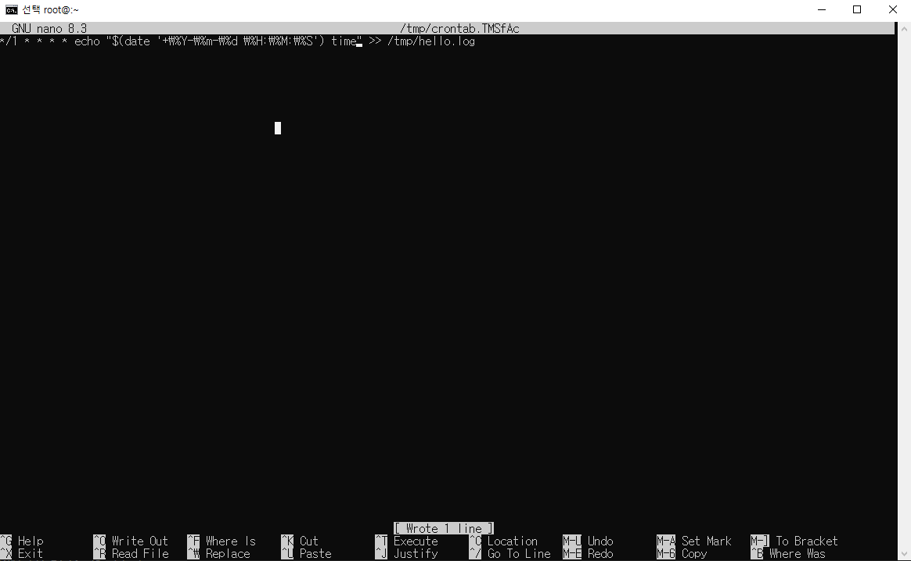

# [ 14주차 - 1120 ] - 오전

```bash
    금일 커리큘럼
        ├ 09:00 ~ 12:00 Devops (리눅스 프로세스, 백그라운드 작업, 로깅, cron)
        └ 13:00 ~ 18:00 Java (other posting...)
```

## 1. Linux 프로세스 관련 명령어

리눅스에서 명령어 통해 프로세스 확인하고, 종료 및 재시작 할 수 있음

### 프로세스 확인

`ps` **관련 명령어** : 현재 실행 중인 프로세스 목록을 확인하는 명령어
    - `top`, `htop` 등 다양한 프로세스 모니터링 도구도 존재함

- `ps` : 현재 터미널에서 실행 중인 프로세스만 표시

```bash
ps

  PID TTY          TIME CMD
 1234 pts/0    00:00:00 bash
 1256 pts/0    00:00:00 ps
```

- `ps aux` : **시스템 전체**의 모든 프로세스를 상세히 표시
    - **a** : 모든 사용자의 프로세스 표시
    - **u** : 프로세스 소유자, CPU 및 메모리 사용
    - **x** : 터미널에 종속되지 않은 프로세스도 표시

```bash
ps aux

# 출력 예시
USER       PID %CPU %MEM    VSZ   RSS TTY      STAT START   TIME COMMAND
root         1  0.0  0.1 225280  8488 ?        Ss   10:00   0:01 /sbin/init
root      1002  0.0  0.0 100000  6500 ?        S    10:04   0:00 sshd: user [priv]
user      1003  0.0  0.1  50000  5000 ?        S    10:04   0:00 sshd: user@pts/0
user      1234  0.1  0.5 105000 20000 pts/0    S+   10:05   0:00 bash
user      1256  0.0  0.2  50000  4000 pts/0    R+   10:06   0:00 ps aux
# ... (생략)
```

**필드 설명 :**

- **USER** : 프로세스 소유자
- **PID** : 프로세스 ID
- **%CPU** : CPU 사용률
- **%MEM** : 메모리 사용률
- **VSZ** : 가상 메모리 크기 (KB)
- **RSS** : 실제 메모리 사용량 (KB)
- **TTY** : 프로세스가 연결된 터미널
- **STAT** : 프로세스 상태
- **START** : 프로세스 시작 시간
- **TIME** : 프로세스가 사용한 총 CPU 시간
- **COMMAND** : 실행된 명령어


### 특정 프로세스 이름으로 찾기

`pgrep` **명령어** : 특정 이름을 가진 프로세스의 PID를 찾음

```bash
pgrep sshd

# 출력 예시
1002
1003
```

- `pgrep -l {프로세스이름}` : 프로세스 이름과 PID 함께 출력

```bash
pgrep -l sshd

# 출력 예시
1002 sshd
1003 sshd
```

- `pgrep -u {사용자이름} {프로세스이름}` : 특정 사용자의 프로세스만 검색

```bash
pgrep -u user sshd

# 출력 예시
1003
```


### 프로세스 종료 (kill)

`kill` **명령어** : 특정 PID의 프로세스를 종료

```bash
# 의미없는 프로세스 실행
sleep 100 &
sleep 100 &
sleep 100 &
sleep 100 &
sleep 100 &

# 백그라운드에서 실행된 sleep 프로세스 확인
pgrep -l sleep
# 출력예시
1301 sleep
1302 sleep
1303 sleep
1304 sleep
1305 sleep

# kill {PID}
kill 1302

# 종료 후 다시 확인
pgrep -l sleep
# 출력예시
1301 sleep
1303 sleep
1304 sleep
1305 sleep
```

`kill -9 {PID}` : 강제 종료 (일반 종료가 안될 때 사용)

```bash
kill -9 1303

# 종료 후 다시 확인
pgrep -l sleep
# 출력예시
1301 sleep
1304 sleep
1305 sleep
```

`killall {프로세스이름}` : 특정 이름을 가진 모든 프로세스 종료

```bash
killall sleep

# 종료 후 다시 확인
pgrep -l sleep
# 출력없음
```


`pkill {프로세스이름}` : 특정 이름을 가진 프로세스 종료 (killall과 유사)

```bash
pkill -u user sleep
```

---


## 2. Linux 백그라운드 작업

* Linux에서 명령어를 통해 포그라운드와 백그라운드 작업을 실행할 수 있음
* 포그라운드로 실행된 작업은 터미널을 점유하지만, 
* 백그라운드로 실행하면 터미널을 계속 사용할 수 있음


### 백그라운드 작업 실행

* `{명령어} &` : 명령어 뒤에 `&`를 붙여서 백그라운드로 실행

```bash
# 100초 동안 대기하는 sleep 명령어를 백그라운드로 실행
sleep 100 &

# 60초마다 현재 시간 출력하는 백그라운드 작업 실행
watch -n 60 date &
```

### 백그라운드 작업 확인

* `jobs` **명령어** : 현재 쉘 세션에서 실행 중인 백그라운드 작업 목록을 확인

```bash
jobs

# 출력 예시
[1]+  Running                 sleep 100 &
[2]-  Running                 watch -n 60 date &
```

### 백그라운드 작업 제어

* `bg` **명령어** : 포그라운드 -> 백그라운드로 전환 

```bash
top # 포그라운드에서 top 실행 후 [Ctrl + Z] 작업중단

# 중단된 작업을 백그라운드로 전환
bg
# or
bg %3  # 작업 번호 지정 가능
```

* `fg` **명령어** : 백그라운드 -> 포그라운드 전환 

```bash
# 백그라운드 작업을 포그라운드로 전환
fg %3  # 작업 번호 지정
```

* `kill %작업번호` : 백그라운드 작업 종료
    - 되도록이면 PID로 종료하는 것이 안전함

```bash
# 백그라운드 작업 종료 (비권장)
kill %2

# 또는 PID로 종료 (권장)
pgrep -l watch

# -> 출력 : 1306 watch

kill 1306
```

### 터미널 닫아도 프로세스 유지

* `nohup` **명령어** : 터미널 종료 후에도 프로세스를 계속 실행
    - 보통은 백그라운드 `&` 로 사용함

---

## 3. 로깅 작업

> 로깅 : 스크립트 실행 내역 파일로 기록하면서 문제 발생시 원인 파악 가능

### 기본 로깅

* `>>` 연산자 : 명령어 출력 결과를 파일에 추가 기록

```bash
#!/bin/bash

# 로그 파일 경로
LOG_FILE="/var/log/exam_script.log"

echo "[$(date +  '%Y-%m-%d %H:%M:%S')] logging Start" >> $LOG_FILE

# 주요 작업 수행
echo "[$(date +  '%Y-%m-%d %H:%M:%S')] 작업중..." >> $LOG_FILE

echo "[$(date +  '%Y-%m-%d %H:%M:%S')] logging End" >> $LOG_FILE
```

```bash
# 스크립트 실행
bash exam_script.sh

# 로그 파일 확인
cat /var/log/exam_script.log

# 출력 예시
[2025-11-20 10:00:00] logging Start
[2025-11-20 10:00:01] 작업중...
[2025-11-20 10:00:02] logging End
```

### 로깅 함수

* 로깅 기능을 함수로 구현하여 재사용 가능
* `level` 인자를 통해 로그 레벨 구분 가능 (INFO, ERROR, DEBUG 등)
* `tee -a` 명령어 : 콘솔 출력과 파일 기록 동시에 수행
* `$*` : 모든 인자를 하나의 문자열로 합침

```bash
#!/bin/bash

# 로그 파일 경로
LOG_FILE="/var/log/exam_script2.log"
VAR="TEST"

# 로깅 함수
log() {
    # 로그 레벨 (INFO, ERROR 등)
    local level=$1
    # 첫 번째 인자 제거 (level 값 제거)
    shift
    # 남은 인자들을 메시지로 합침
    echo "[$(date +  '%Y-%m-%d %H:%M:%S')] [$level] $*" | tee -a "$LOG_FILE"
}

# INFO 사용 예시
log "INFO" "실행 시작"
log "INFO" "작업진행중"

VAR="UPDATED"

# 디버그
log "DEBUG" "변수 값: $VAR"

# 에러 발생 시 로그
log "ERROR" "FILE못찾음: $FILE"

log "INFO" "실행 종료"
```

```bash
# 스크립트 실행
bash exam_script2.sh

# 로그 파일 확인
cat /var/log/exam_script2.log

# 출력 예시
[2025-11-20 10:10:00] [INFO] 실행 시작
[2025-11-20 10:10:01] [INFO] 작업진행중
[2025-11-20 10:10:02] [DEBUG] 변수 값: UPDATED
[2025-11-20 10:10:03] [ERROR] FILE못찾음: 
[2025-11-20 10:10:04] [INFO] 실행 종료
```


### 터미널에서 로그 레벨별로 색상을 표시

* ANSI 이스케이프 코드를 사용하여 터미널 출력에 색상 적용

```bash
#!/bin/bash

LOG_FILE="/var/log/exam_script3.log"

# 색상 코드
RED='\033[0;31m'
GREEN='\033[0;32m'
YELLOW='\033[1;33m'
NC='\033[0m' # No Color

log() {
    local level=$1
    shift
    local message="$*"
    local timestamp=$(date +'%Y-%m-%d %H:%M:%S')

    # 파일에 기록 (색상 없이)
    echo "[$timestamp] [$level] $message" >> "$LOG_FILE"

    # 화면에 출력 (색상 포함)
    case "$level" in
        ERROR)
            echo -e "${RED}[$timestamp] [$level] $message${NC}"
            ;;
        WARNING)
            echo -e "${YELLOW}[$timestamp] [$level] $message${NC}"
            ;;
        INFO)
            echo -e "${GREEN}[$timestamp] [$level] $message${NC}"
            ;;
        *)
            echo "[$timestamp] [$level] $message"
            ;;
    esac
}

# 사용 예시
log "INFO" "정상 작업"
log "WARNING" "주의가 필요한 상황"
log "ERROR" "오류 발생"
```

```bash
# 스크립트 실행
bash exam_script3.sh

# 터미널 출력 예시 (색상 적용됨)
[2025-11-20 10:20:00] [INFO] 정상 작업  # 녹색
[2025-11-20 10:20:01] [WARNING] 주의가 필요한 상황  # 노란색
[2025-11-20 10:20:02] [ERROR] 오류 발생  # 빨간색
```

### 로그 로테이션

* 로그 파일이 너무 커지는 것을 방지하기 위해 일정 크기 이상이 되면 새 파일로 교체하는 방법


```bash
#!/bin/bash

LOG_FILE="/var/log/exam_script4.log"
MAX_SIZE=10485760  # 10MB

# 로그 파일 크기 확인
if [ -f "$LOG_FILE" ]; then
    SIZE=$(stat -f%z "$LOG_FILE" 2>/dev/null || stat -c%s "$LOG_FILE" 2>/dev/null)

    if [ "$SIZE" -gt "$MAX_SIZE" ]; then
        # 백업 파일로 이동
        mv "$LOG_FILE" "$LOG_FILE.$(date +%Y%m%d%H%M%S)"
        # 새 로그 파일 시작
        touch "$LOG_FILE"
    fi
fi
```

``` bash
# 스크립트 실행
bash exam_script4.sh

# 로그 파일 확인
ls -lh /var/log/exam_script4.log*

# 출력 예시
-rw-r--r-- 1 user user 5.0M Nov 20 10:30 /var/log/exam_script4.log
```

* `-lh` 옵션 : 사람이 읽기 쉬운 형식으로 파일 크기 표시
- `*` : 해당 패턴에 맞는 모든 파일 표시 (백업 파일 포함)


---


## 4. Cron를 이용한 잡 스케줄링

* `cron` : Linux에서 정기적으로 작업을 예약 실행하는 데몬
* `crontab` : cron 작업을 설정하고 관리하는 명령어

### 패키지 매니저로 설치

```bash
# 설치
yum install -y cronie

# 서비스 시작 및 부팅 시 자동 시작 설정
systemctl enable --now crond

# cron 를 vim이 아닌 nano 에디터로 사용하기 위해 설치
yum install -y nano
```


### nano 에디터 적용하기

* `.bashrc` 파일에 아래 내용 추가

```bash
export EDITOR=nano
export VISUAL=nano
```

* 이후 `source ~/.bashrc` 명령어로 적용


### crontab 편집 및 설정

* `crontab -e` : 현재 사용자에 대한 crontab 편집
* `crontab -l` : 현재 사용자에 대한 crontab 목록 보기
* `crontab -r` : 현재 사용자에 대한 crontab 삭제

```bash
# crontab 편집
crontab -e

# crontab 예시 파일 내용 입력 (매 1분마다 시간기록)
*/1 * * * * echo "$(date '+\%Y-\%m-\%d \%H:\%M:\%S') time" >> /tmp/time.log

# crontab 저장 후 종료 
# (nano : Ctrl + O -> Enter -> Ctrl + X)

# crontab 목록 확인
crontab -l
# 출력 : */1 * * * * echo "$(date '+\%Y-\%m-\%d \%H:\%M:\%S') time" >> /tmp/time.log


# 2분뒤 /tmp/time.log 파일 확인
cat /tmp/time.log
# 출력 예시
2025-11-20 10:40:00 time
2025-11-20 10:41:00 time
```




### crontab 필드 문법 설명

```bash
* * * * * {명령어} >> {로그파일} 2>&1
- - - - -
| | | | |
| | | | +---- 요일 (0 - 7) (일요일=0 또는 7)
| | | +------ 월 (1 - 12)
| | +-------- 일 (1 - 31)
| +---------- 시 (0 - 23)
+------------ 분 (0 - 59)
```

* `*` : 모든 값 (매 분, 매 시간 등)
* `,` : 여러 값 지정 (예: `1,15` -> 1분과 15분)
* `-` : 범위 지정 (예: `1-5` -> 1분부터 5분까지)
* `/` : 간격 지정 (예: `*/10` -> 10분 간격)
* `>> {로그파일} 2>&1` : 명령어 출력과 에러를 지정한 로그 파일에 기록
    - 2>&1 : 표준 에러(2)를 표준 출력(1)으로 리다이렉트

```bash
# 예시 1: 매일 오전 2시에 백업 스크립트 실행
0 2 * * * /path/to/backup.sh >> /var/log/backup.log 2>&1

# 예시 2: 매주 월요일 오전 5시에 시스템 업데이트 실행
0 5 * * 1 /usr/bin/yum update -y >> /var/log/system_update.log 2>&1

# 예시 3: 매시간 15분마다 디스크 사용량 확인
15 * * * * /usr/bin/df -h >> /var/log/disk_usage.log 2>&1
```

---

## etc. 시그널 개념

> 시그널은 Linux에서 프로세스 제어를 위해 사용되는 일종의 메시지


### 시그널 종류

* `SIGTERM` (Terminate) : 프로세스 종료 요청 시그널, 기본 종료 시그널
    - **SIGTERM (15)** : 정상 종료 요청
* `SIGKILL` (Kill) : 강제 종료 시그널, 프로세스가 종료 요청을 무시할 때 사용
    - **SIGKILL (9)** : 강제 종료 요청
* `SIGINT` (Interrupt) : 일반적으로 터미널에서 [Ctrl + C] 입력 시 발생, 프로세스를 중단시킴
    - **SIGINT (2)** : 중단 요청


> 보통 `kill {PID}` 명령어는 `SIGTERM` 시그널을 보내고, `kill -9 {PID}` 명령어는 `SIGKILL` 시그널을 보냄


### 예시 시나리오

#### 1) 어떤 프로세스가 CPU를 과도하게 사용 중일 때

1. `top` 명령어 실행 후 `M` 키를 눌러 CPU 사용률 높은 프로세스 확인
2. 해당 프로세스의 PID 확인
3. `kill {PID}` 명령어로 `SIGTERM` 시그널 보내서 정상 종료 시도
4. 프로세스가 종료되지 않으면 `kill -9 {PID}` 명령어로 `SIGKILL` 시그널 보내서 강제 종료

```bash
# 예시
top
# top 후 m키 눌러서 출력결과
PID USER      PR  NI    VIRT    RES    SHR S  %CPU %MEM     TIME+ COMMAND
2345 user      20   0  162784  12344   2340 R  99.9  0.5   0:30.12 cpu_hog_process

# ----

kill 2345  # SIGTERM 시그널 보내기

# 만약 종료되지 않으면
kill -9 2345  # SIGKILL 시그널 보내기
```


#### 2) 원치않은 데몬이 여러개 실행 중일 때

데몬 : 백그라운드에서 실행되는 프로세스

1. `ps aux | grep {프로세스명}` 또는 `pgrep -l {프로세스명}` 명령어로 해당 데몬의 PID 확인
2. `killall {프로세스명}` 명령어로 `SIGTERM` 시그널 보내서 정상 종료 시도
3. 데몬이 종료되지 않으면 `killall -9 {프로세스명}` 명령어로 `SIGKILL` 시그널 보내서 강제 종료

```bash
# 예시
pgrep -l my_daemon

# 출력 예시
1001 my_daemon
1002 my_daemon


# ----
killall my_daemon  # SIGTERM 시그널 보내기

# 만약 종료되지 않으면
killall -9 my_daemon  # SIGKILL 시그널 보내기
```

#### 3) 특정 사용자 프로세스 모두 종료할 때

1. `pkill -u {사용자이름}` 명령어로 실행
2. 정상종료안되면 `pkill -9 -u {사용자이름}` 명령어로 강제 종료

```bash
# 예시
pkill -u user1  # SIGTERM 시그널 보내기

# 만약 종료되지 않으면
pkill -9 -u user1  # SIGKILL 시그널 보내기
```
