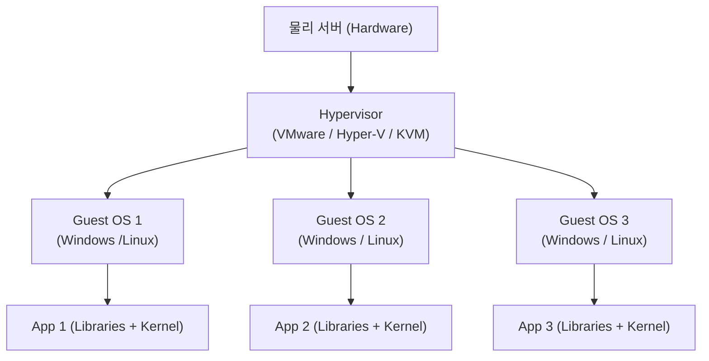
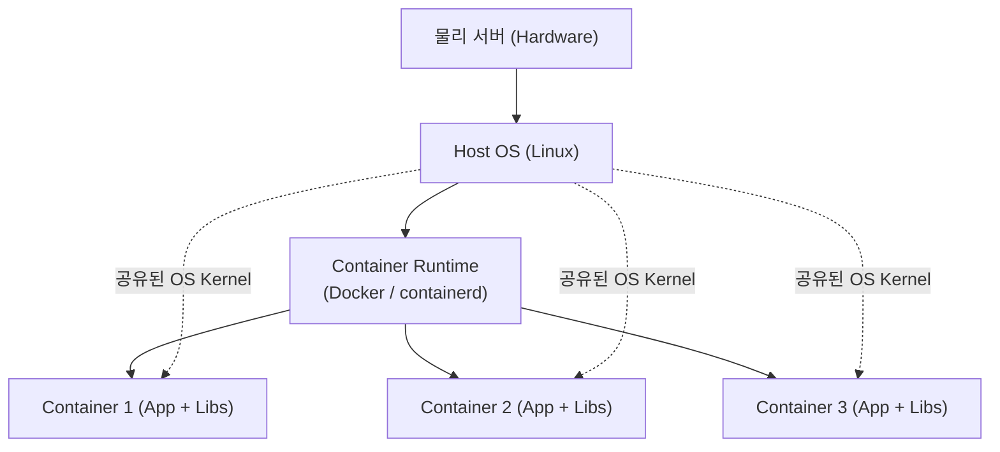
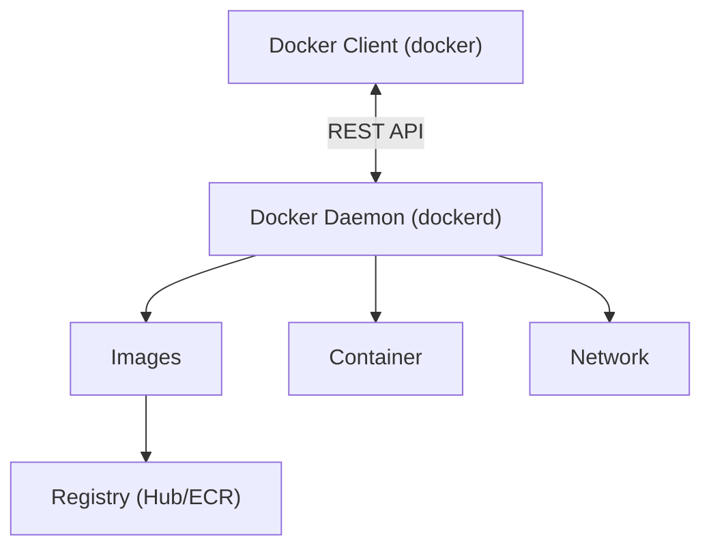

# [ 15주차 - 1124 ]

```bash
    금일 커리큘럼
        ├ 09:00 ~ 12:00 Devops (Docker 심화, ubuntu, nginx)
        └ 13:00 ~ 18:00 Devops (Docker 명령어 정리, Docker 네트워크)
```

## 1. Docker 개념 심화

### 1.1 가상머신(VM)과 컨테이너의 차이

#### 가상머신 아키텍처

- 하이퍼바이저 위에 여러 개의 OS가 올라감
- 각 OS마다 별도의 커널과 라이브러리를 가짐
- VM 간의 자원 낭비가 큼




#### 컨테이너 아키텍처

- 호스트 OS 위에 컨테이너 런타임이 올라감
- 컨테이너는 호스트 OS의 커널을 공유함
- 경량화되어 빠른 시작과 종료가 가능





### 1.2 vm과 container 비교

| 구분 | 가상머신 (VM) | 컨테이너(Container) |
|------|----------------|---------------------|
| **아키텍처** | 하이퍼바이저 기반 | 컨테이너 런타임 기반 |
| **자원 사용** | OS 별도 필요, 무거움 | OS 커널 공유, 가벼움 |
| **시작 시간** | 수 분 | 수 초 |
| **이식성** | 낮음 | 높음 |
| **성능** | 오버헤드 큼 | 거의 네이티브 수준 |
| **크기** | GB 단위 | MB 단위 |
| **보안격리** | 강력함(커널 독립) | 상대적으로 약함(커널 공유) |
| **배포/확장** | 느림 | 빠름 |
| **사용 사례** | 복잡한 애플리케이션, 레거시 시스템 | 마이크로서비스, 클라우드 네이티브 앱 |


### 1.3 docker 아키텍처

- **Docker = 클라이언트-서버 아키텍처**
    - 사용자는 Docker CLI를 통해 명령어를 입력하고, Docker 데몬이 처리
    - Docker 데몬 : 컨테이너 생성, 관리, 이미지 빌드 등을 담당


##### 아키텍처 Client–Server 구조




### 1.4 Docker 데몬 (Docker Engine)

**역할**

- 호스트 시스템에서 실제 **컨테이너 생성, 실행, 중지** 등 핵심 작업을 수행하는 백그라운드 프로세스
- `docker run`, `docker build` 같은 명령을 받아 실행

**동작 방식**

- 리눅스 커널의 **네임스페이스와 cgroups** 기능을 활용하여 격리된 환경 제공
- 클라이언트로부터 명령을 받아 컨테이너를 생성하고 관리
- 필요시 docker hub 등 레지스트리에서 이미지를 가져옴
- REST API를 통해 클라이언트와 통신할 수 있음

**확인 및 제어**

```bash
# 도커 데몬 정보 확인
docker info

# 도커 데몬 상태 확인
systemctl status docker

# 도커 데몬 제어
systemctl start docker   # 시작
systemctl stop docker    # 중지
systemctl restart docker # 재시작

# 도커 데몬 로그 확인
journalctl -u docker.service
```

### 1.5 Docker 클라이언트 (docker CLI)

**역할**

- 사용자가 도커와 상호작용할 수 있도록 하는 명령줄 인터페이스 (CLI)
- 도커 데몬에 `docker` 명령어를 통해 전달하고 결과를 출력


**주요 명령어**

```bash
# 도커 버전 확인
docker version

# 컨테이너 실행
# docker run <옵션> <이미지이름>:<태그> <명령어>
docker run ubuntu:22.04 bash    # 우분투 22.04 이미지로 bash 쉘 실행
docker run -it ubuntu /bin/bash # 대화형 터미널로 우분투 컨테이너 실행
docker run -d nginx             # 백그라운드에서 Nginx 컨테이너 실행
docker run --name mynginx -d nginx # 이름 지정하여 Nginx 컨테이너 실행

# 컨테이너 목록 확인
docker ps       # 실행 중인 컨테이너 목록 (-a: 전체)
docker ps -a

# 컨테이너 제어
docker start <컨테이너 ID 또는 이름>  # 컨테이너 시작
docker stop <컨테이너 ID 또는 이름>   # 컨테이너 중지
docker rm <컨테이너 ID 또는 이름>     # 컨테이너 삭제
docker logs <컨테이너 ID 또는 이름>   # 컨테이너 로그 확인
```


---


## 2. 우분투 (Ubuntu) 와 엔지엑스 (Nginx)

> 우분투와 엔지엑스는 Docker 환경에서 가장 많이 사용하는 리눅스 기반 OS 이미지와 경량 웹 서버

### 2.1 우분투 (Ubuntu) 란?

- 데비안(Debian) 기반의 리눅스 배포판
- 서버, 데스크탑, 클라우드 환경에서 모두 널리 사용
- 소프트웨어 패키지가 매우 풍부하고 사용성이 뛰어남
- LTS(Long Term Support) 버전 제공 → 5년 지원
- Docker에서 **기본 베이스 이미지로 가장 많이 사용됨**

#### 우분투 docker 이미지 설치 및 실행

- 우분투 도커 이미지를 다운로드하고 컨테이너 실행

```bash
# 최신 우분투 이미지 다운로드
docker pull ubuntu:latest

# 컨테이너 실행 (터미널진입)
docker run -it ubuntu /bin/bash
# ls, pwd, apt update 등 명령어 실행 가능 (exit로 종료)

# 컨테이너 이름 설정 및 백그라운드 실행
docker run -d --name myubuntu ubuntu sleep infinity
docker exec -it myubuntu /bin/bash # 컨테이너 접속
```


### 2.2 엔지엑스(Nginx)란?

- 고성능 **HTTP 웹 서버** & 리버스 프록시 서버
- **Node.js**, **Spring Boot** 등과 같이 많이 사용됨
- Docker 이미지가 매우 가벼움 (alpine 기준 20MB대)
- 정적 파일 서버로도 많이 활용

#### 엔지엑스 docker 이미지 설치 및 실행

- 엔지엑스 도커 이미지를 다운로드하고 컨테이너 실행

```bash
# 최신 Nginx 이미지 다운로드
docker pull nginx:latest

# 컨테이너 실행 (포트 매핑 포함)
docker run -d -p 8080:80 --name mynginx nginx

# 웹브라우저 접속
# http://localhost:8080


# ---
# 컨테이너 접속
docker exec -it mynginx /bin/bash

# 내부 디렉토리
cd /usr/share/nginx/html

# 정적파일 올리기 예시
echo "<h1>Hello Docker</h1>" > index.html
```

---


## 3. Docker 명령어 심화 정리

### 3.1 기본명령어

#### docker pull / push

- 외부에서 도커 이미지를 다운로드/업로드 할 때 사용

```bash
# 이미지 다운로드
# docker pull <이미지이름>:<태그>
docker pull ubuntu:22.04

# 이미지 업로드 (레지스트리 : Docker Hub)
# docker push <이미지이름>:<태그>
docker push myrepo/myapp:1.0
```

```bash
# ARM 아키텍처용 이미지 다운로드 
# ARM : 모바일, 임베디드 기기에서 주로 사용되는 저전력 CPU 아키텍처
docker pull --platform linux/arm64 ubuntu:latest

# AMD64 아키텍처용 이미지 다운로드
# AMD64 : 데스크탑, 서버용 고성능 CPU 아키텍처
docker pull --platform linux/amd64 ubuntu:latest
```

#### docker run 

- 컨테이너 생성 및 실행

```bash
# 기본문법
# docker run <옵션> <이미지이름>:<태그> <명령어>

# 예시 
# -it : 대화형 터미널 진입
docker run -it ubuntu:latest /bin/bash

# -d : 백그라운드 실행 , -p : 포트 매핑
docker run -d -p 8080:80 nginx:latest

# --name : 컨테이너 이름 지정
docker run --name mynginx -d -p 8080:80 nginx:latest

# -v : 볼륨 마운트 (호스트 디렉토리:컨테이너 디렉토리)
docker run -d -p 8080:80 -v /host/path:/usr/share/nginx/html nginx:latest

```

### docker ps

- 실행 중인 컨테이너 목록 확인

```bash
# 실행 중인 컨테이너 목록
docker ps

# 전체 컨테이너 목록 (중지된 컨테이너 포함)
docker ps -a


# 최근 생성된 컨테이너 n개 확인
docker ps -n 3

# 마지막 최근 컨테이너
docker ps -l

# 컨테이너 id만
docker ps -q

# 필터링
docker ps --filter "name=nginx"

# 포맷해서 보기
docker ps --format "{{.ID}}: {{.Names}} - {{.Status}}"
```

### docker 제어 (start/stop/restart/rm)

- **컨테이너 시작(start)**

```bash
# docker start <컨테이너 ID 또는 이름>
docker start mynginx

# 여러 컨테이너 실행
docker start container1 container2 container3

# 시작 및 로그 확인 (-a : attach)
docker start -a mynginx
```

- **컨테이너 중지(stop)**

```bash
# docker stop <컨테이너 ID 또는 이름>
docker stop mynginx

# 여러 컨테이너 중지
docker stop container1 container2 container3

# 강제 종료 (kill)
docker kill mynginx

# 타임스탬프 종료
docker stop -t 600 mynginx  # 600초 후 강제 종료
```

- **컨테이너 재시작(restart)**

```bash
# docker restart <컨테이너 ID 또는 이름>
docker restart mynginx

# 여러 컨테이너 재시작
docker restart container1 container2 container3

# 타임스탬프 재시작
docker restart -t 300 mynginx  # 300초 후 재시작
```


- **컨테이너 일시중지(pause)**

```bash
# 일시중지는 프로세스가 멈추지만 메모리는 유지됨
# docker pause <컨테이너 ID 또는 이름>
docker pause mynginx


# 일시중지 해제
docker unpause mynginx
```


- **컨테이너 삭제(rm)**

```bash
# docker rm <컨테이너 ID 또는 이름>
docker rm mynginx

# 강제 삭제
docker rm -f mynginx

# 여러 컨테이너 삭제
docker rm container1 container2 container3

# 중지된 컨테이너만 삭제
docker rm $(docker ps -a -q -f status=exited)

# 볼륨포함 삭제
# 볼륨 : 컨테이너의 데이터 저장소
docker rm -v mynginx
```

#### 실무활용 예시

```bash
# 수정후 컨테이너 재배포
docker stop myapp
docker rm myapp
docker run -d --name myapp myimage:1.1

# 설정 파일만 변경시
docker restart myapp

# 강제 종료
docker kill myapp
```

### 3.2 docker exec

- **실행 중인 컨테이너**에 명령어를 실행하거나 터미널로 접속할 때 사용
- 내부 터미널 명령어
    - `ls` : 디렉토리 목록 확인
    - `pwd` : 현재 디렉토리 확인
    - `cd` : 디렉토리 이동
    - `cat <파일명>` : 파일 내용 출력
    - `apt update` : 패키지 목록 업데이트 (우분투 기준)
    - `apt install <패키지명>` : 패키지 설치 (우분투 기준)
    - `apk update` : 패키지 목록 업데이트 (알파인 리눅스 기준)
    - `apk add <패키지명>` : 패키지 설치 (알파인 리눅스 기준)
    - `exit` : 터미널 종료
    - `ctrl + d` : 터미널 종료

```bash
# docker exec <옵션> <컨테이너 ID 또는 이름> <명령어>
docker exec -it mynginx /bin/bash

# 내부 터미널 ------

# 목록 확인 (-al : 상세 목록)
ls
ls /usr/share/nginx/html
ls -al /usr/share/nginx/html


# 파일내용 확인
cat /usr/share/nginx/html/index.html

# 패키지 설치 (우분투 기준)
apt update
apt install iputils-ping # ping 명령어 포함 패키지

# 패키지 설치 (알파인 리눅스 기준)
apk update
apk add iputils  # ping 명령어 포함 패키지

```


---


## 4. Docker 네트워크

### 4.1 Docker 네트워크 종류

- Docker network는 컨테이너 간 통신을 가능하게 하는 가상 네트워크
- 해당 네트워크는 다양한 드라이버를 통해 생성 및 관리됨
- 컨테이너의 IP 주소 할당, DNS 설정 등을 관리

| 드라이버 | 설명 | 사용 예시 |
| --- | --- | --- |
| bridge | 기본 네트워크, NAT 방식 | 단일 호스트 내 컨테이너 간 통신 |
| host | 호스트 네트워크 사용 | 고성능 네트워크 요구 시 |
| overlay | 여러 호스트 간 통신 | Docker Swarm, 멀티 통신 |
| macvlan | mac 주소 기반, 물리적 동작 | 레거시 네트워크 통합 |
| none | 인터페이스 없음 | 네트워크 격리 필요 시 |

### 4.2 Docker 네트워크 명령어

#### 네트워크 생성

```bash
# 드라이버 지정하여 네트워크 생성
#docker network create --driver <드라이버_이름> <네트워크_이름>
docker network create --driver bridge my_network
docker network create --driver overlay my_overlay

# 특정 서브넷으로 네트워크 생성
docker network create ^
    --driver bridge ^
    --subnet 192.168.1.0/24 ^
    --gateway 192.168.1.1 ^
    my_custom_network
```

#### 네트워크 목록 조회

```bash
docker network ls

# 예시 출력
# Network ID는 각 네트워크의 고유 식별자
NETWORK ID     NAME          DRIVER    SCOPE
b1d2c3e4f5g6   bridge        bridge    local
a2b3c4d5e6f7   host          host      local
c3d4e5f6g7h8   my_overlay    overlay   swarm
fd87845c2afd   mysql_default bridge    local
```


#### 네트워크 상세 정보 조회

```bash
#docker network inspect <네트워크_이름>
docker network inspect mysql_default


# 예시 출력
[
    {
        "Name": "mysql_default",
        "Id": "...",
        "Created": "2025-09-09T02:25:55.045703099Z",
        "Scope": "local",
        "Driver": "bridge",
        "EnableIPv4": true,
        "EnableIPv6": false,
        "IPAM": {
            "Driver": "default",
            "Options": null,
            "Config": [
                {
                    "Subnet": # // 생략... (예: "172.xx.xx.0/xx"),
                    "Gateway": # // 생략... (예: "172.xx.xx.1")
                }
            ]
        },
        "Internal": false,
        "Attachable": false,
        "Ingress": false,
        "ConfigFrom": {
            "Network": ""
        },
        # // 생략...
    }
]
```

#### 네트워크 삭제

```bash
#docker network rm <네트워크_이름>
docker network rm my_network
```

#### 컨테이너를 특정 네트워크에 연결 및 분리

```bash
# docker network connect <네트워크_이름> <컨테이너_이름>
docker network connect my_network my_container

# docker network disconnect <네트워크_이름> <컨테이너_이름>
docker network disconnect my_network my_container
```


### 4.3 네트워크 선택 가이드

**1. Bridge 네트워크**
- 기본 네트워크로, 단일 호스트 내에서 컨테이너 간 통신이 필요할 때 사용
- 개발 및 테스트 환경에 적합

**2. Host 네트워크**
- 고성능 네트워크가 필요한 경우 사용
- 컨테이너가 호스트의 네트워크 스택을 직접 사용하므로, 네트워크 오버헤드가 줄어듦
- 보안에 민감한 애플리케이션에는 권장되지 않음

**3. None 네트워크**
- 네트워크 격리가 필요한 경우 사용
- 컨테이너가 외부 네트워크와 통신하지 않도록 할 때 유용


### 4.4 Bridge 네트워크 구성

- Docker 설치시 자동으로 생성되는 기본 네트워크
- 단일 호스트(PC 한 대) 안에서 컨테이너들이 서로 통신할 수 있도록 만들어줌
- 컨테이너 간 통신을 위해 NAT 방식을 사용
- **스위치 + NAT 라우터 역할**

```bash
# 기본 Bridge 네트워크에서 컨테이너 실행
# (-d : 백그라운드 실행, --name : 컨테이너 이름 지정, nginx : 이미지 이름)
docker run -d --name my_container nginx

# 컨테이너 ip 확인
# powershell
docker inspect my_container |  Select-String "IPAddress"
# linux
docker inspect my_container | grep "IPAddress"
# cmd
docker inspect my_container | findstr "IPAddress"

# 예시 출력
# "IPAddress": "172.xx.xx.xx",
```

✅ **장점** : 
1. 기본 제공, 설정 없이 즉시 사용
2. 컨테이너 간 통신 자동 처리
3. NAT 기반이라 외부와 통신 문제 없음
4. 격리성이 좋아 개발 환경에 적합

❌ **단점** :
1. 여러 호스트(Docker가 여러 서버)에 걸쳐 통신 불가
2. 고성능 네트워크 요구 시 한계
3. 포트 매핑 없으면 외부에서 접근 불가


### 4.5 host 네트워크 구성

- 컨테이너가 호스트(PC)의 네트워크 스택을 그대로 사용
- 즉, 컨테이너 **내부와 외부 호스트의 IP 주소가 동일**하게 됨
- NAT 오버헤드가 사라져 성능이 가장 좋지만, **포트 충돌에 주의**해야 함

```bash
# host 네트워크 모드로 컨테이너 실행
docker run -d --network host --name my_host_container nginx

# 컨테이너 내부 접속후 확인시
docker exec -it my_host_container sh
hostname -I   # 호스트와 동일한 IP 출력됨
```

✅ **장점** :
1. NAT 오버헤드 없음 → 네트워크 성능 최상
2. 게임 서버, 고성능 프록시, 로우레벨 네트워크 애플리케이션에 적합
3. 호스트와 동일 포트/동일 IP 그대로 사용

❌ **단점** :
1. 포트 충돌 발생 가능 (호스트와 동일 포트 사용 시)
2. 컨테이너 간 네트워크 격리 없음 (보안성 낮음)
3. Windows/Mac은 host 모드가 제한적 (Linux에서 완전 지원)


### 4.6 none 네트워크 구성

- 컨테이너에 네트워크 인터페이스를 아예 부여하지 않음
- 외부 통신, 내부 통신 모두 불가능
- **내부에서 localhost**만 사용 가능
- **네트워크 격리가 필요하거나** 계산 전용(배치 작업)에서 유용함

```bash
# none 네트워크로 컨테이너 실행
docker run -d --network none --name my_none_container nginx

# 컨테이너 내부 접속후 확인시
docker exec -it my_none_container sh
ip a
# 예시 출력
# 1: lo: <LOOPBACK,UP,LOWER_UP> mtu 65536 qdisc noqueue state UNKNOWN group default qlen 1000
#     link/loopback 00:00:00:00:00:00 brd 00:00:00:00:00:00
#     inet
#     inet6

# 컨테이너 내부에서는 오직 lo(루프백) 인터페이스만 존재
```


✅ **장점** :
1. 완전한 네트워크 격리 → 보안 테스트, 샌드박스 환경에 적합
2. 네트워크가 필요 없는 배치 처리, 계산용 컨테이너에 적합

❌ **단점** :
1. 외부와 통신 불가능
2. DB, 서버 등 네트워크 필요한 서비스에는 부적합


---

