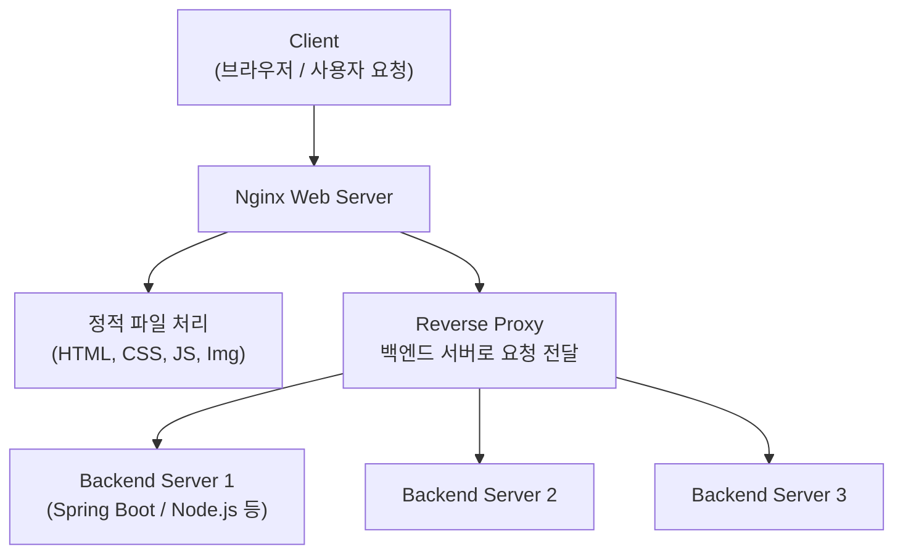
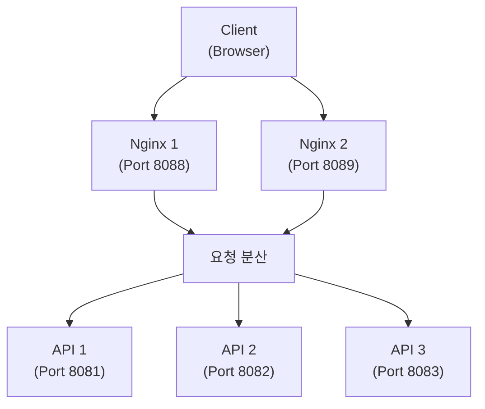

# [ 15주차 - 1126 ]

```bash
    금일 커리큘럼
        ├ 09:00 ~ 12:00 Devops (Nginx 이해, 로드밸런싱 이해)
        └ 13:00 ~ 18:00 Devops (nginx 로드밸런싱 환경 구성 실습)
```

## 1. Nginx 이해

> Nginx : 웹서버 & 리버스 프록시 서버

### 주요특징

1. **이벤트 기반 아키텍처** : 비동기 I/O 처리
2. **낮은 메모리 사용량** : 적은 리소스로 많은 연결 처리
3. **높은 성능** : C10K 문제 해결 (C10K : 1만개의 동시 접속 처리 문제)
4. **다양한 기능** : 로드 밸런싱, 캐싱, SSL 종료 등


### Apache 랑 Nginx 비교

| 특징 | Apache | Nginx |
|------|--------|-------|
| **아키텍처** | 프로세스/스레드 기반 | 이벤트 기반 |
| **동시연결** | 제한적 | 매우 높음 |
| **리소스 사용량** | 높음 | 낮음 |
| **정적파일** | 느림 | 빠름 |
| **동적컨텐츠** | 모듈 통해 처리 | Reverse Proxy 별도 필요 |


### Nginx 의 주요 용도

1. **정적파일 서비스**
  - HTML, CSS, JS, 이미지 등 정적 컨텐츠 제공
  - 빠른 **응답 속도** 제공 (비동기 I/O 처리)

2. **리버스 프록시 서버**
  - 클라이언트 요청을 백엔드 **서버로 중계**
  - 백엔드 서버의 **IP와 포트 은닉** 가능
  - 보안을 강화할 수 있음

3. **로드 밸런싱**
  - 여러 대의 서버에 **트래픽 분산**
  - 서버 부하 분산 및 가용성 향상

4. **SSL/TLS 종단 처리**
  - SSL 인증서 관리 및 암호화/복호화 처리
  - 백엔드 서버의 부하 감소
  - 인증은 Nginx에서 처리하고, 백엔드 서버는 평문 HTTP로 통신 가능


5. **캐싱**
  - 자주 요청되는 컨텐츠를 캐시에 저장
  - 응답 속도 향상 및 백엔드 서버 부하 감소


### Nginx 처리 과정 구조



1. 클라이언트가 Nginx 서버에 요청을 보냄
2. Nginx는 요청이 정적 파일인지 확인
  - 정적 파일이면 직접 처리하여 응답
  - 동적 요청이면 리버스 프록시를 통해 백엔드 서버로 전달
3. 백엔드 서버는 요청을 처리하고 Nginx로 응답 반환
4. Nginx는 백엔드 서버의 응답을 클라이언트에 전달


#### Forward Proxy 와 Reverse Proxy 비교

**Forward Proxy** : 클라이언트가 **서버에 요청을 보낼 때** 중계 역할

```bash
클라이언트 --> 포워드 프록시 --> 인터넷 --> 대상 서버
```

- 클라이언트를 대신하여 요청 수행
- 클라이언트의 IP 주소를 숨김
- 주로 내부 네트워크에서 외부 인터넷 접근 시 사용
  - 예: 방화벽, VPN 등


- **Reverse Proxy** : 서버가 **클라이언트 요청을 받을 때** 중계 역할

```bash
클라이언트 --> 인터넷 --> 리버스 프록시 --> 백엔드 서버
```

- 서버를 대신하여 요청 처리
- 백엔드 서버의 IP 주소와 포트를 숨김
- 주로 로드 밸런싱, 보안 강화 등에 사용
  - 예: Nginx, HAProxy 등


---


## 2. 로드 밸런싱의 이해

### 2.1 로드 밸런싱 (Load Balancing)

> 여러 대의 서버에 트래픽을 분산시켜 서버 부하를 줄이고 가용성을 높이는 기술

- **주요 목적** : 성능 향상, 장애 대응, 확장성 확보

- **장점**
  - 서버 과부하 방지
  - 응답 시간 단축
  - 시스템 안정성 향상

- **로드 밸런서 종류**
  - 하드웨어 로드 밸런서 : 전용 장비 사용
  - 소프트웨어 로드 밸런서 : Nginx, HAProxy 등


### 2.2 로드 밸런싱 알고리즘

#### 1) 라운드 로빈 (Round Robin)

- **순차**적으로 요청을 각 서버에 분배
- 간단하고 구현이 쉬움
- 단점 : 서버 성능 차이를 고려하지 않음

```bash
Client Request 1 --> Server 1
Client Request 2 --> Server 2
Client Request 3 --> Server 3
Client Request 4 --> Server 1 
#... 반복
```

#### 2) 가중치 기반 라운드 로빈 (Weighted Round Robin)

- 서버별로 **가중치를 부여**하여 요청 분배
- 성능이 좋은 서버에 더 많은 요청 할당

```bash
upstream backend {
    # weight 값 설정
    server backend1.example.com weight=3; # 더 많은 요청 할당
    server backend2.example.com weight=1;
    server backend3.example.com weight=2;
}
```

#### 3) 최소 연결 (Least Connections)

- 현재 **연결 수가 가장 적은** 서버에 요청 분배
- 세션이 긴 요청에 유리

```bash
upstream backend {
    least_conn;
    server backend1.example.com;
    server backend2.example.com;
    server backend3.example.com;
}
```

#### 4) IP 해시 (IP Hash)

- 클라이언트의 **IP 주소를 기반**으로 요청 분배
- 세션 지속성 유지에 유리

```bash
upstream backend {
    ip_hash;
    server backend1.example.com;
    server backend2.example.com;
    server backend3.example.com;
}
```

#### 최소연결과 IP해시의 차이 이해

| 구분 | 최소 연결 | IP 해시 (IP Hash) |
|------|-------------------------------|-------------------|
| **기준** | 현재 연결 수가 가장 적은 서버 | 클라이언트 IP 주소 기반 |
| **특징** | 부하 분산에 효과적 | 세션 지속성 유지에 유리 |
| **장점** | 서버 부하 균등 분배 | 동일 클라이언트가 동일 서버에 연결 |
| **단점** | 세션 지속성 보장 어려움 | 서버 부하 불균형 가능성 |
| **사용 사례** | 트래픽이 고르게 분산되어야 할 때 | 로그인 세션 유지가 필요한 서비스 |


### 2.3 Health Check (헬스 체크)

- 백엔드 서버의 상태를 주기적으로 확인하여 정상적인 서버에만 요청을 분배

#### 수동 헬스체크 방식

```bash
upstream backend {
    # max_fails : 최대 실패 횟수 설정
    # fail_timeout : 실패 간격 설정
    server backend1.example.com max_fails=3 fail_timeout=30s;
    server backend2.example.com max_fails=3 fail_timeout=30s;
    server backend3.example.com max_fails=3 fail_timeout=30s;
}
```

---


## 3. nginx 로드 밸런싱 환경 구성

### 3.1 시나리오 예시




### 3.2 Spring Boot 작업

#### 컨트롤러 작성

* hostname 과 현재 시간 정보를 반환하는 REST API 작성

```java
@RestController
public class ExamController {

    @GetMapping("/")
    public String index() {
        return "Exam Spring Boot - index";
    }

    @GetMapping("/info")
    public String getServerInfo() throws Exception {
        String hostname = InetAddress.getLocalHost().getHostName();
        LocalDateTime now = LocalDateTime.now();
        DateTimeFormatter formatter = DateTimeFormatter.ofPattern("yyyy-MM-dd HH:mm:ss");

        return "Server: " + hostname + " | Time: " + now.format(formatter);
    }
}
```

#### 애플리케이션 빌드

* 그래들 빌드 실행

```bash
# 그래들 빌드 테스트 제외
./gradlew clean build -x test
```

* 스프링부트 관련 도커파일 작성

```bash
# 첫번째 스테이지
FROM eclipse-temurin:21-jdk-alpine AS build
WORKDIR /app

COPY gradlew .
COPY gradle gradle
COPY build.gradle settings.gradle ./
RUN chmod +x ./gradlew
COPY src src
RUN ./gradlew clean build -x test --no-daemon

# 두번째 스테이지
FROM eclipse-temurin:21-jdk-alpine
WORKDIR /app

COPY --from=build /app/build/libs/*-SNAPSHOT.jar todoapp.jar
ENTRYPOINT ["java", "-jar", "todoapp.jar"]
```

* 도커 이미지 빌드

```bash
docker build -t my-spring-app:1.0 .
```

### nginx conf 및 빌드

* nginx.conf 작성

```bash
worker_processes  1; # 프로세스 수 정의

events {
    # 프로세스당 커넥션 수
    worker_connections  1024;
}

http {
    # 가상그룹 설정 (여러개가능)
    upstream spring-backend {
        # Round Robin 방식 (기본값)
        # <컨테이너네임>:<컨테이너포트>
        server api1:8080 max_fails=3 fail_timeout=30s;
        server api2:8080 max_fails=3 fail_timeout=30s;
        server api3:8080 max_fails=3 fail_timeout=30s;
    }

    server {
        listen 80;

        location /nginx_status {
            stub_status on;
            access_log off;
            allow 127.0.0.1;
            allow 172.0.0.0/8;  # Docker 네트워크
            deny all;
        }

        location / { # '/' 모든요청
            # 해당 가상그룹 통해서 처리
            proxy_pass http://spring-backend;
            proxy_set_header Host $host;
            proxy_set_header X-Real-IP $remote_addr;
            proxy_set_header X-Forwarded-For $proxy_add_x_forwarded_for;
            proxy_set_header X-Forwarded-Proto $scheme;
        }
    }
}
```

* nginx 관련 도커파일 작성

```bash
FROM nginx:latest
COPY nginx.conf /etc/nginx/nginx.conf
EXPOSE 80
```

* 도커 이미지 빌드

```bash
docker build -t mynginx:1.0 .
```


#### docker-compose 작성

- 3개의 Spring Boot API 컨테이너 (api1, api2, api3)
- 2개의 Nginx 로드 밸런서 컨테이너 (nginx1, nginx2)
- 모두 동일한 도커 네트워크(spring-net) 사용

```yaml
services:
  api1:
    image: my-spring-app:1.0
    container_name: api1
    hostname: api1
    environment:
      - SERVER_PORT=8080
    ports:
      - "8081:8080"
    networks:
      - spring-net

  api2:
    image: my-spring-app:1.0
    container_name: api2
    hostname: api2
    environment:
      - SERVER_PORT=8080
    ports:
      - "8082:8080"
    networks:
      - spring-net

  api3:
    image: my-spring-app:1.0
    container_name: api3
    hostname: api3
    environment:
      - SERVER_PORT=8080
    ports:
      - "8083:8080"
    networks:
      - spring-net

  nginx1:
    image: mynginx:1.0
    container_name: nginx1
    ports:
      - "8088:80"
    networks:
      - spring-net
    depends_on:
      - api1
      - api2
      - api3
  nginx2:
    image: mynginx:1.0
    container_name: nginx2
    ports:
      - "8089:80"
    networks:
      - spring-net
    depends_on:
      - api1
      - api2
      - api3


networks:
  spring-net:
    external: true
```


#### 실행 및 확인

* 해당 도커-컴포즈파일 경로에서 아래 명령어 실행

```bash
docker-compose up -d
```

* curl로 요청 테스트

```bash
# ngx1, nginx2 에 각각 요청 보내기
curl http://localhost:8088/info
curl http://localhost:8089/info

# 출력 예시
# Server: api2 | Time: 2025-11-26 14:15:30
# Server: api1 | Time: 2025-11-26 14:15:32
```


* 브라우저에서 아래 URL 접속하여 로드 밸런싱 확인
  - Nginx 1 : http://localhost:8088/info
  - Nginx 2 : http://localhost:8089/info
  - 여러번 새로고침하여 요청이 api1, api2, api3로 분산되는지 확인


---
