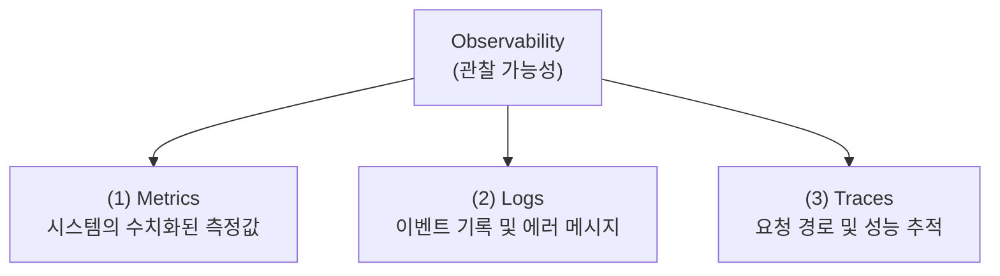
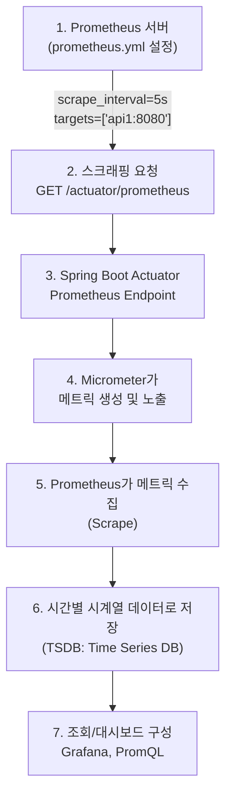
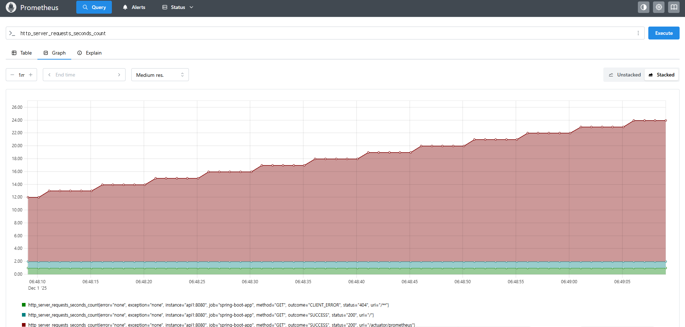

# [ 16주차 - 1201 ]

```bash
    금일 커리큘럼
        ├ 09:00 ~ 12:00 Devops (모니터링, Spring Boot Actuator)
        └ 13:00 ~ 18:00 Devops (Prometheus 메트릭)
```

## 1. 모니터링 배경 지식

### 1.1 모니터링 이해

- 애플리케이션이 운영 환경에서 잘 **동작하는지 확인**하기 위해서는 모니터링이 필요
- 모니터링을 통해 애플리케이션의 **상태, 성능, 리소스 사용량** 등을 실시간으로 파악 가능

### 1.2 모니터링 주요 목적

1. **장애 조기 감지**
    - 시스템 장애를 조기에 감지하여 신속한 대응 가능
    - 장애 : 메모리 부족, CPU 과부하, 네트워크 지연 등

2. **성능 최적화**
    - 애플리케이션의 성능 병목 지점을 파악하여 최적화 가능
    - 예: 응답 시간, 느린 API 엔드포인트 식별, 데이터베이스 쿼리 성능 분석 등
    - **엔드포인트** : API가 제공하는 기능의 URL 주소

3. **용량 계획**
    - 리소스 사용량 추이를 분석하여 향후 용량 계획 수립 가능
    - 예: 트래픽 증가에 따른 서버 확장 계획 등

4. **사용자 경험 개선**
    - 리소스 사용량과 성능 데이터를 분석하여 안정적 서비스 제공 가능
    - 예: 페이지 로딩 시간 단축, 응답 시간 개선 등

### 1.3 모니터링 사용 사례

- **상황** : 온라인 스토어에서 매주 월요일 아침 서버 속도 저하

- **모니터링 결과** :
    - CPU 사용률 : 평소 70% → 95% 급증
    - 메모리 사용량 :  평소 65% → 90% 급증
    - HTTP 요청 수 : 평소 500 req/s → 5000 req/s 급증

- **원인 확인** : 주말동안 쌓인 주문량이 월요일 아침에 몰림

- **대응 방안** : 배치 작업을 분산 처리, 새벽 시간대로 변경, 서버 증설 등


### 1.4 Observability 의 주요 구성 요소

- 관찰 가능성(Observability)은 시스템의 내부 상태를 외부에서 관찰할 수 있는 능력을 의미
- 다음 세 가지 주요 구성 요소로 이루어짐
    - 로그 (Logs)
    - 메트릭 (Metrics)
    - 트레이스 (Traces)



#### (1) 메트릭 (Metrics)

- 시스템의 상태를 수치화한 측정값
- 시계열 데이터(Time-series data)로 저장되어 시간에 따른 변화를 추적 가능
- **예** : CPU 사용률, 메모리 사용량, 응답 시간 등
- **사용용도** : 
    - n시간 동안 사용률 변화 추적
    - 특정 임계값 초과하는지 모니터링
    - 초당 요청 수 분석

| 메트릭 | 설명 | 예시 |
|--------|------|------|
| `jvm_memory_used_bytes` | JVM이 사용 중인 메모리 양 | 256MB |
| `http_server_requests_seconds` | HTTP 요청 처리 시간 | 0.35초 |
| `cpu_usage_percentage` | CPU 사용률 | 75% |
| `db_connection_count` | 데이터베이스 연결 수 | 5 |


#### (2) 로그 (Logs)

- 시스템에서 발생하는 이벤트를 시간 순서대로 기록한 데이터
- 텍스트 형식이며, 에러 메시지, 경고, 정보성 메시지 등을 포함
- **예** : 애플리케이션 로그, 서버 로그, 보안 로그 등
- **사용용도** : 
    - 어떤 이벤트가 발생했는지 추적
    - 에러가 발생한 시점과 내용 파악

```bash
2025-12-01 10:15:30 INFO  [com.example.MyApp] - Application started successfully.
2025-12-01 10:16:05 ERROR [com.example.MyApp] - Database connection failed: timeout.
2025-12-01 10:17:20 WARN  [com.example.MyApp] - High memory usage detected: 85%.
```


#### (3) 트레이스 (Traces)

- 하나의 요청이 여러 서비스를 거쳐 처리되는 과정을 추적한 데이터
- 분산 추적, 요청 생애주기 시각화
- microservices 아키텍처에서 특히 중요
- **예** : 사용자가 웹 페이지를 요청 → 요청이 여러 마이크로서비스를 거쳐 처리 → 응답 반환
- **사용용도** : 
    - 요청 처리 과정에서의 병목 지점 파악
    - 어떤 서비스 에서 지연이 발생했는지 확인

```bash
sequenceDiagram
    autonumber

    participant User as 사용자
    participant Gateway as API Gateway
    participant Order as Order Service
    participant Inventory as Inventory Service
    participant Payment as Payment Service
    participant Notification as Notification Service

    User->>Gateway: POST /orders
    Gateway->>Order: 요청 전달 (5ms)

    Order->>Inventory: 재고 확인 (30ms)
    Inventory-->>Order: 재고 OK

    Order->>Payment: 결제 처리 (80ms)
    Payment-->>Order: 결제 완료

    Order->>Notification: 알림 전송 (10ms)
    Notification-->>Order: 알림 완료

    Order-->>Gateway: 주문 처리 완료 (총 125ms)
    Gateway-->>User: 응답 반환
```


### 1.5 메트릭의 4가지 종류

1. **카운터 (Counter)** : 항상 누적 증가하는 값
    - 초기값 0에서 시작하여 절대 감소하지 않음
    - 예: 요청 수, 에러 수

2. **게이지 (Gauge)** : 현재 상태를 나타내는 값
    - 해당 시점의 값을 나타내며 증가 및 감소 가능
    - 예: CPU 사용률, 메모리 사용량

3. **히스토그램 (Histogram)** :값의 분포를 나타내는 값
    - 값의 범위를 여러 구간으로 나누어 각 구간에 속하는 값의 개수를 집계
    - 예: 응답 시간 분포, 요청 크기 분포

4. **요약 (Summary)** : 특정 기간 동안의 통계 요약
    - 백분위수(percentile) 계산에 사용
    - 예: 95번째 백분위수 응답 시간, 평균 응답 시간

---


## 2. Spring Boot Actuator

> Spring Boot 애플리케이션의 상태, 메트릭, 정보 등을 확인하고 관리 기능을 제공하는 라이브러리


### 2.1 주요 기능

- **헬스 체크** : 애플리케이션의 상태를 확인하는 엔드포인트 제공
- **메트릭 수집** : 다양한 메트릭(예: JVM, HTTP 요청, 데이터베이스 등) 수집
- **환경 정보** : 애플리케이션의 환경 설정 정보 제공
- **로거 레벨 변경** : 런타임 시 로거 레벨 변경 가능
- **스레드 덤프 및 힙 덤프** : 스레드 상태 및 힙 메모리 상태 확인 가능


### 2.2 환경 구성

> 권장 버전: Spring Boot 3.3.5 이상 (현재 4.x 릴리즈 호환성 확인 필요)

#### Actuator 의존성 추가 (build.gradle)

- spring-boot-starter-actuator 의존성을 build.gradle 파일에 추가
- 의존성 추가시 actuator 관련 빈들이 자동으로 등록됨

```bash
dependencies {
    implementation 'org.springframework.boot:spring-boot-starter-web'
    implementation 'org.springframework.boot:spring-boot-starter-actuator'
}
```

#### Actuator 의 엔드포인트

- 기본적으로 여러 엔드포인트가 비활성화 되어 있음

| 엔드포인트 | 설명 | 기본 상태 |
|-------------|------|------------|
| `/actuator/health` | 애플리케이션 상태(up/down) | ✅ |
| `/actuator/info` | 애플리케이션 정보 | ❌ |
| `/actuator/metrics` | 수집된 메트릭 목록 | ❌ |
| `/actuator/metrics/{metric.name}` | 특정 메트릭 상세 정보 | ❌ |
| `/actuator/prometheus` | Prometheus 형식의 메트릭 제공 | ❌ |
| `/actuator/loggers` | 로거 레벨 조회 및 변경 | ❌ |
| `/actuator/threaddump` | 스레드 덤프 제공 | ❌ |
| `/actuator/env` | 환경 변수 및 설정 정보 제공 | ❌ |

#### 엔드포인트 설정 (application.yml)

- application.properties 또는 application.yml 파일에 설정 추가

```bash
# application.yml

management:
  endpoints:
    web:
      exposure: # 활성화할 엔드포인트 목록
        include:
          - health
          - info
          - metrics
          - loggers
          - threaddump
          - prometheus

  endpoint: # 각 엔드포인트별 세부 설정
    health:
      show-details: ALWAYS # ALLWAYS (모든), WHEN_AUTHORIZED (인증된사용자), NEVER (숨김)

  health: # 헬스체크 세부 설정
    db:
      enabled: true
    diskspace:
      enabled: true

  info: # 애플리케이션 정보 설정
    env:
      enabled: true

info: # 애플리케이션 메타데이터 설정
  app:
    name: "spring-boot-actuator-app"
    version: "1.0.0"
  team: "Backend Team"
```

- `management.endpoints.health.show-details` 설정 옵션
    - ALWAYS : 모든 사용자에게 헬스체크 상세 정보 노출
    - WHEN_AUTHORIZED : 인증된 사용자에게만 상세 정보 노출
    - NEVER : 헬스체크 상태만 노출, 상세 정보 숨김

### 2.3 커스텀 헬스체크 Indicator 구현 방법

```java
import org.springframework.boot.actuate.health.Health;
import org.springframework.boot.actuate.health.HealthIndicator;
import org.springframework.stereotype.Component;

@Component
public class CustomHealthIndicator implements HealthIndicator {
    // '/actuator/health' 엔드포인트 호출 시 실행
    // 해당 'components' 내
    // 클래스명 중 'HealthIndicator' 접미사 제거되고 custom 으로 노출됨

    @Override
    public Health health() {
        // 외부 서버 상태 체크 로직
        boolean serverIsUp = checkExternalServer();

        if (serverIsUp) {
            return Health.up() // 헬스 상태가 정상일 때
                .withDetail("externalServer", "OK") // 추가 정보 메서드
                .withDetail("responseTime", "150ms")
                .build();
        } else {
            return Health.down()
                .withDetail("externalServer", "Not Responding")
                .withDetail("error", "Connection timeout")
                .build();
        }
    }

    private boolean checkExternalServer() {
        // 실제 서버 체크 로직 (HTTP 요청, Ping 등)
        try {
            // 외부 API 호출 예시
            // RestTemplate, WebClient 등 사용
            return true;
        } catch (Exception e) {
            return false;
        }
    }
}
```

```bash
# curl http://localhost:8080/actuator/health

{
  "status": "UP", # 서버 상태 표시부분
  "components": {
    "custom": { # 커스텀 헬스체크 Indicator 이름
      "status": "UP",
      "details": {
        "externalServer": "OK",
        "responseTime": "150ms"
      }
    },
    "db": { # 기본 제공되는 DB 헬스체크
      "status": "UP",
      "details": {
        "database": "MySQL", # 사용중인 DB 종류
        "validationQuery": "isValid()"
      }
    },
    "diskSpace": { # 기본 제공되는 디스크 공간 헬스체크
      "status": "UP",
      "details": { # 디스크 공간 정보
        "total": 1081101176832,
        "free": 1015496613888,
        "threshold": 10485760, # 스레드홀드 (임계값)
        "path": "/app/.",
        "exists": true
      }
    },
    "ping": { # 기본 제공되는 Ping 헬스체크
      "status": "UP"
    },
    "ssl": { # 기본 제공되는 SSL 헬스체크
      "status": "UP",
      "details": { # SSL 인증서 정보
        "validChains": [],
        "invalidChains": []
      }
    }
  }
}
```

### 2.4 주요 엔드포인트 URL 설명

#### (1) /actuator/health : 헬스체크

- 애플리케이션의 현재 상태를 확인
- 기본적으로 "UP" 또는 "DOWN" 상태 반환
- 커스텀 헬스체크 Indicator 추가 가능


#### (2) /actuator/metrics : 메트릭 조회

- JVM Heap 사용량
- 가비지컬렉션(GC) 통계
- http 요청, 응답 시간 통계
- db 커넥션 풀 상태 등 다양한 메트릭 제공

- **메트릭 목록**
    - `/jvm.memory.used` : JVM이 사용 중인 메모리 양
    - `/jvm.gc.pause` : 가비지 컬렉션으로 인한 일
    - `/http.server.requests` : HTTP 요청 처리 시간
    - `/db.connection.count` : 데이터베이스 연결 수

```bash
# curl http://localhost:8080/actuator/metrics/jvm.memory.used
{
  "name": "jvm.memory.used",
  "description": "The amount of used memory",
  "baseUnit": "bytes",
  "measurements": [
    {
      "statistic": "VALUE",
      "value": 155857216
    }
  ],
  "availableTags": [
    {
      "tag": "area",
      "values": [
        "heap",
        "nonheap"
      ]
    },
    {
      "tag": "id",
      "values": [
        "CodeHeap 'profiled nmethods'",
        "G1 Old Gen",
        "CodeHeap 'non-profiled nmethods'",
        "G1 Survivor Space",
        "Compressed Class Space",
        "Metaspace",
        "G1 Eden Space",
        "CodeHeap 'non-nmethods'"
      ]
    }
  ]
}
```

#### (3) /actuator/info : 애플리케이션 정보

- 애플리케이션의 메타데이터(이름, 버전, 설명 등) 제공
- application.yml 또는 application.properties 파일에서 설정 가능


#### (4) /actuator/loggers : 로거 레벨 조회 및 변경

- 애플리케이션의 로거 레벨 조회 및 런타임 시 변경 가능
- 특정 패키지 또는 클래스의 로거 레벨을 동적으로 조정하여 디버깅 용이

```bash
# 로그 확인
curl http://localhost:8080/actuator/loggers/com.example.myapp


# 로그 레벨 변경 (cmd)
curl -X POST http://localhost:8080/actuator/loggers/com.example.myapp ^
  -H "Content-Type: application/json" ^
  -d "{\"configuredLevel\": \"DEBUG\"}"
```

#### (5) /actuator/threaddump : 스레드 덤프 제공

- 애플리케이션의 현재 스레드 상태를 덤프로 제공
- 스레드 상태 분석을 통해 데드락, 스레드 경합 문제 파악 가능

```bash
# curl http://localhost:8080/actuator/threaddump
{
    "threads": [
        {
            "threadName": "http-nio-8080-exec-1", # 스레드 이름
            "threadId": 23, # 스레드 ID
            "blockedTime": -1, # 차단된 시간 (밀리초)
            "blockedCount": 0, # 차단된 횟수
            "waitedTime": -1, # 대기 시간 (밀리초)
            "waitedCount": 0, # 대기 횟수
            "lockName": null, # 락 이름
            "lockOwnerId": -1, # 락 소유자 ID
            "lockOwnerName": null,
            "inNative": false,
            "suspended": false,
            "threadState": "RUNNABLE",
            "stackTrace": [
                # "...",
            ]
        },
        # ...
    ]
}
```

---


## 3. Prometheus 메트릭

> Prometheus 는 오픈소스 모니터링 및 경고 툴킷으로, 메트릭 시계열데이터 기반 모니터링


### 3.1 시계열데이터 (Time-series data) 란?

- 시간에 따른 데이터 포인트들의 연속적인 집합
- 각 데이터 포인트는 타임스탬프(timestamp)와 값(value)으로 구성
- 시계열데이터는 시스템의 상태 변화를 시간 축을 따라 분석하는 데 유용

```bash
# cpu_usage_percent 예시
Metric Name: cpu_usage_percent
Labels: { host="server1", region="us-west" }

Timestamp           | Value
--------------------|-------
2025-12-01 10:00:00 | 45.5
2025-12-01 10:01:00 | 50.2
2025-12-01 10:02:00 | 47.8


# Prometheus 시계열 데이터 모델
# {메트릭 이름}{레이블 집합} 값 타임스탬프

http_server_requests_seconds_count{method="GET",endpoint="/api/users"} 1500 1701427200000
```


### 3.2 Prometheus 메트릭 수집

#### 주요 특징

- **Pull 방식** : 주기적 타겟 application 에서 메트릭 스크랩함
- **시계열 데이터** : 시계열 데이터 모델 사용
- **PromQL** : 강력한 쿼리 언어 제공
- **다양한 Exporter** : 다양한 시스템과 애플리케이션용 Exporter 제공

#### 메트릭 수집 과정



- 1\. Prometheus 서버가 설정된 간격(scrape_interval)마다 타겟 애플리케이션에 스크래핑 요청을 보냄
- 2\. Spring Boot Actuator의 `/actuator/prometheus` 엔드포인트가 Micrometer를 통해 메트릭을 생성하고 노출
- 3\. Prometheus 서버가 해당 엔드포인트에서 메트릭을 수집(scrape)하여 시계열 데이터베이스(TSDB)에 저장
- 4\. 저장된 시계열 데이터를 Grafana 같은 대시보드 도구를 통해 시각화하거나 PromQL을 사용해 조회 및 분석 가능


### 3.3 스프링부트에 Prometheus 추가

#### 의존성 추가 (build.gradle)

```bash
dependencies {
    implementation 'org.springframework.boot:spring-boot-starter-actuator'
    implementation 'io.micrometer:micrometer-registry-prometheus'
}
```


#### application.yml 설정

```bash
management:
  endpoints:
    web:
      exposure:
        include:
          - health
          - info
          - metrics
          - loggers
          - threaddump
          - prometheus  # Prometheus 엔드포인트 추가

  endpoint:
    health:
      show-details: ALWAYS
```

#### 프로젝트 빌드 후 확인

```bash
# curl http://localhost:8080/actuator/prometheus

# HELP application_ready_time_seconds Time taken for the application to be ready to service requests
# TYPE application_ready_time_seconds gauge
application_ready_time_seconds{main_application_class="org.example.bitcoinlion.BitcoinlionApplication"} 8.181
# HELP application_started_time_seconds Time taken to start the application
# TYPE application_started_time_seconds gauge
application_started_time_seconds{main_application_class="org.example.bitcoinlion.BitcoinlionApplication"} 7.887
# HELP disk_free_bytes Usable space for path
# TYPE disk_free_bytes gauge
disk_free_bytes{path="/app/."} 1.01549617152E12
# HELP disk_total_bytes Total space for path
# TYPE disk_total_bytes gauge
disk_total_bytes{path="/app/."} 1.081101176832E12
# HELP executor_active_threads The approximate number of threads that are actively executing tasks
# TYPE executor_active_threads gauge
executor_active_threads{name="applicationTaskExecutor"} 0.0

#.../ 생략
```


### 3.5 Docker로 Prometheus 컨테이너 구성

#### 1) 프로젝트 + mysql - docker 컨테이너

- **네트워크 브릿지 추가** :

```bash
docker network create prom-net
```

- **mysql 컨테이너 실행** :

```bash
docker run -d \
--name prom-mysql \
-e MYSQL_ROOT_PASSWORD=(루트pw) \
-e MYSQL_DATABASE=(db이름) \
-e MYSQL_USER=(사용자이름) \
-e MYSQL_PASSWORD=(사용자pw) \
--network prom-net \
-p 3307:3306 \
mysql:8.0
```

- **Dockerfile 작성** :

```bash
# Dockerfile
FROM eclipse-temurin:21-jdk-alpine AS build
WORKDIR /app
COPY . .
RUN ./gradlew clean build -x test

FROM eclipse-temurin:21-jdk-alpine
WORKDIR /app
COPY --from=build /app/build/libs/*.jar app.jar
EXPOSE 8080
ENTRYPOINT ["java", "-jar", "app.jar"]
```

- **도커 이미지 빌드 및 실행** :

```bash
docker build -t my-spring-app:1.0 .
```


- **도커 컨테이너 실행** :

```bash
docker run -d \
--name api1 \
--network prom-net \
-e SERVER_PORT=8080 \
-p 8081:8080 \
my-spring-app:1.0
```

#### 2) Prometheus 컨테이너

- **prometheus.yml 작성** :

```bash
global:
  scrape_interval: 5s  # 5초마다 메트릭 수집

scrape_configs:
  - job_name: '잡네임'
    metrics_path: '/actuator/prometheus'
    static_configs:
      - targets: ['api1:8080']  # 컨테이너 이름:포트
```

- **Prometheus 도커 컨테이너 실행** :

```bash
# prometheus.yml 파일 위치에서

# 리눅스, git-bash
docker run -d \
--name prometheus \
--network bit-net \
-p 9090:9090 \
-v "$(pwd)/prometheus.yml:/etc/prometheus/prometheus.yml" \
prom/prometheus


# 윈도우 cmd
docker run -d ^
--name prometheus ^
--network bit-net ^
-p 9090:9090 ^
-v "%cd%\prometheus.yml":/etc/prometheus/prometheus.yml ^
prom/prometheus
```


### 3.6 prometheus 대시보드 접속

- 웹브라우저에서 `http://localhost:9090` 접속
- Prometheus 웹 UI에서 [targets] 메뉴 클릭
- `api1:8080` 이 상태가 `UP` 으로 표시되면 정상적으로 메트릭 수집중인 상태
- [query] 메뉴에서 PromQL 쿼리 작성 후 실행 가능
    - 예: `http_server_requests_seconds_count` 입력 후 실행

