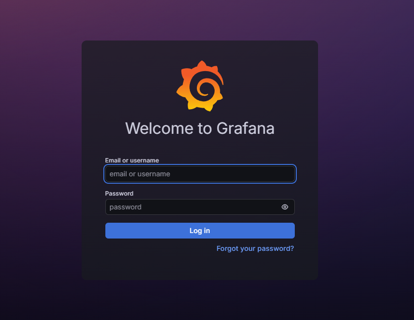
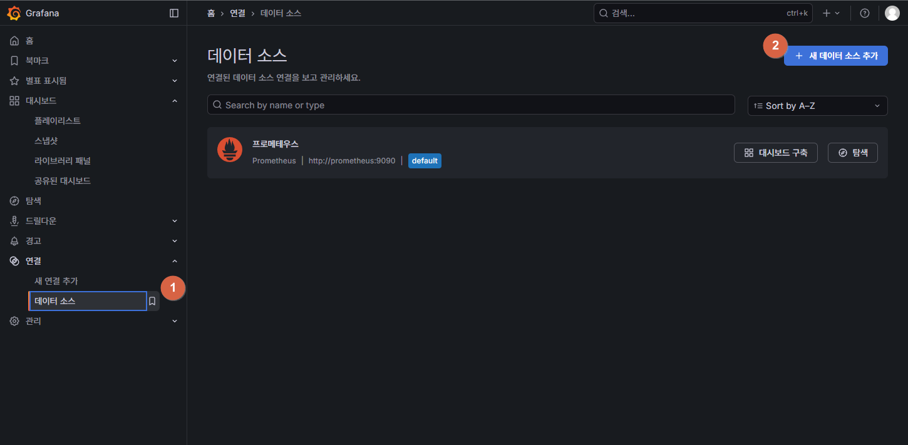
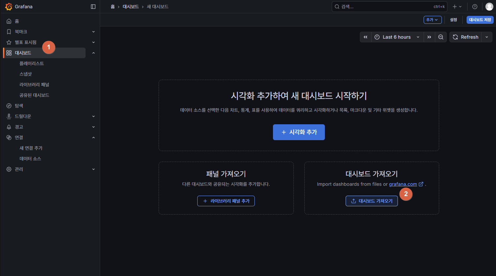
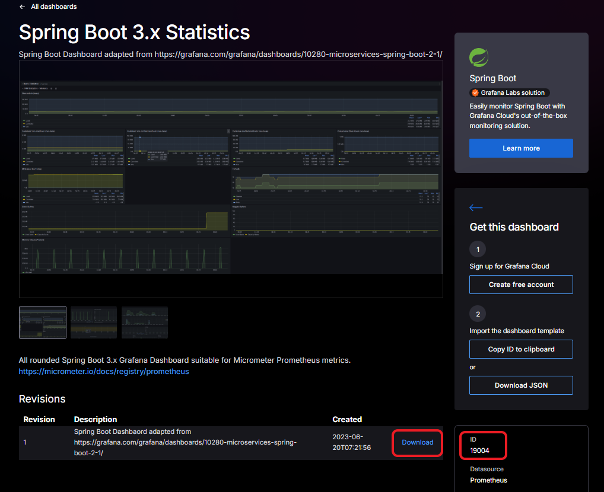
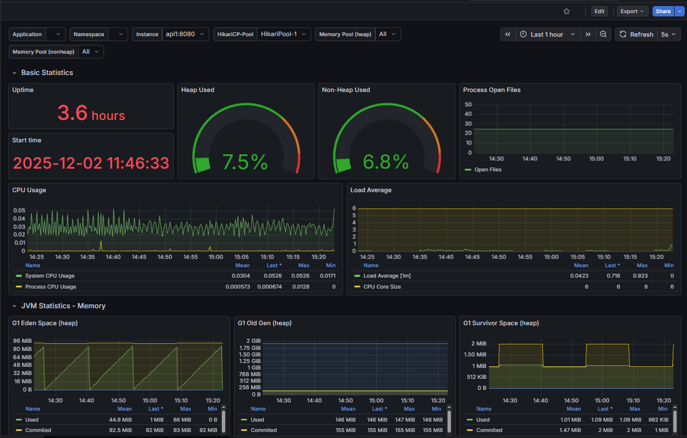
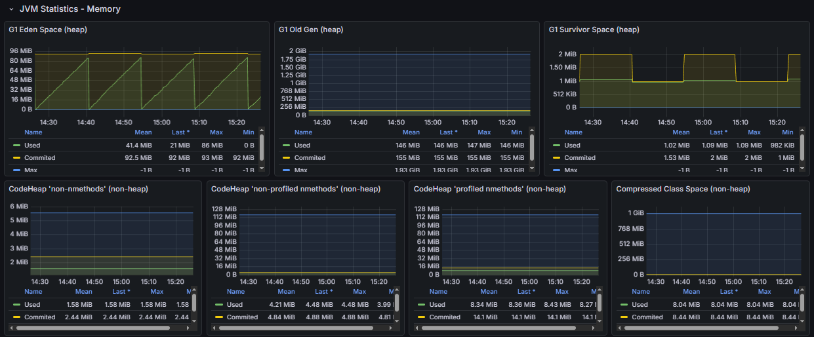
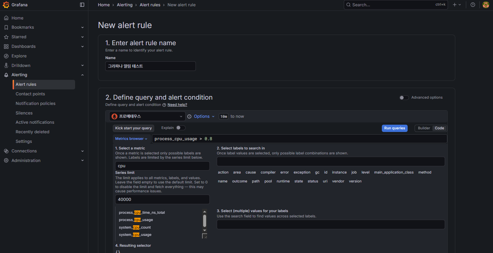
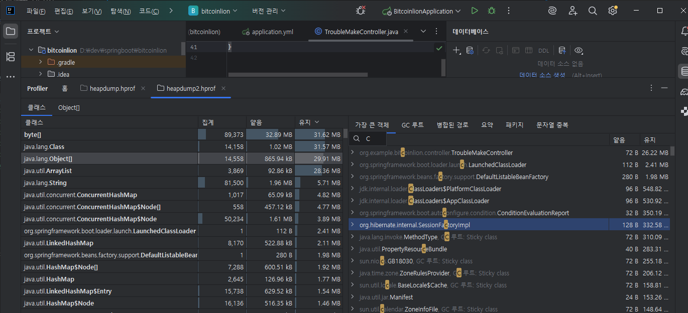

# [ 16주차 - 1202 ]

```bash
    금일 커리큘럼
        ├ 09:00 ~ 12:00 Devops (Grafana 대시보드 구성)
        └ 13:00 ~ 18:00 Devops (Grafana JVM 패널에 대한 이해, heapdump (hprof) 분석)
```

## 1. Grafana 대시보드 구성

- **Grafana : 오픈소스 기반의 데이터 시각화 툴**
- prometheus와 같은 시계열 데이터베이스와 연동하여 데이터를 시각화 모니터링


### 1.1 Grafana 컨테이너 실행

```bash
docker run -d \
  --name grafana \
  --network bit-net \
  -p 3000:3000 \
  grafana/grafana-oss
```

<details>
<summary><strong>Grafana 설치오류시</strong></summary>

- 만약 아래와 같이 오류가 뜬 경우

```bash
  Error response from daemon: failed to resolve reference
  "docker.io/grafana/grafana-oss:latest": failed to authorize:
  failed to fetch oauth token: Post "https://auth.docker.io/token":
  proxyconnect tcp: dial tcp 192.168.65.1:3128: i/o timeout
```

- 프록시 문제로 인한 오류로 네트워크 초기화 필요
- 아래 명령어를 powershell 관리자 권한으로 실행

```bash
# 도커 서비스 재시작
net stop com.docker.service /y
net start com.docker.service

# 네트워크 초기화
netsh winhttp reset proxy
netsh int ip reset
ipconfig /flushdns

# 재부팅 후
docker pull grafana/grafana-oss
```
</details>

### 1.2 Grafana 접속



- 웹브라우저 접속 : `http://localhost:3000`
- 기본 아이디/비밀번호 : `admin` / `admin`
- 최초 로그인 시 비밀번호 변경 필요 (나중에 계정관리에서 변경 가능)

### 1.3 Grafana 데이터 소스 추가



- 좌측 메뉴에서 [Connections] → [Data sources] 메뉴 선택
- [Add data source] 버튼 클릭 후 [Prometheus] 선택
- 내용중 name과 url 부분을 아래와 같이 설정 후 [Save & Test] 버튼 클릭

```bash
  Name : Prometheus
  URL  : http://prometheus:9090

  # http://<컨테이너명>:<포트>
  # URL 부분은 도커 네트워크 내에서 접근할 수 있는
  # prometheus의 컨테이너명과 포트로 설정
```

### 1.4 Grafana 대시보드 생성




- 좌측 메뉴에서 [Dashboard] 메뉴 선택
- [Import dashboard] 버튼 클릭
- 해당 사이트에서 원하는 대시보드 검색 : https://grafana.com/grafana/dashboards/
    - 예: spring boot



- 찾은 대시보드 하단에 [download] 혹은 [ID] 값 확인 후
- grafana UI로 돌아와서
    - 다운로드 받은 json 파일 업로드 하거나
    - ID 값 입력 후 [Load] 버튼 클릭
- 이후 [Prometheus] 데이터 소스 선택하고 [Import] 버튼 클릭


### 1.5 Grafana 대시보드 확인



- 추가된 대시보드에서 prometheus로부터 수집된 메트릭 데이터 시각화 확인
- 상단 필터를 통해서 **인스턴스**, **모니터링 시간 범위**, **메모리풀** 등 필터로 확인 가능
    - **refresh** 주기 설정도 가능 (예: 5s, 10s, 1m 등)
- 대시보드 바디의 각 패널을 클릭하여 상세 데이터 확인 가능
- [share] 버튼을 통해서 대시보드 특정 시점의 스냅샷 공유 가능

---


## 2. Grafana JVM 패널에 대한 이해

### 2.1 Heap 메모리

- 실제 애플리케이션 객체가 저장되는 공간
- JPA 엔티티, DTO, Controller, Service, List, Map 등
- Heap 내부는 G1 GC 기준 3가지로 구분됨

#### 1) Eden 영역

- 새로 생성된 객체가 처음 저장되는 구역
- GC 빈도가 가장 높음 (Minor GC 대상)
- **minor GC** : Eden 영역이 가득 찼을 때 발생되는 GC

#### 2) Old Gen 영역

- 오래 살아남은 객체가 저장되는 곳
-  Young 영역보다 GC는 적지만, Old Gen이 꽉 차면 Full GC 발생 → 성능 저하

#### 3) Survivor 영역

- Eden에서 살아남은 객체가 이동하는 곳
- 꽤 버티면 Old Gen으로 승격됨

### 2.2 Non-Heap 메모리

- 애플리케이션 객체가 아닌 JVM이 사용하는 메모리 공간
- 예:
    - Metaspace : 클래스 메타데이터 저장
    - Code Cache : JIT 컴파일된 네이티브 코드 저장
    - PermGen (Java 7 이전) : 클래스 메타데이터 저장
    - Thread Stack : 각 스레드의 호출 스택 저장


### 2.2 Grafana JVM Memory 패널



#### G1 Eden Space (heap) : Eden 영역 사용량

- 메모리 증가 → GC 발생 → 다시 0~소량으로 감소
- “톱니바퀴 모양” 그래프가 정상
- **문제 확인 포인트** :
    - Eden이 빠르게 커졌다가 GC로 정리되는 패턴은 정상이지만
    - GC가 너무 자주 발생하면 → Minor GC 과도, 응답 시간 증가.

#### G1 Survivor Space (heap) : Survivor 영역 사용량

- Survivor 0(S0), Survivor 1(S1) 두 공간이 번갈아 사용됨.
- Survivor 영역 크기는 보통 매우 작음.
- **문제 확인 포인트** :
    - Survivor가 자꾸 가득 참 → Old Gen 승격 증가
    - Old Gen이 점점 커짐 → Full GC 발생 위험 증가

#### G1 Old Gen (heap) : Old Gen 영역 사용량

- 가장 중요한 영역
- Old Gen이 차면 Full GC 발생 → 서버 멈춤(Stop-the-world)
- **문제확인 포인트** :
    - Old Gen 지속 증가 → Memory Leak 가능성
    - 특히 Used 그래프가 계속 우상향이면 매우 위험
    - Old Gen이 Max에 근접하면 → Full GC 발생 위험

### 2.3 Grafana JVM 다른 주요 패널

#### Heap Used / Non-Heap Used

- **Heap Used** : 전체 힙 메모리 사용량
    - 메모리 누수 판단에 중요
- **Non-Heap Used** : 전체 Non-Heap 메모리 사용량
    - Metaspace 증가 → Reflection 또는 동적 프록시(스프링 AOP) 메모리 누수 의심 가능


#### CPU Usage (System / Process)

- System CPU Usage: 서버 전체 CPU
- Process CPU Usage: 해당 자바 프로세스 CPU
    - Process CPU가 계속 높으면 ?
    - GC 폭증
    - 특정 로직의 CPU 부하
    - 스레드 과다 생성 등 의심해야함

#### Load Average

- 1초~5분~15분 동안 CPU 대기 중인 작업 수
- CPU 코어 수보다 높으면 과부하 
    - 예: CPU 6코어인데 Load=8 → 과부하

#### Process Open Files

- 리눅스에서 열린 파일 디스크립터 수
- 스프링부트에서 소켓 연결, DB 커넥션 등도 파일 디스크립터로 관리
- 너무 많으면 “Too many open files” 오류 발생 가능
    - 커넥션 누수
    - 소켓 누수
    - 파일 핸들 누수 등 의심


### 2.4 패널 관련 요약

| 패널                    | 의미             | 문제 상황                                 |
| --------------------- | -------------- | ------------------------------------- |
| **G1 Eden Space**     | 새 객체 생성 공간     | GC가 과도하면 Minor GC 폭증                  |
| **G1 Survivor Space** | Eden에서 살아남은 객체 | Survivor full → Old Gen 승격 증가         |
| **G1 Old Gen**        | 오래 사는 객체 모임    | 우상향 증가 → Memory Leak 가능성 / Full GC 위험 |
| **Heap Used**         | JVM 전체 객체 메모리  | 지속 증가 → 메모리 누수                        |
| **Non-Heap**          | JVM 내부 영역      | 보통 문제 없음, Metaspace 증가 시 누수 의심        |
| **CPU Usage**         | 서버/프로세스 CPU    | 과부하 여부 판단                             |
| **Load Average**      | 서버 작업 대기량      | CPU 코어 수보다 크면 위험                      |


#### 2.5 Grafana 얼럿 설정 (discord)

- Grafana에서 특정 패널에 대해 임계치 초과 시 알림 설정 가능
- 예: G1 Old Gen 사용량이 80% 초과 시 이메일 알림 등

#### 디스코드 웹후크 URL 생성

- 디스코드 서버의 채널 우클릭 (또는 톱니바퀴 아이콘 클릭) → 채널 편집
- 좌측 메뉴 연동(Integrations) 클릭
- 웹후크(Webhooks) → 웹후크 만들기 클릭 후 URL 복사


#### Grafana UI 에서 얼럿 설정

**1. 얼럿 커넥트**

- Grafana 좌측 메뉴 Alerting → [Contact points] 클릭
- [Add contact point] 클릭 후
    - Integration 타입 : Discord 선택
    - Name : 원하는 이름 입력
    - Webhook URL : 복사한 디스코드 웹후크 URL 입력


**2. 얼럿 정책 (중요)**

- Grafana 좌측 메뉴 Alerting → [Notification policies] 클릭
- default policy 패널의 우측 [more] 아이콘 클릭 → [Edit] 클릭
- 새로운 팝업창에서 이전에 생성한 Contact point 선택 후 저장


#### 얼럿설정 정의



- Grafana 좌측 메뉴 Alerting → [Alert rules] 클릭
- [New alert rule] 버튼 클릭
- 아래과 같은 항목 설정 후 저장

```bash
# 1. Enter alert rule name
  - 원하는 이름 입력 (예: High Old Gen Usage)

# 2. Define query and alert condition
  - 원하는 프로메테우스 선택 후
  - 쿼리 입력 
  - 예 : process_cpu_usage > 0.8

# 3. Add folder and labels
  - 그룹화할 폴더 없는 경우 생성 후 추가


# 4. Set evaluation behavior
  - Group: 그룹명 입력 (예: cpu_alerts)
  - Pending period : 1m (1분 간격으로 조건 평가)
  - Keep firing for : 1m (1분 동안 조건 유지 시 알림)

# 5. Configure notifications
  - Notification channel : 이전에 생성한 Contact point 선택

# 6. Configure notification message
  - 원하는 메시지 입력, 건너뛰기 가능 (예: High CPU usage detected!)

이후 [Save] 버튼 클릭
```

#### 주요 얼럿 쿼리

```bash
# Old Gen 사용량 80% 초과 시 알림
process_memory_g1_old_gen_used_bytes / process_memory_g1_old_gen_max_bytes > 0.8

# Heap 사용량 90% 초과 시 알림
process_memory_heap_used_bytes / process_memory_heap_max_bytes > 0.9

# CPU 사용량 85% 초과 시 알림
process_cpu_usage > 0.85

# Load Average가 CPU 코어 수 초과 시 알림
process_load1 > 6 # CPU 코어 수가 6개인 경우

# 열린 파일 디스크립터 수가 10000개 초과 시 알림
process_open_fds > 10000

# GC 발생 빈도 과도 시 알림
rate(jvm_gc_collection_seconds_count[5m]) > 10

# GC 일시정지 시간 과도 시 알림
jvm_gc_pause_seconds_max > 1 # 1초 초과 시

# HTTP 5xx 에러 응답이 1분간 5건 초과 시 알림
sum(rate(http_server_requests_seconds_count{status=~"5.."}[1m])) > 5

# 활성 DB 커넥션이 최대 커넥션의 90% 초과 시 알림
hikaricp_connections_active > hikaricp_connections_max * 0.9

# 애플리케이션 다운 시 알림
absent(up{job="myapp"} == 1)
```

#### 얼럿 설정 자세한 참고 링크

- [슬랙으로 Grafana 얼럿](https://pixx.tistory.com/339)
- [디스코드로 Grafana 얼럿 - 1 얼럿 연동](https://midcondria.tistory.com/495)
- [디스코드로 Grafana 얼럿 - 2 얼럿 설정](https://midcondria.tistory.com/496)

---


## 3. heapdump (hprof) 분석

> Heap Dump(힙 덤프)는 JVM 힙 메모리 전체 스냅샷을 담고 있는 파일

- Grafana 대시보드에서 JVM 메모리 누수 의심 시
- heapdump 파일을 생성하여 분석이 필요함

### 3.1 Heap Dump 수집

- application.yml 에서 heapdump 엔드포인트 활성화

```yaml
management:
  endpoints:
    web:
      exposure:
        include:
          - heapdump # heapdump 엔드포인트 활성화
```


### 3.2 Heap Dump 생성


#### 방법1. curl 명령어 사용

```bash
# curl <URL> -o <저장경로/파일명.hprof>
curl http://localhost:8081/actuator/heapdump \
-o /c/Users/star1431/Downloads/heapdump.hprof
```

#### 방법2. 웹브라우저 사용

- 웹브라우저에서 `http://localhost:8081/actuator/heapdump` 접속
- 자동으로 heapdump 파일 다운로드됨


### 3.3 Heap Dump 파일 열기

- IntelliJ IDEA 에서 heapdump.hprof 파일 열기 가능
- 그 외 도구
    - [Eclipse Memory Analyzer (MAT) 사용법](https://www.eclipse.org/mat/)
    - [VisualVM 사용법](https://chobo-developer2.tistory.com/8)
    - [hprof 온라인 뷰어 - heaphero](https://heaphero.io/)




### 3.4 Heap Dump 분석 주요 핵심

주요 어떤 객체가 얼마만큼 메모리를 차지하고 있고, 누가 어떤 객체를 참조하고 있는지 파악하는 것이 중요


#### 1) Shallow Size vs Retained Size 이해 (중요)

- **Shallow (얕음)** : 해당 객체 자체가 차지하는 순수 메모리 크기
    - 내부에서 참조하는 객체 크기는 포함 안됨
    - 예: List 객체의 Shallow Size는 List 객체 자체 크기만 포함

- **Retained (유지)** : 그 객체가 사라지면 함께 GC 되는 모든 객체의 메모리 총합
    - 즉, "이 객체가 메모리를 얼마나 붙잡고 있나?"를 의미
    - Retained Size가 큰 객체가 바로 메모리 누수 원인이 됨


#### 2) Dominator Tree 파악

- 인텔리제이 기준 좌측 패널 [가장 큰 객체] 뷰
- 힙 덤프 분석 시 가장 중요한 정보
- Retained Size가 큰 상위 노드부터 확인
- Retained Size가 큰 객체가 무엇인지, 왜 메모리를 많이 차지하는지 분석하는데 용이


#### 3) GC Root(루트) 경로 분석하기

- 인텔리제이 기준 좌측패널 [gc 루트] 뷰
- GC Root는 절대 GC 되지 않는 객체
- 예 : static 변수, JVM 내부 객체, 스레드 스택 등
- 문제가 되는 객체까지의 참조 경로를 보면 원인 파악에 도움됨

```bash
GC Root
  ↓
Thread
  ↓
RequestContextHolder
  ↓
static Map
  ↓
UserSession (사라지지 않는 객체)

# static Map이 계속 세션을 잡고 있어서
# 메모리 누수가 발생하고 있다는 뜻
```


### 3.5 Heap Dump 요약


| 항목              | 핵심                       |
| --------------- | ------------------------ |
| Shallow Size    | 객체 자체 크기                 |
| Retained Size   | 이 객체가 붙잡고 있는 전체 메모리      |
| Dominator Tree  | 누수를 만든 핵심 객체 찾는 핵심 도구    |
| GC Root Path    | GC가 되지 않는 이유 추적          |
| Class Histogram | 어떤 객체가 가장 많이 힙을 잡아먹는지 확인 |
