# [ 16주차 - 1203 ]

```bash
    금일 커리큘럼
        ├ 09:00 ~ 12:00 Devops (CI/CD 이해 및 Jenkins CI/CD)
        └ 13:00 ~ 18:00 Devops (Jenkins SSH EC2, Github Actions CI/CD)
```

## 1. CI/CD 이해

> CI/CD는 개발의 최종 목표인 '빠르고 안정적인 소프트웨어 배포'를 달성하기 위한 핵심 방법

### 1.1 CI (Continuous Integration - 지속적 통합)

- 개발자들이 작성한 코드를 중앙 저장소에 자주 통합하는 프로세스
- 코드 변경 사항을 자동으로 빌드하고 테스트하여 문제를 조기에 발견하고 해결

### 1.2 CD (Continuous Deployment - 지속적 배포)

- CI 이후의 단계로, 코드 변경 사항을 자동으로 프로덕션 환경에 배포하는 프로세스
- 모든 코드 변경 사항이 자동으로 테스트를 통과하면 즉시 배포
- 빠른 피드백과 릴리즈 주기를 가능하게 함

### 1.3 CI/CD 의 중요성

- **개발 효율성** : 반복적인 **빌드/배포 작업을 자동화**하여 기능 개발에 집중만 할 수 있게 도와줌
- **품질 향상** : 자동화된 테스트를 통해 코드 품질을 유지하고 **버그를 조기에 발견**
- **빠른 배포** : 새로운 기능과 수정 사항을 **신속하게 사용자에게 제공**


### 1.4 CI/CD 파이프라인 흐름

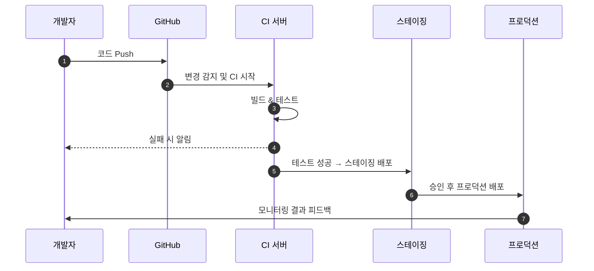

- (1) 개발자가 코드를 GitHub에 푸시
- (2) CI 서버가 변경 사항을 감지하고 빌드 및 테스트 수행
- (3) 테스트가 실패하면 개발자에게 알림
- (4) 테스트가 성공하면 스테이징 환경에 배포
- (5) 승인 후 프로덕션 환경에 배포
- (6) 프로덕션 환경에서 모니터링 결과를 개발자에게 피드백

---

## 2. Jenkins CI/CD

> Jenkins는 오픈 소스 자동화 서버로, CI/CD 파이프라인을 구축하고 관리하는 데 널리 사용

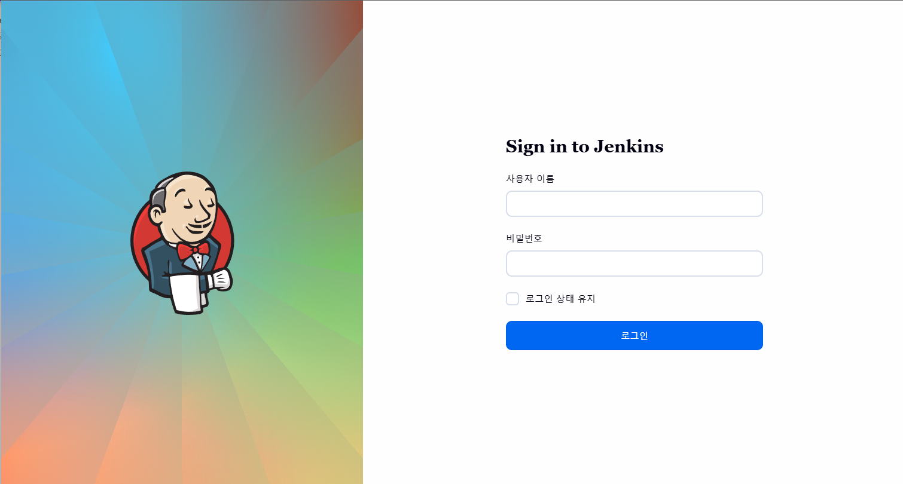

### 2.1 Jenkins 주요 기능

- **Pipeline as Code 지원** 
  - Jenkinsfile을 통해 파이프라인 정의
- 확장 가능한 아키텍처
- 분산 빌드 환경 지원
- 다양한 VCS(Git, SVN 등)와 통합
- 여러 플러그인 보유


### 2.2 Jenkins 설치 및 설정

#### 1) docker-compose.yml 파일 작성

```yaml
services: # Jenkins 서비스 정의
  jenkins:
    image: jenkins/jenkins:latest-jdk21 # Jenkins 최신 JDK 21 이미지 사용
    container_name: jenkins-server # 컨테이너 이름 설정
    ports: # 호스트와 컨테이너 포트 매핑
      - "9091:8080"
      - "50000:50000"
    environment:
      - TZ=Asia/Seoul
    volumes:
      - ./jenkins_home:/var/jenkins_home
      - /etc/localtime:/etc/localtime:ro
    restart: unless-stopped # 컨테이너가 중지되지 않는 한 재시작
```

#### 2) Jenkins 컨테이너 실행 및 확인

```bash
docker-compose up -d

# 브라우저 접속
# http://localhost:9091
```

#### 3) 초기 관리자 비밀번호 확인

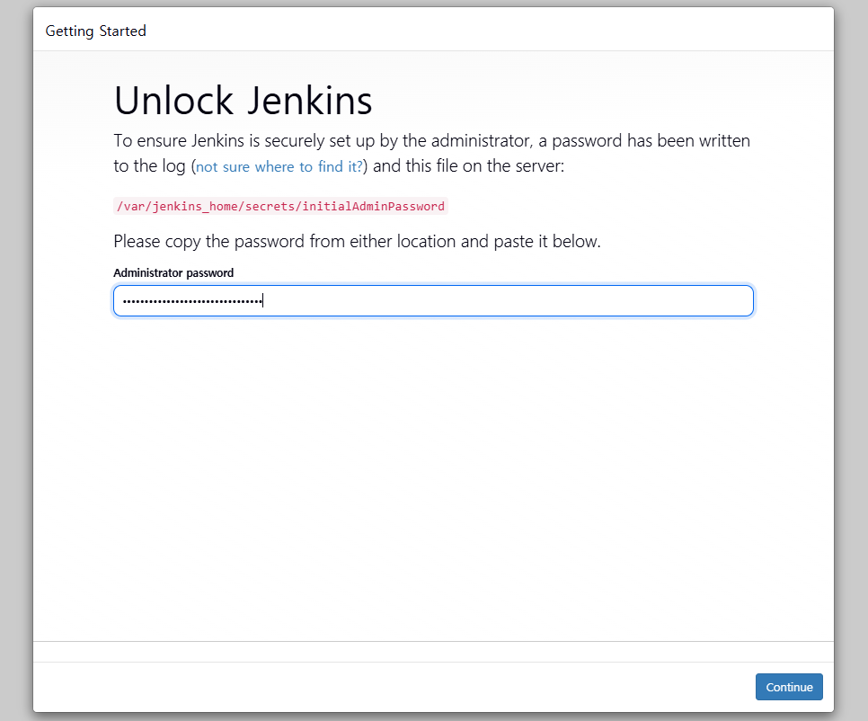

- 아래 명령어 실행하여 초기 비밀번호 확인 후
- 복사하여 Jenkins 웹 UI에 입력

```bash
cat jenkins_home/secrets/initialAdminPassword
```


#### 4) 플러그인 설치 및 관리자 계정 생성

- Jenkins 웹 UI에서 권장 플러그인 설치
  - [Install suggested plugins] 

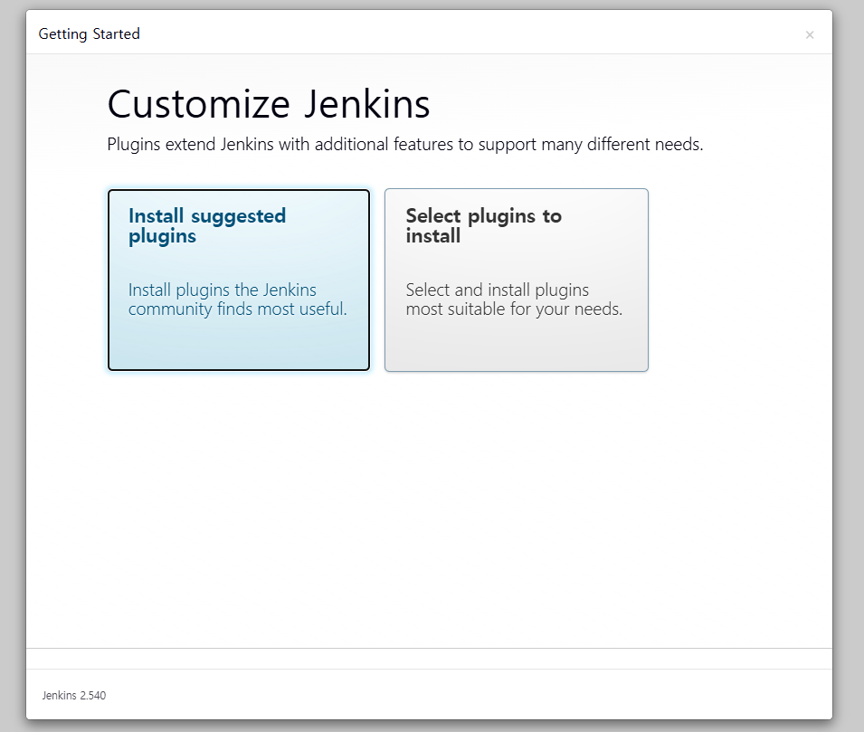


- 관리자 계정 생성

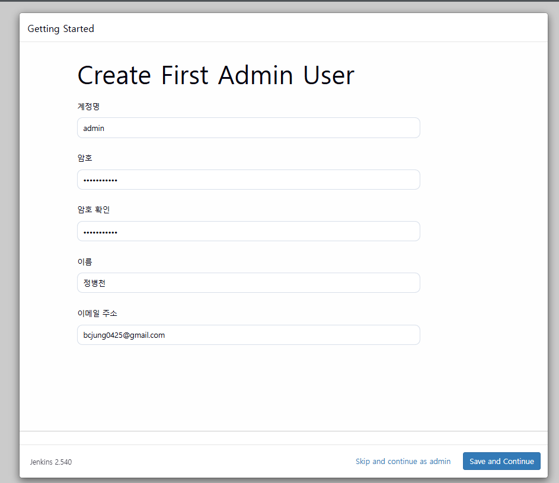


- 이후 젠킨스 URL 설정 후 [Save and Finish] 버튼 클릭
  - 로컬만 쓸 경우 기본값 유지 (예: `http://localhost:9091`)
- [start using Jenkins] 버튼 클릭하여 대시보드 접속


### 2.3 Jenkins Job 설정

> 젠킨스 Job은 빌드, 테스트, 배포 작업을 자동화하는 단위 프로세스

#### 1) 새로운 Job 생성

- 젠킨스 대시보드에서 좌측메뉴 [+ 새로운 Item] 클릭
- Job 이름 입력 후 [Freestyle project] 선택 후 [OK] 버튼 클릭


#### 2) Configure 설정

- 해당 job 아이템에 들어가 [구성] or [Configure] 메뉴 선택

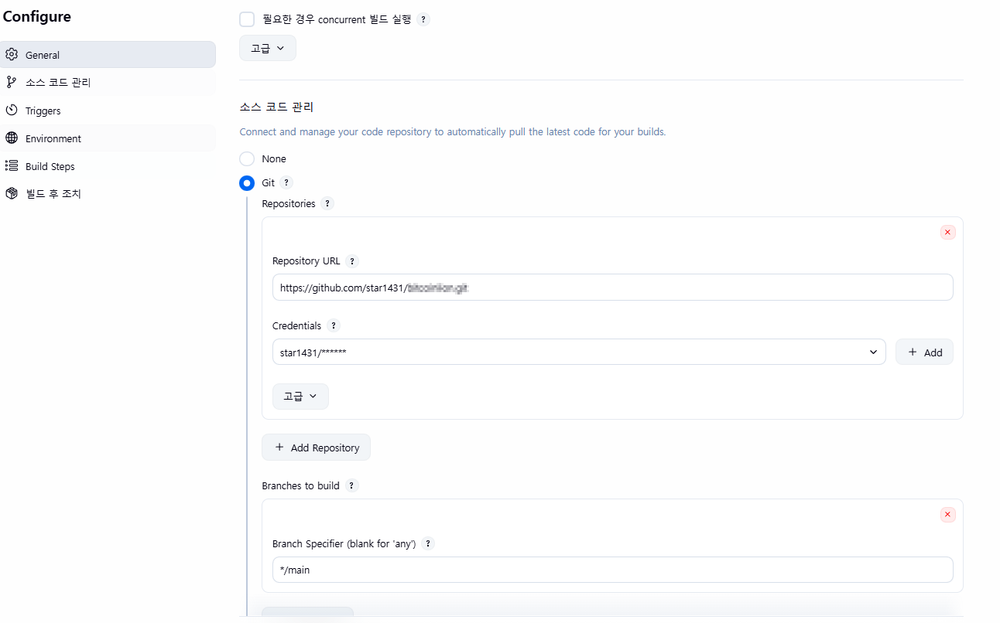

- **General 설정:**
  - Description : 해당 Job에 대한 설명 작성


- **Source Code Management (소스 코드 관리) 설정:**
  - Git 선택
  - Repository URL : Git 저장소 URL 입력
  - Credentials : 프라이빗 저장소인 경우 인증 정보 추가
  - Branches to build : 빌드할 브랜치 지정 (예: `main`)

<details>
<summary><strong>Credentials 추가 방법</strong></summary>


- (1) **github**로 가서 프로필 → Settings → Developer settings 접속

  - Personal access tokens → Tokens (classic) → [Generate new token] 클릭
  - 저장소 접근 권한(예: repo) 선택 후 토큰 생성

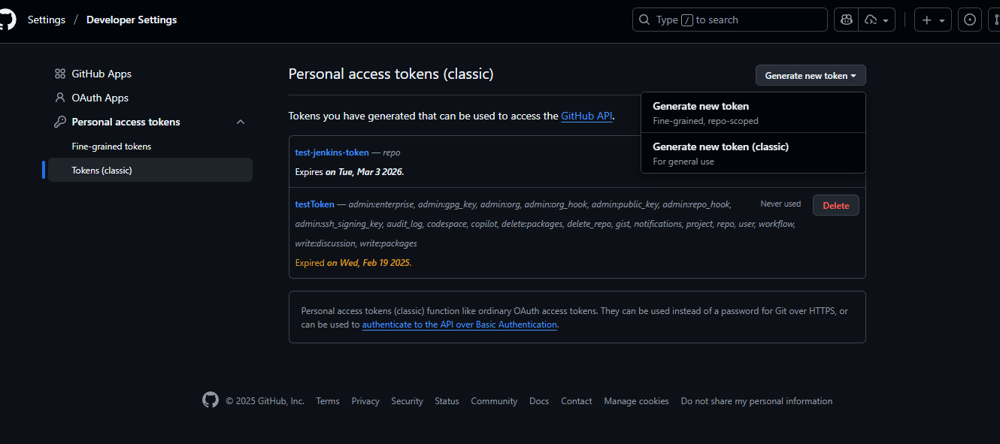

- (2) **jenkins**로 돌아와서 Credentials의 [Add] 버튼 클릭
  - Kind : [Username with password] 선택
  - Username : GitHub 아이디 입력
  - Password : 위에서 생성한 Personal access token 입력
  - [Add] 버튼 클릭하여 인증 정보 저장

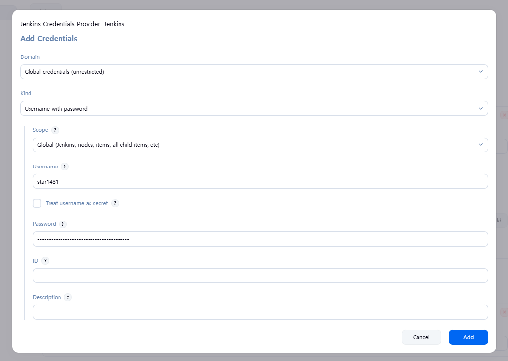

</details>

#### 3) Build Triggers 설정 (선택):

- **옵션 1: Build periodically (주기적 빌드)**
  - Schedule: H/15 * * * * (15분마다 빌드)
  - Cron 표현식 사용

- **옵션 2: GitHub hook trigger for GITScm polling**
  - GitHub에서 Webhook 설정 필요
  - Push 이벤트 발생 시 자동 빌드
  - localhost 환경에서는 사용 불가 (외부 접근 필요)

- **옵션 3: Poll SCM (추천)**
  - Schedule: H/5 * * * * (5분마다 저장소 확인)
  - 변경사항이 있을 때만 빌드 실행

```bash
# Cron 표현식 예시

┌───────────── 분 (0 - 59)
│ ┌───────────── 시 (0 - 23)
│ │ ┌───────────── 일 (1 - 31)
│ │ │ ┌───────────── 월 (1 - 12)
│ │ │ │ ┌───────────── 요일 (0 - 7)  ── 0 또는 7 = 일요일
* * * * *


H/5 * * * *   # 매 5분마다 실행
H/15 * * * *  # 매 15분마다 실행
0 3 * * *     # 매일 새벽 3시에 실행
0 * * * * *   # 매 정각마다 실행
H/10 9-18 * * 1-5  # 평일(월~금) 9시~18시 매 10분마다 실행
```

#### 4) build steps 설정:

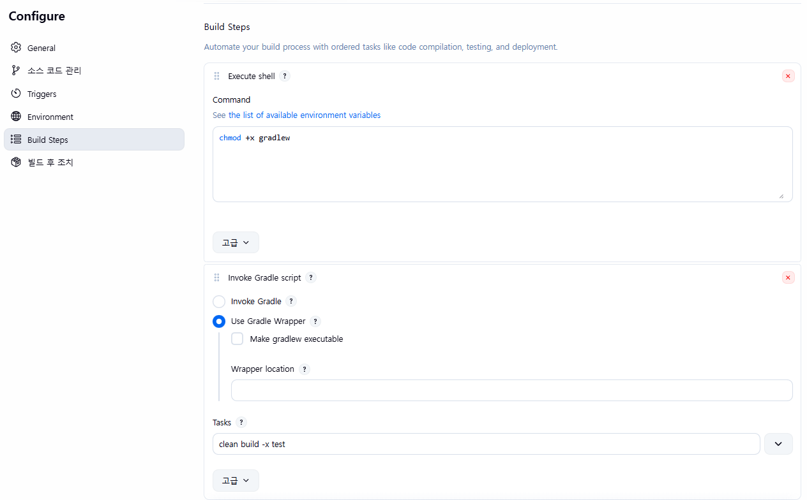

- **gradlew 사용 1단계**

  - [Add build step] 클릭 후 [Execute shell] 선택
  - Shell 명령어 입력 : `Chmod +x gradlew`


- **gradlew 사용 2단계**

  - [Add build step] 클릭 후 [Invoke Gradle script] 선택
  - 안에 내용 [Use Gradle Wrapper] 옵션 선택
  - Tasks : `clean build -x test` 입력

### 2.4 Jenkins 빌드 실행 및 결과 확인

- 해당 job item 페이지에서 [지금 빌드] 버튼 클릭 후 
- 좌측 하단 [builds] 영역에 해당 빌드 내역 클릭
- 그 후 좌측 [console output] 클릭하여 빌드 로그 확인


---

## 3. Jenkins SSH를 통한 EC2 배포

### 3.1 Jenkins에서 SSH 플러그인 설치

- 좌측 상단 톱니바퀴모양 [Jenkins 관리] 클릭
- jenkins 관리 페이지에서 [plugins] 클릭하여 플러그인 관리 페이지로 이동

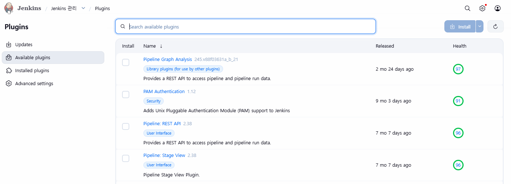

- [Available] 탭에서 `Publish Over SSH` 플러그인 검색 후 설치
- 설치 후 Jenkins 재시작 체크

### 3.2 Jenkins에서 SSH 설정

- [Jenkins 관리] → [System] → [Publish over SSH] 섹션으로 이동

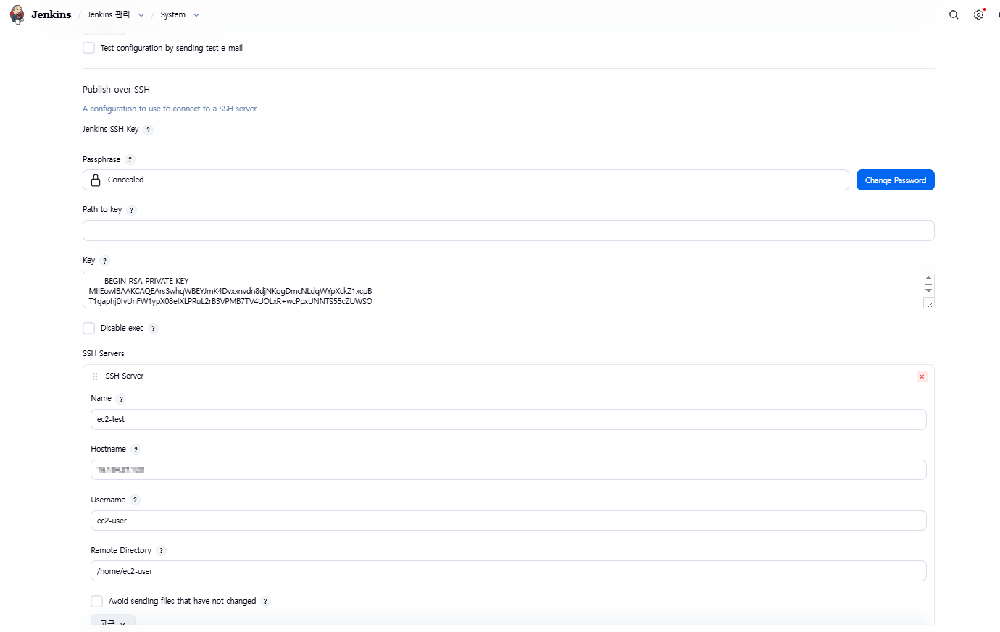

- **SSH 서버 추가 관련 내용 입력:**
  - **Key** : EC2 프라이빗 키 내용 복사하여 붙여넣기
  - **Name** : 임의 이름 (예: ec2-test)
  - **Hostname** : EC2 퍼블릭 IP
  - **Username** : ec2-user
  - **Remote Directory** : /home/ec2-user/app (배포할 디렉토리)


- 이후 Test Configuration 버튼 클릭하여 연결 테스트 확인

### 3.3 Jenkins Job에 SSH 빌드후 조치 추가

- 앞서 생성한 Jenkins Job의 [구성] 버튼클릭하여 [Configure] 페이지로 이동
- [Add build step] 클릭 후 [Send files or execute commands over SSH] 선택

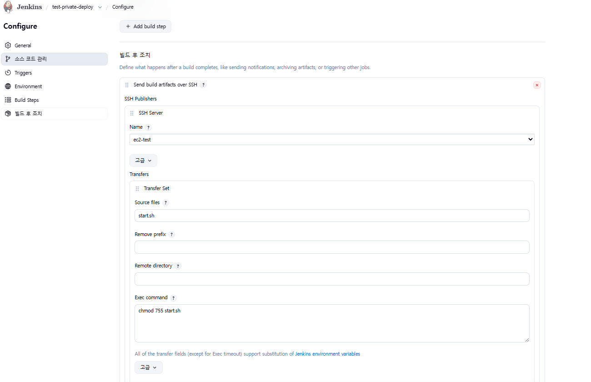

- 해당 빌드후 조치에서 설정한 SSH 서버 선택 후 (예: ec2-test)

- **첫번째 Transfer Set 설정:**
  - Source files : `start.sh`
  - Remove prefix : (최상위에 파일 둘 예정으로 비움)
  - Remote directory : (비워둠, 기본값)
  - Exec command : `chmod 755 /home/ec2-user/start.sh`
  - 이후 [Add Transfer Set] 버튼 클릭 (두번째진행)


- **두번째 Transfer Set 설정:**
  - Source files : 스냅샷 jar 파일 경로
    - 예: `build/libs/backend-0.0.1-SNAPSHOT.jar`
  - Remove prefix : `build/libs`
  - Remote directory : (비워둠, 기본값)
  - Exec command : `/home/ec2-user/start.sh`


#### 각 설정 이해

- **Source files** : 로컬 젠킨스 서버에서 전송할 파일 경로
- **Remove prefix** : 지정한 경로를 제거하고 전송 (예: `build/libs` 제거)
- **Remote directory** : 원격 서버(EC2)에서 파일이 저장될 디렉토리
- **Exec command** : 파일 전송 후 원격 서버에서 실행할 명령어


#### start.sh 스크립트 작성

- 해당 job아이템의 프로젝트 최상위루트에서 start.sh 파일 생성
- <앱이름> 부분은 실제 앱 이름으로 변경

```bash
#!/bin/bash

# 실행 중인 프로세스 종료
pkill -f <앱이름>-0.0.1-SNAPSHOT.jar || echo "No app running"

# 프로세스 종료 대기
sleep 15

# 새 JAR 파일 실행
nohup /usr/bin/java -jar /home/ec2-user/<앱이름>-0.0.1-SNAPSHOT.jar > /home/ec2-user/app.log 2>&1 &

echo "Application deployment completed"
```


### 3.4 Jenkins 빌드 및 배포 실행

- Jenkins Job 페이지에서 [지금 빌드] 버튼 클릭
- 빌드가 성공적으로 완료되면 EC2 서버에 애플리케이션이 배포 및 실행됨

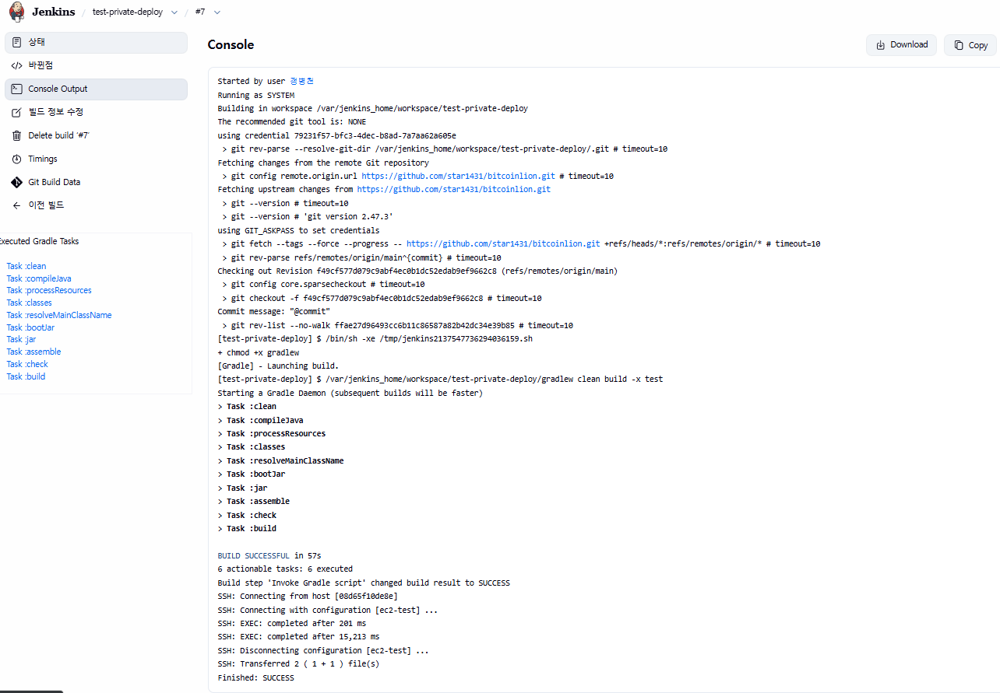

- **EC2 서버에서 확인 방법** :

```bash
# SSH 접속
# <키페어.pem> 과 <EC2_PUBLIC_IP> 는 실제 값으로 변경
ssh -i ~/Downloads/<키페어.pem> ec2-user@<EC2_PUBLIC_IP>

# 프로세스 확인
ps aux | grep <앱이름>

# 로그 확인
cat /home/ec2-user/app.log
```

- **브라우저에서 확인** :

```bash
http://<EC2_PUBLIC_IP>:8080
```


---

## 4. Github Actions CI/CD

> Github Actions는 GitHub 저장소 내에서 CI/CD 파이프라인을 자동화할 수 있는 기능 제공


### 4.1 Github actions 주요 개념

- **Workflow** : 자동화된 프로세스 전체 (예: 빌드, 테스트, 배포)
- **Job** : Workflow 내에서 실행되는 개별 작업 단위
- **Step** : Job 내에서 실행되는 구체적인 명령어 또는 스크립트
- **Runner** : Workflow를 실행하는 서버 (GitHub에서 제공하거나 자체 호스팅 가능)
- **Action** : 재사용 가능한 Step의 집합 (예: 특정 작업을 수행하는 스크립트)

### 4.2 Github Actions 와 Jenkins 비교

| 구분 | Jenkins | Github Actions |
| --- | --- | --- |
| 설치 | 별도 서버 필요 | GitHub 내장 |
| 비용 | 서버 유지비용 발생 | 무료 플랜 제공 (제한 있음) |
| 설정 | UI 기반 설정 | YAML 파일 기반 설정 |
| 통합 | 다양한 플러그인 필요 | GitHub 생태계와 긴밀히 통합 |
| 확장성 | 플러그인 통해 확장 | 커뮤니티 액션 활용 가능 |
| 적합한 용도 | 복잡한 파이프라인 | GitHub 중심 프로젝트 |

### 4.3 Github Actions 설정 방법

#### 1) Workflow 파일 생성

```bash
# GitHub 저장소 내 .github/workflows/ 디렉토리 생성
mkdir -p .github/workflows

# 관련 yml 파일 생성
touch .github/workflows/deploy.yml
```

#### 2) Workflow 내용 작성

- 기본 설정 방식

```yaml
name: CI/CD github Actions TEST

on: # 트리거 이벤트 설정 (push, pull request, 수동 실행..)
  push: 
    branches: [ "main" ]
  pull_request:
    branches: [ "main" ]
  workflow_dispatch:

jobs: # 각 작업 단위 정의
  build: # 빌드 작업
    runs-on: ubuntu-latest

    steps: # 각 작업 단계 정의
      - name: Check out code
        uses: actions/checkout@v3 # 코드 체크아웃 액션 사용

      - name: Set up JDK 21
        uses: actions/setup-java@v3 # Java 설정 액션 사용
        with:
          distribution: 'temurin'
          java-version: '21'

      - name: Grant execute permission to gradlew
        run: chmod +x gradlew # gradlew 실행 권한 부여

      - name: Build with Gradle
        run: ./gradlew clean build -x test # Gradle 빌드 실행
```

- EC2 배포 추가 설정
- EC2_HOST, EC2_USER, EC2_SSH_KEY 는 GitHub 저장소의 Secrets 등록된 값
- `start.sh` 젠킨스 설명 참고
- <앱이름> 부분은 실제 앱 이름으로 변경

```yaml
      - name: Upload start.sh file to EC2
        uses: appleboy/scp-action@v0.1.7
        with:
          host: ${{ secrets.EC2_HOST }} # EC2 퍼블릭 IP
          username: ${{ secrets.EC2_USER }} # ec2-user
          key: ${{ secrets.EC2_SSH_KEY }} # 프라이빗 키
          port: 22
          source: "start.sh" # 로컬 start.sh 파일
          target: "/home/ec2-user/"
          debug: true

      - name: Upload JAR file to EC2
        uses: appleboy/scp-action@v0.1.7
        with:
          host: ${{ secrets.EC2_HOST }}
          username: ${{ secrets.EC2_USER }}
          key: ${{ secrets.EC2_SSH_KEY }}
          port: 22
          source: "build/libs/<앱이름>-0.0.1-SNAPSHOT.jar"
          target: "/home/ec2-user/"
          debug: true

      - name: SSH to EC2 and run commands
        uses: appleboy/ssh-action@v0.1.8
        with:
          host: ${{ secrets.EC2_HOST }}
          username: ${{ secrets.EC2_USER }}
          key: ${{ secrets.EC2_SSH_KEY }}
          port: 22
          script: |
            mv build/libs/<앱이름>-0.0.1-SNAPSHOT.jar .
            chmod 755 start.sh
            ./start.sh
```

- 웹후크 추가 설정
- DISCORD_WEBHOOK 는 GitHub 저장소의 Secrets 등록된 값

```yaml
      - name: Discord Notification
        uses: Ilshidur/action-discord@master
        if: always() # 성공/실패 여부와 상관없이 실행
        env:
          DISCORD_WEBHOOK: ${{ secrets.DISCORD_WEBHOOK }}
          DISCORD_USERNAME: "GitHub-Bot"
          DISCORD_AVATAR: "https://github.githubassets.com/images/modules/logos_page/GitHub-Mark.png"
        with:
          args: '배포가 종료되었습니다! 상태: ${{ job.status }}'
```

### 4.4 Github Actions 설정

- github 의 해당 저장소에서 [Settings] 클릭
- [Secrets and variables] → [Actions] 클릭

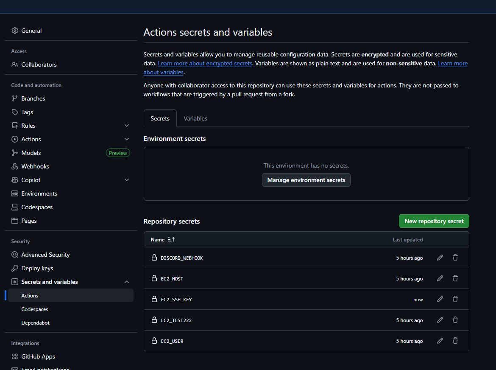

- [New repository secret] 버튼 클릭하여 각각 추가
  - **EC2_HOST** : EC2 퍼블릭 IP
  - **EC2_USER** : ec2-user
  - **EC2_SSH_KEY** : 프라이빗 키 내용 복사하여 붙여넣기

### 4.5 Github Actions 빌드 및 배포 실행

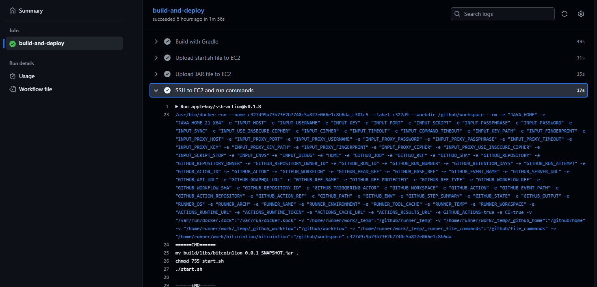

- GitHub 저장소의 main 브랜치에 푸쉬 후 [Actions] 탭 이동
- 해당 Workflow 실행 내역 클릭
- 각 Job 및 Step의 실행 상태 및 로그 확인 가능