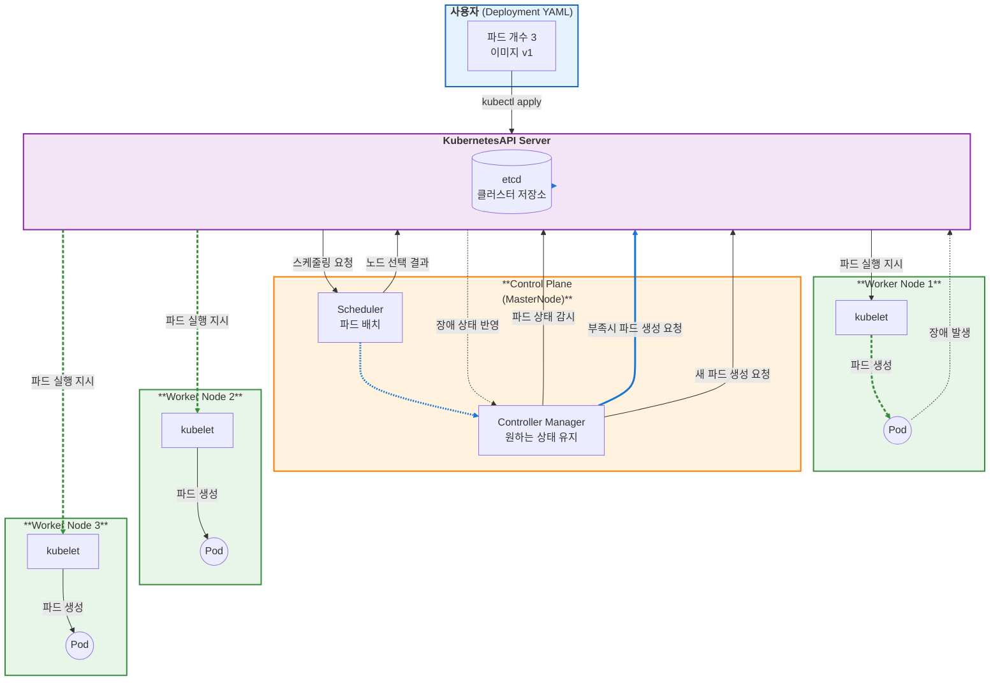
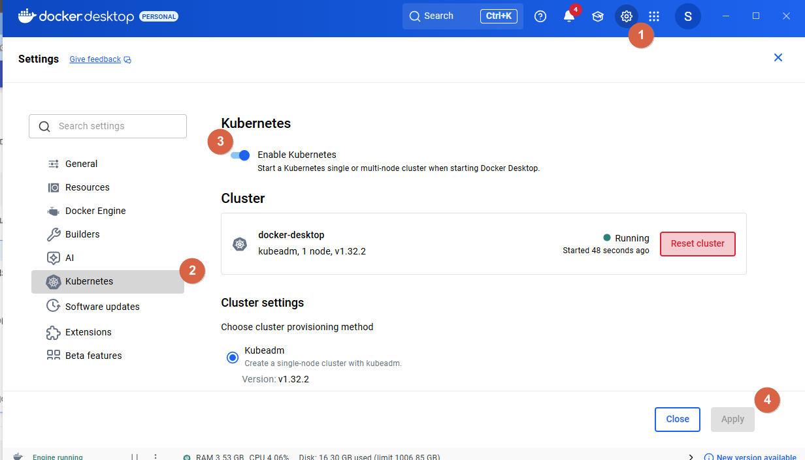
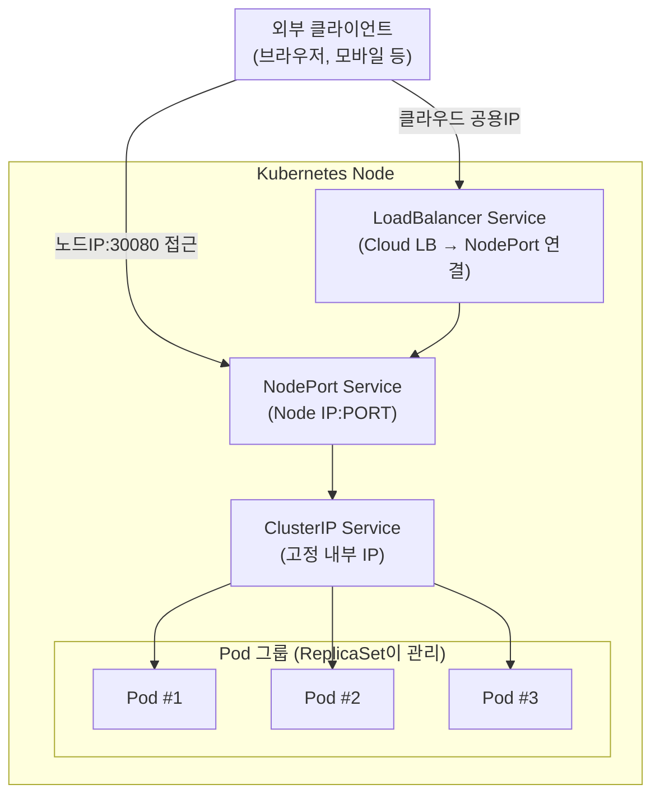

# [ 16주차 - 1204 ]

```bash
    금일 커리큘럼
        ├ 09:00 ~ 12:00 Devops (Kubernetes, 환경 구성, pod와 deployment)
        └ 13:00 ~ 18:00 Devops (Service Networking, ConfigMap와 Secret)
```

## 1. Kubernetes 이해

> 컨테이너(도커 등)를 대규모로 배포하고 운영하는 오케스트레이션 플랫폼

### 1.1 쿠버네티스의 주요 목적

- **자동화된 배포**
    - 컨테이너로 패키징된 애플리케이션을 원하는 상태로 정의하고, 쿠버네티스가 이를 자동으로 배포 및 관리

- **확장성**
    - 애플리케이션 트래픽에 따라 자동으로 컨테이너(`pod`)의 수를 조절하여 성능 유지

- **셀프 힐링**
    - 장애가 발생한 컨테이너를 자동으로 재시작하거나, 노드 장애 시 다른 노드로 컨테이너 재배치
    - 설정된 규칙에 따라 스스로 복구함
    - 예: deployment 내 pod가 0개 남으면 자동으로 재생성 (1개유지)

- **서비스 디스커버리 및 로드 밸런싱**
    - 여러 컨테이너가 동일한 서비스로 묶여 있을 때, 트래픽을 자동으로 분산시켜 부하를 고르게 분배


### 1.2 쿠버네티스의 주요 컴포넌트

- **마스터 노드 (Control Plane)**
    - 클러스터의 상태를 관리하고, 작업을 스케줄링하는 역할
    - `API 서버`: 클러스터와 상호작용하는 인터페이스 제공
    - `스케줄러`: 작업을 적절한 워커 노드에 할당
    - `컨트롤러 매니저`: 클러스터 상태를 지속적으로 모니터링하고 필요한 조치를 수행


- **워커 노드 (Worker Nodes)**
    - 실제로 애플리케이션이 실행되는 노드
    - `kubelet`: 각 노드에서 실행되며, 컨테이너의 상태를 관리
    - `kube-proxy`: 네트워크 프록시로, 서비스 디스커버리와 로드 밸런싱을 담당
    - `컨테이너 런타임`: 도커(Docker) 등 컨테이너를 실행하는 소프트웨어


### 1.3 쿠버네티스의 주요 리소스

- **파드 (Pod)**
    - 쿠버네티스에서 가장 작은 배포 단위로, 하나 이상의 컨테이너를 포함
    - 동일한 네트워크 네임스페이스를 공유하며, 함께 스케줄링되고 관리됨

- **디플로이먼트 (Deployment)**
    - 파드의 선언적 업데이트를 관리하는 리소스
    - 원하는 상태(예: 파드 수, 이미지 버전 등)를 정의하고, 쿠버네티스가 이를 유지하도록 함

- **서비스 (Service)**
    - 파드의 집합에 대한 안정적인 네트워크 접근을 제공
    - 로드 밸런싱과 서비스 디스커버리를 지원


### 1.4 쿠버네티스의 작동 원리



- 사용자가 `kubectl` 명령어를 통해 배포하고자 하는 파드의 개수와 이미지를 정의한 YAML 파일을 API 서버에 전달
- API 서버는 이 정보를 `etcd`에 저장하고, 컨트롤러 매니저가 원하는 상태를 지속적으로 모니터링
- 컨트롤러 매니저는 현재 상태와 원하는 상태를 비교하여 부족한 파드가 있으면 스케줄러에 요청
- 스케줄러는 적절한 워커 노드를 선택하고, API 서버에 지시하여 해당 노드의 `kubelet`이 파드를 생성하도록 함
- 워커 노드에서 파드가 생성되고 애플리케이션이 실행됨

---

## 2. Kubernetes 환경 구성 및 기본 명령어

### 2.1 Dokcer 로 Kubernetes 환경 구성




- docker desktop 실행 후 → settings → Kubernetes 화면 진입
- Enable Kubernetes 토글 활성화 → Apply 클릭
- Running 상태가 되면서 kubectl 명령어가 자동으로 설치됨

<detail>
<summary><strong>❓ 쿠버네티스 Fail 뜨는 경우</strong></summary>

- 프록시 설정 문제 등 다양하나 대부분 WSL2 네트워크 문제로 인해 발생
- 먼저 하단 작업표시줄 우측 아이콘에서 Docker 아이콘 우클릭 → Quit Docker Desktop 클릭
- 도커 정상 종료 후 power shell 관리자로 실행
- `wsl --shutdown` 명령어 입력 후 엔터
- 다시 도커 데스크탑 실행 후 쿠버네티스 활성화 진행

**위 방법은 WSL2 종료 후 도커 실행하면서 자동으로 네트워크 재설정이 이루어지게 함.**

</detail>


### 2.2 kubectl 명령어 기초

- `kubectl` 명령어는 쿠버네티스 클러스터와 상호작용하기 위한 커맨드 라인 도구임

#### kubectl 명령어 기본 구조

```bash
# kubectl 명령어 기본 구조
kubectl [COMMAND] [TYPE] [NAME] [flags...]

# kubectl 다음에 오는 부분은
# [COMMAND] : 수행할 작업 (예: create, get, delete 등)
# [TYPE]    : 리소스 유형 (예: pod, deployment, service 등)
# [NAME]    : 리소스 이름 (특정 리소스를 지정할 때 사용, 예: my-dep)
# [flags...] : 추가 옵션 (예: -n 네임스페이스 지정 등)
```

#### 1) 기본동작 명령어

- **생성 및 배포 (create, apply)**
    - **create**: 단일 리소스 생성
    - **apply**: YML 파일을 사용하여 리소스 생성 및 업데이트

```bash
# deployment 생성 예시 (nginx 이미지 사용)
kubectl create deployment my-dep --image=nginx

# YML 파일을 사용하여 리소스 생성
kubectl apply -f <파일명>.yml
```

#### 2) 조회 명령어

- **조회 (get, describe)**
    - **get**: 리소스 목록 및 상태 조회
    - **describe**: 특정 리소스의 상세 정보 조회

```bash
# 모든 파드 조회
kubectl get pods # or 'po', 'pod'

# 특정 네임스페이스의 파드 조회
kubectl get pods -n <네임스페이스명>


# 특정 파드 상세 정보 조회
kubectl describe pod <파드명>

# 특정 디플로이먼트 상세 정보 조회
kubectl describe deployment <디플로이먼트명>
```

```bash
# get pod 출력결과
NAME                            READY   STATUS    RESTARTS   AGE
my-dep-5c689d4b4b-abcde         1/1     Running   0          10m
zombie-nginx-b6d778846-sfkb9    1/1     Running   0          10m


# describe pod 출력결과 (일부 내용)
Name:             zombie-nginx-b6d778846-sfkb9
Namespace:        default
Priority:         0
Service Account:  default
Node:             docker-desktop/<IP주소>
Start Time:       Thu, 04 Dec 2025 14:12:46 +0900
Labels:           app=zombie-nginx
```


#### 3) 삭제 명령어

- **삭제 (delete)**
    - 특정 리소스를 삭제

```bash
# 특정 파드 삭제
kubectl delete pod <파드명>
```

#### 4) 업데이트 명령어

- **업데이트 (edit, scale)**
    - **edit**: 리소스의 설정을 편집
    - **scale**: 디플로이먼트의 파드 수를 조절

```bash
# edit 예시
kubectl edit deployment <디플로이먼트명>
# 실행시 편집기 열림 (vi, nano 등)

# scale 예시 (파드 수 5개로 조절)
kubectl scale deployment <디플로이먼트명> --replicas=5

# --replicas 옵션으로 원하는 파드 수 지정
```

#### 5) 기타 명령어

- 버전확인, 클러스터 정보 확인 등

```bash
# kubectl 버전 확인 (클라이언트 정보 출력)
kubectl version --client

# 쿠버네티스 클러스터 정보 확인 (클러스터 주소 등 정보 출력)
kubectl cluster-info

# 노드 정보 확인 (클러스터에 속한 노드 목록 출력)
kubectl get nodes

# 현재 컨텍스트 확인 (현재 연결된 클러스터 및 네임스페이스 정보 출력)
kubectl config current-context
```


### 2.3 포트포워딩 확인

- nginx는 기본적으로 80포트에서 동작, 브라우저에서 확인 가능
- 쿠버네티스로 포트포워딩을 설정하여 로컬에서 접근 가능


```bash
# 디플로이먼트 생성
kubectl create deployment port-test --image=nginx

# 해당 파드 이름 확인
kubectl get pods

# 포트포워딩 설정 (로컬 38080 -> 파드 80)
kubectl port-forward <파드명> 38080:80
```

- 브라우저에서 `http://localhost:38080` 접속 시 nginx 환영 페이지 확인 가능

### 2.4 nodePort 서비스로 확인

- 쿠버네티스 서비스 타입 중 `NodePort`를 사용하여 외부에서 접근 가능하도록 설정 가능

```bash
# 위 디폴로이먼트 그대로 사용 - 서비스 추가 설정
kubectl expose deployment port-test --type=NodePort --port=80 --target-port=80
# type=NodePort : 노드포트 타입
# port=80 : 서비스 포트
# target-port=80 : 파드 내 컨테이너 포트


# 해당 서비스 확인
kubectl get services # or 'svc'
```

```bash
# get svc 출력결과
NAME        TYPE        CLUSTER-IP  EXTERNAL-IP   PORT(S)        AGE
port-test   NodePort    <IP주소>    <none>        80:31721/TCP   10s
```

- 브라우저에서 `http://localhost:31721` 접속 시 nginx 페이지 확인 가능
- nodePort는 `30000 ~ 32767` 포트 범위 내에서 자동 할당됨

---

## 3. pod와 deployment 의 이해

### 파드 (Pod)

- 쿠버네티스에서 가장 작은 배포 단위
- 하나 이상의 컨테이너를 포함하며, 동일한 네트워크 네임스페이스를 공유
- 파드는 일시적이며, 장애 발생 시 재생성됨

### 디플로이먼트 (Deployment)

- 파드의 선언적 업데이트를 관리하는 리소스
- 원하는 상태(예: 파드 수, 이미지 버전 등)를 정의하고, 쿠버네티스가 이를 유지하도록 함
- 디플로이먼트를 통해 파드의 롤링 업데이트, 롤백 등이 가능


### 비유하자면 ?

- **파드**는 컨테이너가 탑승한 `'자동차'`와 같고,
- **디플로이먼트는** 이러한 자동차를 관리하는 `'자동차 공장'`과 같다.

### 3.1 yml으로 deployment 및 pod 생성

```yml
apiVersion: apps/v1
kind: Deployment # 디플로이먼트 리소스 생성
metadata:
  name: hello-deployment # 디플로이먼트 이름
spec:
  replicas: 2 # 생성할 파드 수
  selector:
    matchLabels:
      app: hello-nginx # 파드 선택을 위한 라벨
  template:
    metadata:
      labels:
        app: hello-nginx # 파드에 붙일 라벨
    spec:
      containers:
      - name: nginx-container # 컨테이너 이름
        image: nginx:alpine # 사용할 이미지
        ports:
        - containerPort: 80 # 컨테이너 포트
```

```bash
# yml 파일로 디플로이먼트 생성
kubectl apply -f hello-deployment.yml

# 디플로이먼트 및 파드 확인
kubectl get deployments
kubectl get pods
```

```bash
# get deployments 출력결과
NAME               READY   UP-TO-DATE   AVAILABLE   AGE
hello-deployment   1/1     1            1           2m30s


# get pods 출력결과
NAME                                 READY   STATUS    RESTARTS   AGE
hello-deployment-5c689d4b4b-xyz12    1/1     Running   0          2m30s
hello-deployment-5c689d4b4b-abc34    1/1     Running   0          2m30s
```


#### 3.2 해당 디플로이먼트 실습

```bash
# 디플로이먼트 편집 방법 - 1
kubectl edit deployment hello-deployment
# replicas 값을 3으로 변경 후 저장

# 디플로이먼트 편집 방법 - 2
kubectl scale deployment hello-deployment --replicas=3

# 파드 1개 삭제 후 확인
kubectl delete pod <파드명>

# 파드 1개 nginx stop 후 확인
kubectl exec -it <파드명> -- sh

# -it : 인터랙티브 모드
# -- sh : 컨테이너 내에서 sh 쉘 실행

# '--' 이후 명령어는 컨테이너 내에서 실행됨
```

### 3.3 Self-healing 이해

- 쿠버네티스는 “원하는 상태(Desired State)”의 개념으로 동작
- 실제 상태가 달라지면 이를 감지하고 자동으로 복구하려고 시도함

#### pod delete 시

```bash
# -replicas=3 으로 설정된 상태 가정, 파드 삭제 시
kubectl delete pod <파드명>
```

- 삭제된 파드는 즉시 사라짐
- Deployment가 “파드가 부족하다”는 것을 감지
- 새로운 파드 1개를 자동으로 생성하여 다시 3개가 됨

#### pod 내 nginx stop 시

```bash
# 파드 내에서 nginx 프로세스 종료
kubectl exec -it <파드명> -- sh
```

- 파드는 살아있지만 컨테이너 내 애플리케이션이 죽은 상태
- kubelet이 Liveness/Readiness 프로브를 통해 해당 컨테이너가 정상 동작하지 않음을 감지
- 파드를 "Restarting" 상태로 만들고 재시작 시도
- 일정 조건에서 Deployment는 문제가 있는 파드를 제거하고 새 파드를 생성하여 원하는 상태를 회복


#### Delete vs Nginx stop 차이

| 구분             | 동작                 | 쿠버네티스 반응            | 설명                               |
| -------------- | ------------------ | ------------------- | -------------------------------- |
| **delete**  | 파드 자체가 제거됨         | 새로운 파드를 즉시 생성       | replicas 유지해야 하므로<br> 디플로이먼트가 자동 보충  |
| **nginx stop** | 파드는 존재<br> 애플리케이션만 죽음 | 컨테이너 재시작<br>또는 새 파드 생성 | kubelet이 실패 감지 <br>→ Self-healing 수행 |


---


## 4. Service Networking 이해

### 서비스 (Service)

- 파드는 일시적이며 언제든지 재생성될 수 있음 (죽, 파드 ip가 자주 바뀜)
- Service는 변하지 않는 고정 IP(ClusterIP)를 제공
- 안정적으로 파드에 접근할 수 있게 만드는 쿠버네티스 리소스임
- 서비스는 “어떤 파드들에게 트래픽을 보내야 하는가?”를 **라벨(selector)**로 찾아 연결함
- 파드 개수가 늘어나거나 줄어들어도 자동으로 연결됨 (로드 밸런싱)

**즉, 파드가 매일 바뀌어도 동일한 방식으로 접근할 수 있도록 해주는 네트워크 추상화 계층**


### 비유하자면?

- **파드(Pod)**는 매일 출근하는 개발자 직원이고,
- **Service(서비스)**는 개발자 직원이 누구로 바뀌어도 변경되지 않는 **직원 사무실(Service IP)**
- 즉, 팀원(파드)은 바뀌더라도 사무실(Service IP)은 변하지 않음

**외부/내부에서 안정적으로 접근 가능**

- 내부 : ClusterIP
- 외부 : NodePort, LoadBalancer


### 4.1 서비스 유형 종류

| 종류                 | 설명                  | 사용 목적           |
| ------------------ | ------------------- | --------------- |
| **ClusterIP (기본)** | 클러스터 내부에서만 접근 가능    | 내부 통신           |
| **NodePort**       | 노드 IP의 특정 포트로 접근 가능 | 외부에서 접근 필요할 때   |
| **LoadBalancer**   | 클라우드 로드밸런서와 연결      | 실제 서비스 릴리즈 시 사용 |
| **ExternalName**   | 외부 DNS로 매핑          | 외부 서비스 연결       |


### 4.2 Service YML 예제 — ClusterIP

```yml
apiVersion: v1
kind: Service           # 서비스 리소스 생성
metadata:
  name: hello-service   # 서비스 이름
spec:
  type: ClusterIP       # 기본 유형 (클러스터 내부에서만 접근 가능)
  selector:
    app: hello-nginx    # 어떤 파드를 연결할지 선택
  ports:
    - port: 80          # 서비스가 제공하는 포트
      targetPort: 80    # 파드의 컨테이너 포트
```

```bash
kubectl apply -f hello-service.yml

# 서비스 목록 확인
kubectl get svc

# 클러스터 내부에서 curl 테스트
kubectl exec -it <pod> -- sh
curl http://hello-service
```

### 4.3 Service YML 예제 — NodePort

```yml
apiVersion: v1
kind: Service
metadata:
  name: hello-nodeport
spec:
  type: NodePort        # 노드포트 유형
  selector:
    app: hello-nginx
  ports:
    - port: 80          # 서비스 포트
      targetPort: 80     # 파드의 컨테이너 포트
      nodePort: 30080    # 노드에서 접근할 포트 (30000~32767)
```

```bash
kubectl apply -f hello-nodeport.yml


# 서비스 목록 확인
kubectl get svc

# 브라우저에서 접속
http://localhost:30080 # or
http://<노드IP>:30080
```

### 4.4 Service 는 어떻게 파드를 찾는가? (Selector)

- Service는 **라벨(selector)**을 기반으로 특정 파드를 선택함

- 서비스와 파드 각각 다음과 같이 설정되어 있다고 가정한다면

```yml
# Service yml의 셀렉터
selector:
  app: hello-nginx
```

```yml
# 특정 파드 yml의 라벨
labels:
  app: hello-nginx
```

- 해당 파드는 자동으로 서비스 대상이 됨
- 만약 파드의 라벨이 변경되면 서비스와의 연결이 끊어짐
- 파드가 여러 개가 동일한 라벨을 가지고 있다면 모두 서비스 대상이 되어 로드 밸런싱이 이루어짐


### 4.5 핵심 요약

- Pod는 언제든지 재생성 가능하므로 IP가 바뀜
- Service는 고정 IP(ClusterIP)를 제공하여 파드에 안정적으로 접근할 수 있게 함
- 서비스는 **라벨(selector)**을 기준으로 연결할 파드를 자동으로 찾음
- 파드가 늘어나거나 줄어들어도 서비스는 자동으로 로드밸런싱 처리
- ClusterIP는 내부 전용이며, 외부에서 접근하려면 NodePort 또는 LoadBalancer가 필요!



---

## 5. ConfigMap 와 Secret 이해

### 컨피그맵 (ConfigMap)

- 애플리케이션이 필요로 하는 **환경 설정값(Configuration)**을 저장하는 쿠버네티스 리소스
- 예: 환경 변수, 설정 파일, 문자열 데이터 등
- 설정 변경 시 컨테이너 이미지를 다시 빌드하지 않아도 되므로 운영 편의성이 높아짐
- 민감하지 않은 일반 설정값 저장용(포트, URL, ENV 등)

#### 왜 ConfigMap이 필요할까?

- 컨테이너 이미지를 매번 다시 빌드하지 않고도
- 환경변수나 설정을 쉽게 바꿀 수 있는 애플리케이션 설정 외부화를 위해 사용됨

### 시크릿 (Secret)

- 비밀번호, 토큰, 인증서 같은 민감한 정보를 저장하기 위한 리소스
- Base64로 인코딩되어 저장되며, 필요 시 파일 또는 환경변수로 주입 가능
- ConfigMap과 거의 동일한 사용 방식이지만 “보안성 강화” 목적

#### Secret이 필요한 이유는?

- DB 비밀번호, API 인증키, TLS 인증서 등 민감한 정보가 있을 때,
- 이러한 값들을 이미지나 YAML에 하드코딩하면 보안 위험 발생 → Secret에 저장해서 관리


### ConfigMap & Secret 비유

- ConfigMap은 누구나 볼 수 있는 **공지사항 게시판**
    - 환경 설정, 포트 번호, URL
- Secret은 **자물쇠가 달린 금고**
    - 비밀번호, 인증서, API 키


### 5.1 ConfigMap YML 예제

- **my-config.yml 생성**

```yml
apiVersion: v1
kind: ConfigMap # ConfigMap 리소스 생성
metadata:
  name: my-config
data:           # 설정 데이터
  WELCOME_MESSAGE: "테스트 문구 입니다."
  APP_MODE: "development"
```

```bash
# ConfigMap 생성
kubectl apply -f my-config.yml

# 생성된 ConfigMap 확인
kubectl get configmap # or 'cm'

# 특정 ConfigMap 상세 정보 조회
kubectl describe configmap my-config
```

- **pod에서 해당 ConfigMap 사용 예시**

```yml
apiVersion: v1
kind: Pod       # Pod 리소스 생성
metadata:
  name: my-app  # Pod 이름
spec:
  containers:
  - name: app-container
    image: busybox
    # 환경 변수로 ConfigMap 값 주입 ( && sleep 3600 : 컨테이너 종료 방지용)
    command: [ "/bin/sh", "-c", "echo $WELCOME_MESSAGE && echo $APP_MODE && sleep 3600" ]
    env: # 환경 변수 설정
    - name: WELCOME_MESSAGE # 환경 변수 이름
      valueFrom:
        configMapKeyRef: # ConfigMap 참조
          name: my-config
          key: WELCOME_MESSAGE
    - name: APP_MODE
      valueFrom:
        configMapKeyRef:
          name: my-config
          key: APP_MODE
```

```bash
# Pod 생성
kubectl apply -f my-app.yml

# Pod 확인
kubectl get pods

# Pod 내에서 환경 변수 확인

# 1. 컨테이너 내 sh 실행
kubectl exec -it my-app -- /bin/sh

# 2. 환경 변수 출력
echo $WELCOME_MESSAGE
echo $APP_MODE
```


### 5.2 Secret YML 예제

- **base64 인코딩 방법**

```bash
# git bash (Linux/MacOS 환경)
echo -n "supersecret" | base64

# Windows PowerShell
[Convert]::ToBase64String([Text.Encoding]::UTF8.GetBytes("supersecret"))
```

- **my-secret.yml 생성**

```yml
apiVersion: v1
kind: Secret
metadata:
  name: my-secret
type: Opaque
data:
  DB_PASSWORD: c3VwZXJzZWNyZXQ=  # "supersecret"의 base64 인코딩 값
```

- **pod에서 해당 Secret 사용 예시**

```yml
apiVersion: v1
kind: Pod       # Pod 리소스 생성
metadata:
  name: secret-exam  # Pod 이름
spec:
  containers:
  - name: node-container
    image: busybox
    # 환경 변수로 ConfigMap 값 주입 ( && sleep 3600 : 컨테이너 종료 방지용)
    command: [ "/bin/sh", "-c", "echo $DB_PASSWORD && sleep 3600" ]
    env: # 환경 변수 설정
    - name: DB_PASSWORD # 환경 변수 이름
      valueFrom:
        secretKeyRef: # Secret 참조
          name: my-secret
          key: DB_PASSWORD
```

```bash
# Pod 생성
kubectl apply -f secret-exam.yml

# Pod 확인
kubectl get pods

# Pod 내에서 환경 변수 확인
# 1. 컨테이너 내 sh 실행
kubectl exec -it secret-exam -- /bin/sh

# 2. 환경 변수 출력
echo $DB_PASSWORD
```

#### base64 없이 Secret 생성시

```bash
  apiVersion: v1
  kind: Secret
  metadata:
    name: my-secret-string
  type: Opaque
  stringData:  # <-- data 대신 stringData 사용
    DB_PASSWORD: "supersecret"  # 그냥 평문으로 입력
```

---

