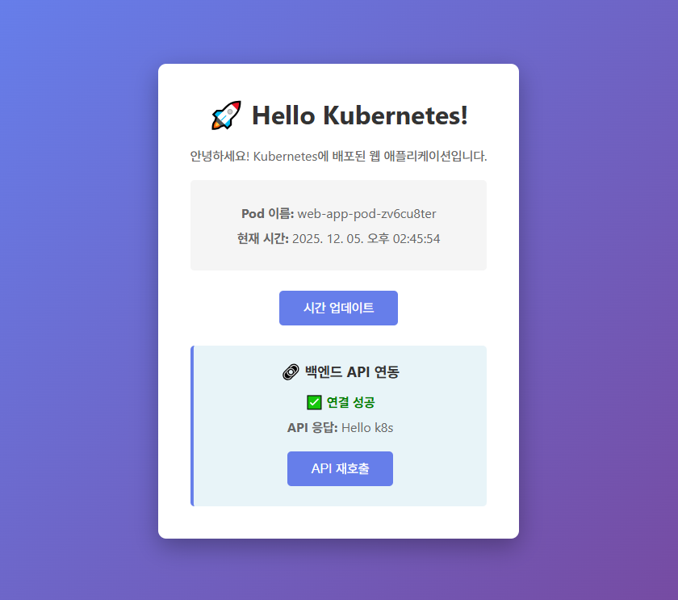

# [ 16주차 - 1205 ]

```bash
    금일 커리큘럼
        ├ 09:00 ~ 12:00 Devops (Kubernetes Volume)
        └ 13:00 ~ 18:00 Devops (Kubernetes 프론트-백엔드 실습, 스케일링과 롤링 업데이트)
```

## 1. kubernetes - Volume

### 1.1 볼륨 종류

| 종류       | 설명                              | 예시       |
| -------- | ------------------------------- | -------- |
| emptyDir | 파드 안에서만 공유 / 파드 삭제 시 데이터 삭제     | 임시 Cache |
| hostPath | 노드 Host OS 파일 시스템 사용            | 개발 테스트   |
| nfs      | 외부 NFS 스토리지 연결                  | 사내 파일서버  |
| **PVC**      | 저장소 요청(Persistent Volume Claim) | 동적 할당    |
| **PV**       | 스토리지 자체(Persistent Volume)      | 관리자 제공   |

- pod는 기본적으로 휘발성 저장소를 사용하게됨 (일시적임)
- volume을 사용하여 데이터를 영구적으로 저장하거나 여러 파드 간에 데이터를 공유할 수 있음
- volume은 파드의 라이프사이클과 독립적으로 존재할 수 있음
- 따라서 pod가 삭제되더라도 volume에 저장된 데이터는 유지될 수 있음


### 1.2 PV 예제

- pv-hostpath.yml
- 스토리지 크기는 1Gi = 1024MB (Mi)
- 삭제정책 : 
  - Retain : pvc 삭제시 pv는 남아있음
  - Recycle : 자동 초기화 후 재사용 (deprecated)
  - Delete : pvc 삭제시 pv도 삭제

```yml
apiVersion: v1
kind: PersistentVolume
metadata:
  name: my-pv
spec:
  capacity:
    storage: 1Gi
  accessModes:
    - ReadWriteOnce
  hostPath:
    path: /tmp/data        # 노드의 로컬 디렉토리 (테스트용)
  persistentVolumeReclaimPolicy: Retain # 삭제 정책 : Retain, Recycle, Delete
```

- pv 생성시

```bash
kubectl apply -f pv-hostpath.yml
```

- 해당 pv 확인

```bash
kubectl get pv
kubectl describe pv my-pv

# 출력 예시 (일부 생략)
Name:            my-pv
Labels:          <none>
Annotations:     <none>
Finalizers:      [kubernetes.io/pv-protection]
StorageClass:
Status:          Available
Claim:
Reclaim Policy:  Retain
Access Modes:    RWO
Capacity:        1Gi
Node Affinity:   <none>
VolumeMode:      Filesystem
```


### 1.3 PVC 예제

- deploy-volume.yml

```yml
apiVersion: apps/v1
kind: Deployment
metadata:
  name: volume-demo-deploy
spec:
  replicas: 1
  selector:
    matchLabels:
      app: volume-demo
  template: # 파드 템플릿
    metadata:
      labels:
        app: volume-demo
    spec:
      containers:
      - name: nginx-container # 컨테이너 이름
        image: nginx:alpine
        ports:
        - containerPort: 80 # 컨테이너 포트
        volumeMounts:
        - name: my-data-volume
          mountPath: /data         # 컨테이너 내부 경로
      volumes:
      - name: my-data-volume
        persistentVolumeClaim:
          claimName: my-pvc        # PVC 이름
```

- 디플로이먼트 pvc 생성시

```bash
kubectl apply -f deploy-volume.yml
```

- pvc로 선언한 pod 확인

```bash
kubectl get pods

# 출력 예시
NAME                                 READY   STATUS    RESTARTS   AGE
volume-demo-deploy-5d6f7c9f7b-abcde   1/1     Running   0          2m
```

### 1.4 동작 상태 확인

- pvc 로 선언한 pod 접속

```bash
# 해당 포드 내 접속
kubectl exec -it <pod이름> -- /bin/sh

# /data 디렉토리로 이동
cd /data

# 데이터 생성
echo "Hello Kubernetes Volume" > testfile.txt

# 디렉토리, 권한 확인
ls -l /data
```

### 1.5 pvc와 연결된 pv 확인

```bash
kubectl get pvc

# 출력 예시
NAME      STATUS   VOLUME   CAPACITY   ACCESSMODES   AGE
my-pvc    Bound    my-pv    1Gi        RWO           30s
```

| STATUS   | 의미                      |
| -------- | ----------------------- |
| Pending  | PV가 없어서 바인딩 못한 상태       |
| Bound    | PV와 정상 연결된 상태           |
| Released | PVC는 삭제되었지만 PV는 남아있는 상태 |
| Failed   | 바인딩 실패                  |

### 1.6 pod 삭제 후 데이터 확인

- 현재 pvc가 바인딩되어 있는 경우, pod 삭제해도 데이터는 유지됨
- 삭제 후 확인해보기

```bash
kubectl delete pod <pod-name>

kubectl get pods   # 새 파드 자동 생성 확인

# 새로 생성된 파드 접속
# testfile.txt 가 그대로 존재하는지 확인
kubectl exec -it <new-pod> -- /bin/sh
cd /data
ls -l
```

### 1.7 hostPath 실제 파일 확인 

- docker-desktop 환경에서 k8s 노드 파일시스템 접근

```bash
# wsl에서 docker-desktop 노드파일시스템 접속
wsl -d docker-desktop

# pvc 확인
ls /tmp/docker-desktop-root/var/lib/k8s-pvs
# 출력예시 : my-pvc

# pv 데이터 확인
cd /tmp/docker-desktop-root/var/lib/k8s-pvs
ls

# testfile.txt 파일 확인
```

### 1.8 요약 정리

- **PV**(PersistentVolume): 스토리지 자체 (관리자가 미리 제공)
- **PVC**(PersistentVolumeClaim): 스토리지 요청 (파드/사용자가 요청)
- 둘이 매칭되면 Bound 상태가 되며 스토리지를 사용 가능

```bash
PV 생성  →  PVC 생성  →  PVC가 PV를 요청  →  바인딩(Bound)
→ Deployment에서 pvc 사용 (volumeMount)
/data 에 파일 쓰면 PV에 저장됨
```

**hostPath 사용 시**

- 테스트용임
- 실제 위치는 k8s 노드 파일시스템
- Docker Desktop 환경에서는 WSL(docker-desktop) 에 저장됨

**pod 삭제 시**

- PVC가 계속 존재하면 PV도 유지됨
- 새 파드가 자동 생성되어도 데이터 사용 가능

**삭제정책**

- persistentVolumeReclaimPolicy
  - Retain : pvc 삭제시 pv는 남아있음
  - Recycle : 자동 초기화 후 재사용
  - Delete : pvc 삭제시 pv도 삭제

---


## 2. 간단한 Kubernetes 프론트-백엔드 실습

### 2.1 frontend 관련 작성

#### 디렉토리 구조

```bash
my-web-app
  ├── assets/
  │   ├── js/script.js
  │   └── css/style.css
  │
  ├── Dockerfile
  └── index.html

```


<details>
<summary><strong>index.html 소스보기</strong></summary>

- 경로 : my-web-app/index.html

```html
<!DOCTYPE html>
<html lang="ko">
<head>
    <meta charset="UTF-8">
    <meta name="viewport" content="width=device-width, initial-scale=1.0">
    <title>Kubernetes 실습</title>
    <link rel="stylesheet" href="assets/css/style.css">
</head>
<body>
    <div class="container">
        <h1>🚀 Hello Kubernetes!</h1>
        <p>안녕하세요! Kubernetes에 배포된 웹 애플리케이션입니다.</p>
        <div class="info">
            <p><strong>Pod 이름:</strong> <span id="hostname">Loading...</span></p>
            <p><strong>현재 시간:</strong> <span id="time"></span></p>
        </div>
        <button onclick="updateTime()">시간 업데이트</button>

        <div class="api-section">
            <h2>🔗 백엔드 API 연동</h2>
            <p id="api-status">연결 중...</p>
            <p><strong>API 응답:</strong> <span id="api-response">Loading...</span></p>
            <button onclick="callBackendAPI()">API 재호출</button>
        </div>
    </div>
    <script src="assets/js/script.js"></script>
</body>
</html>
```

</details>


<details>
<summary><strong>style.css 소스보기</strong></summary>

- 경로 : my-web-app/assets/css/style.css

```css
* {
    margin: 0;
    padding: 0;
    box-sizing: border-box;
}

body {
    font-family: 'Segoe UI', Tahoma, Geneva, Verdana, sans-serif;
    background: linear-gradient(135deg, #667eea 0%, #764ba2 100%);
    min-height: 100vh;
    display: flex;
    justify-content: center;
    align-items: center;
}

.container {
    background: white;
    padding: 40px;
    border-radius: 10px;
    box-shadow: 0 10px 30px rgba(0,0,0,0.3);
    text-align: center;
    max-width: 500px;
}

h1 {
    color: #333;
    margin-bottom: 20px;
}

p {
    color: #666;
    margin-bottom: 15px;
    font-size: 16px;
}

.info {
    background: #f5f5f5;
    padding: 20px;
    border-radius: 5px;
    margin: 20px 0;
}

.info p {
    margin: 10px 0;
}

button {
    background: #667eea;
    color: white;
    border: none;
    padding: 12px 30px;
    border-radius: 5px;
    cursor: pointer;
    font-size: 16px;
    transition: background 0.3s;
    margin: 5px;
}

button:hover {
    background: #5568d3;
}

.api-section {
    background: #e8f4f8;
    padding: 20px;
    border-radius: 5px;
    margin-top: 20px;
    border-left: 4px solid #667eea;
}

.api-section h2 {
    color: #333;
    font-size: 18px;
    margin-bottom: 15px;
}

#api-status {
    font-weight: bold;
    margin: 10px 0;
}
```

</details>


<details>
<summary><strong>script.js 소스보기</strong></summary>

- 경로 : my-web-app/assets/js/script.js

```js
// 백엔드 API URL (기본값: 로컬호스트, Kubernetes 환경에서는 Service 이름 사용)
const API_URL = window.API_URL || 'http://localhost:8080';

// 현재 시간 업데이트 함수
function updateTime() {
    const now = new Date();
    // 한국 시간 형식으로 변환
    const timeString = now.toLocaleString('ko-KR', {
        year: 'numeric',
        month: '2-digit',
        day: '2-digit',
        hour: '2-digit',
        minute: '2-digit',
        second: '2-digit'
    });
    document.getElementById('time').textContent = timeString;
}

// 백엔드 API 호출 함수
async function callBackendAPI() {
    try {
        // API 호출 (/hello 엔드포인트)
        const response = await fetch(`${API_URL}/hello`);
        const message = await response.text();
        document.getElementById('api-response').textContent = message;
        document.getElementById('api-status').textContent = '✅ 연결 성공';
        document.getElementById('api-status').style.color = 'green';
    } catch (error) {
        document.getElementById('api-response').textContent = '연결 실패';
        document.getElementById('api-status').textContent = '❌ 백엔드 연결 실패';
        document.getElementById('api-status').style.color = 'red';
        console.error('API 호출 실패:', error);
    }
}

// 페이지 로드 시 실행
window.onload = function() {
    // 시간 업데이트
    updateTime();
    setInterval(updateTime, 1000);

    // 호스트명 표시
    document.getElementById('hostname').textContent = 'web-app-pod-' + Math.random().toString(36).substr(2, 9);

    // 백엔드 API 호출
    callBackendAPI();
};
```

</details>


<details>
<summary><strong>style.css 소스보기</strong></summary>

- 경로 : my-web-app/assets/css/style.css

```css
* {
    margin: 0;
    padding: 0;
    box-sizing: border-box;
}

body {
    font-family: 'Segoe UI', Tahoma, Geneva, Verdana, sans-serif;
    background: linear-gradient(135deg, #667eea 0%, #764ba2 100%);
    min-height: 100vh;
    display: flex;
    justify-content: center;
    align-items: center;
}

.container {
    background: white;
    padding: 40px;
    border-radius: 10px;
    box-shadow: 0 10px 30px rgba(0,0,0,0.3);
    text-align: center;
    max-width: 500px;
}

h1 {
    color: #333;
    margin-bottom: 20px;
}

p {
    color: #666;
    margin-bottom: 15px;
    font-size: 16px;
}

.info {
    background: #f5f5f5;
    padding: 20px;
    border-radius: 5px;
    margin: 20px 0;
}

.info p {
    margin: 10px 0;
}

button {
    background: #667eea;
    color: white;
    border: none;
    padding: 12px 30px;
    border-radius: 5px;
    cursor: pointer;
    font-size: 16px;
    transition: background 0.3s;
    margin: 5px;
}

button:hover {
    background: #5568d3;
}

.api-section {
    background: #e8f4f8;
    padding: 20px;
    border-radius: 5px;
    margin-top: 20px;
    border-left: 4px solid #667eea;
}

.api-section h2 {
    color: #333;
    font-size: 18px;
    margin-bottom: 15px;
}

#api-status {
    font-weight: bold;
    margin: 10px 0;
}
```

</details>


<details>
<summary><strong>Dockerfile 소스보기</strong></summary>

- 경로 : my-web-app/Dockerfile

```bash
# Nginx 경량 이미지 사용
FROM nginx:alpine

# 작성한 HTML, CSS, JS 파일을 Nginx의 웹 루트로 복사
COPY index.html /usr/share/nginx/html/
# COPY style.css /usr/share/nginx/html/
# COPY script.js /usr/share/nginx/html/

COPY assets /usr/share/nginx/html/assets

# Nginx 포트
EXPOSE 80

# 컨테이너 실행 시 Nginx 실행
CMD ["nginx", "-g", "daemon off;"]
```

</details>


#### 프론트 관련 Docker 이미지 빌드 및 실행

- 이미지 빌드

```bash
docker build -t my-web-app:1.0 .
```

- 컨테이너 실행

```bash
docker run -d -p 80:80 --name my-web-container my-web-app:1.0
```

- 브라우저 접속 : `http://localhost`


### 2.2 backend 관련 작성

> jdk 21, spring boot 4.0.0

#### 디렉토리 구조

```bash
my-spring-boot-app
  ├── build/ ...
  ├── src/main/java/org/example/myspringbootapp/
  │   ├── Application.java
  │   └── ExamController.java
  │
  ├── build.gradle
  └── Dockerfile
```

#### build.gradle 의존성

- 의존성 Spring Web MVC 추가

```groovy
dependencies {
    implementation 'org.springframework.boot:spring-boot-starter-webmvc'
    testImplementation 'org.springframework.boot:spring-boot-starter-webmvc-test'
    testRuntimeOnly 'org.junit.platform:junit-platform-launcher'
}
```

#### 소스작성

<details>
<summary><strong>Application.java 소스보기</strong></summary>

```java
package org.example.myspringbootapp;

import org.springframework.boot.SpringApplication;
import org.springframework.boot.autoconfigure.SpringBootApplication;

@SpringBootApplication
public class MySpringBootAppApplication {

    public static void main(String[] args) {
        SpringApplication.run(MySpringBootAppApplication.class, args);
    }

}
```

</details>

<details>
<summary><strong>ExamController.java 소스보기</strong></summary>

```java
package org.example.myspringbootapp.controller;

import org.springframework.web.bind.annotation.CrossOrigin;
import org.springframework.web.bind.annotation.GetMapping;
import org.springframework.web.bind.annotation.RestController;

@CrossOrigin(origins = "*") // f-end에서 api 호출 CORS
@RestController
public class ExamController {
    @GetMapping("/hello") // 프론트에서 받는 요청 경로
    public String hello() {
        return "Hello k8s";
    }

}
```

</details>


<details>
<summary><strong>Dockerfile 소스보기</strong></summary>

```bash
# Java 21 환경의 기본 이미지 사용
FROM eclipse-temurin:21-jdk

# 빌드된 JAR 파일 경로
ARG JAR_FILE=build/libs/my-spring-boot-app-0.0.1-SNAPSHOT.jar

# 최종적으로 해당 jar를 app.jar라는 이름으로 복사
COPY ${JAR_FILE} app.jar

# 컨테이너 8080 포트 오픈 (Spring Boot 기본)
EXPOSE 8080

# 컨테이너가 실행될 때 Spring Boot JAR 실행
ENTRYPOINT ["java", "-jar", "/app.jar"]
```

</details>

#### 백엔드 Docker 이미지 빌드 및 실행

- 스프링 우선 빌드

```bash
./gradlew build -x test
```

- 이미지 빌드

```bash
docker build -t my-spring-boot-app .
```

- 컨테이너 실행

```bash
docker run -d -p 8080:8080 --name my-spring-boot-container my-spring-boot-app:1.0
```

### 2.3 프론트-백엔드 연동 테스트 확인

docker에서 각 컨테이너가 모두 실행된 상태에서 브라우저로 접속

- `http://localhost`



---

## 3. 스케일링과 롤링 업데이트

> 실행 중인 Pod 개수를 늘리거나 줄여서 트래픽 부하에 대응하는 기능

- **수평확장**
  - Pod의 개수를 늘리거나 줄이는 방식
  - 쿠버네티스의 기본 스케일

- **수직확장**
  - Pod의 리소스(CPU, 메모리 등)를 늘리거나 줄이는 방식
  - 일반적으로 권장되지 않음 (재시작 필요)


### 3.1 예시용 디플로이먼트 작성

- exam-deployment.yml

```yml
apiVersion: apps/v1
kind: Deployment
metadata:
  name: exam-deployment
spec:
  replicas: 2               # 기본 pod 2개
  selector:
    matchLabels:
      app: nginx-app
  template:
    metadata:
      labels:
        app: nginx-app
    spec:
      containers:
      - name: nginx-container
        image: nginx:alpine      # 기본 버전
        ports:
        - containerPort: 80
```

```bash
# 배포
kubectl apply -f exam-deployment.yml

# 배포 확인
kubectl get deployments
kubectl get pods
```


### 3.2 수동 스케일링 방식

- pod 수 늘리거나 줄이기

```bash
# 수동 스케일링 (pod 수 5개로 변경)
kubectl scale deployment exam-deployment --replicas=5

# 상태 확인 (label로 필터링)
kubectl get pods -l app=nginx-app
```

### 3.3 자동 스케일링 방식 (HPA) - 비권장

- CPU 사용량 기준으로 자동 스케일링 설정

```bash
# 자동 스케일링 설정 (최소 2개, 최대 10개, CPU 사용량 50% 기준)
kubectl autoscale deployment exam-deployment --min=2 --max=10 --cpu-percent=50

# hpa 리소스 상태 확인
kubectl get hpa

# 해당 hpa 삭제
kubectl delete hpa exam-deployment
# 원래대로 복구
kubectl scale deploy exam-deployment --replicas=2
```


### 3.4 롤링 업데이트

> 서비스 중단 없이 새 버전을 배포

- 이미지 버전 업데이트시

```bash
# 이미지 버전 업데이트 (nginx:1.24-alpine 으로 변경)
kubectl set image deployment/exam-deployment nginx-container=nginx:1.24-alpine
# kubectl set image deployment/web-deployment web-container=my-web-app:2.0

# 롤아웃 상태 확인 (배포 상태 모니터링)
kubectl rollout status deployment web-deployment

# 실시간 pod 상태 확인 (-w : watch 모드)
kubectl get pods -w -l app=nginx-app
```

- 롤백 (이전 버전으로 복구)

```bash
# 해당 디플로이먼트의 버전 히스토리 확인
kubectl rollout history deployment exam-deployment

# 이전 버전으로 롤백
# 바로 이전 버전
kubectl rollout undo deployment exam-deployment
# 리비전 방식 (특정 버전으로 복구)
kubectl rollout undo deployment exam-deployment --to-revision=1

# 롤아웃 상태 확인
kubectl rollout status deployment exam-deployment
```
