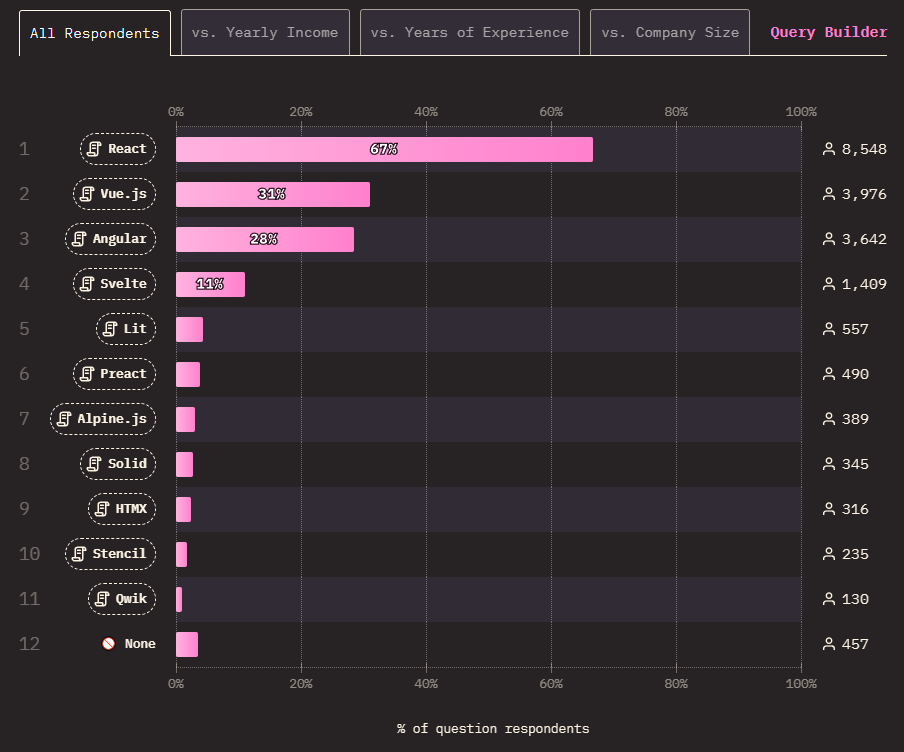
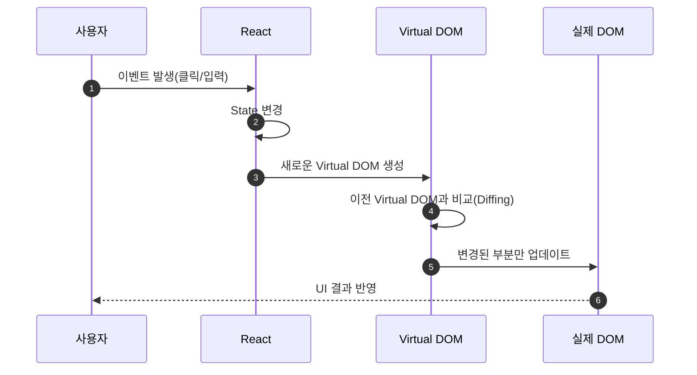
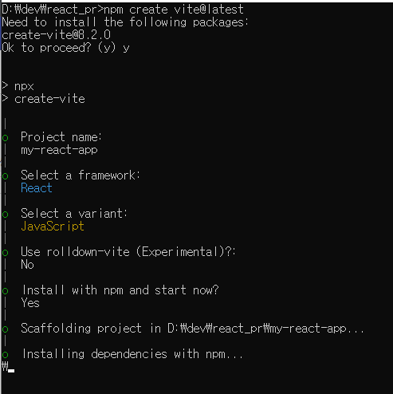
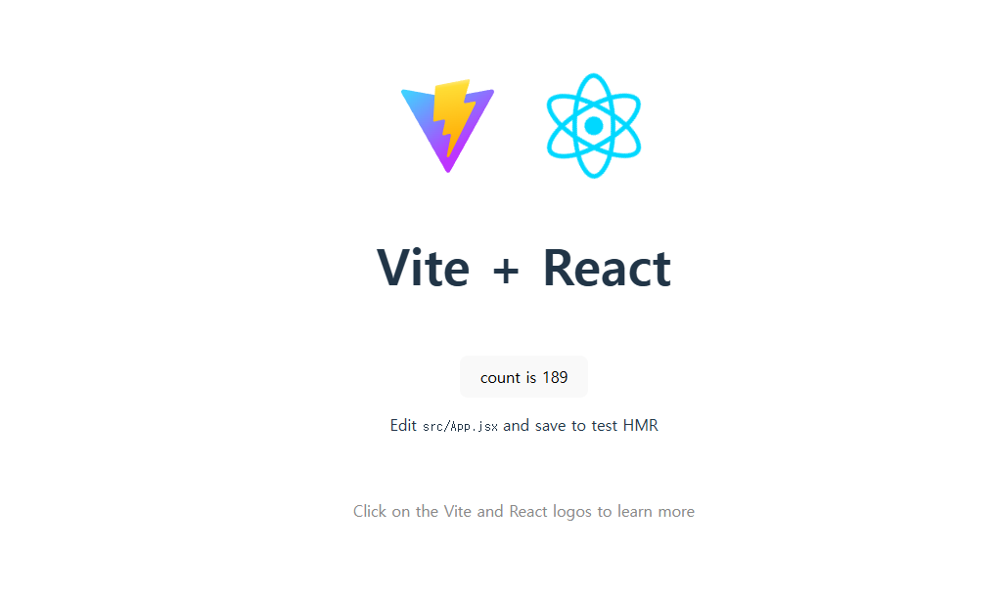
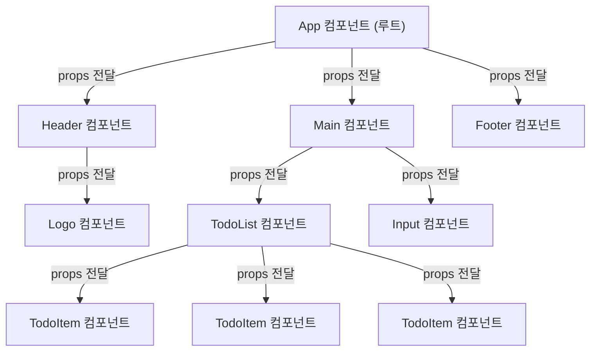

# [ 17주차 - 1209 ]

```bash
    금일 커리큘럼
        ├ 09:00 ~ 12:00 FrontEnd (React 기초, 컴포넌트 개념)
        └ 13:00 ~ 18:00 FrontEnd (React props, useState 기초) 
```


## 1. React 기초

> React : 사용자 인터페이스(UI)를 구축하기 위한 프론트엔드 프레임워크

### 1.1 프론트 프레임워크에서 React의 위치



- state of javascript 2024 조사 결과 : React(67%), Vue(31%)
- React가 가장 인기 있는 프론트엔드 프레임워크로 자리잡고 있음

### 1.2 React의 주요 특징

- **컴포넌트 기반 아키텍처**
    - UI를 독립적이고 재사용 가능한 컴포넌트로 분할하여 개발

- **가상 DOM (Virtual DOM)**
    - 실제 DOM 조작 대신 가상 DOM을 사용하여 성능 최적화

- **단방향 데이터 흐름**
    - 데이터가 부모 컴포넌트에서 자식 컴포넌트로 흐름

- **JSX 문법**
    - JavaScript와 HTML을 결합한 문법으로, UI 구조를 직관적으로 표현


### 1.3 React 작동 흐름



- 사용자가 이벤트를 발생시키면 React가 상태(state)를 변경
- React는 새로운 가상 DOM을 생성하고 이전 가상 DOM과 비교(diffing)
- 변경된 부분만 실제 DOM에 업데이트하여 UI를 효율적으로 렌더링함


### 1.4 React 설치 및 기본 설정

- Node.js와 npm 설치 (https://nodejs.org)

```bash
# Node.js 설치 확인
node -v

# npm 설치 확인
npm -v
```

- 프로젝트경로로 이동 후 vite로 React 프로젝트 생성
    - vite : 빠르고 간편한 프론트엔드 빌드 도구

```bash
# vite 생성
npm create vite@latest

# 생성 진행하면서 프로젝트 이름 입력 및 React 선택
```



### 1.5 React 개발 서버 실행

```bash
# 해당 프로젝트에서 의존성 설치
npm install

# 개발 서버 실행
npm run dev
```




### 1.6 React 기본 파일 구조

```bash
project-root/
    ├── node_modules/     # 설치된 패키지
    ├── public/           # 정적 파일
    ├── src/
    │   ├── assets/       # 이미지, 폰트 등
    │   ├── App.css       # App 스타일
    │   ├── App.jsx       # 메인 컴포넌트
    │   ├── index.css     # 전역 스타일
    │   └── main.jsx      # 진입점
    ├── index.html        # HTML 템플릿
    ├── package.json      # 프로젝트 설정
    └── vite.config.js    # Vite 설정
```

- src/main.jsx : React 애플리케이션의 진입점
- src/App.jsx : 메인 컴포넌트 파일
- index.html : HTML 템플릿 파일 
    - `<div id="root"></div>` 에서 React 앱이 렌더링됨

### 1.7 React 메인 진입점

- src/main.jsx

```javascript
import React from 'react'
import ReactDOM from 'react-dom/client'
import App from './App.jsx'
import './index.css'

// id='root'인 DOM 요소에 React 애플리케이션 렌더링
ReactDOM.createRoot(document.getElementById('root')).render(
  <React.StrictMode>
    <App />
  </React.StrictMode>,
)
```

- ReactDOM.createRoot : React 애플리케이션을 특정 DOM 요소에 렌더링
- `<App />` : 메인 컴포넌트가 렌더링됨


---

## 2. React 컴포넌트 이해

> UI를 구성하는 독립적이고 재사용 가능한 코드 단위


- **구성 요소**
    - JSX 반환
    - props 전달
    - 자식 컴포넌트 포함
    - state 관리 가능

### 2.1 컴포넌트 기본 구조

```javascript
// src/App.jsx
import React from "react";
import "./App.css";
import { Header, Main, Footer } from "./components/layout";

function App() {
    const props = {
        title: "React 컴포넌트 예제",
        content: "컴포넌트는 UI를 구성하는 독립적인 단위입니다."
    };
    return (
        <>
            <Header />
            {/* 자식 컴포넌트에게 props 전달 */}
            <Main data = {props}>
                <div>부모가 넣는 children 영역</div>
            </Main>
            <Footer />
        </>
    );
}
export default App;
```

**주요포인트**

- return은 반드시 하나의 최상위 요소만 가질 수 있음
- 여러 요소를 반환하고 싶다면 Fragment(`<> </>`)로 묶어 표현할 수 있음
- 컴포넌트 이름은 반드시 대문자로 시작
- 컴포넌트는 다른 컴포넌트를 포함할 수 있음


### 2.2 컴포넌트 종류

- 컴포넌트는 **함수형 컴포넌트**와 **클래스형 컴포넌트**로 구분

#### 함수형 컴포넌트

- React 16.8 이후로 주로 사용되는 방식
- JavaScript 함수 기반이며, 훅(Hooks) 사용 가능
- 간결하고 이해하기 쉬우며, 최근 React 개발에서 권장되는 방식

```javascript
// 함수형 컴포넌트 예시
import React from 'react';
function Greeting(props) {
    return (
        <>
            <h1>Hello, {props.name}!</h1>
        </>
    );
}
export default Greeting;
```

### 클래스형 컴포넌트

```javascript
// 클래스형 컴포넌트 예시
import React, { Component } from 'react';
class Greeting extends Component {
    render() {
        return (
            <h1>Hello, {this.props.name}</h1>
        );
    }
}
export default Greeting;
```

- class 문법 사용 (extends Component)
- state, lifecycle 메서드 사용 가능
- 유지보수용/레거시 코드에서만 주로 사용


### 2.3 차이점 정리

| 구분        | 함수형 컴포넌트     | 클래스형 컴포넌트        |
| --------- | ------------ | ---------------- |
| 정의 방식     | 함수           | class            |
| State     | useState 사용  | this.state 사용    |
| Lifecycle | useEffect 사용 | lifecycle 메서드 사용 |
| React 표준  | 현재 기본 방식     | 서서히 사용 감소        |


---

## 3. props와 컴포넌트 간 데이터 전달

> props : 부모 컴포넌트에서 자식 컴포넌트로 데이터를 전달하는 방법

- React 컴포넌트는 계층 구조(Tree)를 이루며, 부모 → 자식으로 데이터 흐름이 단방향
- 이때 부모가 자식에게 데이터를 넘기는 유일한 방법이 props
- 자식에서 부모에게 전달 받은 데이터는 읽기 전용 상태



### 3.1 props 기본 사용법

- 자식 컴포넌트에 속성 형태로 데이터 전달

```javascript
// 부모 컴포넌트
import React from 'react';
import Child from './Child';

const Parent = () => {
    const message = "Hello from Parent!";
    return (
        <Child greeting={message} />
    );
}
export default Parent;
```

- 자식 컴포넌트에서 props 받기

```javascript
// 자식 컴포넌트
import React from 'react';

const Child = (props) => { 
    // or ({ greeting }) : 구조분해 할당 방식
    return (
        <h1>{props.greeting}</h1>
    );
}
export default Child;
```


## 3.2 props 에 대한 이해


#### 1) props 객체 구조분해 할당

- props 객체에서 필요한 속성만 추출하여 사용 가능함
- 객체 구조분해 할당을 하거나, 함수 내 매개변수에서 바로 구조분해 할당 가능

```javascript
// 방법 1 : 함수 매개변수에서 구조 분해
const Child = ({ greeting, name }) => {
    return (
        <div>
            <h1>{greeting}</h1>
            <p>{name}</p>
        </div>
    );
}
// 방법 2 : 함수 내부에서 구조 분해
const Child = (props) => {
    const { greeting, name } = props;
    return (
        <div>
            <h1>{greeting}</h1>
            <p>{name}</p>
        </div>
    );
}
```

#### 2) props는 읽기 전용으로 직접 수정 불가

- props는 부모로부터 전달받은 데이터이므로, 자식 컴포넌트에서 직접 수정할 수 없음
- props를 변경하려고 하면 오류가 발생하므로, 새로운 변수를 만들어서 사용해야 함

```javascript
const Child = (props) => {
    const { name, gender } = props;
    // gender = "남자"; // 오류 발생: props는 읽기 전용

    // 올바른 방법: 새로운 변수에 할당하여 사용
    const genderString = () => {
        return gender === "M" ? "남자" : "여자";
    }

    return (
        <>
            <p>이름: {name}</p>
            <p>성별: {genderString()}</p>
        </>
    );
}
```

#### 3) props 기본값 설정

- props에 기본값을 설정하여, 부모가 해당 속성을 전달하지 않을 때 기본값 사용 가능

```javascript
const Child = ({ name, email = "없음" }) => {
    return (
        <>
            <p>이름: {name}</p>
            <p>이메일: {email}</p>
        </>
    );
}
```

---

## 4. 상태(State) 관리 기초 & 렌더링 원리

> 상태(state) : 컴포넌트 내에서 변경될 수 있는 데이터

- `userState` 훅(hooks)을 사용하여 상태 관리
- 상태가 변경되면 컴포넌트가 다시 렌더링되어 UI가 업데이트됨
- props와 달리 상태는 컴포넌트 내부에서 변경 가능

### 4.1 useState 훅 사용법

```javascript
// userState('') : 'state' 변수 초기화값
// state : 현재 상태 값
// setState : 상태 변경 함수
const [state, setState] = useState('');
```

- `useState` : React 훅으로, 상태 변수를 선언하고 초기값을 설정
- `state` : 현재 상태 값을 나타내는 변수
- `setState` : 상태 값을 변경하는 함수

### 4.2 상태 변경 시 렌더링 원리

- 처음 화면 렌더링시 함수를 한번만 호출
- 상태가 변경될 때마다 함수가 다시 호출하여 업데이트됨

```javascript
const Counter = () => {
    const [count, setCount] = useState(0);

    console.log("렌더링 됨"); // 상태 변경시마다 호출됨

    const increment = () => {
        setCount(count + 1); // 상태 변경
    }

    return (
        <div>
            <p>카운트: {count}</p> {/* 상태에 따라 업데이트 */}
            <button onClick={increment}>증가</button>
        </div>
    );
}
```


### 4.3 부모 → 자식 : 상태값을 props로 전달

- 훅을 통해서 부모에서 상태를 관리하고, props로 자식에게 전달 가능

```javascript
import { useState } from 'react';

const Child = ({ data }) => {
    return (
        <div>
            <h3>자식 컴포넌트</h3>
            <p>부모로부터 전달받은 데이터: {data}</p>
        </div>
    );
}

const Parent = () => {
    const [message, setMessage] = useState('');

    const handleChange = (e) => {
        setMessage(e.target.value);
    }

    return (
        <div>
            <h2>부모 컴포넌트</h2>
            {/* 입력값에 따라 'message' 상태 변경 */}
            <input
                type="text"
                value={message}
                onChange={handleChange}
            />
            {/* 자식 컴포넌트에 'message' 상태값 전달 */}
            <Child data={message} />
        </div>
    );
}

export default Parent;
```


### 4.4 자식 → 부모 : 콜백 함수 전달

- 자식에서 부모의 상태를 변경하려면, 부모가 콜백 함수를 자식에게 props로 전달해야 함
- 자식은 콜백함수를 받아 요청을 보낼 수 있음

```javascript
import { useState } from 'react';

const ChildButton = ({ onButtonClick }) => {
    return (
        {/* 버튼 클릭시 'onButtonClick' 콜백함수 내용을 부모로 전달 */}
        <button 
            onClick={() => onButtonClick('자식 버튼 클릭됨!')}
        >
            클릭하세요
        </button>
    );
}
const ChildInput = ({ onInputChange }) => {
    return (
        {/* 인풋 입력시 'onInputChange' 콜백함수 내용을 부모로 전달 */}
        <input
            type="text"
            onChange={(e) => onInputChange(e.target.value)}
            placeholder="입력하세요"
        />
    );
}

const Parent = () => {
    const [log, setLog] = useState('');

    const handleUpdate = (message) => {
        setLog(message);
    };

    return (
        <div>
            <h2>부모 컴포넌트</h2>
            {/* 자식으로부터 받은 메시지를 상태로 관리하여 출력 */}
            <p>자식으로부터 받은 메시지: {log}</p>
            <br />
            <ChildButton onButtonClick={handleUpdate} />
            <ChildInput onInputChange={handleUpdate} />
        </div>
    );
}

export default Parent;
```

---

## etc.

### React에서의 Hook

- 훅(hooks) : 함수형 컴포넌트에서 상태 관리 및 라이프사이클 기능을 사용할 수 있게 해주는 기능

### 주요 훅 종류

| Hook                 | 설명               | 사용처                       |
| -------------------- | ---------------- | ------------------------- |
| useState             | 상태값 선언 및 업데이트    | 입력값, UI 상태, 토글            |
| useEffect            | 사이드 이펙트 처리       | 데이터 fetch, DOM 변경, API 콜  |
| useContext           | 전역 상태 공유         | 로그인 정보, 테마, 언어            |
| useReducer           | 복잡한 상태 관리        | 장바구니, Todo 관리, 멀티 상태      |
| useRef               | DOM 요소 및 변경값 저장  | 포커스 제어, Timer, 이전값 기억     |
| useMemo              | 연산 결과 메모이제이션     | 무거운 연산 최적화                |
| useCallback          | 함수 메모이제이션        | 자식 컴포넌트 props 최적화         |


### useState 예제 - (상태값 업데이트)

- 카운터 증가

```javascript
import { useState } from 'react';

const Counter = () => {
    const [count, setCount] = useState(0); // 상태 생성

    const add = () => setCount(count + 1); // 상태 변경

    return (
        <div>
            <p>카운트: {count}</p>
            <button onClick={add}>증가</button>
        </div>
    );
};

export default Counter;
```

### useEffect 예제 - (사이드 이펙트 처리)

- 타이머 확인

```javascript
import { useState, useEffect } from 'react';

const Timer = () => {
    const [time, setTime] = useState(0);

    useEffect(() => {
        const id = setInterval(() => setTime(t => t + 1), 1000);

        // 언마운트 시 타이머 해제
        return () => clearInterval(id);
    }, []); // 최초 1번 실행

    return <div>흘러간 시간: {time}</div>;
};

export default Timer;
```


### useContext 예제 - (전역 상태 공유)

- 테마 컨텍스트 예제

- `context.jsx` : 컨텍스트 생성

```javascript
import { createContext } from 'react';

export const ThemeContext = createContext();
```

- `App.jsx` : 컨텍스트 제공

```javascript
import { ThemeContext } from './Context';

const App = () => {
    return (
        <ThemeContext.Provider value="dark">
            <Child />
        </ThemeContext.Provider>
    );
};
```

- `Child.jsx` : 컨텍스트 사용

```javascript
import { useContext } from 'react';
import { ThemeContext } from './Context';

const Child = () => {
    const theme = useContext(ThemeContext);

    return <div>현재 테마: {theme}</div>;
};

export default Child;
```

### useReducer 예제 - (복잡한 상태 처리)

```javascript
import { useReducer } from 'react';

function reducer(state, action) {
    switch (action.type) {
        case 'increment':
            return { count: state.count + 1 };
        case 'decrement':
            return { count: state.count - 1 };
        default:
            return state;
    }
}

const Counter = () => {
    const [state, dispatch] = useReducer(reducer, { count: 0 });

    return (
        <div>
            <p>count: {state.count}</p>
            <button onClick={() => dispatch({ type: 'increment' })}>+</button>
            <button onClick={() => dispatch({ type: 'decrement' })}>-</button>
        </div>
    );
};

export default Counter;
```

### useRef 예제 - (DOM 접근)

- 입력창에 포커스 이동

```javascript
import { useRef } from 'react';

const InputFocus = () => {
    const inputRef = useRef(null); // DOM 참조

    const focusInput = () => {
        inputRef.current.focus();
    };

    return (
        <div>
            <input ref={inputRef} type="text" />
            <button onClick={focusInput}>포커스 이동</button>
        </div>
    );
};

export default InputFocus;
```

### useCallback 예제 - (함수 메모이제이션)

- 메모이제이션 : 이전에 계산된 값을 저장하여 동일한 입력에 대해 재계산을 피하는 기법
- 부모 컴포넌트에서 자식 컴포넌트로 콜백 함수 전달 시, 불필요한 재생성을 방지

```javascript
import { useState, useCallback } from 'react';

const Parent = () => {
    const [count, setCount] = useState(0);

    // count 변경될 때만 새 함수 생성
    const handleClick = useCallback(() => {
        console.log('clicked');
    }, [count]);

    return (
        <>
            <button onClick={() => setCount(count + 1)}>+</button>
            <Child onClick={handleClick} />
        </>
    );
};

const Child = ({ onClick }) => {
    return <button onClick={onClick}>Child Button</button>;
};

export default Parent;
```

### useMemo 예제 - (연산 메모이제이션)

- 무거운 연산의 결과를 메모이제이션하여 성능 최적화

```javascript
import { useMemo, useState } from 'react';

const ExpensiveCalc = () => {
    const [num, setNum] = useState(1);

    // 연산 결과를 기억
    const result = useMemo(() => {
        console.log('무거운 연산 실행');
        return num * num;
    }, [num]); // num 바뀔 때만 실행

    return (
        <div>
            <p>결과: {result}</p>
            <button onClick={() => setNum(num + 1)}>증가</button>
        </div>
    );
};

export default ExpensiveCalc;
```