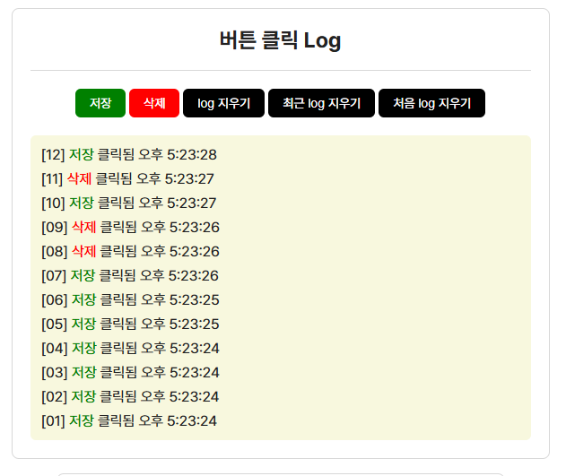
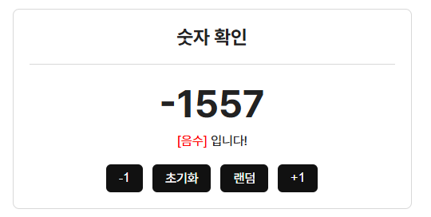
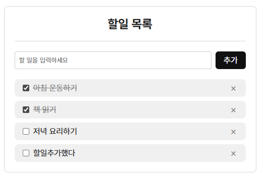

# [ 17주차 - 1210 ]

```bash
    금일 커리큘럼
        ├ 09:00 ~ 12:00 FrontEnd (React Children props)
        └ 13:00 ~ 18:00 FrontEnd (React 조건부/리스트 렌더링, 컴포넌트 실습)
```


## 1. 컴포넌트 Props의 Children 활용법


### 1.1 Children props

- 컴포넌트의 열고 닫는 태그 사이에 들어가는 내용을 props로 전달하는 방식

```javascript
import React from 'react';

const Child = ({ children }) => {
    return (
        <div>
            <h2>자식 컴포넌트</h2>
            <div>
                {children} {/* 여기의 부모가 전달한 슬롯이 렌더링됨 */}
            </div>
        </div>
    );
}

const Parent = () => {
    return (
        <div>
            <Child>
                <p>이 내용이 children props로 전달됩니다.</p>
                <p>여러개도 가능</p>
            </Child>
        </div>
    );
}

export default Parent;
```

### 1.2 다중 children 전달 시

- children props는 기본적으로 하나의 슬롯만 제공
- 여러 개의 슬롯을 전달하고 싶다면 별도의 props로 전달

```javascript
const Modal = ({ title, content, actions }) => {
    return (
        <div className="modal">
            <div className="modal-header">
                {title}
            </div>
            <div className="modal-body">
                <div className="modal-content">
                    {content}
                </div>
            </div>
            <div className="modal-footer">
                {actions}
            </div>
        </div>
    );
}

const Test = () => {
    return (
        <Modal
            title={<h3>삭제 확인</h3>}
            content={<p>삭제된 데이터는 복구가 불가능합니다.</p>}
            actions={
                <>
                    <button>삭제</button>
                    <button>취소</button>
                </>
            }
        />
    );
}

export default Test;
```


---

## 2. React 렌더링 - 조건부, 리스트

- 컴포넌트는 JSX 안에서 렌더링을 통해 동적인 UI를 보여줄 수 있음
- 조건부 렌더링(보일지/안보일지)
- 리스트 렌더링(반복 렌더링)


### 2.1 조건부 렌더링

> 상태 값에 따라 UI를 다르게 보여주는 방식

#### 1) 내부 삼항 연산자 방식

```javascript
const User = ({ isLogin }) => {
    return (
        <div>
            {
                isLogin 
                ? <p>로그인 상태</p>
                : <p>로그아웃 상태</p>
            }
        </div>
    );
};
```

#### 2) 내부 AND (&&) 연산자 방식

```javascript
const Message = ({ unread }) => {
    return (
        <div>
            {unread > 0 && <p>{unread}개의 알림이 있습니다.</p>}
        </div>
    );
};
```

### 3) 조건부 방식

- 함수로 처리하는 방식

```javascript
const Result  = ({ score }) => {

    const getGrade = () => {
        if (score >= 90) {
            return <span className="grade-A">A 학점</span>;
        }
        if (score >= 80) {
            return <span className="grade-B">B 학점</span>;
        }
        if (score >= 70) {
            return <span className="grade-C">C 학점</span>;
        }
        return <span className="grade-F">F 학점</span>;
    };

    return (
        <div>
            {getGrade()}
        </div>
    );
};
```

- 단순 if로 리턴하는 방식

```javascript
const Status = ({ status }) => {

    if (status === 'error') {
        return (
            <>
                <p className="error">데이터 로드 실패!</p>
                <p>다시 시도하세요</p>
                <button>재시도</button>
            </>
        );
    } else {
        return (
            <>
                <p className="success">데이터 로드 성공!</p>
                <button>상세보기</button>
            </>
        );
    }

};

```

### 2.2 리스트 렌더링

> 배열 데이터를 반복 렌더링하는 방식

#### 1) map() 함수를 사용하여 배열을 JSX로 변환

- key 속성 : 각 항목을 고유하게 식별할 수 있는 값으로 설정 (보통 id)

```javascript
const ItemList = () => {
    const items = [
        { id: 1, name: '아이템 1' },
        { id: 2, name: '아이템 2' },
        { id: 3, name: '아이템 3' },
    ];

    return (
        <ul>
            {items.map((item) => (
                <li key={item.id}>{item.name}</li>
            ))}
        </ul>
    );
};
```

#### 2) 컴포넌트로 분리하여 렌더링

```javascript
const Item = ({ name }) => {
    return <li>{name}</li>;
}

const ItemList = () => {
    const items = [
        { id: 1, name: '아이템 1' },
        { id: 2, name: '아이템 2' },
        { id: 3, name: '아이템 3' },
    ];

    return (
        <ul>
            {items.map((item) => (
                <Item key={item.id} name={item.name} />
            ))}
        </ul>
    );
};
```

---


## 3. React 컴포넌트  실습

### 3.1 Logs 만들기



- 버튼 클릭 시 로그가 쌓이는 컴포넌트 작성
- 로그는 '저장', '삭제' 버튼 클릭 시 각각의 타입과 클릭된 시간으로 기록
- log 데이터 관련 지우기 옵션 제공

<details>
<summary><strong>Logs.jsx 구현 코드 보기</strong></summary>


```javascript
import { useState } from 'react';

const Logs = () => {
    const [log, setLog] = useState([]);

    // 버튼 타입 컬러 주기
    const typeColors = {
        save: "green",
        delete: "red",
        clear: "black"
    };

    // 날짜 포맷 공통으로 해보기
    const formatDate = (date, type) => {
        const padChange = (num) => num < 10 ? '0' + num : num;
        const timeLabel = (time) => time <= 12 ? '오전' : '오후';

        const { year, month, day, hh, mm, ss } = {
            year    : date.getFullYear(),
            month   : padChange(date.getMonth() + 1),
            day     : padChange(date.getDate()),
            hh      : padChange(date.getHours()),
            mm      : padChange(date.getMinutes()),
            ss      : padChange(date.getSeconds())
        };

        if (type === 'yyyy-mm-dd hh:mm:ss') return `${year}-${month}-${day} ${hh}:${mm}:${ss}`;
        else if (type === '년월일') return `${year}년 ${month}월 ${day}일`;
        else if (type === 'hh:mm:ss am/pm') return `${timeLabel(hh)} ${(hh % 12) || 12}:${mm}:${ss}`;
        else if (type === 'hh:mm:ss') return `${hh}:${mm}:${ss}`;
        else return `${year}-${month}-${day}`;
    };

    // 로그 관련 클릭 핸들러
    const handleClick = (type) => {
        const now = new Date();
        if (type === 'clear-top') setLog((prev) => prev.slice(1));
        else if (type === 'clear-bottom') setLog((prev) => prev.slice(0, -1));
        else if (type === 'clear') setLog([]);
        else {
            setLog((prevLog) => {
                    const newObj = {
                        type: type,
                        date: formatDate(now, 'hh:mm:ss am/pm')
                    }
                    const newArr = [newObj, ...prevLog];
                    return newArr;
                }
            );
        };
    };

    return (
        <div className="exam-box logs">
            <h2 className="title">버튼 클릭 Log</h2>
            <div className="btn-box">
                <button 
                    className="btn-exam" 
                    onClick={() => handleClick('save')}
                    style={{backgroundColor : typeColors.save}}
                    >
                    저장
                </button>
                <button 
                    className="btn-exam" 
                    onClick={() => handleClick('delete')}
                    style={{backgroundColor : typeColors.delete}}
                    >
                    삭제
                </button>
                <button 
                    className="btn-exam" 
                    onClick={() => handleClick('clear')}
                    style={{backgroundColor : typeColors.clear}}
                    >
                    log 지우기
                </button>
                <button 
                    className="btn-exam" 
                    onClick={() => handleClick('clear-top')}
                    style={{backgroundColor : typeColors.clear}}
                    >
                    최근 log 지우기
                </button>
                <button 
                    className="btn-exam" 
                    onClick={() => handleClick('clear-bottom')}
                    style={{backgroundColor : typeColors.clear}}
                    >
                    처음 log 지우기
                </button>

            </div>
            <div className="info-box">
                {log.length != 0 && (
                    <ul className="info-list">
                        {log.map((item, index) => {
                            return (
                                <li key={index} className="item">
                                    <span>
                                        [{
                                            log.length - index < 10
                                            ? '0' + (log.length - index)
                                            : log.length - index
                                        }]
                                    </span>
                                    <span style={{color: typeColors[item.type]}}>
                                        &nbsp;
                                        {
                                            item.type === 'save'
                                            ? '저장'
                                            : item.type === 'delete'
                                            ? '삭제' : 'undefined'
                                        }
                                    </span>
                                    <span> 클릭됨 {item.date}</span>
                                </li>
                            );
                        })}
                    </ul>
                )}
            </div>
        </div>
    );
}

export default Logs;
```

</details>


### 3.2 숫자확인 만들기



- +1, -1, 초기화, 랜덤 버튼을 통해 숫자 변경
- 숫자가 양수인지 음수인지 0인지 확인하는 정보 제공

<details>
<summary><strong>NumberCheck.jsx 구현 코드 보기</strong></summary>

```javascript
import { useState } from "react";

const NumberCheck = () => {
    const [count, setCount] = useState(0);

    const handleClick = (type) => {
        if (type === 'decrement') setCount(count - 1);
        else if (type === 'increment') setCount(count + 1);
        else if (type === 'reset') setCount(0);
        else if (type === 'random') setCount(Math.floor(Math.random() * 15001) - 5000);
    }

    const { label, color } = (() => {
        if (count > 0) return { label: '[양수]', color: 'green' };
        if (count < 0) return { label: '[음수]', color: 'red' };
        return { label: '[0]', color: 'black' };
    })();

    return (
        <div className="exam-box number-check">
            <p className="title">숫자 확인</p>
            <div className="info-box">
                <p className="count">{count}</p>
                <p className="label">
                    <span style={{ color: color }}>{label}</span>
                    &nbsp;입니다!
                </p>
            </div>
            <div className="btn-box">
                <button className="btn-exam" onClick={() => handleClick('decrement')}>-1</button>
                <button className="btn-exam" onClick={() => handleClick('reset')}>초기화</button>
                <button className="btn-exam" onClick={() => handleClick('random')}>랜덤</button>
                <button className="btn-exam" onClick={() => handleClick('increment')}>+1</button>
            </div>
        </div>
    );
}

export default NumberCheck;
```

</details>


### 3.3 할일목록 만들기



- 할 일 체크 (임시), 입력필드로 할일 추가, 삭제 버튼 기능 제공
- 할 일이 없을 시 안내 문구 표시

<details>
<summary><strong>SimpleTodo.jsx 구현 코드 보기</strong></summary>

- 각 자식 컴포넌트는 부모 JSX 내에 임의 작성함 (원래는 분리 권장)
    - TodoItem : 할 일 항목 컴포넌트
    - TodoInput : 할 일 입력 컴포넌트

```javascript
import { useState } from "react";

const TodoItem = ({ todo , onDel }) => {
    const handleDel = () => {
        onDel(todo.id); // 부모에게 id 전달
    }

    return (
        <div className="todo-item">
            <div className="todo-slot">
                {/**
                 * 리액트에서 'checked=' 속성은 읽기 전용됨
                 * 'defaultChecked=' 속성으로 초기값 설정 가능 (일반 html checked 동일)
                 */}
                <input id={`todo-${todo.id}`} type="checkbox" defaultChecked={todo.completed}/>
                <label htmlFor={`todo-${todo.id}`}>{todo.text}</label>
            </div>
            <div className="todo-slot right">
                <button className="btn-exam type-icon del" onClick={handleDel}>
                    <span className="hidden">삭제</span>
                </button>
            </div>
        </div>
    );
}

const TodoInput = ({ onAdd }) => {
    const [input, setInput] = useState('');

    const handleAdd = () => {
        onAdd(input); // 부모에게 입력값 전달
        setInput('');
    }

    return (
        <div className="input-add-box">
            <input
                className="todo-input"
                type="text"
                value={input}
                onChange={(e) => setInput(e.target.value)}
                placeholder="할 일을 입력하세요"
            />
            <button className="btn-exam" onClick={handleAdd}>추가</button>
        </div>
    );
}


const SimpleTodo = () => {
    const [todos, setTodos] = useState([
        { id: 1, text: '아침 운동하기', completed: false },
        { id: 2, text: '책 읽기', completed: true },
        { id: 3, text: '저녁 요리하기', completed: false }
    ]);

    // 할 일 추가
    const onAdd = (text) => {
        if (text.trim() === '') return; // 빈 값 무시
        setTodos(prevItem => [
            ...prevItem,
            {
                id: Date.now(), // 임시 부여
                text,
                completed: false
            }
        ]);
    };

    // 할 일 삭제
    const onDel = (id) => {
        setTodos(prevItems => prevItems.filter(todo => todo.id !== id));
    };

    return (
        <div className="exam-box simple-todo">
            <h2 className="title">할일 목록</h2>
            <TodoInput onAdd={onAdd} />
            {todos.length === 0 ? (
                <p className="no-data-text">할 일이 없습니다.</p>
            ) : (
                <ul className="todo-list">
                    {todos.map((todo) => (
                        <li key={todo.id}>
                            <TodoItem todo={todo} onDel={onDel} />
                        </li>
                    ))}
                </ul>
            )}
        </div>
    );
}

export default SimpleTodo;
```

</details>