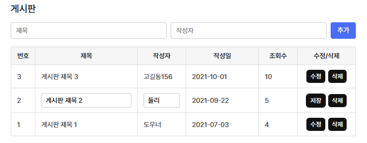

# [ 17주차 - 1210 ]

```bash
    금일 커리큘럼
        ├ 09:00 ~ 12:00 FrontEnd (React 복습)
        └ 13:00 ~ 18:00 FrontEnd (UseRef, UseEffect, 간단한 게시판 실습)
```


## 1. React - useRef 이해

### 1.1 useRef 란?

- React Hook 중 하나로, 함수형 컴포넌트에서 참조를 생성하고 관리하는 데 사용
- DOM 요소나 값에 대한 참조를 유지할 수 있으며, 컴포넌트가 다시 렌더링되어도 해당 참조는 유지
- DOM 조작 (= querySelector) 과 동일한 역할을 함
    - 대상요소에 `ref` 속성으로 참조를 연결
    - 사용시 `current` 프로퍼티로 접근

```javascript
import { useRef } from 'react';

const MyComponent = () => {
  const inputRef = useRef(null);

  const focusInput = () => {
    inputRef.current.focus();
    // inputRef.current = '<input>' DOM 요소
  };

  return (
    <div>
      <input ref={inputRef} type="text" />
      <button onClick={focusInput}>Focus Input</button>
    </div>
  );
}
export default MyComponent;
```

### 1.2 useState, useRef, let 비교

```javascript
import { useState, useRef } from 'react';

const variableExample = () => {
    let countLet = 0; // 일반 변수
    const [countState, setCountState] = useState(0); // 상태 변수
    const countRef = useRef(0); // 참조 변수

    // 일반 변수 증가
    const incrementLet = () => {
        countLet += 1;
        console.log('countLet:', countLet); // 값은 증가하지만 렌더링되지 않음
    };

    // 상태 변수 증가
    const incrementState = () => {
        setCountState(countState + 1); // 값이 증가하고 컴포넌트가 다시 렌더링됨
    };

    // 참조 변수 증가
    const incrementRef = () => {
        countRef.current += 1;
        console.log('countRef:', countRef.current); // 값은 증가하지만 렌더링되지 않음
    };

    return (
        <div>
            <p>countLet: {countLet}</p>
            <p>countState: {countState}</p>
            <p>countRef: {countRef.current}</p>
            <button onClick={incrementLet}>Increment Let</button>
            <button onClick={incrementState}>Increment State</button>
            <button onClick={incrementRef}>Increment Ref</button>
        </div>
    );
}

```

- 일반 변수(`let`)의 경우, 값 변경시 **렌더링X**, 렌더링시 **값 초기화**
- `useState`의 경우, 값 변경시 **렌더링O**, 렌더링시 **값 유지**
- `useRef`의 경우, 값 변경시 **렌더링X**, 렌더링시 **값 유지**


### 1.3 useRef 활용 예시

- [등록] 버튼 클릭 시, 값이 비어있는 input에 자동으로 포커스 이동

```javascript
import { useRef, useState } from "react";

const InputForm = () => {
    // 입력값 상태 관리
    const [form, setForm] = useState({
        name: "",
        email: "",
        phone: ""
    });

    // 각 input을 담을 ref 배열
    const inputRefs = useRef([]);

    // input 값 변경시
    const handleChange = (e) => {
        const { name, value } = e.target;

        setForm({
            ...form,
            [name]: value // [] <-- 동적 key 값 (예: name, email, phone)
        });
    };

    // 등록 버튼 클릭 시 실행
    const handleSubmit = () => {
        // 1) form 객체를 순서대로 검사하면서 "값이 없는 input" 찾기
        const keys = Object.keys(form);

        for (let i = 0; i < keys.length; i++) {
            const key = keys[i];

            // 값이 비었으면 → 해당 input에 포커스 이동 후 종료
            if (form[key].trim() === "") {
                inputRefs.current[i].focus();
                return;
            }
        }

        // 2) 모든 값이 존재하는 경우
        alert("등록 완료!");
    };

    return (
        <div>
            <h3>값 없는 input에 자동 포커스 이동 예시</h3>

            {/* 1. 이름 */}
            <input
                ref={(el) => (inputRefs.current[0] = el)} // ref 배열에 저장
                type="text"
                name="name"
                value={form.name}
                placeholder="이름 입력"
                onChange={handleChange}
            />

            <br /><br />

            {/* 2. 이메일 */}
            <input
                ref={(el) => (inputRefs.current[1] = el)}
                type="email"
                name="email"
                value={form.email}
                placeholder="이메일 입력"
                onChange={handleChange}
            />

            <br /><br />

            {/* 3. 휴대폰 */}
            <input
                ref={(el) => (inputRefs.current[2] = el)}
                type="text"
                name="phone"
                value={form.phone}
                placeholder="전화번호 입력"
                onChange={handleChange}
            />

            <br /><br />

            <button onClick={handleSubmit}>등록하기</button>
        </div>
    );
};

export default InputForm;
```

---

## 2. React - useEffect 이해

### 2.1 useEffect 란?

- React Hook 중 하나로, 함수형 컴포넌트에서 부수 효과(side effects)를 처리하는 데 사용
- 컴포넌트가 렌더링된 후 특정 작업을 수행하거나, 상태나 props가 변경될 때마다 특정 작업을 수행할 수 있도록 함
    - 마운트, 언마운트, 업데이트 시점에 실행 가능
- 주로 상태값 변경 후 후속작업, 혹은 API 호출, 이벤트 리스너 등록/해제 등에 활용

#### 기본 문법

```javascript
useEffect(() => {
  // 부수 효과 작업 수행
  return () => {
    // 정리(clean-up) 작업 수행 (선택 사항)
  };
}, [/** 의존성배열 */]);
```

#### 예시

```javascript
import { useEffect, useState } from 'react';

const MyComponent = () => {
  const [count, setCount] = useState(0);

  // 컴포넌트가 마운트될 때 한 번 실행
  useEffect(() => {
    console.log('컴포넌트가 마운트되었습니다.');

    // 언마운트 시 실행할 정리 함수 반환
    return () => {
      console.log('컴포넌트가 언마운트되었습니다.');
    };
  }, []);

  return (
    <div>
      <p>카운터: {count}</p>
      <button onClick={() => setCount(count + 1)}>+1 증가</button>
    </div>
  );
}

export default MyComponent;
```


### 2.2 useEffect 의존성 배열 이해

- `useEffect(() => {}, [])` 훅의 두 번째 인자`[]`로 전달되는 배열
- 배열에 포함된 값들이 변경될 때마다 `useEffect` 내부의 콜백 함수가 실행

```javascript
import { useEffect, useState } from 'react';

const MyComponent = () => {
  const [count, setCount] = useState(0);
  const [text, setText] = useState('');

  // 1. 의존성 배열 없음 : 모든 렌더링 시마다 실행 (비추천)
  useEffect(() => {
    console.log('렌더링 반응');
  });
  
  // 2. 빈 배열 : 마운트시 한번만 실행됨 (API 호출 등 초기화 작업에 적합)
  useEffect(() => {
    console.log('한번만 실행됨');
  }, []);

  // 3. count가 변경될 때마다 실행
  useEffect(() => {
    console.log('Count가 변경되었습니다:', count);
  }, [count]);

  // 4. text가 변경될 때마다 실행
  useEffect(() => {
    console.log('Text가 변경되었습니다:', text);
  }, [text]);

  return (
    <div>
      <p>카운터: {count}</p>
      <button onClick={() => setCount(count + 1)}>+1 증가</button>

      <p>입력값: {text}</p>
      <input type="text" value={text} onChange={(e) => setText(e.target.value)} />
    </div>
  );
}

export default MyComponent;
```

- **1) 의존성 배열 없음** : 모든 렌더링 시마다 실행 (비추천)
- **2) 빈 배열** : 마운트시 한번만 실행됨 (API 호출 등 초기화 작업에 적합)
- **3) 특정 상태값** : 해당 상태값이 변경될 때마다 실행
    - 여러 상태값을 배열에 포함시킬 수도 있음 (`[count, text]`)


### 2.3 useEffect 타이머 예시

```javascript
import { useEffect, useState } from "react";
const Timer = () => {
    const [seconds, setSeconds] = useState(0);

    useEffect(() => {
        const timer = setInterval(() => {
            setSeconds((prevSeconds) => prevSeconds + 1);
        }, 1000);

        // 정리 함수: 컴포넌트 언마운트 시 타이머 해제
        return () => {
            clearInterval(timer);
        };
    }, []); // 빈 배열: 마운트 시 한 번만 실행

    return (
        <div>
            <h3>타이머: {seconds}초</h3>
        </div>
    );
};

const TimerExample = () => {
    const [showTimer, setShowTimer] = useState(false);
    return (
        <div>
            <h2>useEffect 타이머 예시</h2>
            <button onClick={() => setShowTimer(!showTimer)}>
                {showTimer ? "타이머 숨기기" : "타이머 보이기"}
            </button>
            {showTimer && <Timer />}
        </div>
    );
};
export default TimerExample;
```

- `Timer` 컴포넌트가 마운트될 때 타이머가 시작되고, 언마운트될 때 타이머가 해제됨
- `return` 문에서 정리 작업이 없으면 타이머가 계속 실행되어 메모리 누수가 발생할 수 있음

---

## 3. 심플 게시판 실습



- React의 훅을 이용해서 간단한 게시판 구현
- 행 추가, 행 수정, 행 삭제 기능 포함

```javascript
import { useState, useEffect } from "react";

const BoardSimple = () => {
    // 테이블 데이터
    const [rows, setRows] = useState([
        {
            id: 3,
            title: "게시판 제목 3",
            writer: "고길동",
            created: "2021-10-01",
            readCount: 10
        },
        {
            id: 2,
            title: "게시판 제목 2",
            writer: "둘리",
            created: "2021-09-22",
            readCount: 5
        },
        {
            id: 1,
            title: "게시판 제목 1",
            writer: "도우너",
            created: "2021-07-03",
            readCount: 4
        }
    ]);

    useEffect(() => {
        console.log(rows);
    }, [rows]);

    // 수정 중인 행
    const [editRow, setEditRow] = useState(null);

    // 추가 입력 필드 부분
    const [inputs, setInputs] = useState({
        title: "",
        writer: "",
    });

    // 입력 변경 (추가용)
    const handleAddChange = (e) => {
        const { name, value } = e.target;
        setInputs({ ...inputs, [name]: value });
    };

    // 행 추가 핸들러
    const handleAdd = () => {
        if (!inputs.title || !inputs.writer) return;

        const newRow = {
            id: Date.now(),
            title: inputs.title,
            writer: inputs.writer,
            created: new Date().toISOString().slice(0, 10),
            readCount: 0
        };

        setRows([newRow, ...rows]);
        setInputs({ title: "", writer: "" });
    };

    // 수정 모드 진입
    const handleEdit = (row) => {
        setEditRow({ ...row }); // 복사본 생성
    };

    //테이블 내 수정 input
    const handleEditChange = (e, key) => {
        setEditRow({
            ...editRow,
            [key]: e.target.value
        });
    };

    // 수정 저장
    const handleSave = (row) => {
        setRows(rows.map(r => r.id === row.id ? editRow : r));
        setEditRow(null);
    };

    // 삭제
    const handleDelete = (row) => {
        setRows(rows.filter(r => r.id !== row.id));
    };

    return (
        <div className="table-area">
            <h4 className="table-title">게시판</h4>

            {/* 추가 입력폼 */}
            <div className="form-row">
                <input
                    name="title"
                    placeholder="제목"
                    value={inputs.title}
                    onChange={handleAddChange}
                />
                <input
                    name="writer"
                    placeholder="작성자"
                    value={inputs.writer}
                    onChange={handleAddChange}
                />
                <button onClick={handleAdd}>추가</button>
            </div>

            {/* 테이블 */}
            <div className="table-wrap type-col">
                <table>
                    <colgroup>
                        <col style={{ width: "50px" }} />
                        <col />
                        <col style={{ width: "100px" }} />
                        <col style={{ width: "150px" }} />
                        <col style={{ width: "80px" }} />
                        <col style={{ width: "120px" }} />
                    </colgroup>

                    <thead>
                        <tr>
                            <th>번호</th>
                            <th>제목</th>
                            <th>작성자</th>
                            <th>작성일</th>
                            <th>조회수</th>
                            <th>수정/삭제</th>
                        </tr>
                    </thead>

                    <tbody>
                        {rows.map((row, idx) => {
                            {/* 수정 모드 여부 확인 */}
                            const isEditing = editRow && editRow.id === row.id;
                            console.log(isEditing, editRow, editRow?.id, row.id);

                            return (
                                <tr key={row.id}>
                                    <td>{rows.length - idx}</td>

                                    {/* 제목 */}
                                    <td>
                                        {isEditing ? (
                                            <input
                                                value={editRow.title}
                                                onChange={(e) => handleEditChange(e, "title")}
                                            />
                                        ) : (
                                            row.title
                                        )}
                                    </td>

                                    {/* 작성자 */}
                                    <td>
                                        {isEditing ? (
                                            <input
                                                value={editRow.writer}
                                                onChange={(e) => handleEditChange(e, "writer")}
                                            />
                                        ) : (
                                            row.writer
                                        )}
                                    </td>

                                    <td>{row.created}</td>
                                    <td>{row.readCount}</td>

                                    {/* 수정/삭제 */}
                                    <td>
                                        <div className="btn-group">
                                            {isEditing ? (
                                                <button onClick={() => handleSave(row)}>저장</button>
                                            ) : (
                                                <button onClick={() => handleEdit(row)}>수정</button>
                                            )}

                                            <button onClick={() => handleDelete(row)}>삭제</button>
                                        </div>
                                    </td>
                                </tr>
                            );
                        })}
                    </tbody>
                </table>
            </div>
        </div>
    );
};

export default BoardSimple;
